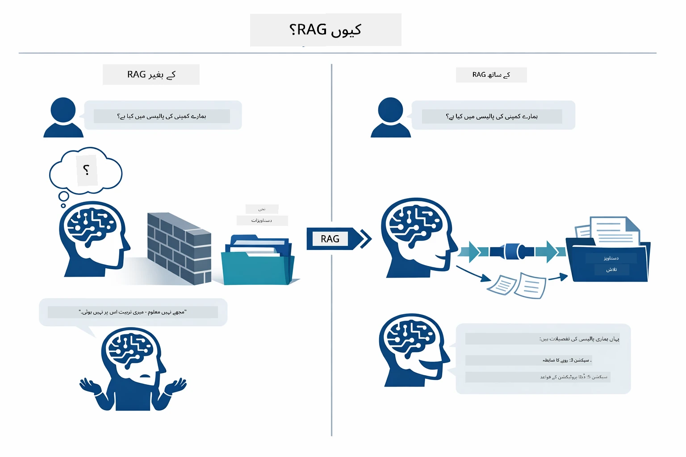
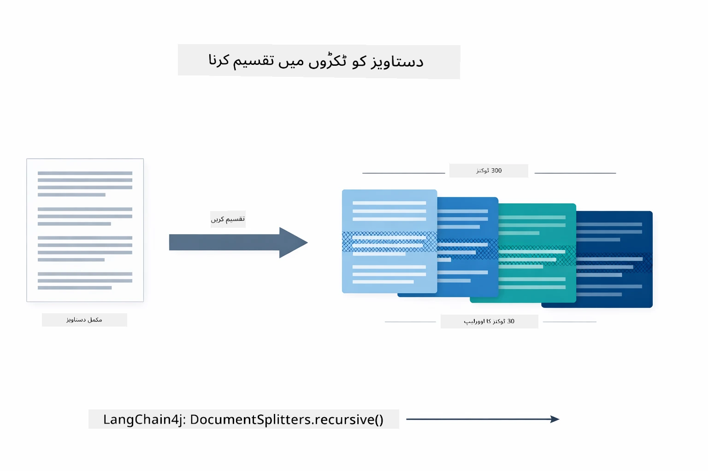
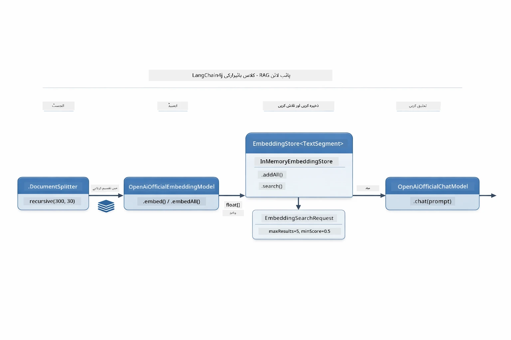
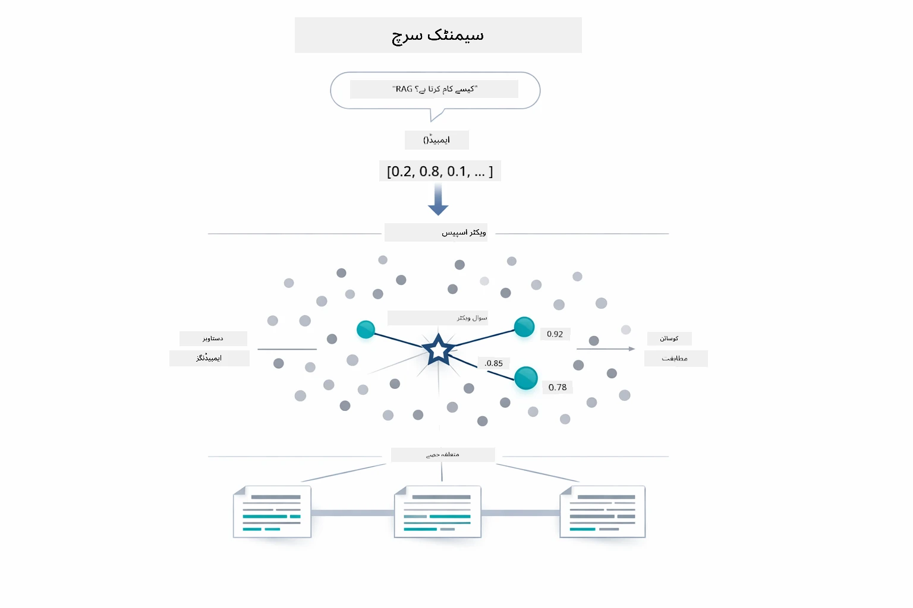
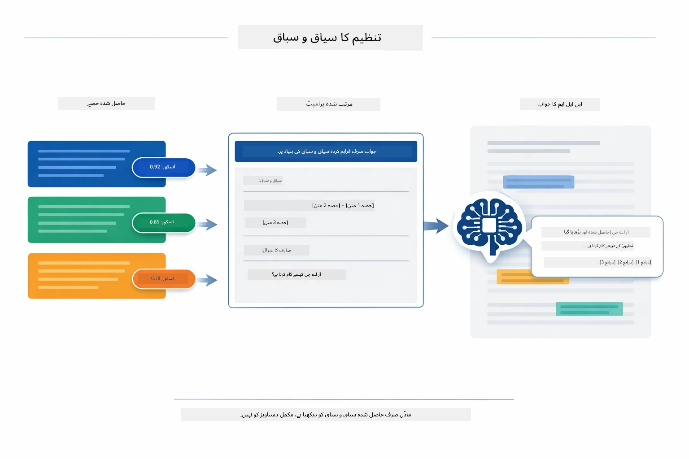
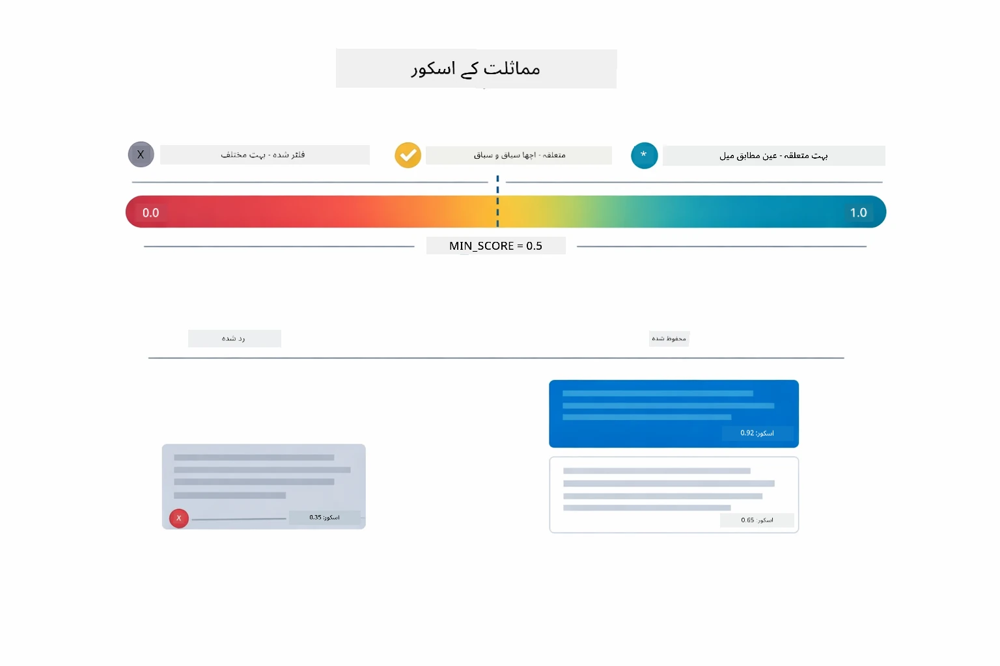
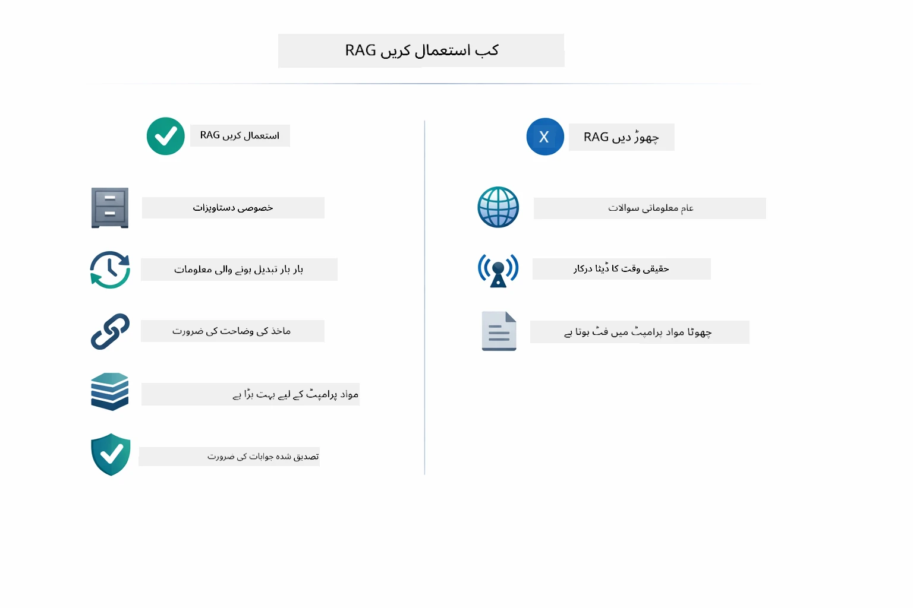

# ماڈیول 03: RAG (ریٹریول-اوگمینٹڈ جنریشن)

## جدولِ مضامین

- [آپ کیا سیکھیں گے](../../../03-rag)
- [RAG کو سمجھنا](../../../03-rag)
- [ضروریات](../../../03-rag)
- [یہ کیسے کام کرتا ہے](../../../03-rag)
  - [دستاویز کی پروسیسنگ](../../../03-rag)
  - [ایمبیڈنگز بنانا](../../../03-rag)
  - [معنوی تلاش](../../../03-rag)
  - [جواب کی تخلیق](../../../03-rag)
- [ایپلیکیشن چلائیں](../../../03-rag)
- [ایپلیکیشن کا استعمال](../../../03-rag)
  - [دستاویز اپ لوڈ کریں](../../../03-rag)
  - [سوالات پوچھیں](../../../03-rag)
  - [ذرائع کی جانچ کریں](../../../03-rag)
  - [سوالات کے ساتھ تجربہ کریں](../../../03-rag)
- [اہم تصورات](../../../03-rag)
  - [چنکنگ حکمت عملی](../../../03-rag)
  - [مشابہت سکورز](../../../03-rag)
  - [میموری میں اسٹوریج](../../../03-rag)
  - [سیاق و سباق ونڈو کا انتظام](../../../03-rag)
- [جب RAG اہم ہوتا ہے](../../../03-rag)
- [اگلے مراحل](../../../03-rag)

## آپ کیا سیکھیں گے

پچھلے ماڈیولز میں، آپ نے AI کے ساتھ بات چیت کرنا اور اپنے پرامپٹس کو مؤثر طریقے سے ترتیب دینا سیکھا۔ لیکن ایک بنیادی حد ہے: زبان کے ماڈلز صرف وہی جانتے ہیں جو انہوں نے تربیت کے دوران سیکھا۔ وہ آپ کی کمپنی کی پالیسیوں، آپ کے پروجیکٹ کی دستاویزات، یا ایسی معلومات کے بارے میں سوالات کا جواب نہیں دے سکتے جن پر انہوں نے تربیت نہیں پائی۔

RAG (ریٹریول-اوگمینٹڈ جنریشن) اس مسئلے کو حل کرتا ہے۔ ماڈل کو آپ کی معلومات سکھانے کی کوشش کرنے کے بجائے (جو مہنگا اور غیر عملی ہے)، آپ اسے اپنی دستاویزات میں تلاش کرنے کی صلاحیت دیتے ہیں۔ جب کوئی سوال پوچھتا ہے، تو سسٹم متعلقہ معلومات تلاش کرکے پرامپٹ میں شامل کرتا ہے۔ ماڈل پھر اس بازیافت شدہ سیاق و سباق کی بنیاد پر جواب دیتا ہے۔

RAG کو ایسے سمجھیں جیسے ماڈل کو ایک حوالہ جاتی کتب خانہ دیا جائے۔ جب آپ سوال پوچھتے ہیں، سسٹم:

1. **صارف کا سوال** - آپ سوال کرتے ہیں  
2. **ایمبیڈنگ** - آپ کے سوال کو ایک ویکٹر میں تبدیل کرتا ہے  
3. **ویکٹر سرچ** - ملتے جلتے دستاویزی چنکس تلاش کرتا ہے  
4. **سیاق و سباق کا مجموعہ** - متعلقہ چنکس کو پرامپٹ میں شامل کرتا ہے  
5. **جواب** - LLM سیاق و سباق کی بنیاد پر جواب تخلیق کرتا ہے  

یہ ماڈل کے جوابات کو آپ کے اصل ڈیٹا پر مبنی کرتا ہے، بجائے اس کے کہ وہ اپنی تربیت شدہ معلومات پر انحصار کرے یا جوابات بنا دے۔

## RAG کو سمجھنا

ذیل میں دیا گیا خاکہ بنیادی تصور کی نمائندگی کرتا ہے: ماڈل کی صرف تربیت شدہ معلومات پر انحصار کرنے کے بجائے، RAG اسے آپ کی دستاویزات کے حوالہ جاتی کتب خانے تک رسائی دیتا ہے تاکہ ہر جواب دینے سے پہلے وہ مشورہ کرے۔



یہاں دکھایا گیا ہے کہ تمام حصے کس طرح ایک دوسرے سے جڑے ہیں۔ صارف کے سوال کی چار مراحل سے گزر کر روانی ہوتی ہے — ایمبیڈنگ، ویکٹر سرچ، سیاق و سباق کا مجموعہ، اور جواب کی تخلیق — جو ایک دوسرے پر بنیاد رکھتے ہیں:


اس ماڈیول کے باقی حصے میں ہر مرحلے کو تفصیل سے بیان کیا جاتا ہے، جس میں آپ خود کوڈ چلا کر ترمیم بھی کر سکتے ہیں۔

## ضروریات

- ماڈیول 01 مکمل ہو چکا ہو (Azure OpenAI وسائل تعینات کیے گئے ہوں)  
- روٹ ڈائرکٹری میں `.env` فائل موجود ہو جس میں Azure کی اسناد ہوں (جو ماڈیول 01 میں `azd up` سے بنائی گئی ہو)  

> **نوٹ:** اگر آپ نے ماڈیول 01 مکمل نہیں کیا تو پہلے وہاں دی گئی تعیناتی کی ہدایات پر عمل کریں۔

## یہ کیسے کام کرتا ہے

### دستاویز کی پروسیسنگ

[DocumentService.java](../../../03-rag/src/main/java/com/example/langchain4j/rag/service/DocumentService.java)

جب آپ کوئی دستاویز اپ لوڈ کرتے ہیں، تو سسٹم اسے (PDF یا سادہ متن) پارس کرتا ہے، فائل نام جیسی میٹا ڈیٹا منسلک کرتا ہے، اور پھر اسے چنکس میں تقسیم کر دیتا ہے — چھوٹے حصے جو ماڈل کے سیاق و سباق کی ونڈو میں آسانی سے فٹ ہوتے ہیں۔ یہ چنکس معمولی حد تک اوورلیپ کرتے ہیں تاکہ آپ سیاق و سباق کو سرحدوں پر نہ کھوئیں۔

```java
// اپ لوڈ کی گئی فائل کو پارس کریں اور اسے LangChain4j دستاویز میں لپیٹیں
Document document = Document.from(content, metadata);

// 300 ٹوکن کے حصوں میں تقسیم کریں جس میں 30 ٹوکن کی اوورلیپ ہو
DocumentSplitter splitter = DocumentSplitters
    .recursive(300, 30);

List<TextSegment> segments = splitter.split(document);
```

ذیل کا خاکہ بصری طور پر دکھاتا ہے کہ یہ کیسے کام کرتا ہے۔ نوٹ کریں کہ ہر چنک اپنے ہمسایہ چنکس کے ساتھ کچھ ٹوکنز شیئر کرتا ہے — 30 ٹوکن کا اوورلیپ یقینی بناتا ہے کہ اہم سیاق و سباق درمیان میں نہ کھوئے:



> **🤖 [GitHub Copilot](https://github.com/features/copilot) چیٹ کے ساتھ آزمائیں:** [`DocumentService.java`](../../../03-rag/src/main/java/com/example/langchain4j/rag/service/DocumentService.java) کھولیں اور سوال پوچھیں:  
> - "LangChain4j دستاویزات کو چنکس میں کیسے تقسیم کرتا ہے اور اوورلیپ کیوں اہم ہے؟"  
> - "مختلف دستاویز کی اقسام کے لیے مثالی چنک سائز کیا ہے اور کیوں؟"  
> - "متعدد زبانوں یا خصوصی فارمیٹنگ والی دستاویزات کو کیسے ہینڈل کریں؟"

### ایمبیڈنگز بنانا

[LangChainRagConfig.java](../../../03-rag/src/main/java/com/example/langchain4j/rag/config/LangChainRagConfig.java)

ہر چنک کو ایک عددی نمائندگی میں تبدیل کیا جاتا ہے جسے ایمبیڈنگ کہتے ہیں — بنیادی طور پر ایک ریاضیاتی فنگر پرنٹ جو متن کے معنی کو پکڑتا ہے۔ ملتے جلتے متن ملتے جلتے ایمبیڈنگز پیدا کرتا ہے۔

```java
@Bean
public EmbeddingModel embeddingModel() {
    return OpenAiOfficialEmbeddingModel.builder()
        .baseUrl(azureOpenAiEndpoint)
        .apiKey(azureOpenAiKey)
        .modelName(azureEmbeddingDeploymentName)
        .build();
}

EmbeddingStore<TextSegment> embeddingStore = 
    new InMemoryEmbeddingStore<>();
```
  
ذیل میں دیا گیا کلاس کا خاکہ دکھاتا ہے کہ LangChain4j کے یہ اجزاء کیسے جڑے ہیں۔ `OpenAiOfficialEmbeddingModel` متن کو ویکٹرز میں تبدیل کرتا ہے، `InMemoryEmbeddingStore` ویکٹرز کو ان کے اصل `TextSegment` ڈیٹا کے ساتھ رکھتا ہے، اور `EmbeddingSearchRequest` بازیافت کے پیرامیٹرز جیسے کہ `maxResults` اور `minScore` کو کنٹرول کرتا ہے:



ایمبیڈنگز اسٹور ہونے کے بعد، مشابہ مواد قدرتی طور پر ویکٹر اسپیس میں قریب آ جاتا ہے۔ ذیل کی بصری تصویر دکھاتی ہے کہ کیسے متعلقہ موضوعات پر دستاویزات قریبی پوائنٹس کی صورت میں جمع ہو جاتی ہیں، یہی معنوی تلاش کو ممکن بناتا ہے:


### معنوی تلاش

[RagService.java](../../../03-rag/src/main/java/com/example/langchain4j/rag/service/RagService.java)

جب آپ سوال پوچھتے ہیں، تو آپ کا سوال بھی ایک ایمبیڈنگ بن جاتا ہے۔ سسٹم آپ کے سوال کی ایمبیڈنگ کو تمام دستاویزی چنکس کی ایمبیڈنگز سے موازنہ کرتا ہے۔ یہ سب سے زیادہ معنی خیز چنکس تلاش کرتا ہے — نہ صرف کی ورڈ ملتے ہیں، بلکہ حقیقی معنوی مشابہت کو۔

```java
Embedding queryEmbedding = embeddingModel.embed(question).content();

EmbeddingSearchRequest searchRequest = EmbeddingSearchRequest.builder()
    .queryEmbedding(queryEmbedding)
    .maxResults(5)
    .minScore(0.5)
    .build();

EmbeddingSearchResult<TextSegment> searchResult = embeddingStore.search(searchRequest);
List<EmbeddingMatch<TextSegment>> matches = searchResult.matches();

for (EmbeddingMatch<TextSegment> match : matches) {
    String relevantText = match.embedded().text();
    double score = match.score();
}
```
  
ذیل کا خاکہ معنوی تلاش کا موازنہ روایتی کی ورڈ تلاش سے کرتا ہے۔ "vehicle" کے لیے کی ورڈ تلاش "cars and trucks" والے چنک کو نہیں ڈھونڈ پاتی، لیکن معنوی تلاش سمجھتی ہے کہ وہ ایک ہی معنی رکھتے ہیں اور اسے اعلیٰ سکورز کے ساتھ واپس کرتی ہے:



> **🤖 [GitHub Copilot](https://github.com/features/copilot) چیٹ کے ساتھ آزمائیں:** [`RagService.java`](../../../03-rag/src/main/java/com/example/langchain4j/rag/service/RagService.java) کھولیں اور سوال کریں:  
> - "ایمبیڈنگز کے ساتھ مشابہت تلاش کیسے کام کرتی ہے اور سکور کیا فیصلہ کرتا ہے؟"  
> - "کس مشابہت درجے کا استعمال کروں اور یہ نتایج کو کیسے متاثر کرتا ہے؟"  
> - "جب کوئی متعلقہ دستاویزات نہ ملیں تو کیا کریں؟"

### جواب کی تخلیق

[RagService.java](../../../03-rag/src/main/java/com/example/langchain4j/rag/service/RagService.java)

سب سے زیادہ متعلقہ چنکس کو ایک منظم پرامپٹ میں جمع کیا جاتا ہے جس میں واضح ہدایات، بازیافت شدہ سیاق و سباق، اور صارف کا سوال شامل ہوتا ہے۔ ماڈل ان مخصوص چنکس کو پڑھ کر اس معلومات کی بنیاد پر جواب دیتا ہے — یہ صرف سامنے موجود مواد استعمال کر سکتا ہے، جو کہ ہالوسینیشن کو روکتا ہے۔

```java
String context = matches.stream()
    .map(match -> match.embedded().text())
    .collect(Collectors.joining("\n\n"));

String prompt = String.format("""
    Answer the question based on the following context.
    If the answer cannot be found in the context, say so.

    Context:
    %s

    Question: %s

    Answer:""", context, request.question());

String answer = chatModel.chat(prompt);
```
  
ذیل کا خاکہ اس اسمبلی کو دکھاتا ہے — سرچ قدم سے سب سے زیادہ سکور والے چنکس پرامپٹ ٹیمپلیٹ میں ڈالے جاتے ہیں، اور `OpenAiOfficialChatModel` ایک بنیاد شدہ جواب پیدا کرتا ہے:



## ایپلیکیشن چلائیں

**تعیناتی کی تصدیق کریں:**

یقین دہانی کریں کہ روٹ ڈائرکٹری میں `.env` فائل موجود ہے جس میں Azure کی اسناد ہوں (جو ماڈیول 01 کے دوران بنائی گئی تھیں):  
```bash
cat ../.env  # ظاہر کرنا چاہیے AZURE_OPENAI_ENDPOINT، API_KEY، DEPLOYMENT
```
  

**ایپلیکیشن شروع کریں:**

> **نوٹ:** اگر آپ نے ماڈیول 01 میں `./start-all.sh` کے ذریعے تمام ایپلیکیشنز شروع کر رکھی ہیں، تو یہ ماڈیول پہلے ہی پورٹ 8081 پر چل رہا ہے۔ آپ نیچے کے شروع کرنے کے کمانڈز چھوڑ کر سیدھا http://localhost:8081 پر جا سکتے ہیں۔

**اختیار 1: Spring Boot ڈیش بورڈ کا استعمال (VS Code صارفین کے لیے سفارش کردہ)**

ڈیولپمنٹ کنٹینر میں Spring Boot ڈیش بورڈ ایکسٹینشن شامل ہے، جو تمام Spring Boot ایپلیکیشنز کو مینیج کرنے کے لیے بصری انٹرفیس مہیا کرتا ہے۔ یہ VS Code کے بائیں جانب ایکٹیویٹی بار میں Spring Boot آئیکون کے پاس مل جائے گا۔

Spring Boot ڈیش بورڈ سے آپ:  
- ورک اسپیس میں موجود تمام Spring Boot ایپلیکیشنز دیکھ سکتے ہیں  
- ایک کلک سے ایپلیکیشنز شروع/روک سکتے ہیں  
- ایپلیکیشن کے لاگز حقیقی وقت میں دیکھ سکتے ہیں  
- ایپلیکیشن کی حالت مانیٹر کر سکتے ہیں

صرف "rag" کے سامنے پلے بٹن پر کلک کریں تاکہ یہ ماڈیول شروع ہو، یا تمام ماڈیولز کو ایک ساتھ شروع کریں۔


**اختیار 2: شیل اسکرپٹس کا استعمال**

تمام ویب ایپلیکیشنز (ماڈیولز 01-04) شروع کریں:

**بش (Bash):**  
```bash
cd ..  # سے جڑ ڈائریکٹری
./start-all.sh
```


**پاور شیل (PowerShell):**  
```powershell
cd ..  # جڑ ڈائریکٹری سے
.\start-all.ps1
```


یا صرف یہ ماڈیول شروع کریں:

**بش (Bash):**  
```bash
cd 03-rag
./start.sh
```


**پاور شیل (PowerShell):**  
```powershell
cd 03-rag
.\start.ps1
```


دونوں اسکرپٹس خود بخود روٹ `.env` فائل سے ماحولیات کی قدریں لوڈ کرتے ہیں اور اگر JARs موجود نہیں ہیں تو انہیں بنائیں گے۔

> **نوٹ:** اگر آپ شروع کرنے سے پہلے تمام ماڈیولز دستی طور پر بنانا چاہتے ہیں:  
>
> **بش:**  
> ```bash
> cd ..  # Go to root directory
> mvn clean package -DskipTests
> ```
  
> **پاور شیل:**  
> ```powershell
> cd ..  # Go to root directory
> mvn clean package -DskipTests
> ```


اپنے براؤزر میں http://localhost:8081 کھولیں۔

**رکنے کے لیے:**

**بش:**  
```bash
./stop.sh  # صرف یہ ماڈیول
# یا
cd .. && ./stop-all.sh  # تمام ماڈیولز
```


**پاور شیل:**  
```powershell
.\stop.ps1  # یہ ماڈیول صرف
# یا
cd ..; .\stop-all.ps1  # تمام ماڈیولز
```


## ایپلیکیشن کا استعمال

یہ ایپلیکیشن دستاویزات اپ لوڈ کرنے اور سوالات پوچھنے کے لیے ویب انٹرفیس فراہم کرتی ہے۔

<a href="images/rag-homepage.png"></a>

*RAG ایپلیکیشن انٹرفیس - دستاویزات اپ لوڈ کریں اور سوالات پوچھیں*

### دستاویز اپ لوڈ کریں

شروع کریں ایک دستاویز اپ لوڈ کر کے — TXT فائلیں ٹیسٹنگ کے لیے بہترین کام کرتی ہیں۔ اس ڈائریکٹری میں ایک `sample-document.txt` موجود ہے جس میں LangChain4j کی خصوصیات، RAG نفاذ، اور بہترین طریقے شامل ہیں — سسٹم کی ٹیسٹنگ کے لیے بہترین۔

سسٹم آپ کی دستاویز کو پروسیس کرتا ہے، اسے چنکس میں توڑتا ہے، اور ہر چنک کے لیے ایمبیڈنگز بناتا ہے۔ یہ سب آپ کے اپلوڈ کرنے پر خودکار طور پر ہوتا ہے۔

### سوالات پوچھیں

اب دستاویز کے مواد کے بارے میں مخصوص سوالات کریں۔ ایسا کچھ آزما کریں جو دستاویز میں واضح طور پر درج ہو۔ سسٹم متعلقہ چنکس تلاش کرتا ہے، انہیں پرامپٹ میں شامل کرتا ہے، اور جواب تخلیق کرتا ہے۔

### ذرائع کی جانچ کریں

نوٹ کریں کہ ہر جواب میں ماخذ کے حوالے اور مشابہت کے سکورز شامل ہوتے ہیں۔ یہ سکورز (0 سے 1 کے درمیان) دکھاتے ہیں کہ ہر چنک آپ کے سوال سے کتنا متعلقہ تھا۔ زیادہ سکورز بہتر میچز کو ظاہر کرتے ہیں۔ یہ آپ کو جواب کو ماخذ کے ساتھ تصدیق کرنے دیتے ہیں۔

<a href="images/rag-query-results.png"></a>

*سوال کے نتائج میں جواب ماخذ کے حوالے اور مطابقت کے سکورز کے ساتھ دکھایا گیا ہے*

### سوالات کے ساتھ تجربہ کریں

مختلف اقسام کے سوالات آزمائیں:  
- مخصوص حقائق: "اہم موضوع کیا ہے؟"  
- موازنہ: "X اور Y میں کیا فرق ہے؟"  
- خلاصے: "Z کے بارے میں اہم نکات کا خلاصہ کریں"  

دیکھیں کہ مشابہت کے سکور کس طرح تبدیل ہوتے ہیں اس بات پر کہ آپ کا سوال دستاویز کے مواد سے کتنا میل کھاتا ہے۔

## اہم تصورات

### چنکنگ حکمت عملی

دستاویزات کو 300-ٹوکن چنکس میں تقسیم کیا جاتا ہے جن میں 30 ٹوکن کا اوورلیپ ہوتا ہے۔ یہ توازن یقینی بناتا ہے کہ ہر چنک کے پاس معنی خیز سیاق و سباق ہو جبکہ پرامپٹ میں کئی چنکس شامل کیے جا سکیں۔

### مشابہت سکورز

ہر بازیافت شدہ چنک کے ساتھ 0 سے 1 کے درمیان ایک مشابہت سکور ہوتا ہے جو صارف کے سوال سے اس کی نزدیکی کی نشاندہی کرتا ہے۔ ذیل میں سکور کی حدوں کی بصری تصویر اور سسٹم ان کو کیسے فلٹر کرتا ہے دکھایا گیا ہے:



سکور کی حدیں:  
- 0.7-1.0: انتہائی متعلقہ، عین مطابق میچ  
- 0.5-0.7: متعلقہ، اچھا سیاق و سباق  
- 0.5 سے کم: فلٹر کیے گئے، بہت مختلف  

سسٹم صرف کم از کم حد سے اوپر کے چنکس ہی لاتا ہے تاکہ معیار یقینی ہو۔

### میموری میں اسٹوریج

یہ ماڈیول سادگی کے لیے میموری میں اسٹوریج استعمال کرتا ہے۔ ایپلیکیشن دوبارہ شروع کرنے پر اپ لوڈ کی گئی دستاویزات ختم ہو جاتی ہیں۔ پروڈکشن سسٹمز مستقل ویکٹر ڈیٹا بیس مثلاً Qdrant یا Azure AI سرچ استعمال کرتے ہیں۔

### سیاق و سباق ونڈو کا انتظام

ہر ماڈل کی زیادہ سے زیادہ سیاق و سباق کی ونڈو ہوتی ہے۔ آپ ایک بڑے دستاویز سے ہر چنک شامل نہیں کر سکتے۔ سسٹم سب سے زیادہ متعلقہ N چنکس (ڈیفالٹ 5) لاتا ہے تاکہ حدوں میں رہتے ہوئے جواب دینے کے لیے کافی سیاق و سباق فراہم کیا جا سکے۔

## جب RAG اہم ہوتا ہے

RAG ہمیشہ مناسب نہیں ہوتا۔ ذیل میں فیصلہ سازی کا گائیڈ ہے جو آپ کی مدد کرتا ہے کہ کب RAG کا استعمال فائدے مند ہے اور کب سادہ طریقے — جیسے مواد کو براہ راست پرامپٹ میں شامل کرنا یا ماڈل کے اندر موجود معلومات پر انحصار کرنا — کافی ہیں:



**RAG اس وقت استعمال کریں جب:**
- مالکانہ دستاویزات کے بارے میں سوالات کے جواب دینا  
- معلومات باقاعدگی سے بدلتی رہتی ہیں (پالیسیاں، قیمتیں، وضاحتیں)  
- درستگی کے لیے ماخذ کا حوالہ ضروری ہے  
- مواد بہت زیادہ ہے کہ ایک ہی پرامپٹ میں فٹ ہو  
- آپ کو قابل تصدیق، بنیاد پر مبنی جوابات کی ضرورت ہے  

**RAG استعمال نہ کریں جب:**  
- سوالات ایسے عمومی علم کے بارے میں ہوں جو ماڈل کے پاس پہلے ہی ہو  
- حقیقی وقت کے ڈیٹا کی ضرورت ہو (RAG اپلوڈ شدہ دستاویزات پر کام کرتا ہے)  
- مواد پرامپٹس میں براہ راست شامل کرنے کے لیے کافی چھوٹا ہو  

## اگلے مراحل  

**اگلا ماڈیول:** [04-tools - AI Agents with Tools](../04-tools/README.md)  

---  

**نیویگیشن:** [← پچھلا: ماڈیول 02 - پرامپٹ انجینئرنگ](../02-prompt-engineering/README.md) | [مرکزی صفحہ پر واپس](../README.md) | [اگلا: ماڈیول 04 - ٹولز →](../04-tools/README.md)

---

<!-- CO-OP TRANSLATOR DISCLAIMER START -->
**انسداد ذمہ داری**:  
یہ دستاویز AI ترجمہ سروس [Co-op Translator](https://github.com/Azure/co-op-translator) کے ذریعے ترجمہ کی گئی ہے۔ اگرچہ ہم درستگی کے لیے کوشاں ہیں، براہ کرم اس بات سے آگاہ رہیں کہ خودکار ترجمے میں غلطیاں یا عدم درستگیاں ہو سکتی ہیں۔ اصل دستاویز اپنی مادری زبان میں معتبر ماخذ سمجھی جانی چاہیے۔ اہم معلومات کے لیے پیشہ ور انسانی ترجمہ تجویز کیا جاتا ہے۔ اس ترجمے کے استعمال سے پیدا ہونے والی کسی بھی غلط فہمی یا غلط تشریح کی ذمہ داری ہم پر عائد نہیں ہوتی۔
<!-- CO-OP TRANSLATOR DISCLAIMER END -->