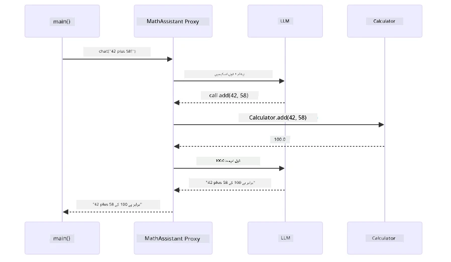
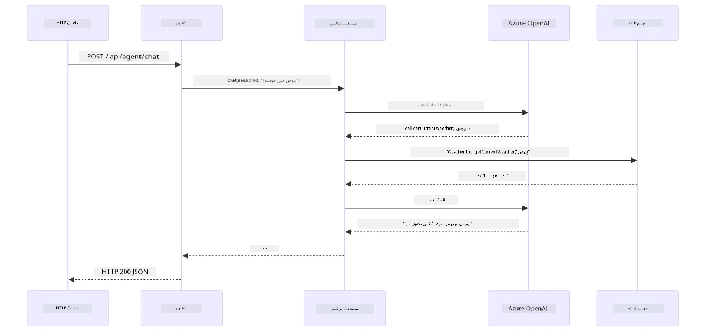

# ماڈیول 04: ٹولز کے ساتھ AI ایجنٹس

## فہرست مضامین

- [ویڈیو واک تھرو](../../../04-tools)
- [آپ کیا سیکھیں گے](../../../04-tools)
- [ضروریات](../../../04-tools)
- [ٹولز کے ساتھ AI ایجنٹس کو سمجھنا](../../../04-tools)
- [ٹول کالنگ کیسے کام کرتی ہے](../../../04-tools)
  - [ٹول کی وضاحتیں](../../../04-tools)
  - [فیصلہ سازی](../../../04-tools)
  - [عمل درآمد](../../../04-tools)
  - [ردعمل تخلیق](../../../04-tools)
  - [آرکیٹیکچر: اسپرنگ بوٹ آٹو وائرنگ](../../../04-tools)
- [ٹول چیننگ](../../../04-tools)
- [ایپلیکیشن چلائیں](../../../04-tools)
- [ایپلیکیشن استعمال کرنا](../../../04-tools)
  - [سادہ ٹول کا استعمال آزمائیں](../../../04-tools)
  - [ٹول چیننگ کی جانچ کریں](../../../04-tools)
  - [گفتگو کے بہاؤ کو دیکھیں](../../../04-tools)
  - [مختلف درخواستوں کے ساتھ تجربہ کریں](../../../04-tools)
- [اہم تصورات](../../../04-tools)
  - [ری ایکٹ پیٹرن (منطق اور عمل)](../../../04-tools)
  - [ٹول کی وضاحتیں اہمیت رکھتی ہیں](../../../04-tools)
  - [سیشن مینجمنٹ](../../../04-tools)
  - [خرابیوں کا انتظام](../../../04-tools)
- [دستیاب ٹولز](../../../04-tools)
- [ٹول بیسڈ ایجنٹس کب استعمال کریں](../../../04-tools)
- [ٹولز بمقابلہ RAG](../../../04-tools)
- [اگلے اقدامات](../../../04-tools)

## ویڈیو واک تھرو

اس لائیو سیشن کو دیکھیں جو اس ماڈیول کے ساتھ شروع کرنے کا طریقہ بتاتا ہے:

<a href="https://www.youtube.com/watch?v=O_J30kZc0rw"></a>

## آپ کیا سیکھیں گے

اب تک، آپ نے سیکھا ہے کہ AI کے ساتھ گفتگو کیسے کی جائے، مؤثر پرامپٹس کیسے بنائیں، اور جوابات کو اپنے دستاویزات میں کیسے مرتب کریں۔ لیکن ایک بنیادی محدودیت ابھی بھی موجود ہے: زبان کے ماڈل صرف متن پیدا کر سکتے ہیں۔ وہ موسم کا حال چیک نہیں کر سکتے، حسابات نہیں کر سکتے، ڈیٹا بیس سے سوالات نہیں کر سکتے، یا بیرونی نظاموں سے تعامل نہیں کر سکتے۔

ٹولز اسے بدل دیتے ہیں۔ جب ماڈل کو ایسے فنکشنز تک رسائی دی جاتی ہے جنہیں وہ کال کر سکتا ہے، تو آپ اسے ایک ٹیکسٹ جنریٹر سے ایک ایجنٹ میں بدل دیتے ہیں جو کارروائی کر سکتا ہے۔ ماڈل فیصلہ کرتا ہے کہ اسے کب ٹول کی ضرورت ہے، کون سا ٹول استعمال کرنا ہے، اور کون سے پیرامیٹرز پاس کرنے ہیں۔ آپ کا کوڈ فنکشن کو چلائے گا اور نتیجہ واپس کرے گا۔ ماڈل اس نتیجے کو اپنے جواب میں شامل کر لیتا ہے۔

## ضروریات

- مکمل شدہ [ماڈیول 01 - تعارف](../01-introduction/README.md) (Azure OpenAI وسائل تعینات کیے گئے)
- پچھلے ماڈیولز کی سفارش کی گئی ہے (یہ ماڈیول ریفرنس کرتا ہے [RAG تصورات ماڈیول 03 سے](../03-rag/README.md) ٹولز بمقابلہ RAG موازنہ میں)
- `.env` فائل روٹ ڈائریکٹری میں Azure کی اسناد کے ساتھ (جو `azd up` نے ماڈیول 01 میں بنائی)

> **نوٹ:** اگر آپ نے ماڈیول 01 مکمل نہیں کیا تو پہلے وہاں دی گئی تعیناتی کی ہدایات پر عمل کریں۔

## ٹولز کے ساتھ AI ایجنٹس کو سمجھنا

> **📝 نوٹ:** اس ماڈیول میں "ایجنٹس" کا مطلب AI معاونین ہیں جو ٹول کالنگ کی خصوصیات کے ساتھ بہتر بنائے گئے ہیں۔ یہ **Agentic AI** پیٹرنز (آزاد ایجنٹس جن میں منصوبہ بندی، یادداشت، اور کثیر مرحلہ منطق ہوتی ہے) سے مختلف ہے، جن کا احاطہ ہم [ماڈیول 05: MCP](../05-mcp/README.md) میں کریں گے۔

ٹولز کے بغیر، زبان کا ماڈل صرف اپنے تربیتی ڈیٹا سے متن پیدا کر سکتا ہے۔ اگر آپ موسم کا حال پوچھیں، تو اسے اندازہ لگانا پڑتا ہے۔ ٹولز دیں، اور یہ موسم کی API کال کر سکتا ہے، حسابات کر سکتا ہے، یا ڈیٹا بیس سے سوالات کر سکتا ہے — پھر ان حقیقی نتائج کو اپنے جواب میں بُنتا ہے۔


*بغیر ٹولز کے ماڈل صرف اندازہ لگا سکتا ہے — ٹولز کے ساتھ یہ APIs کال کر سکتا ہے، حسابات چلا سکتا ہے، اور حقیقی وقت کا ڈیٹا واپس کر سکتا ہے۔*

ٹولز کے ساتھ AI ایجنٹ ایک **ریزننگ اور ایکٹنگ (ReAct)** پیٹرن پر عمل کرتا ہے۔ ماڈل صرف جواب نہیں دیتا — یہ سوچتا ہے کہ اسے کیا چاہیے، ایک ٹول کال کر کے عمل کرتا ہے، نتیجہ دیکھتا ہے، اور پھر فیصلہ کرتا ہے کہ دوبارہ عمل کرے یا حتمی جواب دے:

1. **سمجھنا** — ایجنٹ صارف کے سوال کا تجزیہ کرتا ہے اور معلوم کرتا ہے کہ اسے کس معلومات کی ضرورت ہے
2. **عمل کرنا** — ایجنٹ درست ٹول کا انتخاب کرتا ہے، صحیح پیرامیٹرز تیار کرتا ہے، اور اسے کال کرتا ہے
3. **مشاہدہ کرنا** — ایجنٹ ٹول کے آؤٹ پٹ کو وصول کرتا ہے اور نتیجہ کا جائزہ لیتا ہے
4. **دہرائیں یا جواب دیں** — اگر مزید ڈیٹا درکار ہو تو ایجنٹ لوپ میں جاتا ہے؛ ورنہ قدرتی زبان میں جواب ترتیب دیتا ہے


*ری ایکٹ سائیکل — ایجنٹ سوچتا ہے کہ کیا کرنا ہے، ٹول کال کر کے عمل کرتا ہے، نتیجہ مشاہدہ کرتا ہے، اور جب تک حتمی جواب فراہم نہ کرے لوپ کرتا ہے۔*

یہ چیز خودکار طور پر ہوتی ہے۔ آپ ٹولز اور ان کی وضاحتیں ڈیفائن کرتے ہیں۔ ماڈل فیصلہ سازی کرتا ہے کہ کب اور کیسے انہیں استعمال کرنا ہے۔

## ٹول کالنگ کیسے کام کرتی ہے

### ٹول کی وضاحتیں

[WeatherTool.java](../../../04-tools/src/main/java/com/example/langchain4j/agents/tools/WeatherTool.java) | [TemperatureTool.java](../../../04-tools/src/main/java/com/example/langchain4j/agents/tools/TemperatureTool.java)

آپ فنکشنز واضح وضاحتوں اور پیرامیٹر کی تفصیلات کے ساتھ ڈیفائن کرتے ہیں۔ ماڈل یہ وضاحتیں اپنے سسٹم پرامپٹ میں دیکھتا ہے اور سمجھتا ہے کہ ہر ٹول کیا کرتا ہے۔

```java
@Component
public class WeatherTool {
    
    @Tool("Get the current weather for a location")
    public String getCurrentWeather(@P("Location name") String location) {
        // آپ کا موسم تلاش کرنے کا منطق
        return "Weather in " + location + ": 22°C, cloudy";
    }
}

@AiService
public interface Assistant {
    String chat(@MemoryId String sessionId, @UserMessage String message);
}

// اسسٹنٹ Spring Boot کے ذریعے خودکار طریقے سے منسلک ہے:
// - ChatModel bean
// - @Component کلاسوں سے تمام @Tool طریقے
// - سیشن مینجمنٹ کے لیے ChatMemoryProvider
```

ذیل میں دیا گیا خاکہ ہر اینوٹیشن کو توڑ کر دکھاتا ہے اور یہ کہ ہر حصہ AI کو کب ٹول کال کرنا ہے اور کن ارگومنٹس کو پاس کرنا ہے سمجھانے میں کیسے مدد کرتا ہے:


*ٹول کی وضاحت کی ساخت — @Tool AI کو بتاتا ہے کب اسے استعمال کرنا ہے، @P ہر پیرامیٹر کی وضاحت کرتا ہے، اور @AiService سب کچھ اسٹارٹ اپ پر وائر کرتا ہے۔*

> **🤖 [GitHub Copilot](https://github.com/features/copilot) چیٹ کے ساتھ آزمائیں:** [`WeatherTool.java`](../../../04-tools/src/main/java/com/example/langchain4j/agents/tools/WeatherTool.java) کھولیں اور پوچھیں:
> - "کیا میں حقیقی موسم API جیسے OpenWeatherMap کو جعلی ڈیٹا کی جگہ کیسے انٹیگریٹ کروں گا؟"
> - "ایک اچھی ٹول وضاحت کیا ہوتی ہے جو AI کو اسے صحیح طریقے سے استعمال کرنے میں مدد دے؟"
> - "ٹول کی عمل درآمد میں API کی خامیوں اور ریٹ لیمٹس کو کیسے سنبھالیں؟"

### فیصلہ سازی

جب صارف پوچھتا ہے "سیئیٹل میں موسم کیسا ہے؟"، تو ماڈل تصادفی طور پر کوئی ٹول منتخب نہیں کرتا۔ یہ صارف کے ارادے کو ہر دستیاب ٹول کی وضاحت سے موازنہ کرتا ہے، ہر ایک کو مطابقت کے لیے اسکور کرتا ہے، اور بہترین میچ منتخب کرتا ہے۔ پھر یہ صحیح پیرامیٹرز کے ساتھ ایک ساختہ فنکشن کال جنریٹ کرتا ہے — اس معاملے میں `location` کو `"Seattle"` پر سیٹ کرتے ہوئے۔

اگر صارف کی درخواست کے لیے کوئی ٹول میچ نہ ہو، تو ماڈل اپنے علم سے جواب دیتا ہے۔ اگر متعدد ٹولز میچ کریں، تو یہ سب سے مخصوص کو چنتا ہے۔


*ماڈل ہر دستیاب ٹول کو صارف کے ارادے کے مقابلے میں جانچتا ہے اور بہترین میچ منتخب کرتا ہے — اسی لیے واضح اور مخصوص ٹول کی وضاحت لکھنا اہم ہے۔*

### عمل درآمد

[AgentService.java](../../../04-tools/src/main/java/com/example/langchain4j/agents/service/AgentService.java)

اسپرنگ بوٹ ڈیکلیرایٹو `@AiService` انٹرفیس کو تمام رجسٹرڈ ٹولز کے ساتھ خودکار طور پر وائر کرتا ہے، اور LangChain4j خودکار طور پر ٹول کالز کو انجام دیتا ہے۔ پردے کے پیچھے، مکمل ٹول کال چھ مراحل سے گزرتی ہے — صارف کے قدرتی زبان کے سوال سے لے کر قدرتی زبان کے جواب تک:


*انتہائی بہاؤ — صارف سوال پوچھتا ہے، ماڈل ٹول منتخب کرتا ہے، LangChain4j اسے چلاتا ہے، اور ماڈل نتیجہ قدرتی جواب میں شامل کرتا ہے۔*

اگر آپ نے [ToolIntegrationDemo](../../../00-quick-start/src/main/java/com/example/langchain4j/quickstart/ToolIntegrationDemo.java) ماڈیول 00 میں چلایا ہے، تو آپ نے یہ پیٹرن پہلے ہی دیکھا ہے — `Calculator` ٹولز بالکل اسی طرح کال ہوتے تھے۔ نیچے دیا گیا سیکوئنس ڈایاگرام اس ڈیمو کے دوران جو کچھ ہوا بالکل دکھاتا ہے:



*کوئیک اسٹارٹ ڈیمو سے ٹول کالنگ لوپ — `AiServices` آپ کا پیغام اور ٹول سکیمز LLM کو بھیجتا ہے، LLM ایک فنکشن کال جیسے `add(42, 58)` جواب دیتا ہے، LangChain4j `Calculator` میتھڈ لوکل چلائے گا، اور نتیجہ واپس حتمی جواب کے لیے دیتا ہے۔*

> **🤖 [GitHub Copilot](https://github.com/features/copilot) چیٹ کے ساتھ آزمائیں:** [`AgentService.java`](../../../04-tools/src/main/java/com/example/langchain4j/agents/service/AgentService.java) کھولیں اور پوچھیں:
> - "ری ایکٹ پیٹرن کیسے کام کرتا ہے اور یہ AI ایجنٹس کے لیے کیوں مؤثر ہے؟"
> - "ایجنٹ فیصلہ کیسے کرتا ہے کہ کون سا ٹول استعمال کرنا ہے اور کس ترتیب میں؟"
> - "اگر ٹول کا عمل درآمد ناکام ہو جائے تو کیا ہوتا ہے — میں غلطیوں کو کیسے بہتر طریقے سے ہینڈل کروں؟"

### ردعمل تخلیق

ماڈل موسم کا ڈیٹا وصول کرتا ہے اور اسے صارف کے لیے قدرتی زبان میں جواب میں تبدیل کرتا ہے۔

### آرکیٹیکچر: اسپرنگ بوٹ آٹو وائرنگ

یہ ماڈیول LangChain4j کی اسپرنگ بوٹ انٹیگریشن استعمال کرتا ہے، جو ڈیکلیرایٹو `@AiService` انٹرفیس کے ساتھ ہے۔ اسٹارٹ اپ پر، اسپرنگ بوٹ ہر وہ `@Component` تلاش کرتا ہے جس میں `@Tool` میتھڈز ہوں، آپ کا `ChatModel` بین، اور `ChatMemoryProvider` — پھر ان سب کو ایک `Assistant` انٹرفیس میں بغیر کسی بقاوت کے جوڑ دیتا ہے۔


*@AiService انٹرفیس ChatModel، ٹول کمپونینٹس، اور میموری پرووائیڈر کو آپس میں جوڑتا ہے — اسپرنگ بوٹ تمام وائرنگ خود بخود سنبھالتا ہے۔*

یہاں مکمل درخواست کے لائف سائیکل کا سیکوئنس ڈایاگرام ہے — HTTP درخواست سے لے کر کنٹرولر، سروس، آٹو وائرڈ پراکسی، اور پھر ٹول کے عمل درآمد اور واپس:



*مکمل اسپرنگ بوٹ درخواست کا لائف سائیکل — HTTP درخواست کنٹرولر اور سروس سے گزر کر آٹو وائرڈ Assistant پراکسی تک پہنچتی ہے، جو LLM اور ٹول کالز کو خودکار طور پر منظم کرتا ہے۔*

اس طریقہ کار کے اہم فوائد:

- **اسپرنگ بوٹ آٹو وائرنگ** — ChatModel اور ٹولز خودکار طور پر داخل کردہ
- **@MemoryId پیٹرن** — خودکار سیشن بیسڈ میموری مینجمنٹ
- **سنگل انسٹینس** — Assistant صرف ایک بار بنائی جاتی ہے اور بہتر کارکردگی کے لیے دوبارہ استعمال
- **ٹائپ سیف ایکزیکیوشن** — جاوا میتھڈز براہ راست ٹائپ کنورژن کے ساتھ کال کیے جاتے ہیں
- **کثیر مرحلہ آراستگی** — خودکار طریقے سے ٹول چیننگ کو ہینڈل کرتا ہے
- **زیرو بویلر پلیٹ** — کوئی دستی `AiServices.builder()` کالز یا میموری ہیش میپ کی ضرورت نہیں

متبادل طریقے (دستی `AiServices.builder()`) میں زیادہ کوڈ کی ضرورت ہوتی ہے اور اسپرنگ بوٹ انٹیگریشن کے فوائد کھو جاتے ہیں۔

## ٹول چیننگ

**ٹول چیننگ** — ٹول بیسڈ ایجنٹس کی حقیقی طاقت اس وقت دکھائی دیتی ہے جب ایک سوال متعدد ٹولز کا تقاضا کرتا ہو۔ اگر پوچھیں "سیئیٹل میں فیرن ہائیٹ میں موسم کیسا ہے؟"، تو ایجنٹ خود بخود دو ٹولز کو چین کرتا ہے: پہلے یہ `getCurrentWeather` کال کرتا ہے تاکہ سیلسیس میں درجہ حرارت حاصل کرے، پھر اس ویلیو کو `celsiusToFahrenheit` میں پاس کرتا ہے تاکہ تبدیلی ہو — یہ سب ایک ہی گفتگو کے دور میں ہوتا ہے۔


*ٹول چیننگ عمل میں — ایجنٹ پہلے getCurrentWeather کال کرتا ہے، پھر سیلسیس کا نتیجہ celsiusToFahrenheit میں پاس کرتا ہے، اور مربوط جواب دیتا ہے۔*

**نرمی سے خرابی کا سامنا** — اگر آپ کسی ایسے شہر کا موسم مانگیں جو جعلی ڈیٹا میں نہیں ہے، تو ٹول ایک ایرر میسج واپس کرتا ہے، اور AI وضاحت کرتا ہے کہ یہ مدد نہیں کر سکتا بجائے اس کے کہ ایپلیکیشن کریش ہو جائے۔ ٹول محفوظ طریقے سے ناکام ہوتے ہیں۔ ذیل میں دیا گیا خاکہ دونوں طریقوں کا موازنہ کرتا ہے — درست ایرر ہینڈلنگ کے ساتھ ایجنٹ استثناء پکڑ لیتا ہے اور مددگار جواب دیتا ہے، جبکہ بغیر اس کے پورا ایپلیکیشن کریش ہو جاتا ہے:


*جب ٹول ناکام ہو جاتا ہے، تو ایجنٹ غلطی کو پکڑ کر مددگار وضاحت کے ساتھ جواب دیتا ہے بجائے کریش کیے۔*

یہ سب ایک ہی گفتگو کے دور میں ہوتا ہے۔ ایجنٹ متعدد ٹول کالز کو خودکار طور پر ترتیب دیتا ہے۔

## ایپلیکیشن چلائیں

**تصدیق کریں کہ تعیناتی مکمل ہے:**

یقین دہانی کریں کہ `.env` فائل روٹ ڈائریکٹری میں Azure کی اسناد کے ساتھ موجود ہے (جو ماڈیول 01 کے دوران بنی تھی)۔ ماڈیول ڈائریکٹری (`04-tools/`) سے یہ چلائیں:

**باش:**
```bash
cat ../.env  # AZURE_OPENAI_ENDPOINT، API_KEY، DEPLOYMENT دکھانا چاہیے
```

**پاور شیل:**
```powershell
Get-Content ..\.env  # AZURE_OPENAI_ENDPOINT، API_KEY، DEPLOYMENT دکھانا چاہیے
```

**ایپلیکیشن شروع کریں:**

> **نوٹ:** اگر آپ نے پہلے سے روٹ ڈائریکٹری سے `./start-all.sh` کے ذریعے تمام ایپلیکیشنز شروع کر دی ہیں (جیسا کہ ماڈیول 01 میں بیان کیا گیا ہے)، تو یہ ماڈیول پہلے ہی پورٹ 8084 پر چل رہا ہے۔ آپ نیچے دیے گئے شروع کرنے والے احکامات سے گزرنے کی ضرورت نہیں اور براہ راست http://localhost:8084 پر جا سکتے ہیں۔

**اختیار 1: اسپرنگ بوٹ ڈیش بورڈ کا استعمال (وی ایس کوڈ صارفین کے لیے سفارش کی جاتی ہے)**

ڈیولپمنٹ کنٹینر میں اسپرنگ بوٹ ڈیش بورڈ ایکسٹینشن شامل ہے، جو تمام اسپرنگ بوٹ ایپلیکیشنز کو منظم کرنے کے لیے ایک بصری انٹرفیس فراہم کرتا ہے۔ آپ اسے VS کوڈ کے بائیں جانب ایکٹیویٹی بار میں اسپرنگ بوٹ کے آئیکن کے طور پر دیکھ سکتے ہیں۔

اسپرنگ بوٹ ڈیش بورڈ سے آپ کر سکتے ہیں:
- ورک اسپیس میں دستیاب تمام اسپرنگ بوٹ ایپلیکیشنز دیکھیں
- ایک کلک سے ایپلیکیشنز شروع یا بند کریں
- حقیقی وقت میں ایپلیکیشن لاگز دیکھیں
- ایپلیکیشن کی حیثیت مانیٹر کریں
بس "tools" کے ساتھ پلے بٹن پر کلک کریں تاکہ اس ماڈیول کو شروع کیا جا سکے، یا تمام ماڈیولز کو ایک ساتھ شروع کریں۔

یہ ہے کہ VS Code میں Spring Boot ڈیش بورڈ کیسا دکھائی دیتا ہے:


*VS Code میں Spring Boot ڈیش بورڈ — تمام ماڈیولز کو ایک جگہ سے شروع کریں، روکیں، اور مانیٹر کریں*

**آپشن 2: شیل اسکرپٹس کا استعمال**

تمام ویب ایپلیکیشنز (ماڈیولز 01-04) شروع کریں:

**Bash:**
```bash
cd ..  # روٹ ڈائریکٹری سے
./start-all.sh
```

**PowerShell:**
```powershell
cd ..  # روٹ ڈائریکٹری سے
.\start-all.ps1
```

یا صرف اس ماڈیول کو شروع کریں:

**Bash:**
```bash
cd 04-tools
./start.sh
```

**PowerShell:**
```powershell
cd 04-tools
.\start.ps1
```

دونوں اسکرپٹس خود بخود روٹ `.env` فائل سے ماحول کی متغیرات لوڈ کرتے ہیں اور اگر JARs موجود نہیں ہیں تو انہیں بنائیں گے۔

> **نوٹ:** اگر آپ سبھی ماڈیولز کو دستی طور پر بنانا چاہتے ہیں شروع کرنے سے پہلے:
>
> **Bash:**
> ```bash
> cd ..  # Go to root directory
> mvn clean package -DskipTests
> ```
>
> **PowerShell:**
> ```powershell
> cd ..  # Go to root directory
> mvn clean package -DskipTests
> ```

اپنے براؤزر میں http://localhost:8084 کھولیں۔

**روکنے کے لیے:**

**Bash:**
```bash
./stop.sh  # صرف یہ ماڈیول
# یا
cd .. && ./stop-all.sh  # تمام ماڈیولز
```

**PowerShell:**
```powershell
.\stop.ps1  # یہ صرف ماڈیول
# یا
cd ..; .\stop-all.ps1  # تمام ماڈیولز
```

## ایپلیکیشن کا استعمال

یہ ایپلیکیشن ایک ویب انٹرفیس فراہم کرتی ہے جہاں آپ ایک AI ایجنٹ کے ساتھ بات چیت کر سکتے ہیں جسے موسم اور درجہ حرارت کنورژن ٹولز تک رسائی حاصل ہے۔ انٹرفیس کچھ یوں دکھائی دیتا ہے — اس میں فوری آغاز کے نمونے اور درخواستیں بھیجنے کے لیے چیٹ پینل شامل ہے:

<a href="images/tools-homepage.png"></a>

*AI ایجنٹ ٹولز انٹرفیس - فوری نمونے اور ٹولز کے ساتھ بات چیت کے لیے چیٹ انٹرفیس*

### آسان ٹول استعمال کریں

سادہ درخواست سے شروع کریں: "100 ڈگری فارن ہائیٹ کو سیلسس میں تبدیل کریں"۔ ایجنٹ پہچانتا ہے کہ اسے درجہ حرارت کنورژن ٹول کی ضرورت ہے، صحیح پیرامیٹرز کے ساتھ اسے کال کرتا ہے، اور نتیجہ لوٹاتا ہے۔ دھیان دیں کہ یہ کتنا قدرتی لگتا ہے - آپ نے مشخص نہیں کیا کہ کون سا ٹول استعمال کرنا ہے یا اسے کیسے کال کرنا ہے۔

### ٹول چیننگ آزمائیں

اب کچھ زیادہ پیچیدہ آزمائیں: "سیئٹل کا موسم کیسا ہے اور اسے فارن ہائیٹ میں تبدیل کریں؟" دیکھیں کہ ایجنٹ قدم بہ قدم کیسے کام کرتا ہے۔ یہ پہلے موسم حاصل کرتا ہے (جو سیلسس دیتا ہے)، پہچانتا ہے کہ اسے فارن ہائیٹ میں تبدیل کرنے کی ضرورت ہے، کنورژن ٹول کال کرتا ہے، اور دونوں نتائج کو ایک جواب میں یکجا کرتا ہے۔

### گفتگو کا بہاؤ دیکھیں

چیٹ انٹرفیس گفتگو کی تاریخ رکھتا ہے، جس سے آپ کو متعدد مرحلوں پر بات چیت کرنے کی سہولت ملتی ہے۔ آپ تمام سابقہ سوالات اور جوابات دیکھ سکتے ہیں، جس سے گفتگو کا پیچھا کرنا اور ایجنٹ کا متعدد تبادلوں کے دوران کانٹیکسٹ بنانے کا طریقہ سمجھنا آسان ہوتا ہے۔

<a href="images/tools-conversation-demo.png"></a>

*متعدد چکر کی گفتگو جو سادہ تبادلوں، موسم کی تلاش، اور ٹول چیننگ دکھاتی ہے*

### مختلف درخواستیں آزما کر دیکھیں

مختلف امتزاج آزمائیں:
- موسم کی معلومات: "ٹوکیو کا موسم کیسا ہے؟"
- درجہ حرارت کی تبدیلیاں: "25°C کیا کیلون میں ہے؟"
- مشترکہ سوالات: "پیرس میں موسم چیک کریں اور بتائیں کہ کیا یہ 20°C سے اوپر ہے"

دھیان دیں کہ ایجنٹ قدرتی زبان کو کیسے سمجھتا ہے اور اسے مناسب ٹول کالز سے میپ کرتا ہے۔

## کلیدی تصورات

### ReAct پیٹرن (منطق و عمل)

ایجنٹ منطق (کیا کرنا ہے فیصلہ کرنا) اور عمل (ٹولز کا استعمال) کے درمیان تبدیلی کرتا ہے۔ یہ پیٹرن خود مختار مسئلہ حل کرنے کی صلاحیت دیتا ہے بجائے صرف ہدایات پر عمل کرنے کے۔

### ٹول کی وضاحتیں اہم ہیں

آپ کے ٹول کی وضاحتوں کا معیار براہِ راست اثر ڈالتا ہے کہ ایجنٹ انہیں کتنی اچھی طرح استعمال کرتا ہے۔ واضح، مخصوص وضاحتیں ماڈل کو سمجھنے میں مدد دیتی ہیں کہ کب اور کیسے ہر ٹول کو کال کرنا ہے۔

### سیشن مینجمنٹ

`@MemoryId` تشریح خودکار سیشن پر مبنی میموری مینجمنٹ کو فعال کرتی ہے۔ ہر سیشن ID کو اپنی `ChatMemory` کا ایک انسٹانس ملتا ہے جو `ChatMemoryProvider` بین کے ذریعے منظم ہوتا ہے، اس لیے متعدد صارفین بیک وقت ایجنٹ کے ساتھ بات چیت کر سکتے ہیں بغیر ان کی گفتگو ایک دوسرے میں مکس ہوئے۔ درج ذیل خاکہ دکھاتا ہے کہ کس طرح متعدد صارفین کو ان کے سیشن IDs کی بنیاد پر الگ الگ میموری اسٹورز کی طرف بھیجا جاتا ہے:


*ہر سیشن ID ایک علیحدہ گفتگو کی تاریخ سے میپ ہوتا ہے — صارفین ایک دوسرے کے پیغامات نہیں دیکھ پاتے۔*

### غلطی سنبھالنا

ٹولز ناکام ہو سکتے ہیں — APIs ٹائم آؤٹ ہو جاتے ہیں، پیرامیٹرز غلط ہو سکتے ہیں، بیرونی خدمات بند ہو سکتی ہیں۔ پروڈکشن ایجنٹس کو غلطی سنبھالنے کی ضرورت ہوتی ہے تاکہ ماڈل مسائل کو سمجھا سکے یا متبادل آزما سکے، بجائے کہ پوری ایپلیکیشن کریش کر جائے۔ جب کوئی ٹول استثناء پھینکتا ہے، LangChain4j اسے پکڑتا ہے اور غلطی کا پیغام ماڈل کو بھیجتا ہے، جو پھر مسئلے کی وضاحت قدرتی زبان میں کر سکتا ہے۔

## دستیاب ٹولز

نیچے دیا گیا خاکہ اس وسیع ماحولی نظام کو دکھاتا ہے جو آپ تعمیر کر سکتے ہیں۔ یہ ماڈیول موسم اور درجہ حرارت کے ٹولز دکھاتا ہے، لیکن وہی `@Tool` پیٹرن کسی جاوا میتھڈ کے لیے کام کرتا ہے — چاہے وہ ڈیٹا بیس کی تلاش ہو یا ادائیگی کی پراسیسنگ۔


*کسی بھی جاوا میتھڈ پر @Tool کا اینوٹیشن AI کے لیے دستیاب بناتا ہے — یہ پیٹرن ڈیٹا بیسز، APIs، ای میل، فائل آپریشنز، اور مزید تک پھیلتا ہے۔*

## ٹول بیسڈ ایجنٹس کب استعمال کریں

ہر درخواست کو ٹولز کی ضرورت نہیں ہوتی۔ فیصلہ اس بات پر ہوتا ہے کہ آیا AI کو بیرونی نظاموں سے بات چیت کرنی ہے یا وہ اپنی معلومات سے جواب دے سکتا ہے۔ درج ذیل گائیڈ خلاصہ کرتا ہے کہ ٹولز کب فائدہ مند ہوتے ہیں اور کب غیر ضروری:


*ایک فوری فیصلہ گائیڈ — ٹولز حقیقی وقت کا ڈیٹا، حساب کتاب، اور کارروائیوں کے لیے ہوتے ہیں؛ عمومی معلومات اور تخلیقی کاموں کو ان کی ضرورت نہیں ہوتی۔*

## ٹولز بمقابلہ RAG

ماڈیولز 03 اور 04 دونوں AI کی صلاحیتوں کو بڑھاتے ہیں، لیکن بنیادی طور پر مختلف طریقوں سے۔ RAG ماڈل کو دستاویزات کی بازیافت کے ذریعے **علم** فراہم کرتا ہے۔ ٹولز ماڈل کو فنکشنز کال کر کے **عمل** کرنے کے قابل بناتے ہیں۔ نیچے دیا گیا خاکہ ان دونوں طریقوں کا موازنہ کرتا ہے — کس طرح ہر ورک فلو کام کرتا ہے اور ان کے فوائد اور نقصانات کیا ہیں:


*RAG جامد دستاویزات سے معلومات حاصل کرتا ہے — ٹولز عمل انجام دیتے اور متحرک، حقیقی وقت کا ڈیٹا لاتے ہیں۔ بہت سے پروڈکشن سسٹمز دونوں کو ملا کر استعمال کرتے ہیں۔*

عملی طور پر، بہت سے پروڈکشن سسٹمز دونوں طریقے ملاتے ہیں: RAG جوابات کو آپ کی دستاویزات میں گراؤنڈ کرنے کے لیے، اور ٹولز براہِ راست ڈیٹا حاصل کرنے یا آپریشنز کرنے کے لیے۔

## اگلے اقدامات

**اگلا ماڈیول:** [05-mcp - ماڈل کانٹیکسٹ پروٹوکول (MCP)](../05-mcp/README.md)

---

**نیویگیشن:** [← پچھلا: ماڈیول 03 - RAG](../03-rag/README.md) | [واپس مرکزی صفحے پر](../README.md) | [اگلا: ماڈیول 05 - MCP →](../05-mcp/README.md)

---

<!-- CO-OP TRANSLATOR DISCLAIMER START -->
**دستخطِ ذمہ داری**:
یہ دستاویز AI ترجمہ سروس [Co-op Translator](https://github.com/Azure/co-op-translator) کے ذریعے ترجمہ کی گئی ہے۔ اگرچہ ہم درستگی کے لیے کوشاں ہیں، براہ کرم اس بات سے آگاہ رہیں کہ خودکار تراجم میں غلطیاں یا عدم درستیاں ہو سکتی ہیں۔ اصل دستاویز کو اس کی مادری زبان میں معتبر ذریعہ سمجھا جانا چاہیے۔ اہم معلومات کے لیے پیشہ ورانہ انسانی ترجمہ تجویز کیا جاتا ہے۔ ہم اس ترجمے کے استعمال سے پیدا ہونے والی کسی بھی غلط فہمی یا غلط تعبیر کے ذمہ دار نہیں ہیں۔
<!-- CO-OP TRANSLATOR DISCLAIMER END -->