# ماڈیول 04: ٹولز کے ساتھ AI ایجنٹس

## فہرست مضامین

- [آپ کیا سیکھیں گے](../../../04-tools)
- [ضروریات](../../../04-tools)
- [ٹولز کے ساتھ AI ایجنٹس کو سمجھنا](../../../04-tools)
- [ٹول کالنگ کیسے کام کرتی ہے](../../../04-tools)
  - [ٹول کی تعریف](../../../04-tools)
  - [فیصلہ سازی](../../../04-tools)
  - [عملدرآمد](../../../04-tools)
  - [جواب کی تشکیل](../../../04-tools)
  - [آرکیٹیکچر: اسپرنگ بوٹ آٹو وائرنگ](../../../04-tools)
- [ٹول چیننگ](../../../04-tools)
- [ایپلیکیشن چلائیں](../../../04-tools)
- [ایپلیکیشن استعمال کرنا](../../../04-tools)
  - [سادہ ٹول استعمال کرنے کی کوشش کریں](../../../04-tools)
  - [ٹول چیننگ کی جانچ کریں](../../../04-tools)
  - [بات چیت کے بہاؤ کو دیکھیں](../../../04-tools)
  - [مختلف درخواستوں کے ساتھ تجربہ کریں](../../../04-tools)
- [اہم تصورات](../../../04-tools)
  - [ReAct پیٹرن (تجزیہ و عمل)](../../../04-tools)
  - [ٹول کی تفصیلات کی اہمیت](../../../04-tools)
  - [سیشن مینجمنٹ](../../../04-tools)
  - [غلطی سنبھالنا](../../../04-tools)
- [دستیاب ٹولز](../../../04-tools)
- [کب ٹول پر مبنی ایجنٹس استعمال کریں](../../../04-tools)
- [ٹولز بمقابلہ RAG](../../../04-tools)
- [اگلے اقدامات](../../../04-tools)

## آپ کیا سیکھیں گے

اب تک، آپ نے AI کے ساتھ بات چیت کرنا سیکھا ہے، مؤثر طریقے سے پرامپٹس کی ساخت بنانا سیکھا ہے، اور جوابات کو اپنے دستاویزات میں مستحکم کرنا جانا ہے۔ لیکن ایک بنیادی حد ہے: زبان کے ماڈلز صرف متن پیدا کر سکتے ہیں۔ وہ موسم چیک نہیں کر سکتے، حساب نہیں لگا سکتے، ڈیٹا بیس سے سوالات نہیں کر سکتے، یا بیرونی نظاموں کے ساتھ تعامل نہیں کر سکتے۔

ٹولز اس کو بدل دیتے ہیں۔ ماڈل کو ایسی فنکشنز تک رسائی دے کر جو وہ کال کر سکتا ہے، آپ اسے صرف متن پیدا کرنے والے سے ایک ایسے ایجنٹ میں بدل دیتے ہیں جو عمل کر سکتا ہے۔ ماڈل فیصلہ کرتا ہے کہ اسے کب ٹول کی ضرورت ہے، کون سا ٹول استعمال کرنا ہے، اور کیا پیرامیٹرز پاس کرنے ہیں۔ آپ کا کوڈ فنکشن کو چلاتا ہے اور نتیجہ واپس کرتا ہے۔ ماڈل اس نتیجے کو اپنے جواب میں شامل کرتا ہے۔

## ضروریات

- [ماڈیول 01 - تعارف](../01-introduction/README.md) مکمل ہو چکا ہو (Azure OpenAI وسائل تعینات)
- گزشتہ ماڈیولز ختم کر لیے جائیں (یہ ماڈیول [ماڈیول 03 کے RAG تصورات](../03-rag/README.md) کا حوالہ دیتا ہے Tools vs RAG موازنہ میں)
- روٹ ڈائریکٹری میں Azure اسناد والا `.env` فائل موجود ہو (ماڈیول 01 میں `azd up` سے تخلیق شدہ)

> **نوٹ:** اگر آپ نے ماڈیول 01 مکمل نہیں کیا تو پہلے وہاں دی گئی تعیناتی کی ہدایات پر عمل کریں۔

## ٹولز کے ساتھ AI ایجنٹس کو سمجھنا

> **📝 نوٹ:** اس ماڈیول میں "ایجنٹس" سے مراد AI معاونین ہیں جن میں ٹول کالنگ صلاحیتیں شامل ہیں۔ یہ مختلف ہے **Agentic AI** پیٹرنز سے (خودمختار ایجنٹس جن میں منصوبہ بندی، یادداشت، اور متعدد قدمی تجزیہ شامل ہے) جن کا ہم [ماڈیول 05: MCP](../05-mcp/README.md) میں احاطہ کریں گے۔

ٹولز کے بغیر، زبان کا ماڈل صرف اپنے تربیتی ڈیٹا سے متن پیدا کر سکتا ہے۔ موجودہ موسم پوچھیں، اور اسے اندازہ کرنا پڑے گا۔ ٹولز دیں، تو یہ موسم کی API کال کر سکتا ہے، حساب لگا سکتا ہے، یا ڈیٹا بیس سے سوال کر سکتا ہے — پھر یہ اصلی نتائج اپنے جواب میں شامل کرتا ہے۔

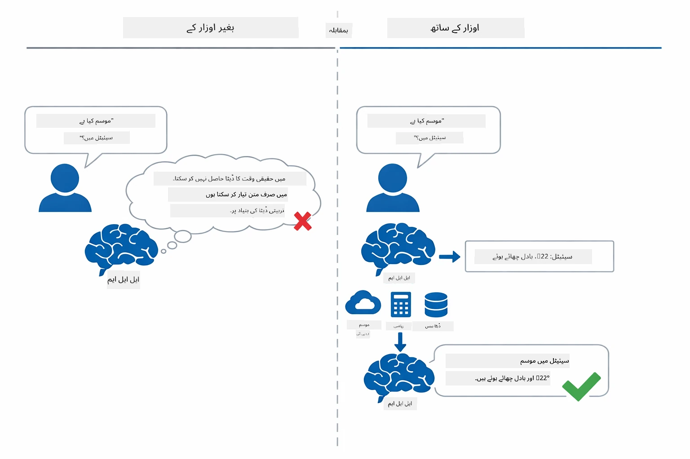

*ٹولز کے بغیر ماڈل صرف اندازہ لگا سکتا ہے — ٹولز کے ساتھ یہ APIs کال کر سکتا ہے، حساب چلا سکتا ہے، اور حقیقی وقت کا ڈیٹا واپس کر سکتا ہے۔*

ٹولز والا AI ایجنٹ **Reasoning and Acting (ReAct)** پیٹرن پر عمل کرتا ہے۔ ماڈل صرف جواب نہیں دیتا — یہ سوچتا ہے کہ اسے کیا چاہیے، ٹول کال کر کے عمل کرتا ہے، نتیجہ دیکھتا ہے، اور پھر فیصلہ کرتا ہے کہ مزید عمل کرنا ہے یا آخری جواب دینا ہے:

1. **تجزیہ** — ایجنٹ صارف کے سوال کا تجزیہ کرتا ہے اور طے کرتا ہے کہ اسے کیا معلومات چاہیے
2. **عمل** — ایجنٹ صحیح ٹول منتخب کرتا ہے، درست پیرامیٹرز تیار کرتا ہے، اور اسے کال کرتا ہے
3. **مشاہدہ** — ایجنٹ ٹول کا آؤٹ پٹ وصول کرتا ہے اور نتیجہ کا جائزہ لیتا ہے
4. **دوبارہ یا جواب** — اگر مزید ڈیٹا چاہیے تو ایجنٹ لوپ میں واپس جاتا ہے؛ ورنہ ایک فطری زبان میں جواب تیار کرتا ہے

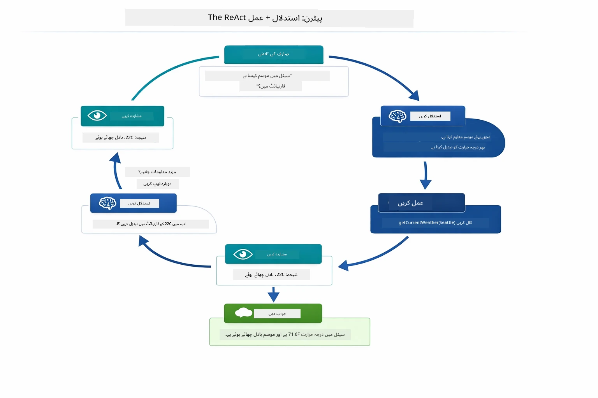

*ReAct سائیکل — ایجنٹ فیصلہ کرتا ہے کہ کیا کرنا ہے، ٹول کال کر کے عمل کرتا ہے، نتیجہ دیکھتا ہے، اور جب تک آخری جواب دے سکتا ہے لوپ کرتا ہے۔*

یہ خودکار طریقے سے ہوتا ہے۔ آپ ٹولز اور ان کی تفصیلات طے کرتے ہیں۔ ماڈل یہ فیصلہ کرتا ہے کہ کب اور کیسے انہیں استعمال کرنا ہے۔

## ٹول کالنگ کیسے کام کرتی ہے

### ٹول کی تعریف

[WeatherTool.java](../../../04-tools/src/main/java/com/example/langchain4j/agents/tools/WeatherTool.java) | [TemperatureTool.java](../../../04-tools/src/main/java/com/example/langchain4j/agents/tools/TemperatureTool.java)

آپ فنکشنز کو واضح تفصیلات اور پیرامیٹر کی وضاحت کے ساتھ تعریف کرتے ہیں۔ ماڈل اپنے سسٹم پرامپٹ میں یہ تفصیلات دیکھتا ہے اور سمجھتا ہے کہ ہر ٹول کیا کرتا ہے۔

```java
@Component
public class WeatherTool {
    
    @Tool("Get the current weather for a location")
    public String getCurrentWeather(@P("Location name") String location) {
        // آپ کا موسم تلاش کرنے کا منطقی عمل
        return "Weather in " + location + ": 22°C, cloudy";
    }
}

@AiService
public interface Assistant {
    String chat(@MemoryId String sessionId, @UserMessage String message);
}

// اسسٹنٹ خودکار طور پر Spring Boot کے ذریعے منسلک کیا گیا ہے:
// - ChatModel بین
// - @Component کلاسز سے تمام @Tool طریقے
// - سیشن مینجمنٹ کے لیے ChatMemoryProvider
```

نیچے دیا گیا خاکہ ہر نوٹیشن کو توڑ کر دکھاتا ہے اور بتاتا ہے کہ AI کو سمجھانے میں ہر جز کیسے مدد کرتا ہے کہ ٹول کب کال کرنا ہے اور کون سے دلائل پاس کرنے ہیں:

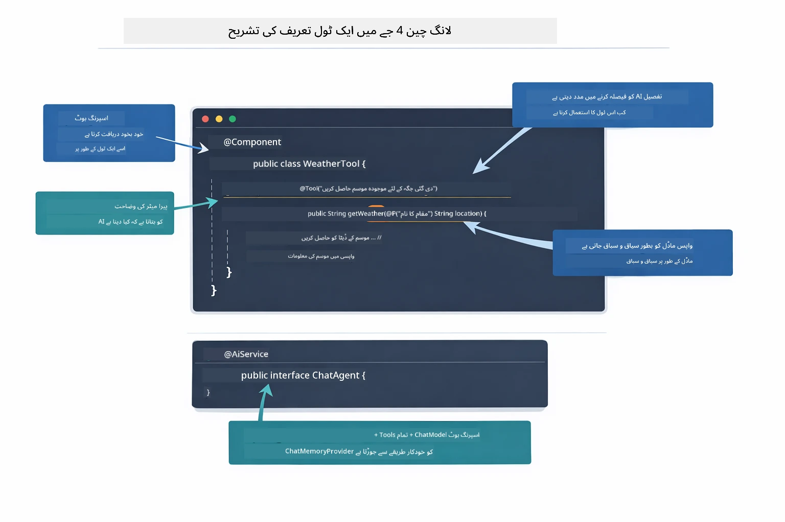

*ٹول کی تعریف کا خاکہ — @Tool AI کو بتاتا ہے کب استعمال کرنا ہے، @P ہر پیرامیٹر کی وضاحت کرتا ہے، اور @AiService اسٹارٹ اپ میں سب کچھ وائر کرتا ہے۔*

> **🤖 [GitHub Copilot](https://github.com/features/copilot) Chat کے ساتھ کوشش کریں:** [`WeatherTool.java`](../../../04-tools/src/main/java/com/example/langchain4j/agents/tools/WeatherTool.java) کھولیں اور پوچھیں:
> - "میں اصلی موسمی API جیسے OpenWeatherMap کو جعلی ڈیٹا کی جگہ کیسے شامل کر سکتا ہوں؟"
> - "ایک اچھا ٹول کی تفصیل کیا ہوتی ہے جو AI کو اسے صحیح طریقے سے استعمال کرنے میں مدد دیتی ہے؟"
> - "ٹول کے اطلاقات میں API کی غلطیوں اور شرح کی حد بندی کو کیسے سنبھالوں؟"

### فیصلہ سازی

جب صارف پوچھتا ہے "سیئٹل میں موسم کیسا ہے؟"، تو ماڈل کسی ٹول کو بے ترتیب منتخب نہیں کرتا۔ یہ صارف کے ارادے کو ہر دستیاب ٹول کی تفصیل سے موازنہ کرتا ہے، مطابقت کے لیے ہر ایک کو نمبر دیتا ہے، اور بہترین میچ منتخب کرتا ہے۔ پھر یہ صحیح پیرامیٹرز کے ساتھ ایک ساختی فنکشن کال پیدا کرتا ہے — اس صورت میں، `location` کو `"Seattle"` سیٹ کرتا ہے۔

اگر صارف کی درخواست کے لیے کوئی ٹول میچ نہ کرے تو ماڈل اپنے علم سے جواب دیتا ہے۔ اگر متعدد ٹولز میچ کریں تو سب سے مخصوص کو منتخب کرتا ہے۔

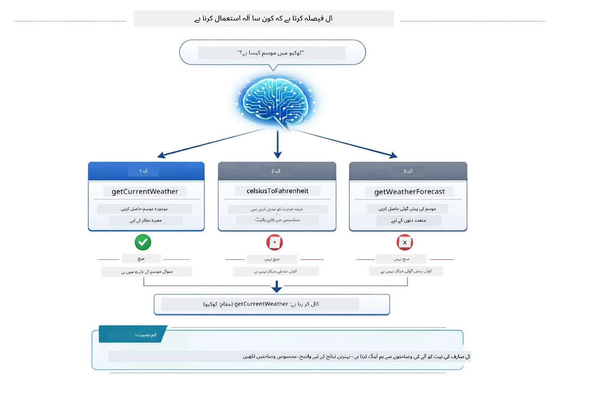

*ماڈل ہر دستیاب ٹول کو صارف کے ارادے کے مطابق جانچتا ہے اور بہترین میچ منتخب کرتا ہے — یہی وجہ ہے کہ واضح، مخصوص ٹول کی تفصیلات لکھنا اہم ہے۔*

### عملدرآمد

[AgentService.java](../../../04-tools/src/main/java/com/example/langchain4j/agents/service/AgentService.java)

اسپرنگ بوٹ خودکار طریقے سے `@AiService` انٹرفیس کو تمام رجسٹرڈ ٹولز کے ساتھ وائر کرتا ہے، اور LangChain4j ٹول کالز کو خودکار طریقے سے چلاتا ہے۔ پردے کے پیچھے، مکمل ٹول کال چھ مراحل سے گزرتی ہے — صارف کے قدرتی زبان کے سوال سے لے کر واپس قدرتی زبان کے جواب تک:

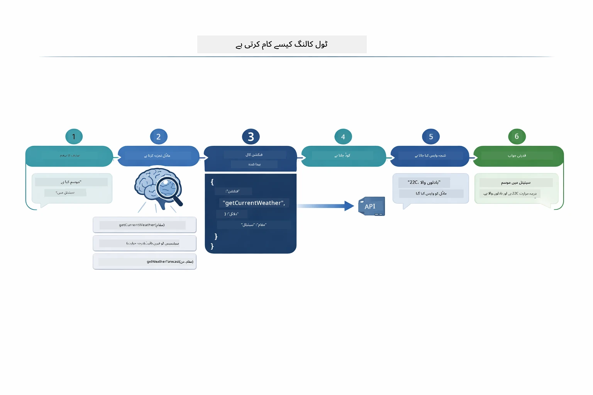

*اختتامی فلو — صارف سوال کرتا ہے، ماڈل ایک ٹول منتخب کرتا ہے، LangChain4j اسے چلاتا ہے، اور ماڈل نتیجہ ایک قدرتی جواب میں شامل کرتا ہے۔*

> **🤖 [GitHub Copilot](https://github.com/features/copilot) Chat کے ساتھ کوشش کریں:** [`AgentService.java`](../../../04-tools/src/main/java/com/example/langchain4j/agents/service/AgentService.java) کھولیں اور پوچھیں:
> - "ReAct پیٹرن کیسے کام کرتا ہے اور AI ایجنٹس کے لیے یہ کیوں مؤثر ہے؟"
> - "ایجنٹ فیصلہ کیسے کرتا ہے کہ کون سا ٹول استعمال کرنا ہے اور کس ترتیب میں؟"
> - "اگر ٹول کی عملدرآمد ناکام ہو جائے تو کیا ہوتا ہے - مجھے غلطیوں کو مضبوطی سے کیسے سنبھالنا چاہیے؟"

### جواب کی تشکیل

ماڈل موسمی ڈیٹا وصول کرتا ہے اور صارف کے لیے اسے قدرتی زبان کے جواب میں ترتیب دیتا ہے۔

### آرکیٹیکچر: اسپرنگ بوٹ آٹو وائرنگ

یہ ماڈیول LangChain4j کی اسپرنگ بوٹ انضمام استعمال کرتا ہے جس میں declarative `@AiService` انٹرفیس شامل ہیں۔ آغاز میں اسپرنگ بوٹ ہر `@Component` کو تلاش کرتا ہے جس میں `@Tool` طریقے ہوں، آپ کا `ChatModel` بین، اور `ChatMemoryProvider` — پھر انہیں ایک واحد `Assistant` انٹرفیس میں وائر کرتا ہے بغیر کوئی بوجھ کا کوڈ لکھے۔

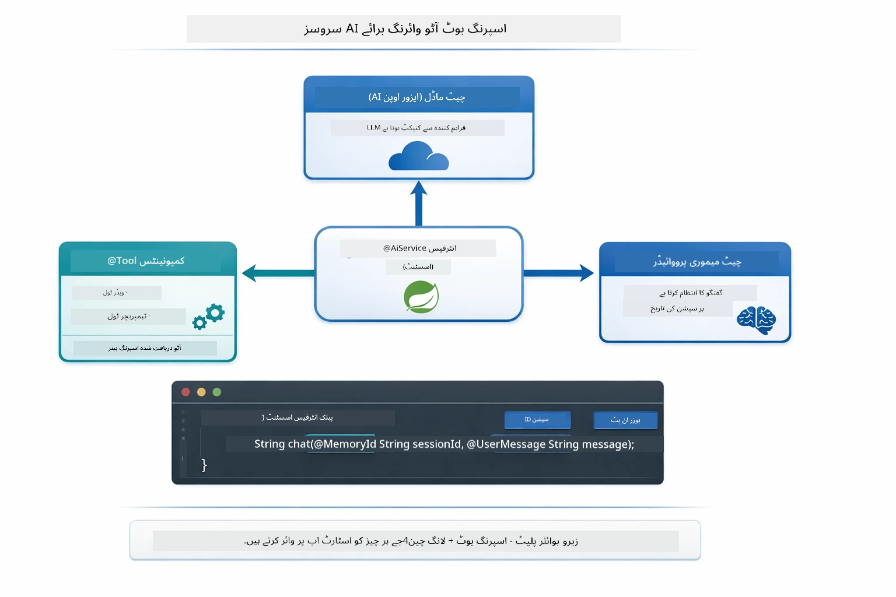

*@AiService انٹرفیس ChatModel، ٹول اجزاء، اور میموری پرووائیڈر کو آپس میں جوڑتا ہے — اسپرنگ بوٹ یہ وائرنگ خودکار طریقے سے سنبھالتا ہے۔*

اس طریقے کے کلیدی فوائد:

- **اسپرنگ بوٹ آٹو وائرنگ** — ChatModel اور ٹولز خودکار طریقے سے داخل کیے جاتے ہیں
- **@MemoryId پیٹرن** — خودکار سیشن پر مبنی یادداشت کا انتظام
- **ایک ہی مثال** — اسسٹنٹ ایک بار بنایا جاتا ہے اور بہتر کارکردگی کے لیے دوبارہ استعمال ہوتا ہے
- **ٹائپ سیف عملدرآمد** — جاوا طریقے براہ راست ٹائپ کنورژن کے ساتھ کال ہوتے ہیں
- **کئی چکر کی ترتیب** — ٹول چیننگ کو خودکار طریقے سے سنبھالتا ہے
- **صفر بوجھ کا کوڈ** — کوئی دستی `AiServices.builder()` کالز یا میموری ہیش میپ نہیں

متبادل طریقے (دستی `AiServices.builder()`) زیادہ کوڈ درکار ہوتے ہیں اور اسپرنگ بوٹ انضمام کے فوائد سے محروم ہوتے ہیں۔

## ٹول چیننگ

**ٹول چیننگ** — حقیقی طاقت تب ظاہر ہوتی ہے جب ایک ہی سوال کے لیے متعدد ٹولز کی ضرورت ہو۔ پوچھیں "سیئٹل میں موسم فارن ہائیٹ میں کیا ہے؟" اور ایجنٹ خودکار طور پر دو ٹولز کو چین کرتا ہے: پہلے `getCurrentWeather` کو کال کرتا ہے تاکہ سیلزئس میں درجہ حرارت حاصل کرے، پھر اسے `celsiusToFahrenheit` میں تبدیلی کے لیے پاس کرتا ہے — یہ سب ایک ہی گفتگو کے چکر میں۔

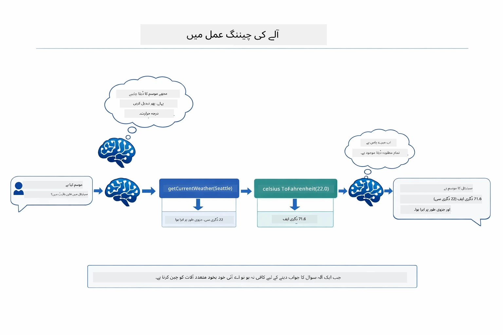

*ٹول چیننگ میں عمل — ایجنٹ پہلے getCurrentWeather کال کرتا ہے، پھر سیلزئس نتیجہ celsiusToFahrenheit میں دیتا ہے، اور مجموعی جواب دیتا ہے۔*

**خوبصورت ناکامیاں** — کسی ایسے شہر کے موسم کے لیے پوچھیں جو جعلی ڈیٹا میں نہیں ہے۔ ٹول ایک غلطی کا پیغام واپس کرتا ہے، اور AI وضاحت کرتا ہے کہ وہ مدد نہیں کر سکتا، اور کریش نہیں ہوتا۔ ٹولز محفوظ طریقے سے ناکام ہوتے ہیں۔ نیچے دیا گیا خاکہ دونوں طریقوں کا موازنہ کرتا ہے — مناسب غلطی سنبھالنے کے ساتھ، ایجنٹ استثناء کو پکڑتا ہے اور مددگار جواب دیتا ہے، ورنہ پوری ایپلیکیشن کریش ہو جاتی ہے:

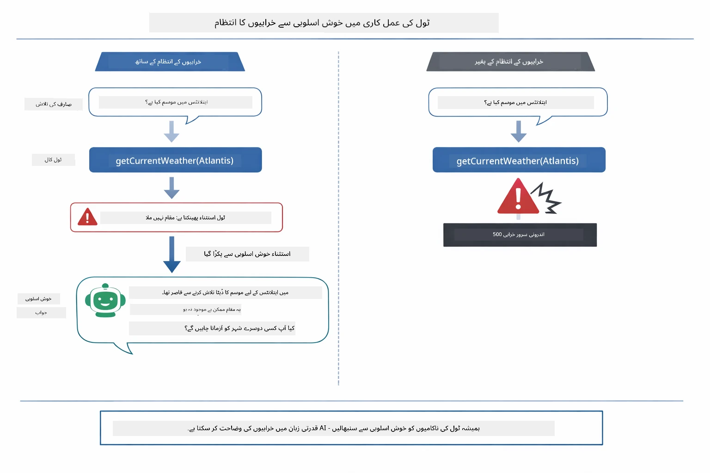

*جب ٹول ناکام ہوتا ہے، ایجنٹ غلطی پکڑتا ہے اور کریش کی بجائے ایک مددگار وضاحت کے ساتھ جواب دیتا ہے۔*

یہ سب ایک ہی گفتگو کے چکر میں ہوتا ہے۔ ایجنٹ خودکار طریقے سے متعدد ٹول کالز کو ترتیب دیتا ہے۔

## ایپلیکیشن چلائیں

**تعیناتی کی تصدیق:**

یقین دہانی کریں کہ روٹ ڈائریکٹری میں Azure اسناد کا `.env` فائل موجود ہے (ماڈیول 01 میں تشکیل دیا گیا)۔ ماڈیول ڈائریکٹری (`04-tools/`) سے یہ چلائیں:

**بش:**
```bash
cat ../.env  # AZURE_OPENAI_ENDPOINT، API_KEY، DEPLOYMENT دکھانے چاہئیں
```

**پاور شیل:**
```powershell
Get-Content ..\.env  # AZURE_OPENAI_ENDPOINT، API_KEY، DEPLOYMENT دکھانا چاہیے
```

**ایپلیکیشن شروع کریں:**

> **نوٹ:** اگر آپ نے پہلے ہی روٹ ڈائریکٹری سے `./start-all.sh` استعمال کر کے تمام ایپلیکیشنز شروع کی ہیں (جیسا کہ ماڈیول 01 میں بتایا گیا ہے)، تو یہ ماڈیول پورٹ 8084 پر پہلے سے چل رہا ہے۔ آپ نیچے دیے گئے شروع کرنے کے کمانڈز کو چھوڑ کر براہ راست http://localhost:8084 پر جا سکتے ہیں۔

**اختیار 1: اسپرنگ بوٹ ڈیش بورڈ استعمال کریں (VS Code صارفین کے لیے تجویز کردہ)**

ڈیولپمنٹ کنٹینر میں اسپرنگ بوٹ ڈیش بورڈ ایکسٹینشن شامل ہے، جو تمام اسپرنگ بوٹ ایپلیکیشنز کو منظم کرنے کے لیے ایک بصری انٹرفیس فراہم کرتا ہے۔ آپ اسے VS Code کی بائیں جانب ایکٹیویٹی بار میں (اسپرنگ بوٹ آئیکون) دیکھ سکتے ہیں۔

اسپرنگ بوٹ ڈیش بورڈ سے، آپ کر سکتے ہیں:
- ورک اسپیس میں تمام دستیاب اسپرنگ بوٹ ایپلیکیشنز دیکھیں
- ایک کلک سے ایپلیکیشنز شروع/روکیں
- حقیقی وقت میں ایپلیکیشن لاگز دیکھیں
- ایپلیکیشن کی حالت مانیٹر کریں

بس "tools" کے پاس پلے بٹن پر کلک کریں تاکہ یہ ماڈیول شروع ہو جائے، یا تمام ماڈیولز کو ایک ساتھ شروع کریں۔

یہ ہے VS Code میں اسپرنگ بوٹ ڈیش بورڈ:


*VS Code میں اسپرنگ بوٹ ڈیش بورڈ — تمام ماڈیولز کو ایک جگہ سے شروع، روک، اور مانیٹر کریں*

**اختیار 2: شیل اسکرپٹس استعمال کریں**

تمام ویب ایپلیکیشنز (ماڈیولز 01-04) چلائیں:

**بش:**
```bash
cd ..  # روٹ ڈائریکٹری سے
./start-all.sh
```

**پاور شیل:**
```powershell
cd ..  # جڑ کی ڈائریکٹری سے
.\start-all.ps1
```

یا صرف یہ ماڈیول شروع کریں:

**بش:**
```bash
cd 04-tools
./start.sh
```

**پاور شیل:**
```powershell
cd 04-tools
.\start.ps1
```

دونوں اسکرپٹس خودکار طریقے سے روٹ `.env` فائل سے ماحول متغیرات لوڈ کرتے ہیں اور اگر JARs موجود نہ ہوں تو بنائیں گے۔

> **نوٹ:** اگر آپ شروع کرنے سے پہلے دستی طور پر تمام ماڈیولز بنانا چاہتے ہیں:
>
> **بش:**
> ```bash
> cd ..  # Go to root directory
> mvn clean package -DskipTests
> ```
>
> **پاور شیل:**
> ```powershell
> cd ..  # Go to root directory
> mvn clean package -DskipTests
> ```

اپنے براؤزر میں http://localhost:8084 کھولیں۔

**روکنے کے لیے:**

**بش:**
```bash
./stop.sh  # یہ ماڈیول صرف
# یا
cd .. && ./stop-all.sh  # تمام ماڈیولز
```

**پاور شیل:**
```powershell
.\stop.ps1  # یہ ماڈیول صرف
# یا
cd ..; .\stop-all.ps1  # تمام ماڈیولز
```

## ایپلیکیشن کا استعمال

ایپلیکیشن ایک ویب انٹرفیس فراہم کرتی ہے جہاں آپ ایک AI ایجنٹ کے ساتھ بات چیت کر سکتے ہیں جسے موسم اور درجہ حرارت کی تبدیلی کے ٹولز تک رسائی حاصل ہے۔ انٹرفیس کچھ ایسا دکھائی دیتا ہے — اس میں مختصر مثالیں اور درخواستیں بھیجنے کے لیے چیٹ پینل شامل ہے:
<a href="images/tools-homepage.png"></a>

*اے آئی ایجنٹ ٹولز انٹرفیس - ٹولز کے ساتھ تعامل کے لیے فوری مثالیں اور چیٹ انٹرفیس*

### سادہ ٹول کے استعمال کی کوشش کریں

ایک آسان درخواست سے شروع کریں: "100 ڈگری فارن ہائیٹ کو سیلسیس میں تبدیل کریں"۔ ایجنٹ پہچانتا ہے کہ اسے درجہ حرارت کی تبدیلی کے ٹول کی ضرورت ہے، اس کو صحیح پیرامیٹرز کے ساتھ کال کرتا ہے، اور نتیجہ واپس کرتا ہے۔ دیکھیں کہ یہ کتنا فطری لگتا ہے - آپ نے یہ نہیں بتایا کہ کون سا ٹول استعمال کرنا ہے یا اسے کیسے کال کرنا ہے۔

### ٹول چیننگ کی جانچ کریں

اب کچھ زیادہ پیچیدہ کوشش کریں: "سیئیٹل کا موسم کیا ہے اور اسے فارن ہائیٹ میں تبدیل کریں؟" دیکھیں کہ ایجنٹ اسے مرحلہ وار کیسے حل کرتا ہے۔ پہلے موسم معلوم کرتا ہے (جو سیلسیس میں دیتا ہے)، پھر پہچانتا ہے کہ اسے فارن ہائیٹ میں تبدیل کرنا ہے، تبدیلی کا ٹول کال کرتا ہے، اور دونوں نتائج کو ایک جواب میں جوڑ دیتا ہے۔

### مکالمے کا بہاؤ دیکھیں

چیٹ انٹرفیس گفتگو کی تاریخ محفوظ رکھتا ہے، آپ کو متعدد بار بات چیت کرنے کی اجازت دیتا ہے۔ آپ پچھلے تمام سوالات اور جوابات دیکھ سکتے ہیں، جو گفتگو کو ٹریک کرنا اور سمجھنا آسان بنا دیتا ہے کہ ایجنٹ کس طرح متعدد تبادلوں میں سیاق و سباق بناتا ہے۔

<a href="images/tools-conversation-demo.png"></a>

*کئی بار کی بات چیت جو سادہ تبدیلیاں، موسم کی جانچ، اور ٹول چیننگ دکھاتی ہے*

### مختلف درخواستوں کے ساتھ تجربہ کریں

مختلف امتزاج آزمایں:
- موسم کی جانچ: "ٹوکیو کا موسم کیسا ہے؟"
- درجہ حرارت کی تبدیلیاں: "25°C کو کیلون میں کیا ہے؟"
- مشترکہ سوالات: "پیرس کا موسم دیکھیں اور بتائیں کہ آیا یہ 20°C سے زیادہ ہے"

دھیان دیں کہ ایجنٹ قدرتی زبان کو کیسے سمجھتا ہے اور اسے مناسب ٹول کالز سے جوڑتا ہے۔

## کلیدی تصورات

### ری ایکٹ پیٹرن (تفکر اور عمل)

ایجنٹ تفکر (کیا کرنا ہے فیصلہ کرنا) اور عمل (ٹولز کا استعمال کرنا) کے درمیان بدلتا رہتا ہے۔ یہ نمونہ خودمختار مسئلہ حل کرنے کی اجازت دیتا ہے بجائے صرف ہدایات کے جواب دینے کے۔

### ٹول کی وضاحتیں اہم ہیں

آپ کی ٹول کی وضاحتوں کا معیار براہ راست متاثر کرتا ہے کہ ایجنٹ انہیں کتنی اچھی طرح استعمال کرتا ہے۔ واضح، مخصوص وضاحتیں ماڈل کو سمجھنے میں مدد دیتی ہیں کہ کب اور کیسے ہر ٹول کو کال کرنا ہے۔

### سیشن مینجمنٹ

`@MemoryId` تشریح خودکار سیشن پر مبنی میموری مینجمنٹ کو فعال کرتی ہے۔ ہر سیشن آئی ڈی کو اپنا `ChatMemory` انسٹینس ملتا ہے جو `ChatMemoryProvider` بین کے ذریعے مینج کیا جاتا ہے، تاکہ متعدد صارفین ایک ساتھ ایجنٹ کے ساتھ بات چیت کر سکیں بغیر کہ ان کی گفتگو آپس میں مل جائے۔ ذیل میں دیا گیا خاکہ دکھاتا ہے کہ کس طرح متعدد صارفین کو ان کے سیشن آئی ڈیز کی بنیاد پر الگ الگ میموری اسٹورز پر بھیجا جاتا ہے:

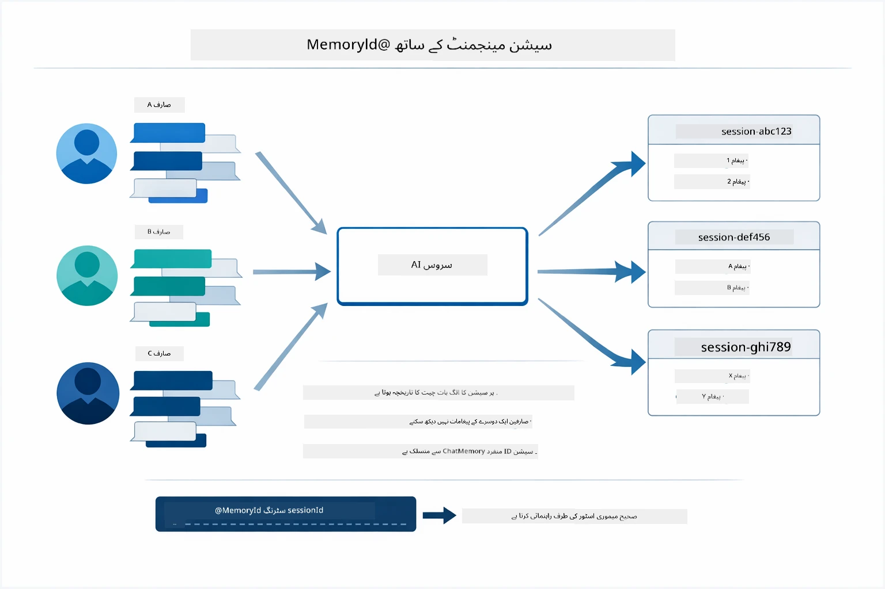

*ہر سیشن آئی ڈی ایک الگ الگ گفتگو کی تاریخ سے منسلک ہوتا ہے — صارفین کبھی ایک دوسرے کے پیغامات نہیں دیکھتے۔*

### غلطی کا انتظام

ٹولز ناکام ہو سکتے ہیں — APIs کا وقت ختم ہو جانا، پیرامیٹرز غلط ہو سکتے ہیں، خارجی سروسز بند ہو سکتی ہیں۔ پروڈکشن ایجنٹس کو غلطی سنبھالنے کی ضرورت ہوتی ہے تاکہ ماڈل مسائل کی وضاحت کر سکے یا متبادل کوشش کرے بجائے پورے ایپلیکیشن کے کریش ہونے کے۔ جب کوئی ٹول استثناء پھینکتا ہے، تو LangChain4j اسے پکڑتا ہے اور ماڈل کو غلطی کا پیغام دیتا ہے، جو پھر قدرتی زبان میں مسئلہ کی وضاحت کر سکتا ہے۔

## دستیاب ٹولز

ذیل کا خاکہ ان وسیع اداروں کو دکھاتا ہے جو آپ بنا سکتے ہیں۔ یہ ماڈیول موسم اور درجہ حرارت کے ٹولز کو ظاہر کرتا ہے، لیکن یہی `@Tool` نمونہ کسی بھی جاوا طریقے کے لیے کام کرتا ہے — چاہے وہ ڈیٹابیس سوالات ہوں یا ادائیگی کی پراسیسنگ۔

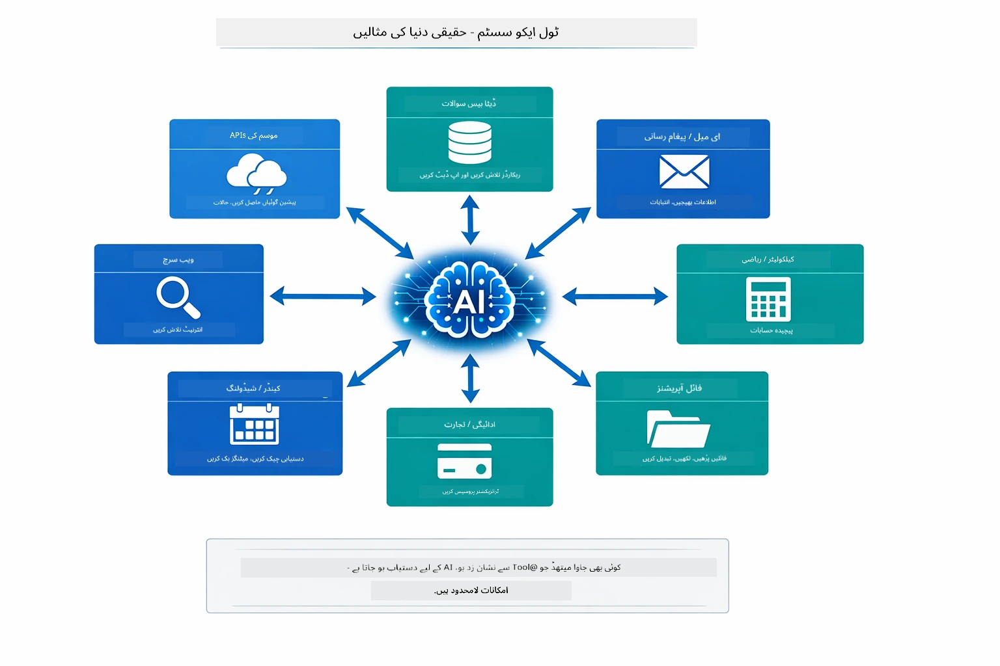

*کوئی بھی جاوا طریقہ جس پر @Tool لگایا گیا ہو، AI کے لیے دستیاب ہو جاتا ہے — یہ نمونہ ڈیٹابیسز، API، ای میل، فائل آپریشنز، اور مزید تک بڑھتا ہے۔*

## ٹول بیسڈ ایجنٹس کب استعمال کریں

ہر درخواست کو ٹولز کی ضرورت نہیں ہوتی۔ فیصلہ اس بات پر منحصر ہے کہ آیا AI کو خارجی نظاموں کے ساتھ تعامل کرنا ہے یا وہ اپنے علم سے جواب دے سکتا ہے۔ ذیل میں گائیڈ خلاصہ کرتی ہے کہ ٹولز کب قدر بڑھاتے ہیں اور کب غیر ضروری ہوتے ہیں:


*ایک فوری فیصلہ گائیڈ — ٹولز لائیو ڈیٹا، حسابات، اور عمل کے لیے ہیں؛ عمومی معلومات اور تخلیقی کاموں کے لیے نہیں چاہیے۔*

## ٹولز بمقابلہ RAG

ماڈیولز 03 اور 04 دونوں AI کی صلاحیت کو بڑھاتے ہیں، لیکن بنیادی طور پر مختلف طریقوں سے۔ RAG ماڈل کو دستاویزات حاصل کر کے **علم** تک رسائی دیتا ہے۔ ٹولز ماڈل کو افعال کال کر کے **عمل** کرنے کی صلاحیت دیتے ہیں۔ ذیل کا خاکہ ان دونوں طریقوں کا موازنہ کرتا ہے — ہر ورک فلو کیسے کام کرتا ہے اور ان کے درمیان فائدہ نقصان:

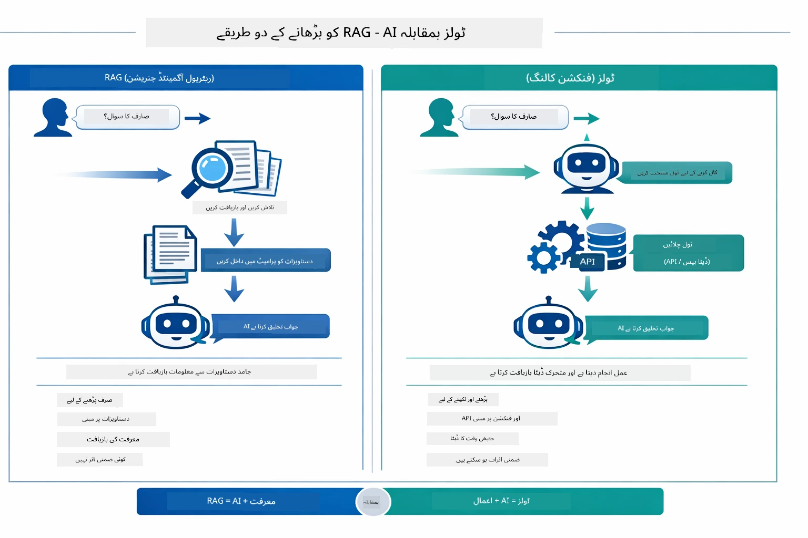

*RAG جامد دستاویزات سے معلومات حاصل کرتا ہے — ٹولز عمل چلاتے ہیں اور متحرک، حقیقی وقت کا ڈیٹا لاتے ہیں۔ کئی پروڈکشن سسٹمز دونوں کو یکجا کرتے ہیں۔*

عملی طور پر، بہت سے پروڈکشن سسٹمز دونوں طریقے اپناتے ہیں: RAG آپ کی دستاویزات پر جوابات کی بنیاد کے لیے، اور ٹولز لائیو ڈیٹا لینے یا عمل کرنے کے لیے۔

## اگلے مراحل

**اگلا ماڈیول:** [05-mcp - ماڈل کانٹیکسٹ پروٹوکول (MCP)](../05-mcp/README.md)

---

**نیویگیشن:** [← پچھلا: ماڈیول 03 - RAG](../03-rag/README.md) | [مین پیج پر واپس](../README.md) | [اگلا: ماڈیول 05 - MCP →](../05-mcp/README.md)

---

<!-- CO-OP TRANSLATOR DISCLAIMER START -->
**ڈس کلیمر**:  
اس دستاویز کا ترجمہ AI ترجمہ خدمات [Co-op Translator](https://github.com/Azure/co-op-translator) کے ذریعے کیا گیا ہے۔ اگرچہ ہم درستگی کے لیے کوشش کرتے ہیں، براہ کرم یاد رکھیں کہ خودکار ترجمے میں غلطیاں یا عدم وضاحت ہو سکتی ہے۔ اصل دستاویز اپنی مادری زبان میں ہی مستند سمجھی جانی چاہیے۔ اہم معلومات کے لیے پیشہ ور انسانی ترجمہ کی سفارش کی جاتی ہے۔ اس ترجمے کے استعمال سے پیدا ہونے والے کسی بھی غلط فہمی یا غلط تشریحات کی ذمہ داری ہم پر عائد نہیں ہوتی۔
<!-- CO-OP TRANSLATOR DISCLAIMER END -->