# ماڈیول 05: ماڈل کانٹیکسٹ پروٹوکول (MCP)

## مواد کی فہرست

- [آپ کیا سیکھیں گے](../../../05-mcp)
- [MCP کیا ہے؟](../../../05-mcp)
- [MCP کیسے کام کرتا ہے](../../../05-mcp)
- [ایجنٹک ماڈیول](../../../05-mcp)
- [مثالیں چلانا](../../../05-mcp)
  - [ضروریات](../../../05-mcp)
- [جلدی آغاز](../../../05-mcp)
  - [فائل آپریشنز (Stdio)](../../../05-mcp)
  - [سپر وائزر ایجنٹ](../../../05-mcp)
    - [ڈیمو چلانا](../../../05-mcp)
    - [سپر وائزر کیسے کام کرتا ہے](../../../05-mcp)
    - [جوابی حکمت عملیاں](../../../05-mcp)
    - [آؤٹ پٹ کو سمجھنا](../../../05-mcp)
    - [ایجنٹک ماڈیول کی خصوصیات کی وضاحت](../../../05-mcp)
- [اہم تصورات](../../../05-mcp)
- [مبارک ہو!](../../../05-mcp)
  - [اگلا کیا ہے؟](../../../05-mcp)

## آپ کیا سیکھیں گے

آپ نے بات چیت کرنے والے AI بنائے، پرامپٹس میں مہارت حاصل کی، جوابات کو دستاویزات سے منسلک کیا، اور ٹولز کے ساتھ ایجنٹس بنائے۔ لیکن یہ تمام ٹولز خاص آپ کی ایپلیکیشن کے لیے تیار کیے گئے تھے۔ اگر آپ اپنے AI کو ایسے معیاری ماحولیاتی نظام تک رسائی دے سکیں جو کوئی بھی بنا اور شیئر کر سکتا ہو تو؟ اس ماڈیول میں، آپ سیکھیں گے کہ ماڈل کانٹیکسٹ پروٹوکول (MCP) اور LangChain4j کے ایجنٹک ماڈیول کے ذریعے یہ کیسے کیا جائے۔ ہم سب سے پہلے ایک سادہ MCP فائل ریڈر دکھاتے ہیں اور پھر دکھاتے ہیں کہ یہ آسانی سے کس طرح سپر وائزر ایجنٹ پیٹرن کا استعمال کرتے ہوئے جدید ایجنٹک ورک فلو میں شامل ہو جاتا ہے۔

## MCP کیا ہے؟

ماڈل کانٹیکسٹ پروٹوکول (MCP) بالکل یہی فراہم کرتا ہے — AI ایپلیکیشنز کے لیے ایک معیاری طریقہ کہ وہ بیرونی ٹولز کو دریافت کریں اور استعمال کریں۔ ہر ڈیٹا سورس یا سروس کے لیے حسب ضرورت انضمام لکھنے کے بجائے، آپ MCP سرورز سے جڑتے ہیں جو اپنی صلاحیتوں کو ایک مستقل فارمیٹ میں ظاہر کرتے ہیں۔ آپ کا AI ایجنٹ پھر خود بخود ان ٹولز کو دریافت اور استعمال کر سکتا ہے۔

نیچے دیا گیا خاکہ فرق دکھاتا ہے — MCP کے بغیر، ہر انضمام کے لیے حسب ضرورت نقطہ بہ نقطہ وائرنگ ضروری ہے؛ MCP کے ساتھ، ایک واحد پروٹوکول آپ کی ایپ کو کسی بھی ٹول سے جوڑتا ہے:


*MCP سے پہلے: پیچیدہ نقطہ بہ نقطہ انضمامات۔ MCP کے بعد: ایک پروٹوکول، لا محدود امکانات۔*

MCP AI ڈیولپمنٹ کا ایک بنیادی مسئلہ حل کرتا ہے: ہر انضمام حسب ضرورت ہوتا ہے۔ GitHub تک رسائی چاہیے؟ حسب ضرورت کوڈ۔ فائلیں پڑھنی ہیں؟ حسب ضرورت کوڈ۔ ڈیٹابیس استفسار کرنا ہے؟ حسب ضرورت کوڈ۔ اور ان میں سے کوئی بھی انضمام دوسرے AI ایپلیکیشنز کے ساتھ کام نہیں کرتا۔

MCP اسے معیاری بناتا ہے۔ ایک MCP سرور ٹولز کو واضح وضاحتوں اور اسکیموں کے ساتھ پیش کرتا ہے۔ کوئی بھی MCP کلائنٹ جڑ سکتا ہے، دستیاب ٹولز دریافت کر سکتا ہے، اور انہیں استعمال کر سکتا ہے۔ ایک بار بنائیں، ہر جگہ استعمال کریں۔

نیچے دیا گیا خاکہ اس فن تعمیر کو ظاہر کرتا ہے — ایک واحد MCP کلائنٹ (آپ کی AI ایپ) کئی MCP سرورز سے جڑتا ہے، جو اپنے اپنے سیٹ کے ٹولز کو معیاری پروٹوکول کے ذریعے ظاہر کرتے ہیں:


*ماڈل کانٹیکسٹ پروٹوکول فن تعمیر — معیاری ٹول دریافت اور اجرا*

## MCP کیسے کام کرتا ہے

پیچھے کی سطح پر، MCP ایک پرتدار فن تعمیر استعمال کرتا ہے۔ آپ کی جاوا ایپلیکیشن (MCP کلائنٹ) دستیاب ٹولز دریافت کرتی ہے، ایک ٹرانسپورٹ پرت (Stdio یا HTTP) کے ذریعے JSON-RPC درخواستیں بھیجتی ہے، اور MCP سرور آپریشنز انجام دیتا ہے اور نتائج واپس کرتا ہے۔ نیچے دیا گیا خاکہ اس پروٹوکول کی ہر پرت کو واضح کرتا ہے:

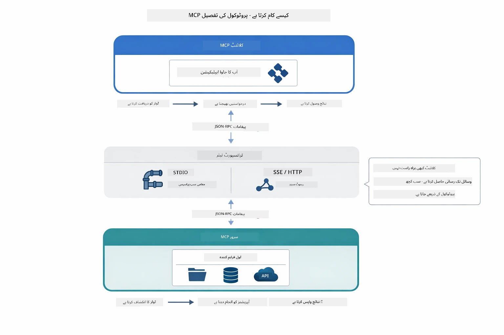

*MCP پیچھے کیسے کام کرتا ہے — کلائنٹس ٹولز دریافت کرتے ہیں، JSON-RPC پیغامات کا تبادلہ کرتے ہیں، اور ایک ٹرانسپورٹ پرت کے ذریعے آپریشنز انجام دیتے ہیں۔*

**سرور-کلائنٹ فن تعمیر**

MCP کلائنٹ-سرور ماڈل استعمال کرتا ہے۔ سرورز ٹولز فراہم کرتے ہیں — فائلیں پڑھنا، ڈیٹابیسز کو استفسار کرنا، APIs کال کرنا۔ کلائنٹس (آپ کی AI ایپ) سرورز سے جڑتے ہیں اور ان کے ٹولز استعمال کرتے ہیں۔

LangChain4j کے ساتھ MCP استعمال کرنے کے لیے یہ Maven انحصار شامل کریں:

```xml
<dependency>
    <groupId>dev.langchain4j</groupId>
    <artifactId>langchain4j-mcp</artifactId>
    <version>${langchain4j.version}</version>
</dependency>
```

**ٹول دریافت**

جب آپ کا کلائنٹ MCP سرور سے جڑتا ہے، تو وہ پوچھتا ہے "آپ کے پاس کون سے ٹولز ہیں؟" سرور دستیاب ٹولز کی فہرست واپس کرتا ہے، ہر ایک کے ساتھ وضاحتیں اور پیرا میٹر اسکیمیں ہوتی ہیں۔ آپ کا AI ایجنٹ پھر صارف کی درخواستوں کی بنیاد پر فیصلہ کر سکتا ہے کہ کون سے ٹولز استعمال کرنا ہیں۔ نیچے دیا گیا خاکہ یہ ہینڈشیک دکھاتا ہے — کلائنٹ `tools/list` درخواست بھیجتا ہے اور سرور اپنے دستیاب ٹولز کی وضاحتوں اور اسکیموں کے ساتھ جواب دیتا ہے:

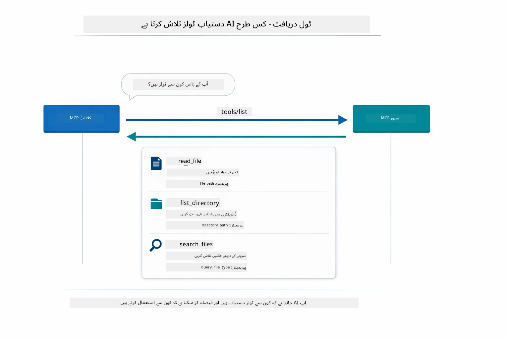

*AI شروع میں دستیاب ٹولز دریافت کرتا ہے — اب اسے معلوم ہے کہ کون سی صلاحیتیں دستیاب ہیں اور وہ فیصلہ کر سکتا ہے کہ کون سے استعمال کرے۔*

**ٹرانسپورٹ میکانزم**

MCP مختلف ٹرانسپورٹ میکانزمز کی حمایت کرتا ہے۔ دو اختیارات ہیں: Stdio (مقامی سب پروسیس مواصلات کے لیے) اور Streamable HTTP (دور دراز سرورز کے لیے)۔ یہ ماڈیول Stdio ٹرانسپورٹ کی مثال دیتا ہے:


*MCP ٹرانسپورٹ میکانزمز: HTTP دور دراز سرورز کے لیے، Stdio مقامی پروسیسز کے لیے*

**Stdio** - [StdioTransportDemo.java](../../../05-mcp/src/main/java/com/example/langchain4j/mcp/StdioTransportDemo.java)

مقامی پروسیسز کے لیے۔ آپ کی ایپلیکیشن ایک سرور کو سب پروسیس کے طور پر شروع کرتی ہے اور معیار کی ان پٹ/آؤٹ پٹ کے ذریعے بات چیت کرتی ہے۔ فائل سسٹم کی رسائی یا کمانڈ لائن ٹولز کے لیے مفید۔

```java
McpTransport stdioTransport = new StdioMcpTransport.Builder()
    .command(List.of(
        npmCmd, "exec",
        "@modelcontextprotocol/server-filesystem@2025.12.18",
        resourcesDir
    ))
    .logEvents(false)
    .build();
```

`@modelcontextprotocol/server-filesystem` سرور درج ذیل ٹولز فراہم کرتا ہے، جو آپ کے مخصوص کردہ ڈائریکٹریز پر محدود ہیں:

| ٹول | وضاحت |
|------|-------------|
| `read_file` | ایک فائل کا مواد پڑھنا |
| `read_multiple_files` | ایک کال میں کئی فائلیں پڑھنا |
| `write_file` | فائل بنانا یا اوور رائٹ کرنا |
| `edit_file` | متعین تلاش اور تبدیل کاری کرنا |
| `list_directory` | کسی راستے پر فائلوں اور فولڈرز کی فہرست بنانا |
| `search_files` | پیٹرن مطابق فائلوں کی تکراری تلاش |
| `get_file_info` | فائل کا میٹا ڈیٹا حاصل کرنا (سائز، وقت، اجازتیں) |
| `create_directory` | فولڈر بنانا (والد فولڈرز سمیت) |
| `move_file` | فائل یا فولڈر کو منتقل یا نام تبدیل کرنا |

نیچے دیا گیا خاکہ دکھاتا ہے کہ Stdio ٹرانسپورٹ وقتِ عمل میں کیسے کام کرتا ہے — آپ کی جاوا ایپلیکیشن MCP سرور کو چائلڈ پروسیس کے طور پر شروع کرتی ہے اور وہ stdin/stdout پائپس کے ذریعے بات چیت کرتے ہیں، بجائے نیٹ ورک یا HTTP استعمال کرنے کے:

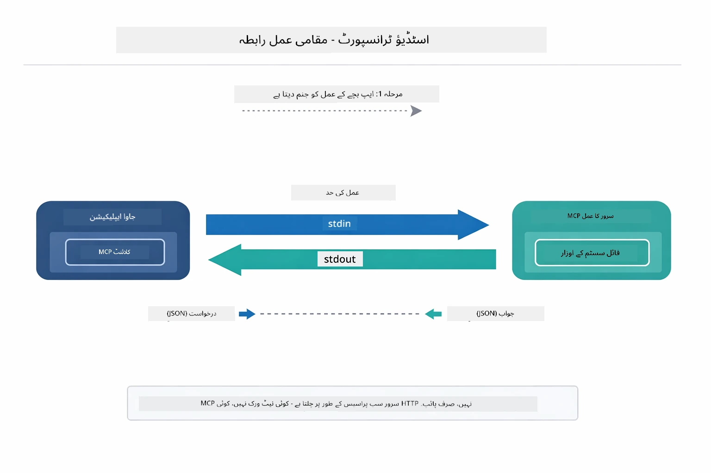

*Stdio ٹرانسپورٹ عمل میں — آپ کی ایپلیکیشن MCP سرور کو چائلڈ پروسیس کے طور پر شروع کرتی ہے اور stdin/stdout پائپس کے ذریعے بات چیت کرتی ہے۔*

> **🤖 [GitHub Copilot](https://github.com/features/copilot) چیٹ کے ساتھ آزمائیں:** [`StdioTransportDemo.java`](../../../05-mcp/src/main/java/com/example/langchain4j/mcp/StdioTransportDemo.java) کھولیں اور پوچھیے:
> - "Stdio ٹرانسپورٹ کیسے کام کرتا ہے اور مجھے اسے کب HTTP کے مقابلے میں استعمال کرنا چاہیے؟"
> - "LangChain4j MCP سرور کے جنم لینے والے پروسیسز کے لائف سائیکل کا انتظام کیسے کرتا ہے؟"
> - "AI کو فائل سسٹم تک رسائی دینے کے حفاظتی پہلو کیا ہیں؟"

## ایجنٹک ماڈیول

جبکہ MCP معیاری ٹولز فراہم کرتا ہے، LangChain4j کا **ایجنٹک ماڈیول** ان ٹولز کو منظم کرنے والے ایجنٹس بنانے کا ایک بیانیہ طریقہ فراہم کرتا ہے۔ `@Agent` تشریح اور `AgenticServices` آپ کو انٹرفیسز کے ذریعے ایجنٹ کے رویے کی تعریف کرنے دیتے ہیں بجائے لازم کوڈ لکھے۔

اس ماڈیول میں، آپ **سپر وائزر ایجنٹ** پیٹرن کو دریافت کریں گے — ایک جدید ایجنٹک AI طریقہ جس میں "سپر وائزر" ایجنٹ صارف کی درخواست کی بنیاد پر متحرک طور پر فیصلہ کرتا ہے کہ کون سے ذیلی ایجنٹس کو بلانا ہے۔ ہم دونوں تصورات کو جوڑیں گے تاکہ ہمارے ایک ذیلی ایجنٹ کو MCP سے چلنے والی فائل ایکسیس کی صلاحیتیں دیں۔

ایجنٹک ماڈیول استعمال کرنے کے لیے یہ Maven انحصار شامل کریں:

```xml
<dependency>
    <groupId>dev.langchain4j</groupId>
    <artifactId>langchain4j-agentic</artifactId>
    <version>${langchain4j.mcp.version}</version>
</dependency>
```
> **نوٹ:** `langchain4j-agentic` ماڈیول ایک علیحدہ ورژن پراپرٹی (`langchain4j.mcp.version`) استعمال کرتا ہے کیونکہ اس کی ریلیز کور LangChain4j لائبریریز سے مختلف شیڈول پر ہوتی ہے۔

> **⚠️ تجرباتی:** `langchain4j-agentic` ماڈیول **تجرباتی** ہے اور اس میں تبدیلی ہو سکتی ہے۔ AI اسسٹنٹس بنانے کا مستحکم طریقہ `langchain4j-core` ہے جس میں حسب ضرورت ٹولز (ماڈیول 04) استعمال ہوتے ہیں۔

## مثالیں چلانا

### ضروریات

- [ماڈیول 04 - ٹولز](../04-tools/README.md) مکمل کیا ہوا (یہ ماڈیول حسب ضرورت ٹولز کے تصورات پر مبنی ہے اور MCP ٹولز سے موازنہ کرتا ہے)
- روٹ ڈائریکٹری میں `.env` فائل جس میں Azure کی اسناد ہوں (جو ماڈیول 01 میں `azd up` سے بنی ہے)
- جاوا 21+، Maven 3.9+
- Node.js 16+ اور npm (MCP سرورز کے لیے)

> **نوٹ:** اگر آپ نے ابھی تک اپنے ماحول کی متغیرات سیٹ نہیں کیں، تو [ماڈیول 01 - تعارف](../01-introduction/README.md) دیکھیں جس میں ڈپلائمنٹ ہدایات ہیں (`azd up` خود بخود `.env` فائل بناتا ہے)، یا `.env.example` کو روٹ ڈائریکٹری میں `.env` میں کاپی کریں اور اپنی معلومات بھر دیں۔

## جلدی آغاز

**VS Code استعمال کرتے ہوئے:** بس ایکسپلورر میں کسی بھی ڈیمو فائل پر رائٹ کلک کریں اور **"Run Java"** منتخب کریں، یا رن اور ڈیبگ پینل سے لانچ کنفیگریشنز استعمال کریں (یقینی بنائیں کہ آپ کی `.env` فائل Azure کی اسناد کے ساتھ پہلے سے ترتیب دی گئی ہو)۔

**Maven استعمال کرتے ہوئے:** متبادل طور پر، آپ نیچے دی گئی مثالوں کے ساتھ کمانڈ لائن سے چلا سکتے ہیں۔

### فائل آپریشنز (Stdio)

یہ مقامی سب پروسیس پر مبنی ٹولز کی مثال دیتا ہے۔

**✅ کوئی ضرورت نہیں** - MCP سرور خود بخود جنم لیتا ہے۔

**اسٹارٹ اسکرپٹس استعمال کرنا (تجویز کردہ):**

اسٹارٹ اسکرپٹس خودکار طریقے سے روٹ `.env` فائل سے ماحول کی متغیرات لوڈ کرتے ہیں:

**باش:**
```bash
cd 05-mcp
chmod +x start-stdio.sh
./start-stdio.sh
```

**پاور شیل:**
```powershell
cd 05-mcp
.\start-stdio.ps1
```

**VS Code استعمال کرتے ہوئے:** `StdioTransportDemo.java` پر رائٹ کلک کریں اور **"Run Java"** منتخب کریں (یقینی بنائیں کہ آپ کی `.env` فائل ترتیب دی گئی ہے)۔

ایپلیکیشن خود بخود فائل سسٹم MCP سرور کو جنم دیتی ہے اور ایک مقامی فائل پڑھتی ہے۔ دیکھیں کہ سب پروسیس کا انتظام کیسے کیا جاتا ہے۔

**متوقع آؤٹ پٹ:**
```
Assistant response: The file provides an overview of LangChain4j, an open-source Java library
for integrating Large Language Models (LLMs) into Java applications...
```

### سپر وائزر ایجنٹ

**سپر وائزر ایجنٹ پیٹرن** ایجنٹک AI کی ایک **لچکدار** شکل ہے۔ ایک سپر وائزر LLM کا استعمال کرکے خود مختار طریقے سے فیصلہ کرتا ہے کہ صارف کی درخواست کی بنا پر کون سے ایجنٹس کو بلانا ہے۔ اگلی مثال میں، ہم MCP سے چلنے والی فائل ایکسیس کو LLM ایجنٹ کے ساتھ ملاتے ہوئے ایک سپروائزڈ فائل پڑھنے → رپورٹ ورک فلو بنائیں گے۔

ڈیمو میں، `FileAgent` MCP فائل سسٹم ٹولز استعمال کرتے ہوئے فائل پڑھتا ہے، اور `ReportAgent` ایک منظم رپورٹ تیار کرتا ہے جس میں ایک ایگزیکٹو سمری (1 جملہ)، 3 اہم نکات، اور سفارشات ہوتی ہیں۔ سپر وائزر خودکار طور پر اس بہاؤ کا انتظام کرتا ہے:

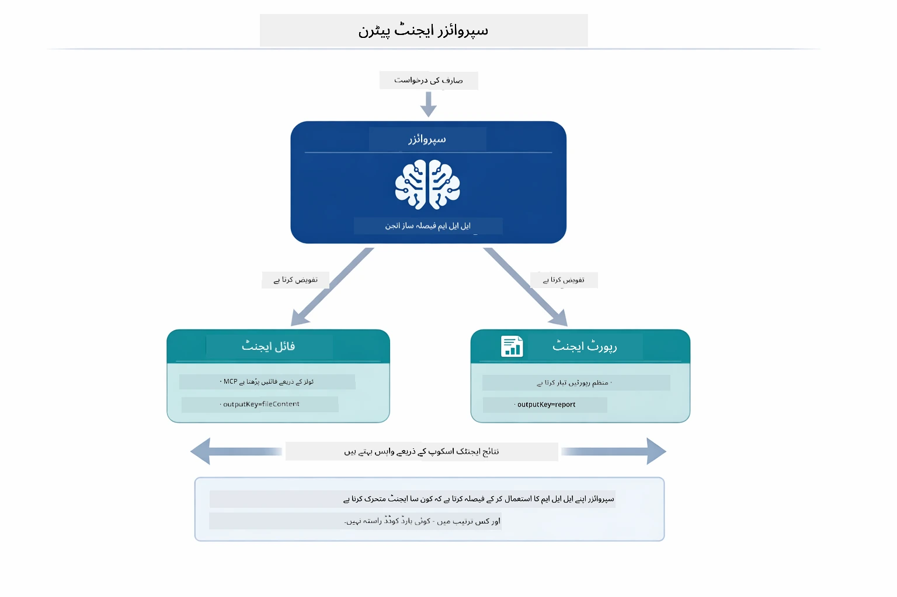

*سپر وائزر اپنے LLM کا استعمال کرتے ہوئے فیصلہ کرتا ہے کہ کون سے ایجنٹس کو بلانا ہے اور کس ترتیب سے — کسی سخت کوڈ شدہ راستہ کی ضرورت نہیں۔*

ہمارے فائل-سے-رپورٹ پائپ لائن کے لیے حقیقی ورک فلو کچھ یوں ہے:

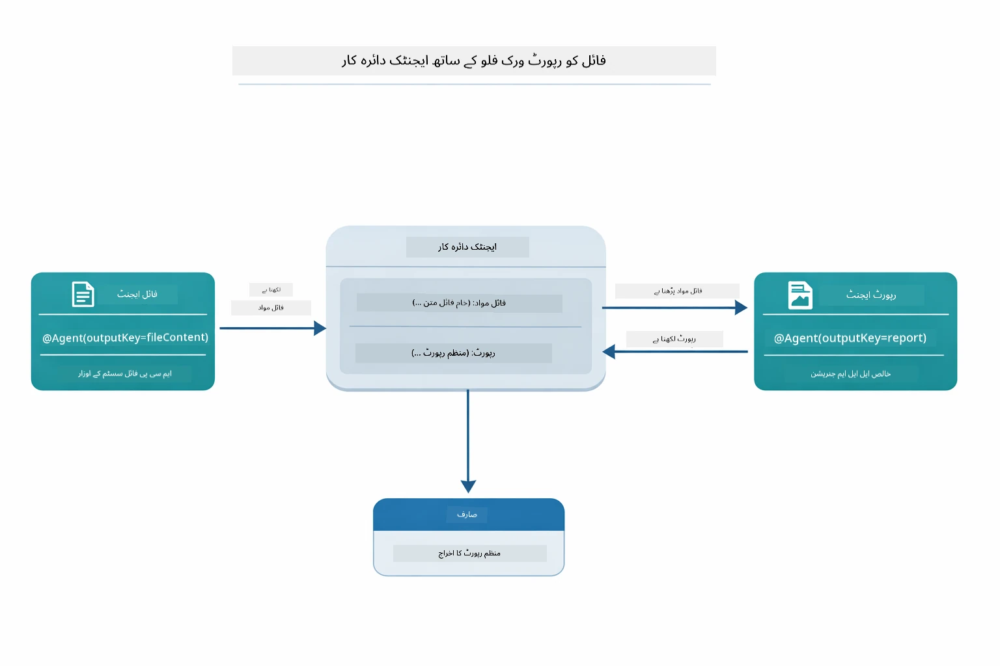

*FileAgent MCP ٹولز کے ذریعے فائل پڑھتا ہے، پھر ReportAgent خام مواد کو منظم رپورٹ میں بدل دیتا ہے۔*

ہر ایجنٹ اپنا آؤٹ پٹ **Agentic Scope** (مشترکہ میموری) میں ذخیرہ کرتا ہے، جس سے ذیلی ایجنٹس کو پچھلے نتائج تک رسائی ملتی ہے۔ یہ دکھاتا ہے کہ MCP ٹولز کیسے ایجنٹک ورک فلو میں بغیر کسی رکاوٹ کے شامل ہو جاتے ہیں — سپر وائزر کو یہ جاننے کی ضرورت نہیں کہ *فائلیں کیسے پڑھی جاتی ہیں، صرف یہ کہ `FileAgent` یہ کر سکتا ہے۔

#### ڈیمو چلانا

اسٹارٹ اسکرپٹس خودکار طریقے سے روٹ `.env` فائل سے ماحول کی متغیرات لوڈ کرتے ہیں:

**باش:**
```bash
cd 05-mcp
chmod +x start-supervisor.sh
./start-supervisor.sh
```

**پاور شیل:**
```powershell
cd 05-mcp
.\start-supervisor.ps1
```

**VS Code استعمال کرتے ہوئے:** `SupervisorAgentDemo.java` پر رائٹ کلک کریں اور **"Run Java"** منتخب کریں (یقینی بنائیں کہ آپ کی `.env` فائل ترتیب دی گئی ہے)۔

#### سپر وائزر کیسے کام کرتا ہے

ایجنٹس بنانے سے پہلے، آپ کو MCP ٹرانسپورٹ کو کلائنٹ سے جوڑنا ہوگا اور اسے `ToolProvider` کے طور پر لپیٹنا ہوگا۔ یہی طریقہ ہے جس سے MCP سرور کے ٹولز آپ کے ایجنٹس کے لیے دستیاب ہوتے ہیں:

```java
// ٹرانسپورٹ سے ایک MCP کلائنٹ بنائیں
McpClient mcpClient = new DefaultMcpClient.Builder()
        .transport(stdioTransport)
        .build();

// کلائنٹ کو ToolProvider کے طور پر لپیٹیں — یہ MCP ٹولز کو LangChain4j میں جوڑتا ہے
ToolProvider mcpToolProvider = McpToolProvider.builder()
        .mcpClients(List.of(mcpClient))
        .build();
```

اب آپ `mcpToolProvider` کو کسی بھی ایجنٹ میں شامل کر سکتے ہیں جسے MCP ٹولز کی ضرورت ہے:

```java
// مرحلہ 1: FileAgent MCP ٹولز کا استعمال کرتے ہوئے فائلیں پڑھتا ہے
FileAgent fileAgent = AgenticServices.agentBuilder(FileAgent.class)
        .chatModel(model)
        .toolProvider(mcpToolProvider)  // فائل آپریشنز کے لیے MCP ٹولز موجود ہیں
        .build();

// مرحلہ 2: ReportAgent منظم رپورٹیں بناتا ہے
ReportAgent reportAgent = AgenticServices.agentBuilder(ReportAgent.class)
        .chatModel(model)
        .build();

// Supervisor فائل → رپورٹ کے ورک فلو کو منظم کرتا ہے
SupervisorAgent supervisor = AgenticServices.supervisorBuilder()
        .chatModel(model)
        .subAgents(fileAgent, reportAgent)
        .responseStrategy(SupervisorResponseStrategy.LAST)  // حتمی رپورٹ لوٹائیں
        .build();

// Supervisor درخواست کی بنیاد پر ایجنٹس کو منتخب کرتا ہے
String response = supervisor.invoke("Read the file at /path/file.txt and generate a report");
```

#### جوابی حکمت عملیاں

جب آپ `SupervisorAgent` کو ترتیب دیتے ہیں، تو آپ یہ تعین کرتے ہیں کہ ذیلی ایجنٹس کے کام مکمل ہونے کے بعد یہ صارف کو اپنا آخری جواب کیسے پیش کرے۔ نیچے دیا گیا خاکہ تین دستیاب حکمت عملیاں دکھاتا ہے — LAST آخری ایجنٹ کا آؤٹ پٹ براہ راست دیتا ہے، SUMMARY تمام آؤٹ پٹس کو LLM کے ذریعے یکجا کرتا ہے، اور SCORED اصل درخواست کے مقابلے میں جو بہتر اسکور کرے اسے منتخب کرتا ہے:

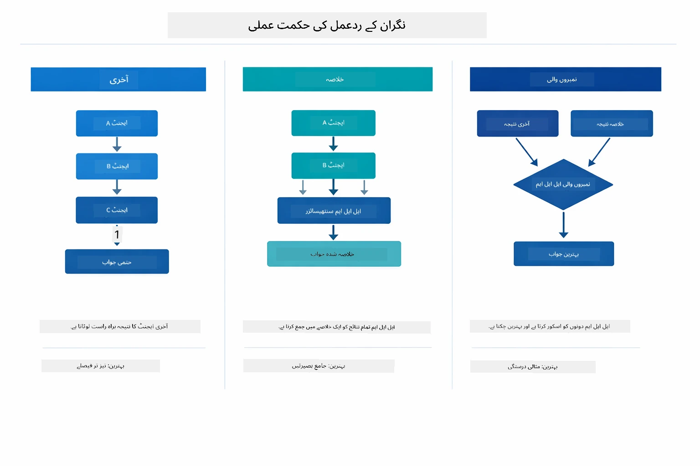

*سپر وائزر اپنے آخری جواب کی تیاری کے لیے تین حکمت عملیاں — انتخاب کریں کہ آپ آخری ایجنٹ کا آؤٹ پٹ چاہتے ہیں، خلاصہ شدہ جواب، یا بہترین اسکور والا آپشن۔*

دستیاب حکمت عملیاں یہ ہیں:

| حکمت عملی | وضاحت |
|----------|-------------|
| **LAST** | سپر وائزر آخری سب ایجنٹ یا ٹول کے آؤٹ پٹ کو واپس کرتا ہے۔ یہ اس وقت مفید ہے جب ورک فلو کا آخری ایجنٹ خاص طور پر مکمل، حتمی جواب تیار کرنے کے لیے بنایا گیا ہو (مثلاً، تحقیق کے لیے "خلاصہ ایجنٹ")۔ |
| **SUMMARY** | سپر وائزر اپنا اندرونی لسانی ماڈل (LLM) استعمال کرکے پوری گفتگو اور تمام ذیلی ایجنٹس کے آؤٹ پٹس کا خلاصہ بناتا ہے، پھر اسے حتمی جواب کے طور پر واپس کرتا ہے۔ یہ صارف کو صاف ستھرا، جامع جواب فراہم کرتا ہے۔ |
| **SCORED** | نظام اندرونی LLM استعمال کرکے LAST جواب اور پوری گفتگو کے SUMMARY کو اصل صارف کی درخواست کے مقابلے میں اسکور کرتا ہے، اور جو بہتر اسکور حاصل کرے اسے واپس کرتا ہے۔ |
مکمل امپلیمنٹیشن کے لیے [SupervisorAgentDemo.java](../../../05-mcp/src/main/java/com/example/langchain4j/mcp/SupervisorAgentDemo.java) دیکھیں۔

> **🤖 [GitHub Copilot](https://github.com/features/copilot) چیٹ کے ساتھ آزمائیں:** [`SupervisorAgentDemo.java`](../../../05-mcp/src/main/java/com/example/langchain4j/mcp/SupervisorAgentDemo.java) کھولیں اور پوچھیں:  
> - "Supervisor کیسے فیصلہ کرتا ہے کہ کون سے ایجنٹس کو بلاونا ہے؟"  
> - "Supervisor اور Sequential ورک فلو پیٹرنز میں کیا فرق ہے؟"  
> - "میں Supervisor کی پلاننگ کے رویے کو کیسے حسب ضرورت بنا سکتا ہوں؟"

#### آؤٹ پٹ کو سمجھنا

جب آپ ڈیمو چلائیں گے، تو آپ کو دیکھنے کو ملے گا کہ Supervisor کس طرح متعدد ایجنٹس کو منظم کرتا ہے۔ ہر سیکشن کا مطلب یہ ہے:

```
======================================================================
  FILE → REPORT WORKFLOW DEMO
======================================================================

This demo shows a clear 2-step workflow: read a file, then generate a report.
The Supervisor orchestrates the agents automatically based on the request.
```
  
**ہیڈر** ورک فلو کے تصور کا تعارف کراتا ہے: ایک مرکوز پائپ لائن فائل پڑھنے سے لے کر رپورٹ بنانے تک۔

```
--- WORKFLOW ---------------------------------------------------------
  ┌─────────────┐      ┌──────────────┐
  │  FileAgent  │ ───▶ │ ReportAgent  │
  │ (MCP tools) │      │  (pure LLM)  │
  └─────────────┘      └──────────────┘
   outputKey:           outputKey:
   'fileContent'        'report'

--- AVAILABLE AGENTS -------------------------------------------------
  [FILE]   FileAgent   - Reads files via MCP → stores in 'fileContent'
  [REPORT] ReportAgent - Generates structured report → stores in 'report'
```
  
**ورک فلو ڈایاگرام** ایجنٹس کے درمیان ڈیٹا کے بہاؤ کو دکھاتا ہے۔ ہر ایجنٹ کی ایک مخصوص ذمہ داری ہے:  
- **FileAgent** MCP ٹولز کا استعمال کرتے ہوئے فائلیں پڑھتا ہے اور خام مواد کو `fileContent` میں محفوظ کرتا ہے  
- **ReportAgent** اس مواد کو استعمال کرتا ہے اور `report` میں ایک منظم رپورٹ بناتا ہے

```
--- USER REQUEST -----------------------------------------------------
  "Read the file at .../file.txt and generate a report on its contents"
```
  
**صارف کی درخواست** کام کو ظاہر کرتی ہے۔ Supervisor اسے پارس کرتا ہے اور فیصلہ کرتا ہے کہ FileAgent → ReportAgent کو بلاونا ہے۔

```
--- SUPERVISOR ORCHESTRATION -----------------------------------------
  The Supervisor decides which agents to invoke and passes data between them...

  +-- STEP 1: Supervisor chose -> FileAgent (reading file via MCP)
  |
  |   Input: .../file.txt
  |
  |   Result: LangChain4j is an open-source, provider-agnostic Java framework for building LLM...
  +-- [OK] FileAgent (reading file via MCP) completed

  +-- STEP 2: Supervisor chose -> ReportAgent (generating structured report)
  |
  |   Input: LangChain4j is an open-source, provider-agnostic Java framew...
  |
  |   Result: Executive Summary...
  +-- [OK] ReportAgent (generating structured report) completed
```
  
**Supervisor کی ترتیب** 2-مرحلہ بہاؤ کو عمل میں دکھاتی ہے:  
1. **FileAgent** MCP کے ذریعے فائل پڑھتا ہے اور مواد محفوظ کرتا ہے  
2. **ReportAgent** مواد وصول کرتا ہے اور ایک منظم رپورٹ تیار کرتا ہے

Supervisor نے یہ فیصلے **خود مختارانہ طور پر** صارف کی درخواست کی بنیاد پر کیے۔

```
--- FINAL RESPONSE ---------------------------------------------------
Executive Summary
...

Key Points
...

Recommendations
...

--- AGENTIC SCOPE (Data Flow) ----------------------------------------
  Each agent stores its output for downstream agents to consume:
  * fileContent: LangChain4j is an open-source, provider-agnostic Java framework...
  * report: Executive Summary...
```
  
#### ایجنٹک ماڈیول کی خصوصیات کی وضاحت

یہ مثال ایجنٹک ماڈیول کی متعدد جدید خصوصیات کا مظاہرہ کرتی ہے۔ آئیے ایجنٹک اسکوپ اور ایجنٹ لسٹینرز پر قریب سے نظر ڈالیں۔

**ایجنٹک اسکوپ** مشترکہ میموری کو دکھاتا ہے جہاں ایجنٹس نے `@Agent(outputKey="...")` کے استعمال سے اپنے نتائج محفوظ کیے۔ اس سے یہ ممکن ہوتا ہے:  
- بعد کے ایجنٹس کو پہلے کے ایجنٹس کے نتائج تک رسائی  
- Supervisor کو ایک آخری جواب تیار کرنے کے لیے  
- آپ کو دیکھنے کے لیے کہ ہر ایجنٹ نے کیا پیدا کیا

نیچے دیا گیا ڈایاگرام دکھاتا ہے کہ ایجنٹک اسکوپ کیسے فائل سے رپورٹ کے ورک فلو میں مشترکہ میموری کے طور پر کام کرتا ہے — FileAgent اپنی پیداوار `fileContent` کلید کے تحت لکھتا ہے، ReportAgent اسے پڑھ کر اپنی پیداوار `report` کے تحت لکھتا ہے:

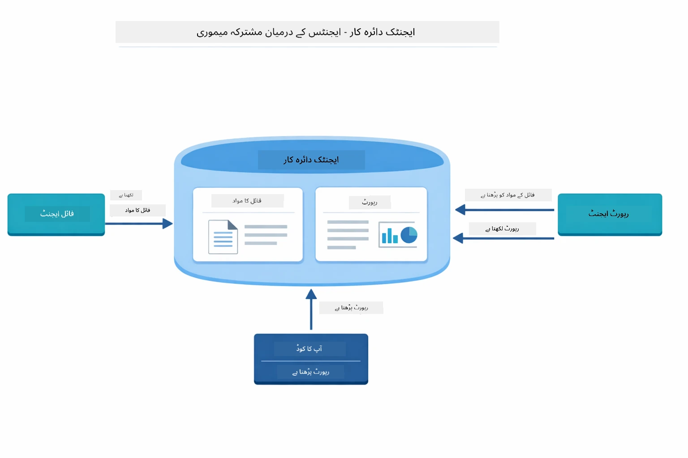

*ایجنٹک اسکوپ مشترکہ میموری کے طور پر کام کرتا ہے — FileAgent `fileContent` لکھتا ہے، ReportAgent اسے پڑھتا ہے اور `report` لکھتا ہے، اور آپ کا کوڈ آخری نتیجہ پڑھتا ہے۔*

```java
ResultWithAgenticScope<String> result = supervisor.invokeWithAgenticScope(request);
AgenticScope scope = result.agenticScope();
String fileContent = scope.readState("fileContent");  // فائل ایجنٹ سے خام فائل کا ڈیٹا
String report = scope.readState("report");            // رپورٹ ایجنٹ سے مرتب شدہ رپورٹ
```
  
**ایجنٹ لسٹینرز** ایجنٹ کے نفاذ کی نگرانی اور ڈیبگنگ کو ممکن بناتے ہیں۔ ڈیمو میں جو قدم بہ قدم آؤٹ پٹ آپ دیکھتے ہیں وہ ایک AgentListener سے آتا ہے جو ہر ایجنٹ کی کال میں شامل ہوتا ہے:  
- **beforeAgentInvocation** - اس وقت کال ہوتا ہے جب Supervisor کوئی ایجنٹ منتخب کرے، تاکہ آپ دیکھ سکیں کہ کون سا ایجنٹ کیوں منتخب ہوا  
- **afterAgentInvocation** - جب کوئی ایجنٹ مکمل ہو جائے تو کال ہوتا ہے، اور اس کا نتیجہ دکھاتا ہے  
- **inheritedBySubagents** - جب true ہو تو یہ لسٹینر تمام ایجنٹس کی نگرانی کرتا ہے

مندرجہ ذیل ڈایاگرام Agent Listener کے مکمل لائف سائیکل کو دکھاتا ہے، جس میں `onError` ایجنٹ کے نفاذ کے دوران ہونے والی ناکامیوں کو ہینڈل کرنے کا طریقہ بھی شامل ہے:

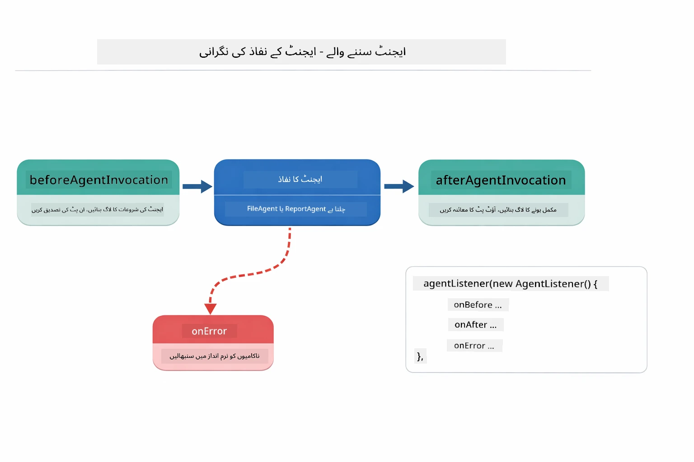

*Agent Listeners نفاذ کے لائف سائیکل سے جُڑے ہوتے ہیں — جب ایجنٹس شروع ہوں، مکمل ہوں، یا غلطیاں آئیں تو نگرانی کریں۔*

```java
AgentListener monitor = new AgentListener() {
    private int step = 0;
    
    @Override
    public void beforeAgentInvocation(AgentRequest request) {
        step++;
        System.out.println("  +-- STEP " + step + ": " + request.agentName());
    }
    
    @Override
    public void afterAgentInvocation(AgentResponse response) {
        System.out.println("  +-- [OK] " + response.agentName() + " completed");
    }
    
    @Override
    public boolean inheritedBySubagents() {
        return true; // تمام ذیلی ایجنٹس تک پھیلائیں
    }
};
```
  
Supervisor پیٹرن کے علاوہ، `langchain4j-agentic` ماڈیول کئی طاقتور ورک فلو پیٹرنز مہیا کرتا ہے۔ نیچے دکھایا گیا ڈایاگرام پانچوں پیٹرنز کو ظاہر کرتا ہے — آسان متوالی پائپ لائنز سے لے کر انسانی مداخلت کے ساتھ منظوری ورک فلو تک:

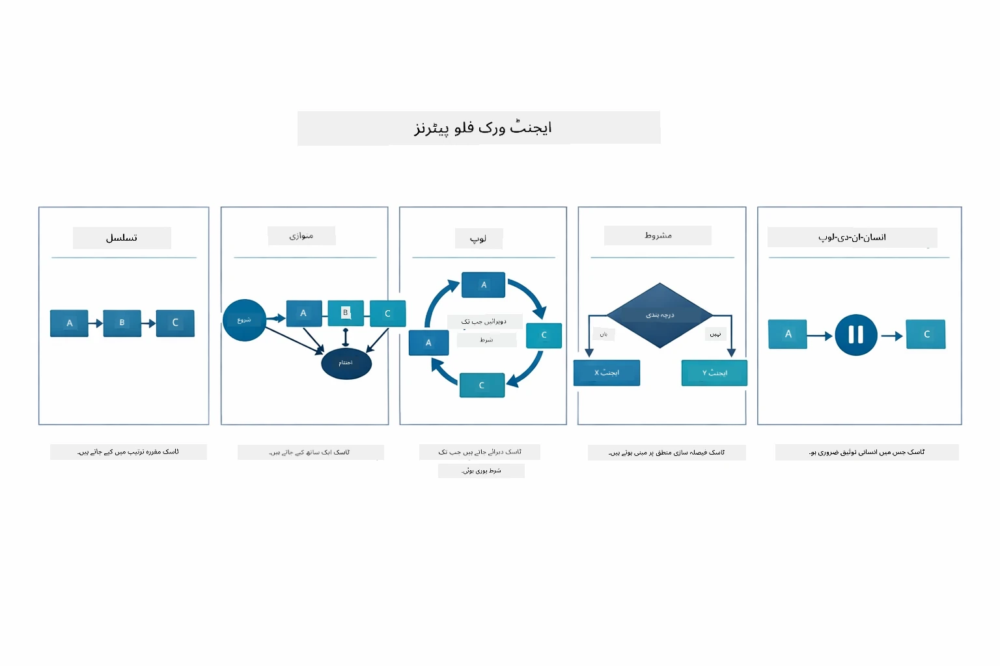

*ایجنٹس کو منظم کرنے کے پانچ ورک فلو پیٹرنز — آسان متوالی پائپ لائنز سے لے کر انسانی مداخلت کے ساتھ منظوری ورک فلو تک۔*

| پیٹرن | وضاحت | استعمال کا کیس |
|---------|-------------|----------|
| **Sequential** | ایجنٹس کو ترتیب سے چلائیں، آؤٹ پٹ اگلے کو جاتا ہے | پائپ لائنز: تحقیق → تجزیہ → رپورٹ |
| **Parallel** | ایجنٹس کو بیک وقت چلائیں | آزاد کام: موسم + خبریں + اسٹاکس |
| **Loop** | شرط پوری ہونے تک بار بار کریں | معیار کی جانچ: اسکور ≥ 0.8 تک بہتر بنائیں |
| **Conditional** | حالات کی بنیاد پر راستہ منتخب کریں | درجہ بندی → ماہر ایجنٹ کو بھیجیں |
| **Human-in-the-Loop** | انسانی چیک پوائنٹس شامل کریں | منظوری کے ورک فلو، مواد کا جائزہ |

## کلیدی تصورات

اب جب کہ آپ نے MCP اور ایجنٹک ماڈیول کو عملی طور پر دیکھا، آئیے خلاصہ کریں کہ ہر طریقہ کب استعمال کریں۔

MCP کا سب سے بڑا فائدہ اس کا بڑھتا ہوا ایکو سسٹم ہے۔ نیچے دیا گیا ڈایاگرام دکھاتا ہے کہ کیسے ایک یکساں پروٹوکول آپ کی AI ایپلیکیشن کو مختلف MCP سرورز سے جوڑتا ہے — فائل سسٹم اور ڈیٹابیس سے لے کر GitHub، ای میل، ویب سکریپنگ اور مزید:

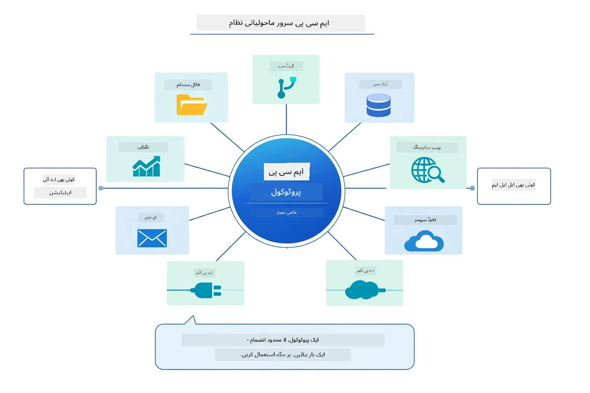

*MCP ایک یونیورسل پروٹوکول ایکو سسٹم بناتا ہے — کوئی بھی MCP-مطابق سرور کسی بھی MCP-مطابق کلائنٹ کے ساتھ کام کرتا ہے، جو ایپلیکیشنز کے درمیان ٹول شیئرنگ کو ممکن بناتا ہے۔*

**MCP** اس وقت بہترین ہے جب آپ موجودہ ٹول ایکو سسٹمز سے فائدہ اٹھانا چاہتے ہیں، ایسے ٹولز بنانا چاہتے ہیں جنہیں متعدد ایپلیکیشنز شیئر کر سکیں، تیسرے فریق کی سروسز کو معیاری پروٹوکولز کے ساتھ انٹیگریٹ کرنا چاہتے ہیں، یا بغیر کوڈ بدلے ٹول امپلیمنٹیشنز تبدیل کرنا چاہتے ہیں۔

**ایجنٹک ماڈیول** اس وقت بہترین کام کرتا ہے جب آپ کو `@Agent` انوٹیشنز کے ساتھ وضاحتی ایجنٹ کی تعریفیں چاہئیں، ورک فلو آراکسیٹریشن (متوالی، لوپ، متوازی) چاہیے، انٹرفیس پر مبنی ایجنٹ ڈیزائن کو ترجیح دیتے ہوں، یا متعدد ایجنٹس کو ایک دوسرے کے آؤٹ پٹ کے ذریعے جوڑنا ہو `outputKey` کے ذریعے۔

**Supervisor Agent pattern** تب نمایاں ہوتا ہے جب ورک فلو پیشگی متوقع نہ ہو اور آپ چاہتے ہوں کہ LLM فیصلہ کرے، جب آپ کے پاس متعدد تخصص یافتہ ایجنٹس ہوں جنہیں متحرک آراکسیٹریشن کی ضرورت ہو، جب بات چیت پر مبنی نظام بنانا ہو جو مختلف صلاحیتوں کو روٹ کریں، یا جب آپ کو سب سے زیادہ لچکدار، موافق ایجنٹ رویے کی ضرورت ہو۔

Module 04 کے کسٹم `@Tool` طریقوں اور اس ماڈیول کے MCP ٹولز کے مابین فیصلہ کرنے میں مدد کے لیے، ذیل میں کلیدی تقابل دکھایا گیا ہے — کسٹم ٹولز آپ کو سخت مربوط اور ایپ مخصوص منطق کے لیے مکمل ٹائپ سیفٹی دیتے ہیں، جبکہ MCP ٹولز معیاری، دوبارہ قابل استعمال انٹیگریشن فراہم کرتے ہیں:

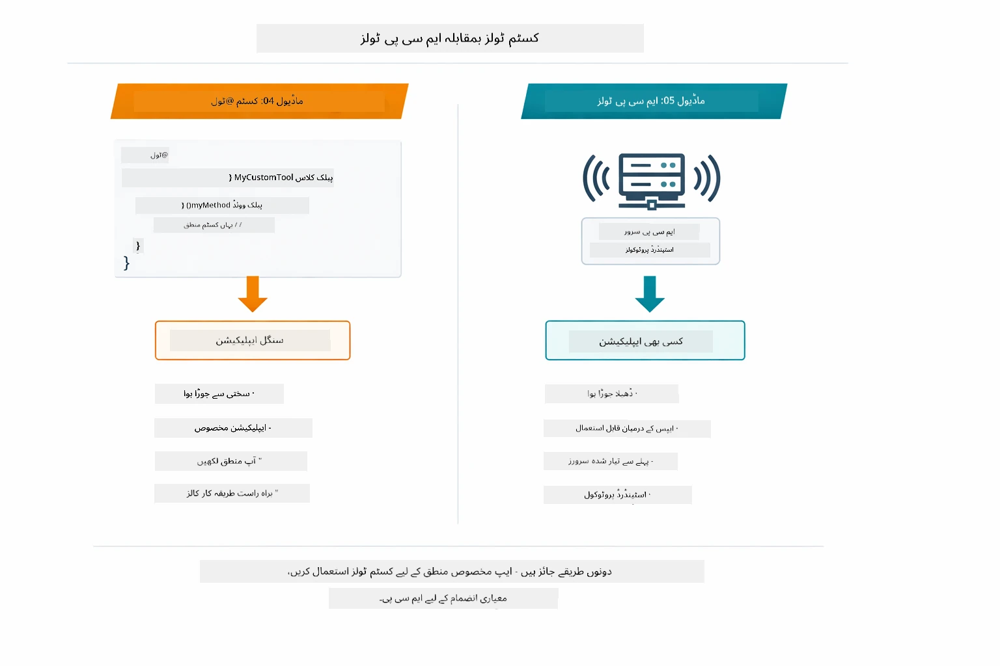

*کس وقت کسٹم @Tool طریقے استعمال کریں بمقابلہ MCP ٹولز — کسٹم ٹولز ایپ مخصوص منطق کے لیے مکمل ٹائپ سیفٹی کے ساتھ، MCP ٹولز معیاری انٹیگریشنز کے لیے جو ایپلیکیشنز کے پار کام کرتے ہیں۔*

## مبارک ہو!

آپ نے LangChain4j for Beginners کورس کے تمام پانچ ماڈیول مکمل کر لیے ہیں! یہاں آپ کی مکمل سیکھنے کی سفر کی جھلک ہے — بنیادی چیٹ سے لے کر MCP کی طاقت والے ایجنٹک سسٹمز تک:

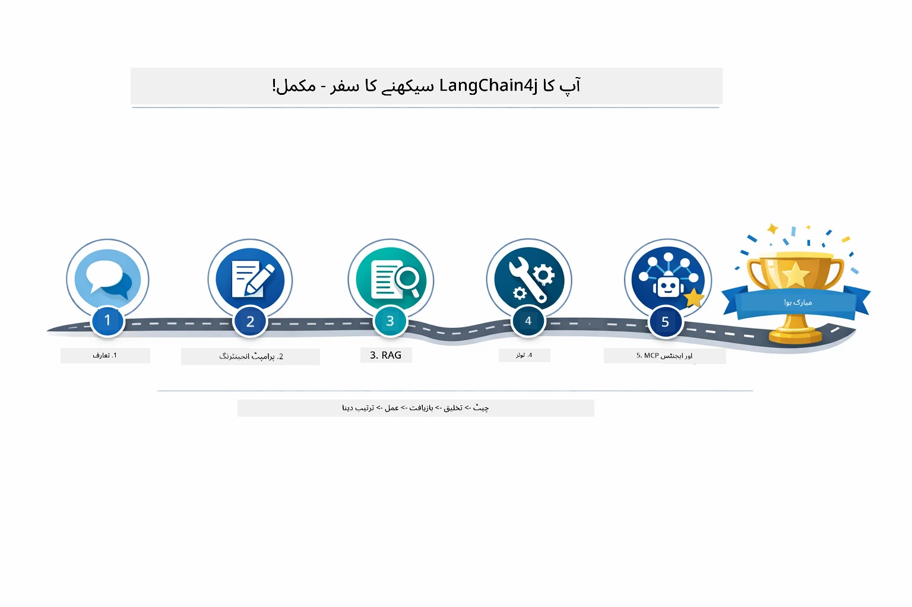

*آپ کا سیکھی ہوئی رہنمائی پنجہ ماڈیولز کے ذریعے — بنیادی چیٹ سے لے کر MCP کی طاقت والے ایجنٹک سسٹمز تک۔*

آپ نے LangChain4j for Beginners کورس مکمل کیا ہے۔ آپ نے سیکھا:  

- میموری کے ساتھ بات چیت کرنے والا AI کیسے بنائیں (Module 01)  
- مختلف کاموں کے لیے پرامپٹ انجینئرنگ پیٹرنز (Module 02)  
- RAG کے ذریعے اپنے دستاویزات میں جوابات کی بنیاد بنانا (Module 03)  
- کسٹم ٹولز کے ساتھ بنیادی AI ایجنٹس (اسسٹنٹس) بنانا (Module 04)  
- LangChain4j MCP اور Agentic ماڈیولز کے ساتھ معیاری ٹولز کا انٹیگریشن (Module 05)  

### آگے کیا ہے؟

ماڈیولز مکمل کرنے کے بعد، [Testing Guide](../docs/TESTING.md) میں LangChain4j کی جانچ کے تصورات کو عملی طور پر دیکھیں۔

**سرکاری وسائل:**  
- [LangChain4j دستاویزات](https://docs.langchain4j.dev/) - جامع گائیڈز اور API حوالہ  
- [LangChain4j GitHub](https://github.com/langchain4j/langchain4j) - ماخذ کوڈ اور مثالیں  
- [LangChain4j ٹیوٹوریلز](https://docs.langchain4j.dev/tutorials/) - مختلف استعمال کے کیسز کے لیے مرحلہ وار ٹیوٹوریلز  

اس کورس کو مکمل کرنے کے لیے آپ کا شکریہ!

---

**نیوی گیشن:** [← پچھلا: Module 04 - Tools](../04-tools/README.md) | [مین پیج پر واپس](../README.md)

---

<!-- CO-OP TRANSLATOR DISCLAIMER START -->
**ڈس کلیمر**:  
یہ دستاویز AI ترجمہ سروس [Co-op Translator](https://github.com/Azure/co-op-translator) کے ذریعے ترجمہ کی گئی ہے۔ اگرچہ ہم درستگی کے لیے کوشاں ہیں، براہِ کرم نوٹ کریں کہ خودکار تراجم میں غلطیاں یا عدم درستیاں ہو سکتی ہیں۔ اصل دستاویز اپنی مادری زبان میں معتبر ماخذ سمجھا جانا چاہیے۔ اہم معلومات کے لیے پیشہ ور انسانی ترجمہ کی سفارش کی جاتی ہے۔ اس ترجمہ کے استعمال سے پیدا ہونے والی کسی بھی غلط فہمی یا غلط تعبیر کے لیے ہم ذمہ دار نہیں ہیں۔
<!-- CO-OP TRANSLATOR DISCLAIMER END -->