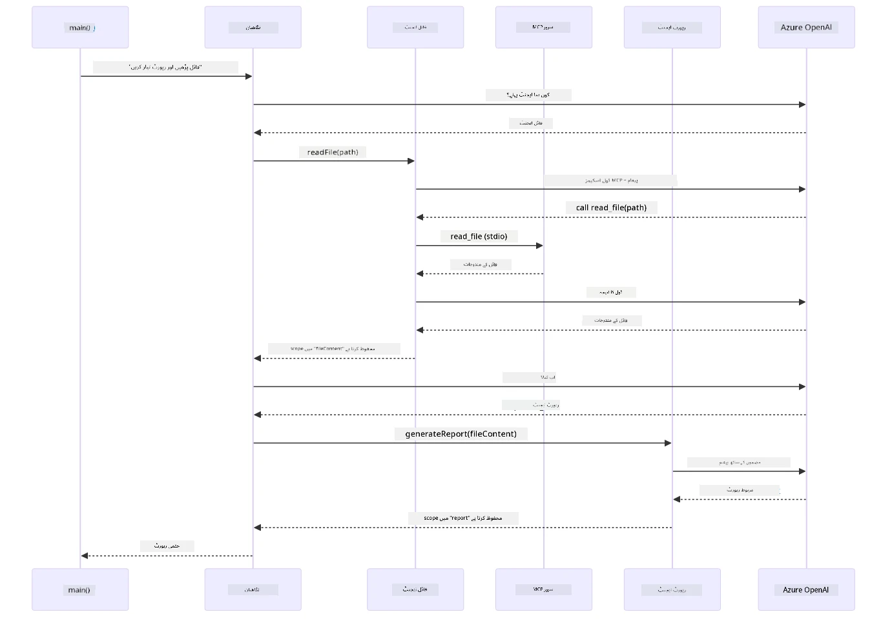

# ماڈیول 05: ماڈل کانٹیکسٹ پروٹوکول (MCP)

## فہرست مضامین

- [ویڈیو واک تھرو](../../../05-mcp)
- [آپ کیا سیکھیں گے](../../../05-mcp)
- [MCP کیا ہے؟](../../../05-mcp)
- [MCP کیسے کام کرتا ہے](../../../05-mcp)
- [ایجنٹک ماڈیول](../../../05-mcp)
- [مثالیں چلانا](../../../05-mcp)
  - [ضروریات](../../../05-mcp)
- [فوری آغاز](../../../05-mcp)
  - [فائل آپریشنز (Stdio)](../../../05-mcp)
  - [سپر وائزر ایجنٹ](../../../05-mcp)
    - [ڈیمو چلانا](../../../05-mcp)
    - [سپر وائزر کیسے کام کرتا ہے](../../../05-mcp)
    - [FileAgent رن ٹائم پر MCP ٹولز کیسے دریافت کرتا ہے](../../../05-mcp)
    - [جوابی حکمت عملی](../../../05-mcp)
    - [آؤٹ پٹ کو سمجھنا](../../../05-mcp)
    - [ایجنٹک ماڈیول کی خصوصیات کی وضاحت](../../../05-mcp)
- [اہم تصورات](../../../05-mcp)
- [مبارک ہو!](../../../05-mcp)
  - [اگلا کیا ہے؟](../../../05-mcp)

## ویڈیو واک تھرو

یہ لائیو سیشن دیکھیں جو اس ماڈیول کے ساتھ شروع کرنے کا طریقہ بتاتا ہے:

<a href="https://www.youtube.com/watch?v=O_J30kZc0rw"></a>

## آپ کیا سیکھیں گے

آپ نے گفتگو کرنے والا AI بنایا ہے، پرامپٹس میں مہارت حاصل کی ہے، جوابات کو دستاویزات میں بنیاد دی ہے، اور اوزاروں کے ساتھ ایجنٹس بنائے ہیں۔ لیکن یہ سب اوزار آپ کی مخصوص ایپلیکیشن کے لیے کسٹم بنائے گئے تھے۔ اگر آپ اپنے AI کو ایسے معیاری اوزار کے نظام تک رسائی دے سکیں جو کوئی بھی بنا اور شیئر کر سکتا ہے؟ اس ماڈیول میں، آپ سیکھیں گے کہ اسے کیسے کیا جائے ماڈل کانٹیکسٹ پروٹوکول (MCP) اور LangChain4j کے ایجنٹک ماڈیول کے ساتھ۔ ہم پہلے ایک سادہ MCP فائل ریڈر دکھائیں گے اور پھر دکھائیں گے کہ یہ آسانی سے سپروائزر ایجنٹ پیٹرن استعمال کرتے ہوئے ایڈوانسڈ ایجنٹک ورک فلو میں کیسے ضم ہوتا ہے۔

## MCP کیا ہے؟

ماڈل کانٹیکسٹ پروٹوکول (MCP) بالکل یہی فراہم کرتا ہے — AI ایپلیکیشنز کے لیے بیرونی اوزار دریافت کرنے اور استعمال کرنے کا معیاری طریقہ۔ ہر ڈیٹا سورس یا سروس کے لیے کسٹم انٹیگریشنز لکھنے کے بجائے، آپ ایسے MCP سرورز سے کنیکٹ کرتے ہیں جو اپنی صلاحیتوں کو مستقل فارمیٹ میں پیش کرتے ہیں۔ آپ کا AI ایجنٹ پھر خود بخود ان اوزار کو دریافت اور استعمال کر سکتا ہے۔

نیچے دیا گیا خاکہ فرق دکھاتا ہے — بغیر MCP کے، ہر انٹیگریشن کے لیے کسٹم پوائنٹ ٹو پوائنٹ وائرنگ درکار ہوتی ہے؛ MCP کے ساتھ، ایک پروٹوکول آپ کی ایپ کو کسی بھی ٹول سے جوڑتا ہے:


*MCP سے پہلے: پیچیدہ پوائنٹ ٹو پوائنٹ انٹیگریشنز۔ MCP کے بعد: ایک پروٹوکول، لا متناہی امکانات۔*

MCP AI ڈیولپمنٹ میں ایک بنیادی مسئلہ حل کرتا ہے: ہر انٹیگریشن کسٹم ہوتی ہے۔ گٹ ہب تک رسائی چاہیے؟ کسٹم کوڈ۔ فائلیں پڑھنی ہیں؟ کسٹم کوڈ۔ ڈیٹا بیس کو کوئری کرنا ہے؟ کسٹم کوڈ۔ اور یہ کوئی بھی انٹیگریشن دیگر AI ایپلیکیشنز کے ساتھ کام نہیں کرتی۔

MCP اسے معیاری بناتا ہے۔ ایک MCP سرور اوزار واضح وضاحتوں اور اسکیموں کے ساتھ پیش کرتا ہے۔ کوئی بھی MCP کلائنٹ کنیکٹ کر سکتا ہے، دستیاب اوزار دریافت کر سکتا ہے، اور استعمال کر سکتا ہے۔ ایک بار بنائیں، ہر جگہ استعمال کریں۔

نیچے والا خاکہ اس آرکیٹیکچر کی وضاحت کرتا ہے — ایک واحد MCP کلائنٹ (آپ کی AI ایپلیکیشن) متعدد MCP سرورز سے کنیکٹ ہوتا ہے، جو اپنے اوزار کو معیاری پروٹوکول کے ذریعے ظاہر کرتے ہیں:


*ماڈل کانٹیکسٹ پروٹوکول آرکیٹیکچر - معیاری اوزار کی دریافت اور عمل درآمد*

## MCP کیسے کام کرتا ہے

اندرونی طور پر، MCP ایک تہہ دار آرکیٹیکچر استعمال کرتا ہے۔ آپ کی جاوا ایپلیکیشن (MCP کلائنٹ) دستیاب اوزار دریافت کرتی ہے، JSON-RPC درخواستیں ایک ٹرانسپورٹ لیئر (Stdio یا HTTP) کے ذریعے بھیجتی ہے، اور MCP سرور آپریشنز انجام دیتا ہے اور نتائج واپس کرتا ہے۔ ذیل کا خاکہ اس پروٹوکول کی ہر تہہ کو کھول کر دکھاتا ہے:


*MCP انڈر دی ہڈ کیسے کام کرتا ہے — کلائنٹس اوزار دریافت کرتے ہیں، JSON-RPC پیغامات کا تبادلہ کرتے ہیں، اور ایک ٹرانسپورٹ لیئر کے ذریعے آپریشنز انجام دیتے ہیں۔*

**سرور-کلائنٹ آرکیٹیکچر**

MCP ایک کلائنٹ-سرور ماڈل استعمال کرتا ہے۔ سرورز اوزار فراہم کرتے ہیں - فائلیں پڑھنا، ڈیٹا بیس کو کوئری کرنا، APIs کال کرنا۔ کلائنٹس (آپ کی AI ایپلیکیشن) سرورز سے کنیکٹ ہوتی ہے اور ان کے اوزار استعمال کرتی ہے۔

LangChain4j کے ساتھ MCP استعمال کرنے کے لیے یہ Maven انحصار شامل کریں:

```xml
<dependency>
    <groupId>dev.langchain4j</groupId>
    <artifactId>langchain4j-mcp</artifactId>
    <version>${langchain4j.version}</version>
</dependency>
```

**ٹول دریافت**

جب آپ کا کلائنٹ MCP سرور سے کنیکٹ کرتا ہے، تو وہ پوچھتا ہے "آپ کے پاس کون سے اوزار ہیں؟" سرور دستیاب اوزاروں کی فہرست دیتا ہے، ہر ایک کی وضاحت اور پیرا میٹر اسکیمے کے ساتھ۔ آپ کا AI ایجنٹ پھر صارف کی درخواست کے مطابق فیصلہ کر سکتا ہے کہ کون سے اوزار استعمال کرنے ہیں۔ نیچے دیا گیا خاکہ اس ہینڈشیک کو دکھاتا ہے — کلائنٹ `tools/list` درخواست بھیجتا ہے اور سرور اپنے دستیاب اوزار وضاحتوں اور پیرا میٹر اسکیموں کے ساتھ واپس کرتا ہے:


*AI ابتدائی مرحلے میں دستیاب اوزار دریافت کرتا ہے — اب وہ جانتا ہے کون سی صلاحیتیں دستیاب ہیں اور فیصلہ کر سکتا ہے کہ کون سے استعمال کرنے ہیں۔*

**ٹرانسپورٹ میکانزم**

MCP مختلف ٹرانسپورٹ میکانزمز کی حمایت کرتا ہے۔ دو اختیارات ہیں Stdio (لوکل سب پروسیس کمیونیکیشن کے لیے) اور Streamable HTTP (ریموٹ سرورز کے لیے)۔ یہ ماڈیول Stdio ٹرانسپورٹ دکھاتا ہے:


*MCP ٹرانسپورٹ میکانزمز: ریموٹ سرورز کے لیے HTTP، لوکل پروسیسز کے لیے Stdio*

**Stdio** - [StdioTransportDemo.java](../../../05-mcp/src/main/java/com/example/langchain4j/mcp/StdioTransportDemo.java)

لوکل پروسیسز کے لیے۔ آپ کی ایپلیکیشن ایک سرور کو بطور سب پروسیس جنم دیتی ہے اور معیاری ان پٹ/آؤٹ پٹ کے ذریعے بات چیت کرتی ہے۔ فائل سسٹم تک رسائی یا کمانڈ لائن ٹولز کے لیے مفید۔

```java
McpTransport stdioTransport = new StdioMcpTransport.Builder()
    .command(List.of(
        npmCmd, "exec",
        "@modelcontextprotocol/server-filesystem@2025.12.18",
        resourcesDir
    ))
    .logEvents(false)
    .build();
```

`@modelcontextprotocol/server-filesystem` سرور درج ذیل اوزار پیش کرتا ہے، تمام آپ کے مخصوص کردہ ڈائریکٹریز تک محدود:

| ٹول | وضاحت |
|------|-------------|
| `read_file` | ایک فائل کا مواد پڑھیں |
| `read_multiple_files` | ایک کال میں متعدد فائلیں پڑھیں |
| `write_file` | فائل بنائیں یا اوور رائٹ کریں |
| `edit_file` | مخصوص تلاش اور تبدیل کی ترمیمات کریں |
| `list_directory` | کسی راستے پر فائلوں اور ڈائریکٹریز کی فہرست بنائیں |
| `search_files` | پیٹرن سے ملتی ہوئی فائلوں کی گہرائی تک تلاش کریں |
| `get_file_info` | فائل کا میٹا ڈیٹا حاصل کریں (سائز، ٹائم سٹیمپس، اجازتیں) |
| `create_directory` | ڈائریکٹری بنائیں (والدین کی ڈائریکٹریز سمیت) |
| `move_file` | فائل یا ڈائریکٹری منتقل یا ری نیم کریں |

نیچے دیا گیا خاکہ دکھاتا ہے کہ Stdio ٹرانسپورٹ رن ٹائم پر کیسے کام کرتا ہے — آپ کی جاوا ایپلیکیشن MCP سرور کو چائلڈ پروسیس کے طور پر بناتی ہے اور وہ stdin/stdout پائپس کے ذریعے بات چیت کرتے ہیں، بغیر کسی نیٹ ورک یا HTTP کے ملوث ہوئے:


*عمل میں Stdio ٹرانسپورٹ — آپ کی ایپلیکیشن MCP سرور کو چائلڈ پروسیس کے طور پر بناتی ہے اور stdin/stdout پائپس کے ذریعے بات چیت کرتی ہے۔*

> **🤖 [GitHub Copilot](https://github.com/features/copilot) چیٹ کے ساتھ آزمائیں:** [`StdioTransportDemo.java`](../../../05-mcp/src/main/java/com/example/langchain4j/mcp/StdioTransportDemo.java) کھولیں اور پوچھیں:
> - "Stdio ٹرانسپورٹ کیسے کام کرتا ہے اور مجھے کب HTTP کے مقابلے میں اسے استعمال کرنا چاہیے؟"
> - "LangChain4j MCP سرور پروسیسز کے لائف سائیکل کو کیسے منظم کرتا ہے؟"
> - "AI کو فائل سسٹم کی رسائی دینے کے حفاظتی پہلو کیا ہیں؟"

## ایجنٹک ماڈیول

جبکہ MCP معیاری اوزار فراہم کرتا ہے، LangChain4j کا **ایجنٹک ماڈیول** ان اوزار کو مربوط کرنے والے ایجنٹس بنانے کا ایک declarative طریقہ فراہم کرتا ہے۔ `@Agent` اینوٹیشن اور `AgenticServices` آپ کو انٹرفیسز کے ذریعے ایجنٹ کے سلوک کی وضاحت کرنے دیتے ہیں، امریٹیو کوڈ کی جگہ۔

اس ماڈیول میں، آپ **سپر وائزر ایجنٹ** پیٹرن دریافت کریں گے — ایک جدید ایجنٹک AI نقطہ نظر جہاں "سپر وائزر" ایجنٹ صارف کی درخواست کی بنیاد پر متحرک طور پر فیصلہ کرتا ہے کہ کون سے سب-ایجنٹس کو فعال کرنا ہے۔ ہم دونوں تصورات کو ملا کر اپنے ایک سب-ایجنٹ کو MCP سے چلنے والی فائل کی رسائی کی صلاحیت دیں گے۔

ایجنٹک ماڈیول استعمال کرنے کے لیے یہ Maven انحصار شامل کریں:

```xml
<dependency>
    <groupId>dev.langchain4j</groupId>
    <artifactId>langchain4j-agentic</artifactId>
    <version>${langchain4j.mcp.version}</version>
</dependency>
```
> **نوٹ:** `langchain4j-agentic` ماڈیول ایک الگ ورژن پراپرٹی (`langchain4j.mcp.version`) استعمال کرتا ہے کیونکہ اسے مرکزی LangChain4j لائبریریز سے مختلف شیڈول پر جاری کیا جاتا ہے۔

> **⚠️ تجرباتی:** `langchain4j-agentic` ماڈیول **تجرباتی** ہے اور اس میں تبدیلی ممکن ہے۔ AI اسسٹنٹ بنانے کا مستحکم طریقہ `langchain4j-core` کے ساتھ کسٹم ٹولز ہے (ماڈیول 04)۔

## مثالیں چلانا

### ضروریات

- مکمل شدہ [ماڈیول 04 - ٹولز](../04-tools/README.md) (یہ ماڈیول کسٹم ٹول تصورات پر مشتمل ہے اور MCP ٹولز سے موازنہ کرتا ہے)
- root ڈائریکٹری میں `.env` فائل Azure اسناد کے ساتھ (جو کہ Module 01 میں `azd up` کے ذریعے بنائی گئی ہو)
- جاوا 21+، Maven 3.9+
- Node.js 16+ اور npm (MCP سرورز کے لیے)

> **نوٹ:** اگر آپ نے ابھی تک اپنے ماحول کے متغیرات سیٹ نہیں کیے، تو [ماڈیول 01 - تعارف](../01-introduction/README.md) دیکھیں ڈپلائمنٹ ہدایات کے لیے (`azd up` خود بخود `.env` فائل بناتا ہے)، یا `.env.example` کو root میں `.env` کے طور پر کاپی کریں اور اپنی اقدار بھریں۔

## فوری آغاز

**VS Code استعمال کرتے ہوئے:** ایکسپلورر میں کسی بھی ڈیمو فائل پر رائٹ کلک کریں اور **"Run Java"** منتخب کریں، یا رن اور ڈیبگ پینل سے لانچ کنفیگریشن استعمال کریں (یقینی بنائیں آپ کی `.env` فائل Azure اسناد کے ساتھ ترتیب دی گئی ہے)۔

**Maven استعمال کرتے ہوئے:** متبادل طور پر، آپ نیچے دی گئی مثالوں سے کمانڈ لائن سے چلائیں۔

### فائل آپریشنز (Stdio)

یہ مقامی سب پروسیس پر مبنی اوزاروں کی مثال دیتا ہے۔

**✅ کوئی ضروریات نہیں ہیں** - MCP سرور خود بخود جنم لیتا ہے۔

**اسٹارٹ اسکرپٹس استعمال کریں (تجویز کردہ):**

اسٹارٹ اسکرپٹس خود بخود root `.env` فائل سے ماحول متغیرات لوڈ کرتے ہیں:

**بش:**
```bash
cd 05-mcp
chmod +x start-stdio.sh
./start-stdio.sh
```

**پاور شیل:**
```powershell
cd 05-mcp
.\start-stdio.ps1
```

**VS Code استعمال کرتے ہوئے:** `StdioTransportDemo.java` پر رائٹ کلک کریں اور **"Run Java"** منتخب کریں (اپنی `.env` فائل ترتیب دینا یقینی بنائیں)۔

ایپلیکیشن خود بخود فائل سسٹم MCP سرور جنم دیتی ہے اور مقامی فائل پڑھتی ہے۔ نوٹ کریں کہ سب پروسیس مینجمنٹ آپ کے لیے خود کیسے کی جاتی ہے۔

**متوقع آؤٹ پٹ:**
```
Assistant response: The file provides an overview of LangChain4j, an open-source Java library
for integrating Large Language Models (LLMs) into Java applications...
```

### سپر وائزر ایجنٹ

**سپر وائزر ایجنٹ پیٹرن** ایک **لچکدار** قسم کا ایجنٹک AI ہے۔ ایک سپر وائزر LLM استعمال کرتا ہے خود مختار طریقے سے فیصلہ کرنے کے لیے کہ کون سے ایجنٹس کو صارف کی درخواست کی بنیاد پر فعال کرنا ہے۔ اگلی مثال میں، ہم MCP سے چلنے والی فائل رسائی کو LLM ایجنٹ کے ساتھ ملا کر ایک نگرانی شدہ فائل پڑھیں → رپورٹ ورک فلو بنائیں گے۔

ڈیمو میں، `FileAgent` MCP فائل سسٹم ٹولز استعمال کرتے ہوئے فائل پڑھتا ہے، اور `ReportAgent` ایک ساختہ رپورٹ تیار کرتا ہے جس میں ایک ایگزیکٹو سمری (1 جملہ)، 3 کلیدی نکات، اور سفارشات شامل ہیں۔ سپر وائزر خودکار طور پر اس بہاؤ کی ترتیب دیتا ہے:


*سپر وائزر اپنے LLM کا استعمال کرتا ہے فیصلہ کرنے کے لیے کہ کون سے ایجنٹس کو فعال کرنا ہے اور کس ترتیب میں — ہارڈکوڈڈ روٹنگ کی کوئی ضرورت نہیں۔*

یہاں ہمارے فائل سے رپورٹ پائپ لائن کا ٹھوس ورک فلو دکھایا گیا ہے:


*FileAgent MCP ٹولز کے ذریعے فائل پڑھتا ہے، پھر ReportAgent خام مواد کو ساختہ رپورٹ میں تبدیل کرتا ہے۔*

ذیل میں تسلسل کا خاکہ مکمل سپر وائزر آرکیسٹریشن کو ٹریس کرتا ہے — MCP سرور کے جنم لینے سے لے کر سپر وائزر کے خودمختار ایجنٹ انتخاب، Stdio کے ذریعے ٹول کالز، اور آخری رپورٹ تک:



*سپر وائزر خود مختار طریقے سے FileAgent کو فعال کرتا ہے (جو MCP سرور کو Stdio پر کال کر کے فائل پڑھتا ہے)، پھر ReportAgent کو ایک ساختہ رپورٹ تیار کرنے کو کہتا ہے — ہر ایجنٹ اپنے آؤٹ پٹ کو مشترکہ Agentic Scope میں ذخیرہ کرتا ہے۔*

ہر ایجنٹ اپنا آؤٹ پٹ **Agentic Scope** (مشترکہ میموری) میں محفوظ کرتا ہے، جس سے نیچے والے ایجنٹس پچھلے نتائج تک رسائی حاصل کر سکتے ہیں۔ یہ ظاہر کرتا ہے کہ MCP ٹولز ایجنٹک ورک فلو میں بغیر رکاوٹ کیسے ضم ہوتے ہیں — سپر وائزر کو معلوم کرنے کی ضرورت نہیں *کہ* فائلیں کیسے پڑھی جاتی ہیں، بس اتنا جاننا کافی ہے کہ `FileAgent` ایسا کر سکتا ہے۔

#### ڈیمو چلانا

اسٹارٹ اسکرپٹس خود بخود root `.env` فائل سے ماحول متغیرات لوڈ کرتے ہیں:

**بش:**
```bash
cd 05-mcp
chmod +x start-supervisor.sh
./start-supervisor.sh
```

**پاور شیل:**
```powershell
cd 05-mcp
.\start-supervisor.ps1
```

**VS Code استعمال کرتے ہوئے:** `SupervisorAgentDemo.java` پر رائٹ کلک کریں اور **"Run Java"** منتخب کریں (اپنی `.env` فائل ترتیب دینا یقینی بنائیں)۔

#### سپر وائزر کیسے کام کرتا ہے

ایجنٹس بنانے سے پہلے، آپ کو MCP ٹرانسپورٹ کو کلائنٹ سے جوڑنا ہوگا اور اسے `ToolProvider` کے طور پر لپیٹنا ہوگا۔ یہی طریقہ ہے جس سے MCP سرور کے اوزار آپ کے ایجنٹس کے لیے دستیاب ہوتے ہیں:

```java
// ٹرانسپورٹ سے ایک MCP کلائنٹ بنائیں
McpClient mcpClient = new DefaultMcpClient.Builder()
        .transport(stdioTransport)
        .build();

// کلائنٹ کو ایک ToolProvider کے طور پر لپیٹیں — یہ MCP ٹولز کو LangChain4j میں مربوط کرتا ہے
ToolProvider mcpToolProvider = McpToolProvider.builder()
        .mcpClients(List.of(mcpClient))
        .build();
```

اب آپ `mcpToolProvider` کو کسی بھی ایجنٹ میں انجیکٹ کر سکتے ہیں جسے MCP اوزار کی ضرورت ہو:

```java
// مرحلہ 1: فائل ایجنٹ MCP ٹولز استعمال کرتے ہوئے فائلیں پڑھتا ہے
FileAgent fileAgent = AgenticServices.agentBuilder(FileAgent.class)
        .chatModel(model)
        .toolProvider(mcpToolProvider)  // فائل کے آپریشن کے لیے MCP ٹولز موجود ہیں
        .build();

// مرحلہ 2: رپورٹ ایجنٹ منظم رپورٹیں تیار کرتا ہے
ReportAgent reportAgent = AgenticServices.agentBuilder(ReportAgent.class)
        .chatModel(model)
        .build();

// سپروائزر فائل → رپورٹ ورک فلو کو منظم کرتا ہے
SupervisorAgent supervisor = AgenticServices.supervisorBuilder()
        .chatModel(model)
        .subAgents(fileAgent, reportAgent)
        .responseStrategy(SupervisorResponseStrategy.LAST)  // حتمی رپورٹ واپس کریں
        .build();

// سپروائزر درخواست کی بنیاد پر کون سے ایجنٹوں کو بلانا ہے فیصلہ کرتا ہے
String response = supervisor.invoke("Read the file at /path/file.txt and generate a report");
```

#### FileAgent رن ٹائم پر MCP ٹولز کیسے دریافت کرتا ہے

آپ سوچ سکتے ہیں: **FileAgent کو npm فائل سسٹم ٹولز استعمال کرنا کیسے معلوم ہوتا ہے؟** جواب یہ ہے کہ اسے معلوم نہیں ہوتا — **LLM** ٹول اسکیموں کے ذریعے رن ٹائم پر یہ پتہ لگاتا ہے۔
`FileAgent` انٹرفیس محض ایک **پرومپٹ تعریف** ہے۔ اس میں `read_file`، `list_directory`، یا کسی دوسرے MCP ٹول کا کوئی ہارڈ کوڈڈ علم نہیں ہوتا۔ یہاں پورے عمل کا خلاصہ ہے:

1. **سرور کا آغاز:** `StdioMcpTransport` npm پیکیج `@modelcontextprotocol/server-filesystem` کو بچوں کے عمل کے طور پر لانچ کرتا ہے  
2. **ٹول کی دریافت:** `McpClient` سرور کو `tools/list` JSON-RPC درخواست بھیجتا ہے، جو ٹول کے نام، وضاحتیں، اور پیرا میٹر اسکیمے کے ساتھ جواب دیتا ہے (مثلاً، `read_file` — *"کسی فائل کا مکمل مواد پڑھیں"* — `{ path: string }`)  
3. **اسکیمہ انجیکشن:** `McpToolProvider` ان دریافت شدہ اسکیموں کو لپیٹ کر LangChain4j کے لیے دستیاب بناتا ہے  
4. **LLM فیصلہ کرتا ہے:** جب `FileAgent.readFile(path)` کال کی جاتی ہے، تو LangChain4j سسٹم میسج، یوزر میسج، **اور ٹول اسکیمے کی فہرست** LLM کو بھیجتا ہے۔ LLM ٹول کی وضاحتیں پڑھ کر ٹول کال تیار کرتا ہے (مثال کے طور پر، `read_file(path="/some/file.txt")`)  
5. **عملدرآمد:** LangChain4j ٹول کال کو روک کر MCP کلائنٹ کے ذریعے Node.js سب پراسیس کو بھیجتا ہے، نتیجہ حاصل کرتا ہے، اور اسے واپس LLM کو دیتا ہے  

یہی وہ [ٹول دریافت](../../../05-mcp) میکانزم ہے جو اوپر بیان کیا گیا ہے، مگر خاص طور پر ایجنٹ ورک فلو پر لاگو ہوتا ہے۔ `@SystemMessage` اور `@UserMessage` انوٹیشنز LLM کے رویے کی راہنمائی کرتی ہیں، جبکہ انجیکٹ شدہ `ToolProvider` اسے **صلاحیتیں** فراہم کرتا ہے — LLM رن ٹائم پر دونوں کو جوڑتا ہے۔

> **🤖 [GitHub Copilot](https://github.com/features/copilot) چیٹ کے ساتھ آزمائیں:** [`FileAgent.java`](../../../05-mcp/src/main/java/com/example/langchain4j/mcp/agents/FileAgent.java) کھولیں اور پوچھیں:  
> - "یہ ایجنٹ کیسے جانتا ہے کس MCP ٹول کو کال کرنا ہے؟"  
> - "اگر میں ایجنٹ بلڈر سے ToolProvider ہٹا دوں تو کیا ہوگا؟"  
> - "ٹول اسکیمے کیسے LLM کو دیے جاتے ہیں؟"  

#### جواب کی حکمت عملیاں

جب آپ `SupervisorAgent` کو کنفیگر کرتے ہیں، تو آپ specify کرتے ہیں کہ سب ایجنٹس کے کام مکمل ہونے کے بعد یہ صارف کو اپنا آخری جواب کیسے بنائے گا۔ نیچے دیا گیا خاکہ تین دستیاب حکمت عملیاں ظاہر کرتا ہے — LAST آخری ایجنٹ کے آؤٹ پٹ کو براہ راست واپس کرتا ہے، SUMMARY تمام آؤٹ پٹس کو LLM کے ذریعے ترکیب دیتا ہے، اور SCORED وہ نتیجہ منتخب کرتا ہے جس کو اصل درخواست کے مقابلے میں زیادہ اسکور ملا ہو:


*Supervisor اپنے حتمی جواب کو تین طریقوں سے بناتا ہے — آخری ایجنٹ کا آؤٹ پٹ، جامع خلاصہ، یا سب سے بہتر اسکور والا آپشن۔ اپنی پسند کے مطابق انتخاب کریں۔*

دستیاب حکمت عملیاں:

| حکمت عملی | وضاحت |
|----------|-------------|
| **LAST** | سپروائزر آخری سب ایجنٹ یا کال کیے گئے ٹول کا آؤٹ پٹ واپس کرتا ہے۔ یہ ان حالات میں مفید ہے جب ورک فلو کا حتمی ایجنٹ مکمل، آخری جواب دینے کے لیے مخصوص ہو (مثلاً ریسرچ پائپ لائن میں "Summary Agent")۔ |
| **SUMMARY** | سپروائزر اپنے اندرونی زبان ماڈل (LLM) کا استعمال کرکے تمام انٹریکشن اور سب ایجنٹ آؤٹ پٹس کا ایک خلاصہ تیار کرتا ہے اور اسے حتمی جواب کے طور پر واپس کرتا ہے۔ یہ صارف کو ایک صاف اور جامع جواب فراہم کرتا ہے۔ |
| **SCORED** | سسٹم ایک اندرونی LLM کا استعمال کرکے LAST جواب اور SUMMARY کو صارف کی اصل درخواست کے مقابلہ میں اسکور کرتا ہے، اور وہ آؤٹ پٹ واپس کرتا ہے جس کا اسکور زیادہ ہو۔ |

مکمل عملدرآمد کے لیے [SupervisorAgentDemo.java](../../../05-mcp/src/main/java/com/example/langchain4j/mcp/SupervisorAgentDemo.java) دیکھیں۔

> **🤖 [GitHub Copilot](https://github.com/features/copilot) چیٹ کے ساتھ آزمائیں:** [`SupervisorAgentDemo.java`](../../../05-mcp/src/main/java/com/example/langchain4j/mcp/SupervisorAgentDemo.java) کھولیں اور پوچھیں:  
> - "سپروائزر کیسے فیصلہ کرتا ہے کہ کون سے ایجنٹس کو بلا جائے؟"  
> - "Supervisor اور Sequential ورک فلو پیٹرنز میں کیا فرق ہے؟"  
> - "میں سپروائزر کی منصوبہ بندی کے رویے کو کیسے حسبِ ضرورت بنا سکتا ہوں؟"  

#### آؤٹ پٹ کی سمجھ

جب آپ ڈیمو چلائیں گے، تو آپ دیکھیں گے کہ سپروائزر کس طرح متعدد ایجنٹس کو مربوط کرتا ہے۔ ہر حصے کا مطلب درج ذیل ہے:

```
======================================================================
  FILE → REPORT WORKFLOW DEMO
======================================================================

This demo shows a clear 2-step workflow: read a file, then generate a report.
The Supervisor orchestrates the agents automatically based on the request.
```
  
**ہیڈر** ورک فلو کے تصور کا تعارف کراتا ہے: فائل پڑھنے سے لے کر رپورٹ تیار کرنے تک ایک مرکوز پائپ لائن۔

```
--- WORKFLOW ---------------------------------------------------------
  ┌─────────────┐      ┌──────────────┐
  │  FileAgent  │ ───▶ │ ReportAgent  │
  │ (MCP tools) │      │  (pure LLM)  │
  └─────────────┘      └──────────────┘
   outputKey:           outputKey:
   'fileContent'        'report'

--- AVAILABLE AGENTS -------------------------------------------------
  [FILE]   FileAgent   - Reads files via MCP → stores in 'fileContent'
  [REPORT] ReportAgent - Generates structured report → stores in 'report'
```
  
**ورک فلو ڈایاگرام** ایجنٹس کے درمیان ڈیٹا کے بہاؤ کو ظاہر کرتا ہے۔ ہر ایجنٹ کا مخصوص کردار ہوتا ہے:  
- **FileAgent** MCP ٹولز کے ذریعے فائلیں پڑھتا ہے اور خام مواد `fileContent` میں ذخیرہ کرتا ہے  
- **ReportAgent** اس مواد کو استعمال کرتا ہے اور منظم رپورٹ `report` میں تیار کرتا ہے  

```
--- USER REQUEST -----------------------------------------------------
  "Read the file at .../file.txt and generate a report on its contents"
```
  
**یوزر کی درخواست** کام کو ظاہر کرتی ہے۔ سپروائزر اسے پارس کرکے FileAgent → ReportAgent کو کال کرنے کا فیصلہ کرتا ہے۔

```
--- SUPERVISOR ORCHESTRATION -----------------------------------------
  The Supervisor decides which agents to invoke and passes data between them...

  +-- STEP 1: Supervisor chose -> FileAgent (reading file via MCP)
  |
  |   Input: .../file.txt
  |
  |   Result: LangChain4j is an open-source, provider-agnostic Java framework for building LLM...
  +-- [OK] FileAgent (reading file via MCP) completed

  +-- STEP 2: Supervisor chose -> ReportAgent (generating structured report)
  |
  |   Input: LangChain4j is an open-source, provider-agnostic Java framew...
  |
  |   Result: Executive Summary...
  +-- [OK] ReportAgent (generating structured report) completed
```
  
**سپروائزر کا انتظام** دو قدمی عمل کو فعال دکھاتا ہے:  
1. **FileAgent** MCP کے ذریعے فائل پڑھتا ہے اور مواد ذخیرہ کرتا ہے  
2. **ReportAgent** مواد وصول کرتا ہے اور منظم رپورٹ تیار کرتا ہے  

سپروائزر نے یہ فیصلے صارف کی درخواست کی بنیاد پر **خودمختاری سے** کیے۔

```
--- FINAL RESPONSE ---------------------------------------------------
Executive Summary
...

Key Points
...

Recommendations
...

--- AGENTIC SCOPE (Data Flow) ----------------------------------------
  Each agent stores its output for downstream agents to consume:
  * fileContent: LangChain4j is an open-source, provider-agnostic Java framework...
  * report: Executive Summary...
```
  
#### ایجنٹک ماڈیول کی خصوصیات کی وضاحت

مثال میں ایجنٹک ماڈیول کی کئی جدید خصوصیات دکھائی گئی ہیں۔ آئیے Agentic Scope اور Agent Listeners پر غور کریں۔

**Agentic Scope** وہ مشترکہ میموری دکھاتا ہے جہاں ایجنٹس نے اپنے نتائج `@Agent(outputKey="...")` کے ذریعے ذخیرہ کیے۔ اس سے یہ ممکن ہوتا ہے:  
- بعد کے ایجنٹس پہلے ایجنٹس کے آؤٹ پٹس تک رسائی حاصل کرتے ہیں  
- سپروائزر حتمی جوابیے کو ترکیب دیتا ہے  
- آپ دیکھ سکتے ہیں کہ ہر ایجنٹ نے کیا پیدا کیا  

نیچے دیا گیا خاکہ بتاتا ہے کہ Agentic Scope فائل سے رپورٹ کے ورک فلو میں کیسے مشترکہ میموری کے طور پر کام کرتا ہے — FileAgent اپنی آؤٹ پٹ `fileContent` کلید کے تحت لکھتا ہے، ReportAgent اسے پڑھتا ہے اور اپنی آؤٹ پٹ `report` کلید کے تحت لکھتا ہے:


*Agentic Scope مشترکہ میموری کے طور پر کام کرتا ہے — FileAgent `fileContent` لکھتا ہے، ReportAgent اسے پڑھ کر `report` لکھتا ہے، اور آپ کا کوڈ حتمی نتیجہ پڑھتا ہے۔*

```java
ResultWithAgenticScope<String> result = supervisor.invokeWithAgenticScope(request);
AgenticScope scope = result.agenticScope();
String fileContent = scope.readState("fileContent");  // فائل ایجنٹ سے خام فائل کا ڈیٹا
String report = scope.readState("report");            // رپورٹ ایجنٹ سے مرتب شدہ رپورٹ
```
  
**Agent Listeners** ایجنٹ کے عمل کی نگرانی اور ڈیبگنگ کو فعال کرتے ہیں۔ جو مرحلہ وار آؤٹ پٹ آپ ڈیمو میں دیکھتے ہیں وہ ایک AgentListener سے آتا ہے جو ہر ایجنٹ کی کال میں شامل ہوتا ہے:  
- **beforeAgentInvocation** - جب سپروائزر کوئی ایجنٹ منتخب کرتا ہے تو کال ہوتا ہے، تاکہ آپ دیکھ سکیں کون سا ایجنٹ منتخب ہوا اور کیوں  
- **afterAgentInvocation** - جب کوئی ایجنٹ مکمل ہوتا ہے تو اس کا نتیجہ دکھاتا ہے  
- **inheritedBySubagents** - جب یہ true ہو، توlistener ہیرارکی میں تمام ایجنٹس کی نگرانی کرتا ہے  

نیچے دیا گیا خاکہ مکمل Agent Listener لائف سائیکل دکھاتا ہے، بشمول یہ کہ `onError` ایجنٹ کے عمل کے دوران خرابیوں کو کیسے ہینڈل کرتا ہے:


*Agent Listeners عمل درآمد کی لائف سائیکل میں شامل ہوتے ہیں — ایجنٹس کے شروع، مکمل، یا خرابی کا سامنا کرنے پر نگرانی کرتے ہیں۔*

```java
AgentListener monitor = new AgentListener() {
    private int step = 0;
    
    @Override
    public void beforeAgentInvocation(AgentRequest request) {
        step++;
        System.out.println("  +-- STEP " + step + ": " + request.agentName());
    }
    
    @Override
    public void afterAgentInvocation(AgentResponse response) {
        System.out.println("  +-- [OK] " + response.agentName() + " completed");
    }
    
    @Override
    public boolean inheritedBySubagents() {
        return true; // تمام ذیلی ایجنٹس تک پھیلائیں
    }
};
```
  
سپروائزر پیٹرن کے علاوہ، `langchain4j-agentic` ماڈیول کئی طاقتور ورک فلو پیٹرنز فراہم کرتا ہے۔ نیچے دیا گیا خاکہ پانچوں دکھاتا ہے — آسان سلسلہ وار پائپ لائن سے لے کر انسان کی منظوری والے ورک فلو تک:


*ایجنٹس کو مربوط کرنے کے لیے پانچ ورک فلو پیٹرنز — آسان سلسلہ وار پائپ لائن سے انسان کی منظوری والے ورک فلو تک۔*

| پیٹرن | وضاحت | استعمال کیس |
|---------|-------------|----------|
| **Sequential** | ایجنٹس کو ترتیب سے چلائیں، آؤٹ پٹ اگلے کو جاتا ہے | پائپ لائنز: تحقیق → تجزیہ → رپورٹ |
| **Parallel** | ایجنٹس کو بیک وقت چلائیں | آزاد کام: موسم + خبریں + اسٹاکس |
| **Loop** | شرط پوری ہونے تک دہرائیں | کوالٹی اسکورنگ: 0.8 یا اس سے زیادہ ہونے تک بہتر بنائیں |
| **Conditional** | شرائط کی بنیاد پر راستہ اختیار کریں | درجہ بندی کریں → ماہر ایجنٹ کو بھیجیں |
| **Human-in-the-Loop** | انسانی چیک پوائنٹس شامل کریں | منظوری کے ورک فلو، مواد کا جائزہ |

## کلیدی تصورات

اب جب آپ نے MCP اور agentic ماڈیول کو عملی طور پر دیکھا ہے، آئیے خلاصہ کریں کہ ہر طریقہ کب استعمال کرنا چاہیے۔

MCP کا سب سے بڑا فائدہ اس کا بڑھتا ہوا ماحولی نظام ہے۔ نیچے دیا گیا خاکہ دکھاتا ہے کہ ایک یونیورسل پروٹوکول آپ کی AI ایپلیکیشن کو کس طرح مختلف MCP سرورز سے جوڑتا ہے — فائل سسٹم اور ڈیٹا بیس سے لے کر GitHub، ای میل، ویب سکریپنگ، اور مزید تک:


*MCP ایک یونیورسل پروٹوکول ماحولی نظام بناتا ہے — کوئی بھی MCP-مطابق سرور کسی بھی MCP-مطابق کلائنٹ کے ساتھ کام کرتا ہے، اور ٹولز کا اشتراک ایپلیکیشنز کے مابین ممکن بناتا ہے۔*

**MCP** تب بہترین ہے جب آپ موجودہ ٹول ماحولی نظام سے فائدہ اٹھانا چاہتے ہیں، ایسے ٹول بنانا چاہتے ہیں جنہیں متعدد ایپلیکیشنز شیئر کر سکیں، تیسری پارٹی کی خدمات کو معیاری پروٹوکولز کے ساتھ مربوط کرنا چاہتے ہیں، یا ٹول امپلیمینٹیشنز کو کوڈ بدلے بغیر تبدیل کرنا چاہتے ہیں۔

**Agentic Module** بہتر کام کرتا ہے جب آپ کو `@Agent` انوٹیشنز کے ساتھ بیانیہ ایجنٹس بنانے ہوں، ورک فلو کا انتظام چاہیے ہو (سلسلہ وار، لوپ، متوازی)، انٹرفیس-بنیاد ایجنٹ ڈیزائن کو ترجیح دینا چاہتے ہوں، یا متعد ایجنٹس کے مشترکہ آؤٹ پٹس کی ضرورت ہو جنہیں `outputKey` سے شیئر کیا جاتا ہو۔

**Supervisor Agent pattern** اس وقت نمایاں ہوتا ہے جب ورک فلو پہلے سے متوقع نہ ہو اور آپ چاہتے ہوں کہ LLM فیصلہ کرے، جب آپ کے پاس متعدد مخصوص ایجنٹس ہوں جنہیں متحرک اور خودکار انداز میں مربوط کرنا ہو، جب آپ بات چیت کے نظام بنا رہے ہوں جو مختلف صلاحیتوں کی طرف راہنمائی کریں، یا جب آپ سب سے زیادہ لچکدار، موافق ایجنٹ رویہ چاہتے ہوں۔

تاکہ آپ ماڈیول 04 کے کسٹم `@Tool` طریقوں اور اس ماڈیول کے MCP ٹولز کے درمیان فیصلہ کر سکیں، درج ذیل موازنہ کلیدی تقابل کو ظاہر کرتا ہے — کسٹم ٹولز آپ کو سخت coupling اور خاص ایپ لاجک کے لیے مکمل ٹائپ سیفٹی دیتے ہیں، جبکہ MCP ٹولز معیاری اور قابلِ استعمال انضمام فراہم کرتے ہیں:


*کسٹم @Tool طریقے کب استعمال کریں بمقابلہ MCP ٹولز — ایپ مخصوص لاجک کے لیے مکمل ٹائپ سیفٹی کے ساتھ کسٹم ٹولز، اور مختلف ایپلیکیشنز میں کام کرنے والے معیاری انضمام کے لیے MCP ٹولز۔*

## مبارک ہو!

آپ نے LangChain4j for Beginners کورس کے تمام پانچ ماڈیولز مکمل کر لیے ہیں! یہاں آپ کی مکمل تعلیمی سفر کی جھلک ہے — بنیادی چیٹ سے لے کر MCP پاورڈ agentic سسٹمز تک:


*آپ کا تعلیمی سفر تمام پانچ ماڈیولز کے ذریعے — بنیادی چیٹ سے MCP پاورڈ agentic سسٹمز تک۔*

آپ نے LangChain4j for Beginners کورس مکمل کیا ہے۔ آپ نے سیکھا:

- میموری کے ساتھ بات چیت AI کیسے بنائیں (ماڈیول 01)  
- مختلف کاموں کے لیے پرومپٹ انجینئرنگ پیٹرنز (ماڈیول 02)  
- اپنے دستاویزات کو استعمال کرکے جوابات کو گراؤنڈ کرنا (RAG) (ماڈیول 03)  
- کسٹم ٹولز کے ساتھ بنیادی AI ایجنٹس (اسسٹنٹس) بنانا (ماڈیول 04)  
- LangChain4j MCP اور Agentic ماڈیول کے ساتھ معیاری ٹولز کو مربوط کرنا (ماڈیول 05)  

### اگلا کیا ہے؟

ماڈیولز مکمل کرنے کے بعد، [Testing Guide](../docs/TESTING.md) دیکھیں تاکہ LangChain4j کی ٹیسٹنگ کے تصورات عملی طور پر دیکھ سکیں۔

**سرکاری وسائل:**  
- [LangChain4j دستاویزات](https://docs.langchain4j.dev/) - جامع گائیڈز اور API حوالہ  
- [LangChain4j GitHub](https://github.com/langchain4j/langchain4j) - ماخذ کوڈ اور مثالیں  
- [LangChain4j ٹیوٹوریلز](https://docs.langchain4j.dev/tutorials/) - مختلف استعمال کے لیے مرحلہ وار ٹیوٹوریلز  

آپ کے کورس مکمل کرنے کا شکریہ!

---

**نیویگیشن:** [← پچھلا: ماڈیول 04 - ٹولز](../04-tools/README.md) | [مین پر واپس](../README.md)

---

<!-- CO-OP TRANSLATOR DISCLAIMER START -->
**دستخط سے انکار**:  
یہ دستاویز AI ترجمہ سروس [Co-op Translator](https://github.com/Azure/co-op-translator) کے ذریعے ترجمہ کی گئی ہے۔ اگرچہ ہم درستگی کے لیے کوشاں ہیں، براہ کرم آگاہ رہیں کہ خودکار تراجم میں غلطیاں یا کمی ہو سکتی ہے۔ اصل دستاویز اپنی مادری زبان میں مستند ذریعہ سمجھا جانا چاہیے۔ اہم معلومات کے لیے پیشہ ور انسانی ترجمہ کی سفارش کی جاتی ہے۔ اس ترجمہ کے استعمال سے پیدا ہونے والی کسی بھی غلط فہمی یا غلط تفسیر کی ذمہ داری ہم نہیں لیتے۔
<!-- CO-OP TRANSLATOR DISCLAIMER END -->