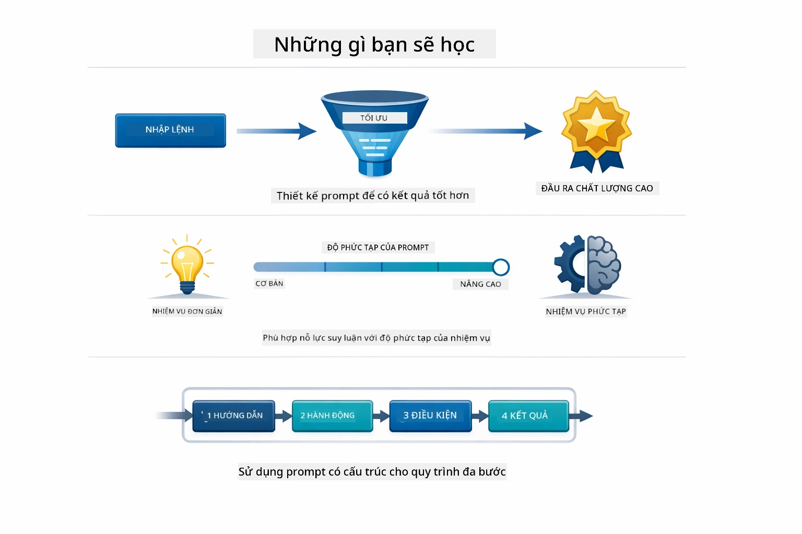
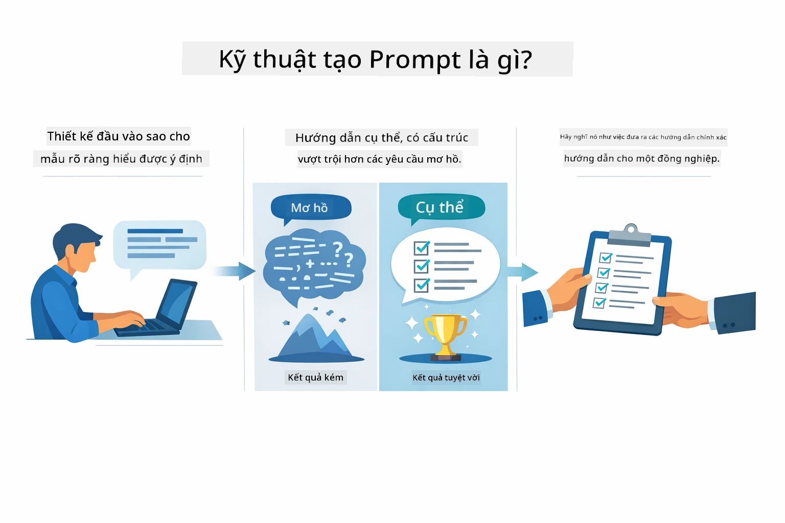
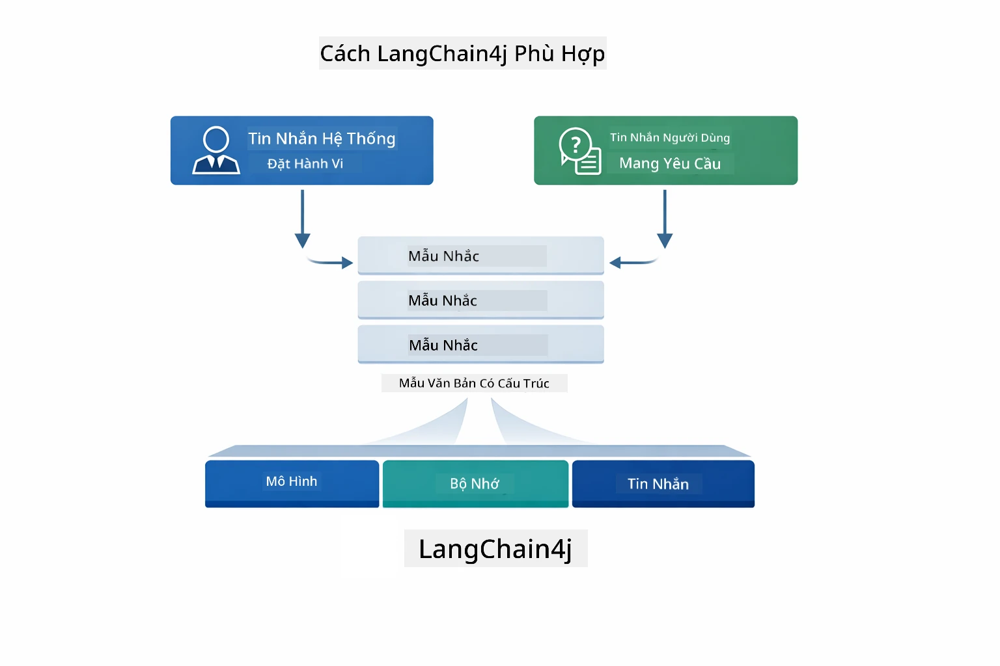
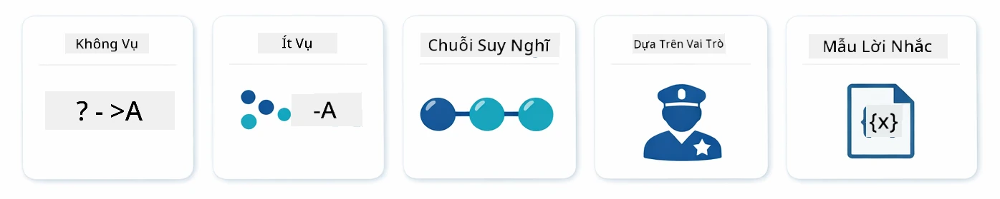
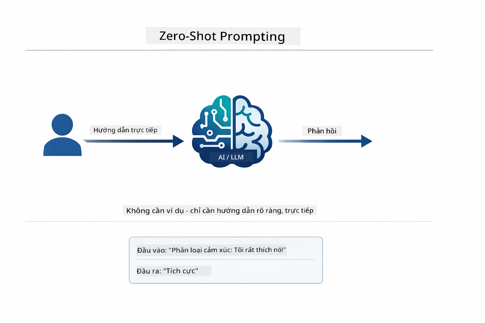
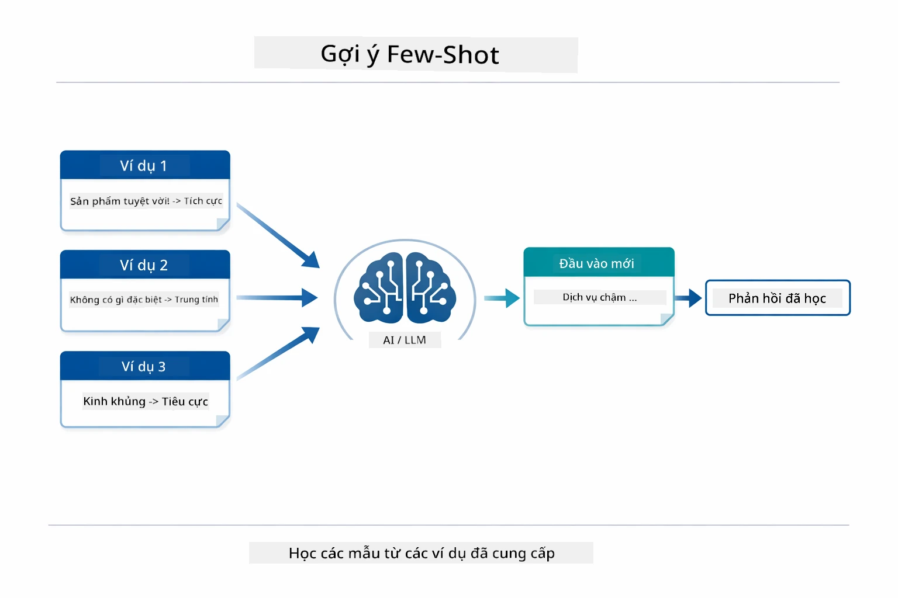
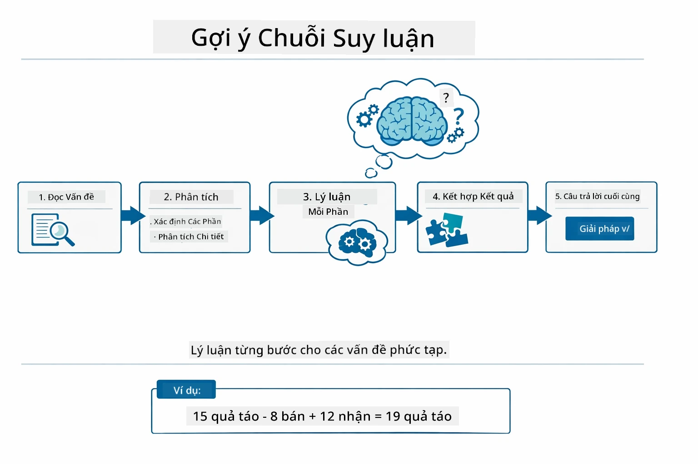
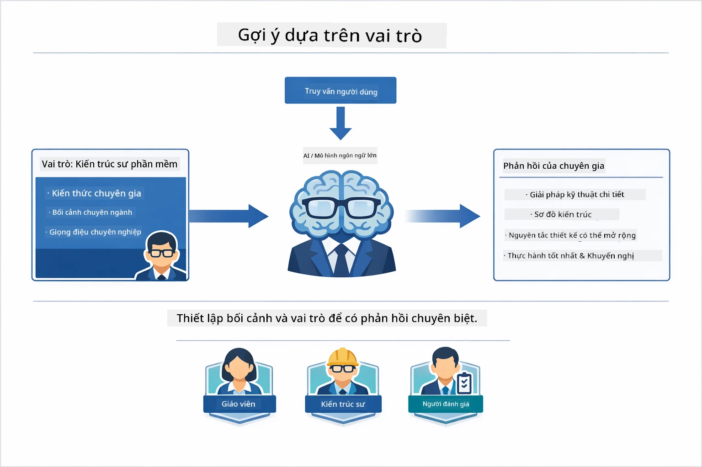
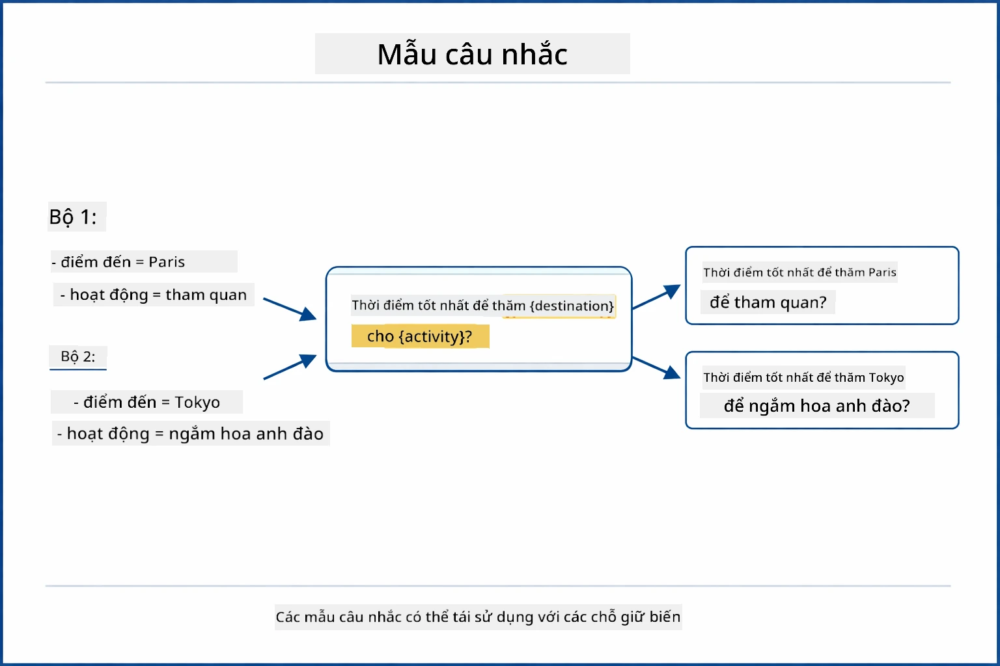
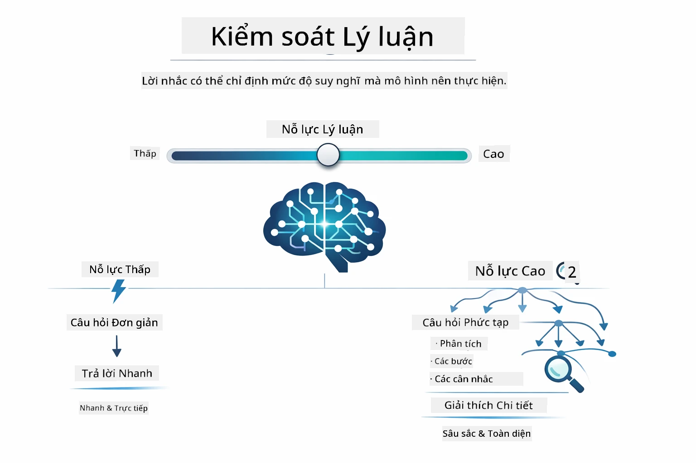

# Module 02: Kỹ Thuật Viết Lệnh với GPT-5.2

## Mục Lục

- [Bạn Sẽ Học Gì](../../../02-prompt-engineering)
- [Yêu Cầu Trước](../../../02-prompt-engineering)
- [Hiểu Về Kỹ Thuật Viết Lệnh](../../../02-prompt-engineering)
- [Các Nguyên Tắc Cơ Bản Của Kỹ Thuật Viết Lệnh](../../../02-prompt-engineering)
  - [Viết Lệnh Không Ví Dụ](../../../02-prompt-engineering)
  - [Viết Lệnh Có Vài Ví Dụ](../../../02-prompt-engineering)
  - [Chuỗi Tư Duy](../../../02-prompt-engineering)
  - [Viết Lệnh Dựa Trên Vai Trò](../../../02-prompt-engineering)
  - [Mẫu Lệnh Viết Sẵn](../../../02-prompt-engineering)
- [Các Mẫu Nâng Cao](../../../02-prompt-engineering)
- [Sử Dụng Tài Nguyên Azure Hiện Có](../../../02-prompt-engineering)
- [Ảnh Chụp Màn Hình Ứng Dụng](../../../02-prompt-engineering)
- [Khám Phá Các Mẫu](../../../02-prompt-engineering)
  - [Đam Mê Thấp và Cao](../../../02-prompt-engineering)
  - [Thực Thi Nhiệm Vụ (Phần Mở Đầu Công Cụ)](../../../02-prompt-engineering)
  - [Mã Tự Phản Chiếu](../../../02-prompt-engineering)
  - [Phân Tích Cấu Trúc](../../../02-prompt-engineering)
  - [Trò Chuyện Nhiều Lượt](../../../02-prompt-engineering)
  - [Lý Luận Từng Bước](../../../02-prompt-engineering)
  - [Đầu Ra Có Giới Hạn](../../../02-prompt-engineering)
- [Bạn Thực Sự Đang Học Gì](../../../02-prompt-engineering)
- [Bước Tiếp Theo](../../../02-prompt-engineering)

## Bạn Sẽ Học Gì



Trong module trước, bạn đã thấy cách bộ nhớ hỗ trợ AI hội thoại và sử dụng GitHub Models cho các tương tác cơ bản. Bây giờ chúng ta sẽ tập trung vào cách bạn hỏi câu hỏi — chính là các lệnh (prompts) — sử dụng GPT-5.2 của Azure OpenAI. Cách bạn cấu trúc lệnh ảnh hưởng rất lớn đến chất lượng phản hồi nhận được. Chúng ta bắt đầu với việc xem lại các kỹ thuật viết lệnh cơ bản, sau đó chuyển sang tám mẫu nâng cao tận dụng toàn bộ khả năng của GPT-5.2.

Chúng ta sử dụng GPT-5.2 vì nó giới thiệu khả năng kiểm soát suy luận — bạn có thể chỉ định cho mô hình mức độ suy nghĩ trước khi trả lời. Điều này giúp làm rõ các chiến lược viết lệnh khác nhau và giúp bạn hiểu khi nào nên dùng cách nào. Chúng ta cũng sẽ tận dụng hạn chế tần suất (rate limits) thấp hơn của Azure cho GPT-5.2 so với GitHub Models.

## Yêu Cầu Trước

- Hoàn thành Module 01 (đã triển khai tài nguyên Azure OpenAI)
- File `.env` ở thư mục gốc chứa thông tin đăng nhập Azure (được tạo khi chạy `azd up` trong Module 01)

> **Lưu ý:** Nếu bạn chưa hoàn thành Module 01, hãy làm theo hướng dẫn triển khai ở đó trước.

## Hiểu Về Kỹ Thuật Viết Lệnh



Kỹ thuật viết lệnh là thiết kế văn bản đầu vào sao cho liên tục mang đến kết quả bạn cần. Nó không chỉ là hỏi câu hỏi mà là cấu trúc các yêu cầu khiến mô hình hiểu chính xác bạn muốn gì và cách đáp ứng.

Hãy tưởng tượng bạn đang ra lệnh cho một đồng nghiệp. "Sửa lỗi" thì chung chung. "Sửa lỗi null pointer exception trong tệp UserService.java dòng 45 bằng cách thêm kiểm tra null" thì cụ thể. Các mô hình ngôn ngữ cũng vậy — tính cụ thể và cấu trúc là rất quan trọng.



LangChain4j cung cấp cơ sở hạ tầng — kết nối mô hình, bộ nhớ và loại tin nhắn — trong khi các mẫu lệnh chỉ là văn bản được cấu trúc cẩn thận bạn gửi qua cơ sở hạ tầng đó. Các khối xây dựng chính là `SystemMessage` (xác định hành vi và vai trò AI) và `UserMessage` (chứa yêu cầu của bạn).

## Các Nguyên Tắc Cơ Bản Của Kỹ Thuật Viết Lệnh



Trước khi đi sâu vào các mẫu nâng cao trong module này, hãy xem lại năm kỹ thuật viết lệnh cơ bản. Đây là những khối xây dựng mà mọi kỹ sư viết lệnh nên biết. Nếu bạn đã làm qua [module Khởi Đầu Nhanh](../00-quick-start/README.md#2-prompt-patterns), bạn đã thấy chúng hoạt động — dưới đây là khung khái niệm đằng sau.

### Viết Lệnh Không Ví Dụ

Cách đơn giản nhất: đưa cho mô hình một chỉ dẫn trực tiếp mà không có ví dụ. Mô hình hoàn toàn dựa vào đào tạo để hiểu và thực hiện nhiệm vụ. Cách này hiệu quả cho các yêu cầu trực diện, nơi hành vi mong đợi rõ ràng.



*Chỉ dẫn trực tiếp không kèm ví dụ — mô hình suy luận nhiệm vụ dựa trên chỉ dẫn duy nhất*

```java
String prompt = "Classify this sentiment: 'I absolutely loved the movie!'";
String response = model.chat(prompt);
// Phản hồi: "Tích cực"
```

**Khi nào dùng:** Phân loại đơn giản, câu hỏi trực tiếp, dịch thuật, hoặc nhiệm vụ mô hình có thể xử lý mà không cần hướng dẫn thêm.

### Viết Lệnh Có Vài Ví Dụ

Cung cấp các ví dụ minh họa mẫu bạn muốn mô hình theo dõi. Mô hình học định dạng đầu vào-đầu ra từ ví dụ và áp dụng cho đầu vào mới. Điều này cải thiện rõ rệt tính nhất quán với các nhiệm vụ mà định dạng hoặc hành vi mong muốn không rõ ràng.



*Học từ ví dụ — mô hình nhận diện mẫu và áp dụng vào đầu vào mới*

```java
String prompt = """
    Classify the sentiment as positive, negative, or neutral.
    
    Examples:
    Text: "This product exceeded my expectations!" → Positive
    Text: "It's okay, nothing special." → Neutral
    Text: "Waste of money, very disappointed." → Negative
    
    Now classify this:
    Text: "Best purchase I've made all year!"
    """;
String response = model.chat(prompt);
```

**Khi nào dùng:** Phân loại tùy chỉnh, định dạng nhất quán, nhiệm vụ chuyên ngành, hoặc khi kết quả không ổn định với zero-shot.

### Chuỗi Tư Duy

Yêu cầu mô hình trình bày suy luận từng bước. Thay vì nhảy vội đến câu trả lời, mô hình phân tích vấn đề và làm việc qua từng phần một cách rõ ràng. Cách này cải thiện độ chính xác với các bài toán toán học, logic, và suy luận đa bước.



*Suy luận từng bước — chia nhỏ vấn đề phức tạp thành các bước logic rõ ràng*

```java
String prompt = """
    Problem: A store has 15 apples. They sell 8 apples and then 
    receive a shipment of 12 more apples. How many apples do they have now?
    
    Let's solve this step-by-step:
    """;
String response = model.chat(prompt);
// Mô hình hiển thị: 15 - 8 = 7, sau đó 7 + 12 = 19 quả táo
```

**Khi nào dùng:** Bài toán toán học, câu đố logic, gỡ lỗi, hoặc bất kỳ nhiệm vụ nào mà việc trình bày suy luận cải thiện độ chính xác và tin cậy.

### Viết Lệnh Dựa Trên Vai Trò

Đặt trước vai trò hoặc cá tính cho AI trước khi hỏi. Điều này cung cấp ngữ cảnh ảnh hưởng tới giọng điệu, độ sâu, và trọng tâm của phản hồi. Một "kiến trúc sư phần mềm" sẽ cho lời khuyên khác với "lập trình viên mới vào nghề" hoặc "kiểm toán viên bảo mật".



*Định ngữ cảnh và vai trò — cùng một câu hỏi nhận phản hồi khác biệt tùy vai trò được giao*

```java
String prompt = """
    You are an experienced software architect reviewing code.
    Provide a brief code review for this function:
    
    def calculate_total(items):
        total = 0
        for item in items:
            total = total + item['price']
        return total
    """;
String response = model.chat(prompt);
```

**Khi nào dùng:** Đánh giá mã, dạy kèm, phân tích chuyên môn, hoặc khi bạn cần câu trả lời phù hợp với trình độ hoặc quan điểm chuyên môn cụ thể.

### Mẫu Lệnh Viết Sẵn

Tạo các mẫu lệnh có thể tái sử dụng với chỗ trống biến. Thay vì viết lệnh mới mỗi lần, định nghĩa một mẫu rồi điền các giá trị khác nhau. Lớp `PromptTemplate` của LangChain4j làm điều này dễ dàng với cú pháp `{{variable}}`.



*Mẫu lệnh có thể tái dùng với chỗ trống biến — một mẫu dùng cho nhiều trường hợp*

```java
PromptTemplate template = PromptTemplate.from(
    "What's the best time to visit {{destination}} for {{activity}}?"
);

Prompt prompt = template.apply(Map.of(
    "destination", "Paris",
    "activity", "sightseeing"
));

String response = model.chat(prompt.text());
```

**Khi nào dùng:** Truy vấn lặp lại với đầu vào khác nhau, xử lý hàng loạt, xây dựng quy trình AI có thể tái sử dụng, hoặc bất kỳ tình huống nào cấu trúc lệnh giống nhau nhưng dữ liệu thay đổi.

---

Năm nguyên tắc cơ bản này cung cấp công cụ vững chắc cho phần lớn các nhiệm vụ viết lệnh. Phần còn lại của module xây dựng trên chúng với **tám mẫu nâng cao** tận dụng kiểm soát suy luận, tự đánh giá, và khả năng xuất đầu ra có cấu trúc của GPT-5.2.

## Các Mẫu Nâng Cao

Sau khi nắm cơ bản, hãy chuyển sang tám mẫu nâng cao làm module này trở nên độc đáo. Không phải vấn đề nào cũng cần cùng cách tiếp cận. Có câu hỏi cần trả lời nhanh, có câu hỏi cần suy nghĩ sâu. Có câu cần thể hiện suy luận rõ ràng, có câu chỉ cần kết quả. Mỗi mẫu bên dưới tối ưu cho một tình huống khác nhau — và khả năng kiểm soát suy luận của GPT-5.2 làm sự khác biệt càng nổi bật.


*Tổng quan tám mẫu kỹ thuật viết lệnh và các trường hợp sử dụng*



*Khả năng kiểm soát suy luận của GPT-5.2 cho phép bạn chỉ định mức độ tư duy của mô hình — từ trả lời nhanh trực tiếp đến khám phá sâu*


*Tư duy mức thấp (nhanh, trực tiếp) vs tư duy mức cao (thấu đáo, khám phá)*

**Tư Duy Mức Thấp (Nhanh & Tập Trung)** - Dành cho câu hỏi đơn giản bạn muốn trả lời nhanh, trực tiếp. Mô hình tư duy tối thiểu — tối đa 2 bước. Dùng cho tính toán, tra cứu, hoặc câu hỏi trực diện.

```java
String prompt = """
    <context_gathering>
    - Search depth: very low
    - Bias strongly towards providing a correct answer as quickly as possible
    - Usually, this means an absolute maximum of 2 reasoning steps
    - If you think you need more time, state what you know and what's uncertain
    </context_gathering>
    
    Problem: What is 15% of 200?
    
    Provide your answer:
    """;

String response = chatModel.chat(prompt);
```

> 💡 **Khám phá với GitHub Copilot:** Mở [`Gpt5PromptService.java`](../../../02-prompt-engineering/src/main/java/com/example/langchain4j/prompts/service/Gpt5PromptService.java) và hỏi:
> - "Sự khác biệt giữa mẫu viết lệnh tư duy thấp và tư duy cao là gì?"
> - "Các thẻ XML trong lệnh giúp cấu trúc phản hồi AI ra sao?"
> - "Khi nào nên dùng mẫu tự phản chiếu thay vì chỉ dẫn trực tiếp?"

**Tư Duy Mức Cao (Sâu & Thấu Đáo)** - Dành cho vấn đề phức tạp bạn muốn phân tích toàn diện. Mô hình khám phá kỹ lưỡng và trình bày suy luận chi tiết. Dùng cho thiết kế hệ thống, quyết định kiến trúc, hoặc nghiên cứu phức tạp.

```java
String prompt = """
    Analyze this problem thoroughly and provide a comprehensive solution.
    Consider multiple approaches, trade-offs, and important details.
    Show your analysis and reasoning in your response.
    
    Problem: Design a caching strategy for a high-traffic REST API.
    """;

String response = chatModel.chat(prompt);
```

**Thực Thi Nhiệm Vụ (Tiến Trình Từng Bước)** - Dành cho quy trình nhiều bước. Mô hình đưa ra kế hoạch ban đầu, kể lại từng bước làm việc, rồi tóm tắt. Dùng cho di chuyển hệ thống, triển khai, hoặc quy trình đa bước.

```java
String prompt = """
    <task_execution>
    1. First, briefly restate the user's goal in a friendly way
    
    2. Create a step-by-step plan:
       - List all steps needed
       - Identify potential challenges
       - Outline success criteria
    
    3. Execute each step:
       - Narrate what you're doing
       - Show progress clearly
       - Handle any issues that arise
    
    4. Summarize:
       - What was completed
       - Any important notes
       - Next steps if applicable
    </task_execution>
    
    <tool_preambles>
    - Always begin by rephrasing the user's goal clearly
    - Outline your plan before executing
    - Narrate each step as you go
    - Finish with a distinct summary
    </tool_preambles>
    
    Task: Create a REST endpoint for user registration
    
    Begin execution:
    """;

String response = chatModel.chat(prompt);
```

Viết lệnh dạng Chuỗi Tư Duy yêu cầu mô hình trình bày quá trình suy luận, giúp nâng cao độ chính xác với các nhiệm vụ phức tạp. Việc phân chia từng bước rõ ràng giúp cả con người lẫn AI hiểu logic.

> **🤖 Thử với [GitHub Copilot](https://github.com/features/copilot) Chat:** Hỏi về mẫu này:
> - "Làm sao để tôi điều chỉnh mẫu thực thi nhiệm vụ cho các thao tác thời gian chạy dài?"
> - "Các thực tiễn hay nhất để cấu trúc phần mở đầu cho công cụ trong ứng dụng sản xuất là gì?"
> - "Làm sao để lấy và hiển thị tiến trình trung gian trong giao diện người dùng?"


*Kế hoạch → Thực thi → Tóm tắt quy trình cho các nhiệm vụ đa bước*

**Mã Tự Phản Chiếu** - Dành cho tạo mã chất lượng sản xuất. Mô hình sinh mã theo tiêu chuẩn sản xuất với xử lý lỗi thích hợp. Dùng khi xây tính năng hoặc dịch vụ mới.

```java
String prompt = """
    Generate Java code with production-quality standards: Create an email validation service
    Keep it simple and include basic error handling.
    """;

String response = chatModel.chat(prompt);
```


*Vòng lặp cải tiến lặp đi lặp lại - sinh, đánh giá, xác định lỗi, cải thiện, lặp lại*

**Phân Tích Cấu Trúc** - Dành cho đánh giá nhất quán. Mô hình xem xét mã theo khung cố định (độ chính xác, thực hành, hiệu năng, bảo mật, bảo trì). Dùng cho đánh giá mã hoặc kiểm tra chất lượng.

```java
String prompt = """
    <analysis_framework>
    You are an expert code reviewer. Analyze the code for:
    
    1. Correctness
       - Does it work as intended?
       - Are there logical errors?
    
    2. Best Practices
       - Follows language conventions?
       - Appropriate design patterns?
    
    3. Performance
       - Any inefficiencies?
       - Scalability concerns?
    
    4. Security
       - Potential vulnerabilities?
       - Input validation?
    
    5. Maintainability
       - Code clarity?
       - Documentation?
    
    <output_format>
    Provide your analysis in this structure:
    - Summary: One-sentence overall assessment
    - Strengths: 2-3 positive points
    - Issues: List any problems found with severity (High/Medium/Low)
    - Recommendations: Specific improvements
    </output_format>
    </analysis_framework>
    
    Code to analyze:
    ```
    public List getUsers() {
        return database.query("SELECT * FROM users");
    }
    ```
    Provide your structured analysis:
    """;

String response = chatModel.chat(prompt);
```

> **🤖 Thử với [GitHub Copilot](https://github.com/features/copilot) Chat:** Hỏi về phân tích cấu trúc:
> - "Làm sao tùy chỉnh khung phân tích cho các loại đánh giá mã khác nhau?"
> - "Cách tốt nhất để phân tích và thực thi đầu ra cấu trúc ra sao?"
> - "Làm sao đảm bảo mức độ nghiêm trọng đồng nhất qua các phiên đánh giá khác nhau?"


*Khung đánh giá mã nhất quán với các mức độ nghiêm trọng*

**Trò Chuyện Nhiều Lượt** - Dành cho hội thoại cần ngữ cảnh. Mô hình ghi nhớ tin nhắn trước và xây dựng trên nền đó. Dùng cho các buổi hỗ trợ tương tác hoặc hỏi-đáp phức tạp.

```java
ChatMemory memory = MessageWindowChatMemory.withMaxMessages(10);

memory.add(UserMessage.from("What is Spring Boot?"));
AiMessage aiMessage1 = chatModel.chat(memory.messages()).aiMessage();
memory.add(aiMessage1);

memory.add(UserMessage.from("Show me an example"));
AiMessage aiMessage2 = chatModel.chat(memory.messages()).aiMessage();
memory.add(aiMessage2);
```


*Cách ngữ cảnh hội thoại tích lũy qua nhiều lượt cho đến khi đạt giới hạn token*

**Lý Luận Từng Bước** - Dành cho vấn đề cần logic hiển thị. Mô hình trình bày suy luận rõ ràng từng bước. Dùng cho bài toán toán học, câu đố logic, hoặc khi bạn muốn hiểu quá trình tư duy.

```java
String prompt = """
    <instruction>Show your reasoning step-by-step</instruction>
    
    If a train travels 120 km in 2 hours, then stops for 30 minutes,
    then travels another 90 km in 1.5 hours, what is the average speed
    for the entire journey including the stop?
    """;

String response = chatModel.chat(prompt);
```


*Phân chia vấn đề thành các bước logic rõ ràng*

**Đầu Ra Có Giới Hạn** - Dành cho phản hồi cần định dạng cụ thể. Mô hình tuân thủ nghiêm ngặt quy tắc định dạng và độ dài. Dùng cho tóm tắt hoặc khi bạn cần cấu trúc đầu ra chính xác.

```java
String prompt = """
    <constraints>
    - Exactly 100 words
    - Bullet point format
    - Technical terms only
    </constraints>
    
    Summarize the key concepts of machine learning.
    """;

String response = chatModel.chat(prompt);
```


*Áp dụng quy định riêng về định dạng, độ dài, và cấu trúc*

## Sử Dụng Tài Nguyên Azure Hiện Có

**Kiểm tra triển khai:**

Đảm bảo file `.env` tồn tại trong thư mục gốc chứa thông tin đăng nhập Azure (tạo trong Module 01):
```bash
cat ../.env  # Nên hiển thị AZURE_OPENAI_ENDPOINT, API_KEY, DEPLOYMENT
```

**Khởi động ứng dụng:**

> **Lưu ý:** Nếu bạn đã khởi động tất cả ứng dụng bằng `./start-all.sh` trong Module 01, module này đã chạy trên cổng 8083. Bạn có thể bỏ qua lệnh khởi động dưới đây và truy cập trực tiếp http://localhost:8083.

**Tùy chọn 1: Dùng Spring Boot Dashboard (Khuyến nghị cho người dùng VS Code)**

Dev container bao gồm tiện ích mở rộng Spring Boot Dashboard, cung cấp giao diện trực quan để quản lý tất cả ứng dụng Spring Boot. Bạn có thể tìm thấy nó trên thanh Activity Bar bên trái VS Code (tìm biểu tượng Spring Boot).
Từ Bảng điều khiển Spring Boot, bạn có thể:
- Xem tất cả các ứng dụng Spring Boot có sẵn trong không gian làm việc
- Bắt đầu/dừng các ứng dụng chỉ với một lần nhấp
- Xem nhật ký ứng dụng theo thời gian thực
- Giám sát trạng thái ứng dụng

Chỉ cần nhấp vào nút phát bên cạnh "prompt-engineering" để khởi động module này, hoặc khởi động tất cả các module cùng lúc.


**Tùy chọn 2: Sử dụng shell scripts**

Khởi động tất cả các ứng dụng web (module 01-04):

**Bash:**
```bash
cd ..  # Từ thư mục gốc
./start-all.sh
```

**PowerShell:**
```powershell
cd ..  # Từ thư mục gốc
.\start-all.ps1
```

Hoặc chỉ khởi động module này:

**Bash:**
```bash
cd 02-prompt-engineering
./start.sh
```

**PowerShell:**
```powershell
cd 02-prompt-engineering
.\start.ps1
```

Cả hai script đều tự động tải biến môi trường từ file `.env` ở thư mục gốc và sẽ xây dựng các tập tin JAR nếu chúng chưa tồn tại.

> **Lưu ý:** Nếu bạn muốn xây dựng tất cả các module thủ công trước khi khởi động:
>
> **Bash:**
> ```bash
> cd ..  # Go to root directory
> mvn clean package -DskipTests
> ```
>
> **PowerShell:**
> ```powershell
> cd ..  # Go to root directory
> mvn clean package -DskipTests
> ```

Mở http://localhost:8083 trong trình duyệt của bạn.

**Để dừng:**

**Bash:**
```bash
./stop.sh  # Chỉ module này
# Hoặc
cd .. && ./stop-all.sh  # Tất cả các module
```

**PowerShell:**
```powershell
.\stop.ps1  # Chỉ mô-đun này
# Hoặc
cd ..; .\stop-all.ps1  # Tất cả các mô-đun
```

## Ảnh chụp màn hình ứng dụng


*Trang chính của bảng điều khiển hiển thị tất cả 8 mẫu kỹ thuật prompt với đặc điểm và trường hợp sử dụng của chúng*

## Khám phá các mẫu

Giao diện web cho phép bạn thử nghiệm với các chiến lược prompt khác nhau. Mỗi mẫu giải quyết các vấn đề khác nhau - hãy thử chúng để xem khi nào mỗi cách tiếp cận thể hiện tốt.

### Tham vọng thấp vs tham vọng cao

Hỏi một câu hỏi đơn giản như "15% của 200 là bao nhiêu?" với Tham vọng thấp. Bạn sẽ nhận được câu trả lời nhanh và trực tiếp. Bây giờ, hỏi một câu phức tạp như "Thiết kế chiến lược caching cho một API lưu lượng cao" với Tham vọng cao. Hãy xem mô hình chậm lại và cung cấp lập luận chi tiết. Cùng một mô hình, cùng cấu trúc câu hỏi - nhưng prompt cho nó biết phải suy nghĩ nhiều đến mức nào.


*Tính toán nhanh với lý luận tối thiểu*


*Chiến lược caching toàn diện (2.8MB)*

### Thực thi tác vụ (Tool Preambles)

Các quy trình đa bước hưởng lợi từ việc lên kế hoạch trước và tường thuật tiến trình. Mô hình phác thảo những gì nó sẽ làm, kể lại từng bước, rồi tổng hợp kết quả.


*Tạo REST endpoint với tường thuật từng bước (3.9MB)*

### Mã tự phản chiếu

Hãy thử "Tạo dịch vụ kiểm tra email". Thay vì chỉ sinh code và dừng lại, mô hình sinh, đánh giá theo tiêu chí chất lượng, xác định điểm yếu, và cải thiện. Bạn sẽ thấy nó lặp lại cho đến khi mã đạt chuẩn để sản xuất.


*Dịch vụ kiểm tra email hoàn chỉnh (5.2MB)*

### Phân tích có cấu trúc

Xem xét mã yêu cầu khung đánh giá nhất quán. Mô hình phân tích mã theo các hạng mục cố định (độ đúng, thực hành, hiệu năng, bảo mật) với các mức độ nghiêm trọng.


*Đánh giá mã theo khung làm việc*

### Chat nhiều lượt

Hỏi "Spring Boot là gì?" rồi ngay lập tức tiếp tục với "Cho tôi xem một ví dụ". Mô hình nhớ câu hỏi đầu tiên của bạn và cung cấp ví dụ Spring Boot cụ thể. Nếu không có trí nhớ, câu hỏi thứ hai sẽ quá mơ hồ.


*Bảo toàn ngữ cảnh qua các câu hỏi*

### Lập luận từng bước

Chọn một bài toán toán học và thử với cả Lập luận từng bước và Tham vọng thấp. Tham vọng thấp chỉ cho bạn kết quả - nhanh nhưng không rõ ràng. Lập luận từng bước cho bạn thấy từng phép tính và quyết định.


*Bài toán với các bước rõ ràng*

### Đầu ra có giới hạn

Khi bạn cần định dạng hoặc số từ cụ thể, mẫu này ép tuân thủ nghiêm ngặt. Hãy thử tạo một bản tóm tắt chính xác 100 từ theo dạng bullet point.


*Tóm tắt học máy với kiểm soát định dạng*

## Những gì bạn thực sự đang học

**Nỗ lực lập luận thay đổi mọi thứ**

GPT-5.2 cho phép bạn kiểm soát nỗ lực tính toán thông qua prompt của bạn. Nỗ lực thấp có nghĩa là phản hồi nhanh với khám phá tối thiểu. Nỗ lực cao có nghĩa mô hình dành thời gian suy nghĩ kỹ. Bạn đang học cách điều chỉnh nỗ lực theo độ phức tạp của tác vụ - không lãng phí thời gian cho câu hỏi đơn giản, nhưng cũng không vội vàng với quyết định phức tạp.

**Cấu trúc hướng dẫn hành vi**

Bạn có thấy các thẻ XML trong prompt không? Chúng không phải trang trí. Mô hình theo hướng dẫn có cấu trúc tin cậy hơn so với văn bản tự do. Khi bạn cần quy trình đa bước hoặc logic phức tạp, cấu trúc giúp mô hình theo dõi vị trí và bước tiếp theo.


*Cấu trúc prompt tốt với các mục rõ ràng và tổ chức kiểu XML*

**Chất lượng qua tự đánh giá**

Các mẫu tự phản chiếu hoạt động bằng cách làm rõ tiêu chí chất lượng. Thay vì hy vọng mô hình "làm đúng", bạn nói rõ "đúng" nghĩa là gì: logic chính xác, xử lý lỗi, hiệu năng, bảo mật. Mô hình sau đó tự đánh giá đầu ra và cải thiện. Điều này biến việc tạo mã thành một quá trình thay vì xổ số.

**Ngữ cảnh là hữu hạn**

Các cuộc trò chuyện nhiều lượt hoạt động bằng cách bao gồm lịch sử tin nhắn với mỗi yêu cầu. Nhưng có giới hạn - mỗi mô hình có số token tối đa. Khi các cuộc trò chuyện lớn lên, bạn cần chiến lược để giữ ngữ cảnh liên quan mà không vượt quá giới hạn đó. Module này cho bạn thấy cách trí nhớ hoạt động; sau này bạn sẽ học khi nào tóm tắt, khi nào quên, và khi nào truy xuất.

## Bước tiếp theo

**Module tiếp theo:** [03-rag - RAG (Tạo ra được tăng cường bằng cách truy xuất)](../03-rag/README.md)

---

**Điều hướng:** [← Trước: Module 01 - Giới thiệu](../01-introduction/README.md) | [Quay lại Trang chính](../README.md) | [Tiếp: Module 03 - RAG →](../03-rag/README.md)

---

<!-- CO-OP TRANSLATOR DISCLAIMER START -->
**Tuyên bố từ chối trách nhiệm**:  
Tài liệu này đã được dịch bằng dịch vụ dịch thuật AI [Co-op Translator](https://github.com/Azure/co-op-translator). Mặc dù chúng tôi nỗ lực đảm bảo độ chính xác, xin lưu ý rằng bản dịch tự động có thể chứa lỗi hoặc sự không chính xác. Tài liệu gốc bằng ngôn ngữ mẹ đẻ nên được coi là nguồn đáng tin cậy chính thức. Đối với các thông tin quan trọng, nên sử dụng dịch vụ dịch thuật chuyên nghiệp do con người thực hiện. Chúng tôi không chịu trách nhiệm đối với bất kỳ sự hiểu lầm hay giải thích sai nào phát sinh từ việc sử dụng bản dịch này.
<!-- CO-OP TRANSLATOR DISCLAIMER END -->