# Module 03: RAG (Tạo văn bản được tăng cường bằng truy xuất thông tin)

## Mục lục

- [Hướng dẫn qua video](../../../03-rag)
- [Những gì bạn sẽ học](../../../03-rag)
- [Yêu cầu trước](../../../03-rag)
- [Hiểu về RAG](../../../03-rag)
  - [Phương pháp RAG nào được hướng dẫn này sử dụng?](../../../03-rag)
- [Cách hoạt động](../../../03-rag)
  - [Xử lý tài liệu](../../../03-rag)
  - [Tạo embeddings](../../../03-rag)
  - [Tìm kiếm ngữ nghĩa](../../../03-rag)
  - [Tạo câu trả lời](../../../03-rag)
- [Chạy ứng dụng](../../../03-rag)
- [Sử dụng ứng dụng](../../../03-rag)
  - [Tải lên tài liệu](../../../03-rag)
  - [Đặt câu hỏi](../../../03-rag)
  - [Kiểm tra tham khảo nguồn](../../../03-rag)
  - [Thử nghiệm với câu hỏi](../../../03-rag)
- [Khái niệm chính](../../../03-rag)
  - [Chiến lược phân đoạn](../../../03-rag)
  - [Điểm tương đồng](../../../03-rag)
  - [Lưu trữ trong bộ nhớ](../../../03-rag)
  - [Quản lý cửa sổ ngữ cảnh](../../../03-rag)
- [Khi nào RAG quan trọng](../../../03-rag)
- [Bước tiếp theo](../../../03-rag)

## Hướng dẫn qua video

Xem buổi trực tiếp này giải thích cách bắt đầu với module này: [RAG with LangChain4j - Live Session](https://www.youtube.com/watch?v=_olq75ZH_eY)

## Những gì bạn sẽ học

Trong các module trước, bạn đã học cách trò chuyện với AI và cấu trúc prompt hiệu quả. Nhưng có một giới hạn cơ bản: các mô hình ngôn ngữ chỉ biết những gì chúng học trong quá trình huấn luyện. Chúng không thể trả lời các câu hỏi về chính sách công ty bạn, tài liệu dự án, hay thông tin nào mà chúng không được huấn luyện.

RAG (Tạo văn bản được tăng cường bằng truy xuất thông tin) giải quyết vấn đề này. Thay vì cố gắng dạy mô hình thông tin của bạn (điều này tốn kém và không thực tế), bạn cung cấp cho nó khả năng tìm kiếm qua tài liệu của bạn. Khi ai đó hỏi câu hỏi, hệ thống sẽ tìm thông tin liên quan và đưa vào prompt. Mô hình sau đó trả lời dựa trên ngữ cảnh được truy xuất đó.

Hãy nghĩ RAG như việc cho mô hình một thư viện tham khảo. Khi bạn hỏi câu hỏi, hệ thống:

1. **Truy vấn người dùng** - Bạn đặt câu hỏi  
2. **Embedding** - Chuyển câu hỏi thành vector  
3. **Tìm kiếm vector** - Tìm các đoạn tài liệu tương tự  
4. **Lắp ráp ngữ cảnh** - Thêm các đoạn liên quan vào prompt  
5. **Phản hồi** - Mô hình ngôn ngữ lớn tạo câu trả lời dựa trên ngữ cảnh  

Điều này giúp câu trả lời của mô hình dựa trên dữ liệu thực của bạn thay vì dựa vào kiến thức huấn luyện hoặc tự bịa ra câu trả lời.

## Yêu cầu trước

- Hoàn thành [Module 00 - Bắt đầu nhanh](../00-quick-start/README.md) (cho ví dụ Easy RAG tham chiếu bên trên)  
- Hoàn thành [Module 01 - Giới thiệu](../01-introduction/README.md) (đã triển khai tài nguyên Azure OpenAI, bao gồm mô hình embedding `text-embedding-3-small`)  
- File `.env` trong thư mục gốc với thông tin xác thực Azure (được tạo bởi `azd up` trong Module 01)  

> **Lưu ý:** Nếu bạn chưa hoàn thành Module 01, hãy làm theo hướng dẫn triển khai ở đó trước. Lệnh `azd up` triển khai cả mô hình chat GPT và mô hình embedding được sử dụng trong module này.

## Hiểu về RAG

Hình dưới đây minh họa khái niệm cốt lõi: thay vì chỉ dựa vào dữ liệu huấn luyện của mô hình, RAG cung cấp thư viện tham khảo các tài liệu của bạn để tham khảo trước khi tạo câu trả lời.

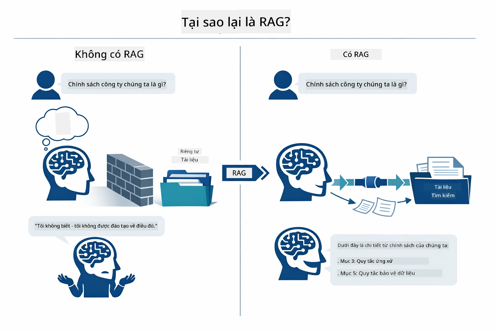

*Hình này cho thấy sự khác biệt giữa mô hình LLM chuẩn (dự đoán dựa trên dữ liệu huấn luyện) và LLM được tăng cường RAG (tham khảo tài liệu của bạn trước).*

Dưới đây là cách các phần kết nối từ đầu đến cuối. Câu hỏi của người dùng luân phiên qua bốn giai đoạn — embedding, tìm kiếm vector, lắp ráp ngữ cảnh và tạo câu trả lời — mỗi bước xây dựng dựa trên bước trước:


*Hình này cho thấy chuỗi RAG từ đầu đến cuối — câu hỏi người dùng đi qua embedding, tìm kiếm vector, lắp ráp ngữ cảnh, rồi tạo câu trả lời.*

Phần còn lại của module sẽ đi qua từng giai đoạn chi tiết, với mã nguồn bạn có thể chạy và chỉnh sửa.

### Phương pháp RAG nào được hướng dẫn này sử dụng?

LangChain4j cung cấp ba cách để triển khai RAG, mỗi cách có mức độ trừu tượng khác nhau. Hình dưới đây so sánh chúng cạnh nhau:

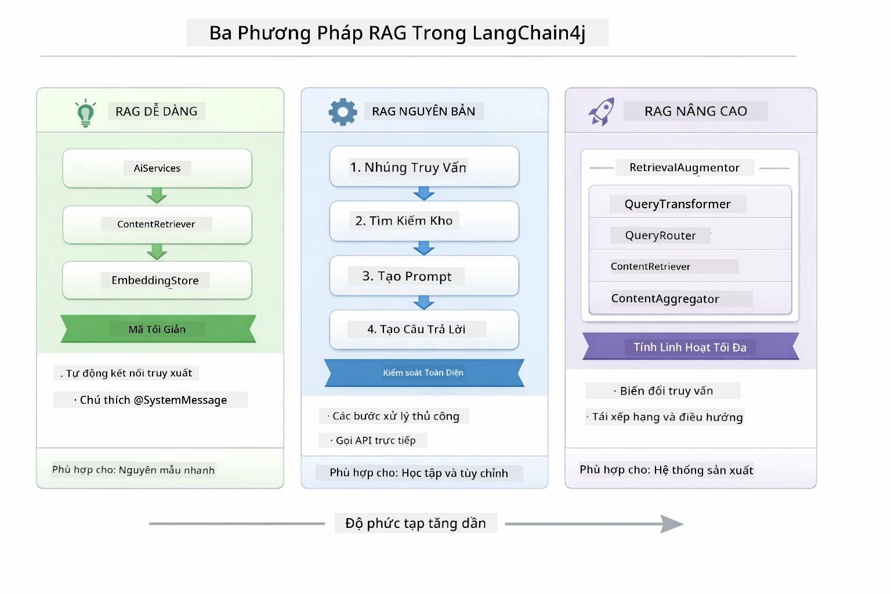

*Hình này so sánh ba phương pháp RAG trong LangChain4j — Easy, Native và Advanced — trình bày thành phần chính và khi nào nên dùng từng phương pháp.*

| Phương pháp | Tính năng | Đánh đổi |
|---|---|---|
| **Easy RAG** | Tự động kết nối mọi thứ qua `AiServices` và `ContentRetriever`. Bạn chú thích một interface, gắn retriever, và LangChain4j xử lý embedding, tìm kiếm và lắp ráp prompt phía sau. | Mã ít, nhưng bạn không thấy chi tiết từng bước. |
| **Native RAG** | Bạn gọi mô hình embedding, tìm kiếm trong kho, xây dựng prompt, và tạo câu trả lời — từng bước rõ ràng. | Mã nhiều hơn, nhưng mỗi giai đoạn rõ ràng và có thể chỉnh sửa. |
| **Advanced RAG** | Dùng framework `RetrievalAugmentor` với các bộ chuyển đổi truy vấn, bộ định tuyến, bộ sắp xếp lại và bộ chèn nội dung có thể cắm thêm, cho pipeline cấp sản xuất. | Linh hoạt nhất, nhưng phức tạp hơn nhiều. |

**Hướng dẫn này dùng phương pháp Native.** Mỗi bước trong pipeline RAG — embedding truy vấn, tìm kiếm vector store, lắp ráp ngữ cảnh và tạo câu trả lời — được viết rõ ràng trong [`RagService.java`](../../../03-rag/src/main/java/com/example/langchain4j/rag/service/RagService.java). Đây là chủ ý: với mục đích học tập, quan trọng hơn là bạn thấy và hiểu từng giai đoạn thay vì mã được tối giản. Khi bạn đã thành thạo cách các phần kết nối, bạn có thể chuyển sang Easy RAG để làm prototype nhanh hoặc Advanced RAG cho hệ thống sản xuất.

> **💡 Đã từng thấy Easy RAG rồi chứ?** Module [Bắt đầu nhanh](../00-quick-start/README.md) có ví dụ Hỏi đáp tài liệu ([`SimpleReaderDemo.java`](../../../00-quick-start/src/main/java/com/example/langchain4j/quickstart/SimpleReaderDemo.java)) dùng phương pháp Easy RAG — LangChain4j tự động xử lý embedding, tìm kiếm và lắp ráp prompt. Module này đi sâu hơn bằng cách mở pipeline ra để bạn thấy và điều khiển từng bước.

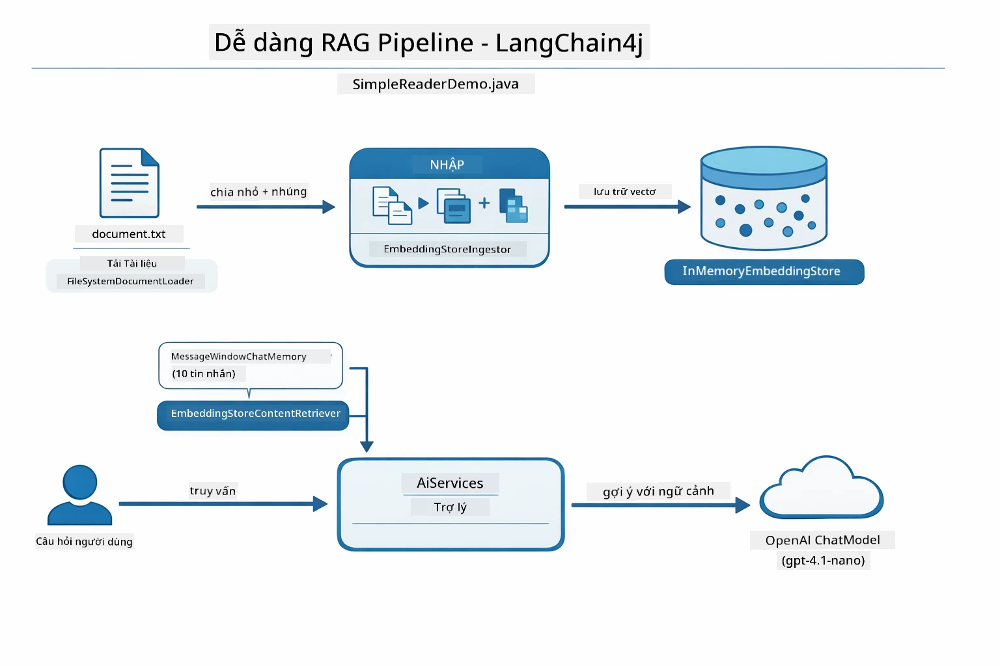

*Hình này cho thấy pipeline Easy RAG từ `SimpleReaderDemo.java`. So sánh với phương pháp Native trong module này: Easy RAG ẩn embedding, truy xuất, và lắp ráp prompt phía sau `AiServices` và `ContentRetriever` — bạn tải tài liệu, gắn retriever, và nhận câu trả lời. Phương pháp Native trong module này mở pipeline ra để bạn gọi từng giai đoạn (embed, tìm kiếm, lắp ráp ngữ cảnh, tạo) tự mình, cho phép bạn toàn quyền kiểm soát và quan sát.*

## Cách hoạt động

Pipeline RAG trong module này chia thành bốn giai đoạn chạy tuần tự mỗi khi người dùng hỏi câu hỏi. Đầu tiên, tài liệu được tải lên sẽ được **phân tích và phân đoạn** thành các phần nhỏ dễ quản lý. Các phần này sau đó được chuyển thành **vector embedding** và lưu trữ để đối chiếu toán học. Khi có truy vấn, hệ thống thực hiện **tìm kiếm ngữ nghĩa** để tìm những phần phù hợp nhất, rồi đưa chúng làm ngữ cảnh cho LLM **tạo câu trả lời**. Phần dưới đây đi qua từng bước cùng mã và sơ đồ minh họa. Bắt đầu với bước đầu tiên.

### Xử lý tài liệu

[DocumentService.java](../../../03-rag/src/main/java/com/example/langchain4j/rag/service/DocumentService.java)

Khi bạn tải tài liệu lên, hệ thống sẽ phân tích nó (PDF hoặc văn bản thuần), gắn metadata như tên file, rồi chia nhỏ thành các đoạn — những phần nhỏ vừa đủ nằm gọn trong cửa sổ ngữ cảnh của mô hình. Các đoạn này chồng lấn nhẹ với nhau để bạn không mất ngữ cảnh tại ranh giới.

```java
// Phân tích tệp đã tải lên và bọc nó trong một tài liệu LangChain4j
Document document = Document.from(content, metadata);

// Chia thành các đoạn 300 token với chồng chéo 30 token
DocumentSplitter splitter = DocumentSplitters
    .recursive(300, 30);

List<TextSegment> segments = splitter.split(document);
```
  
Hình dưới đây thể hiện trực quan cách hoạt động này. Chú ý mỗi đoạn chia sẻ một số token với đoạn kế bên — 30 token chồng lấn đảm bảo không mất ngữ cảnh quan trọng tại ranh giới:

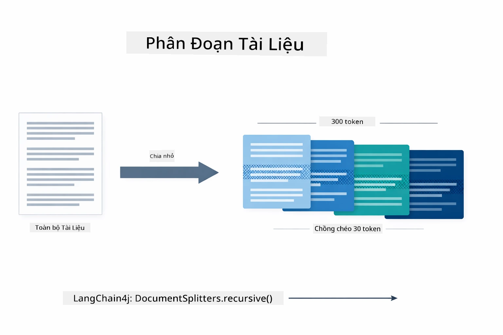

*Hình này cho thấy một tài liệu được chia thành các đoạn 300 token với chồng lấn 30 token, giữ nguyên ngữ cảnh tại ranh giới đoạn.*

> **🤖 Thử với [GitHub Copilot](https://github.com/features/copilot) Chat:** Mở [`DocumentService.java`](../../../03-rag/src/main/java/com/example/langchain4j/rag/service/DocumentService.java) và hỏi:  
> - "LangChain4j phân chia tài liệu thành các đoạn như thế nào và tại sao việc chồng lấn quan trọng?"  
> - "Kích thước đoạn tối ưu cho các loại tài liệu khác nhau là bao nhiêu và tại sao?"  
> - "Làm thế nào để xử lý tài liệu đa ngôn ngữ hoặc có định dạng đặc biệt?"

### Tạo embeddings

[LangChainRagConfig.java](../../../03-rag/src/main/java/com/example/langchain4j/rag/config/LangChainRagConfig.java)

Mỗi đoạn được chuyển thành đại diện số gọi là embedding — về cơ bản là bộ chuyển đổi ý nghĩa thành con số. Mô hình embedding không "thông minh" như mô hình chat; nó không thể hiểu lệnh, suy luận, hay trả lời câu hỏi. Nó chỉ có thể ánh xạ văn bản vào không gian toán học nơi các ý nghĩa tương tự thì gần nhau — "car" gần với "automobile," "refund policy" gần "return my money." Hãy xem mô hình chat như một người bạn có thể nói chuyện; còn mô hình embedding như hệ thống lưu trữ cực kỳ hiệu quả.

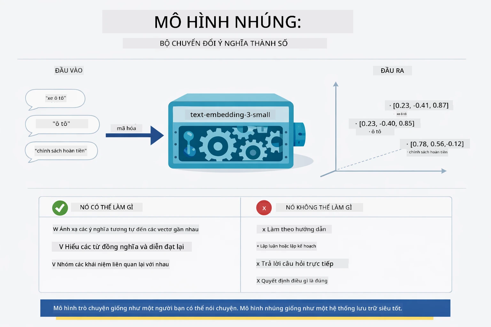

*Hình này cho thấy mô hình embedding chuyển văn bản thành vector số, đặt các ý nghĩa tương tự — như "car" và "automobile" — cạnh nhau trong không gian vector.*

```java
@Bean
public EmbeddingModel embeddingModel() {
    return OpenAiOfficialEmbeddingModel.builder()
        .baseUrl(azureOpenAiEndpoint)
        .apiKey(azureOpenAiKey)
        .modelName(azureEmbeddingDeploymentName)
        .build();
}

EmbeddingStore<TextSegment> embeddingStore = 
    new InMemoryEmbeddingStore<>();
```
  
Sơ đồ lớp dưới đây thể hiện hai luồng riêng biệt trong pipeline RAG và các lớp LangChain4j thực thi chúng. Luồng **ingestion** (chạy một lần khi tải lên) phân chia tài liệu, tạo embedding các đoạn, và lưu trữ qua `.addAll()`. Luồng **query** (chạy mỗi khi người dùng hỏi) tạo embedding truy vấn, tìm trong kho qua `.search()`, và đưa ngữ cảnh phù hợp vào mô hình chat. Hai luồng kết nối qua giao diện chia sẻ `EmbeddingStore<TextSegment>`:

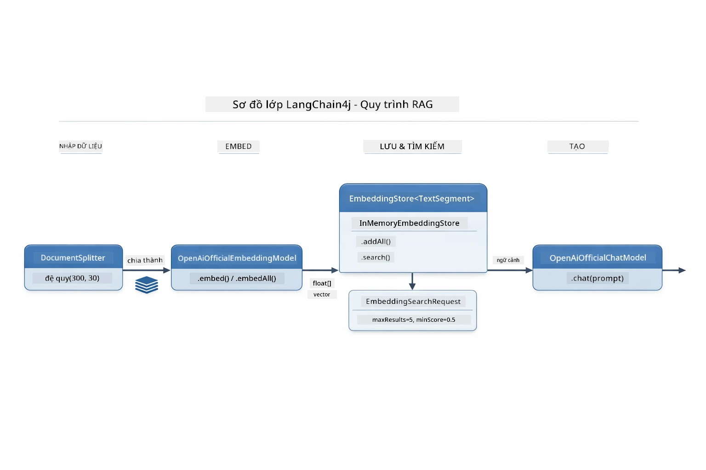

*Hình này biểu diễn hai luồng trong pipeline RAG — ingestion và query — và sự kết nối qua EmbeddingStore.*

Sau khi embeddings được lưu trữ, nội dung tương tự tự nhiên sẽ nhóm lại với nhau trong không gian vector. Hình dưới minh họa cách các tài liệu liên quan được gom lại làm điểm gần nhau, cho phép tìm kiếm ngữ nghĩa khả thi:


*Hình này minh họa các tài liệu liên quan tụ nhóm lại trong không gian vector 3D, với các chủ đề như Tài liệu kỹ thuật, Quy tắc kinh doanh và Câu hỏi thường gặp tạo thành các nhóm riêng biệt.*

Khi người dùng tìm kiếm, hệ thống theo bốn bước: embed tài liệu một lần, embed truy vấn mỗi lần tìm kiếm, so sánh vector truy vấn với tất cả vector lưu trữ bằng cosine similarity, rồi trả về top-K đoạn có điểm cao nhất. Hình dưới đi qua từng bước và các lớp LangChain4j tham gia:

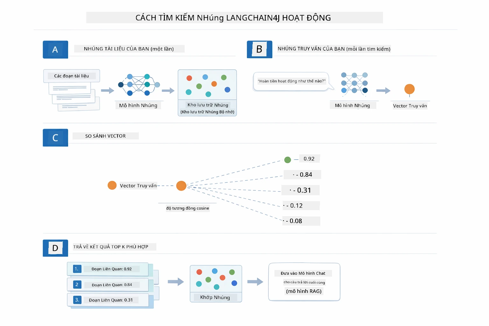

*Hình này cho thấy quy trình tìm kiếm embedding bốn bước: embed tài liệu, embed truy vấn, so sánh vector với cosine similarity, và trả về kết quả top-K.*

### Tìm kiếm ngữ nghĩa

[RagService.java](../../../03-rag/src/main/java/com/example/langchain4j/rag/service/RagService.java)

Khi bạn hỏi câu hỏi, câu hỏi cũng được chuyển thành embedding. Hệ thống so sánh embedding câu hỏi với các embedding của từng đoạn tài liệu. Nó tìm các đoạn có ý nghĩa tương tự nhất - không chỉ khớp từ khóa, mà giống về ngữ nghĩa thực sự.

```java
Embedding queryEmbedding = embeddingModel.embed(question).content();

EmbeddingSearchRequest searchRequest = EmbeddingSearchRequest.builder()
    .queryEmbedding(queryEmbedding)
    .maxResults(5)
    .minScore(0.5)
    .build();

EmbeddingSearchResult<TextSegment> searchResult = embeddingStore.search(searchRequest);
List<EmbeddingMatch<TextSegment>> matches = searchResult.matches();

for (EmbeddingMatch<TextSegment> match : matches) {
    String relevantText = match.embedded().text();
    double score = match.score();
}
```
  
Hình dưới đối chiếu tìm kiếm ngữ nghĩa với tìm kiếm từ khóa truyền thống. Tìm kiếm từ khóa "vehicle" bỏ sót đoạn nói về "cars and trucks," nhưng tìm kiếm ngữ nghĩa hiểu là cùng nghĩa và trả về kết quả xếp hạng cao:

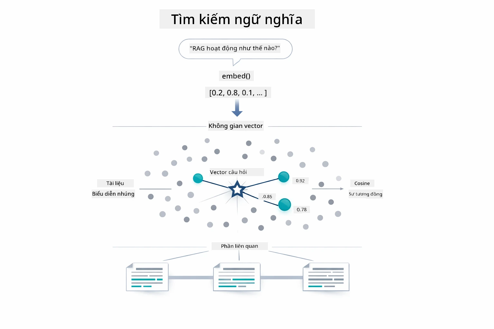

*Hình này so sánh tìm kiếm dựa trên từ khóa và tìm kiếm ngữ nghĩa, cho thấy tìm kiếm ngữ nghĩa truy xuất nội dung liên quan về mặt khái niệm ngay cả khi từ khóa khác nhau.*

Ở cấp độ thuật toán, độ tương đồng đo bằng cosine similarity — về cơ bản hỏi "hai mũi tên này có cùng hướng không?" Hai đoạn có thể dùng từ hoàn toàn khác nhau, nhưng nếu ý nghĩa giống nhau thì vector sẽ chỉ cùng hướng và điểm số gần 1.0:

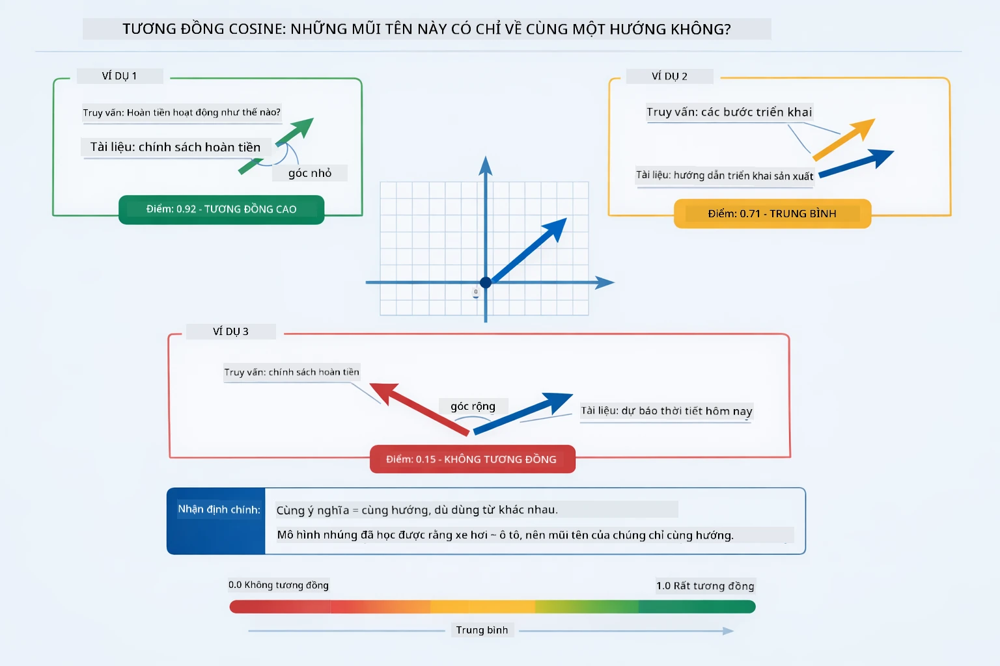

*Hình này minh họa cosine similarity như góc giữa các vector embedding — các vector càng thẳng hàng thì điểm số càng gần 1.0, biểu thị độ tương đồng ngữ nghĩa cao hơn.*
> **🤖 Thử với [GitHub Copilot](https://github.com/features/copilot) Chat:** Mở [`RagService.java`](../../../03-rag/src/main/java/com/example/langchain4j/rag/service/RagService.java) và hỏi:
> - "Cách tìm kiếm tương tự với embeddings hoạt động như thế nào và điểm số được xác định ra sao?"
> - "Ngưỡng tương tự nào tôi nên sử dụng và nó ảnh hưởng đến kết quả thế nào?"
> - "Làm sao tôi xử lý các trường hợp không tìm thấy tài liệu liên quan?"

### Tạo Câu Trả Lời

[RagService.java](../../../03-rag/src/main/java/com/example/langchain4j/rag/service/RagService.java)

Các đoạn liên quan nhất được tập hợp thành một prompt có cấu trúc bao gồm hướng dẫn rõ ràng, ngữ cảnh lấy được và câu hỏi của người dùng. Mô hình đọc các đoạn cụ thể đó và trả lời dựa trên thông tin đó — nó chỉ có thể dùng những gì phía trước nó, điều này ngăn chặn việc tạo thông tin sai lệch.

```java
String context = matches.stream()
    .map(match -> match.embedded().text())
    .collect(Collectors.joining("\n\n"));

String prompt = String.format("""
    Answer the question based on the following context.
    If the answer cannot be found in the context, say so.

    Context:
    %s

    Question: %s

    Answer:""", context, request.question());

String answer = chatModel.chat(prompt);
```

Sơ đồ dưới đây cho thấy cách tập hợp này hoạt động — các đoạn có điểm số cao nhất từ bước tìm kiếm được chèn vào mẫu prompt, và `OpenAiOfficialChatModel` tạo câu trả lời dựa trên nền tảng đó:

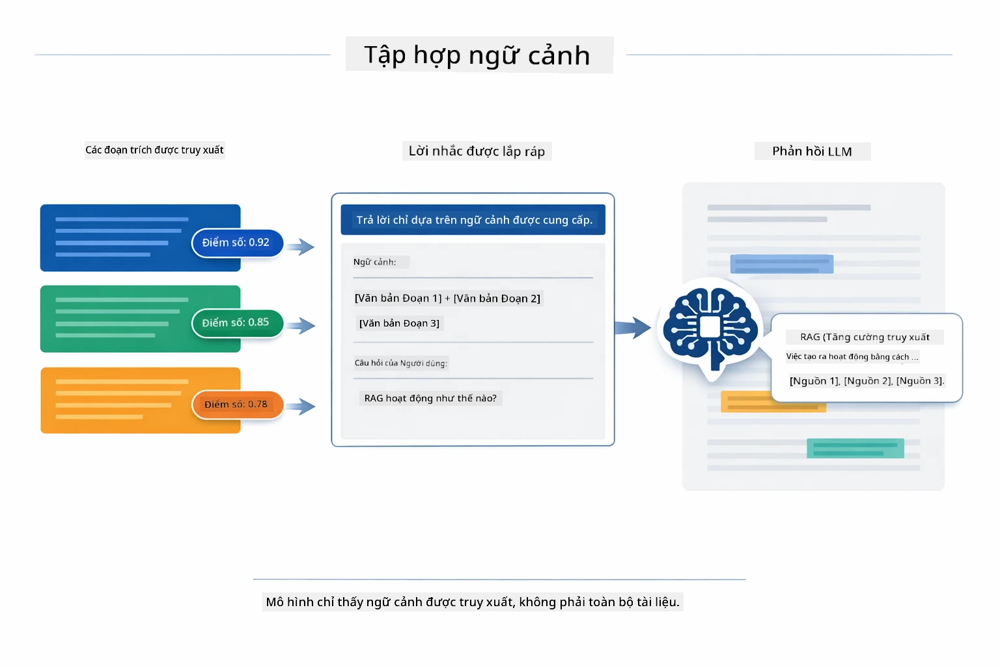

*Sơ đồ này cho thấy cách các đoạn có điểm số cao nhất được tập hợp vào một prompt có cấu trúc, cho phép mô hình tạo câu trả lời dựa trên dữ liệu của bạn.*

## Chạy Ứng Dụng

**Xác minh triển khai:**

Đảm bảo file `.env` tồn tại trong thư mục gốc với thông tin đăng nhập Azure (đã tạo trong Module 01):

**Bash:**
```bash
cat ../.env  # Nên hiển thị AZURE_OPENAI_ENDPOINT, API_KEY, DEPLOYMENT
```

**PowerShell:**
```powershell
Get-Content ..\.env  # Nên hiển thị AZURE_OPENAI_ENDPOINT, API_KEY, DEPLOYMENT
```

**Khởi động ứng dụng:**

> **Lưu ý:** Nếu bạn đã khởi động tất cả các ứng dụng dùng `./start-all.sh` từ Module 01, module này đã chạy trên cổng 8081. Bạn có thể bỏ qua các lệnh khởi động bên dưới và truy cập trực tiếp http://localhost:8081.

**Lựa chọn 1: Dùng Spring Boot Dashboard (Khuyến nghị cho người dùng VS Code)**

Container phát triển bao gồm extension Spring Boot Dashboard, cung cấp giao diện trực quan để quản lý các ứng dụng Spring Boot. Bạn có thể tìm thấy nó trên Thanh Hoạt Động bên trái trong VS Code (tìm biểu tượng Spring Boot).

Từ Spring Boot Dashboard, bạn có thể:
- Xem tất cả các ứng dụng Spring Boot có trong workspace
- Khởi động/dừng ứng dụng chỉ với một cú click
- Xem nhật ký ứng dụng theo thời gian thực
- Giám sát trạng thái ứng dụng

Chỉ cần nhấn nút play bên cạnh "rag" để khởi động module này hoặc khởi động tất cả module cùng lúc.


*Ảnh chụp màn hình này cho thấy Spring Boot Dashboard trong VS Code, nơi bạn có thể bắt đầu, dừng, và giám sát ứng dụng một cách trực quan.*

**Lựa chọn 2: Dùng script shell**

Khởi động tất cả ứng dụng web (module 01-04):

**Bash:**
```bash
cd ..  # Từ thư mục gốc
./start-all.sh
```

**PowerShell:**
```powershell
cd ..  # Từ thư mục gốc
.\start-all.ps1
```

Hoặc chỉ khởi động module này:

**Bash:**
```bash
cd 03-rag
./start.sh
```

**PowerShell:**
```powershell
cd 03-rag
.\start.ps1
```

Cả hai script tự động tải biến môi trường từ file `.env` ở thư mục gốc và sẽ build JAR nếu chúng chưa có.

> **Lưu ý:** Nếu bạn muốn tự build tất cả module trước khi khởi động:
>
> **Bash:**
> ```bash
> cd ..  # Go to root directory
> mvn clean package -DskipTests
> ```
>
> **PowerShell:**
> ```powershell
> cd ..  # Go to root directory
> mvn clean package -DskipTests
> ```

Mở http://localhost:8081 trên trình duyệt của bạn.

**Để dừng:**

**Bash:**
```bash
./stop.sh  # Chỉ mô-đun này
# Hoặc
cd .. && ./stop-all.sh  # Tất cả các mô-đun
```

**PowerShell:**
```powershell
.\stop.ps1  # Chỉ mô-đun này
# Hoặc
cd ..; .\stop-all.ps1  # Tất cả các mô-đun
```

## Sử Dụng Ứng Dụng

Ứng dụng cung cấp giao diện web để tải tài liệu lên và đặt câu hỏi.

<a href="images/rag-homepage.png"></a>

*Ảnh chụp màn hình này cho thấy giao diện ứng dụng RAG nơi bạn tải tài liệu lên và đặt câu hỏi.*

### Tải Tài Liệu Lên

Bắt đầu bằng cách tải một tài liệu lên — các file TXT là lựa chọn tốt nhất để thử nghiệm. Một file `sample-document.txt` được cung cấp trong thư mục này chứa thông tin về các tính năng LangChain4j, triển khai RAG, và các thực hành tốt nhất — rất phù hợp để thử nghiệm hệ thống.

Hệ thống xử lý tài liệu của bạn, chia thành các đoạn nhỏ, và tạo embeddings cho mỗi đoạn. Quá trình này diễn ra tự động khi bạn tải lên.

### Đặt Câu Hỏi

Bây giờ hãy đặt những câu hỏi cụ thể về nội dung tài liệu. Thử hỏi điều gì đó mang tính thực tế, rõ ràng trong tài liệu. Hệ thống tìm kiếm các đoạn liên quan, đưa chúng vào prompt, và tạo câu trả lời.

### Kiểm Tra Tham Chiếu Nguồn

Chú ý mỗi câu trả lời đều bao gồm các tham chiếu nguồn kèm điểm số tương tự. Các điểm số này (từ 0 đến 1) cho biết mức độ liên quan của từng đoạn với câu hỏi của bạn. Điểm cao hơn thể hiện sự phù hợp tốt hơn. Điều này giúp bạn xác minh câu trả lời dựa trên tài liệu nguồn.

<a href="images/rag-query-results.png"></a>

*Ảnh chụp màn hình này cho thấy kết quả truy vấn với câu trả lời sinh ra, tham chiếu nguồn và điểm liên quan cho mỗi đoạn được truy xuất.*

### Thử Nghiệm Với Các Câu Hỏi

Thử các loại câu hỏi khác nhau:
- Thông tin cụ thể: "Chủ đề chính là gì?"
- So sánh: "Sự khác biệt giữa X và Y là gì?"
- Tóm tắt: "Tóm tắt các điểm chính về Z"

Quan sát cách điểm liên quan thay đổi dựa trên mức độ phù hợp của câu hỏi với nội dung tài liệu.

## Các Khái Niệm Chính

### Chiến Lược Chia Đoạn

Tài liệu được chia thành các đoạn 300 token với chồng chéo 30 token. Cách chia này đảm bảo mỗi đoạn có đủ ngữ cảnh để có ý nghĩa trong khi vẫn đủ nhỏ để có thể đưa nhiều đoạn vào prompt.

### Điểm Tương Tự

Mỗi đoạn lấy ra được kèm theo một điểm tương tự từ 0 đến 1, chỉ mức độ khớp với câu hỏi người dùng. Sơ đồ dưới đây minh họa các khoảng điểm và cách hệ thống dùng chúng để lọc kết quả:

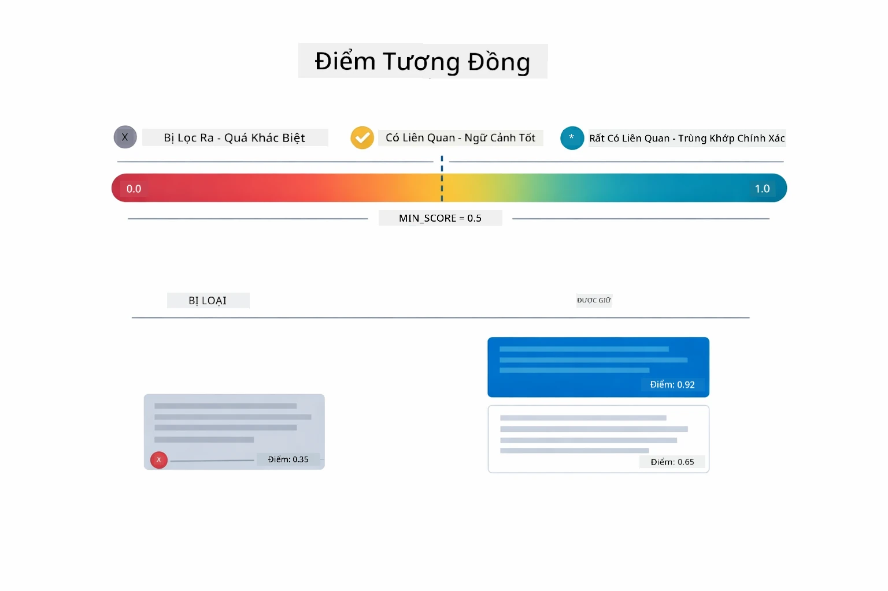

*Sơ đồ này cho thấy các khoảng điểm từ 0 đến 1, với ngưỡng tối thiểu 0.5 để loại những đoạn không liên quan.*

Điểm dao động từ 0 đến 1:
- 0.7-1.0: Rất liên quan, trùng khớp chính xác
- 0.5-0.7: Liên quan, ngữ cảnh tốt
- Dưới 0.5: Bị lọc, không tương đồng

Hệ thống chỉ lấy các đoạn vượt ngưỡng tối thiểu để đảm bảo chất lượng.

Embeddings tốt khi các ý nghĩa được gom nhóm rõ ràng, nhưng vẫn có điểm mù. Sơ đồ dưới đây mô tả các lỗi phổ biến — đoạn quá lớn tạo vector lộn xộn, đoạn quá nhỏ thiếu ngữ cảnh, thuật ngữ mơ hồ trỏ tới nhiều nhóm, và truy vấn chính xác (ID, mã phần) không hoạt động với embeddings:

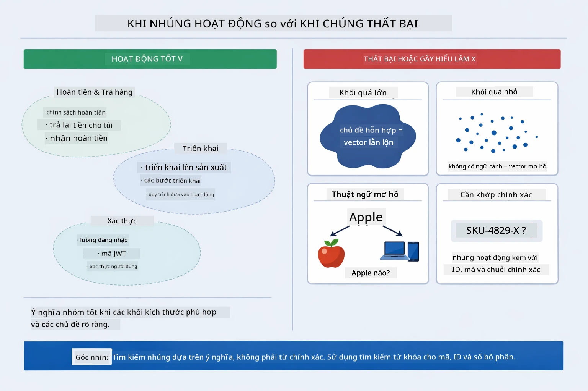

*Sơ đồ này cho thấy các lỗi thường gặp với embeddings: đoạn quá lớn, đoạn quá nhỏ, thuật ngữ mơ hồ trỏ nhiều nhóm, và truy vấn chính xác như ID.*

### Lưu Trữ Trong Bộ Nhớ

Module này dùng lưu trữ trong bộ nhớ cho đơn giản. Khi bạn khởi động lại ứng dụng, các tài liệu đã tải lên sẽ mất. Hệ thống sản xuất dùng cơ sở dữ liệu vector lưu trữ lâu dài như Qdrant hoặc Azure AI Search.

### Quản Lý Cửa Sổ Ngữ Cảnh

Mỗi mô hình có giới hạn kích thước cửa sổ ngữ cảnh tối đa. Bạn không thể đưa mọi đoạn từ tài liệu lớn vào. Hệ thống chỉ lấy N đoạn liên quan nhất (mặc định 5) để duy trì trong giới hạn và vẫn cung cấp đủ ngữ cảnh cho câu trả lời chính xác.

## Khi Nào RAG Quan Trọng

RAG không phải lúc nào cũng là lựa chọn đúng. Hướng dẫn quyết định dưới đây giúp bạn xác định khi nào RAG mang lại giá trị so với các cách tiếp cận đơn giản hơn — như đưa nội dung trực tiếp vào prompt hoặc dựa vào kiến thức tích hợp sẵn của mô hình — là đủ:

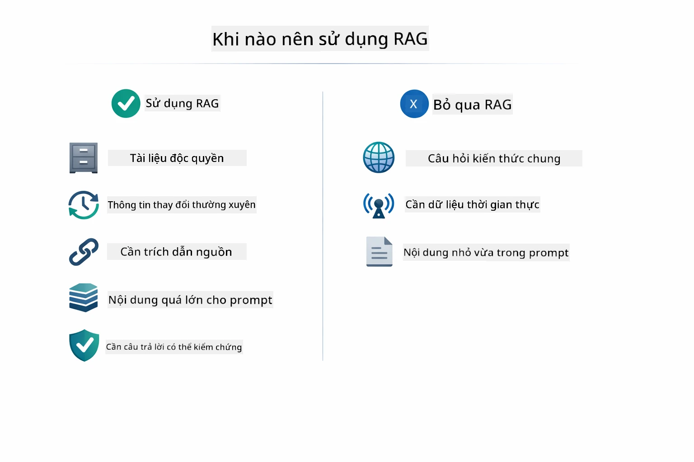

*Sơ đồ này cho thấy hướng dẫn quyết định khi nào RAG có giá trị và khi nào các cách đơn giản hơn là đủ.*

**Dùng RAG khi:**
- Trả lời câu hỏi về tài liệu sở hữu riêng
- Thông tin thay đổi thường xuyên (chính sách, giá cả, thông số)
- Yêu cầu độ chính xác và cần dẫn nguồn
- Nội dung quá lớn để chứa trong một prompt duy nhất
- Cần câu trả lời có thể kiểm chứng, dựa trên dữ liệu

**Không dùng RAG khi:**
- Câu hỏi yêu cầu kiến thức chung mà mô hình đã có sẵn
- Cần dữ liệu theo thời gian thực (RAG chỉ với tài liệu đã tải lên)
- Nội dung nhỏ đủ để đưa trực tiếp vào prompt

## Bước Tiếp Theo

**Module tiếp theo:** [04-tools - AI Agents với Công Cụ](../04-tools/README.md)

---

**Điều hướng:** [← Trước: Module 02 - Kỹ Thuật Prompt](../02-prompt-engineering/README.md) | [Quay lại Chính](../README.md) | [Tiếp: Module 04 - Công Cụ →](../04-tools/README.md)

---

<!-- CO-OP TRANSLATOR DISCLAIMER START -->
**Tuyên bố từ chối trách nhiệm**:
Tài liệu này đã được dịch bằng dịch vụ dịch thuật AI [Co-op Translator](https://github.com/Azure/co-op-translator). Mặc dù chúng tôi cố gắng đảm bảo độ chính xác, xin lưu ý rằng các bản dịch tự động có thể chứa lỗi hoặc thiếu chính xác. Tài liệu gốc bằng ngôn ngữ bản địa nên được coi là nguồn thông tin chính xác và đáng tin cậy. Đối với các thông tin quan trọng, nên sử dụng dịch vụ dịch thuật chuyên nghiệp của con người. Chúng tôi không chịu trách nhiệm đối với bất kỳ sự hiểu lầm hay giải thích sai nào phát sinh từ việc sử dụng bản dịch này.
<!-- CO-OP TRANSLATOR DISCLAIMER END -->