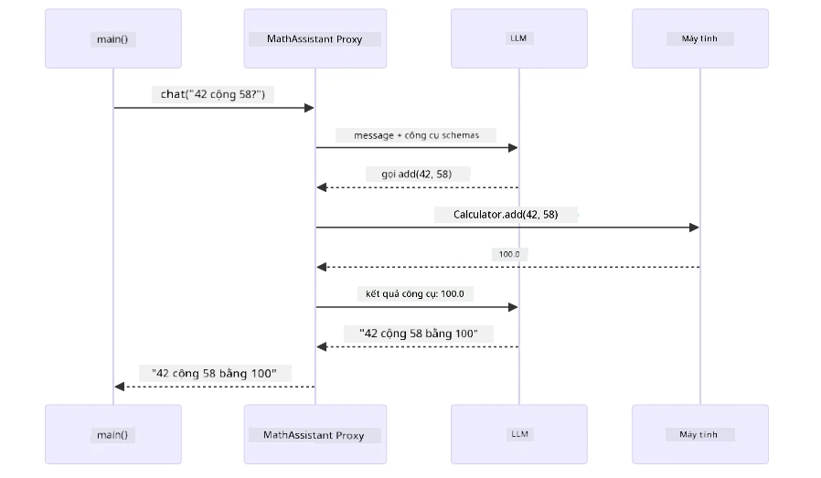
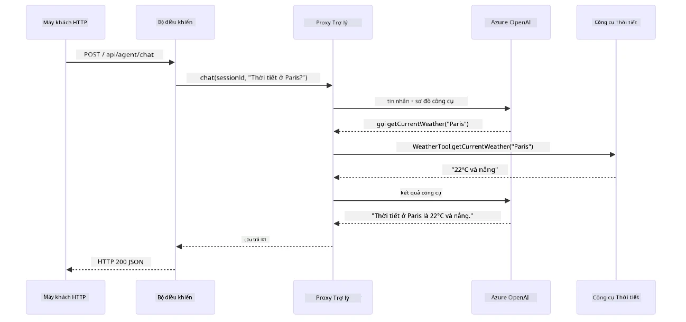

# Module 04: Đại lý AI với Công cụ

## Mục lục

- [Video hướng dẫn](../../../04-tools)
- [Những gì bạn sẽ học](../../../04-tools)
- [Yêu cầu trước](../../../04-tools)
- [Hiểu về Đại lý AI với Công cụ](../../../04-tools)
- [Cách gọi Công cụ hoạt động](../../../04-tools)
  - [Định nghĩa Công cụ](../../../04-tools)
  - [Quyết định](../../../04-tools)
  - [Thực thi](../../../04-tools)
  - [Tạo phản hồi](../../../04-tools)
  - [Kiến trúc: Tự động kết nối Spring Boot](../../../04-tools)
- [Chuỗi Công cụ](../../../04-tools)
- [Chạy Ứng dụng](../../../04-tools)
- [Sử dụng Ứng dụng](../../../04-tools)
  - [Thử sử dụng Công cụ đơn giản](../../../04-tools)
  - [Kiểm tra Chuỗi Công cụ](../../../04-tools)
  - [Xem luồng cuộc trò chuyện](../../../04-tools)
  - [Thử nghiệm với các yêu cầu khác nhau](../../../04-tools)
- [Khái niệm chính](../../../04-tools)
  - [Mẫu ReAct (Lý luận và Hành động)](../../../04-tools)
  - [Mô tả Công cụ quan trọng](../../../04-tools)
  - [Quản lý Phiên làm việc](../../../04-tools)
  - [Xử lý lỗi](../../../04-tools)
- [Các công cụ có sẵn](../../../04-tools)
- [Khi nào nên dùng đại lý dựa trên công cụ](../../../04-tools)
- [Công cụ so với RAG](../../../04-tools)
- [Bước tiếp theo](../../../04-tools)

## Video hướng dẫn

Xem buổi trực tiếp này giải thích cách bắt đầu với module này:

<a href="https://www.youtube.com/watch?v=O_J30kZc0rw"></a>

## Những gì bạn sẽ học

Cho đến nay, bạn đã học cách trò chuyện với AI, cấu trúc prompt hiệu quả, và căn cứ câu trả lời trong tài liệu của bạn. Nhưng vẫn còn một hạn chế cơ bản: các mô hình ngôn ngữ chỉ có thể tạo ra văn bản. Chúng không thể kiểm tra thời tiết, thực hiện phép tính, truy vấn cơ sở dữ liệu hay tương tác với các hệ thống bên ngoài.

Công cụ sẽ thay đổi điều này. Bằng cách cung cấp cho mô hình quyền truy cập vào các hàm mà nó có thể gọi, bạn biến nó từ một trình tạo văn bản thành một đại lý có thể thực hiện hành động. Mô hình quyết định khi nào cần công cụ, công cụ nào để dùng và các tham số cần truyền. Mã của bạn thực thi hàm và trả về kết quả. Mô hình đưa kết quả đó vào phản hồi của nó.

## Yêu cầu trước

- Hoàn thành [Module 01 - Giới thiệu](../01-introduction/README.md) (tài nguyên Azure OpenAI đã được triển khai)
- Các module trước được khuyên hoàn thành (module này tham chiếu [khái niệm RAG từ Module 03](../03-rag/README.md) trong so sánh Công cụ vs RAG)
- File `.env` ở thư mục gốc với thông tin đăng nhập Azure (được tạo bởi `azd up` trong Module 01)

> **Lưu ý:** Nếu bạn chưa hoàn thành Module 01, hãy làm theo hướng dẫn triển khai ở đó trước.

## Hiểu về Đại lý AI với Công cụ

> **📝 Lưu ý:** Thuật ngữ "đại lý" trong module này chỉ các trợ lý AI được tăng cường với khả năng gọi công cụ. Điều này khác với các mẫu **Agentic AI** (đại lý tự động có lập kế hoạch, bộ nhớ và suy luận đa bước) mà chúng ta sẽ đề cập trong [Module 05: MCP](../05-mcp/README.md).

Không có công cụ, mô hình ngôn ngữ chỉ có thể tạo ra văn bản từ dữ liệu đào tạo. Hỏi nó về thời tiết hiện tại, nó phải đoán. Cho nó công cụ, nó có thể gọi API thời tiết, thực hiện phép tính, hoặc truy vấn cơ sở dữ liệu — rồi khéo léo lồng ghép kết quả thực tế vào câu trả lời.


*Không có công cụ, mô hình chỉ đoán — có công cụ, nó có thể gọi API, thực hiện phép tính và trả dữ liệu thời gian thực.*

Một đại lý AI với công cụ theo mẫu **Reasoning and Acting (ReAct)**. Mô hình không chỉ phản hồi — nó suy nghĩ về những gì cần, hành động bằng cách gọi công cụ, quan sát kết quả, rồi quyết định có hành động tiếp hay đưa ra câu trả lời cuối cùng:

1. **Lý luận** — Đại lý phân tích câu hỏi người dùng và xác định thông tin cần
2. **Hành động** — Đại lý chọn công cụ phù hợp, tạo tham số đúng và gọi nó
3. **Quan sát** — Đại lý nhận kết quả công cụ và đánh giá
4. **Lặp lại hoặc Phản hồi** — Nếu cần thêm dữ liệu, đại lý quay lại bước đầu; nếu không, nó tạo câu trả lời tự nhiên


*Chu kỳ ReAct — đại lý suy nghĩ cần làm gì, hành động qua gọi công cụ, quan sát kết quả, và lặp lại cho tới khi có câu trả lời cuối.*

Việc này xảy ra tự động. Bạn định nghĩa công cụ và mô tả của chúng. Mô hình xử lý quyết định khi nào và làm sao dùng chúng.

## Cách gọi Công cụ hoạt động

### Định nghĩa Công cụ

[WeatherTool.java](../../../04-tools/src/main/java/com/example/langchain4j/agents/tools/WeatherTool.java) | [TemperatureTool.java](../../../04-tools/src/main/java/com/example/langchain4j/agents/tools/TemperatureTool.java)

Bạn định nghĩa các hàm với mô tả rõ ràng và các tham số. Mô hình nhìn thấy mô tả này trong prompt hệ thống và hiểu mỗi công cụ làm gì.

```java
@Component
public class WeatherTool {
    
    @Tool("Get the current weather for a location")
    public String getCurrentWeather(@P("Location name") String location) {
        // Logic tra cứu thời tiết của bạn
        return "Weather in " + location + ": 22°C, cloudy";
    }
}

@AiService
public interface Assistant {
    String chat(@MemoryId String sessionId, @UserMessage String message);
}

// Trợ lý được tự động kết nối bởi Spring Boot với:
// - Bean ChatModel
// - Tất cả các phương thức @Tool từ các lớp @Component
// - ChatMemoryProvider để quản lý phiên làm việc
```

Sơ đồ dưới đây phân tích từng chú thích và cho thấy mỗi phần giúp AI hiểu khi nào gọi công cụ và truyền tham số ra sao:


*Cấu tạo định nghĩa công cụ — @Tool báo cho AI khi dùng, @P mô tả tham số, và @AiService tự động liên kết lúc khởi động.*

> **🤖 Thử với [GitHub Copilot](https://github.com/features/copilot) Chat:** Mở [`WeatherTool.java`](../../../04-tools/src/main/java/com/example/langchain4j/agents/tools/WeatherTool.java) và hỏi:
> - "Làm sao tích hợp API thời tiết thực như OpenWeatherMap thay vì dữ liệu giả?"
> - "Mô tả công cụ tốt giúp AI dùng đúng là như thế nào?"
> - "Làm sao xử lý lỗi API và giới hạn tần suất trong cài đặt công cụ?"

### Quyết định

Khi người dùng hỏi "Thời tiết ở Seattle thế nào?", mô hình không chọn ngẫu nhiên. Nó so sánh ý định với từng mô tả công cụ có, chấm điểm mức liên quan, và chọn công cụ phù hợp nhất. Sau đó tạo ra lời gọi hàm có cấu trúc với tham số đúng — trong trường hợp này, đặt `location` thành `"Seattle"`.

Nếu không có công cụ phù hợp, mô hình trả lời từ kiến thức của nó. Nếu nhiều công cụ phù hợp, nó chọn cái cụ thể nhất.


*Mô hình đánh giá công cụ có sẵn theo ý định người dùng và chọn phù hợp nhất — nên việc viết mô tả công cụ rõ ràng, cụ thể rất quan trọng.*

### Thực thi

[AgentService.java](../../../04-tools/src/main/java/com/example/langchain4j/agents/service/AgentService.java)

Spring Boot tự động liên kết interface khai báo `@AiService` với tất cả công cụ đã đăng ký, và LangChain4j tự động thực thi các cuộc gọi công cụ. Ở hậu trường, một cuộc gọi công cụ hoàn chỉnh trải qua sáu giai đoạn — từ câu hỏi ngôn ngữ tự nhiên của người dùng tới câu trả lời ngôn ngữ tự nhiên:


*Luồng end-to-end — người dùng hỏi, mô hình chọn công cụ, LangChain4j thực thi, và mô hình kết hợp kết quả vào câu trả lời.*

Nếu bạn đã chạy [ToolIntegrationDemo](../../../00-quick-start/src/main/java/com/example/langchain4j/quickstart/ToolIntegrationDemo.java) trong Module 00, bạn đã thấy mẫu này — các công cụ `Calculator` được gọi tương tự. Sơ đồ tuần tự dưới đây mô tả chính xác chuyện gì xảy ra phía sau màn hình trong demo đó:



*Vòng gọi công cụ trong demo Quick Start — `AiServices` gửi tin nhắn và lược đồ công cụ đến LLM, LLM trả lời với hàm gọi như `add(42, 58)`, LangChain4j chạy phương thức `Calculator` cục bộ, và trả kết quả lại để tạo câu trả lời cuối.*

> **🤖 Thử với [GitHub Copilot](https://github.com/features/copilot) Chat:** Mở [`AgentService.java`](../../../04-tools/src/main/java/com/example/langchain4j/agents/service/AgentService.java) và hỏi:
> - "Mẫu ReAct hoạt động như thế nào và vì sao hiệu quả với đại lý AI?"
> - "Đại lý quyết định công cụ dùng và thứ tự ra sao?"
> - "Nếu thực thi công cụ thất bại thì sao - tôi nên xử lý lỗi thế nào bền vững?"

### Tạo phản hồi

Mô hình nhận dữ liệu thời tiết và định dạng thành câu trả lời ngôn ngữ tự nhiên cho người dùng.

### Kiến trúc: Tự động kết nối Spring Boot

Module này dùng tích hợp Spring Boot của LangChain4j với interface khai báo `@AiService`. Khi khởi động, Spring Boot phát hiện tất cả `@Component` có phương thức `@Tool`, bean `ChatModel`, và `ChatMemoryProvider` — rồi liên kết tất cả thành interface `Assistant` duy nhất không cần mã lặp lại.


*Interface @AiService liên kết ChatModel, các component công cụ và bộ nhớ — Spring Boot tự xử lý liên kết.*

Đây là vòng đời yêu cầu đầy đủ dưới dạng sơ đồ tuần tự — từ yêu cầu HTTP qua controller, service, và proxy được tự động liên kết, đến thực thi công cụ và trả lại kết quả:



*Toàn bộ vòng đời yêu cầu Spring Boot — yêu cầu HTTP đi qua controller và service tới proxy Assistant tự động, điều phối LLM và gọi công cụ tự động.*

Các lợi ích chính của cách này:

- **Tự động liên kết Spring Boot** — ChatModel và công cụ tự động được chèn
- **Mẫu @MemoryId** — Quản lý bộ nhớ theo phiên tự động
- **Một thể hiện duy nhất** — Assistant tạo một lần, dùng lại để nâng cao hiệu suất
- **Thực thi an toàn kiểu** — Gọi trực tiếp phương thức Java với chuyển đổi kiểu
- **Điều phối đa bước** — Xử lý chuỗi công cụ tự động
- **Không mã lặp** — Không cần gọi `AiServices.builder()` hoặc map bộ nhớ thủ công

Các phương án khác (gọi thủ công `AiServices.builder()`) tốn nhiều mã hơn và không có lợi ích tích hợp Spring Boot.

## Chuỗi Công cụ

**Chuỗi Công cụ** — Sức mạnh thực sự của đại lý dựa trên công cụ thể hiện khi một câu hỏi cần nhiều công cụ. Hỏi "Thời tiết ở Seattle theo Fahrenheit là bao nhiêu?" thì đại lý tự động chuỗi hai công cụ: đầu tiên gọi `getCurrentWeather` lấy nhiệt độ Celsius, rồi truyền giá trị đó vào `celsiusToFahrenheit` để chuyển đổi — tất cả trong một lượt trò chuyện.


*Chuỗi công cụ hoạt động — đại lý gọi getCurrentWeather trước, rồi chuyển kết quả Celsius sang celsiusToFahrenheit, và trả câu trả lời kết hợp.*

**Xử lý lỗi nhẹ nhàng** — Hỏi về thời tiết ở thành phố không có trong dữ liệu giả. Công cụ trả lỗi, AI giải thích không giúp được thay vì bị crash. Công cụ thất bại an toàn. Sơ đồ dưới so sánh hai cách tiếp cận — với xử lý lỗi đúng, đại lý bắt ngoại lệ và trả lời hữu ích, không thì ứng dụng sẽ sập:


*Khi công cụ lỗi, đại lý bắt lỗi và phản hồi giải thích hữu ích thay vì sập.*

Việc này xảy ra trong một lượt trò chuyện duy nhất. Đại lý tự điều phối nhiều cuộc gọi công cụ.

## Chạy Ứng dụng

**Kiểm tra triển khai:**

Đảm bảo file `.env` tồn tại ở thư mục gốc với thông tin Azure (được tạo trong Module 01). Chạy lệnh này từ thư mục module (`04-tools/`):

**Bash:**
```bash
cat ../.env  # Nên hiển thị AZURE_OPENAI_ENDPOINT, API_KEY, DEPLOYMENT
```

**PowerShell:**
```powershell
Get-Content ..\.env  # Nên hiển thị AZURE_OPENAI_ENDPOINT, API_KEY, DEPLOYMENT
```

**Khởi động ứng dụng:**

> **Lưu ý:** Nếu bạn đã khởi động tất cả ứng dụng bằng `./start-all.sh` từ thư mục gốc (như mô tả trong Module 01), module này đã chạy ở cổng 8084. Bạn có thể bỏ qua lệnh khởi động bên dưới và truy cập trực tiếp http://localhost:8084.

**Tùy chọn 1: Dùng Spring Boot Dashboard (Khuyên dùng cho người dùng VS Code)**

Container phát triển bao gồm extension Spring Boot Dashboard, cung cấp giao diện trực quan để quản lý tất cả ứng dụng Spring Boot. Bạn có thể tìm thấy nó trên Thanh hoạt động bên trái VS Code (tìm biểu tượng Spring Boot).

Từ Spring Boot Dashboard, bạn có thể:
- Xem tất cả ứng dụng Spring Boot có trong workspace
- Khởi động/dừng ứng dụng chỉ với một cú click
- Xem nhật ký ứng dụng theo thời gian thực
- Giám sát trạng thái ứng dụng
Chỉ cần nhấp vào nút phát bên cạnh "tools" để bắt đầu module này, hoặc khởi động tất cả các module cùng một lúc.

Đây là giao diện Spring Boot Dashboard trong VS Code:


*Bảng điều khiển Spring Boot trong VS Code — khởi động, dừng và giám sát tất cả các module từ một nơi duy nhất*

**Tùy chọn 2: Sử dụng shell scripts**

Khởi động tất cả các ứng dụng web (các module 01-04):

**Bash:**
```bash
cd ..  # Từ thư mục gốc
./start-all.sh
```

**PowerShell:**
```powershell
cd ..  # Từ thư mục gốc
.\start-all.ps1
```

Hoặc chỉ khởi động module này:

**Bash:**
```bash
cd 04-tools
./start.sh
```

**PowerShell:**
```powershell
cd 04-tools
.\start.ps1
```

Cả hai script đều tự động tải biến môi trường từ file `.env` gốc và sẽ build các JAR nếu chúng chưa tồn tại.

> **Lưu ý:** Nếu bạn muốn build thủ công tất cả các module trước khi khởi động:
>
> **Bash:**
> ```bash
> cd ..  # Go to root directory
> mvn clean package -DskipTests
> ```
>
> **PowerShell:**
> ```powershell
> cd ..  # Go to root directory
> mvn clean package -DskipTests
> ```

Mở http://localhost:8084 trong trình duyệt của bạn.

**Để dừng:**

**Bash:**
```bash
./stop.sh  # Chỉ mô-đun này
# Hoặc
cd .. && ./stop-all.sh  # Tất cả các mô-đun
```

**PowerShell:**
```powershell
.\stop.ps1  # Chỉ mô-đun này
# Hoặc
cd ..; .\stop-all.ps1  # Tất cả các mô-đun
```

## Sử dụng Ứng dụng

Ứng dụng cung cấp giao diện web nơi bạn có thể tương tác với tác nhân AI có quyền truy cập vào các công cụ thời tiết và chuyển đổi nhiệt độ. Đây là giao diện — bao gồm các ví dụ nhanh và bảng chat để gửi yêu cầu:

<a href="images/tools-homepage.png"></a>

*Giao diện Công cụ Tác nhân AI - ví dụ nhanh và giao diện chat để tương tác với các công cụ*

### Thử Sử Dụng Công Cụ Đơn Giản

Bắt đầu với yêu cầu đơn giản: "Chuyển đổi 100 độ Fahrenheit sang Celsius". Tác nhân nhận biết cần dùng công cụ chuyển đổi nhiệt độ, gọi hàm với tham số đúng, và trả về kết quả. Hãy để ý việc này rất tự nhiên - bạn không cần chỉ rõ dùng công cụ nào hay cách gọi ra sao.

### Thử Chuỗi Công Cụ

Bây giờ thử yêu cầu phức tạp hơn: "Thời tiết ở Seattle như thế nào và chuyển sang Fahrenheit?" Xem cách tác nhân xử lý từng bước. Nó đầu tiên lấy thông tin thời tiết (trả về độ Celsius), nhận ra cần chuyển sang Fahrenheit, gọi công cụ chuyển đổi, rồi kết hợp cả hai kết quả thành một phản hồi duy nhất.

### Quan Sát Luồng Hội Thoại

Giao diện chat duy trì lịch sử hội thoại, cho phép bạn tương tác đa lượt. Bạn có thể xem tất cả các truy vấn và phản hồi trước đó, giúp dễ dàng theo dõi cuộc trò chuyện và hiểu cách tác nhân xây dựng ngữ cảnh qua nhiều lượt trao đổi.

<a href="images/tools-conversation-demo.png"></a>

*Hội thoại đa lượt thể hiện các chuyển đổi đơn giản, tra cứu thời tiết và chuỗi công cụ*

### Thử Nghiệm với Các Yêu Cầu Khác Nhau

Thử các tổ hợp khác:
- Tra cứu thời tiết: "Thời tiết ở Tokyo thế nào?"
- Chuyển đổi nhiệt độ: "25°C bằng bao nhiêu Kelvin?"
- Truy vấn kết hợp: "Kiểm tra thời tiết ở Paris và cho biết có trên 20°C không"

Chú ý cách tác nhân hiểu ngôn ngữ tự nhiên và chuyển sang các lời gọi công cụ phù hợp.

## Các Khái Niệm Chính

### Mẫu ReAct (Lý luận và Hành động)

Tác nhân luân phiên giữa lý luận (quyết định phải làm gì) và hành động (sử dụng công cụ). Mẫu này cho phép giải quyết vấn đề tự động thay vì chỉ đáp lại các lệnh.

### Mô tả Công Cụ Quan Trọng

Chất lượng mô tả công cụ ảnh hưởng trực tiếp đến hiệu quả sử dụng của tác nhân. Mô tả rõ ràng, cụ thể giúp mô hình hiểu khi nào và cách gọi từng công cụ.

### Quản lý Phiên làm việc

Chú thích `@MemoryId` cho phép quản lý bộ nhớ theo phiên tự động. Mỗi ID phiên có một thể hiện `ChatMemory` riêng do bean `ChatMemoryProvider` quản lý, nên nhiều người dùng có thể tương tác với tác nhân đồng thời mà các cuộc trò chuyện không trộn lẫn. Sơ đồ dưới đây thể hiện cách các người dùng được chuyển đến các bộ nhớ riêng biệt dựa trên ID phiên:


*Mỗi ID phiên tương ứng một lịch sử hội thoại riêng biệt — người dùng không thấy tin nhắn của nhau.*

### Xử lý Lỗi

Công cụ có thể thất bại — API timeout, tham số sai, dịch vụ bên ngoài ngưng hoạt động. Tác nhân trong môi trường sản xuất cần có xử lý lỗi để mô hình giải thích vấn đề hoặc thử phương án khác thay vì làm sập toàn bộ ứng dụng. Khi công cụ ném ra ngoại lệ, LangChain4j sẽ bắt và gửi lại thông báo lỗi cho mô hình, giúp nó giải thích sự cố bằng ngôn ngữ tự nhiên.

## Các Công Cụ Có Sẵn

Sơ đồ dưới đây cho thấy hệ sinh thái rộng lớn các công cụ bạn có thể xây dựng. Module này minh họa các công cụ thời tiết và chuyển đổi nhiệt độ, nhưng mẫu `@Tool` áp dụng với bất kỳ phương thức Java nào — từ truy vấn cơ sở dữ liệu đến xử lý thanh toán.


*Bất kỳ phương thức Java nào được chú thích @Tool đều có thể dùng cho AI — mẫu này mở rộng tới cơ sở dữ liệu, API, email, thao tác file và nhiều hơn nữa.*

## Khi Nào Nên Dùng Tác nhân Dựa trên Công cụ

Không phải yêu cầu nào cũng cần công cụ. Quyết định dựa trên việc AI có cần tương tác với hệ thống bên ngoài hay có thể trả lời từ kiến thức sẵn có. Hướng dẫn dưới đây tóm tắt khi nào công cụ có giá trị và khi nào không cần thiết:


*Hướng dẫn nhanh — công cụ dành cho dữ liệu thời gian thực, tính toán và hành động; kiến thức chung và tác vụ sáng tạo không cần.*

## Công Cụ và RAG

Các module 03 và 04 đều mở rộng khả năng của AI nhưng theo cách khác biệt cơ bản. RAG cung cấp cho mô hình quyền truy cập vào **kiến thức** bằng cách truy xuất tài liệu. Công cụ cho phép mô hình thực hiện **hành động** bằng cách gọi hàm. Sơ đồ dưới đây so sánh hai cách tiếp cận này cạnh nhau — từ cách mỗi quy trình vận hành đến sự đánh đổi giữa chúng:


*RAG truy xuất thông tin từ tài liệu tĩnh — Công cụ thực thi hành động và lấy dữ liệu động, thời gian thực. Nhiều hệ thống sản xuất kết hợp cả hai.*

Trong thực tế, nhiều hệ thống sản xuất kết hợp cả hai cách: RAG để căn cứ câu trả lời trong tài liệu của bạn, và Công cụ để lấy dữ liệu trực tiếp hoặc thực hiện thao tác.

## Bước Tiếp Theo

**Module tiếp theo:** [05-mcp - Model Context Protocol (MCP)](../05-mcp/README.md)

---

**Điều hướng:** [← Trước: Module 03 - RAG](../03-rag/README.md) | [Về Trang Chính](../README.md) | [Tiếp: Module 05 - MCP →](../05-mcp/README.md)

---

<!-- CO-OP TRANSLATOR DISCLAIMER START -->
**Tuyên bố từ chối trách nhiệm**:
Tài liệu này đã được dịch bằng dịch vụ dịch thuật AI [Co-op Translator](https://github.com/Azure/co-op-translator). Mặc dù chúng tôi cố gắng đảm bảo độ chính xác, xin lưu ý rằng các bản dịch tự động có thể chứa lỗi hoặc không chính xác. Tài liệu gốc bằng ngôn ngữ bản địa nên được xem là nguồn đáng tin cậy. Đối với các thông tin quan trọng, khuyến nghị sử dụng dịch thuật chuyên nghiệp do con người thực hiện. Chúng tôi không chịu trách nhiệm về bất kỳ sự hiểu lầm hay giải thích sai nào phát sinh từ việc sử dụng bản dịch này.
<!-- CO-OP TRANSLATOR DISCLAIMER END -->