# Module 04: Tác nhân AI với Công cụ

## Mục lục

- [Bạn sẽ học gì](../../../04-tools)
- [Yêu cầu tiên quyết](../../../04-tools)
- [Hiểu về Tác nhân AI với Công cụ](../../../04-tools)
- [Cách Gọi Công cụ hoạt động](../../../04-tools)
  - [Định nghĩa Công cụ](../../../04-tools)
  - [Quyết định](../../../04-tools)
  - [Thực thi](../../../04-tools)
  - [Tạo phản hồi](../../../04-tools)
  - [Kiến trúc: Spring Boot Tự động kết nối](../../../04-tools)
- [Chuỗi Công cụ](../../../04-tools)
- [Chạy Ứng dụng](../../../04-tools)
- [Sử dụng Ứng dụng](../../../04-tools)
  - [Thử sử dụng Công cụ đơn giản](../../../04-tools)
  - [Kiểm tra Chuỗi Công cụ](../../../04-tools)
  - [Xem luồng hội thoại](../../../04-tools)
  - [Thí nghiệm với các yêu cầu khác nhau](../../../04-tools)
- [Khái niệm chính](../../../04-tools)
  - [Mẫu ReAct (Lý luận và Hành động)](../../../04-tools)
  - [Mô tả Công cụ quan trọng](../../../04-tools)
  - [Quản lý Phiên làm việc](../../../04-tools)
  - [Xử lý lỗi](../../../04-tools)
- [Công cụ có sẵn](../../../04-tools)
- [Khi nào dùng Tác nhân dựa trên Công cụ](../../../04-tools)
- [Công cụ vs RAG](../../../04-tools)
- [Bước tiếp theo](../../../04-tools)

## Bạn sẽ học gì

Cho đến nay, bạn đã học cách trò chuyện với AI, cấu trúc prompt hiệu quả và gắn kết phản hồi dựa trên tài liệu của bạn. Nhưng vẫn còn một giới hạn cơ bản: các mô hình ngôn ngữ chỉ có thể sinh ra văn bản. Chúng không thể kiểm tra thời tiết, thực hiện tính toán, truy vấn cơ sở dữ liệu hoặc tương tác với hệ thống bên ngoài.

Công cụ thay đổi điều này. Bằng cách cho mô hình quyền truy cập vào các hàm mà nó có thể gọi, bạn biến nó từ một trình tạo văn bản thành một tác nhân có thể thực hiện hành động. Mô hình quyết định khi nào nó cần công cụ, công cụ nào để dùng, và tham số nào để truyền. Mã của bạn thực thi hàm đó và trả kết quả. Mô hình kết hợp kết quả đó vào phản hồi của nó.

## Yêu cầu tiên quyết

- Đã hoàn thành [Module 01 - Giới thiệu](../01-introduction/README.md) (đã triển khai tài nguyên Azure OpenAI)
- Đề xuất đã hoàn thành các module trước (module này tham chiếu đến [khái niệm RAG trong Module 03](../03-rag/README.md) ở phần so sánh Công cụ và RAG)
- File `.env` trong thư mục gốc có chứa thông tin xác thực Azure (được tạo bởi `azd up` trong Module 01)

> **Lưu ý:** Nếu bạn chưa hoàn thành Module 01, hãy làm theo hướng dẫn triển khai ở đó trước.

## Hiểu về Tác nhân AI với Công cụ

> **📝 Lưu ý:** Thuật ngữ "tác nhân" trong module này chỉ trợ lý AI được nâng cao với khả năng gọi công cụ. Điều này khác với các mẫu **AI Agentic** (các tác nhân tự chủ với lập kế hoạch, bộ nhớ và suy luận đa bước) mà chúng ta sẽ đề cập trong [Module 05: MCP](../05-mcp/README.md).

Không có công cụ, mô hình ngôn ngữ chỉ có thể sinh văn bản dựa trên dữ liệu huấn luyện. Hỏi nó về thời tiết hiện tại, nó phải đoán. Cung cấp công cụ, nó có thể gọi API thời tiết, tính toán, hoặc truy vấn cơ sở dữ liệu — rồi đan kết kết quả thực đó vào phản hồi.

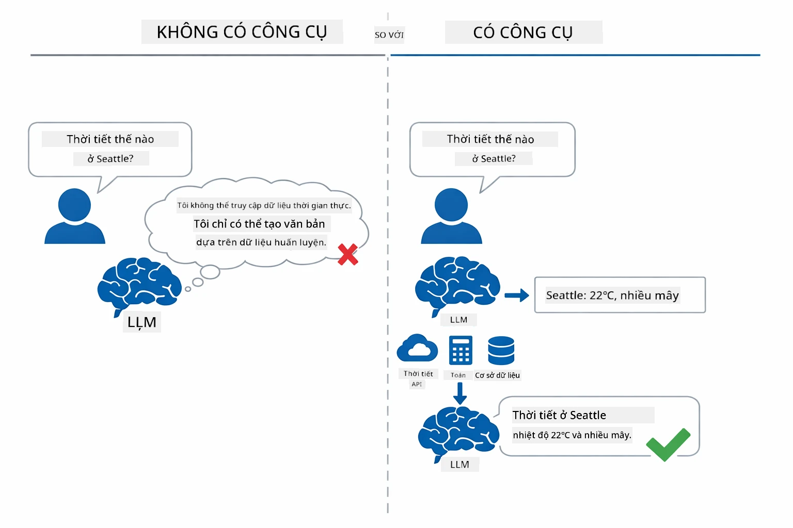

*Không có công cụ thì mô hình chỉ đoán — có công cụ, nó gọi API, thực hiện tính toán, và trả dữ liệu thời gian thực.*

Tác nhân AI với công cụ theo mẫu **Lý luận và Hành động (ReAct)**. Mô hình không chỉ trả lời — nó nghĩ về những gì cần, hành động bằng cách gọi công cụ, quan sát kết quả, rồi quyết định tiếp tục hay trả lời cuối cùng:

1. **Lý luận** — Tác nhân phân tích câu hỏi người dùng và xác định những thông tin cần thiết
2. **Hành động** — Tác nhân chọn công cụ đúng, tạo tham số chính xác, và gọi công cụ
3. **Quan sát** — Tác nhân nhận kết quả công cụ và đánh giá nó
4. **Lặp lại hoặc Trả lời** — Nếu cần thêm dữ liệu, tác nhân quay lại bước trước; nếu không, tạo câu trả lời ngôn ngữ tự nhiên

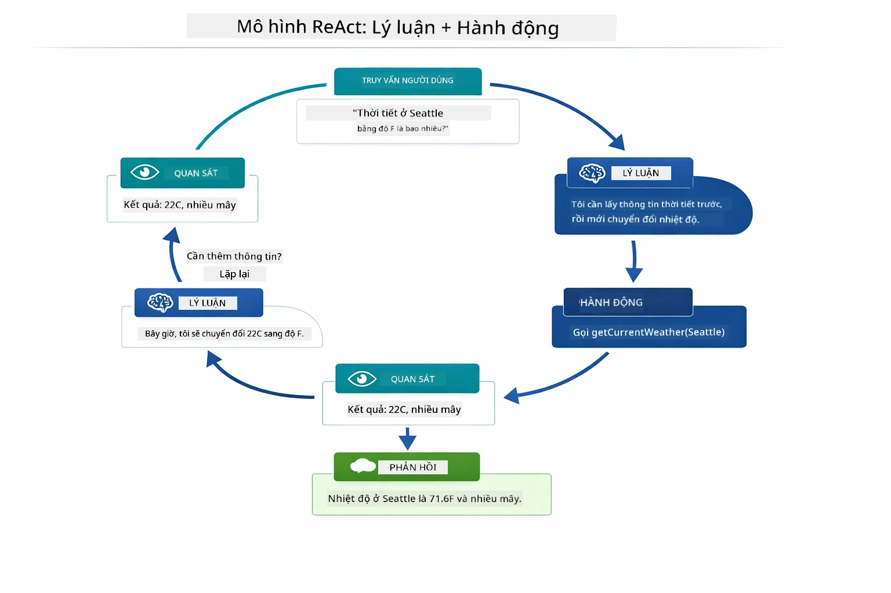

*Chu trình ReAct — tác nhân lý luận về việc cần làm, hành động gọi công cụ, quan sát kết quả, và lặp lại cho đến khi đưa ra câu trả lời.*

Điều này diễn ra tự động. Bạn định nghĩa công cụ và mô tả của chúng. Mô hình sẽ xử lý quyết định khi nào và cách dùng.

## Cách Gọi Công cụ hoạt động

### Định nghĩa Công cụ

[WeatherTool.java](../../../04-tools/src/main/java/com/example/langchain4j/agents/tools/WeatherTool.java) | [TemperatureTool.java](../../../04-tools/src/main/java/com/example/langchain4j/agents/tools/TemperatureTool.java)

Bạn định nghĩa hàm với mô tả rõ ràng và thông số cụ thể. Mô hình thấy những mô tả này trong prompt hệ thống và hiểu công cụ làm gì.

```java
@Component
public class WeatherTool {
    
    @Tool("Get the current weather for a location")
    public String getCurrentWeather(@P("Location name") String location) {
        // Logic tra cứu thời tiết của bạn
        return "Weather in " + location + ": 22°C, cloudy";
    }
}

@AiService
public interface Assistant {
    String chat(@MemoryId String sessionId, @UserMessage String message);
}

// Trợ lý được tự động kết nối bởi Spring Boot với:
// - Bean ChatModel
// - Tất cả các phương thức @Tool từ các lớp @Component
// - ChatMemoryProvider để quản lý phiên làm việc
```

Sơ đồ dưới đây phân tích từng annotation và giải thích cách mỗi phần giúp AI hiểu khi nào gọi công cụ và truyền tham số gì:

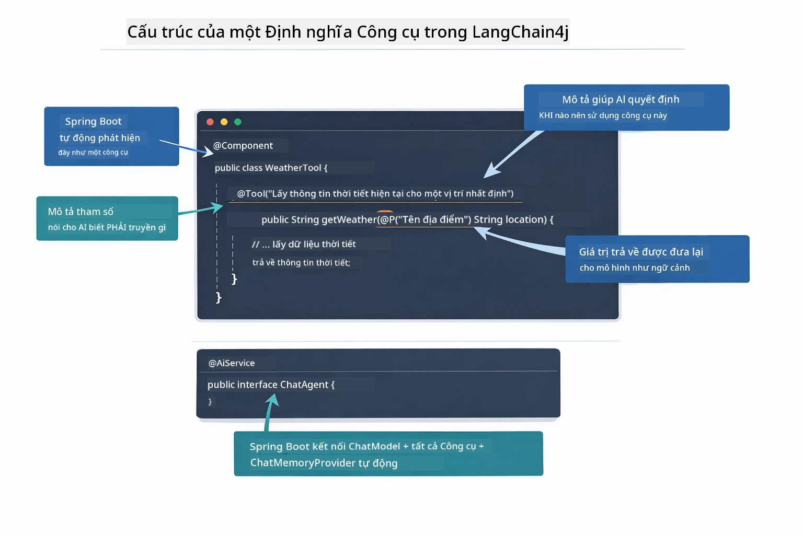

*Giải phẫu định nghĩa công cụ — @Tool báo cho AI khi dùng, @P mô tả từng tham số, và @AiService kết nối tất cả khi khởi động.*

> **🤖 Thử với [GitHub Copilot](https://github.com/features/copilot) Chat:** Mở [`WeatherTool.java`](../../../04-tools/src/main/java/com/example/langchain4j/agents/tools/WeatherTool.java) và hỏi:
> - "Làm sao tôi tích hợp API thời tiết thực như OpenWeatherMap thay vì dữ liệu giả?"
> - "Điều gì làm nên mô tả công cụ tốt giúp AI sử dụng chính xác?"
> - "Tôi xử lý lỗi API và giới hạn rate limit thế nào trong triển khai công cụ?"

### Quyết định

Khi người dùng hỏi "Thời tiết ở Seattle thế nào?", mô hình không chọn công cụ ngẫu nhiên. Nó so sánh ý định người dùng với mô tả từng công cụ mà nó có, đánh giá điểm phù hợp và chọn công cụ tốt nhất. Sau đó, tạo lệnh gọi hàm có cấu trúc với tham số phù hợp — ở đây là đặt `location` là `"Seattle"`.

Nếu không có công cụ nào phù hợp, mô hình trả lời dựa trên kiến thức của nó. Nếu nhiều công cụ phù hợp, nó chọn công cụ cụ thể nhất.

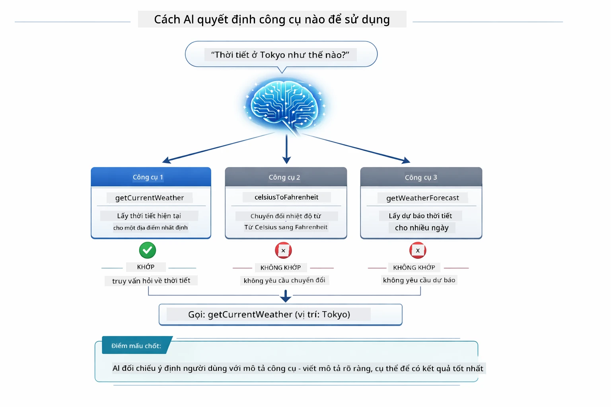

*Mô hình đánh giá mọi công cụ có sẵn so với ý định người dùng và chọn công cụ phù hợp nhất — đây là lý do mô tả công cụ rõ ràng, cụ thể rất quan trọng.*

### Thực thi

[AgentService.java](../../../04-tools/src/main/java/com/example/langchain4j/agents/service/AgentService.java)

Spring Boot tự động kết nối interface khai báo `@AiService` với tất cả công cụ đã đăng ký, và LangChain4j tự động thực hiện gọi công cụ. Đằng sau có 6 giai đoạn gọi công cụ hoàn chỉnh — từ câu hỏi ngôn ngữ tự nhiên của người dùng cho đến câu trả lời bằng ngôn ngữ tự nhiên:

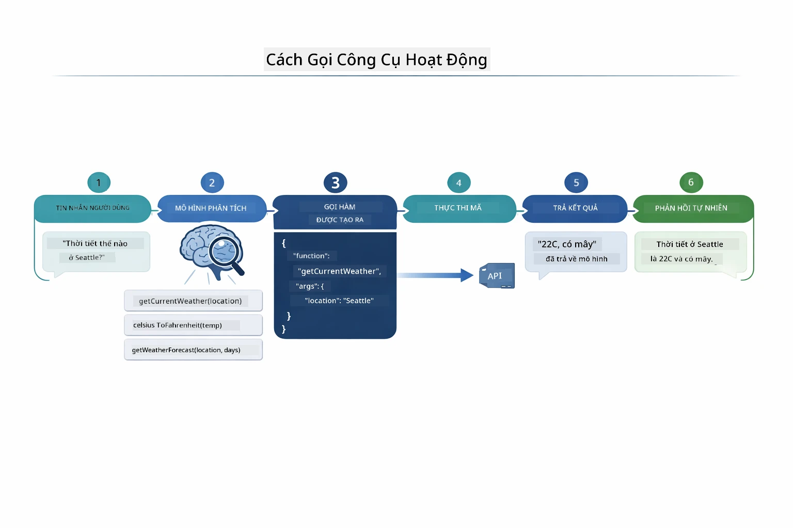

*Luồng liên tục — người dùng hỏi, mô hình chọn công cụ, LangChain4j thực thi, và mô hình đưa kết quả vào câu trả lời.*

> **🤖 Thử với [GitHub Copilot](https://github.com/features/copilot) Chat:** Mở [`AgentService.java`](../../../04-tools/src/main/java/com/example/langchain4j/agents/service/AgentService.java) và hỏi:
> - "Mẫu ReAct hoạt động thế nào và vì sao hiệu quả cho tác nhân AI?"
> - "Tác nhân quyết định dùng công cụ nào và theo thứ tự ra sao?"
> - "Nếu thực thi công cụ thất bại - làm thế nào để xử lý lỗi ổn định?"

### Tạo phản hồi

Mô hình nhận dữ liệu thời tiết và định dạng thành phản hồi ngôn ngữ tự nhiên cho người dùng.

### Kiến trúc: Spring Boot Tự động kết nối

Module này sử dụng tích hợp Spring Boot của LangChain4j với interface khai báo `@AiService`. Khi khởi động, Spring Boot phát hiện mọi `@Component` chứa phương thức `@Tool`, bean `ChatModel`, và `ChatMemoryProvider` — sau đó kết nối tất cả vào interface `Assistant` duy nhất với zero boilerplate.

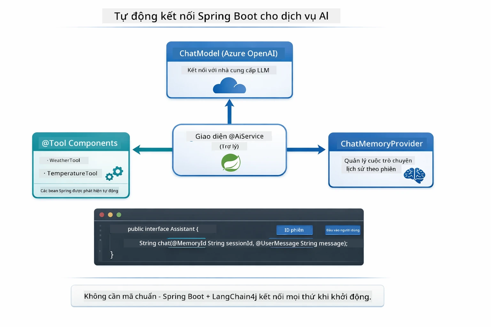

*Interface @AiService liên kết ChatModel, các thành phần công cụ, và bộ nhớ — Spring Boot tự động xử lý kết nối.*

Lợi ích chính của cách làm này:

- **Spring Boot tự động kết nối** — tự động chèn ChatModel và công cụ
- **Mẫu @MemoryId** — quản lý bộ nhớ theo phiên tự động
- **Một thể hiện duy nhất** — tạo Assistant một lần để tái sử dụng, tăng hiệu năng
- **Thực thi an toàn kiểu** — gọi phương thức Java trực tiếp với chuyển đổi kiểu
- **Điều phối đa lượt hội thoại** — tự xử lý chuỗi công cụ
- **Không cần boilerplate** — không phải gọi thủ công `AiServices.builder()` hoặc dùng HashMap bộ nhớ

Cách làm thủ công (gọi `AiServices.builder()`) cần nhiều mã hơn và không tận dụng được lợi thế tích hợp Spring Boot.

## Chuỗi Công cụ

**Chuỗi Công cụ** — Sức mạnh thực thụ của tác nhân dựa trên công cụ thể hiện khi một câu hỏi cần nhiều công cụ. Hỏi "Thời tiết ở Seattle bằng Fahrenheit thế nào?" và tác nhân tự động chuỗi hai công cụ: đầu tiên gọi `getCurrentWeather` để lấy nhiệt độ Celsius, sau đó chuyển giá trị đó vào `celsiusToFahrenheit` để đổi đơn vị — tất cả trong một lượt hội thoại.

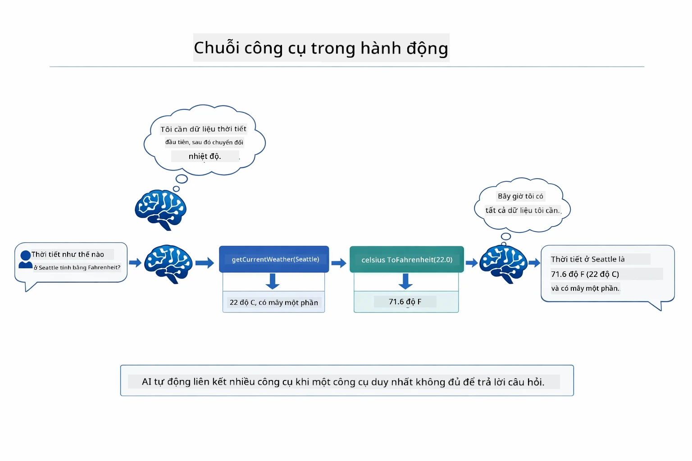

*Chuỗi công cụ thực tế — tác nhân gọi getCurrentWeather trước, sau đó truyền kết quả Celsius vào celsiusToFahrenheit, và trả lời kết hợp.*

**Xử lý lỗi nhẹ nhàng** — Hỏi thời tiết ở thành phố không có trong dữ liệu giả. Công cụ trả về tin nhắn lỗi, và AI giải thích không giúp được thay vì bị sập. Công cụ xử lý lỗi an toàn. Sơ đồ dưới đây so sánh hai cách — với xử lý lỗi đúng, tác nhân bắt ngoại lệ và phản hồi hữu ích, còn không có thì cả ứng dụng sập:

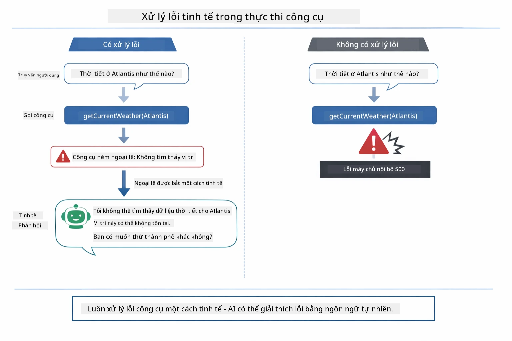

*Khi công cụ lỗi, tác nhân bắt lỗi và phản hồi giải thích thay vì bị sập.*

Điều này diễn ra trong một lượt hội thoại. Tác nhân điều phối nhiều lượt gọi công cụ tự động.

## Chạy Ứng dụng

**Kiểm tra triển khai:**

Đảm bảo file `.env` tồn tại trong thư mục gốc chứa thông tin Azure (được tạo trong Module 01). Chạy lệnh dưới thư mục module (`04-tools/`):

**Bash:**
```bash
cat ../.env  # Nên hiển thị AZURE_OPENAI_ENDPOINT, API_KEY, DEPLOYMENT
```

**PowerShell:**
```powershell
Get-Content ..\.env  # Nên hiển thị AZURE_OPENAI_ENDPOINT, API_KEY, DEPLOYMENT
```

**Khởi động ứng dụng:**

> **Lưu ý:** Nếu bạn đã khởi động tất cả ứng dụng bằng `./start-all.sh` từ thư mục gốc (theo Module 01), module này đã chạy trên cổng 8084. Bạn có thể bỏ qua các lệnh khởi động dưới đây và truy cập trực tiếp http://localhost:8084.

**Lựa chọn 1: Dùng Spring Boot Dashboard (Khuyến nghị cho người dùng VS Code)**

Container phát triển đã tích hợp extension Spring Boot Dashboard, cung cấp giao diện quản lý các ứng dụng Spring Boot. Bạn tìm thấy nó ở thanh hoạt động bên trái VS Code (biểu tượng Spring Boot).

Từ Spring Boot Dashboard, bạn có thể:
- Xem toàn bộ ứng dụng Spring Boot trong workspace
- Khởi động/dừng ứng dụng chỉ với một click
- Xem nhật ký ứng dụng theo thời gian thực
- Giám sát trạng thái ứng dụng

Chỉ cần nhấn nút play bên cạnh "tools" để khởi động module này, hoặc khởi động tất cả module cùng lúc.

Đây là hình Spring Boot Dashboard trong VS Code:


*Spring Boot Dashboard trong VS Code — khởi động, dừng, và giám sát tất cả module từ một nơi*

**Lựa chọn 2: Dùng script shell**

Khởi động tất cả ứng dụng web (module 01-04):

**Bash:**
```bash
cd ..  # Từ thư mục gốc
./start-all.sh
```

**PowerShell:**
```powershell
cd ..  # Từ thư mục gốc
.\start-all.ps1
```

Hoặc chỉ khởi động module này:

**Bash:**
```bash
cd 04-tools
./start.sh
```

**PowerShell:**
```powershell
cd 04-tools
.\start.ps1
```

Cả hai script tự động tải biến môi trường từ file `.env` gốc và sẽ xây dựng JAR nếu chưa có.

> **Lưu ý:** Nếu bạn muốn tự xây dựng tất cả module trước khi khởi động:
>
> **Bash:**
> ```bash
> cd ..  # Go to root directory
> mvn clean package -DskipTests
> ```

> **PowerShell:**
> ```powershell
> cd ..  # Go to root directory
> mvn clean package -DskipTests
> ```

Mở http://localhost:8084 trên trình duyệt.

**Để dừng:**

**Bash:**
```bash
./stop.sh  # Chỉ mô-đun này
# Hoặc
cd .. && ./stop-all.sh  # Tất cả các mô-đun
```

**PowerShell:**
```powershell
.\stop.ps1  # Chỉ mô-đun này
# Hoặc
cd ..; .\stop-all.ps1  # Tất cả các mô-đun
```

## Sử dụng Ứng dụng

Ứng dụng cung cấp giao diện web cho phép bạn tương tác với tác nhân AI có quyền truy cập công cụ kiểm tra thời tiết và chuyển đổi nhiệt độ. Giao diện như sau — bao gồm ví dụ bắt đầu nhanh và bảng chat gửi yêu cầu:
<a href="images/tools-homepage.png"></a>

*Giao diện Công cụ AI Agent - ví dụ nhanh và giao diện trò chuyện để tương tác với các công cụ*

### Thử Sử Dụng Công Cụ Đơn Giản

Bắt đầu với một yêu cầu đơn giản: "Chuyển đổi 100 độ Fahrenheit sang Celsius". Agent nhận ra nó cần công cụ chuyển đổi nhiệt độ, gọi công cụ với các tham số chính xác và trả về kết quả. Hãy chú ý cảm giác tự nhiên của việc này - bạn không phải chỉ định dùng công cụ nào hay cách gọi nó thế nào.

### Thử Chuỗi Công Cụ

Bây giờ thử cái phức tạp hơn: "Thời tiết ở Seattle thế nào và chuyển nó sang Fahrenheit?" Xem agent làm từng bước thế nào. Trước tiên nó lấy thông tin thời tiết (trả về Celsius), nhận ra cần chuyển sang Fahrenheit, gọi công cụ chuyển đổi, và kết hợp cả hai kết quả thành một phản hồi.

### Xem Luồng Hội Thoại

Giao diện trò chuyện duy trì lịch sử cuộc trò chuyện, cho phép bạn tương tác nhiều lượt. Bạn có thể xem tất cả các truy vấn và phản hồi trước đó, giúp dễ dàng theo dõi cuộc trò chuyện và hiểu cách agent xây dựng ngữ cảnh qua nhiều lượt trao đổi.

<a href="images/tools-conversation-demo.png"></a>

*Cuộc trò chuyện đa lượt hiển thị các chuyển đổi đơn giản, tra cứu thời tiết và chuỗi công cụ*

### Thử Nghiệm Với Các Yêu Cầu Khác Nhau

Thử các kết hợp khác nhau:
- Tra cứu thời tiết: "Thời tiết ở Tokyo thế nào?"
- Chuyển đổi nhiệt độ: "25°C bằng bao nhiêu Kelvin?"
- Truy vấn kết hợp: "Kiểm tra thời tiết ở Paris và nói nếu nó trên 20°C"

Chú ý cách agent hiểu ngôn ngữ tự nhiên và ánh xạ nó tới các cuộc gọi công cụ phù hợp.

## Các Khái Niệm Chính

### Mô Hình ReAct (Lý luận và Hành động)

Agent xen kẽ giữa lý luận (quyết định phải làm gì) và hành động (sử dụng công cụ). Mô hình này cho phép giải quyết vấn đề tự động thay vì chỉ đáp ứng theo hướng dẫn.

### Mô Tả Công Cụ Quan Trọng

Chất lượng mô tả công cụ ảnh hưởng trực tiếp đến việc agent sử dụng chúng hiệu quả thế nào. Các mô tả rõ ràng, cụ thể giúp mô hình hiểu khi nào và cách gọi mỗi công cụ.

### Quản Lý Phiên

Chú thích `@MemoryId` cho phép quản lý bộ nhớ dựa trên phiên tự động. Mỗi ID phiên sẽ có một instance `ChatMemory` riêng được quản lý bởi bean `ChatMemoryProvider`, vì vậy nhiều người dùng có thể tương tác với agent đồng thời mà cuộc trò chuyện không bị lẫn lộn. Sơ đồ dưới đây cho thấy cách nhiều người dùng được điều hướng đến các kho lưu trữ lịch sử trò chuyện riêng biệt dựa trên ID phiên của họ:

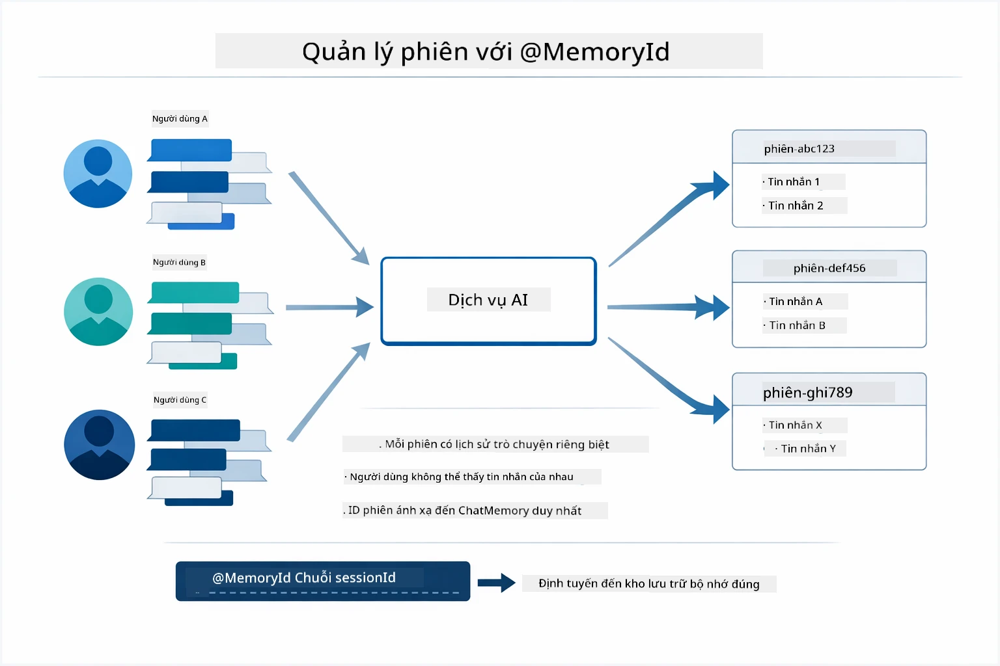

*Mỗi ID phiên tương ứng với một lịch sử trò chuyện riêng biệt — người dùng không bao giờ thấy tin nhắn của nhau.*

### Xử Lý Lỗi

Công cụ có thể gặp sự cố — API timeout, tham số không hợp lệ, dịch vụ bên ngoài ngừng hoạt động. Agent thực tế cần xử lý lỗi để mô hình có thể giải thích vấn đề hoặc thử phương án khác thay vì làm sập toàn bộ ứng dụng. Khi công cụ ném ngoại lệ, LangChain4j sẽ bắt và truyền thông báo lỗi trở lại cho mô hình, sau đó mô hình có thể giải thích vấn đề bằng ngôn ngữ tự nhiên.

## Công Cụ Có Sẵn

Sơ đồ dưới đây mô tả hệ sinh thái rộng lớn các công cụ bạn có thể xây dựng. Module này minh họa công cụ về thời tiết và nhiệt độ, nhưng cùng mẫu `@Tool` có thể áp dụng cho mọi phương thức Java — từ truy vấn cơ sở dữ liệu đến xử lý thanh toán.

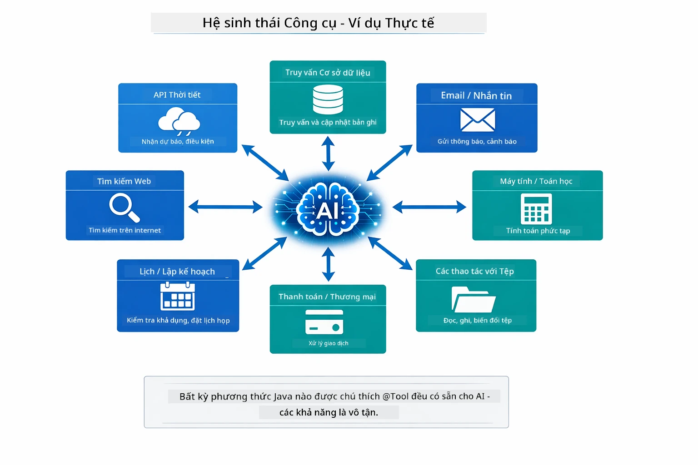

*Mọi phương thức Java được chú thích @Tool trở nên sẵn có cho AI — mẫu này mở rộng tới cơ sở dữ liệu, API, email, thao tác file và nhiều hơn thế.*

## Khi Nào Sử Dụng Agent Dựa Trên Công Cụ

Không phải yêu cầu nào cũng cần công cụ. Quyết định dựa trên việc AI có cần tương tác với hệ thống ngoài hay có thể trả lời dựa trên kiến thức của chính nó. Hướng dẫn dưới đây tóm tắt khi nào công cụ có giá trị và khi nào không cần:

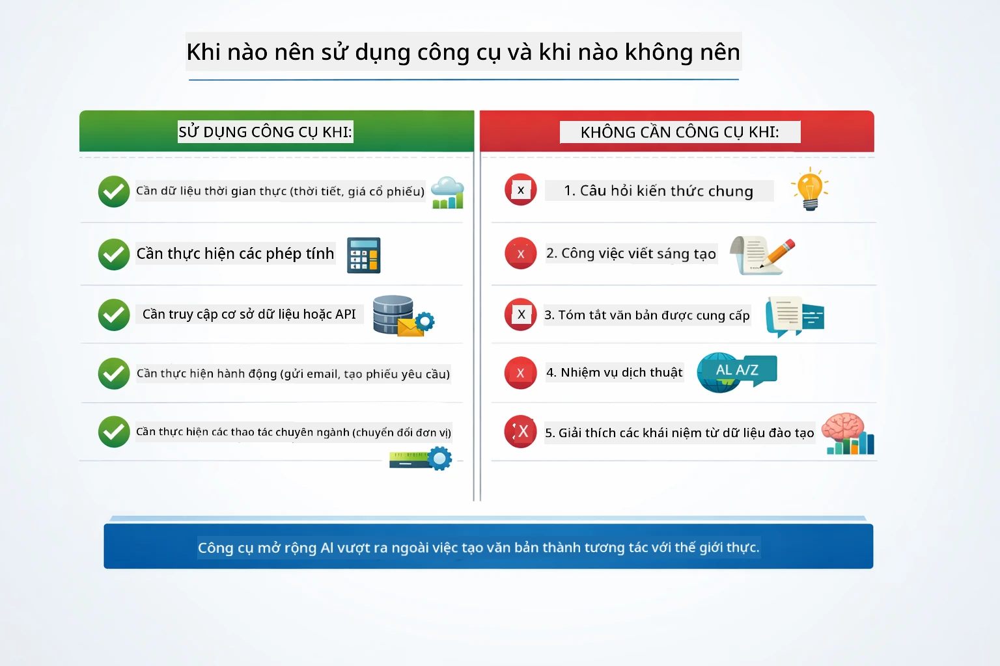

*Hướng dẫn nhanh — công cụ dùng cho dữ liệu thời gian thực, tính toán, và hành động; kiến thức chung và tác vụ sáng tạo không cần.*

## Công Cụ và RAG

Module 03 và 04 đều mở rộng khả năng của AI, nhưng theo cách cơ bản khác nhau. RAG cho phép mô hình truy cập **kiến thức** bằng cách truy xuất tài liệu. Công cụ cho phép mô hình thực hiện **hành động** bằng cách gọi hàm. Sơ đồ dưới đây so sánh hai phương pháp này sát cạnh nhau — từ cách mỗi quy trình vận hành đến các đánh đổi giữa chúng:

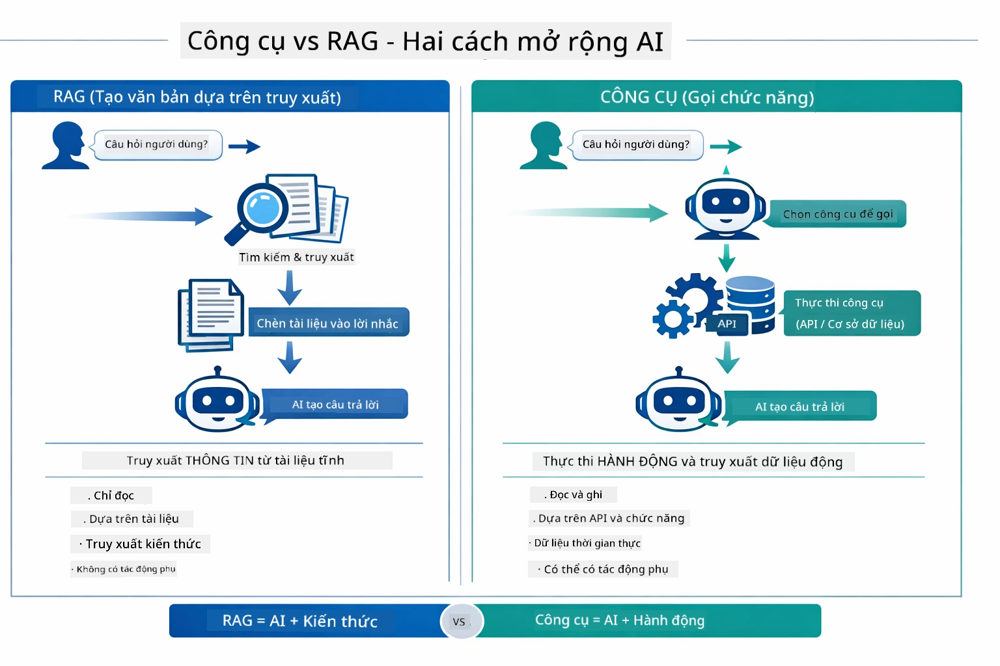

*RAG truy xuất thông tin từ tài liệu tĩnh — Công cụ thực thi hành động và lấy dữ liệu động, thời gian thực. Nhiều hệ thống triển khai kết hợp cả hai.*

Trên thực tế, nhiều hệ thống sản xuất kết hợp cả hai: RAG để nền tảng câu trả lời dựa trên tài liệu của bạn và Công cụ để lấy dữ liệu trực tiếp hoặc thực hiện thao tác.

## Bước Tiếp Theo

**Module kế tiếp:** [05-mcp - Model Context Protocol (MCP)](../05-mcp/README.md)

---

**Điều hướng:** [← Trước: Module 03 - RAG](../03-rag/README.md) | [Quay lại Trang chính](../README.md) | [Tiếp: Module 05 - MCP →](../05-mcp/README.md)

---

<!-- CO-OP TRANSLATOR DISCLAIMER START -->
**Tuyên bố miễn trừ trách nhiệm**:  
Tài liệu này đã được dịch bằng dịch vụ dịch thuật AI [Co-op Translator](https://github.com/Azure/co-op-translator). Mặc dù chúng tôi nỗ lực đảm bảo độ chính xác, xin lưu ý rằng các bản dịch tự động có thể chứa lỗi hoặc không chính xác. Tài liệu gốc bằng ngôn ngữ gốc nên được xem là nguồn chính thức. Đối với thông tin quan trọng, nên sử dụng dịch vụ dịch thuật chuyên nghiệp do con người thực hiện. Chúng tôi không chịu trách nhiệm về bất kỳ sự hiểu nhầm hoặc giải thích sai nào phát sinh từ việc sử dụng bản dịch này.
<!-- CO-OP TRANSLATOR DISCLAIMER END -->