# Module 05: Giao thức Ngữ cảnh Mô hình (MCP)

## Mục lục

- [Hướng dẫn bằng video](../../../05-mcp)
- [Bạn sẽ học được gì](../../../05-mcp)
- [MCP là gì?](../../../05-mcp)
- [Cách MCP hoạt động](../../../05-mcp)
- [Module Agentic](../../../05-mcp)
- [Chạy ví dụ](../../../05-mcp)
  - [Yêu cầu trước](../../../05-mcp)
- [Bắt đầu nhanh](../../../05-mcp)
  - [Các thao tác file (Stdio)](../../../05-mcp)
  - [Agent Giám sát](../../../05-mcp)
    - [Chạy bản demo](../../../05-mcp)
    - [Cách Giám sát hoạt động](../../../05-mcp)
    - [Cách FileAgent phát hiện các công cụ MCP khi chạy](../../../05-mcp)
    - [Chiến lược phản hồi](../../../05-mcp)
    - [Hiểu về đầu ra](../../../05-mcp)
    - [Giải thích các tính năng của Module Agentic](../../../05-mcp)
- [Các khái niệm chính](../../../05-mcp)
- [Chúc mừng!](../../../05-mcp)
  - [Tiếp theo là gì?](../../../05-mcp)

## Hướng dẫn bằng video

Xem buổi trực tiếp này giải thích cách bắt đầu với module này:

<a href="https://www.youtube.com/watch?v=O_J30kZc0rw"></a>

## Bạn sẽ học được gì

Bạn đã xây dựng AI hội thoại, nắm vững các prompt, tạo phản hồi dựa trên tài liệu, và tạo các agent với công cụ. Nhưng tất cả các công cụ đó đều được xây dựng tùy chỉnh cho ứng dụng cụ thể của bạn. Điều gì sẽ xảy ra nếu bạn có thể cung cấp cho AI quyền truy cập vào một hệ sinh thái tiêu chuẩn của các công cụ mà bất kỳ ai cũng có thể tạo và chia sẻ? Trong module này, bạn sẽ học cách làm điều đó với Giao thức Ngữ cảnh Mô hình (MCP) và module agentic của LangChain4j. Trước tiên, chúng tôi trình bày một trình đọc file MCP đơn giản và sau đó cho thấy cách nó dễ dàng tích hợp vào các luồng công việc agentic nâng cao sử dụng mẫu Agent Giám sát.

## MCP là gì?

Giao thức Ngữ cảnh Mô hình (MCP) cung cấp chính xác điều đó - một cách tiêu chuẩn để các ứng dụng AI khám phá và sử dụng các công cụ bên ngoài. Thay vì viết tích hợp tùy chỉnh cho từng nguồn dữ liệu hoặc dịch vụ, bạn kết nối tới các máy chủ MCP cung cấp khả năng của họ theo định dạng nhất quán. Agent AI của bạn sau đó có thể tự động khám phá và sử dụng các công cụ này.

Sơ đồ dưới đây cho thấy sự khác biệt — nếu không có MCP, mỗi tích hợp đòi hỏi đi dây điểm-điểm tùy chỉnh; với MCP, một giao thức duy nhất kết nối ứng dụng của bạn tới bất kỳ công cụ nào:


*Trước MCP: Tích hợp điểm-điểm phức tạp. Sau MCP: Một giao thức, vô tận khả năng.*

MCP giải quyết một vấn đề cơ bản trong phát triển AI: mỗi tích hợp đều tùy chỉnh. Muốn truy cập GitHub? Mã tùy chỉnh. Muốn đọc file? Mã tùy chỉnh. Muốn truy vấn cơ sở dữ liệu? Mã tùy chỉnh. Và không tích hợp nào trong số này hoạt động với các ứng dụng AI khác.

MCP chuẩn hóa điều này. Một máy chủ MCP cung cấp công cụ kèm theo mô tả rõ ràng và lược đồ tham số. Bất kỳ client MCP nào cũng có thể kết nối, khám phá các công cụ có sẵn, và sử dụng chúng. Xây dựng một lần, dùng mọi nơi.

Sơ đồ dưới đây minh họa kiến trúc này — một client MCP duy nhất (ứng dụng AI của bạn) kết nối tới nhiều máy chủ MCP, mỗi máy chủ cung cấp bộ công cụ riêng thông qua giao thức chuẩn:


*Kiến trúc Giao thức Ngữ cảnh Mô hình - khám phá và thực thi công cụ chuẩn hóa*

## Cách MCP hoạt động

Ở tầng dưới, MCP sử dụng kiến trúc phân lớp. Ứng dụng Java của bạn (client MCP) khám phá các công cụ có sẵn, gửi yêu cầu JSON-RPC thông qua lớp truyền tải (Stdio hoặc HTTP), và máy chủ MCP thực thi các thao tác và trả về kết quả. Sơ đồ sau phân tích từng tầng của giao thức này:

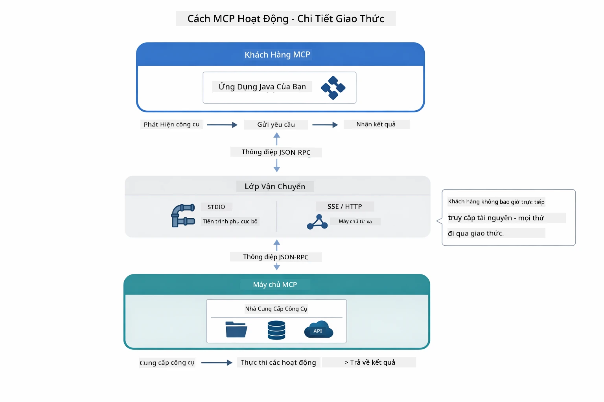

*Cách MCP hoạt động bên trong — client khám phá công cụ, trao đổi tin nhắn JSON-RPC, và thực thi thao tác qua lớp truyền tải.*

**Kiến trúc Máy chủ-Khách**

MCP sử dụng mô hình máy chủ-khách. Máy chủ cung cấp công cụ - đọc file, truy vấn cơ sở dữ liệu, gọi API. Client (ứng dụng AI của bạn) kết nối tới máy chủ và sử dụng công cụ của họ.

Để dùng MCP với LangChain4j, thêm phụ thuộc Maven sau:

```xml
<dependency>
    <groupId>dev.langchain4j</groupId>
    <artifactId>langchain4j-mcp</artifactId>
    <version>${langchain4j.version}</version>
</dependency>
```

**Khám phá Công cụ**

Khi client của bạn kết nối tới máy chủ MCP, nó hỏi "Bạn có những công cụ gì?" Máy chủ trả về danh sách các công cụ có sẵn, mỗi công cụ có mô tả và lược đồ tham số. Agent AI của bạn có thể quyết định công cụ nào sẽ dùng dựa trên yêu cầu người dùng. Sơ đồ dưới đây mô tả quá trình bắt tay này — client gửi yêu cầu `tools/list` và máy chủ trả về các công cụ kèm mô tả và lược đồ tham số:

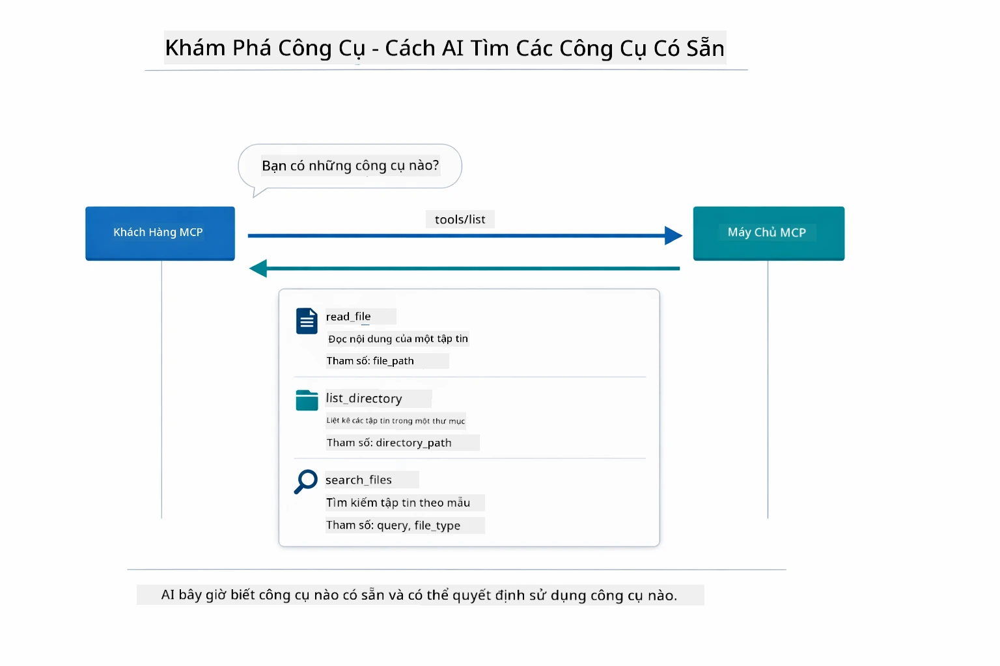

*AI khám phá các công cụ có sẵn khi khởi động — giờ nó biết các khả năng có thể dùng và có thể quyết định công cụ nào nên dùng.*

**Cơ chế Truyền tải**

MCP hỗ trợ các cơ chế truyền tải khác nhau. Hai tùy chọn là Stdio (cho giao tiếp subprocess cục bộ) và Streamable HTTP (cho máy chủ từ xa). Module này trình bày truyền tải Stdio:


*Cơ chế truyền tải MCP: HTTP cho máy chủ từ xa, Stdio cho tiến trình cục bộ*

**Stdio** - [StdioTransportDemo.java](../../../05-mcp/src/main/java/com/example/langchain4j/mcp/StdioTransportDemo.java)

Dùng cho tiến trình cục bộ. Ứng dụng của bạn tạo ra một máy chủ như subprocess và giao tiếp qua đầu vào/ra chuẩn. Hữu ích để truy cập hệ thống file hoặc công cụ dòng lệnh.

```java
McpTransport stdioTransport = new StdioMcpTransport.Builder()
    .command(List.of(
        npmCmd, "exec",
        "@modelcontextprotocol/server-filesystem@2025.12.18",
        resourcesDir
    ))
    .logEvents(false)
    .build();
```

Máy chủ `@modelcontextprotocol/server-filesystem` cung cấp các công cụ sau, tất cả đều hoạt động trong vùng an toàn giới hạn thư mục bạn chỉ định:

| Công cụ | Mô tả |
|------|-------------|
| `read_file` | Đọc nội dung một file duy nhất |
| `read_multiple_files` | Đọc nhiều file trong một lần gọi |
| `write_file` | Tạo hoặc ghi đè một file |
| `edit_file` | Thực hiện chỉnh sửa tìm và thay thế có mục tiêu |
| `list_directory` | Liệt kê file và thư mục tại một đường dẫn |
| `search_files` | Tìm kiếm đệ quy các file phù hợp mẫu |
| `get_file_info` | Lấy siêu dữ liệu file (kích thước, thời gian, quyền truy cập) |
| `create_directory` | Tạo thư mục (bao gồm các thư mục cha) |
| `move_file` | Di chuyển hoặc đổi tên file hoặc thư mục |

Sơ đồ sau thể hiện cách truyền tải Stdio hoạt động khi chạy — ứng dụng Java của bạn tạo máy chủ MCP như một tiến trình con và họ giao tiếp qua các ống stdin/stdout, không sử dụng mạng hay HTTP:

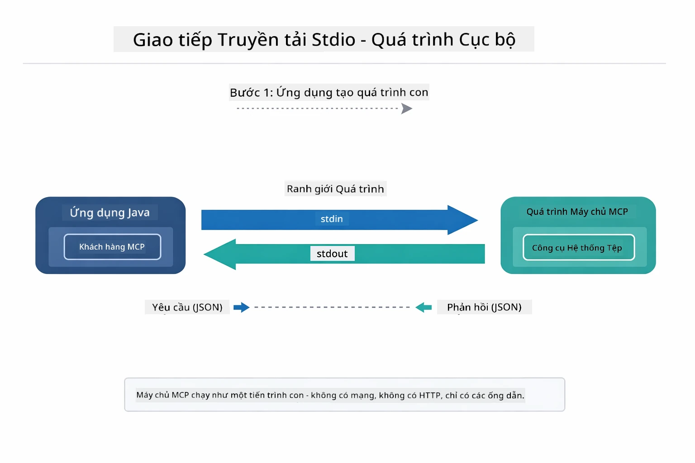

*Truyền tải Stdio đang hoạt động — ứng dụng của bạn tạo máy chủ MCP như tiến trình con và giao tiếp qua ống stdin/stdout.*

> **🤖 Thử dùng Chat [GitHub Copilot](https://github.com/features/copilot):** Mở [`StdioTransportDemo.java`](../../../05-mcp/src/main/java/com/example/langchain4j/mcp/StdioTransportDemo.java) và hỏi:
> - "Truyền tải Stdio hoạt động thế nào và khi nào nên sử dụng thay vì HTTP?"
> - "LangChain4j quản lý vòng đời các tiến trình máy chủ MCP sinh ra thế nào?"
> - "Những tác động bảo mật khi cho AI truy cập hệ thống file là gì?"

## Module Agentic

Trong khi MCP cung cấp công cụ tiêu chuẩn, module **agentic** của LangChain4j cung cấp cách khai báo để xây dựng các agent phối hợp các công cụ đó. Chú thích `@Agent` và `AgenticServices` cho phép bạn định nghĩa hành vi agent qua giao diện thay vì mã lệnh trực tiếp.

Trong module này, bạn sẽ khám phá mẫu **Agent Giám sát** — một cách tiếp cận agentic AI nâng cao, nơi agent "giám sát" quyết định động các sub-agent sẽ gọi dựa trên yêu cầu người dùng. Chúng tôi sẽ kết hợp hai khái niệm bằng cách cung cấp cho một trong các sub-agent của chúng tôi khả năng truy cập file qua MCP.

Để sử dụng module agentic, thêm phụ thuộc Maven sau:

```xml
<dependency>
    <groupId>dev.langchain4j</groupId>
    <artifactId>langchain4j-agentic</artifactId>
    <version>${langchain4j.mcp.version}</version>
</dependency>
```
> **Lưu ý:** Module `langchain4j-agentic` sử dụng thuộc tính phiên bản riêng (`langchain4j.mcp.version`) vì nó phát hành theo lịch khác với các thư viện lõi LangChain4j.

> **⚠️ Thử nghiệm:** Module `langchain4j-agentic` là **thử nghiệm** và có thể thay đổi. Cách xây dựng trợ lý AI ổn định vẫn là dùng `langchain4j-core` với các công cụ tùy chỉnh (Module 04).

## Chạy ví dụ

### Yêu cầu trước

- Đã hoàn thành [Module 04 - Công cụ](../04-tools/README.md) (module này dựa trên kiến thức công cụ tùy chỉnh và so sánh với công cụ MCP)
- File `.env` trong thư mục gốc có thông tin xác thực Azure (được tạo bằng `azd up` trong Module 01)
- Java 21+, Maven 3.9+
- Node.js 16+ và npm (cho các máy chủ MCP)

> **Lưu ý:** Nếu bạn chưa thiết lập biến môi trường, xem [Module 01 - Giới thiệu](../01-introduction/README.md) để biết hướng dẫn triển khai (`azd up` tự động tạo file `.env`), hoặc sao chép `.env.example` thành `.env` trong thư mục gốc và điền thông tin.

## Bắt đầu nhanh

**Dùng VS Code:** Nhấp chuột phải vào file demo bất kỳ trong Explorer và chọn **"Run Java"**, hoặc dùng cấu hình khởi chạy trong bảng Run and Debug (đảm bảo file `.env` đã cấu hình thông tin Azure trước).

**Dùng Maven:** Bạn cũng có thể chạy từ dòng lệnh với các ví dụ dưới đây.

### Các thao tác file (Stdio)

Ví dụ này minh họa công cụ dùng subprocess cục bộ.

**✅ Không cần yêu cầu trước** - máy chủ MCP được sinh tự động.

**Dùng script khởi động (Khuyến nghị):**

Script khởi động tự động tải biến môi trường từ file `.env` ở thư mục gốc:

**Bash:**
```bash
cd 05-mcp
chmod +x start-stdio.sh
./start-stdio.sh
```

**PowerShell:**
```powershell
cd 05-mcp
.\start-stdio.ps1
```

**Dùng VS Code:** Nhấp chuột phải vào `StdioTransportDemo.java` và chọn **"Run Java"** (đảm bảo file `.env` đã cấu hình).

Ứng dụng tự động tạo máy chủ MCP hệ thống file và đọc một file cục bộ. Chú ý cách quản lý tiến trình con được xử lý tự động cho bạn.

**Đầu ra dự kiến:**
```
Assistant response: The file provides an overview of LangChain4j, an open-source Java library
for integrating Large Language Models (LLMs) into Java applications...
```

### Agent Giám sát

Mẫu **Agent Giám sát** là dạng **linh hoạt** của agentic AI. Một Supervisor dùng LLM để tự quyết định agent nào sẽ gọi dựa trên yêu cầu người dùng. Trong ví dụ tiếp theo, chúng ta kết hợp truy cập file qua MCP với agent LLM để tạo luồng đọc file → báo cáo có giám sát.

Trong demo, `FileAgent` đọc file bằng công cụ hệ thống file MCP, và `ReportAgent` tạo báo cáo có cấu trúc với tóm tắt điều hành (1 câu), 3 điểm chính và khuyến nghị. Supervisor điều phối luồng công việc này tự động:

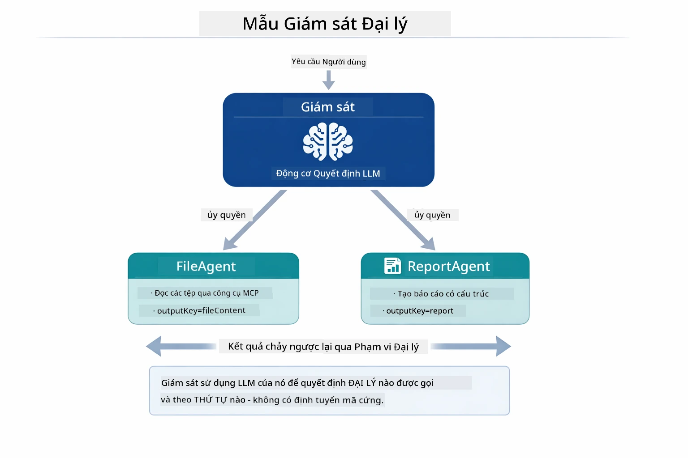

*Supervisor dùng LLM để quyết định agent nào gọi và theo thứ tự nào — không cần định tuyến cứng.*

Dưới đây là luồng công việc thực tế cho pipeline file đến báo cáo:

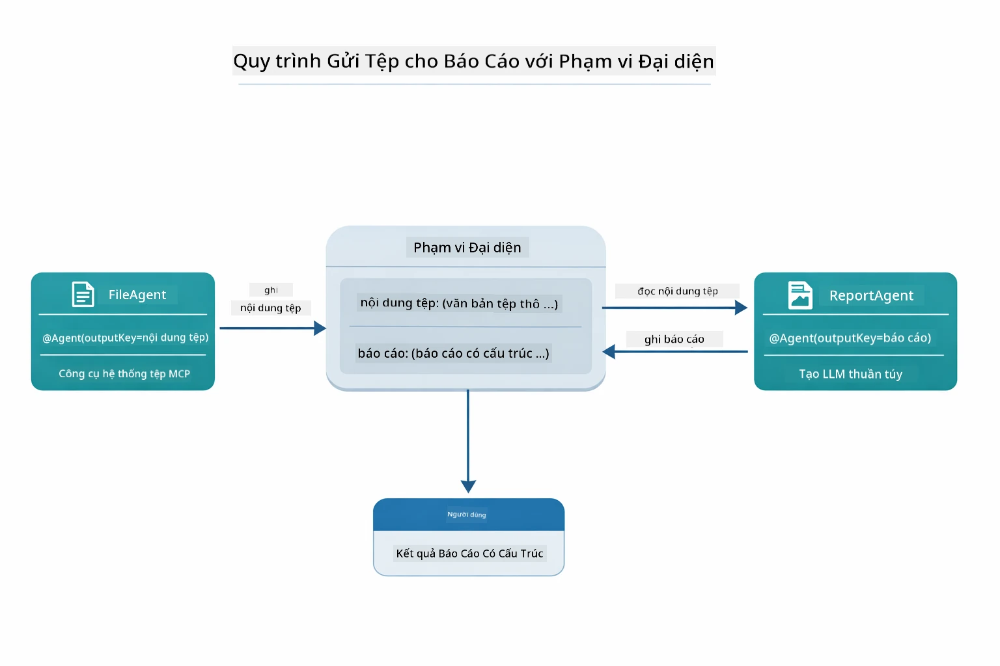

*FileAgent đọc file qua công cụ MCP, sau đó ReportAgent biến đổi nội dung thô thành báo cáo có cấu trúc.*

Sơ đồ tuần tự dưới đây theo dõi toàn bộ điều phối Supervisor — từ việc sinh máy chủ MCP, quá trình chọn agent tự động của Supervisor, đến gọi công cụ qua stdio và báo cáo cuối cùng:

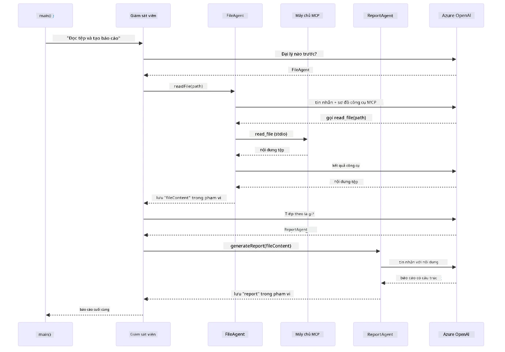

*Supervisor tự gọi FileAgent (gọi máy chủ MCP qua stdio để đọc file), rồi gọi ReportAgent tạo báo cáo có cấu trúc — mỗi agent lưu đầu ra của mình trong Bộ nhớ Agentic dùng chung.*

Mỗi agent lưu kết quả của mình trong **Bộ nhớ Agentic** (bộ nhớ chia sẻ), cho phép agent sau truy cập kết quả trước đó. Điều này minh họa cách công cụ MCP tích hợp trơn tru vào luồng agentic — Supervisor không cần biết *cách* đọc file, chỉ cần biết `FileAgent` có thể làm điều đó.

#### Chạy bản demo

Script khởi động tự động tải biến môi trường từ file `.env` ở thư mục gốc:

**Bash:**
```bash
cd 05-mcp
chmod +x start-supervisor.sh
./start-supervisor.sh
```

**PowerShell:**
```powershell
cd 05-mcp
.\start-supervisor.ps1
```

**Dùng VS Code:** Nhấp chuột phải vào `SupervisorAgentDemo.java` và chọn **"Run Java"** (đảm bảo file `.env` đã cấu hình).

#### Cách Giám sát hoạt động

Trước khi xây dựng agent, bạn cần kết nối truyền tải MCP tới một client và đóng gói nó như một `ToolProvider`. Đây là cách các công cụ của máy chủ MCP trở nên khả dụng với agent của bạn:

```java
// Tạo một client MCP từ giao thức truyền tải
McpClient mcpClient = new DefaultMcpClient.Builder()
        .transport(stdioTransport)
        .build();

// Bao bọc client như một ToolProvider — điều này kết nối các công cụ MCP vào LangChain4j
ToolProvider mcpToolProvider = McpToolProvider.builder()
        .mcpClients(List.of(mcpClient))
        .build();
```

Bây giờ bạn có thể tiêm `mcpToolProvider` vào bất kỳ agent nào cần công cụ MCP:

```java
// Bước 1: FileAgent đọc file sử dụng công cụ MCP
FileAgent fileAgent = AgenticServices.agentBuilder(FileAgent.class)
        .chatModel(model)
        .toolProvider(mcpToolProvider)  // Có công cụ MCP để thao tác với file
        .build();

// Bước 2: ReportAgent tạo báo cáo có cấu trúc
ReportAgent reportAgent = AgenticServices.agentBuilder(ReportAgent.class)
        .chatModel(model)
        .build();

// Supervisor điều phối quy trình công việc từ file → báo cáo
SupervisorAgent supervisor = AgenticServices.supervisorBuilder()
        .chatModel(model)
        .subAgents(fileAgent, reportAgent)
        .responseStrategy(SupervisorResponseStrategy.LAST)  // Trả về báo cáo cuối cùng
        .build();

// Supervisor quyết định gọi agent nào dựa trên yêu cầu
String response = supervisor.invoke("Read the file at /path/file.txt and generate a report");
```

#### Cách FileAgent phát hiện các công cụ MCP khi chạy

Bạn có thể thắc mắc: **làm sao `FileAgent` biết cách dùng công cụ hệ thống file npm?** Câu trả lời là nó không biết trước — **LLM** sẽ tìm hiểu khi chạy thông qua lược đồ công cụ.
Giao diện `FileAgent` chỉ là một **định nghĩa prompt**. Nó không chứa kiến thức cứng nhắc về `read_file`, `list_directory` hay bất kỳ công cụ MCP nào khác. Dưới đây là quy trình diễn ra từ đầu đến cuối:

1. **Server khởi chạy:** `StdioMcpTransport` chạy gói npm `@modelcontextprotocol/server-filesystem` như một tiến trình con
2. **Khám phá công cụ:** `McpClient` gửi yêu cầu JSON-RPC `tools/list` đến server, server trả về tên công cụ, mô tả và schema tham số (ví dụ, `read_file` — *"Đọc toàn bộ nội dung của một tập tin"* — `{ path: string }`)
3. **Chích schema:** `McpToolProvider` đóng gói các schema được phát hiện và cung cấp cho LangChain4j
4. **LLM quyết định:** Khi gọi `FileAgent.readFile(path)`, LangChain4j gửi tin nhắn hệ thống, tin nhắn người dùng, **và danh sách schema công cụ** cho LLM. LLM đọc mô tả công cụ và tạo cuộc gọi công cụ (ví dụ, `read_file(path="/some/file.txt")`)
5. **Thực thi:** LangChain4j chặn cuộc gọi công cụ, định tuyến qua client MCP trở lại tiến trình Node.js con, nhận kết quả và đưa lại cho LLM

Đây là cùng cơ chế [Khám phá Công cụ (Tool Discovery)](../../../05-mcp) đã được mô tả phía trên, nhưng áp dụng đặc biệt cho luồng công việc agent. Các chú thích `@SystemMessage` và `@UserMessage` hướng dẫn hành vi của LLM, trong khi `ToolProvider` được chích vào cung cấp **các khả năng** — LLM cầu nối giữa hai yếu tố này khi chạy.

> **🤖 Thử với [GitHub Copilot](https://github.com/features/copilot) Chat:** Mở [`FileAgent.java`](../../../05-mcp/src/main/java/com/example/langchain4j/mcp/agents/FileAgent.java) và hỏi:
> - "Làm sao agent này biết gọi công cụ MCP nào?"
> - "Điều gì sẽ xảy ra nếu tôi loại bỏ ToolProvider khỏi agent builder?"
> - "Schema công cụ được truyền cho LLM như thế nào?"

#### Chiến lược Trả lời

Khi cấu hình `SupervisorAgent`, bạn xác định cách nó nên xây dựng câu trả lời cuối cùng cho người dùng sau khi các sub-agent hoàn thành nhiệm vụ. Hình bên dưới thể hiện ba chiến lược có thể dùng — LAST trả về kết quả cuối cùng của agent cuối cùng, SUMMARY tổng hợp tất cả kết quả qua LLM, còn SCORED chọn kết quả có điểm cao hơn so với yêu cầu gốc:

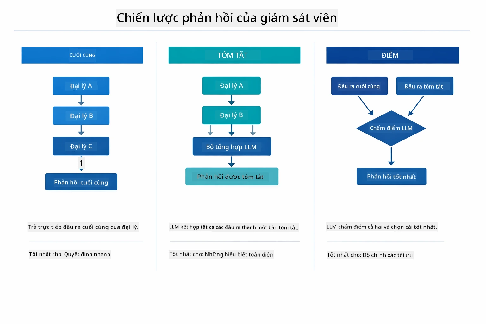

*Ba chiến lược để Supervisor xây dựng câu trả lời cuối cùng — chọn dựa trên việc bạn muốn kết quả của agent cuối cùng, một bản tóm tắt tổng hợp, hay phương án được điểm cao nhất.*

Các chiến lược có sẵn là:

| Chiến lược | Mô tả |
|------------|-------|
| **LAST** | Supervisor trả về kết quả của sub-agent hoặc công cụ được gọi cuối cùng. Phù hợp khi agent cuối cùng trong luồng được thiết kế đặc biệt để tạo ra câu trả lời hoàn chỉnh cuối cùng (ví dụ “Agent Tóm tắt” trong pipeline nghiên cứu). |
| **SUMMARY** | Supervisor sử dụng mô hình ngôn ngữ nội tại (LLM) để tổng hợp tóm tắt toàn bộ tương tác và kết quả các sub-agent, sau đó trả lại tóm tắt đó làm câu trả lời cuối cùng. Cung cấp câu trả lời tổng hợp, rõ ràng cho người dùng. |
| **SCORED** | Hệ thống dùng LLM nội tại để đánh giá cả câu trả lời LAST và tóm tắt SUMMARY dựa trên yêu cầu người dùng gốc, trả lại kết quả có điểm cao hơn. |

Xem [SupervisorAgentDemo.java](../../../05-mcp/src/main/java/com/example/langchain4j/mcp/SupervisorAgentDemo.java) để xem triển khai đầy đủ.

> **🤖 Thử với [GitHub Copilot](https://github.com/features/copilot) Chat:** Mở [`SupervisorAgentDemo.java`](../../../05-mcp/src/main/java/com/example/langchain4j/mcp/SupervisorAgentDemo.java) và hỏi:
> - "Supervisor làm sao quyết định agent nào được gọi?"
> - "Sự khác biệt giữa Supervisor và mẫu luồng Sequential là gì?"
> - "Làm sao tôi tùy chỉnh hành vi lập kế hoạch của Supervisor?"

#### Hiểu về Kết quả

Khi bạn chạy demo, bạn sẽ thấy các bước chi tiết về cách Supervisor phối hợp nhiều agent. Dưới đây là ý nghĩa từng phần:

```
======================================================================
  FILE → REPORT WORKFLOW DEMO
======================================================================

This demo shows a clear 2-step workflow: read a file, then generate a report.
The Supervisor orchestrates the agents automatically based on the request.
```

**Tiêu đề** giới thiệu khái niệm luồng công việc: một pipeline tập trung từ việc đọc tập tin đến tạo báo cáo.

```
--- WORKFLOW ---------------------------------------------------------
  ┌─────────────┐      ┌──────────────┐
  │  FileAgent  │ ───▶ │ ReportAgent  │
  │ (MCP tools) │      │  (pure LLM)  │
  └─────────────┘      └──────────────┘
   outputKey:           outputKey:
   'fileContent'        'report'

--- AVAILABLE AGENTS -------------------------------------------------
  [FILE]   FileAgent   - Reads files via MCP → stores in 'fileContent'
  [REPORT] ReportAgent - Generates structured report → stores in 'report'
```

**Sơ đồ luồng công việc** thể hiện dòng dữ liệu giữa các agent. Mỗi agent có vai trò cụ thể:
- **FileAgent** đọc tập tin dùng công cụ MCP và lưu trữ nội dung thô trong `fileContent`
- **ReportAgent** tiếp nhận nội dung đó và tạo báo cáo có cấu trúc trong `report`

```
--- USER REQUEST -----------------------------------------------------
  "Read the file at .../file.txt and generate a report on its contents"
```

**Yêu cầu của người dùng** thể hiện nhiệm vụ. Supervisor phân tích và quyết định gọi FileAgent → ReportAgent.

```
--- SUPERVISOR ORCHESTRATION -----------------------------------------
  The Supervisor decides which agents to invoke and passes data between them...

  +-- STEP 1: Supervisor chose -> FileAgent (reading file via MCP)
  |
  |   Input: .../file.txt
  |
  |   Result: LangChain4j is an open-source, provider-agnostic Java framework for building LLM...
  +-- [OK] FileAgent (reading file via MCP) completed

  +-- STEP 2: Supervisor chose -> ReportAgent (generating structured report)
  |
  |   Input: LangChain4j is an open-source, provider-agnostic Java framew...
  |
  |   Result: Executive Summary...
  +-- [OK] ReportAgent (generating structured report) completed
```

**Điều phối của Supervisor** thể hiện luồng 2 bước thực tế:
1. **FileAgent** đọc tập tin qua MCP và lưu nội dung
2. **ReportAgent** nhận nội dung và tạo báo cáo có cấu trúc

Supervisor đưa ra các quyết định này **tự chủ** dựa trên yêu cầu của người dùng.

```
--- FINAL RESPONSE ---------------------------------------------------
Executive Summary
...

Key Points
...

Recommendations
...

--- AGENTIC SCOPE (Data Flow) ----------------------------------------
  Each agent stores its output for downstream agents to consume:
  * fileContent: LangChain4j is an open-source, provider-agnostic Java framework...
  * report: Executive Summary...
```

#### Giải thích về Tính năng Module Agentic

Ví dụ minh họa một số tính năng nâng cao của module agentic. Hãy xem kỹ Scope Agentic và Agent Listeners.

**Agentic Scope** thể hiện vùng nhớ chia sẻ nơi các agent lưu kết quả của họ qua `@Agent(outputKey="...")`. Điều này cho phép:
- Agent sau truy cập kết quả của agent trước
- Supervisor tổng hợp câu trả lời cuối cùng
- Bạn kiểm tra được agent nào tạo ra gì

Sơ đồ dưới đây thể hiện Agentic Scope hoạt động như bộ nhớ dùng chung trong luồng file-to-report — FileAgent ghi ra `fileContent`, ReportAgent đọc và ghi ra `report`:

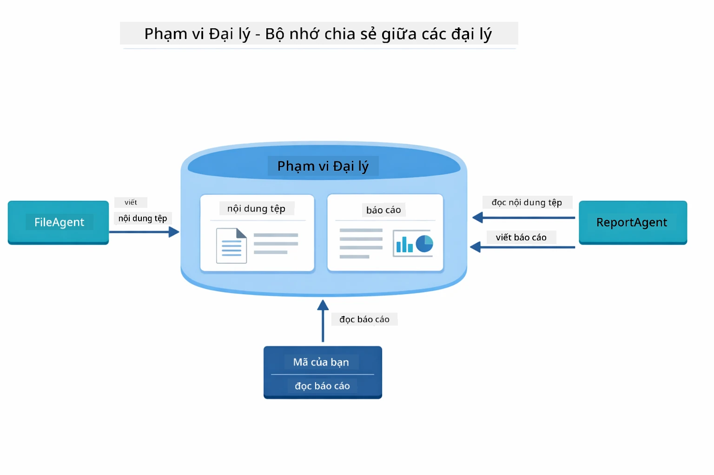

*Agentic Scope hoạt động như bộ nhớ dùng chung — FileAgent ghi `fileContent`, ReportAgent đọc và ghi `report`, mã của bạn đọc kết quả cuối cùng.*

```java
ResultWithAgenticScope<String> result = supervisor.invokeWithAgenticScope(request);
AgenticScope scope = result.agenticScope();
String fileContent = scope.readState("fileContent");  // Dữ liệu tệp thô từ FileAgent
String report = scope.readState("report");            // Báo cáo có cấu trúc từ ReportAgent
```

**Agent Listeners** cho phép giám sát và gỡ lỗi khi agent chạy. Đầu ra từng bước bạn thấy trong demo đến từ một AgentListener được gắn vào mỗi lần agent được gọi:
- **beforeAgentInvocation** - Gọi trước khi Supervisor chọn agent, giúp bạn thấy agent nào được chọn và lý do
- **afterAgentInvocation** - Gọi sau khi agent hoàn thành, hiện kết quả của agent
- **inheritedBySubagents** - Khi true, listener theo dõi tất cả agent trong hệ thống phân cấp

Sơ đồ dưới đây minh họa vòng đời đầy đủ của Agent Listener, gồm cách `onError` xử lý lỗi trong quá trình thực thi agent:

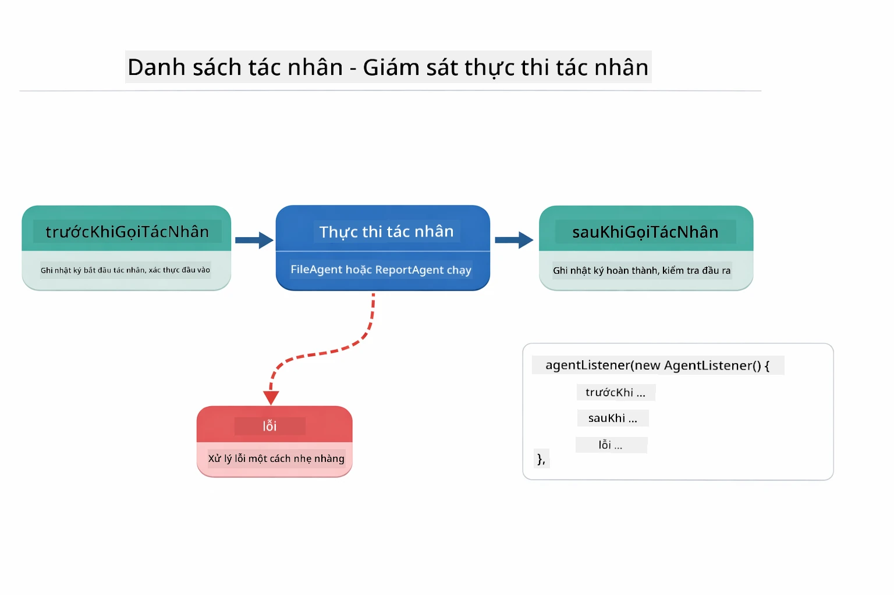

*Agent Listeners gắn vào vòng đời thực thi — giám sát khi agent bắt đầu, hoàn thành hoặc lỗi.*

```java
AgentListener monitor = new AgentListener() {
    private int step = 0;
    
    @Override
    public void beforeAgentInvocation(AgentRequest request) {
        step++;
        System.out.println("  +-- STEP " + step + ": " + request.agentName());
    }
    
    @Override
    public void afterAgentInvocation(AgentResponse response) {
        System.out.println("  +-- [OK] " + response.agentName() + " completed");
    }
    
    @Override
    public boolean inheritedBySubagents() {
        return true; // Lan truyền đến tất cả các đại lý phụ
    }
};
```

Ngoài mẫu Supervisor, module `langchain4j-agentic` cung cấp nhiều mẫu luồng công việc mạnh mẽ. Sơ đồ dưới đây thể hiện năm mẫu — từ pipeline tuần tự đơn giản đến luồng phê duyệt có tương tác người dùng:

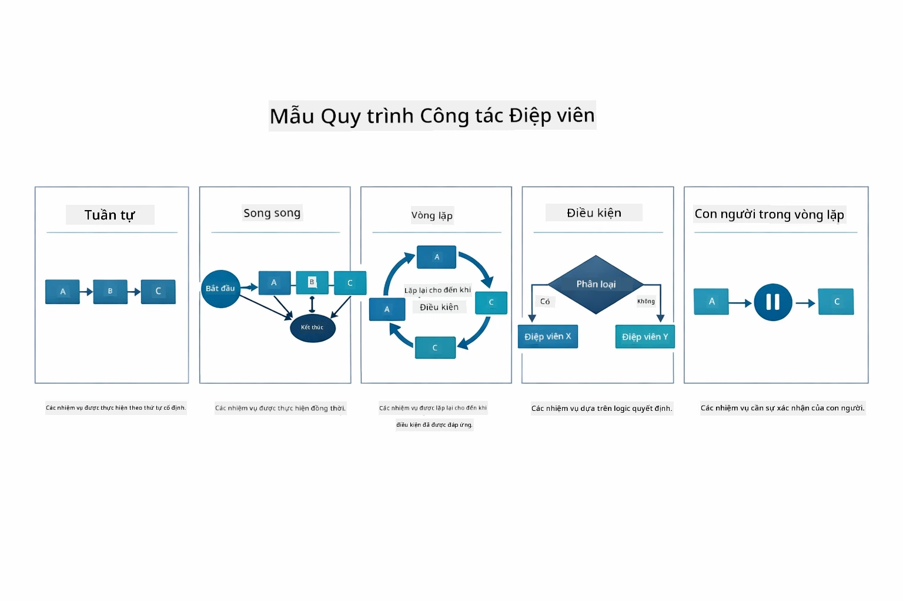

*Năm mẫu luồng công việc cho phối hợp agents — từ pipeline tuần tự đơn giản đến quy trình phê duyệt có người tham gia.*

| Mẫu | Mô tả | Trường hợp sử dụng |
|-----|-------|-------------------|
| **Sequential** | Thực thi agents theo thứ tự, đầu ra chảy sang bước tiếp theo | Pipeline: nghiên cứu → phân tích → báo cáo |
| **Parallel** | Chạy đồng thời các agents | Nhiệm vụ độc lập: thời tiết + tin tức + chứng khoán |
| **Loop** | Lặp lại cho đến khi điều kiện đạt | Đánh giá chất lượng: tinh chỉnh đến khi điểm ≥ 0.8 |
| **Conditional** | Định tuyến dựa trên điều kiện | Phân loại → chuyển đến agent chuyên môn |
| **Human-in-the-Loop** | Thêm các điểm kiểm tra con người | Quy trình phê duyệt, duyệt nội dung |

## Các Khái niệm Chính

Giờ bạn đã khám phá MCP và module agentic trong thực tế, hãy tóm tắt khi nào nên dùng từng cách tiếp cận.

Một trong những lợi thế lớn nhất của MCP là hệ sinh thái ngày càng phát triển. Hình dưới đây cho thấy giao thức phổ quát kết nối ứng dụng AI của bạn với nhiều server MCP khác nhau — từ truy cập filesystem, cơ sở dữ liệu đến GitHub, email, web scraping và hơn nữa:

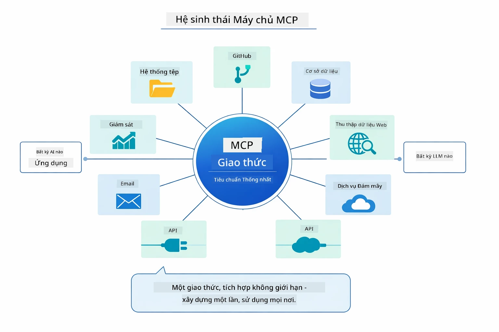

*MCP tạo ra hệ sinh thái giao thức phổ quát — bất kỳ server tương thích MCP nào đều làm việc với bất kỳ client tương thích MCP nào, cho phép chia sẻ công cụ giữa các ứng dụng.*

**MCP** lý tưởng khi bạn muốn tận dụng hệ sinh thái công cụ có sẵn, xây dựng công cụ để nhiều ứng dụng dùng chung, tích hợp dịch vụ bên thứ ba với giao thức chuẩn, hoặc thay thế công cụ mà không đổi mã nguồn.

**Module Agentic** phù hợp nhất khi bạn muốn định nghĩa agent theo kiểu khai báo với annotation `@Agent`, cần điều phối luồng công việc (tuần tự, vòng lặp, song song), thích thiết kế agent dựa trên interface thay vì code mệnh lệnh, hoặc kết hợp nhiều agent chia sẻ kết quả qua `outputKey`.

**Mẫu Supervisor Agent** nổi bật khi luồng công việc không thể đoán trước trước, và bạn muốn LLM quyết định, khi dùng nhiều agent chuyên biệt cần điều phối động, xây dựng hệ thống hội thoại định tuyến tới các khả năng khác nhau, hoặc khi bạn muốn hành vi agent linh hoạt, thích ứng nhất.

Để giúp bạn quyết định giữa các phương pháp `@Tool` tùy chỉnh từ Module 04 và công cụ MCP trong module này, bảng so sánh sau nêu bật các điểm khác biệt chính — công cụ tùy chỉnh cho logic app chặt chẽ và an toàn kiểu, trong khi công cụ MCP cung cấp tích hợp tiêu chuẩn, dùng lại được:

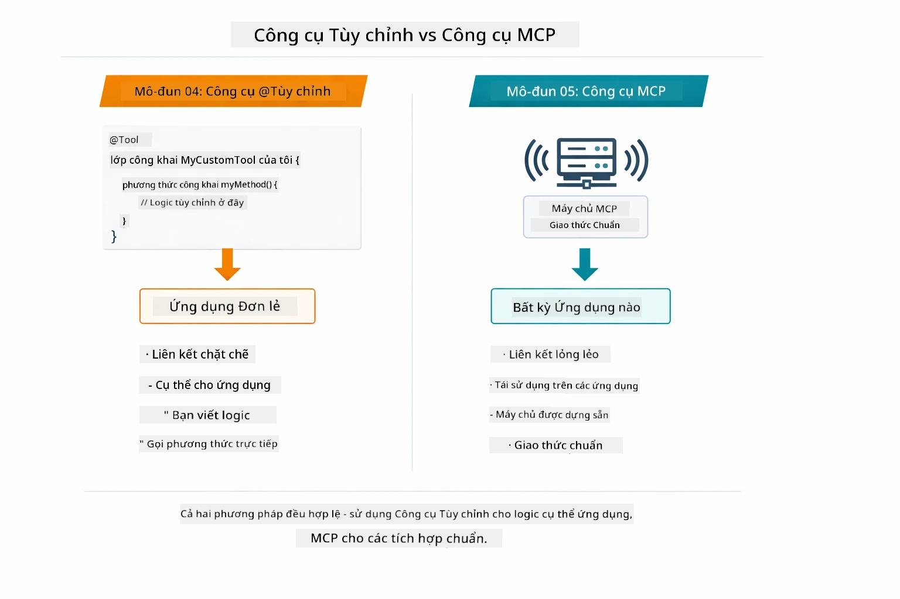

*Khi nào dùng phương pháp @Tool tùy chỉnh so với công cụ MCP — công cụ tùy chỉnh dành cho logic app riêng với an toàn kiểu đầy đủ, công cụ MCP cho tích hợp chuẩn dùng được across nhiều app.*

## Chúc mừng!

Bạn đã hoàn thành toàn bộ năm module của khóa học LangChain4j cho người mới bắt đầu! Đây là hành trình học tập đầy đủ bạn đã trải qua — từ hội thoại cơ bản đến hệ thống agentic sử dụng MCP:

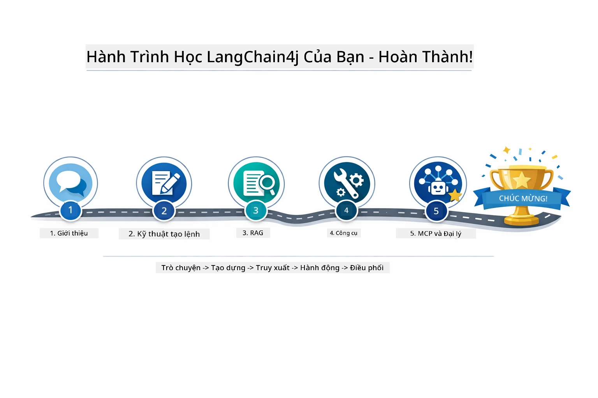

*Hành trình học tập của bạn qua năm module — từ hội thoại cơ bản đến hệ thống agentic dùng MCP.*

Bạn đã hoàn thành khóa LangChain4j cho người mới bắt đầu. Bạn đã học được:

- Cách xây dựng AI hội thoại có bộ nhớ (Module 01)
- Mẫu thiết kế prompt cho các nhiệm vụ khác nhau (Module 02)
- Dựa trên tài liệu để trả lời với RAG (Module 03)
- Tạo agent AI cơ bản (trợ lý) với công cụ tùy chỉnh (Module 04)
- Tích hợp công cụ tiêu chuẩn với LangChain4j MCP và module Agentic (Module 05)

### Tiếp theo là gì?

Sau khi hoàn thành các module, hãy khám phá [Hướng dẫn Kiểm thử](../docs/TESTING.md) để xem các khái niệm kiểm thử LangChain4j trong thực tế.

**Tài nguyên chính thức:**
- [Tài liệu LangChain4j](https://docs.langchain4j.dev/) - Hướng dẫn toàn diện và tham khảo API
- [GitHub LangChain4j](https://github.com/langchain4j/langchain4j) - Mã nguồn và ví dụ
- [Hướng dẫn học LangChain4j](https://docs.langchain4j.dev/tutorials/) - Hướng dẫn từng bước cho các trường hợp sử dụng khác nhau

Cảm ơn bạn đã hoàn thành khóa học này!

---

**Điều hướng:** [← Trước: Module 04 - Tools](../04-tools/README.md) | [Quay lại Trang Chính](../README.md)

---

<!-- CO-OP TRANSLATOR DISCLAIMER START -->
**Tuyên bố từ chối trách nhiệm**:  
Tài liệu này đã được dịch bằng dịch vụ dịch thuật AI [Co-op Translator](https://github.com/Azure/co-op-translator). Mặc dù chúng tôi cố gắng đảm bảo độ chính xác, xin lưu ý rằng bản dịch tự động có thể chứa lỗi hoặc không chính xác. Tài liệu gốc bằng ngôn ngữ gốc nên được xem là nguồn thông tin chính xác và có thẩm quyền. Đối với các thông tin quan trọng, nên sử dụng dịch vụ dịch thuật chuyên nghiệp do con người thực hiện. Chúng tôi không chịu trách nhiệm về bất kỳ sự hiểu lầm hay giải thích sai nào phát sinh từ việc sử dụng bản dịch này.
<!-- CO-OP TRANSLATOR DISCLAIMER END -->