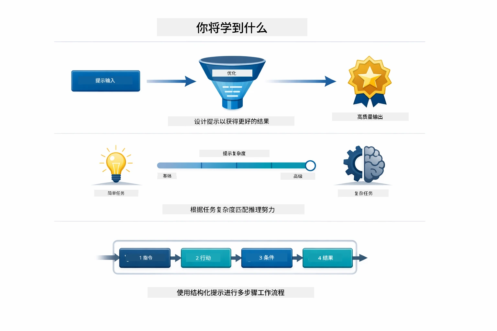
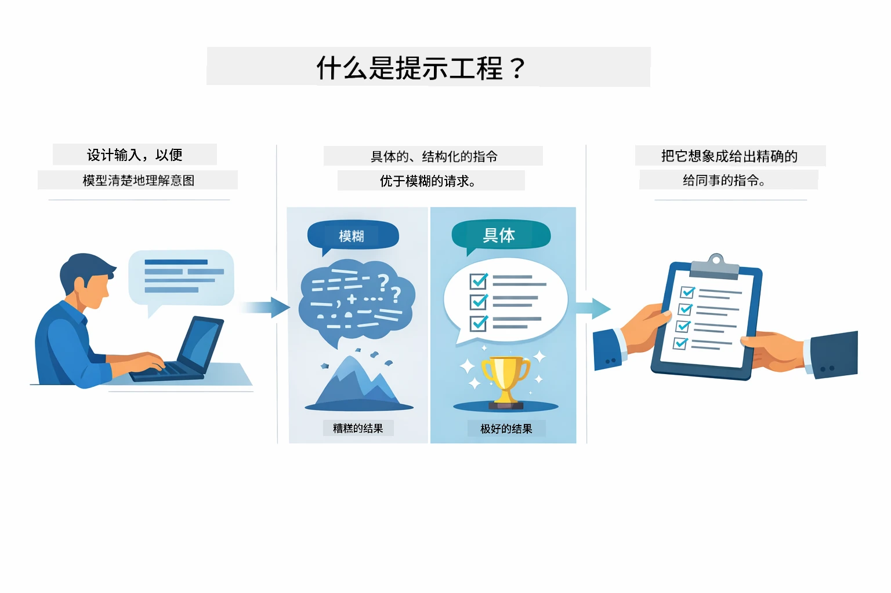
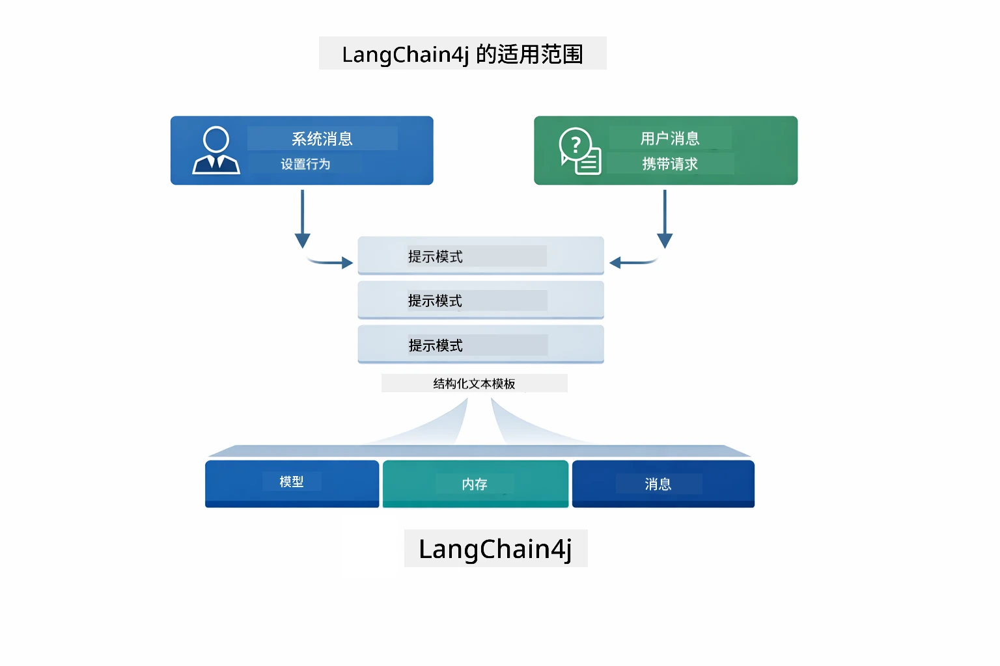
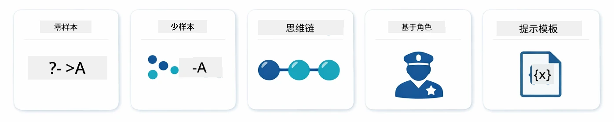
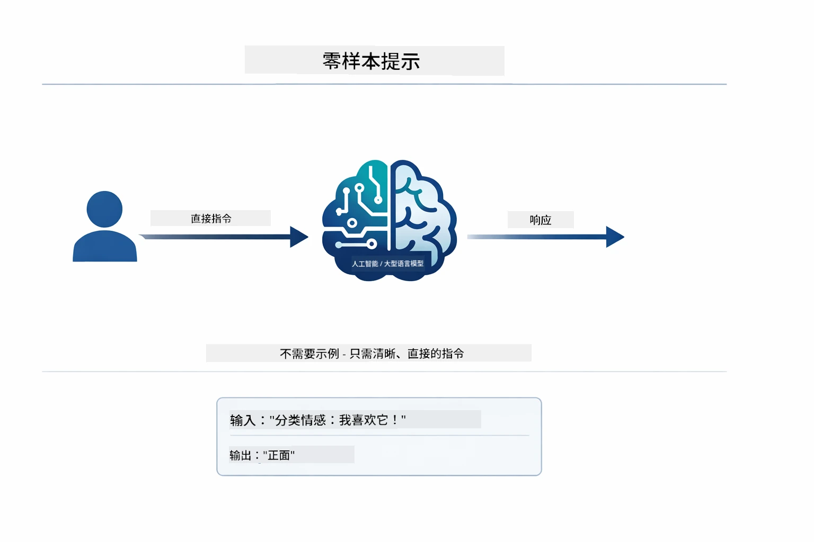
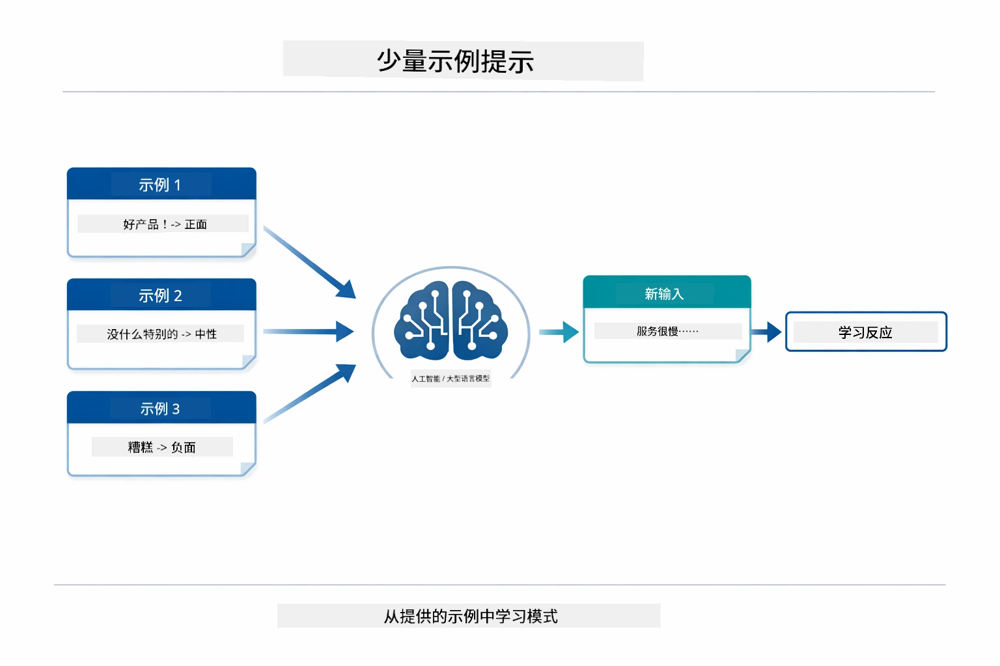
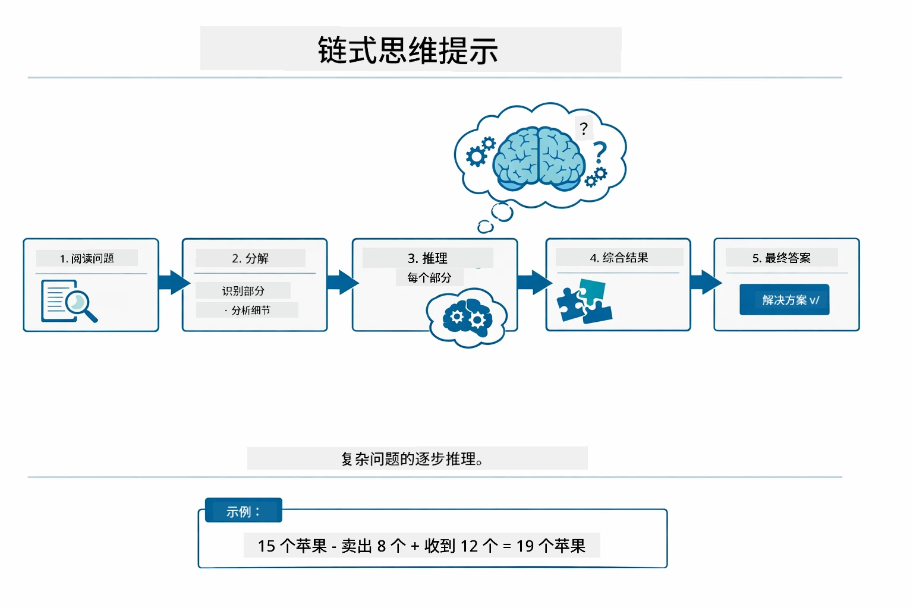
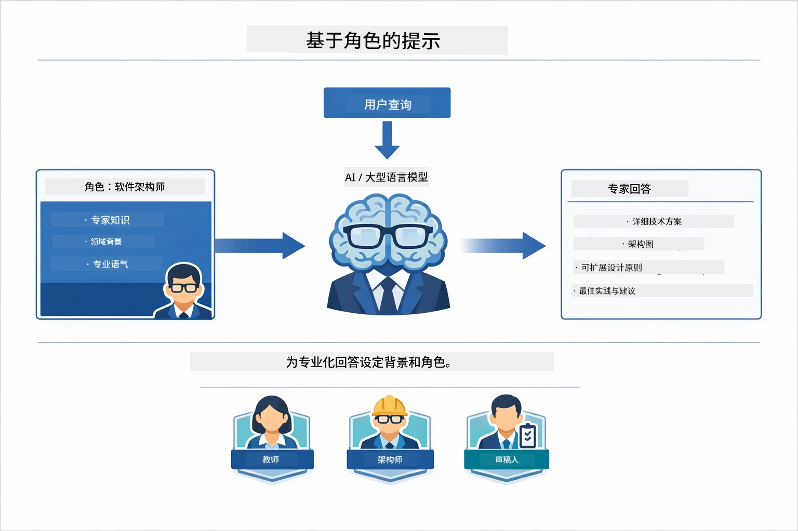
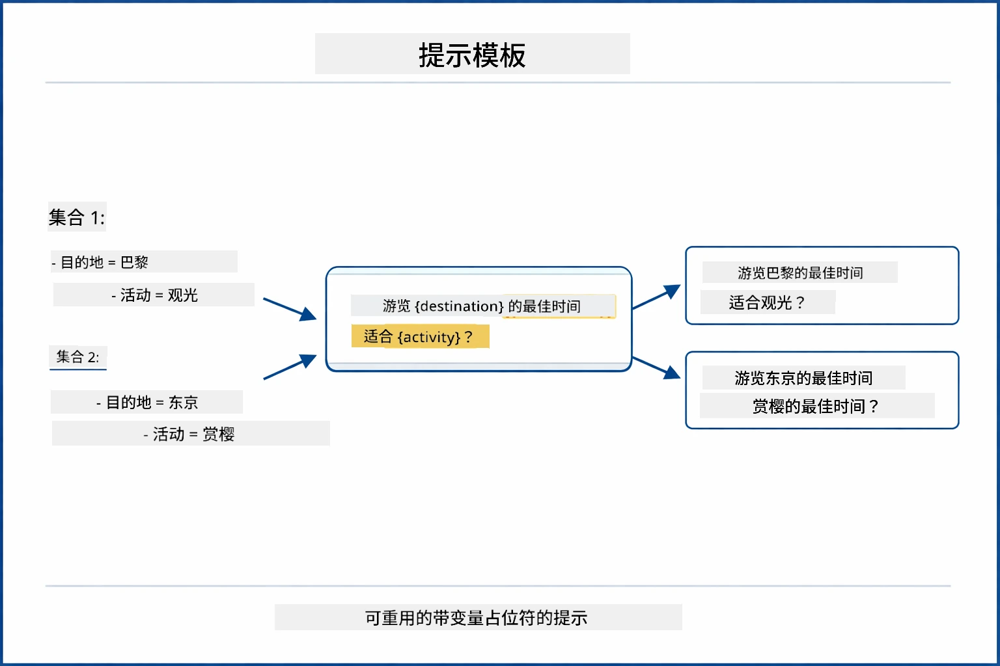
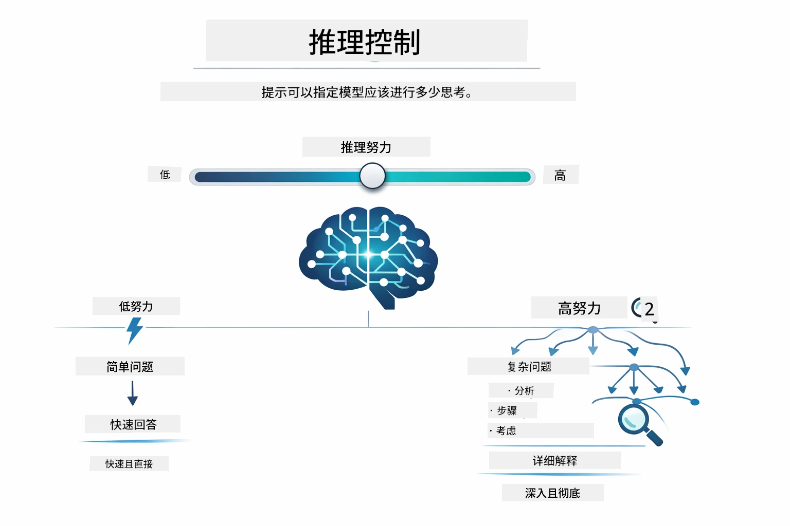

# 模块 02：使用 GPT-5.2 的提示工程

## 目录

- [视频演示](../../../02-prompt-engineering)
- [你将学到什么](../../../02-prompt-engineering)
- [先决条件](../../../02-prompt-engineering)
- [理解提示工程](../../../02-prompt-engineering)
- [提示工程基础](../../../02-prompt-engineering)
  - [零样本提示](../../../02-prompt-engineering)
  - [少样本提示](../../../02-prompt-engineering)
  - [思维链](../../../02-prompt-engineering)
  - [基于角色的提示](../../../02-prompt-engineering)
  - [提示模板](../../../02-prompt-engineering)
- [高级模式](../../../02-prompt-engineering)
- [运行应用程序](../../../02-prompt-engineering)
- [应用程序截图](../../../02-prompt-engineering)
- [探索模式](../../../02-prompt-engineering)
  - [低渴望 vs 高渴望](../../../02-prompt-engineering)
  - [任务执行（工具前言）](../../../02-prompt-engineering)
  - [自我反思代码](../../../02-prompt-engineering)
  - [结构化分析](../../../02-prompt-engineering)
  - [多轮对话](../../../02-prompt-engineering)
  - [逐步推理](../../../02-prompt-engineering)
  - [受限输出](../../../02-prompt-engineering)
- [你真正学到了什么](../../../02-prompt-engineering)
- [后续步骤](../../../02-prompt-engineering)

## 视频演示

观看这段直播课程，讲解如何开始本模块：

<a href="https://www.youtube.com/live/PJ6aBaE6bog?si=LDshyBrTRodP-wke"></a>

## 你将学到什么

下图概述了你将在本模块中掌握的关键主题和技能——从提示优化技巧到你将遵循的逐步工作流程。



在之前的模块中，你探索了 LangChain4j 与 GitHub 模型的基础交互，并看到内存如何借助 Azure OpenAI 实现对话式 AI。现在，我们将关注如何提问——也就是提示本身——使用 Azure OpenAI 的 GPT-5.2。你构造提示的方式会极大影响得到的回答质量。我们先回顾基础提示技术，然后深入八种高级模式，充分利用 GPT-5.2 的能力。

我们使用 GPT-5.2，是因为它引入了推理控制——你可以告诉模型在回答前需要思考多少。这让不同的提示策略更清晰，也帮助你理解何时使用哪种方法。相比 GitHub 模型，Azure 对 GPT-5.2 的调用限额也更宽松。

## 先决条件

- 已完成模块 01（部署 Azure OpenAI 资源）
- 根目录下的 `.env` 文件包含 Azure 凭据（由模块 01 中的 `azd up` 创建）

> **注意：** 如果你尚未完成模块 01，请先按照那里的部署说明操作。

## 理解提示工程

提示工程的核心，是模糊指令和精准指令之间的区别，下图对此进行了说明。



提示工程是设计输入文本，确保你持续获得所需结果。它不仅仅是提问——而是构造请求，让模型准确理解你想要什么以及如何交付。

把它想象成给同事下达指令。“修复 bug”很模糊。“通过添加空检查修复 UserService.java 第 45 行的空指针异常”则具体。语言模型的工作方式也是如此——具体和结构化很重要。

下图展示了 LangChain4j 在其中的角色——通过 SystemMessage 和 UserMessage 构建块，将你的提示模式连接到模型。



LangChain4j 提供基础架构——模型连接、内存和消息类型——而提示模式只是你通过这套架构传递的精心结构化文本。关键构建块是 `SystemMessage`（设置 AI 的行为和角色）和 `UserMessage`（承载你的实际请求）。

## 提示工程基础

下图展示的五种核心技术，构成了有效提示工程的基础。每种技术都解决你与语言模型交流的不同方面。



在深入本模块的高级模式前，我们先回顾五种基础提示技术。这些是每位提示工程师都应该了解的构建模块。如果你已经完成了[快速入门模块](../00-quick-start/README.md#2-prompt-patterns)，你会在实践中见过这些——以下是它们背后的概念框架。

### 零样本提示

最简单的方法：给模型直接指令，无需示例。模型完全依赖其训练去理解并执行任务。适合预期行为明显的简单请求。



*无示例的直接指令——模型仅从指令本身推断任务*

```java
String prompt = "Classify this sentiment: 'I absolutely loved the movie!'";
String response = model.chat(prompt);
// 响应：“积极”
```

**何时使用：** 简单分类、直接提问、翻译，或任何模型无需额外指导即可完成的任务。

### 少样本提示

提供示例，展示你期望模型遵循的模式。模型从示例中学习输入-输出格式，并应用到新输入上。大幅提升了那些所需格式或行为不明显任务的一致性。



*通过示例学习——模型识别模式并应用到新输入*

```java
String prompt = """
    Classify the sentiment as positive, negative, or neutral.
    
    Examples:
    Text: "This product exceeded my expectations!" → Positive
    Text: "It's okay, nothing special." → Neutral
    Text: "Waste of money, very disappointed." → Negative
    
    Now classify this:
    Text: "Best purchase I've made all year!"
    """;
String response = model.chat(prompt);
```

**何时使用：** 定制分类、一致格式、领域特定任务，或零样本结果不稳定时。

### 思维链

让模型逐步展示其推理过程。模型不是直接给出答案，而是分解问题，明确每一步推理。提升数学、逻辑和多步骤推理任务的准确率。



*逐步推理——将复杂问题拆解成明确的逻辑步骤*

```java
String prompt = """
    Problem: A store has 15 apples. They sell 8 apples and then 
    receive a shipment of 12 more apples. How many apples do they have now?
    
    Let's solve this step-by-step:
    """;
String response = model.chat(prompt);
// 模型显示：15 - 8 = 7，然后 7 + 12 = 19 个苹果
```

**何时使用：** 数学题、逻辑难题、调试，或任何展示推理过程能提升准确率和可信度的任务。

### 基于角色的提示

在提问前为 AI 设定一个身份或角色。这样提供了上下文，影响回答的语气、深度和重点。“软件架构师”给出的建议会与“初级开发者”或“安全审计员”不同。



*设置上下文和角色——同一问题根据指定角色得到不同回答*

```java
String prompt = """
    You are an experienced software architect reviewing code.
    Provide a brief code review for this function:
    
    def calculate_total(items):
        total = 0
        for item in items:
            total = total + item['price']
        return total
    """;
String response = model.chat(prompt);
```

**何时使用：** 代码审查、辅导、领域特定分析，或需要针对特定专业水平或视角定制回答时。

### 提示模板

创建带变量占位符的可重用提示。不必每次写新提示，定义好模板后填入不同数值。LangChain4j 的 `PromptTemplate` 类使用 `{{variable}}` 语法，操作简便。



*带变量占位符的可重用提示——一个模板，多种用法*

```java
PromptTemplate template = PromptTemplate.from(
    "What's the best time to visit {{destination}} for {{activity}}?"
);

Prompt prompt = template.apply(Map.of(
    "destination", "Paris",
    "activity", "sightseeing"
));

String response = model.chat(prompt.text());
```

**何时使用：** 不同输入的重复查询、批量处理、构建可复用 AI 工作流，或任何提示结构固定但数据变化的场景。

---

这五种基础技术为你大多数提示任务提供了坚实工具包。本模块接下来的内容，将基于它们展开**八种高级模式**，利用 GPT-5.2 的推理控制、自我评估和结构化输出能力。

## 高级模式

基础内容讲完，让我们进入本模块独特的八种高级模式。不是所有问题都适合同一种方法。有些问题需要快速回答，有些则需要深入思考。有些需要展示推理过程，有些只要结果。下图中每个模式针对不同场景进行了优化——而 GPT-5.2 的推理控制让这些差异更加显著。


*八种提示工程模式及其应用场景概览*

GPT-5.2 为这些模式增加了另一个维度：*推理控制*。下方滑块展示你如何调节模型的思考深度——从快速直接回答到深入彻底分析。



*GPT-5.2 的推理控制允许你指定模型应进行多少思考——从快捷直接到深度探索*

**低渴望（快速且聚焦）** - 适合简单问题，快速直接回答。模型推理步骤极少，最多 2 步。用于计算、查阅或直接问题。

```java
String prompt = """
    <context_gathering>
    - Search depth: very low
    - Bias strongly towards providing a correct answer as quickly as possible
    - Usually, this means an absolute maximum of 2 reasoning steps
    - If you think you need more time, state what you know and what's uncertain
    </context_gathering>
    
    Problem: What is 15% of 200?
    
    Provide your answer:
    """;

String response = chatModel.chat(prompt);
```

> 💡 **可用 GitHub Copilot 探索：** 打开 [`Gpt5PromptService.java`](../../../02-prompt-engineering/src/main/java/com/example/langchain4j/prompts/service/Gpt5PromptService.java)，尝试提问：
> - “低渴望与高渴望提示模式有何区别？”
> - “提示中的 XML 标签如何帮助构造 AI 回答？”
> - “何时使用自我反思模式，何时直接指令？”

**高渴望（深入且彻底）** - 针对复杂问题，给予全面分析。模型深入探索，展现详细推理。适用于系统设计、架构决策或复杂研究。

```java
String prompt = """
    Analyze this problem thoroughly and provide a comprehensive solution.
    Consider multiple approaches, trade-offs, and important details.
    Show your analysis and reasoning in your response.
    
    Problem: Design a caching strategy for a high-traffic REST API.
    """;

String response = chatModel.chat(prompt);
```

**任务执行（逐步进展）** - 适合多步骤工作流。模型先给出计划，执行时逐步叙述过程，最后总结。用于迁移、实现或任意多步骤进程。

```java
String prompt = """
    <task_execution>
    1. First, briefly restate the user's goal in a friendly way
    
    2. Create a step-by-step plan:
       - List all steps needed
       - Identify potential challenges
       - Outline success criteria
    
    3. Execute each step:
       - Narrate what you're doing
       - Show progress clearly
       - Handle any issues that arise
    
    4. Summarize:
       - What was completed
       - Any important notes
       - Next steps if applicable
    </task_execution>
    
    <tool_preambles>
    - Always begin by rephrasing the user's goal clearly
    - Outline your plan before executing
    - Narrate each step as you go
    - Finish with a distinct summary
    </tool_preambles>
    
    Task: Create a REST endpoint for user registration
    
    Begin execution:
    """;

String response = chatModel.chat(prompt);
```

思维链提示明确要求模型展示推理过程，提高复杂任务准确率。逐步拆解有助于人类和 AI 理解逻辑。

> **🤖 可用 [GitHub Copilot](https://github.com/features/copilot) 聊天尝试提问：**
> - “如何改造任务执行模式支持长时间运行操作？”
> - “在生产应用中安排工具前言的最佳实践是什么？”
> - “如何捕获并在 UI 中显示中间进展更新？”

下图展示了此计划 → 执行 → 总结的工作流程。


*多步骤任务的计划 → 执行 → 总结工作流程*

**自我反思代码** - 生成生产级代码。模型生成符合生产标准、具备适当错误处理的代码。用于构建新功能或服务。

```java
String prompt = """
    Generate Java code with production-quality standards: Create an email validation service
    Keep it simple and include basic error handling.
    """;

String response = chatModel.chat(prompt);
```

下图展示了此迭代改进循环——生成、评估、识别缺陷、完善，直到代码达到生产标准。


*迭代改进循环——生成、评估、识别问题、改进、重复*

**结构化分析** - 进行一致的评估。模型使用固定框架评审代码（包括正确性、实践、性能、安全性、可维护性）。适合代码审查或质量评估。

```java
String prompt = """
    <analysis_framework>
    You are an expert code reviewer. Analyze the code for:
    
    1. Correctness
       - Does it work as intended?
       - Are there logical errors?
    
    2. Best Practices
       - Follows language conventions?
       - Appropriate design patterns?
    
    3. Performance
       - Any inefficiencies?
       - Scalability concerns?
    
    4. Security
       - Potential vulnerabilities?
       - Input validation?
    
    5. Maintainability
       - Code clarity?
       - Documentation?
    
    <output_format>
    Provide your analysis in this structure:
    - Summary: One-sentence overall assessment
    - Strengths: 2-3 positive points
    - Issues: List any problems found with severity (High/Medium/Low)
    - Recommendations: Specific improvements
    </output_format>
    </analysis_framework>
    
    Code to analyze:
    ```
    public List getUsers() {
        return database.query("SELECT * FROM users");
    }
    ```
    Provide your structured analysis:
    """;

String response = chatModel.chat(prompt);
```

> **🤖 可用 [GitHub Copilot](https://github.com/features/copilot) 聊天尝试提问：**
> - “如何为不同类型的代码审查自定义分析框架？”
> - “如何以编程方式解析并处理结构化输出？”
> - “如何确保不同审查会话中的严重性等级一致？”

下图展示该结构化框架如何将代码审查组织成一致类别，并附带严重等级。


*带严重等级的代码审查一致性框架*

**多轮对话** - 适合需要上下文的对话。模型记忆之前消息并在此基础上构建。用于交互式帮助会话或复杂问答。

```java
ChatMemory memory = MessageWindowChatMemory.withMaxMessages(10);

memory.add(UserMessage.from("What is Spring Boot?"));
AiMessage aiMessage1 = chatModel.chat(memory.messages()).aiMessage();
memory.add(aiMessage1);

memory.add(UserMessage.from("Show me an example"));
AiMessage aiMessage2 = chatModel.chat(memory.messages()).aiMessage();
memory.add(aiMessage2);
```

下图可视化了对话上下文如何随着多轮累积，以及它与模型令牌限制的关系。


*对话上下文如何随多轮累积，直至达到令牌上限*
**逐步推理** - 适用于需要显示逻辑的问题。模型展示每一步的明确推理。用于数学题、逻辑谜题或需要理解思考过程的场景。

```java
String prompt = """
    <instruction>Show your reasoning step-by-step</instruction>
    
    If a train travels 120 km in 2 hours, then stops for 30 minutes,
    then travels another 90 km in 1.5 hours, what is the average speed
    for the entire journey including the stop?
    """;

String response = chatModel.chat(prompt);
```
  
下图展示模型如何将问题分解为明确且编号的逻辑步骤。


*将问题分解为明确的逻辑步骤*

**受限输出** - 适用于对格式有具体要求的回答。模型严格遵守格式和长度规则。用于摘要或需要精确输出结构的场景。

```java
String prompt = """
    <constraints>
    - Exactly 100 words
    - Bullet point format
    - Technical terms only
    </constraints>
    
    Summarize the key concepts of machine learning.
    """;

String response = chatModel.chat(prompt);
```
  
下图展示约束如何指导模型产出严格符合格式和长度要求的输出。


*强制执行特定格式、长度和结构要求*

## 运行应用程序

**验证部署：**

确保根目录下存在包含 Azure 凭据的 `.env` 文件（在模块 01 中创建）。在模块目录（`02-prompt-engineering/`）中运行：

**Bash：**  
```bash
cat ../.env  # 应显示 AZURE_OPENAI_ENDPOINT、API_KEY、DEPLOYMENT
```
  
**PowerShell：**  
```powershell
Get-Content ..\.env  # 应该显示 AZURE_OPENAI_ENDPOINT、API_KEY、DEPLOYMENT
```
  
**启动应用程序：**

> **注意：** 如果你已使用根目录中的 `./start-all.sh` 启动了所有应用（如模块 01 所述），则本模块已经在端口 8083 运行。可以跳过下面的启动命令，直接访问 http://localhost:8083。

**选项 1：使用 Spring Boot Dashboard（推荐 VS Code 用户）**

开发容器包含 Spring Boot Dashboard 扩展，为管理所有 Spring Boot 应用程序提供可视化界面。可在 VS Code 左侧活动栏找到（Spring Boot 图标）。

通过 Spring Boot Dashboard，你可以：  
- 查看工作区内所有可用的 Spring Boot 应用  
- 一键启动/停止应用  
- 实时查看应用日志  
- 监控应用状态

只需点击 "prompt-engineering" 旁的播放按钮启动此模块，或一次性启动所有模块。


*VS Code 中的 Spring Boot Dashboard — 一处启动、停止并监控所有模块*

**选项 2：使用 shell 脚本**

启动所有 Web 应用（模块 01-04）：

**Bash：**  
```bash
cd ..  # 从根目录
./start-all.sh
```
  
**PowerShell：**  
```powershell
cd ..  # 从根目录
.\start-all.ps1
```
  
或仅启动此模块：

**Bash：**  
```bash
cd 02-prompt-engineering
./start.sh
```
  
**PowerShell：**  
```powershell
cd 02-prompt-engineering
.\start.ps1
```
  
两个脚本会自动从根目录 `.env` 文件加载环境变量，且如果 JAR 文件不存在会自动构建。

> **注意：** 如果你更倾向于先手动构建所有模块再启动：
>
> **Bash：**  
> ```bash
> cd ..  # Go to root directory
> mvn clean package -DskipTests
> ```
  
> **PowerShell：**  
> ```powershell
> cd ..  # Go to root directory
> mvn clean package -DskipTests
> ```
  
在浏览器中打开 http://localhost:8083。

**停止操作：**

**Bash：**  
```bash
./stop.sh  # 仅此模块
# 或
cd .. && ./stop-all.sh  # 所有模块
```
  
**PowerShell：**  
```powershell
.\stop.ps1  # 仅此模块
# 或
cd ..; .\stop-all.ps1  # 所有模块
```
  
## 应用截图

这是提示工程模块的主界面，你可以在这里并排试验全部八种模式。


*主仪表盘展示全部8种提示工程模式及其特性和用例*

## 探索模式

Web 界面允许你试验不同提示策略。每种模式解决不同问题——试试它们，看看每种方法何时表现最佳。

> **注意：流式与非流式** — 每个模式页面均提供两个按钮：**🔴 流式响应（实时）** 和 **非流式** 选项。流式使用服务端事件（SSE）实时显示模型生成的标记，能即时看到进展。非流式则等待服务器返回完整响应才显示。对于需要深入推理的提示（如高渴望、自我反思代码），非流式调用可能耗时很长——有时达到几分钟，且无任何可见反馈。**实验复杂提示时建议使用流式**，这样能实时观看模型工作，避免误以为请求超时。  
>  
> **浏览器要求** — 流式功能使用 Fetch Streams API（`response.body.getReader()`），需要完整浏览器支持（Chrome、Edge、Firefox、Safari）。VS Code 内置的 Simple Browser 不支持此 API，因其 WebView 不支持 ReadableStream API。使用 Simple Browser 时非流式按钮正常，唯独流式按钮无效。建议在外部浏览器打开 `http://localhost:8083` 以获得完整体验。

### 低渴望 vs 高渴望

用低渴望试问简单问题如 “200 的 15% 是多少？”你会得到一个即时的直接答案。用高渴望试问复杂问题如 “为高流量 API 设计缓存策略”，点击 **🔴 流式响应（实时）**，你会看到模型逐字逐句给出详细推理。同样的模型、相同的问题结构，不同的是提示告诉它思考多少。

### 任务执行（工具前言）

多步骤工作流受益于事先规划和过程解说。模型概述它将做什么，讲述每一步，最终总结结果。

### 自我反思代码

试试 “创建一个邮件验证服务”。模型不会仅生成代码后停止，而是会生成、根据质量标准评估、识别缺陷并改进。你会看到它反复迭代直到代码符合生产标准。

### 结构化分析

代码评审需要统一的评估框架。模型使用固定类别（正确性、实践、性能、安全）和严重等级分析代码。

### 多轮聊天

问 “什么是 Spring Boot？”然后立刻跟进 “给我个例子”。模型记住你的第一个问题，专门给你一个 Spring Boot 示例。若无记忆，第二个问题太模糊无法准确回答。

### 逐步推理

选一个数学题，用逐步推理和低渴望两种模式试试。低渴望直接给答案——快但不透明。逐步推理则展示每个计算和决策。

### 受限输出

需要特定格式或字数时，此模式确保严格遵守。尝试产出一个精确 100 字且使用项目符号的摘要。

## 你真正学到的是什么

**推理努力决定一切**

GPT-5.2 允许你通过提示控制计算努力。低努力意味着快速响应且探索少。高努力意味着模型花时间深入思考。你学会了匹配努力程度与任务复杂度——简单问题不浪费时间，复杂决策也不草率。

**结构引导行为**

注意提示中的 XML 标签？它们不是装饰。模型比随意文本更可靠地遵循结构化指令。当你需要多步流程或复杂逻辑时，结构帮助模型跟踪位置和后续步骤。下图分解了一个结构良好的提示，显示 `<system>`、`<instructions>`、`<context>`、`<user-input>` 和 `<constraints>` 等标签如何将指令组织成清晰部分。


*一个结构良好的提示剖析，包含清晰分区和 XML 风格组织*

**通过自我评估提升质量**

自我反思模式通过将质量标准显式化实现。这不是靠“希望模型做对”，而是明确告诉模型“正确”意味着什么：逻辑正确、错误处理、性能、安全等。模型随后自我评估产出并改进。代码生成由此从彩票变过程。

**上下文是有限的**

多轮对话通过在每次请求中包含消息历史实现。但有最大令牌数限制。随着对话增长，你需要策略保持相关上下文而不超限。本模块展示记忆机制；后续你将学习何时总结、何时遗忘、何时检索。

## 下一步

**下一个模块：** [03-rag - RAG（检索增强生成）](../03-rag/README.md)

---

**导航：** [← 上一模块：模块 01 - 介绍](../01-introduction/README.md) | [返回主目录](../README.md) | [下一模块：模块 03 - RAG →](../03-rag/README.md)

---

<!-- CO-OP TRANSLATOR DISCLAIMER START -->
**免责声明**：  
本文件由AI翻译服务【Co-op Translator】（https://github.com/Azure/co-op-translator）翻译而成。尽管我们力求准确，但请注意自动翻译可能存在错误或不准确之处。原始文档的原语言版本应视为权威来源。对于关键信息，建议采用专业人工翻译。因使用本翻译内容而产生的任何误解或误释，我们概不负责。
<!-- CO-OP TRANSLATOR DISCLAIMER END -->