# Module 03: RAG（检索增强生成）

## 目录

- [视频演示](../../../03-rag)
- [你将学到什么](../../../03-rag)
- [前置条件](../../../03-rag)
- [理解 RAG](../../../03-rag)
  - [本教程使用哪种 RAG 方法？](../../../03-rag)
- [工作原理](../../../03-rag)
  - [文档处理](../../../03-rag)
  - [创建嵌入](../../../03-rag)
  - [语义搜索](../../../03-rag)
  - [答案生成](../../../03-rag)
- [运行应用程序](../../../03-rag)
- [使用应用程序](../../../03-rag)
  - [上传文档](../../../03-rag)
  - [提问](../../../03-rag)
  - [查看来源参考](../../../03-rag)
  - [实验问题](../../../03-rag)
- [关键概念](../../../03-rag)
  - [分块策略](../../../03-rag)
  - [相似度评分](../../../03-rag)
  - [内存存储](../../../03-rag)
  - [上下文窗口管理](../../../03-rag)
- [RAG 何时重要](../../../03-rag)
- [下一步](../../../03-rag)

## 视频演示

观看本直播课程，了解如何开始本模块：

<a href="https://www.youtube.com/watch?v=_olq75ZH_eY"></a>

## 你将学到什么

在前面的模块中，你学习了如何与 AI 对话以及如何有效构建提示。但有一个根本限制：语言模型只知道它们训练时学到的内容。它们无法回答关于你公司政策、项目文档或其他未经过训练的信息的问题。

RAG（检索增强生成）解决了这个问题。它不是试图教会模型你的信息（既昂贵又不现实），而是赋予它在你的文档中搜索的能力。当有人提问时，系统会找到相关信息并将其包含进提示中。模型随后根据检索到的上下文进行回答。

把 RAG 想象成给模型提供了一个参考图书馆。当你提问时，系统：

1. **用户查询** - 你提出问题  
2. **嵌入** - 将你的问题转换为向量  
3. **向量搜索** - 找到相似的文档分块  
4. **上下文组装** - 将相关分块加入提示  
5. **响应** - LLM 基于上下文生成答案  

这使模型的回答基于你的实际数据，而不是依赖其训练知识或杜撰答案。

## 前置条件

- 完成 [Module 00 - 快速入门](../00-quick-start/README.md)（为本模块后面引用的 Easy RAG 示例做准备）
- 完成 [Module 01 - 介绍](../01-introduction/README.md)（已经部署 Azure OpenAI 资源，包括 `text-embedding-3-small` 嵌入模型）
- 项目根目录下有 `.env` 文件，包含 Azure 认证（由 Module 01 中的 `azd up` 命令创建）

> **注意：** 如果你还没有完成 Module 01，请先按照模块中的部署说明操作。`azd up` 命令会部署 GPT 聊天模型和本模块使用的嵌入模型。

## 理解 RAG

下图展示了核心概念：RAG 不仅仅依赖模型的训练数据，而是给它一个你的文档参考库，允许在生成每个答案之前先查阅。

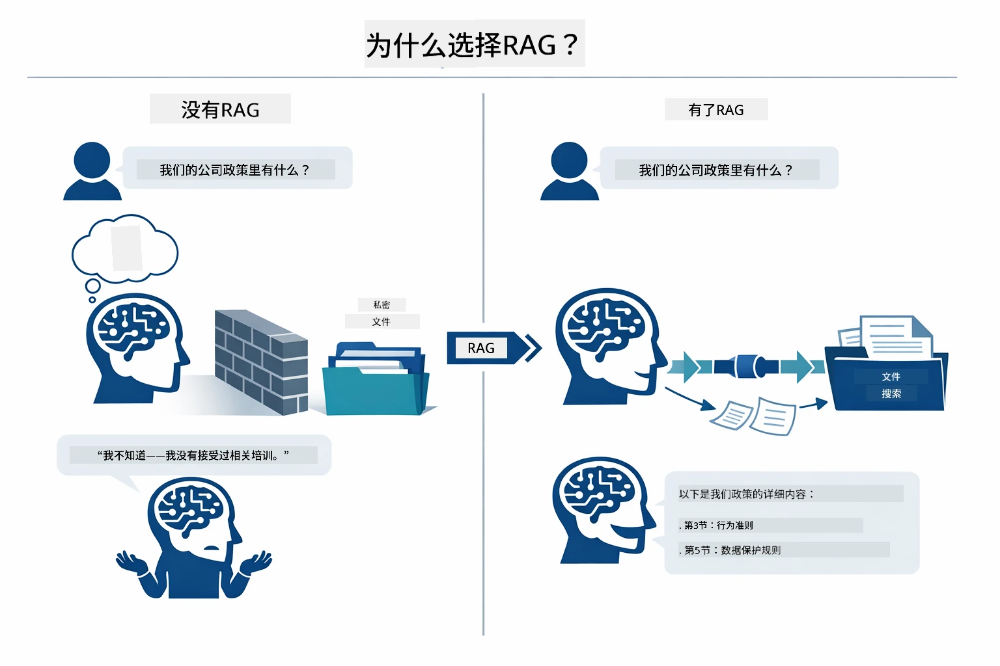

*该图展示了标准 LLM（根据训练数据猜测）与 RAG 增强 LLM（优先使用你的文档进行检索）之间的区别。*

以下是端到端的流程。用户提问经历四个阶段——嵌入、向量搜索、上下文组装和答案生成——每个阶段都建立在之前的基础上：


*该图显示了端到端的 RAG 流程——用户查询经过嵌入、向量搜索、上下文组装和答案生成。*

本模块接下来会详细介绍各个阶段，并带有可执行和修改的代码。

### 本教程使用哪种 RAG 方法？

LangChain4j 提供了三种实现 RAG 的方式，每种抽象级别不同。下图并列对比了这三种方法：

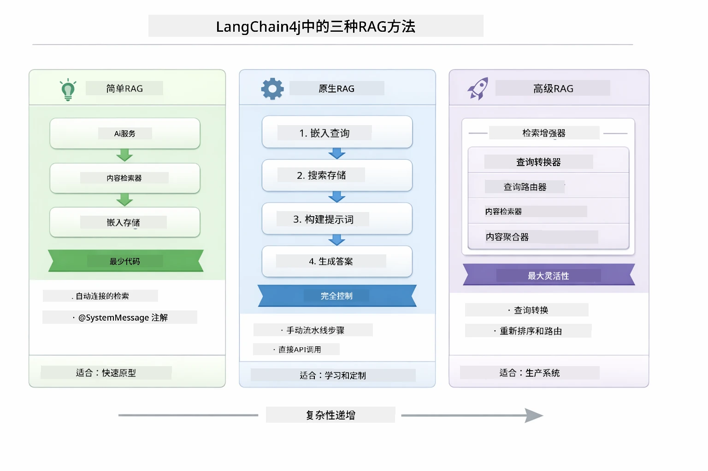

*该图比较了 LangChain4j 的三种 RAG 方法——Easy、Native 和 Advanced，展示它们的关键组件及适用场合。*

| 方法 | 功能 | 权衡 |
|---|---|---|
| **Easy RAG** | 通过 `AiServices` 和 `ContentRetriever` 自动连接所有流程。你只需给接口注解，挂载检索器，LangChain4j 会自动处理嵌入、搜索和提示组装。 | 代码量最小，但每个步骤的细节不可见。 |
| **Native RAG** | 你自己调用嵌入模型、搜索存储、构建提示和生成答案——逐步显式完成。 | 代码更多，但每个阶段都清晰且可修改。 |
| **Advanced RAG** | 利用 `RetrievalAugmentor` 框架，支持可插拔的查询转换器、路由器、重排序器和内容注入器，适合生产级流水线。 | 灵活性最大，但复杂度显著增加。 |

**本教程采用 Native 方法。** RAG 流程的每一步——查询嵌入、向量库搜索、上下文组装与答案生成——都在 [`RagService.java`](../../../03-rag/src/main/java/com/example/langchain4j/rag/service/RagService.java) 中明确写出。这是有意为之：作为学习资源，看到和理解每个阶段比代码最简更重要。熟悉了流程后，你可以转向 Easy RAG 快速原型或 Advanced RAG 用于生产系统。

> **💡 之前见过 Easy RAG 吗？** [快速入门模块](../00-quick-start/README.md) 包含一个文档问答示例（[`SimpleReaderDemo.java`](../../../00-quick-start/src/main/java/com/example/langchain4j/quickstart/SimpleReaderDemo.java)），用的是 Easy RAG 方法——LangChain4j 会自动处理嵌入、搜索和提示组装。本模块则拆解流水线，让你自己实现和控制每个阶段。

下图显示快速入门示例中的 Easy RAG 流程。你会注意到 `AiServices` 和 `EmbeddingStoreContentRetriever` 隐藏了所有复杂细节——加载文档，挂上检索器，就能得到答案。本模块的 Native 方法则把这背后的步骤拆开：

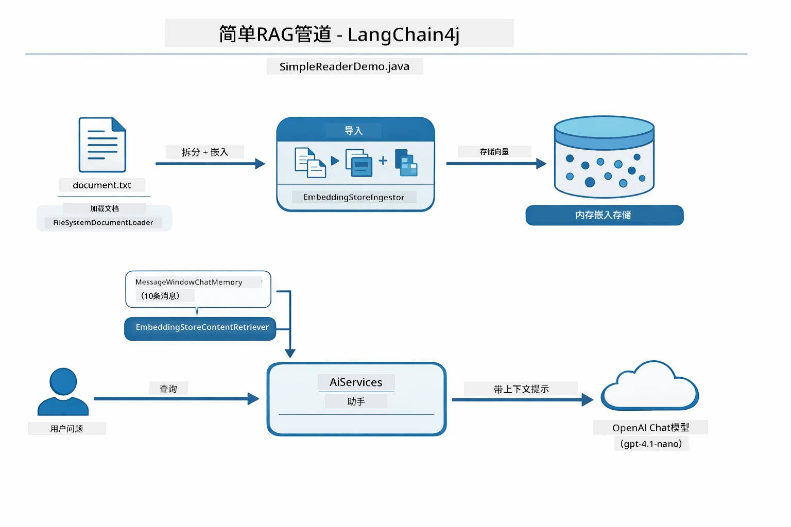

*该图展示了 `SimpleReaderDemo.java` 中的 Easy RAG 流程。相比本模块的 Native 方法：Easy RAG 把嵌入、检索和提示组装藏于 `AiServices` 和 `ContentRetriever` 背后——你只需加载文档、挂检索器、获得答案。Native 方法则拆开这些步骤，让你自己调用（嵌入、搜索、组装上下文、生成），全流程可见和可控。*

## 工作原理

本模块的 RAG 流程分成四个依次运行的阶段，每当用户提问时触发。首先，上传文档会被**解析和分块**成可管理的小片段。然后将这些分块转换成**向量嵌入**并存储，便于数学上比较。查询到来时，系统进行**语义搜索**，寻找最相关的分块，最终将它们作为上下文传给 LLM，以实现**答案生成**。下面各节配合代码和图示详细讲解每个阶段。先看第一步。

### 文档处理

[DocumentService.java](../../../03-rag/src/main/java/com/example/langchain4j/rag/service/DocumentService.java)

当你上传文档（PDF 或纯文本），系统会解析文件，附加包含文件名等的元数据，然后拆成分块——更小的片段，大小适合模型上下文窗口。这些分块间略微重叠，避免边界处丢失上下文。

```java
// 解析上传的文件并将其包装在 LangChain4j 文档中
Document document = Document.from(content, metadata);

// 拆分成300令牌的块，每块重叠30令牌
DocumentSplitter splitter = DocumentSplitters
    .recursive(300, 30);

List<TextSegment> segments = splitter.split(document);
```
  
下图直观展示工作流程。注意每个分块与邻近分块共享部分令牌——30 令牌重叠，确保不会在分块边界丢失重要上下文：

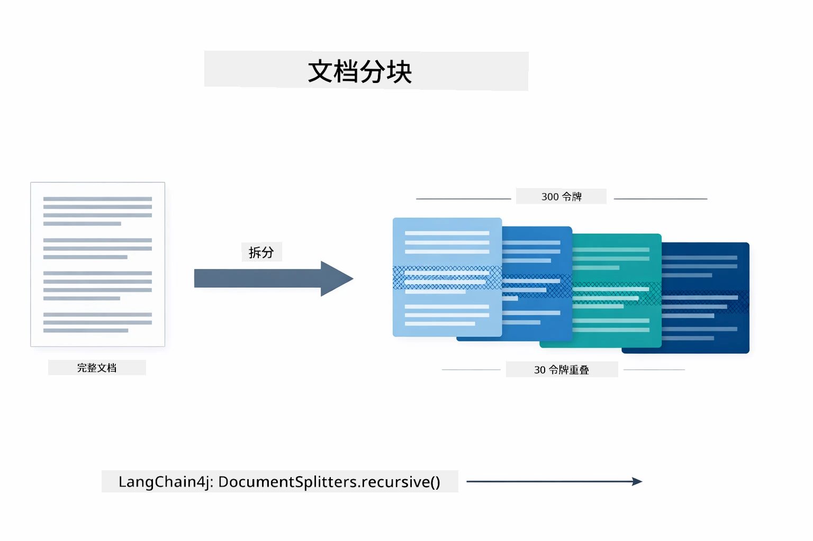

*该图展示文档被拆分成 300 令牌的分块，分块间有 30 令牌重叠，保证分块边界上下文完整。*

> **🤖 试试用 [GitHub Copilot](https://github.com/features/copilot) Chat:** 打开 [`DocumentService.java`](../../../03-rag/src/main/java/com/example/langchain4j/rag/service/DocumentService.java) 并提问：
> - “LangChain4j 如何拆分文档成分块，为什么重叠重要？”
> - “不同类型文档的最佳分块大小是多少，为什么？”
> - “如何处理多语言或带特殊格式的文档？”

### 创建嵌入

[LangChainRagConfig.java](../../../03-rag/src/main/java/com/example/langchain4j/rag/config/LangChainRagConfig.java)

每个分块会被转换成一种数值表示，称为嵌入——本质上是意义到数字的转换器。嵌入模型不像聊天模型那么“智能”，它不能遵循指令、推理或回答问题。它能做的是将文本映射到数学空间，相似意义的词会彼此靠近——比如“car”和“automobile”，“refund policy”和“return my money”。把聊天模型想象成你能交谈的人，嵌入模型则是极好的归档系统。

下图形象说明这一概念——文本输入，数值向量输出，类似意思的词向量会聚集在一起：

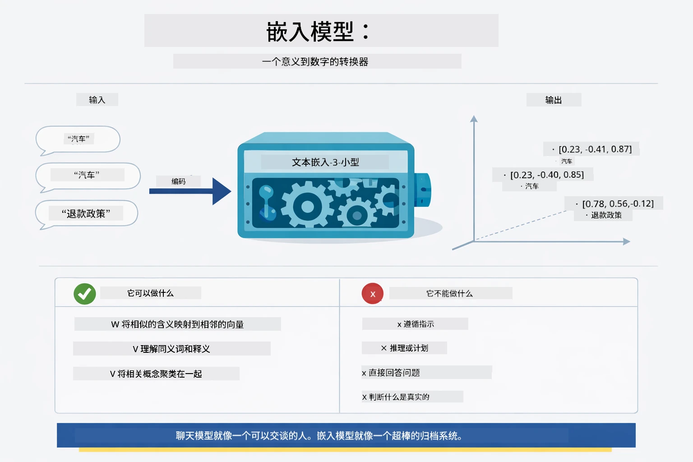

*该图展示嵌入模型如何将文本转成数值向量，使相似含义的词（如“car”和“automobile”）在向量空间中彼此靠近。*

```java
@Bean
public EmbeddingModel embeddingModel() {
    return OpenAiOfficialEmbeddingModel.builder()
        .baseUrl(azureOpenAiEndpoint)
        .apiKey(azureOpenAiKey)
        .modelName(azureEmbeddingDeploymentName)
        .build();
}

EmbeddingStore<TextSegment> embeddingStore = 
    new InMemoryEmbeddingStore<>();
```
  
下图显示了 RAG 流程的两条主线和 LangChain4j 实现它们的类。**摄取流程**（上传时运行一次）拆分文档、生成分块嵌入并通过 `.addAll()` 存储。**查询流程**（用户每次提问时运行）生成问题嵌入，通过 `.search()` 搜索，并将匹配上下文传给聊天模型。两条流程共享 `EmbeddingStore<TextSegment>` 接口：

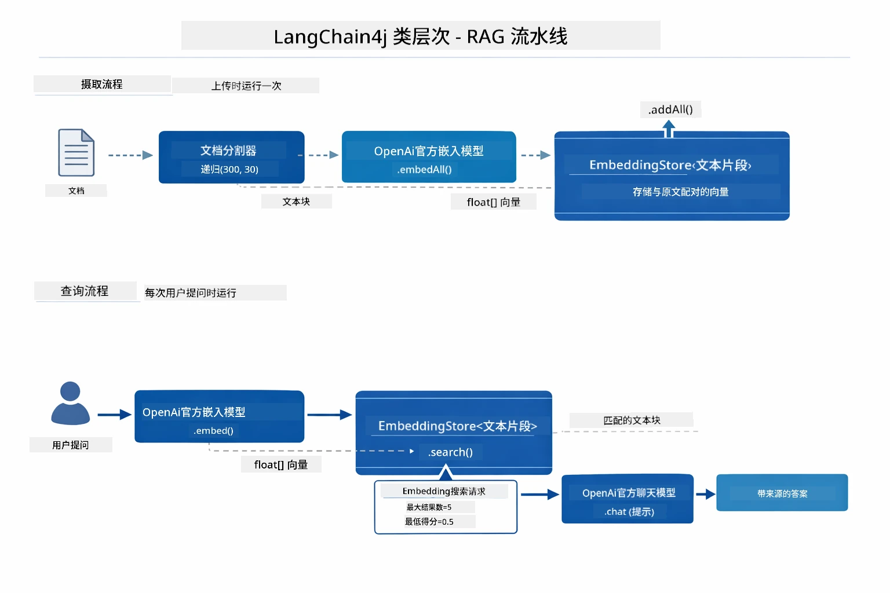

*该图展示 RAG 的两条流程——摄取与查询，它们如何通过共享 EmbeddingStore 接口连接。*

嵌入存储后，语义相近内容自然在向量空间中聚集。下面的可视化展示了相关主题文档的点聚集在一起，这使得语义搜索成为可能：


*该图展示了相关文档如何在 3D 向量空间聚集，技术文档、业务规则和常见问题各形成独立群组。*

用户搜索时，系统遵循四步：文档先嵌入一次，每次搜索时嵌入查询，使用余弦相似度比较查询向量和所有存储向量，并返回得分最高的前 K 个分块。下图演示每步及其对应的 LangChain4j 类：

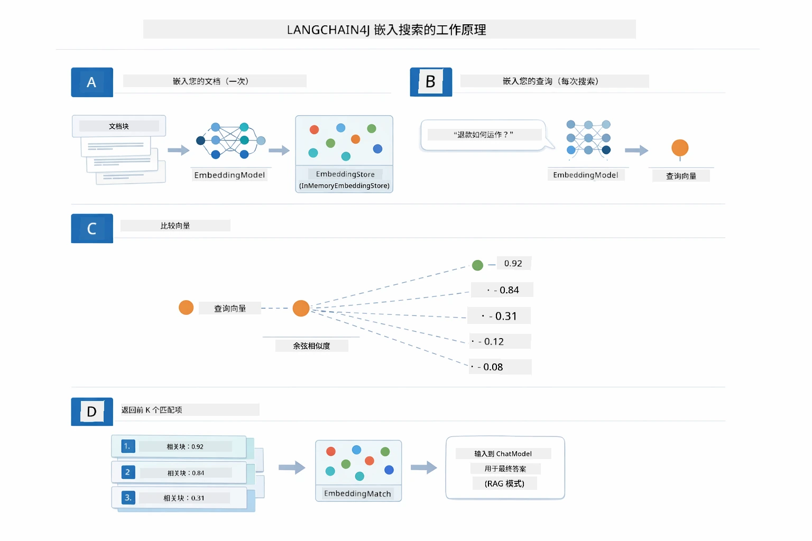

*该图展示四步嵌入搜索过程：文档嵌入、查询嵌入、余弦相似度比较和返回前 K 结果。*

### 语义搜索

[RagService.java](../../../03-rag/src/main/java/com/example/langchain4j/rag/service/RagService.java)

你提问时，问题也会被嵌入成向量。系统将你的问题嵌入与所有文档分块嵌入进行比较。它找到语义最相近的分块——不仅是关键词匹配，而是真正的语义相似。

```java
Embedding queryEmbedding = embeddingModel.embed(question).content();

EmbeddingSearchRequest searchRequest = EmbeddingSearchRequest.builder()
    .queryEmbedding(queryEmbedding)
    .maxResults(5)
    .minScore(0.5)
    .build();

EmbeddingSearchResult<TextSegment> searchResult = embeddingStore.search(searchRequest);
List<EmbeddingMatch<TextSegment>> matches = searchResult.matches();

for (EmbeddingMatch<TextSegment> match : matches) {
    String relevantText = match.embedded().text();
    double score = match.score();
}
```
  
下图对比了语义搜索与传统关键词搜索。关键词搜索“vehicle”会错过关于“cars and trucks”的分块，而语义搜索理解它们含义相同，因而将其作为高分匹配返回：

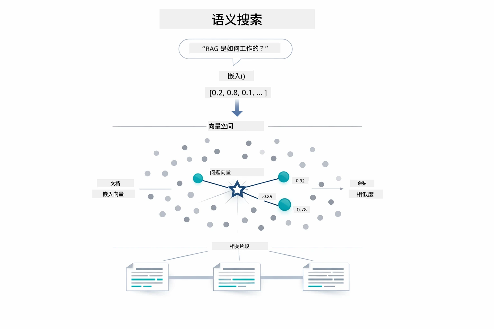

*该图比较基于关键词的搜索与语义搜索，展示语义搜索如何即使关键词不匹配也能检索到相关概念内容。*
底层使用余弦相似度来衡量相似度 —— 本质上是在问“这两个箭头是否指向相同方向？” 两个块可能使用完全不同的词语，但如果它们的含义相同，它们的向量指向同一方向，得分接近 1.0：

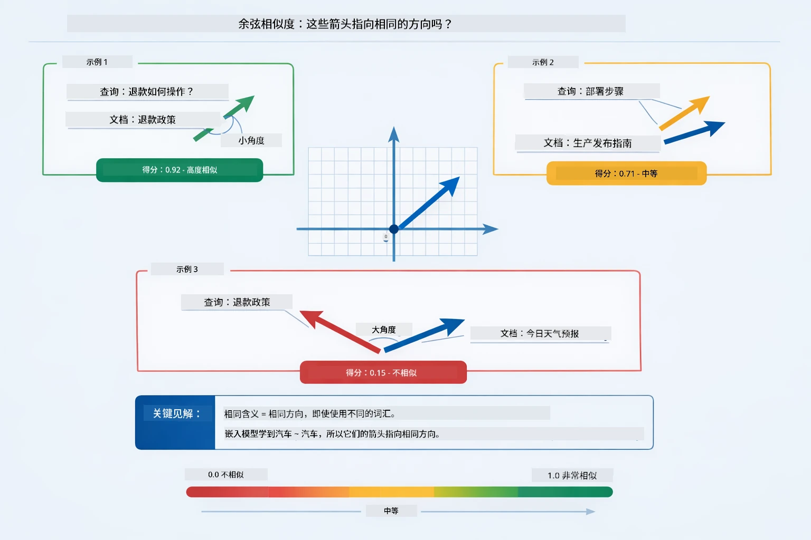

*此图展示了余弦相似度，即嵌入向量之间的角度 —— 向量越对齐，得分越接近 1.0，表示语义相似度越高。*

> **🤖 试试使用 [GitHub Copilot](https://github.com/features/copilot) 聊天功能：** 打开 [`RagService.java`](../../../03-rag/src/main/java/com/example/langchain4j/rag/service/RagService.java) 并提问：
> - “相似度搜索如何与嵌入向量配合工作，分数由什么决定？”
> - “我应该使用什么相似度阈值，它如何影响结果？”
> - “如果没有找到相关文档，我该如何处理？”

### 答案生成

[RagService.java](../../../03-rag/src/main/java/com/example/langchain4j/rag/service/RagService.java)

最相关的块会被组装成一个结构化的提示，包含明确的指令、检索到的上下文和用户的问题。模型读取这些特定块，并基于这些信息回答 —— 它只能使用面前的信息，这避免了幻觉。

```java
String context = matches.stream()
    .map(match -> match.embedded().text())
    .collect(Collectors.joining("\n\n"));

String prompt = String.format("""
    Answer the question based on the following context.
    If the answer cannot be found in the context, say so.

    Context:
    %s

    Question: %s

    Answer:""", context, request.question());

String answer = chatModel.chat(prompt);
```

下图展示了这个组装过程 —— 从搜索步骤中得分最高的块被注入提示模板，`OpenAiOfficialChatModel` 生成一个有根据的答案：

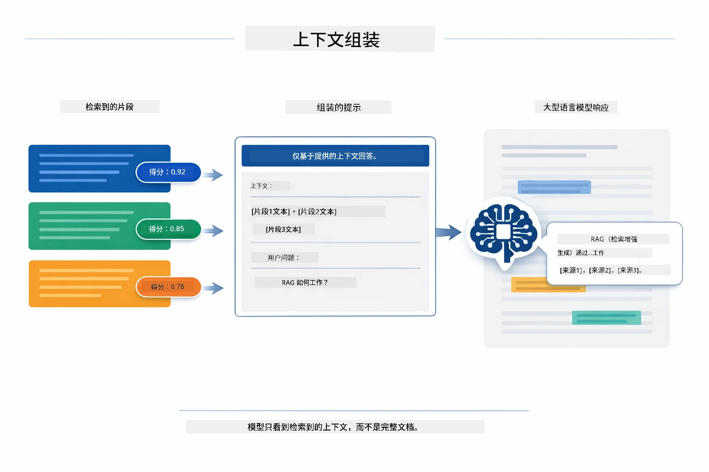

*此图展示得分最高的块如何被组装成一个结构化提示，使模型能够基于你的数据生成有根据的答案。*

## 运行应用程序

**验证部署：**

确保根目录存在 `.env` 文件，并包含 Azure 凭据（在模块01中创建）。从模块目录（`03-rag/`）运行：

**Bash:**
```bash
cat ../.env  # 应显示 AZURE_OPENAI_ENDPOINT、API_KEY、DEPLOYMENT
```

**PowerShell:**
```powershell
Get-Content ..\.env  # 应显示 AZURE_OPENAI_ENDPOINT、API_KEY、DEPLOYMENT
```

**启动应用程序：**

> **注意：** 如果你已从根目录使用 `./start-all.sh` 启动所有应用（如模块01所述），本模块已在端口8081运行。你可以跳过下面的启动命令，直接访问 http://localhost:8081。

**选项1：使用 Spring Boot 仪表板（推荐 VS Code 用户）**

开发容器包含 Spring Boot 仪表板扩展，提供可视化界面管理所有 Spring Boot 应用。你可以在 VS Code 左侧的活动栏中找到它（查找 Spring Boot 图标）。

通过 Spring Boot 仪表板，你可以：
- 查看工作区内所有可用的 Spring Boot 应用
- 一键启动/停止应用
- 实时查看应用日志
- 监控应用状态

只需点击“rag”旁的播放按钮启动此模块，或一次启动所有模块。


*此截图展示了 VS Code 中的 Spring Boot 仪表板，你可以可视化地启动、停止和监控应用。*

**选项2：使用 shell 脚本**

启动所有 Web 应用（模块 01-04）：

**Bash:**
```bash
cd ..  # 从根目录
./start-all.sh
```

**PowerShell:**
```powershell
cd ..  # 从根目录
.\start-all.ps1
```

或者只启动本模块：

**Bash:**
```bash
cd 03-rag
./start.sh
```

**PowerShell:**
```powershell
cd 03-rag
.\start.ps1
```

两个脚本都会自动从根 `.env` 文件加载环境变量，如果 JAR 文件不存在则会构建。

> **注意：** 如果你想先手动构建所有模块再启动：
>
> **Bash:**
> ```bash
> cd ..  # Go to root directory
> mvn clean package -DskipTests
> ```
>
> **PowerShell:**
> ```powershell
> cd ..  # Go to root directory
> mvn clean package -DskipTests
> ```

在浏览器打开 http://localhost:8081。

**停止应用：**

**Bash:**
```bash
./stop.sh  # 仅此模块
# 或
cd .. && ./stop-all.sh  # 所有模块
```

**PowerShell:**
```powershell
.\stop.ps1  # 仅此模块
# 或
cd ..; .\stop-all.ps1  # 所有模块
```

## 使用应用程序

该应用提供文档上传和提问的网页界面。

<a href="images/rag-homepage.png"></a>

*此截图展示了 RAG 应用界面，你可以上传文档并提问。*

### 上传文档

从上传文档开始 —— TXT 文件最适合测试。此目录中提供了一个 `sample-document.txt`，包含 LangChain4j 功能、RAG 实现和最佳实践的信息 —— 非常适合测试系统。

系统会处理你的文档，将其拆分成块，并为每个块创建嵌入。这一切在你上传时自动进行。

### 提问

现在，针对文档内容提具体问题。尝试问一些文档中清晰阐述的事实性问题。系统会搜索相关的块，将它们包含在提示中，并生成答案。

### 检查来源参考

注意每个答案都会包含来源参考和相似度分数。这些分数（0 到 1）显示每个块与问题的相关度。分数越高，匹配越好。这样你可以依据原始资料验证答案。

<a href="images/rag-query-results.png"></a>

*此截图展示查询结果，其中包括生成的答案、来源参考及每个检索块的相关度得分。*

### 试验不同问题

尝试不同类型的问题：
- 具体事实：“主要话题是什么？”
- 比较：“X 和 Y 有什么区别？”
- 总结：“总结关于 Z 的要点”

观察相关度分数如何根据你的问题与文档内容的匹配程度变化。

## 关键概念

### 分块策略

文档被拆分成每块 300 令牌，重叠 30 令牌。该平衡确保每块有足够上下文且块大小适中，方便在提示中包含多个块。

### 相似度分数

每个检索到的块都带有一个 0 到 1 之间的相似度分数，表示它与用户问题的匹配程度。下图可视化了分数范围及系统如何利用它们过滤结果：

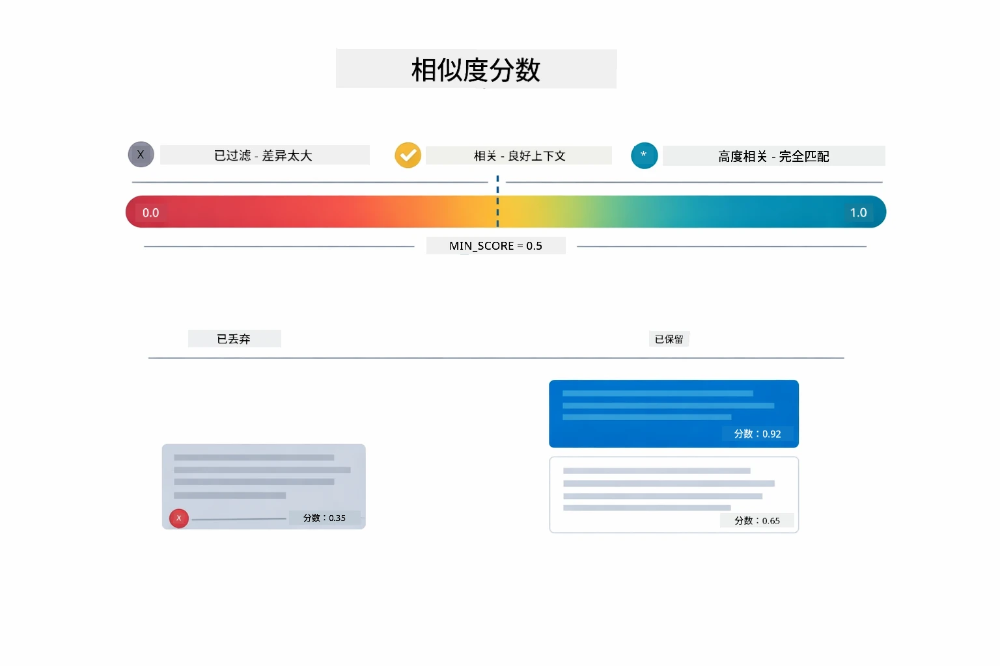

*此图显示了从 0 到 1 的分数范围，设置了 0.5 的最低阈值过滤无关块。*

分数范围：
- 0.7-1.0：高度相关，完全匹配
- 0.5-0.7：相关，提供良好上下文
- 低于 0.5：被过滤，差异太大

系统仅检索超过最低阈值的块以保证质量。

嵌入在语义清晰聚类时效果很好，但也有盲点。下图示常见失败模式 —— 块太大导致向量模糊，块太小缺少上下文，模糊术语指向多重聚类，且准确匹配检索（ID、零件号）嵌入完全不起作用：

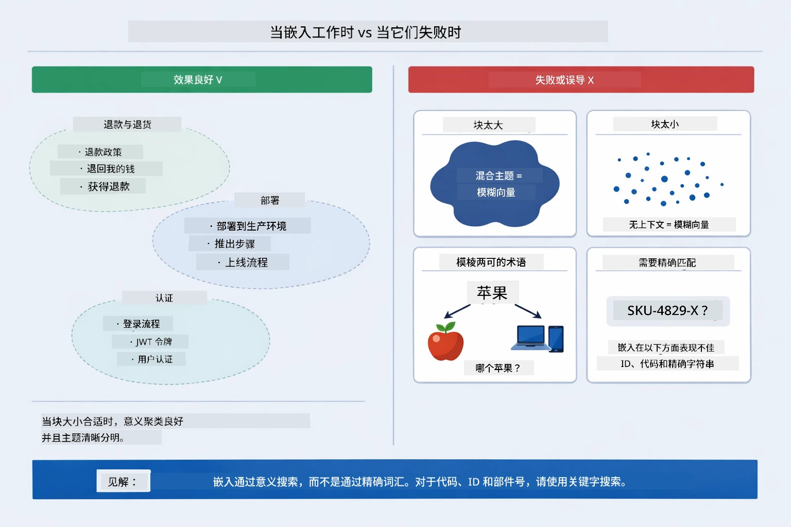

*此图展示常见嵌入失败模式：块太大，块太小，模糊术语指向多个聚类，及基于ID的精确匹配。*

### 内存存储

出于简易考虑，本模块使用内存存储。重启应用后上传的文档会丢失。生产系统使用持久化向量数据库，例如 Qdrant 或 Azure AI Search。

### 上下文窗口管理

每个模型有最大上下文窗口限制。大文档的所有块无法全部包含。系统检索排名前 N 的块（默认 5 个），以在限制内提供足够上下文，实现准确回答。

## 何时使用 RAG

RAG 并非总是合适。下面的决策指南帮助判断何时 RAG 增值，何时简单方案（例如直接将内容包含在提示中或依赖模型内置知识）就足够：

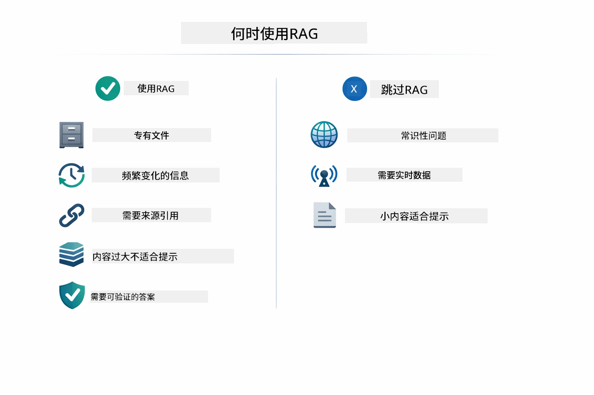

*此图展示 RAG 何时增值，与简单方案足以解决的决策指南。*

## 后续步骤

**下一模块：** [04-tools - 使用工具的 AI 代理](../04-tools/README.md)

---

**导航：** [← 上一：模块 02 - 提示工程](../02-prompt-engineering/README.md) | [返回主页](../README.md) | [下一：模块 04 - 工具 →](../04-tools/README.md)

---

<!-- CO-OP TRANSLATOR DISCLAIMER START -->
**免责声明**：  
本文件由AI翻译服务[Co-op Translator](https://github.com/Azure/co-op-translator)翻译。虽然我们力求准确，但请注意，自动翻译可能包含错误或不准确之处。原文应被视为权威来源。对于重要信息，建议使用专业人工翻译。我们不对因使用本翻译而导致的任何误解或误释承担责任。
<!-- CO-OP TRANSLATOR DISCLAIMER END -->