# 模块 04：带工具的 AI 代理

## 目录

- [视频演练](../../../04-tools)
- [你将学到什么](../../../04-tools)
- [先决条件](../../../04-tools)
- [理解带工具的 AI 代理](../../../04-tools)
- [工具调用是如何工作的](../../../04-tools)
  - [工具定义](../../../04-tools)
  - [决策过程](../../../04-tools)
  - [执行](../../../04-tools)
  - [响应生成](../../../04-tools)
  - [架构：Spring Boot 自动装配](../../../04-tools)
- [工具链](../../../04-tools)
- [运行应用](../../../04-tools)
- [使用应用](../../../04-tools)
  - [尝试简单工具使用](../../../04-tools)
  - [测试工具链](../../../04-tools)
  - [查看对话流程](../../../04-tools)
  - [实验不同请求](../../../04-tools)
- [关键概念](../../../04-tools)
  - [ReAct 模式（推理与行动）](../../../04-tools)
  - [工具描述的重要性](../../../04-tools)
  - [会话管理](../../../04-tools)
  - [错误处理](../../../04-tools)
- [可用工具](../../../04-tools)
- [何时使用基于工具的代理](../../../04-tools)
- [工具与 RAG 的比较](../../../04-tools)
- [后续步骤](../../../04-tools)

## 视频演练

观看本直播课程，了解本模块入门方法：

<a href="https://www.youtube.com/watch?v=O_J30kZc0rw"></a>

## 你将学到什么

到目前为止，你已经学会了如何与 AI 进行对话、有效构造提示并将回答基于文档内容。但仍有一个根本限制：语言模型只能生成文本，不能查询天气、执行计算、访问数据库或与外部系统交互。

工具改变了这一点。通过让模型可以调用的函数，你将它从文本生成器转变成了能够采取行动的代理。模型决定何时需要工具、使用哪个工具、以及传递哪些参数。你的代码执行函数并返回结果，模型将结果纳入回复中。

## 先决条件

- 完成 [模块 01 - 介绍](../01-introduction/README.md)（Azure OpenAI 资源已部署）
- 建议完成之前的模块（本模块在“工具与 RAG 比较”中引用了[模块 03 的 RAG 概念](../03-rag/README.md)）
- 根目录下有包含 Azure 凭据的 `.env` 文件（由模块 01 中的 `azd up` 创建）

> **注意：** 如果你还未完成模块 01，请先按照那里的部署说明操作。

## 理解带工具的 AI 代理

> **📝 注意：** 本模块中“代理”一词指的是带有工具调用能力的 AI 助手。这不同于我们将在[模块 05: MCP](../05-mcp/README.md)中介绍的**Agentic AI** 模式（具有规划、记忆和多步推理的自主代理）。

没有工具，语言模型只能根据训练数据生成文本。问当前天气，它只能猜测。给它工具后，它可以调用天气 API、执行计算或查询数据库——然后将真实结果融合进回复。

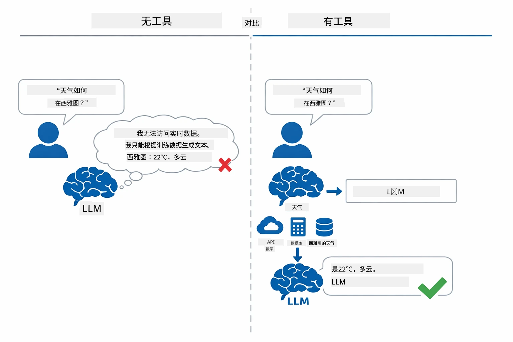

*没有工具时模型只能猜测，有了工具它可以调用 API、运行计算并返回实时数据。*

配备工具的 AI 代理遵循**推理与行动（ReAct）**模式。模型不仅是回应——它会思考所需内容，调用工具采取行动，观察结果，再决定是继续行动还是给出最终答案：

1. **推理** —— 代理分析用户的问题，确定需要什么信息
2. **行动** —— 代理选择合适工具，生成正确参数并调用
3. **观察** —— 代理接收工具输出，评估结果
4. **重复或回应** —— 若需更多数据，循环回推理；否则生成自然语言答案

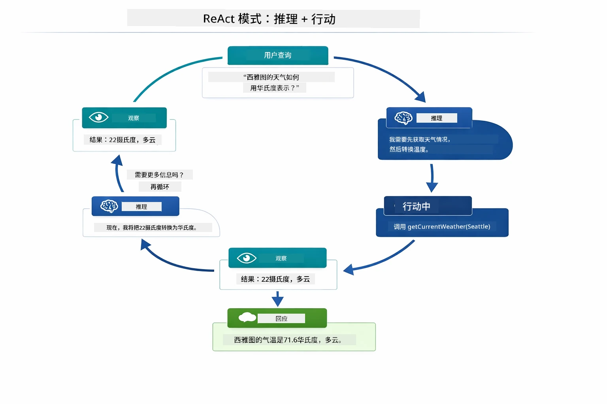

*ReAct 循环——代理推理应做何事，调用工具行动，观察结果，循环直到能给出最终答案。*

这一过程自动完成。你定义工具及其描述，模型负责决策何时如何使用它们。

## 工具调用是如何工作的

### 工具定义

[WeatherTool.java](../../../04-tools/src/main/java/com/example/langchain4j/agents/tools/WeatherTool.java) | [TemperatureTool.java](../../../04-tools/src/main/java/com/example/langchain4j/agents/tools/TemperatureTool.java)

你定义带有清晰描述和参数规格的函数。模型在系统提示中看到这些描述，并理解每个工具的功能。

```java
@Component
public class WeatherTool {
    
    @Tool("Get the current weather for a location")
    public String getCurrentWeather(@P("Location name") String location) {
        // 您的天气查询逻辑
        return "Weather in " + location + ": 22°C, cloudy";
    }
}

@AiService
public interface Assistant {
    String chat(@MemoryId String sessionId, @UserMessage String message);
}

// Assistant 由 Spring Boot 自动连接：
// - ChatModel Bean
// - 来自 @Component 类的所有 @Tool 方法
// - 用于会话管理的 ChatMemoryProvider
```

下图拆解了每个注解，展示各部分如何帮助 AI 理解何时调用工具以及传递哪些参数：

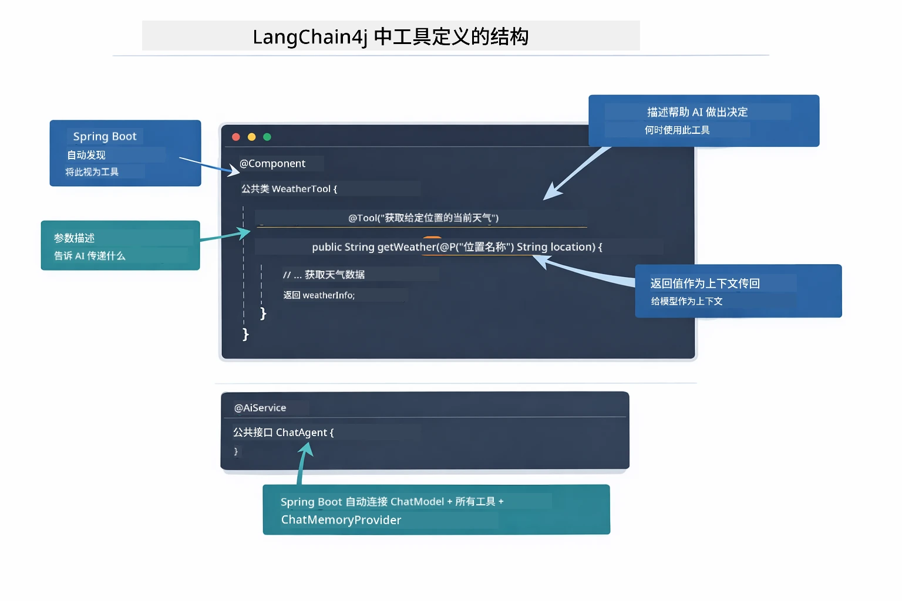

*工具定义构成——@Tool 告诉 AI 何时使用，@P 描述每个参数，@AiService 在启动时自动装配所有内容。*

> **🤖 用 [GitHub Copilot](https://github.com/features/copilot) 聊天试试：** 打开 [`WeatherTool.java`](../../../04-tools/src/main/java/com/example/langchain4j/agents/tools/WeatherTool.java)，问：
> - “如何集成像 OpenWeatherMap 这样真实的天气 API 替代模拟数据？”
> - “什么样的工具描述能帮助 AI 正确使用它？”
> - “我如何在工具实现中处理 API 错误和速率限制？”

### 决策过程

当用户问“西雅图的天气怎么样？”，模型不会随机选择工具。它将用户意图与所有工具描述进行匹配评分，选出最相关的。然后生成带正确参数的结构化函数调用——此例中将 `location` 设置为 `"Seattle"`。

如果没有工具匹配请求，模型就基于自身知识回答。若多工具匹配，则选择最具体的。

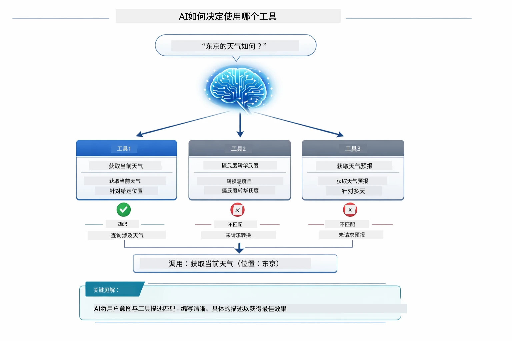

*模型对每个可用工具评估与用户意图的相关性，选择最佳匹配——这也是为何写清晰具体的工具描述至关重要。*

### 执行

[AgentService.java](../../../04-tools/src/main/java/com/example/langchain4j/agents/service/AgentService.java)

Spring Boot 自动装配带有 `@AiService` 注解的接口和所有注册工具，LangChain4j 自动执行工具调用。幕后，一个完整的工具调用通过六个阶段流转——从用户的自然语言问题至自然语言回答：

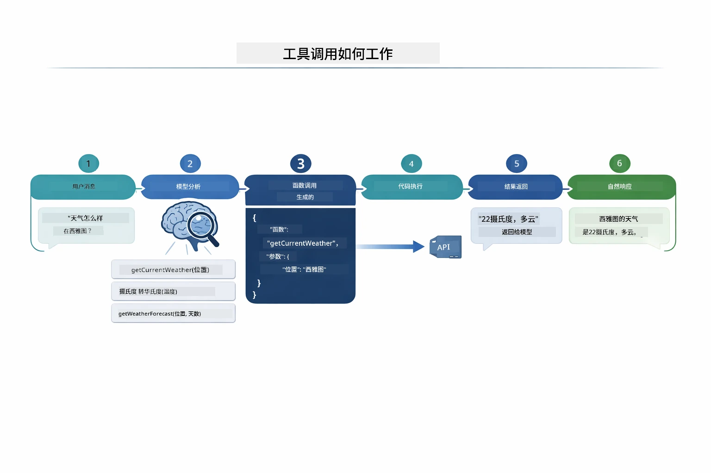

*端到端流程——用户提问，模型选择工具，LangChain4j 执行调用，模型将结果融合为自然语言回复。*

如果你运行过模块 00 里的 [ToolIntegrationDemo](../../../00-quick-start/src/main/java/com/example/langchain4j/quickstart/ToolIntegrationDemo.java)，你已经见过该模式——`Calculator` 工具的调用完全一样。下图序列图展示了该示例背后的调用细节：

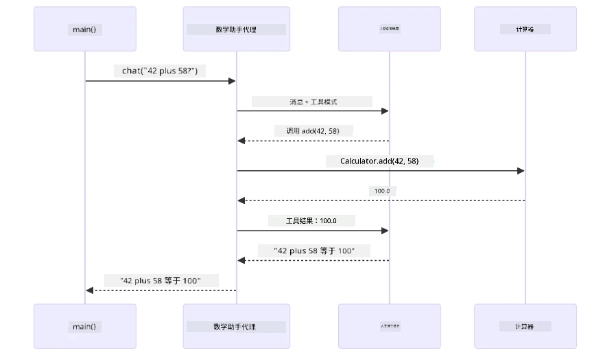

*快速入门演示中的工具调用循环——`AiServices` 发送信息和工具模式到 LLM，LLM 回复函数调用如 `add(42, 58)`，LangChain4j 在本地执行 `Calculator` 方法并返回结果供最终回答。*

> **🤖 用 [GitHub Copilot](https://github.com/features/copilot) 聊天试试：** 打开 [`AgentService.java`](../../../04-tools/src/main/java/com/example/langchain4j/agents/service/AgentService.java)，问：
> - “ReAct 模式如何运作，为什么对 AI 代理有效？”
> - “代理如何决定使用哪个工具及调用顺序？”
> - “若工具执行失败怎么办？如何稳健处理错误？”

### 响应生成

模型接收天气数据，格式化为自然语言回应用户。

### 架构：Spring Boot 自动装配

本模块使用 LangChain4j 的 Spring Boot 集成和声明式 `@AiService` 接口。启动时，Spring Boot 发现所有带 `@Component` 的包含 `@Tool` 方法的组件，你的 `ChatModel` Bean，以及 `ChatMemoryProvider`，然后将它们零样板代码组装成单一 `Assistant` 接口。

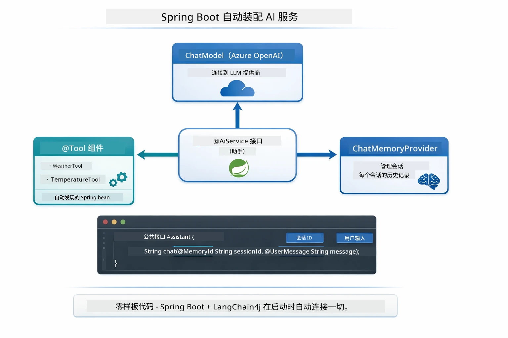

*@AiService 接口将 ChatModel、工具组件和内存提供者绑定在一起——Spring Boot 自动处理所有装配。*

下面是完整请求生命周期的序列图——从 HTTP 请求，经控制器、服务和自动装配的代理，直到工具执行及返回：

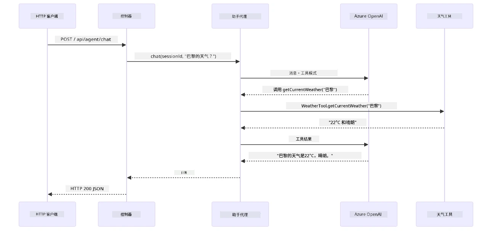

*完整的 Spring Boot 请求流程——HTTP 请求通过控制器和服务到自动装配的 Assistant 代理，代理自动调度 LLM 和工具调用。*

此方法的关键优势：

- **Spring Boot 自动装配**——自动注入 ChatModel 和工具
- **@MemoryId 模式**——自动进行基于会话的内存管理
- **单例实例**——Assistant 只创建一次，性能更佳
- **类型安全执行**——Java 方法直接调用，支持类型转换
- **多轮交互编排**——自动处理工具链调用
- **零样板代码**——无需手写 `AiServices.builder()` 或维护内存哈希映射

替代方案（手动调用 `AiServices.builder()`）代码量更大且失去 Spring Boot 集成优势。

## 工具链

**工具链**——基于工具的代理的真正威力在于单个问题需要调用多个工具。问“西雅图的天气是多少华氏度？”时，代理自动串联两个工具：先调用 `getCurrentWeather` 获得摄氏度温度，再将其传给 `celsiusToFahrenheit` 转换——全在一次对话中完成。

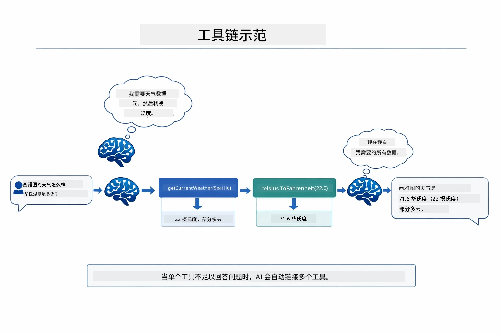

*工具链实战——代理先调用 getCurrentWeather，再把摄氏结果传给 celsiusToFahrenheit，最后给出综合答案。*

**优雅失败**——请求查询模拟数据中不存在的城市天气时，工具返回错误消息，AI 解释无法帮助而非崩溃。工具失败安全。下图对比了这两种方式——正确错误处理时代理捕获异常并提供帮助回答，否则整个应用崩溃：

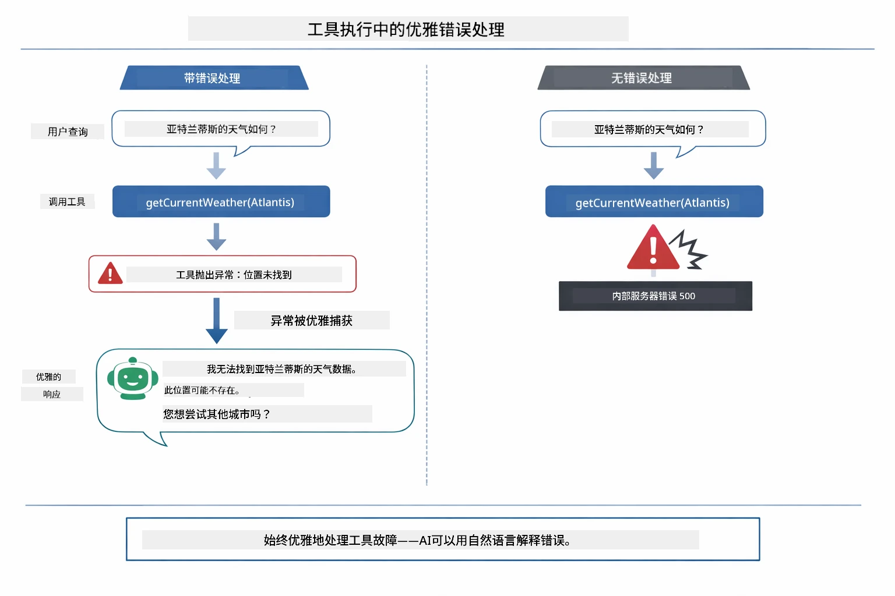

*工具调用失败时，代理捕获错误并给予帮助而非程序崩溃。*

这一切都在单轮对话中自动完成，代理自主编排多次调用。

## 运行应用

**验证部署：**

确保根目录存在包含 Azure 凭据的 `.env` 文件（模块 01 创建）。从本模块目录 (`04-tools/`) 运行：

**Bash:**
```bash
cat ../.env  # 应显示 AZURE_OPENAI_ENDPOINT、API_KEY、DEPLOYMENT
```

**PowerShell:**
```powershell
Get-Content ..\.env  # 应显示 AZURE_OPENAI_ENDPOINT、API_KEY、DEPLOYMENT
```

**启动应用：**

> **注意：** 如果已用根目录下的 `./start-all.sh` 启动所有应用（见模块 01 说明），本模块已在端口 8084 运行。你可以跳过下面启动命令，直接访问 http://localhost:8084。

**选项1：使用 Spring Boot 控制面板（推荐 VS Code 用户）**

开发容器包含 Spring Boot Dashboard 扩展，提供管理所有 Spring Boot 应用的可视界面。你可以在 VS Code 左侧活动栏找到它（寻找 Spring Boot 图标）。

通过 Spring Boot 控制面板，你可以：
- 查看工作区所有可用的 Spring Boot 应用
- 一键启动/停止应用
- 实时查看应用日志
- 监控应用状态
只需点击“tools”旁边的播放按钮即可启动此模块，或者一次启动所有模块。

以下是在 VS Code 中的 Spring Boot Dashboard 界面：


*VS Code 中的 Spring Boot Dashboard —— 从一个地方启动、停止和监控所有模块*

**选项 2：使用 shell 脚本**

启动所有 web 应用（模块 01-04）：

**Bash:**
```bash
cd ..  # 从根目录
./start-all.sh
```

**PowerShell:**
```powershell
cd ..  # 从根目录
.\start-all.ps1
```

或者仅启动此模块：

**Bash:**
```bash
cd 04-tools
./start.sh
```

**PowerShell:**
```powershell
cd 04-tools
.\start.ps1
```

两个脚本都会自动从根目录 `.env` 文件加载环境变量，如果 JAR 文件不存在则会构建它们。

> **注意：** 如果你更喜欢在启动前手动构建所有模块：
>
> **Bash:**
> ```bash
> cd ..  # Go to root directory
> mvn clean package -DskipTests
> ```
>
> **PowerShell:**
> ```powershell
> cd ..  # Go to root directory
> mvn clean package -DskipTests
> ```

在浏览器中打开 http://localhost:8084 。

**停止方法：**

**Bash:**
```bash
./stop.sh  # 仅此模块
# 或
cd .. && ./stop-all.sh  # 所有模块
```

**PowerShell:**
```powershell
.\stop.ps1  # 仅此模块
# 或
cd ..; .\stop-all.ps1  # 所有模块
```

## 使用应用

该应用提供了一个网页界面，你可以与一个能访问天气和温度转换工具的 AI 代理进行交互。界面如下 —— 包含快速入门示例和用于发送请求的聊天面板：

<a href="images/tools-homepage.png"></a>

*AI 代理工具界面 —— 快速示例和用于与工具交互的聊天界面*

### 试试简单的工具用法

从一个简单的请求开始：“把 100 华氏度转换成摄氏度”。代理识别出需要使用温度转换工具，调用它传入正确的参数，并返回结果。注意这有多自然 —— 你没有指定用哪个工具或怎么调用它。

### 测试工具链

现在试试更复杂的请求：“西雅图的天气如何，并把它转换成华氏度？”观察代理分步处理：它先获取天气（返回摄氏度），识别出需要转换为华氏度，调用转换工具，然后将两个结果合并为一个回答。

### 查看对话流程

聊天界面会保留对话历史，支持多轮交互。你可以看到之前所有的查询和回复，方便追踪对话，理解代理如何在多轮交流中构建上下文。

<a href="images/tools-conversation-demo.png"></a>

*多轮对话展示简单转换、天气查询和工具链*

### 试用不同请求

尝试各种组合：
- 天气查询：“东京天气怎么样？”
- 温度转换：“25°C 是多少开尔文？”
- 组合查询：“查一下巴黎的天气，告诉我是否超过 20°C”

注意代理如何理解自然语言，并映射成合适的工具调用。

## 关键概念

### ReAct 模式（推理与行动）

代理在推理（决定做什么）和行动（使用工具）之间交替。这个模式使其能够自主解决问题，而不仅是简单回应指令。

### 工具描述很重要

工具描述的质量直接影响代理使用工具的效果。清晰、具体的描述帮助模型理解何时、如何调用每个工具。

### 会话管理

`@MemoryId` 注解启用自动的基于会话的内存管理。每个会话 ID 都获得一个 `ChatMemory` 实例，由 `ChatMemoryProvider` bean 管理，因此多个用户可以同时与代理交互，且彼此对话互不干扰。下图展示多用户如何根据会话 ID 路由到隔离的内存存储：

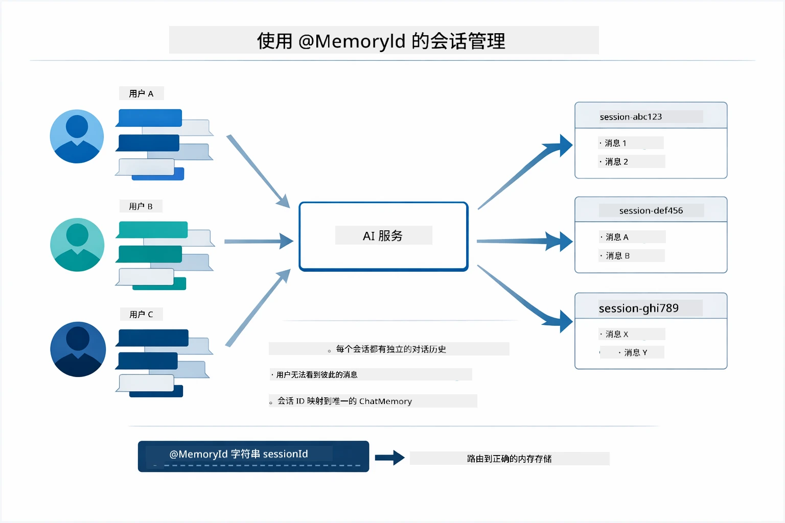

*每个会话 ID 映射到一个独立的对话历史 —— 用户永远看不到彼此的消息。*

### 错误处理

工具可能出错 — API 超时、参数无效、外部服务中断等。生产环境中的代理需要错误处理，以便模型能解释问题或尝试替代方案，而不是导致整个应用崩溃。当工具抛出异常时，LangChain4j 会捕获它，并将错误信息反馈给模型，模型随后可以用自然语言解释问题。

## 可用工具

下图展示了你可以构建的工具生态系统的广泛范围。本模块演示了天气和温度工具，但相同的 `@Tool` 模式适用于任何 Java 方法 —— 从数据库查询到支付处理。

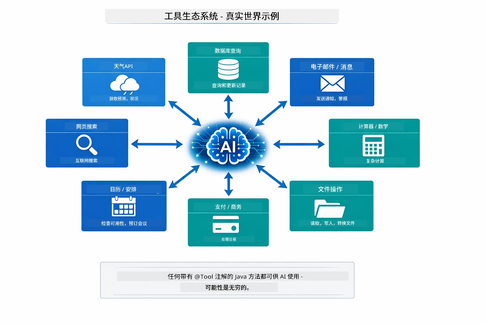

*任何用 @Tool 注解的 Java 方法都可供 AI 使用 — 该模式可扩展到数据库、API、邮箱、文件操作等。*

## 何时使用基于工具的代理

并非所有请求都需要工具。关键在于 AI 是否需要与外部系统交互，或者仅凭自身知识即可回答。下图总结了工具何时有价值，何时不必要：

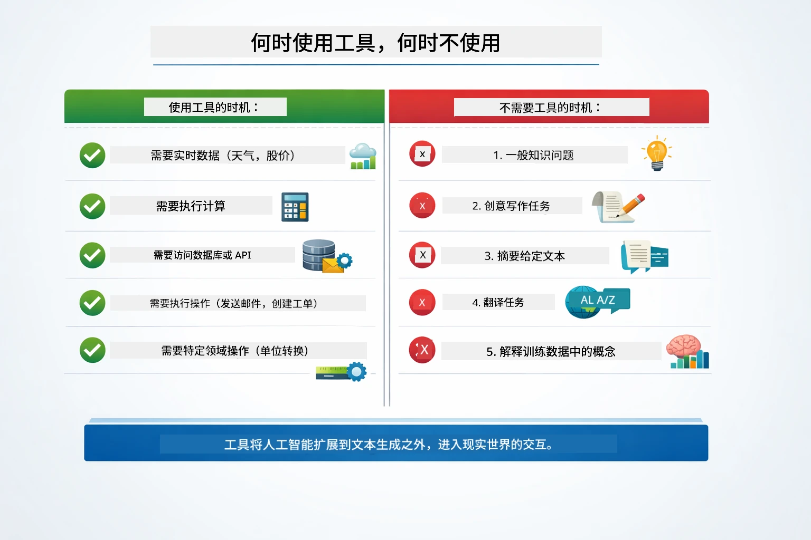

*快速决策指南 — 工具适合实时数据、计算和执行动作；通用知识和创造性任务则不需要。*

## 工具与 RAG

模块 03 和 04 都扩展了 AI 的能力，但本质上不同。RAG 通过检索文档给模型提供**知识**。工具则通过调用函数提供模型执行**操作**的能力。下图并列比较这两种方法 —— 从各自的工作流程到它们的优缺点：

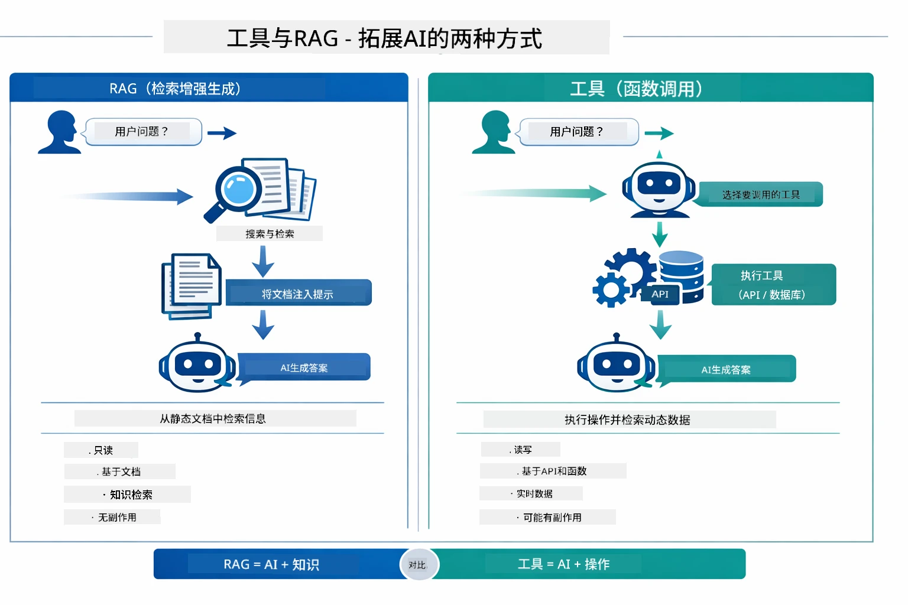

*RAG 从静态文档检索信息 — 工具则执行动作并获取动态实时数据。许多生产系统结合使用两者。*

实际上，许多生产系统结合这两种方法：RAG 用于在文档中确定答案，工具用于获取实时数据或执行操作。

## 后续步骤

**下一个模块：** [05-mcp - 模型上下文协议 (MCP)](../05-mcp/README.md)

---

**导航：** [← 上一节：模块 03 - RAG](../03-rag/README.md) | [回主目录](../README.md) | [下一节：模块 05 - MCP →](../05-mcp/README.md)

---

<!-- CO-OP TRANSLATOR DISCLAIMER START -->
**免责声明**：  
本文件由 AI 翻译服务 [Co-op Translator](https://github.com/Azure/co-op-translator) 进行翻译。虽然我们努力保证译文的准确性，但请注意自动翻译可能存在错误或不准确之处。原始文档的母语版本应被视为权威来源。对于重要信息，建议采用专业人工翻译。对于因使用本翻译而引起的任何误解或错误理解，我们不承担任何责任。
<!-- CO-OP TRANSLATOR DISCLAIMER END -->