# Module 05: 模型上下文协议 (MCP)

## 目录

- [你将学习什么](../../../05-mcp)
- [什么是 MCP？](../../../05-mcp)
- [MCP 如何工作](../../../05-mcp)
- [Agentic 模块](../../../05-mcp)
- [运行示例](../../../05-mcp)
  - [先决条件](../../../05-mcp)
- [快速入门](../../../05-mcp)
  - [文件操作（Stdio）](../../../05-mcp)
  - [监督代理](../../../05-mcp)
    - [运行演示](../../../05-mcp)
    - [监督者如何工作](../../../05-mcp)
    - [响应策略](../../../05-mcp)
    - [理解输出](../../../05-mcp)
    - [Agentic 模块功能解释](../../../05-mcp)
- [关键概念](../../../05-mcp)
- [恭喜！](../../../05-mcp)
  - [下一步是什么？](../../../05-mcp)

## 你将学习什么

你已经构建了会话式 AI，掌握了提示，基于文档设定了响应基础，并创建了带有工具的代理。但所有这些工具都是为你的特定应用程序定制的。如果你能让你的 AI 访问一个任何人都可以创建和共享的标准化工具生态系统，会怎么样呢？在本模块中，你将学习如何使用模型上下文协议（MCP）和 LangChain4j 的 agentic 模块来实现这一点。我们首先展示一个简单的 MCP 文件读取器，然后展示它如何轻松集成到使用监督代理模式的高级 agentic 工作流中。

## 什么是 MCP？

模型上下文协议（MCP）提供了正是这样一个标准化方法，让 AI 应用能够发现并使用外部工具。无须为每个数据源或服务写定制集成代码，而是连接到以一致格式暴露其能力的 MCP 服务器。你的 AI 代理随后可以自动发现并使用这些工具。


*MCP 之前：复杂的点对点集成。MCP 之后：一个协议，无限可能。*

MCP 解决了 AI 开发中的一个基本问题：每个集成都是定制的。想访问 GitHub？自定义代码。想读取文件？自定义代码。想查询数据库？自定义代码。这些集成都不能与其他 AI 应用共享。

MCP 将这一过程标准化。MCP 服务器暴露带有清晰描述和架构的工具。任何 MCP 客户端都可以连接、发现可用工具并使用它们。构建一次，随处使用。


*模型上下文协议架构——标准化的工具发现与执行*

## MCP 如何工作

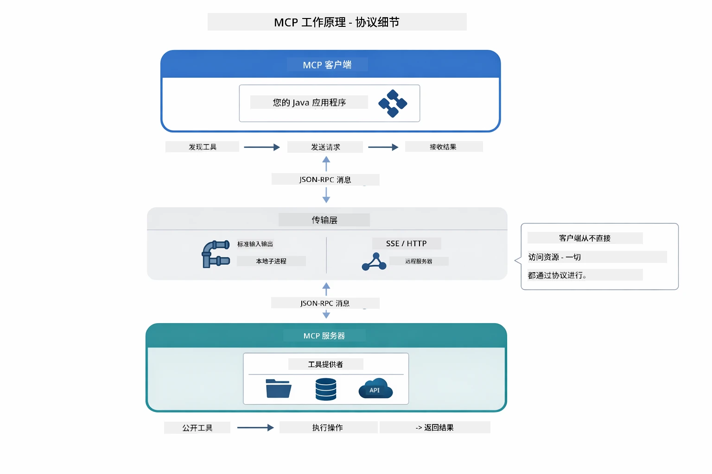

*MCP 工作原理—客户端发现工具，交换 JSON-RPC 消息，并通过传输层执行操作。*

**服务器-客户端架构**

MCP 使用客户端-服务器模型。服务器提供工具——读取文件、查询数据库、调用 API。客户端（你的 AI 应用）连接服务器并使用其工具。

要与 LangChain4j 一起使用 MCP，添加以下 Maven 依赖：

```xml
<dependency>
    <groupId>dev.langchain4j</groupId>
    <artifactId>langchain4j-mcp</artifactId>
    <version>${langchain4j.version}</version>
</dependency>
```

**工具发现**

当你的客户端连接到 MCP 服务器时，会询问“你有哪些工具？”服务器返回可用工具列表，每个工具有描述和参数架构。你的 AI 代理基于用户请求决定使用哪些工具。

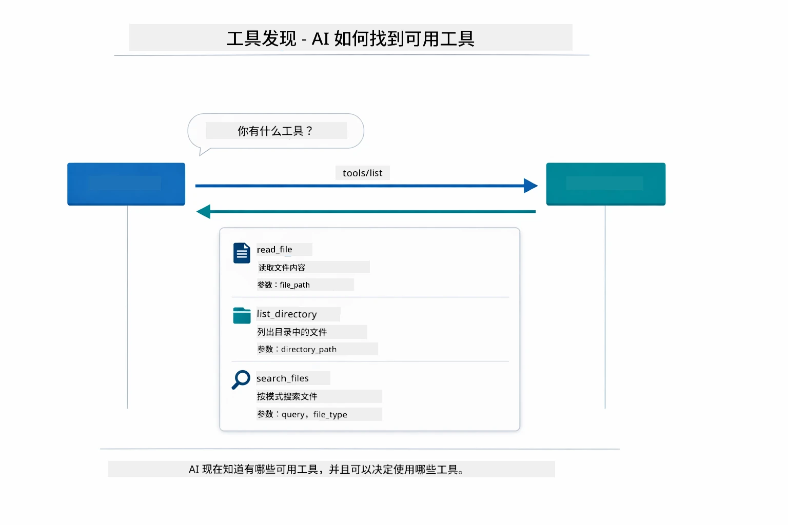

*AI 在启动时发现可用工具——它现在知道有哪些能力可用，并能决定使用哪些。*

**传输机制**

MCP 支持不同传输机制。本模块演示本地进程的 Stdio 传输：


*MCP 传输机制：远程服务器用 HTTP，本地进程用 Stdio*

**Stdio** - [StdioTransportDemo.java](../../../05-mcp/src/main/java/com/example/langchain4j/mcp/StdioTransportDemo.java)

适用于本地进程。你的应用作为子进程启动服务器，通过标准输入/输出通信。适合文件系统访问或命令行工具。

```java
McpTransport stdioTransport = new StdioMcpTransport.Builder()
    .command(List.of(
        npmCmd, "exec",
        "@modelcontextprotocol/server-filesystem@2025.12.18",
        resourcesDir
    ))
    .logEvents(false)
    .build();
```

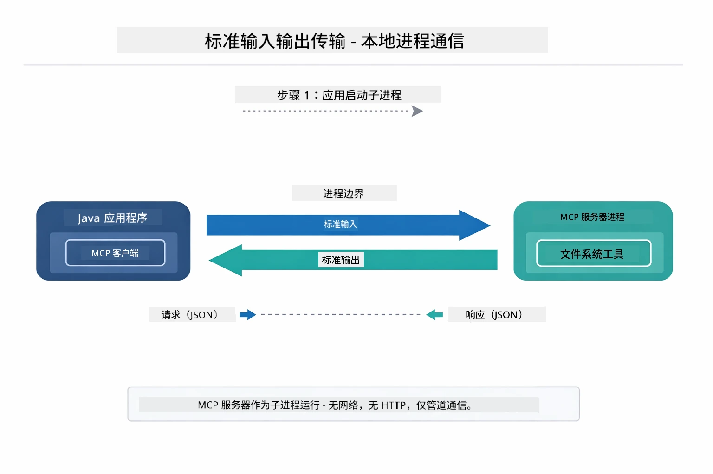

*Stdio 传输实例——应用启动 MCP 服务器作为子进程，通过 stdin/stdout 管道通信。*

> **🤖 使用 [GitHub Copilot](https://github.com/features/copilot) Chat 尝试：**打开 [`StdioTransportDemo.java`](../../../05-mcp/src/main/java/com/example/langchain4j/mcp/StdioTransportDemo.java) 并提问:
> - “Stdio 传输如何工作，什么情况下我应该用它而不是 HTTP？”
> - “LangChain4j 如何管理启动的 MCP 服务器进程的生命周期？”
> - “让 AI 访问文件系统会有哪些安全隐患？”

## Agentic 模块

虽然 MCP 提供了标准化工具，LangChain4j 的 **agentic 模块** 提供了一种声明式方式构建协调这些工具的代理。`@Agent` 注解和 `AgenticServices` 让你通过接口定义代理行为，而非命令式代码。

本模块将探索 **监督代理** 模式——一种高级 agentic AI 方法，其中“监督者”代理基于用户请求动态决定调用哪些子代理。我们将结合这两个概念，给其中一个子代理赋能 MCP 驱动的文件访问能力。

添加此 Maven 依赖以使用 agentic 模块：

```xml
<dependency>
    <groupId>dev.langchain4j</groupId>
    <artifactId>langchain4j-agentic</artifactId>
    <version>${langchain4j.mcp.version}</version>
</dependency>
```

> **⚠️ 实验性质：** `langchain4j-agentic` 模块为**实验性**且可能更改。构建 AI 助理的稳定方式仍是使用 `langchain4j-core` 配合自定义工具（模块 04）。

## 运行示例

### 先决条件

- Java 21+，Maven 3.9+
- Node.js 16+ 和 npm（用于 MCP 服务器）
- 在根目录的 `.env` 文件中配置环境变量：
  - `AZURE_OPENAI_ENDPOINT`，`AZURE_OPENAI_API_KEY`，`AZURE_OPENAI_DEPLOYMENT`（与模块 01-04 相同）

> **注意：** 如果尚未设置环境变量，请参见[模块 00 - 快速入门](../00-quick-start/README.md)获取说明，或者将根目录的 `.env.example` 复制为 `.env` 并填写你的值。

## 快速入门

**使用 VS Code：** 在资源管理器中右键单击任意演示文件，选择**“运行 Java”**，或使用运行和调试面板中的启动配置（确保先已在 `.env` 文件中添加令牌）。

**使用 Maven：** 也可以在命令行通过以下示例运行。

### 文件操作（Stdio）

此示例展示基于本地子进程的工具。

**✅ 无需先决条件** - MCP 服务器会自动启动。

**使用启动脚本（推荐）：**

启动脚本会自动从根目录 `.env` 文件加载环境变量：

**Bash：**
```bash
cd 05-mcp
chmod +x start-stdio.sh
./start-stdio.sh
```

**PowerShell：**
```powershell
cd 05-mcp
.\start-stdio.ps1
```

**使用 VS Code：** 右键单击 `StdioTransportDemo.java` 并选择**“运行 Java”**（确保 `.env` 已配置）。

应用自动启动文件系统 MCP 服务器并读取本地文件。注意子进程管理已帮你处理。

**预期输出：**
```
Assistant response: The file provides an overview of LangChain4j, an open-source Java library
for integrating Large Language Models (LLMs) into Java applications...
```

### 监督代理

**监督代理模式**是一种**灵活**的 agentic AI 形式。监督者使用大型语言模型（LLM）自主决定基于用户请求调用哪些代理。在下一个示例中，我们将结合 MCP 驱动的文件访问和 LLM 代理，创建一个受监督的文件读取→报告生成工作流。

演示中，`FileAgent` 使用 MCP 文件系统工具读取文件，`ReportAgent` 生成包含执行摘要（一句话）、3 个要点和建议的结构化报告。监督者自动协调此流程：

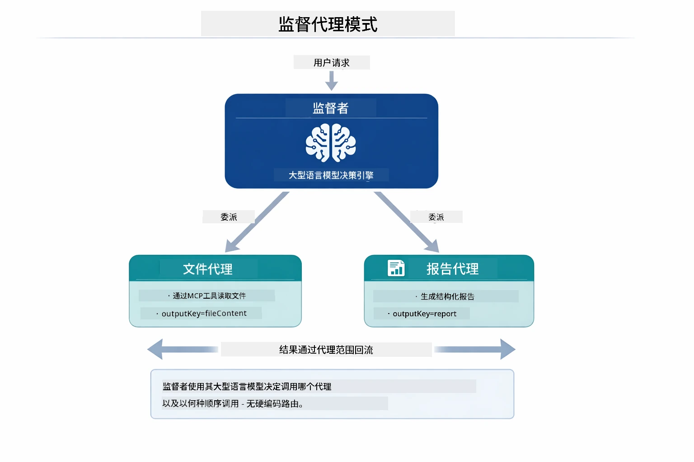

*监督者用其 LLM 决定调用哪些代理以及顺序——无需硬编码路由。*

具体的文件到报告流程如下图：

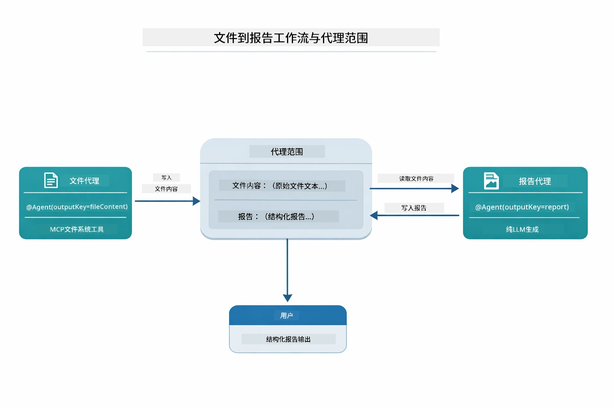

*FileAgent 通过 MCP 工具读取文件，然后 ReportAgent 将原始内容转成结构化报告。*

每个代理将其输出存储在**Agentic Scope**（共享内存）中，供后续代理访问前序结果。这展示了 MCP 工具如何无缝集成到 agentic 工作流中——监督者不需知道文件如何读取，只需知道 `FileAgent` 会做这件事。

#### 运行演示

启动脚本会自动从根目录 `.env` 文件加载环境变量：

**Bash：**
```bash
cd 05-mcp
chmod +x start-supervisor.sh
./start-supervisor.sh
```

**PowerShell：**
```powershell
cd 05-mcp
.\start-supervisor.ps1
```

**使用 VS Code：** 右键单击 `SupervisorAgentDemo.java` 并选择**“运行 Java”**（确保 `.env` 已配置）。

#### 监督者如何工作

```java
// 第一步：FileAgent 使用 MCP 工具读取文件
FileAgent fileAgent = AgenticServices.agentBuilder(FileAgent.class)
        .chatModel(model)
        .toolProvider(mcpToolProvider)  // 拥有用于文件操作的 MCP 工具
        .build();

// 第二步：ReportAgent 生成结构化报告
ReportAgent reportAgent = AgenticServices.agentBuilder(ReportAgent.class)
        .chatModel(model)
        .build();

// 主管协调文件 → 报告流程
SupervisorAgent supervisor = AgenticServices.supervisorBuilder()
        .chatModel(model)
        .subAgents(fileAgent, reportAgent)
        .responseStrategy(SupervisorResponseStrategy.LAST)  // 返回最终报告
        .build();

// 主管根据请求决定调用哪些代理
String response = supervisor.invoke("Read the file at /path/file.txt and generate a report");
```

#### 响应策略

配置 `SupervisorAgent` 时，你需要指定在子代理完成任务后，它如何向用户给出最终答案。

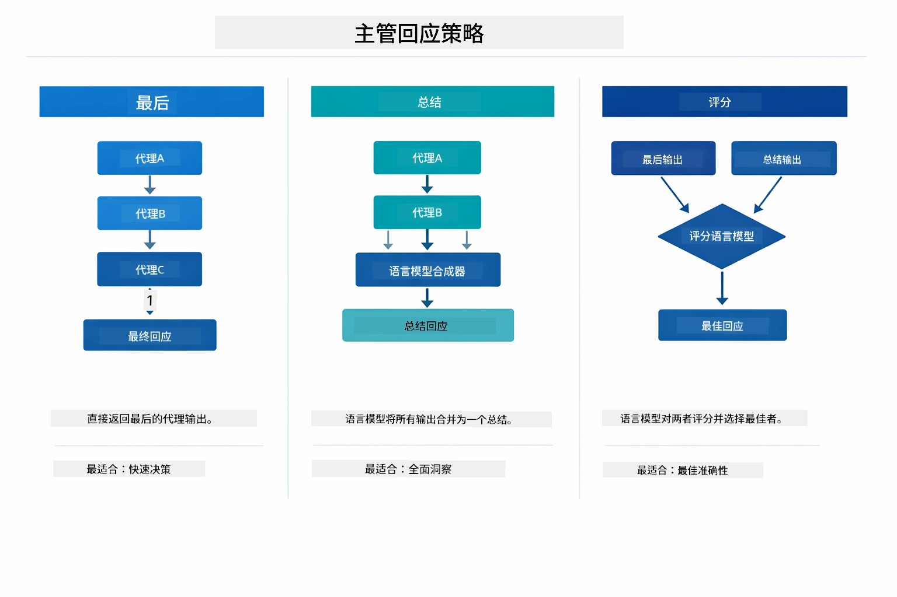

*3 种监督者生成最终响应的策略——根据你想要最后一个代理输出、合成摘要还是最高评分结果选择。*

可用策略包括：

| 策略     | 描述                                                        |
|----------|------------------------------------------------------------|
| **LAST** | 监督者返回最后调用的子代理或工具的输出。当工作流最后的代理专门设计用来产生完整的最终答案（如研究管线中的“摘要代理”）时，这非常有用。 |
| **SUMMARY** | 监督者使用其内部的语言模型（LLM）综合整个交互及所有子代理输出，返回该摘要作为最终响应。这为用户提供了简洁的聚合答案。 |
| **SCORED** | 系统使用内部 LLM 对最后响应和交互总结分别进行评分，返回得分较高的输出。 |

完整实现见 [SupervisorAgentDemo.java](../../../05-mcp/src/main/java/com/example/langchain4j/mcp/SupervisorAgentDemo.java)。

> **🤖 使用 [GitHub Copilot](https://github.com/features/copilot) Chat 尝试：**打开 [`SupervisorAgentDemo.java`](../../../05-mcp/src/main/java/com/example/langchain4j/mcp/SupervisorAgentDemo.java) 并提问:
> - “监督者如何决定调用哪些代理？”
> - “监督者和顺序工作流模式有什么区别？”
> - “我如何自定义监督者的计划行为？”

#### 理解输出

运行演示时，你会看到监督者如何协调多个代理的结构化演示。以下是每部分内容的含义：

```
======================================================================
  FILE → REPORT WORKFLOW DEMO
======================================================================

This demo shows a clear 2-step workflow: read a file, then generate a report.
The Supervisor orchestrates the agents automatically based on the request.
```

**标题**介绍工作流概念：从文件读取到报告生成的聚焦管线。

```
--- WORKFLOW ---------------------------------------------------------
  ┌─────────────┐      ┌──────────────┐
  │  FileAgent  │ ───▶ │ ReportAgent  │
  │ (MCP tools) │      │  (pure LLM)  │
  └─────────────┘      └──────────────┘
   outputKey:           outputKey:
   'fileContent'        'report'

--- AVAILABLE AGENTS -------------------------------------------------
  [FILE]   FileAgent   - Reads files via MCP → stores in 'fileContent'
  [REPORT] ReportAgent - Generates structured report → stores in 'report'
```

**工作流图**展示代理间的数据流。每个代理角色明确：
- **FileAgent** 使用 MCP 工具读取文件，原始内容存储在 `fileContent`
- **ReportAgent** 使用该内容生成结构化报告，存储在 `report`

```
--- USER REQUEST -----------------------------------------------------
  "Read the file at .../file.txt and generate a report on its contents"
```

**用户请求**显示任务。监督者解析后决定调用 FileAgent → ReportAgent。

```
--- SUPERVISOR ORCHESTRATION -----------------------------------------
  The Supervisor decides which agents to invoke and passes data between them...

  +-- STEP 1: Supervisor chose -> FileAgent (reading file via MCP)
  |
  |   Input: .../file.txt
  |
  |   Result: LangChain4j is an open-source, provider-agnostic Java framework for building LLM...
  +-- [OK] FileAgent (reading file via MCP) completed

  +-- STEP 2: Supervisor chose -> ReportAgent (generating structured report)
  |
  |   Input: LangChain4j is an open-source, provider-agnostic Java framew...
  |
  |   Result: Executive Summary...
  +-- [OK] ReportAgent (generating structured report) completed
```

**监督者协调**展示两步流程：
1. **FileAgent** 通过 MCP 读取文件并存储内容
2. **ReportAgent** 接收内容并生成结构化报告

监督者基于用户请求**自主**做出这些决策。

```
--- FINAL RESPONSE ---------------------------------------------------
Executive Summary
...

Key Points
...

Recommendations
...

--- AGENTIC SCOPE (Data Flow) ----------------------------------------
  Each agent stores its output for downstream agents to consume:
  * fileContent: LangChain4j is an open-source, provider-agnostic Java framework...
  * report: Executive Summary...
```

#### Agentic 模块功能解释

示例展示了 agentic 模块的多种高级功能。让我们深入看看 Agentic Scope 和 Agent 监听器。

**Agentic Scope** 是共享内存，代理通过 `@Agent(outputKey="...")` 存储结果。它允许：
- 后续代理访问前序输出
- 监督者综合最终响应
- 你查看每个代理输出内容

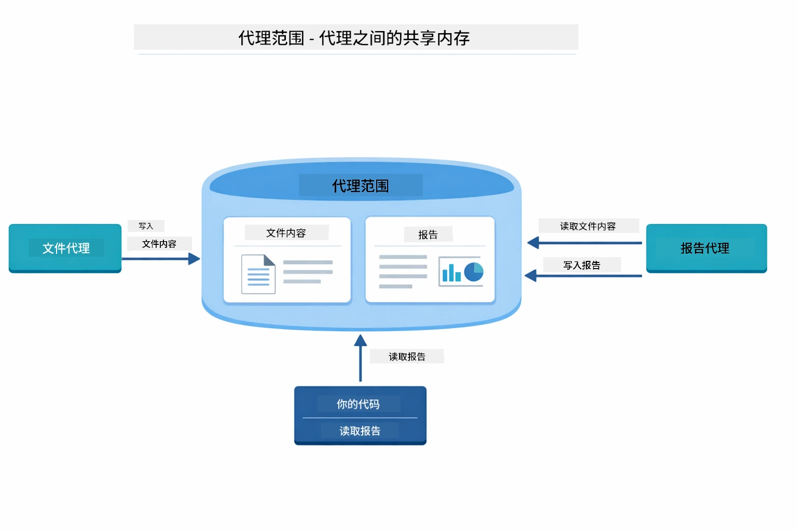

*Agentic Scope 充当共享内存——FileAgent 写入 `fileContent`，ReportAgent 读取它并写入 `report`，你的代码读取最终结果。*

```java
ResultWithAgenticScope<String> result = supervisor.invokeWithAgenticScope(request);
AgenticScope scope = result.agenticScope();
String fileContent = scope.readState("fileContent");  // 来自 FileAgent 的原始文件数据
String report = scope.readState("report");            // 来自 ReportAgent 的结构化报告
```

**Agent 监听器**使得监控和调试代理执行成为可能。演示中看到的逐步输出来自挂接每次代理调用的 AgentListener：
- **beforeAgentInvocation** - 当Supervisor选择代理时调用，让您了解选择了哪个代理及其原因
- **afterAgentInvocation** - 当代理完成时调用，显示其结果
- **inheritedBySubagents** - 为true时，监听器监控层级中的所有代理

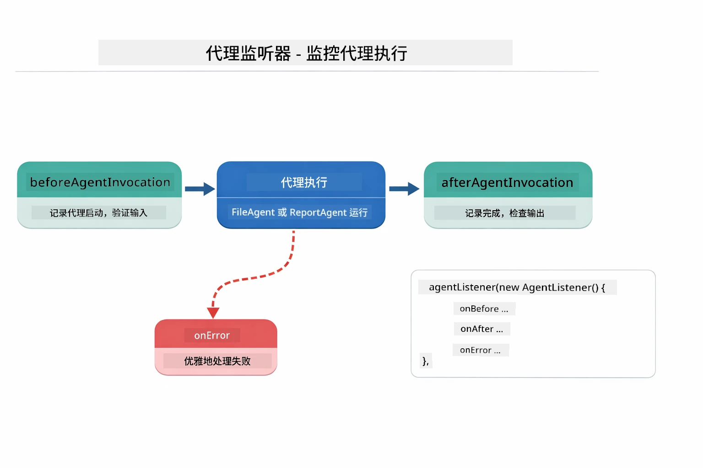

*代理监听器挂钩执行生命周期——监控代理何时开始、完成或遇到错误。*

```java
AgentListener monitor = new AgentListener() {
    private int step = 0;
    
    @Override
    public void beforeAgentInvocation(AgentRequest request) {
        step++;
        System.out.println("  +-- STEP " + step + ": " + request.agentName());
    }
    
    @Override
    public void afterAgentInvocation(AgentResponse response) {
        System.out.println("  +-- [OK] " + response.agentName() + " completed");
    }
    
    @Override
    public boolean inheritedBySubagents() {
        return true; // 传播到所有子代理
    }
};
```

除了Supervisor模式外，`langchain4j-agentic`模块还提供了几种强大的工作流模式和功能：

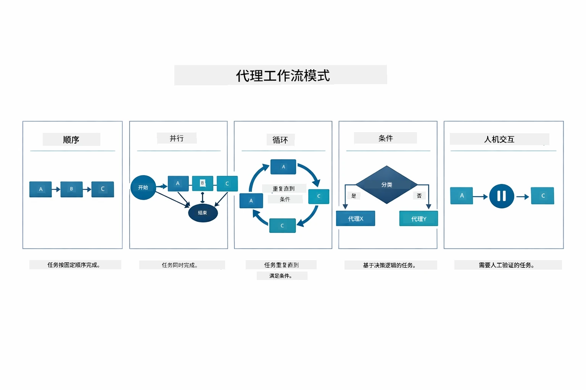

*五种代理编排工作流模式——从简单的顺序流水线到人工干预审批工作流。*

| Pattern | Description | Use Case |
|---------|-------------|----------|
| **Sequential** | 按顺序执行代理，输出流向下一个 | 流水线：研究 → 分析 → 报告 |
| **Parallel** | 同时运行多个代理 | 独立任务：天气 + 新闻 + 股票 |
| **Loop** | 迭代直到满足条件 | 质量评分：重复优化直到得分 ≥ 0.8 |
| **Conditional** | 基于条件路由 | 分类 → 路由到专家代理 |
| **Human-in-the-Loop** | 增加人工检查点 | 审批工作流，内容审核 |

## 关键概念

现在您已经了解了MCP和agentic模块的实际应用，让我们总结何时使用每种方法。

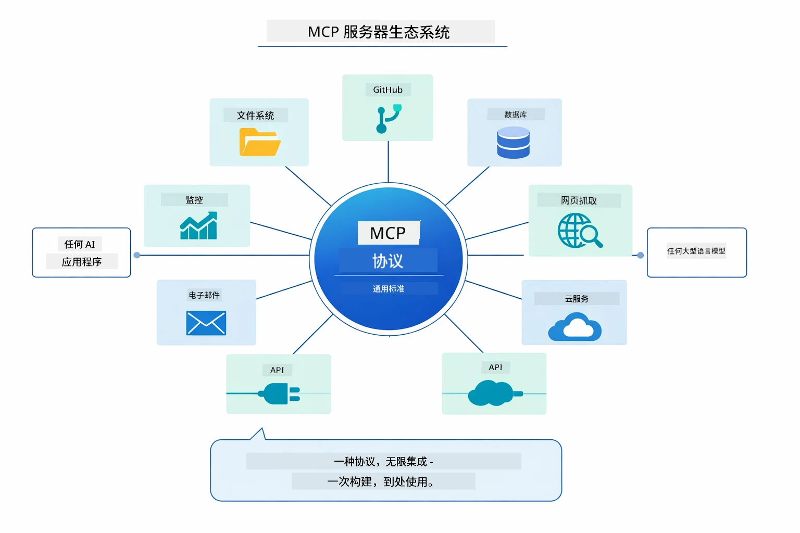

*MCP构建了一个通用协议生态系统——任何兼容MCP的服务器都可与任何兼容MCP的客户端协作，实现跨应用的工具共享。*

**MCP** 适合想利用现有工具生态、构建多应用共享的工具、用标准协议集成第三方服务，或想替换工具实现而无需改代码的场景。

**Agentic模块** 最适合需要用`@Agent`注解定义声明式代理、需要工作流编排（顺序、循环、并行）、偏好基于接口的代理设计而非命令式代码，或组合多个共享`outputKey`输出的代理的情况。

**Supervisor Agent模式** 适用于流程事先不可预测且希望由LLM决定、需要动态编排多名专门代理、构建可路由到不同能力的对话系统，或想要最灵活、适应性强的代理行为时。

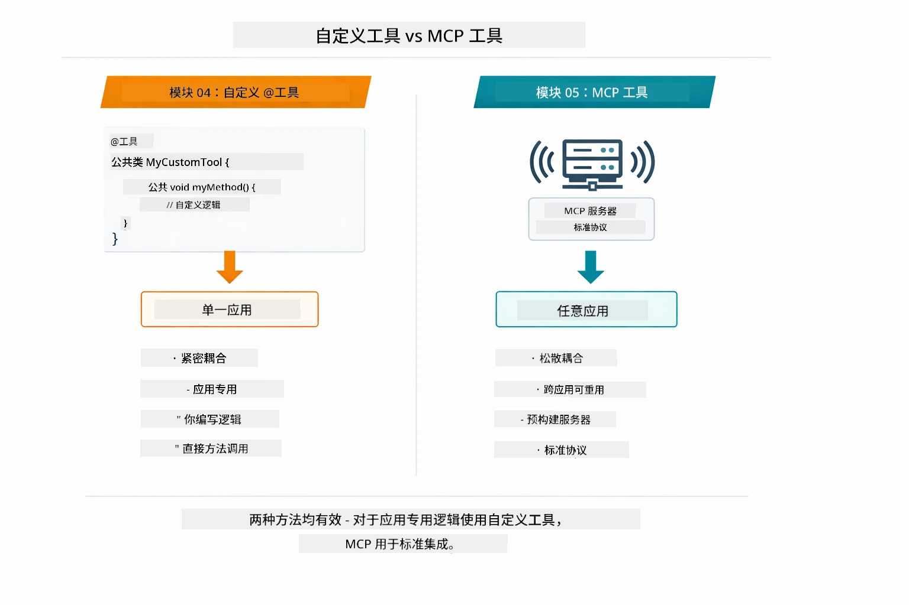

*何时使用自定义@Tool方法与MCP工具——自定义工具适合应用特定逻辑，提供完整类型安全；MCP工具适合标准化集成，支持跨应用使用。*

## 恭喜！

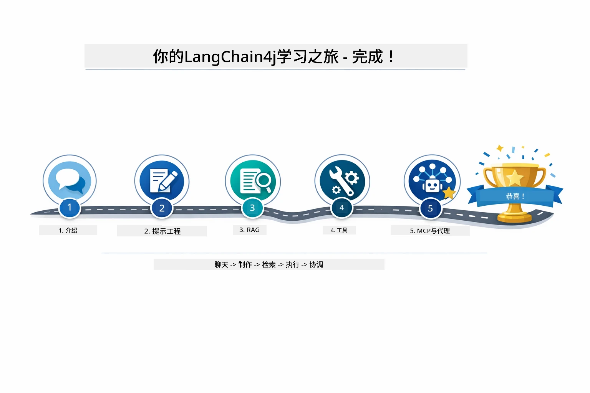

*您已经完成了从基础聊天到MCP驱动的agentic系统的五个模块学习旅程。*

您已完成LangChain4j初学者课程，学到了：

- 如何构建带记忆的对话AI（模块01）
- 针对不同任务的提示工程模式（模块02）
- 利用RAG将回答基于文档落地（模块03）
- 创建带自定义工具的基础AI代理（助手）（模块04）
- 使用LangChain4j MCP和Agentic模块集成标准工具（模块05）

### 下一步？

完成模块后，探索[测试指南](../docs/TESTING.md)，了解LangChain4j测试概念实操。

**官方资源：**
- [LangChain4j文档](https://docs.langchain4j.dev/) - 详尽指南与API参考
- [LangChain4j GitHub](https://github.com/langchain4j/langchain4j) - 源代码和示例
- [LangChain4j教程](https://docs.langchain4j.dev/tutorials/) - 各种用例的分步教程

感谢您完成本课程！

---

**导航：** [← 上一节：模块04 - 工具](../04-tools/README.md) | [返回主菜单](../README.md)

---

<!-- CO-OP TRANSLATOR DISCLAIMER START -->
**免责声明**：
本文件由人工智能翻译服务[Co-op Translator](https://github.com/Azure/co-op-translator)翻译而成。尽管我们力求准确，但请注意自动翻译可能包含错误或不准确之处。原始文件的本地语言版本应被视为权威来源。对于重要信息，建议采用专业人工翻译。我们不对因使用此翻译而产生的任何误解或错误解释承担责任。
<!-- CO-OP TRANSLATOR DISCLAIMER END -->