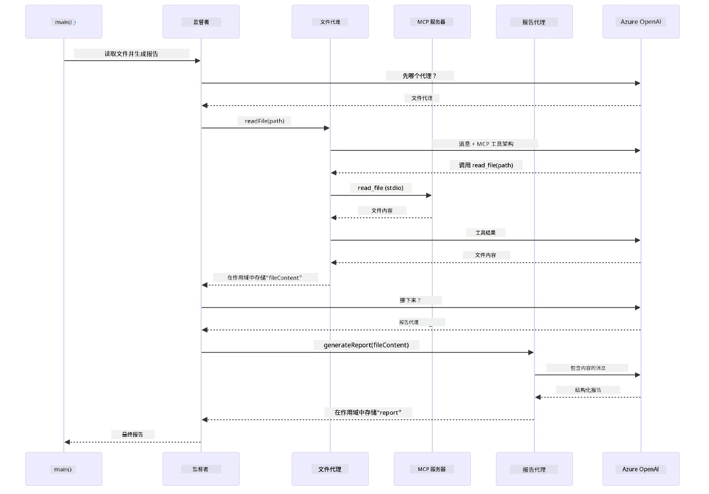

# Module 05：模型上下文协议（MCP）

## 目录

- [视频讲解](../../../05-mcp)
- [你将学到什么](../../../05-mcp)
- [什么是MCP？](../../../05-mcp)
- [MCP如何工作](../../../05-mcp)
- [Agentic模块](../../../05-mcp)
- [运行示例](../../../05-mcp)
  - [先决条件](../../../05-mcp)
- [快速开始](../../../05-mcp)
  - [文件操作（Stdio）](../../../05-mcp)
  - [Supervisor代理](../../../05-mcp)
    - [运行演示](../../../05-mcp)
    - [Supervisor如何工作](../../../05-mcp)
    - [FileAgent如何在运行时发现MCP工具](../../../05-mcp)
    - [响应策略](../../../05-mcp)
    - [理解输出](../../../05-mcp)
    - [Agentic模块功能说明](../../../05-mcp)
- [关键概念](../../../05-mcp)
- [恭喜！](../../../05-mcp)
  - [接下来是什么？](../../../05-mcp)

## 视频讲解

观看此直播环节，了解如何开始本模块：

<a href="https://www.youtube.com/watch?v=O_J30kZc0rw"></a>

## 你将学到什么

你已经构建了对话式AI，掌握了提示工程，在文档中构建了有据可依的回应，并创建了带工具的代理。但所有这些工具都是为你的特定应用定制构建的。如果你能让你的AI访问一个由任何人都可以创建和共享的标准化工具生态系统呢？在本模块中，你将学习如何使用模型上下文协议（MCP）和LangChain4j的agentic模块实现这一点。我们首先展示一个简单的MCP文件读取器，然后展示它如何轻松集成到使用Supervisor代理模式的高级agentic工作流中。

## 什么是MCP？

模型上下文协议（MCP）正是为此而设计——为AI应用提供一种标准化方式来发现和使用外部工具。你不再需要为每个数据源或服务编写定制集成，而是连接到以一致格式暴露其功能的MCP服务器。你的AI代理即可自动发现并使用这些工具。

下面的图示展示了区别——没有MCP时，每个集成都需要定制点对点连接；有了MCP，单一协议即可连接你的应用和任何工具：


*MCP之前：复杂的点对点集成。MCP之后：一个协议，无限可能。*

MCP解决了AI开发中的一个根本性问题：每个集成都需要定制。想访问GitHub？定制代码。想读取文件？定制代码。想查询数据库？定制代码。而且这些集成都不能与其他AI应用共享。

MCP对此进行了标准化。一个MCP服务器会用清晰的描述和模式暴露工具，任何MCP客户端都可以连接、发现可用工具并使用它们。一次构建，处处可用。

下面的架构图说明了这一点——单个MCP客户端（你的AI应用）连接多个MCP服务器，每个服务器通过标准协议暴露自己的一组工具：


*模型上下文协议架构——标准化的工具发现与执行*

## MCP如何工作

在底层，MCP使用分层架构。你的Java应用（MCP客户端）发现可用工具，通过传输层（Stdio或HTTP）发送JSON-RPC请求，MCP服务器执行操作并返回结果。下图分解了该协议的各层：


*MCP底层工作方式——客户端发现工具，交换JSON-RPC消息，通过传输层执行操作。*

**服务器-客户端架构**

MCP使用客户端-服务器模型。服务器提供工具——读取文件、查询数据库、调用API。客户端（你的AI应用）连接服务器并使用其工具。

要在LangChain4j中使用MCP，添加以下Maven依赖：

```xml
<dependency>
    <groupId>dev.langchain4j</groupId>
    <artifactId>langchain4j-mcp</artifactId>
    <version>${langchain4j.version}</version>
</dependency>
```

**工具发现**

当你的客户端连接到MCP服务器时，它会询问“你有什么工具？”服务器则返回可用工具列表，每个工具都带有描述和参数模式。你的AI代理随后可以根据用户请求决定使用哪些工具。下图展示了这个握手过程——客户端发送`tools/list`请求，服务器返回其可用工具和描述及参数模式：


*AI在启动时发现可用工具——它现在知道有哪些功能可用，并能决定使用哪些。*

**传输机制**

MCP支持不同的传输机制。两种选项是Stdio（用于本地子进程通信）和可流式HTTP（用于远程服务器）。本模块演示Stdio传输：


*MCP传输机制：HTTP用于远程服务器，Stdio用于本地进程*

**Stdio** - [StdioTransportDemo.java](../../../05-mcp/src/main/java/com/example/langchain4j/mcp/StdioTransportDemo.java)

用于本地进程。你的应用作为子进程启动服务器，通过标准输入/输出通信。适用于文件系统访问或命令行工具。

```java
McpTransport stdioTransport = new StdioMcpTransport.Builder()
    .command(List.of(
        npmCmd, "exec",
        "@modelcontextprotocol/server-filesystem@2025.12.18",
        resourcesDir
    ))
    .logEvents(false)
    .build();
```

`@modelcontextprotocol/server-filesystem`服务器暴露以下工具，均限制在你指定的目录中：

| 工具 | 描述 |
|------|------|
| `read_file` | 读取单个文件内容 |
| `read_multiple_files` | 一次读取多个文件 |
| `write_file` | 创建或覆盖文件 |
| `edit_file` | 进行有针对性的查找替换修改 |
| `list_directory` | 列出路径下的文件和目录 |
| `search_files` | 递归搜索匹配模式的文件 |
| `get_file_info` | 获取文件元数据（大小、时间戳、权限） |
| `create_directory` | 创建目录（包含父目录） |
| `move_file` | 移动或重命名文件或目录 |

下图展示了Stdio传输运行时的工作方式——你的Java应用作为子进程启动MCP服务器，并通过stdin/stdout管道通信，无需网络或HTTP：


*Stdio传输实战——你的应用作为子进程启动MCP服务器，通过stdin/stdout管道通信。*

> **🤖 试试用[GitHub Copilot](https://github.com/features/copilot)聊天功能：** 打开 [`StdioTransportDemo.java`](../../../05-mcp/src/main/java/com/example/langchain4j/mcp/StdioTransportDemo.java) 并提问：
> - “Stdio传输如何工作？它适合什么时候用，和HTTP相比有何区别？”
> - “LangChain4j如何管理启动的MCP服务器进程生命周期？”
> - “让AI访问文件系统有什么安全隐患？”

## Agentic模块

尽管MCP提供了标准化工具，LangChain4j的**agentic模块**则提供了一种声明式方式来构建编排这些工具的代理。`@Agent`注解和`AgenticServices`允许你通过接口定义代理行为，而不用编写命令式代码。

在本模块中，你将探索**Supervisor代理**模式——一种高级agentic AI方法，其中一个“supervisor”代理根据用户请求动态决定调用哪些子代理。我们将结合这两个概念，让一个子代理具备基于MCP的文件访问能力。

要使用agentic模块，添加以下Maven依赖：

```xml
<dependency>
    <groupId>dev.langchain4j</groupId>
    <artifactId>langchain4j-agentic</artifactId>
    <version>${langchain4j.mcp.version}</version>
</dependency>
```
> **注意：** `langchain4j-agentic`模块使用单独的版本属性（`langchain4j.mcp.version`），因为它的发布节奏与LangChain4j核心库不同。

> **⚠️ 实验性：** `langchain4j-agentic`模块处于**实验阶段**，功能可能会发生变化。构建AI助手的稳定方式仍是使用`langchain4j-core`和自定义工具（参考Module 04）。

## 运行示例

### 先决条件

- 完成了[Module 04 - Tools](../04-tools/README.md)（本模块基于自定义工具概念并与MCP工具进行对比）
- 根目录有`.env`文件，包含Azure凭据（由Module 01中的`azd up`创建）
- Java 21+，Maven 3.9+
- Node.js 16+ 和 npm（用于MCP服务器）

> **注意：** 如果你还未设置环境变量，参见[Module 01 - 介绍](../01-introduction/README.md)了解部署说明（`azd up`会自动创建`.env`文件），或者复制`.env.example`到根目录的`.env`并填写内容。

## 快速开始

**使用VS Code：** 在资源管理器中右键任意示例文件，选择**“运行Java”**，或使用运行和调试面板中的启动配置（确保你的`.env`文件配置了Azure凭据）。

**使用Maven：** 也可在命令行运行下面的示例。

### 文件操作（Stdio）

演示基于本地子进程的工具。

**✅ 无需先决条件**——MCP服务器会自动启动。

**使用启动脚本（推荐）：**

启动脚本会自动从根目录`.env`文件加载环境变量：

**Bash:**
```bash
cd 05-mcp
chmod +x start-stdio.sh
./start-stdio.sh
```

**PowerShell:**
```powershell
cd 05-mcp
.\start-stdio.ps1
```

**使用VS Code：** 右键`StdioTransportDemo.java`选择**“运行Java”**（确保配置了`.env`文件）。

应用自动启动文件系统MCP服务器并读取本地文件。注意它自动管理子进程。

**预期输出：**
```
Assistant response: The file provides an overview of LangChain4j, an open-source Java library
for integrating Large Language Models (LLMs) into Java applications...
```

### Supervisor代理

**Supervisor代理模式**是一种**灵活**的agentic AI形式。Supervisor使用LLM自主决定根据用户请求调用哪些代理。接下来的示例将结合基于MCP的文件访问和LLM代理，创建一个受监督的文件读取→报告工作流。

演示中`FileAgent`使用MCP文件系统工具读取文件，`ReportAgent`生成结构化报告，包括执行摘要（一句话）、3个要点和建议。Supervisor自动编排这个流程：


*Supervisor用其LLM决定调用哪些代理及顺序——无需硬编码路由。*

这是我们的文件到报告管道的具体工作流：


*FileAgent通过MCP工具读取文件，然后ReportAgent将原始内容转换为结构化报告。*

下图序列图跟踪完整的Supervisor编排流程——从启动MCP服务器，到Supervisor的自主代理选择，再到通过stdio调用工具和最终报告生成：



*Supervisor自主调用FileAgent（其通过stdio调用MCP服务器读取文件），然后调用ReportAgent生成结构化报告——每个代理都将输出存储在共享的Agentic作用域。*

每个代理的输出都存储在**Agentic作用域**（共享内存）中，允许后续代理访问之前的结果。这展示了MCP工具如何无缝集成到agentic工作流中——Supervisor不需要知道*文件如何被读取*，只要知道`FileAgent`可以读取即可。

#### 运行演示

启动脚本会自动从根目录`.env`文件加载环境变量：

**Bash:**
```bash
cd 05-mcp
chmod +x start-supervisor.sh
./start-supervisor.sh
```

**PowerShell:**
```powershell
cd 05-mcp
.\start-supervisor.ps1
```

**使用VS Code：** 右键`SupervisorAgentDemo.java`选择**“运行Java”**（确保配置了`.env`文件）。

#### Supervisor如何工作

在构建代理前，你需要将MCP传输连接到客户端并将其包装为`ToolProvider`。这样MCP服务器的工具才能对你的代理可用：

```java
// 从传输创建一个MCP客户端
McpClient mcpClient = new DefaultMcpClient.Builder()
        .transport(stdioTransport)
        .build();

// 将客户端包装为ToolProvider — 这将MCP工具桥接到LangChain4j中
ToolProvider mcpToolProvider = McpToolProvider.builder()
        .mcpClients(List.of(mcpClient))
        .build();
```

现在你可以将`mcpToolProvider`注入任何需要MCP工具的代理：

```java
// 第1步：FileAgent 使用 MCP 工具读取文件
FileAgent fileAgent = AgenticServices.agentBuilder(FileAgent.class)
        .chatModel(model)
        .toolProvider(mcpToolProvider)  // 具有用于文件操作的 MCP 工具
        .build();

// 第2步：ReportAgent 生成结构化报告
ReportAgent reportAgent = AgenticServices.agentBuilder(ReportAgent.class)
        .chatModel(model)
        .build();

// 主管协调文件到报告的工作流程
SupervisorAgent supervisor = AgenticServices.supervisorBuilder()
        .chatModel(model)
        .subAgents(fileAgent, reportAgent)
        .responseStrategy(SupervisorResponseStrategy.LAST)  // 返回最终报告
        .build();

// 主管根据请求决定调用哪些代理
String response = supervisor.invoke("Read the file at /path/file.txt and generate a report");
```

#### FileAgent如何在运行时发现MCP工具

你可能会问：**`FileAgent`如何知道如何使用npm文件系统工具？** 答案是它不知道——由**LLM**通过工具模式在运行时自行推断。
`FileAgent` 接口只是一个**提示定义**。它没有对 `read_file`、`list_directory` 或任何其他 MCP 工具的硬编码知识。端到端的流程如下：

1. **服务器启动：** `StdioMcpTransport` 启动 `@modelcontextprotocol/server-filesystem` npm 包作为子进程
2. **工具发现：** `McpClient` 向服务器发送 `tools/list` JSON-RPC 请求，服务器返回工具名称、描述和参数模式（例如，`read_file` — *“读取文件的完整内容”* — `{ path: string }`）
3. **模式注入：** `McpToolProvider` 包装这些发现的模式并将其提供给 LangChain4j
4. **LLM 决策：** 调用 `FileAgent.readFile(path)` 时，LangChain4j 将系统消息、用户消息以及工具模式列表发送给 LLM。LLM 读取工具描述并生成工具调用（例如，`read_file(path="/some/file.txt")`）
5. **执行：** LangChain4j 拦截工具调用，通过 MCP 客户端路由回 Node.js 子进程，获取结果并反馈给 LLM

这就是上面描述的相同[工具发现](../../../05-mcp)机制，但专门应用于代理工作流程。`@SystemMessage` 和 `@UserMessage` 注解指导 LLM 的行为，而注入的 `ToolProvider` 赋予它**能力**——LLM 在运行时桥接两者。

> **🤖 试试用 [GitHub Copilot](https://github.com/features/copilot) 聊天：** 打开 [`FileAgent.java`](../../../05-mcp/src/main/java/com/example/langchain4j/mcp/agents/FileAgent.java) 并提问：
> - “这个代理怎么知道调用哪个 MCP 工具？”
> - “如果我从代理构建器中移除 ToolProvider 会发生什么？”
> - “工具模式如何传递给 LLM？”

#### 响应策略

配置 `SupervisorAgent` 时，可指定子代理完成任务后如何形成最终答复。下图显示了三种可用策略——LAST 直接返回最终代理的输出，SUMMARY 通过 LLM 综合所有输出，SCORED 根据原始请求评分选择得分更高的输出：


*Supervisor 形成最终响应的三种策略——根据你是想要最后代理的输出、综合摘要还是评分最佳选项来选择。*

可用策略有：

| 策略      | 描述                                                                                                     |
|-----------|--------------------------------------------------------------------------------------------------------|
| **LAST**  | 监督者返回最后调用的子代理或工具的输出。当工作流中的最终代理专门设计用于生成完整最终答案时很有用（例如研究流程中的“摘要代理”）。          |
| **SUMMARY** | 监督者使用其内部语言模型 (LLM) 合成整个交互和所有子代理输出的摘要，然后返回该摘要作为最终响应。这提供了给用户的清晰汇总答案。         |
| **SCORED** | 系统使用内部 LLM 对 LAST 响应和交互摘要两者根据原始用户请求进行评分，返回得分更高的输出。                                       |

完整实现见 [SupervisorAgentDemo.java](../../../05-mcp/src/main/java/com/example/langchain4j/mcp/SupervisorAgentDemo.java)。

> **🤖 试试用 [GitHub Copilot](https://github.com/features/copilot) 聊天：** 打开 [`SupervisorAgentDemo.java`](../../../05-mcp/src/main/java/com/example/langchain4j/mcp/SupervisorAgentDemo.java) 并提问：
> - “Supervisor 怎么决定调用哪些代理？”
> - “Supervisor 和 Sequential 工作流模式有什么区别？”
> - “如何自定义 Supervisor 的规划行为？”

#### 理解输出

运行演示时，你会看到 Supervisor 如何组织多个代理的结构化演示。各部分含义如次：

```
======================================================================
  FILE → REPORT WORKFLOW DEMO
======================================================================

This demo shows a clear 2-step workflow: read a file, then generate a report.
The Supervisor orchestrates the agents automatically based on the request.
```

**标题**介绍工作流概念：一个从文件读取到报告生成的专注流程。

```
--- WORKFLOW ---------------------------------------------------------
  ┌─────────────┐      ┌──────────────┐
  │  FileAgent  │ ───▶ │ ReportAgent  │
  │ (MCP tools) │      │  (pure LLM)  │
  └─────────────┘      └──────────────┘
   outputKey:           outputKey:
   'fileContent'        'report'

--- AVAILABLE AGENTS -------------------------------------------------
  [FILE]   FileAgent   - Reads files via MCP → stores in 'fileContent'
  [REPORT] ReportAgent - Generates structured report → stores in 'report'
```

**工作流图**展示代理之间的数据流。每个代理有特定角色：
- **FileAgent** 使用 MCP 工具读取文件并将原始内容存入 `fileContent`
- **ReportAgent** 消费这些内容并生成结构化报告存入 `report`

```
--- USER REQUEST -----------------------------------------------------
  "Read the file at .../file.txt and generate a report on its contents"
```

**用户请求**展示任务内容。Supervisor 解析该请求并决定调用 FileAgent → ReportAgent。

```
--- SUPERVISOR ORCHESTRATION -----------------------------------------
  The Supervisor decides which agents to invoke and passes data between them...

  +-- STEP 1: Supervisor chose -> FileAgent (reading file via MCP)
  |
  |   Input: .../file.txt
  |
  |   Result: LangChain4j is an open-source, provider-agnostic Java framework for building LLM...
  +-- [OK] FileAgent (reading file via MCP) completed

  +-- STEP 2: Supervisor chose -> ReportAgent (generating structured report)
  |
  |   Input: LangChain4j is an open-source, provider-agnostic Java framew...
  |
  |   Result: Executive Summary...
  +-- [OK] ReportAgent (generating structured report) completed
```

**Supervisor 编排**展示两步流程：
1. **FileAgent** 通过 MCP 读取文件并存储内容
2. **ReportAgent** 接收内容并生成结构化报告

Supervisor 根据用户请求**自主**作出这些决策。

```
--- FINAL RESPONSE ---------------------------------------------------
Executive Summary
...

Key Points
...

Recommendations
...

--- AGENTIC SCOPE (Data Flow) ----------------------------------------
  Each agent stores its output for downstream agents to consume:
  * fileContent: LangChain4j is an open-source, provider-agnostic Java framework...
  * report: Executive Summary...
```

#### Agentic 模块特性的说明

示例演示了 agentic 模块的若干高级特性。我们重点看看 Agentic Scope 和 Agent Listeners。

**Agentic Scope** 展示了代理通过 `@Agent(outputKey="...")` 保存结果的共享内存。它允许：
- 后续代理访问之前代理的输出
- Supervisor 综合最终答复
- 你检查每个代理的产出

下图示意 Agentic Scope 如何在文件到报告的工作流中作为共享内存工作——FileAgent 在键 `fileContent` 处写输出，ReportAgent 读取它并在 `report` 处写入自己的输出：


*Agentic Scope 作为共享内存——FileAgent 写入 `fileContent`，ReportAgent 读取并写入 `report`，你的代码读取最终结果。*

```java
ResultWithAgenticScope<String> result = supervisor.invokeWithAgenticScope(request);
AgenticScope scope = result.agenticScope();
String fileContent = scope.readState("fileContent");  // 来自FileAgent的原始文件数据
String report = scope.readState("report");            // 来自ReportAgent的结构化报告
```

**Agent Listeners** 支持对代理执行过程的监控和调试。演示中看到的逐步输出来自一个钩入每个代理调用的 AgentListener：
- **beforeAgentInvocation** - 监督者选定代理时调用，你能看到选中哪个代理及原因
- **afterAgentInvocation** - 代理完成时调用，显示结果
- **inheritedBySubagents** - 为真时，监听代理层级中的所有代理

下图展示完整的 Agent Listener 生命周期，包括 `onError` 如何处理执行过程出错：


*Agent Listeners 钩入执行生命周期——监控代理何时启动、完成或遇到错误。*

```java
AgentListener monitor = new AgentListener() {
    private int step = 0;
    
    @Override
    public void beforeAgentInvocation(AgentRequest request) {
        step++;
        System.out.println("  +-- STEP " + step + ": " + request.agentName());
    }
    
    @Override
    public void afterAgentInvocation(AgentResponse response) {
        System.out.println("  +-- [OK] " + response.agentName() + " completed");
    }
    
    @Override
    public boolean inheritedBySubagents() {
        return true; // 传播到所有子代理
    }
};
```

除了 Supervisor 模式，`langchain4j-agentic` 模块还提供多种强大工作流模式。下图显示全部五种——从简单顺序流水线到人类参与审批工作流：


*组织代理的五种工作流模式——从简单顺序流水线到人类参与审批工作流。*

| 模式             | 描述                  | 用例                         |
|------------------|-----------------------|------------------------------|
| **Sequential**   | 按顺序执行代理，输出流向下一步 | 流水线：调研 → 分析 → 报告       |
| **Parallel**     | 同时运行多个代理          | 独立任务：天气 + 新闻 + 股票       |
| **Loop**         | 迭代直到满足条件          | 质量评分：细化直到分数≥0.8          |
| **Conditional**  | 根据条件路由             | 分类 → 路由到专家代理          |
| **Human-in-the-Loop** | 加入人工检查点          | 审批流程，内容审查             |

## 关键概念

现在你已经体验了 MCP 和 agentic 模块动作，让我们总结何时使用每种方法。

MCP 最大优势之一是其日益壮大的生态系统。下图展示了一个通用协议如何连接你的 AI 应用和各种 MCP 服务器——从文件系统和数据库访问到 GitHub、邮件、网页抓取等：


*MCP 创建了通用协议生态系统——任何 MCP 兼容服务器都可和任何 MCP 兼容客户端协作，实现跨应用的工具共享。*

**MCP** 适合想利用现有工具生态、构建多应用共享工具、集成基于标准协议的第三方服务，或想更换工具实现而不改代码的场景。

**Agentic 模块** 最适用于希望用 `@Agent` 注解声明代理定义、需要工作流编排（顺序、循环、并行）、偏好基于接口设计代理而非命令式代码，或要组合多个通过 `outputKey` 共享输出的代理。

**Supervisor Agent 模式** 在工作流无法预先确定、希望由 LLM 决策、有多个专门代理需要动态编排、构建路由不同能力的对话系统，或想要最灵活适应性代理行为时最为出彩。

为了帮你在模块 04 的自定义 `@Tool` 方法和本模块 MCP 工具间做选择，下面对比了主要权衡——自定义工具提供紧耦合和完整类型安全以实现应用专属逻辑，MCP 工具则提供标准化、可复用集成：


*何时用自定义 @Tool 方法 vs MCP 工具——自定义工具适合应用专属逻辑且需要完整类型安全，MCP 工具适合跨应用的标准化集成。*

## 恭喜！

你已经完成 LangChain4j 初学者课程的五个模块！以下是你走过的完整学习历程——从基础聊天到 MCP 驱动的 agentic 系统：


*你学完所有五个模块的学习旅程——从基础聊天到 MCP 驱动的 agentic 系统。*

你已经掌握了：

- 如何构建带记忆的对话 AI（模块 01）
- 不同任务的提示工程模式（模块 02）
- 用 RAG 将回复基础设定在你的文档中（模块 03）
- 用自定义工具创建基本 AI 代理（助手）（模块 04）
- 用 LangChain4j MCP 和 Agentic 模块集成标准化工具（模块 05）

### 接下来做什么？

完成模块后，探索[测试指南](../docs/TESTING.md)，体验 LangChain4j 的测试理念和实践。

**官方资源：**
- [LangChain4j 文档](https://docs.langchain4j.dev/) - 全面指南和 API 参考
- [LangChain4j GitHub](https://github.com/langchain4j/langchain4j) - 源代码和示例
- [LangChain4j 教程](https://docs.langchain4j.dev/tutorials/) - 各类用例的分步教程

感谢你完成本课程！

---

**导航：** [← 上一章：模块 04 - 工具](../04-tools/README.md) | [返回主页](../README.md)

---

<!-- CO-OP TRANSLATOR DISCLAIMER START -->
**免责声明**：
本文件使用 AI 翻译服务 [Co-op Translator](https://github.com/Azure/co-op-translator) 进行翻译。虽然我们力求准确，但请注意自动翻译可能包含错误或不准确之处。原文的母语版本应被视为权威来源。对于重要信息，建议采用专业人工翻译。我们不对因使用本翻译而产生的任何误解或误释承担责任。
<!-- CO-OP TRANSLATOR DISCLAIMER END -->