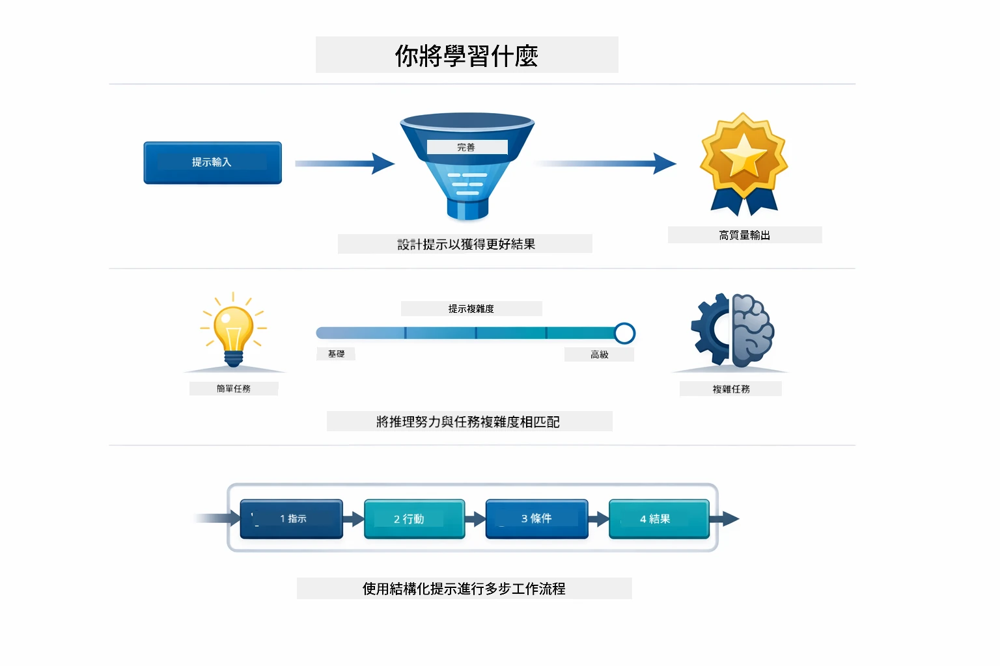
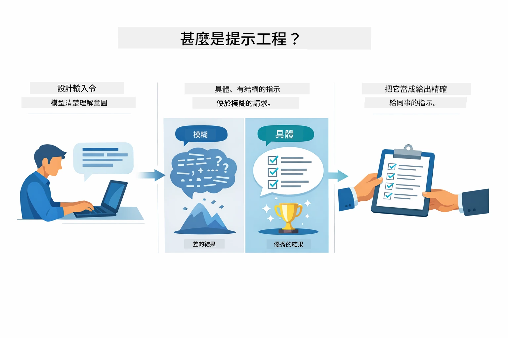
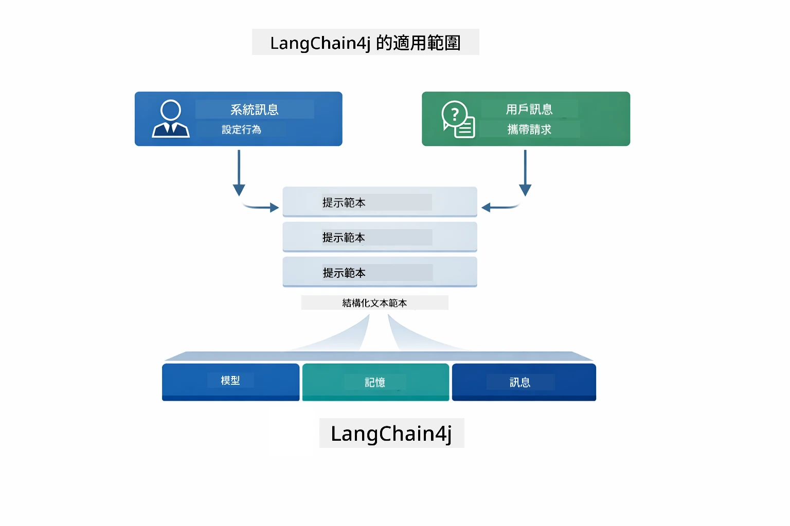
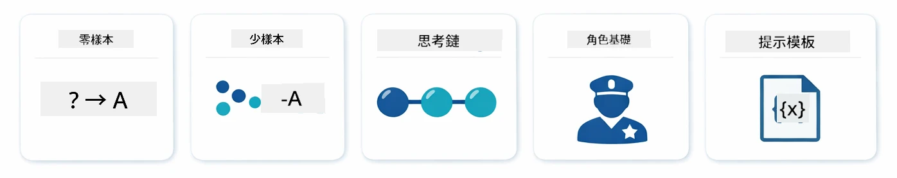
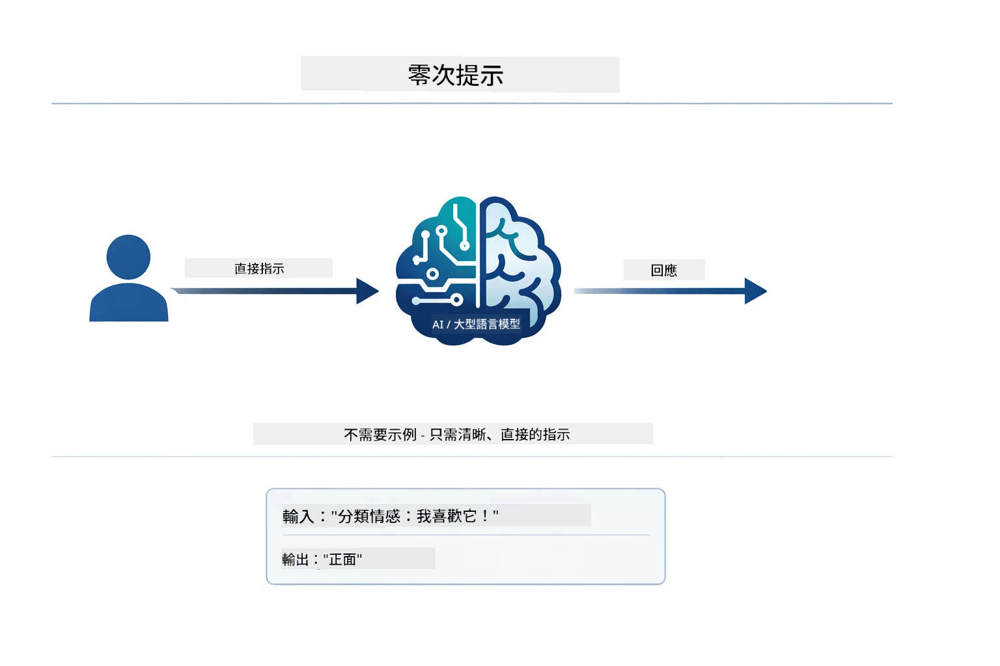
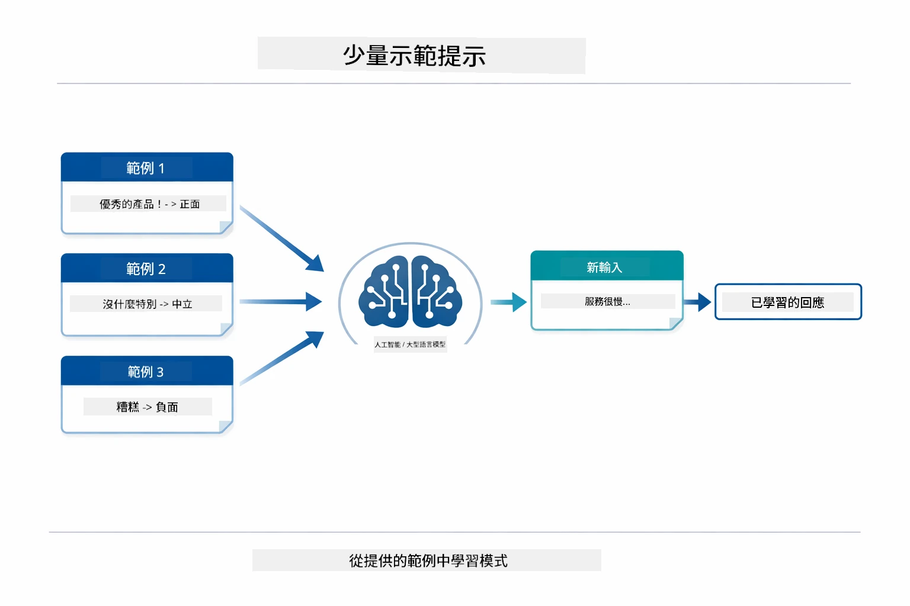
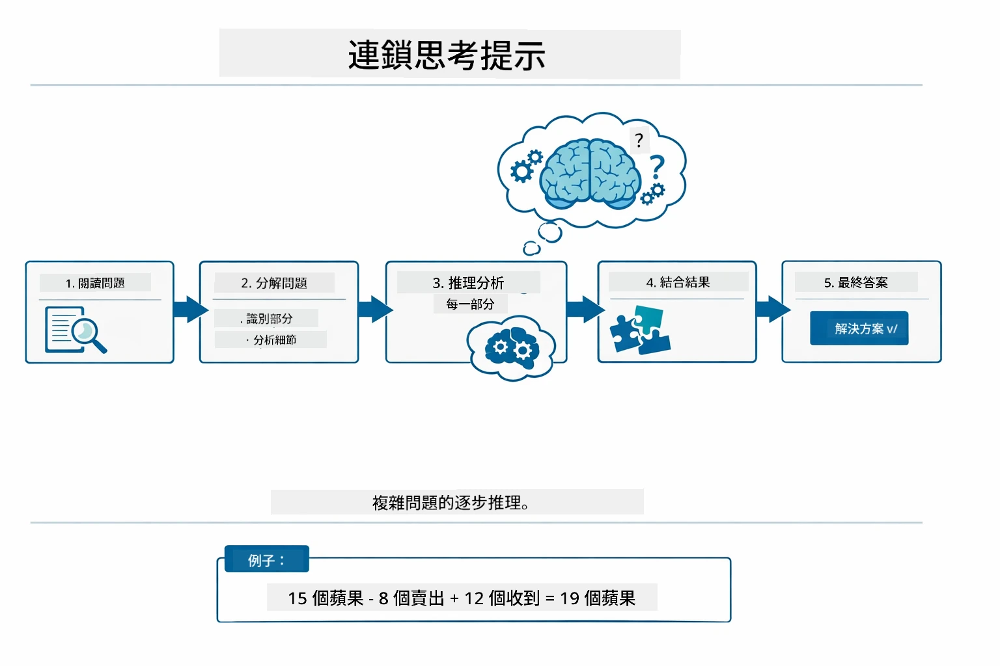
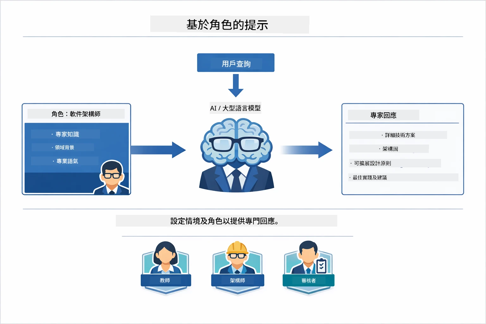
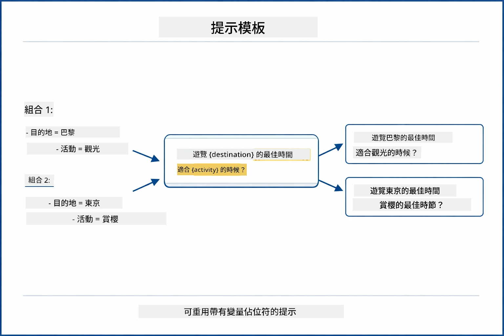
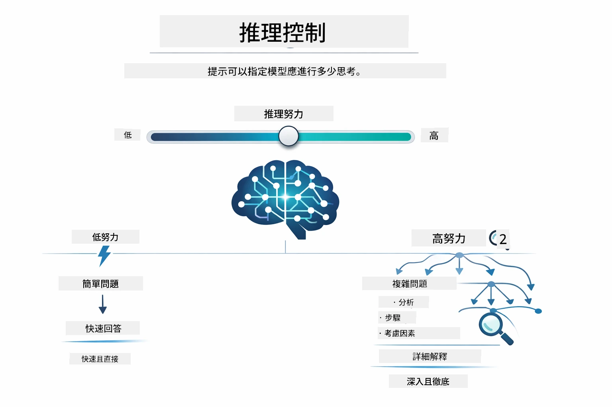

# Module 02: 使用 GPT-5.2 的提示工程

## 目錄

- [你將會學習什麼](../../../02-prompt-engineering)
- [前置需求](../../../02-prompt-engineering)
- [了解提示工程](../../../02-prompt-engineering)
- [提示工程基礎](../../../02-prompt-engineering)
  - [零樣本提示](../../../02-prompt-engineering)
  - [少量樣本提示](../../../02-prompt-engineering)
  - [思維鏈](../../../02-prompt-engineering)
  - [基於角色的提示](../../../02-prompt-engineering)
  - [提示模板](../../../02-prompt-engineering)
- [進階模式](../../../02-prompt-engineering)
- [使用現有 Azure 資源](../../../02-prompt-engineering)
- [應用截圖](../../../02-prompt-engineering)
- [探索這些模式](../../../02-prompt-engineering)
  - [低積極性與高積極性](../../../02-prompt-engineering)
  - [任務執行（工具前言）](../../../02-prompt-engineering)
  - [自我反思代碼](../../../02-prompt-engineering)
  - [結構化分析](../../../02-prompt-engineering)
  - [多輪對話](../../../02-prompt-engineering)
  - [步驟推理](../../../02-prompt-engineering)
  - [受限輸出](../../../02-prompt-engineering)
- [你真正學會的是什麼](../../../02-prompt-engineering)
- [接下來的步驟](../../../02-prompt-engineering)

## 你將會學習什麼



在上一個模組中，你了解了記憶如何使對話 AI 成為可能，並使用 GitHub 模型進行基本互動。現在我們將專注於你如何提問 —— 即提示本身 —— 使用 Azure OpenAI 的 GPT-5.2。你如何構建提示會極大影響你得到的回答品質。我們先回顧基本的提示技巧，然後進入八種進階模式，充分發揮 GPT-5.2 的能力。

我們使用 GPT-5.2 是因為它引入了推理控制 —— 你可以告訴模型回答前要思考多少。這使不同提示策略更明顯，幫助你了解何時使用哪種方法。相比 GitHub 模型，Azure 對 GPT-5.2 的速率限制也較少，這對我們有利。

## 前置需求

- 已完成模組 01（已部署 Azure OpenAI 資源）
- 根目錄下有 `.env` 檔案與 Azure 憑證（由模組 01 中的 `azd up` 建立）

> **注意：** 如果還沒完成模組 01，請先依指示完成部署。

## 了解提示工程



提示工程是設計輸入文字，確保你持續取得所需結果。它不只是問問題 —— 是關於如何組織請求，使模型精確理解你想要什麼以及如何交付。

就像給同事指示。「修復Bug」很模糊。「修復 UserService.java 第 45 行的 null 指標異常，透過加入 null 檢查」就很具體。語言模型也是如此 —— 明確性與結構非常重要。



LangChain4j 提供基礎架構 —— 模型連結、記憶與訊息類型 —— 而提示模式只是你通過這個架構傳送的精心結構化文本。關鍵組件是 `SystemMessage`（設定 AI 的行為與角色）與 `UserMessage`（載入你的實際請求）。

## 提示工程基礎



在深入本模組的進階模式前，我們先回顧五種基本提示技巧。這些是每位提示工程師都該知道的基石。如果你之前已完成[快速啟動模組](../00-quick-start/README.md#2-prompt-patterns)，你應該見過這些技巧的實作 —— 這裡是它們背後的概念架構。

### 零樣本提示

最簡單的方式：給模型直接指令，沒有範例。模型完全靠訓練理解與執行任務。這對於行為明顯的直觀請求效果很好。



*無範例的直接指令 —— 模型從指令中推斷任務*

```java
String prompt = "Classify this sentiment: 'I absolutely loved the movie!'";
String response = model.chat(prompt);
// 回應:「正面」
```

**何時使用：** 簡單分類、直接問題、翻譯，或任何模型能在無需額外指導下處理的任務。

### 少量樣本提示

提供範例示範你希望模型遵循的模式。模型從你的範例中學習預期的輸入輸出格式，並套用到新輸入上。這顯著提升對格式或行為不明顯任務的一致性。



*從範例學習 —— 模型辨識模式並套用至新輸入*

```java
String prompt = """
    Classify the sentiment as positive, negative, or neutral.
    
    Examples:
    Text: "This product exceeded my expectations!" → Positive
    Text: "It's okay, nothing special." → Neutral
    Text: "Waste of money, very disappointed." → Negative
    
    Now classify this:
    Text: "Best purchase I've made all year!"
    """;
String response = model.chat(prompt);
```

**何時使用：** 自訂分類、一致格式、特定領域任務，或零樣本結果不穩定時。

### 思維鏈

要求模型逐步展示推理過程。模型不直接跳到答案，而是明確拆解問題、逐步執行。這提高數學、邏輯及多步推理任務的準確性。



*逐步推理 —— 將複雜問題拆解成明確邏輯步驟*

```java
String prompt = """
    Problem: A store has 15 apples. They sell 8 apples and then 
    receive a shipment of 12 more apples. How many apples do they have now?
    
    Let's solve this step-by-step:
    """;
String response = model.chat(prompt);
// 模型顯示：15 - 8 = 7，然後 7 + 12 = 19 個蘋果
```

**何時使用：** 數學題、邏輯推理、除錯，或任何顯示推理過程能提升準確性與信任的任務。

### 基於角色的提示

在提出問題前設定 AI 的角色或身份。這提供上下文，影響回答的語氣、深度與焦點。比如「軟體架構師」給出的建議就和「初級開發者」或「安全稽核員」不同。



*設定上下文與角色 —— 同一問題依角色分配獲得不同回答*

```java
String prompt = """
    You are an experienced software architect reviewing code.
    Provide a brief code review for this function:
    
    def calculate_total(items):
        total = 0
        for item in items:
            total = total + item['price']
        return total
    """;
String response = model.chat(prompt);
```

**何時使用：** 程式碼審查、輔導、領域分析，或你需要根據特定專業層級或視角調整回答時。

### 提示模板

建立可重複使用的提示，包含變數占位符。不是每次都寫新提示，只需定義一次模板並填入不同值。LangChain4j 的 `PromptTemplate` 類使用 `{{variable}}` 語法方便實作。



*可重用的提示與變數占位符 —— 一個模板，多種用途*

```java
PromptTemplate template = PromptTemplate.from(
    "What's the best time to visit {{destination}} for {{activity}}?"
);

Prompt prompt = template.apply(Map.of(
    "destination", "Paris",
    "activity", "sightseeing"
));

String response = model.chat(prompt.text());
```

**何時使用：** 不同輸入重複查詢、批次處理、建立可重用 AI 工作流程，或任何提示結構相同但資料不同的場景。

---

這五個基礎技巧為你提供大部分提示任務的堅實工具包。本模組其餘內容將以它們為基礎，整合 GPT-5.2 的推理控制、自我評估與結構化輸出能力，介紹八種進階模式。

## 進階模式

基礎已講完，現在進入本模組獨特的八種進階模式。不是所有問題都需同一方法。有些題目需快速回答，有些則需深度思考。有些需顯示推理過程，有些只要結果。以下每種模式均針對不同情境優化 —— GPT-5.2 的推理控制讓差異更明顯。


*八種提示工程模式與其適用場景概覽*



*GPT-5.2 的推理控制讓你指定模型思考量 —— 從快速直接回答到深入探索*


*低積極性（快速、直接） vs 高積極性（全面、探索）推理策略*

**低積極性（快速且聚焦）** - 適用簡單問題，你想要快速直接答案。模型進行最少推理 —— 不超過 2 步。用於計算、查詢或直截了當問題。

```java
String prompt = """
    <context_gathering>
    - Search depth: very low
    - Bias strongly towards providing a correct answer as quickly as possible
    - Usually, this means an absolute maximum of 2 reasoning steps
    - If you think you need more time, state what you know and what's uncertain
    </context_gathering>
    
    Problem: What is 15% of 200?
    
    Provide your answer:
    """;

String response = chatModel.chat(prompt);
```

> 💡 **用 GitHub Copilot 探索：** 開啟 [`Gpt5PromptService.java`](../../../02-prompt-engineering/src/main/java/com/example/langchain4j/prompts/service/Gpt5PromptService.java) 詢問：
> - 「低積極性和高積極性提示模式的差異是什麼？」
> - 「提示中的 XML 標籤如何幫助結構化 AI 回答？」
> - 「何時該使用自我反思模式而非直接指示？」

**高積極性（深入且全面）** - 適用複雜問題，你想要全面分析。模型深入探索並展示詳細推理。用於系統設計、架構決策或複雜研究。

```java
String prompt = """
    Analyze this problem thoroughly and provide a comprehensive solution.
    Consider multiple approaches, trade-offs, and important details.
    Show your analysis and reasoning in your response.
    
    Problem: Design a caching strategy for a high-traffic REST API.
    """;

String response = chatModel.chat(prompt);
```

**任務執行（逐步推進）** - 適合多步工作流程。模型先規劃、工作時敘述每一步，最後總結。用於遷移、實作或任何多步驟流程。

```java
String prompt = """
    <task_execution>
    1. First, briefly restate the user's goal in a friendly way
    
    2. Create a step-by-step plan:
       - List all steps needed
       - Identify potential challenges
       - Outline success criteria
    
    3. Execute each step:
       - Narrate what you're doing
       - Show progress clearly
       - Handle any issues that arise
    
    4. Summarize:
       - What was completed
       - Any important notes
       - Next steps if applicable
    </task_execution>
    
    <tool_preambles>
    - Always begin by rephrasing the user's goal clearly
    - Outline your plan before executing
    - Narrate each step as you go
    - Finish with a distinct summary
    </tool_preambles>
    
    Task: Create a REST endpoint for user registration
    
    Begin execution:
    """;

String response = chatModel.chat(prompt);
```

思維鏈提示明確要求模型展示推理過程，提升複雜任務準確性。步驟拆解幫助人和 AI 理解邏輯。

> **🤖 透過 [GitHub Copilot](https://github.com/features/copilot) Chat 嘗試：** 詢問此模式：
> - 「要如何調整任務執行模式來處理長時間運作的作業？」
> - 「生產環境中結構工具前言的最佳實踐是什麼？」
> - 「怎麼擷取並顯示中間的進度更新於 UI？」


*規劃 → 執行 → 總結的多步任務工作流程*

**自我反思代碼** - 產出生產級程式碼的模式。模型遵守生產標準並處理錯誤。建立新功能或服務時使用。

```java
String prompt = """
    Generate Java code with production-quality standards: Create an email validation service
    Keep it simple and include basic error handling.
    """;

String response = chatModel.chat(prompt);
```


*循環改進迴圈 —— 生成、評估、識別問題、改進、重複*

**結構化分析** - 用於一致性評估。模型用固定框架檢視程式碼（正確性、實踐、效能、安全、可維護性）。程式碼審查或品質評估時使用。

```java
String prompt = """
    <analysis_framework>
    You are an expert code reviewer. Analyze the code for:
    
    1. Correctness
       - Does it work as intended?
       - Are there logical errors?
    
    2. Best Practices
       - Follows language conventions?
       - Appropriate design patterns?
    
    3. Performance
       - Any inefficiencies?
       - Scalability concerns?
    
    4. Security
       - Potential vulnerabilities?
       - Input validation?
    
    5. Maintainability
       - Code clarity?
       - Documentation?
    
    <output_format>
    Provide your analysis in this structure:
    - Summary: One-sentence overall assessment
    - Strengths: 2-3 positive points
    - Issues: List any problems found with severity (High/Medium/Low)
    - Recommendations: Specific improvements
    </output_format>
    </analysis_framework>
    
    Code to analyze:
    ```
    public List getUsers() {
        return database.query("SELECT * FROM users");
    }
    ```
    Provide your structured analysis:
    """;

String response = chatModel.chat(prompt);
```

> **🤖 透過 [GitHub Copilot](https://github.com/features/copilot) Chat 嘗試結構化分析：**
> - 「如何為不同類型程式碼審查自訂分析框架？」
> - 「以程式化方式解析並利用結構化輸出的最佳方法是什麼？」
> - 「如何確保不同審查會議間嚴重性分級一致？」


*一致程式碼審查的框架與嚴重性分級*

**多輪對話** - 適用需要上下文的對話。模型記住先前訊息並累積回應。用於互動式協助或複雜問答。

```java
ChatMemory memory = MessageWindowChatMemory.withMaxMessages(10);

memory.add(UserMessage.from("What is Spring Boot?"));
AiMessage aiMessage1 = chatModel.chat(memory.messages()).aiMessage();
memory.add(aiMessage1);

memory.add(UserMessage.from("Show me an example"));
AiMessage aiMessage2 = chatModel.chat(memory.messages()).aiMessage();
memory.add(aiMessage2);
```


*對話上下文隨多輪累積，直到達到 token 限制*

**步驟推理** - 適用需顯示邏輯的問題。模型展示每步明確推理。用於數學題、邏輯謎題或你需要理解思考過程時。

```java
String prompt = """
    <instruction>Show your reasoning step-by-step</instruction>
    
    If a train travels 120 km in 2 hours, then stops for 30 minutes,
    then travels another 90 km in 1.5 hours, what is the average speed
    for the entire journey including the stop?
    """;

String response = chatModel.chat(prompt);
```


*將問題拆解成明確邏輯步驟*

**受限輸出** - 適用需特定格式要求的回應。模型嚴格遵守格式和長度規則。用於摘要或需精確輸出結構時。

```java
String prompt = """
    <constraints>
    - Exactly 100 words
    - Bullet point format
    - Technical terms only
    </constraints>
    
    Summarize the key concepts of machine learning.
    """;

String response = chatModel.chat(prompt);
```


*強制特定格式、長度和結構要求*

## 使用現有 Azure 資源

**確認部署：**

確認根目錄存在 `.env` 檔案，內含 Azure 憑證（於模組 01 建置）：
```bash
cat ../.env  # 應該顯示 AZURE_OPENAI_ENDPOINT、API_KEY、DEPLOYMENT
```

**啟動應用：**

> **注意：** 如果你已用模組 01 的指令 `./start-all.sh` 啟動所有應用，本模組已於 8083 埠執行，可跳過下面的啟動指令，直接前往 http://localhost:8083。

**選項 1：使用 Spring Boot Dashboard（推薦給 VS Code 使用者）**

開發容器包含 Spring Boot Dashboard 擴充，提供視覺介面管理所有 Spring Boot 應用程式。你可以在 VS Code 左側的活動列找到它（尋找 Spring Boot 圖標）。
從 Spring Boot 儀表板，您可以：
- 查看工作區中所有可用的 Spring Boot 應用程式
- 一鍵啟動/停止應用程式
- 實時查看應用程式日誌
- 監控應用程式狀態

只需點擊「prompt-engineering」旁邊的播放按鈕即可啟動此模組，或一次啟動所有模組。


**選項 2：使用 shell 腳本**

啟動所有網頁應用程式（模組 01-04）：

**Bash:**
```bash
cd ..  # 從根目錄開始
./start-all.sh
```

**PowerShell:**
```powershell
cd ..  # 從根目錄
.\start-all.ps1
```

或只啟動此模組：

**Bash:**
```bash
cd 02-prompt-engineering
./start.sh
```

**PowerShell:**
```powershell
cd 02-prompt-engineering
.\start.ps1
```

這兩個腳本會自動從根目錄的 `.env` 檔案載入環境變數，且如果 JAR 檔案不存在會先編譯構建。

> **注意：** 如果你偏好先手動編譯所有模組再啟動：
>
> **Bash:**
> ```bash
> cd ..  # Go to root directory
> mvn clean package -DskipTests
> ```
>
> **PowerShell:**
> ```powershell
> cd ..  # Go to root directory
> mvn clean package -DskipTests
> ```

請在瀏覽器開啟 http://localhost:8083 。

**停止執行：**

**Bash:**
```bash
./stop.sh  # 只限此模組
# 或者
cd .. && ./stop-all.sh  # 全部模組
```

**PowerShell:**
```powershell
.\stop.ps1  # 僅此模組
# 或者
cd ..; .\stop-all.ps1  # 所有模組
```

## 應用程式截圖


*主儀表板顯示所有 8 個提示工程模式及其特性與使用案例*

## 探索這些模式

網頁介面讓您嘗試不同的提示策略。每個模式解決不同的問題——試試看，了解各種方法何時最有效。

### 低積極度 vs 高積極度

使用低積極度，問一個簡單問題像是「200 的 15% 是多少？」你會即時得到直接答案。現在用高積極度，問一個複雜問題像是「設計一個高流量 API 的快取策略」。觀察模型如何放慢速度並提供詳細推理。同樣的模型，同樣的問題結構——但提示告訴模型要思考多少。


*快速計算，推理最小化*


*全面快取策略（2.8MB）*

### 任務執行（工具前言）

多步驟工作流程受益於事前規劃和進度敘述。模型會概述接下來要做什麼，敘述每一步，再總結結果。


*建立 REST 端點，逐步敘述（3.9MB）*

### 自我反思式程式碼

試試「建立一個電子郵件驗證服務」。模型不只是生成程式碼然後停止，它會生成、根據品質標準評估、識別弱點並改進。你會看到模型不斷迭代直到達到生產標準。


*完成的電子郵件驗證服務（5.2MB）*

### 結構化分析

程式碼審查需要一致性的評估框架。模型使用固定類別（正確性、實踐、效能、安全性）和嚴重度等級分析程式碼。


*基於框架的程式碼審查*

### 多回合對話

問「什麼是 Spring Boot？」接著馬上追問「給我一個例子」。模型會記住你的第一個問題並專門給你一個 Spring Boot 範例。沒有記憶的話，第二個問題太模糊了。


*跨問題保存上下文*

### 逐步推理

挑一個數學題，用逐步推理和低積極度兩種模式試試看。低積極度只給答案——快速但不透明。逐步推理則顯示每個計算和決策。


*帶明確步驟的數學題*

### 約束輸出

當你需要特定格式或字數時，此模式會強制嚴格遵守規範。試試用點列格式生成剛好 100 字的摘要。


*具有格式控制的機器學習摘要*

## 你真正學到的是什麼

**推理的努力度改變一切**

GPT-5.2 讓你透過提示控制計算努力度。低努力代表快速回應且探索少。高努力代表模型花時間深入思考。你正在學會把努力度對應到任務複雜度——別在簡單問題浪費時間，但也不要急著做複雜決策。

**結構引導行為**

注意提示中的 XML 標籤？它們不是裝飾。模型比起自由文本更可靠地遵循結構化指令。當你需要多步驟流程或複雜邏輯，結構有助模型追蹤目前所在及下一步。


*結構良好的提示解剖，分明章節和 XML 風格組織*

**透過自我評估提升品質**

自我反思模式透過明確定義品質標準運作。不是期望模型「正確完成」，而是告訴它「正確」是什麼：邏輯正確、錯誤處理、效能、安全性。模型能評估自身輸出並改進。這讓程式碼生成從抽獎變成一個流程。

**上下文是有限的**

多回合對話透過每次請求包涵訊息歷史工作。但有上限——每個模型都有最大 token 數。當對話增長時，你需要策略在不觸及上限的前提下保持相關上下文。本模組示範記憶運作；之後你會學到何時摘要、何時忘記、何時取回。

## 下一步

**下一模組：** [03-rag - RAG（檢索增強生成）](../03-rag/README.md)

---

**導覽：** [← 上一頁：模組 01 - 介紹](../01-introduction/README.md) | [回主頁](../README.md) | [下一頁：模組 03 - RAG →](../03-rag/README.md)

---

<!-- CO-OP TRANSLATOR DISCLAIMER START -->
**免責聲明**：  
本文件由 AI 翻譯服務 [Co-op Translator](https://github.com/Azure/co-op-translator) 進行翻譯。雖然我們致力於準確性，但請注意自動翻譯可能存在錯誤或不準確之處。原始文件的母語版本應被視為權威來源。對於重要資訊，建議採用專業人工翻譯。我們對因使用本翻譯而引起的任何誤解或誤譯概不負責。
<!-- CO-OP TRANSLATOR DISCLAIMER END -->