# Module 03: RAG（結合檢索的生成）

## 目錄

- [視頻導覽](../../../03-rag)
- [你將學習什麼](../../../03-rag)
- [先決條件](../../../03-rag)
- [了解 RAG](../../../03-rag)
  - [本教程使用哪種 RAG 方法？](../../../03-rag)
- [運作原理](../../../03-rag)
  - [文件處理](../../../03-rag)
  - [建立嵌入](../../../03-rag)
  - [語義搜尋](../../../03-rag)
  - [生成答案](../../../03-rag)
- [執行應用程式](../../../03-rag)
- [使用應用程式](../../../03-rag)
  - [上傳文件](../../../03-rag)
  - [提問](../../../03-rag)
  - [檢查來源參考](../../../03-rag)
  - [試驗提問](../../../03-rag)
- [核心概念](../../../03-rag)
  - [分塊策略](../../../03-rag)
  - [相似度分數](../../../03-rag)
  - [記憶體儲存](../../../03-rag)
  - [語境窗口管理](../../../03-rag)
- [何時 RAG 很重要](../../../03-rag)
- [後續步驟](../../../03-rag)

## 視頻導覽

觀看此直播課程，說明如何開始使用本模組：

<a href="https://www.youtube.com/watch?v=_olq75ZH_eY"></a>

## 你將學習什麼

在先前的模組中，你學會了如何與 AI 進行對話以及如何有效構建提示。但有一個根本限制：語言模型只知道它在訓練期間學到的東西。它無法回答有關你公司政策、專案文件或任何未訓練過資訊的問題。

RAG（結合檢索的生成）解決了這個問題。它不是試圖訓練模型了解你的資訊（這既昂貴又不實際），而是賦予模型在文件中搜尋的能力。當有人問問題時，系統會找到相關資訊並將其包含在提示中。模型接著基於該檢索到的語境進行回答。

把 RAG 想像成給模型一個參考圖書館。當你問問題時，系統會：

1. **用戶查詢** - 你提出問題
2. **建立嵌入** - 將你的問題轉換成向量
3. **向量搜尋** - 找出相似的文件分塊
4. **語境組裝** - 將相關分塊加入提示中
5. **回應** - LLM 根據語境生成答案

這讓模型的回答有據可依於你的實際數據，而不是僅仰賴訓練知識或胡亂編造答案。

## 先決條件

- 已完成 [Module 00 - 快速開始](../00-quick-start/README.md)（用於上述簡易 RAG 範例）
- 已完成 [Module 01 - 介紹](../01-introduction/README.md)（已部署 Azure OpenAI 資源，包括 `text-embedding-3-small` 嵌入模型）
- 根目錄有 `.env` 檔案，含 Azure 認證（由 Module 01 中的 `azd up` 建立）

> **注意：** 如果尚未完成 Module 01，請先遵循那裡的部署說明。`azd up` 指令會部署 GPT 聊天模型和本模組所用的嵌入模型。

## 了解 RAG

下圖展示了核心概念：RAG 不只是依賴模型的訓練數據，而是讓模型在每次生成答案前，先參考你的文件圖書館。

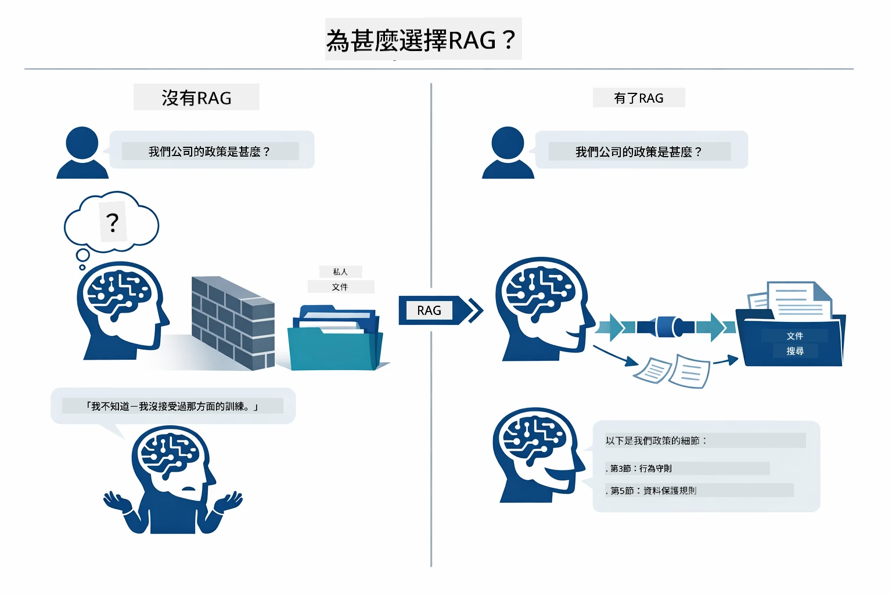

*此圖顯示標準 LLM（從訓練數據推測）與 RAG 增強的 LLM（先參考你的文件）的差別。*

以下說明端到端流程。用戶問題通過四個階段——嵌入、向量搜尋、語境組裝和答案生成——每個階段基於前一步進行：


*此圖示範端到端 RAG 管線——用戶查詢經嵌入、向量搜尋、語境組裝和答案生成而完成。*

接下來本模組會詳解每階段及相關程式碼，供你跑、修改。

### 本教程使用哪種 RAG 方法？

LangChain4j 提供三種 RAG 實作方式，每種抽象層級不同。下圖並排比較：

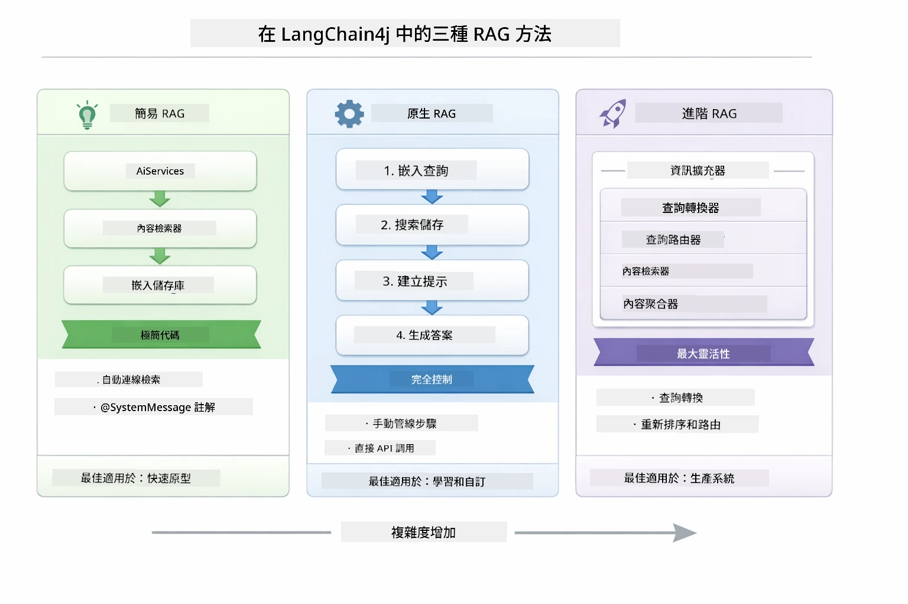

*此圖比較 LangChain4j 三種 RAG 策略——簡易、原生和進階，展示其主要元件及適用場合。*

| 方法 | 功能 | 折衷 |
|---|---|---|
| **簡易 RAG** | 透過 `AiServices` 和 `ContentRetriever` 自動串接所有流程。你只要標記接口、附加檢索器，LangChain4j 代為執行嵌入、搜尋和提示組裝。 | 程式碼少，但無法看到每步細節。 |
| **原生 RAG** | 你自行呼叫嵌入模型、搜尋資料庫、建立提示和生成答案——每步明確寫出。 | 程式碼較多，但每階段清晰可見且可調整。 |
| **進階 RAG** | 使用帶有可插拔查詢轉換器、路由器、重排序器和內容注入器的 `RetrievalAugmentor` 框架，適合生產管線。 | 彈性最大，但複雜度顯著提升。 |

**本教程採用的是原生方式。** RAG 管線中的每步 —— 查詢嵌入、向量庫搜尋、語境組裝和答案生成 —— 全都明確寫在 [`RagService.java`](../../../03-rag/src/main/java/com/example/langchain4j/rag/service/RagService.java) 中。這是有意為之：作為學習資源，清楚了解每階段比精簡程式碼更重要。熟悉流程後，你可以轉向簡易 RAG 做快速原型，或用進階 RAG 建置生產系統。

> **💡 已經看過簡易 RAG 範例？** [快速開始模組](../00-quick-start/README.md)包含一份文件問答範例（[`SimpleReaderDemo.java`](../../../00-quick-start/src/main/java/com/example/langchain4j/quickstart/SimpleReaderDemo.java)），使用的是簡易 RAG —— LangChain4j 會自動處理嵌入、搜尋與提示組裝。本模組則將該管線拆開，讓你能看見並控制每個階段。

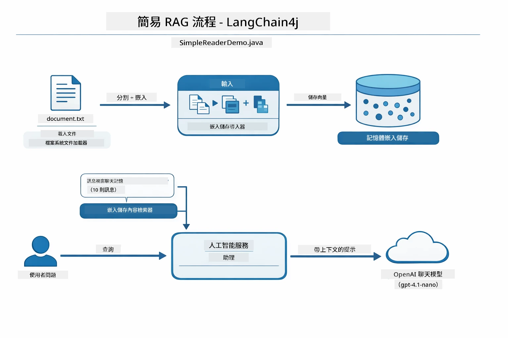

*此圖示 `SimpleReaderDemo.java` 中的簡易 RAG 管線。與本模組採用的原生方式比較： 簡易 RAG 把嵌入、檢索、提示組裝包裹在 `AiServices` 和 `ContentRetriever` 後面——你只要載入文件、附加檢索器，就能拿到答案。這模組用原生方法拆解管線，讓你自己呼叫每階段（嵌入、搜尋、組語境、生成），完全掌控過程。*

## 運作原理

本模組中的 RAG 管線分為四個階段，當用戶提出問題時依序執行。首先，把上傳文件**解析並分塊**成可管理小片段。接著，轉換這些分塊成**向量嵌入**並儲存起來，方便數學比較。當有查詢時，系統會做**語義搜尋**找出最相關分塊，最後將它們作為語境交給 LLM 生成答案。以下各節搭配實際程式碼和圖解，逐步說明。先看第一步。

### 文件處理

[DocumentService.java](../../../03-rag/src/main/java/com/example/langchain4j/rag/service/DocumentService.java)

當你上傳文件，系統會解析（PDF 或純文字），附加檔名等元資料，接著拆成分塊——較小的片段，適合放入模型的語境窗口。分塊間略有重疊，避免語境在邊界處遺失。

```java
// 解析已上載的檔案並將其包裝在 LangChain4j 文件中
Document document = Document.from(content, metadata);

// 分割成300個標記的區塊，每個區塊重疊30個標記
DocumentSplitter splitter = DocumentSplitters
    .recursive(300, 30);

List<TextSegment> segments = splitter.split(document);
```

下圖以視覺化方式呈現此流程。注意每個分塊和鄰近分塊共享一些 token —— 30 字元的重疊確保關鍵語境不被漏掉：

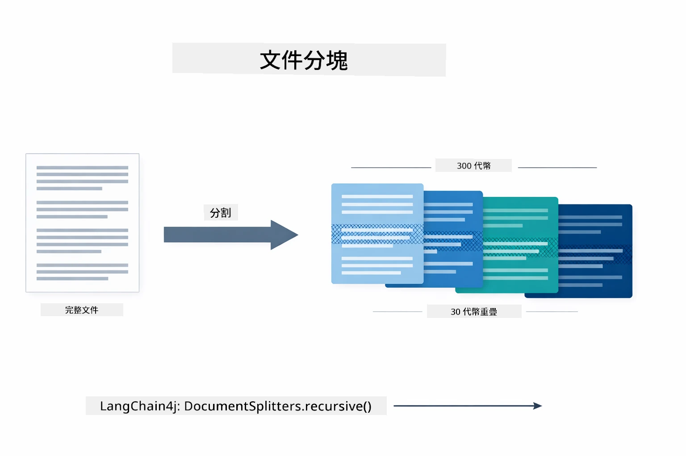

*此圖示文件被拆成 300 字元大小、30 字元重疊的分塊，保持分塊邊界的上下文連貫。*

> **🤖 用 [GitHub Copilot](https://github.com/features/copilot) 聊天試試：** 打開 [`DocumentService.java`](../../../03-rag/src/main/java/com/example/langchain4j/rag/service/DocumentService.java)，然後問：
> - 「LangChain4j 如何分割文件成分塊？為何分塊重疊重要？」
> - 「不同文件類型的最佳分塊大小是多少？為什麼？」
> - 「如何處理多語言或具有特殊格式的文件？」

### 建立嵌入

[LangChainRagConfig.java](../../../03-rag/src/main/java/com/example/langchain4j/rag/config/LangChainRagConfig.java)

每塊會被轉換成數值表示，稱為嵌入 —— 本質上將語意轉成數字的轉換器。嵌入模型不像聊天模型那樣「智能」，它不會執行指令、推理或回答問題。它能做到的是將文本映射進一個數學空間，意義相近的文字會彼此靠近——「車」和「汽車」會很近，「退款政策」和「退錢」也相近。把聊天模型想像成能與你對話的人，嵌入模型則是超強的歸檔系統。

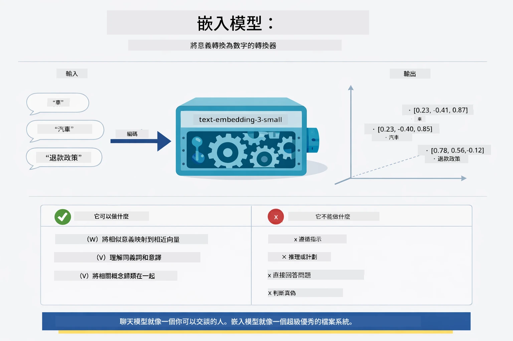

*此圖展示嵌入模型如何把文字轉成數值向量，將意思相近（比如「車」和「汽車」）的詞語置於向量空間相近位置。*

```java
@Bean
public EmbeddingModel embeddingModel() {
    return OpenAiOfficialEmbeddingModel.builder()
        .baseUrl(azureOpenAiEndpoint)
        .apiKey(azureOpenAiKey)
        .modelName(azureEmbeddingDeploymentName)
        .build();
}

EmbeddingStore<TextSegment> embeddingStore = 
    new InMemoryEmbeddingStore<>();
```

下方類別圖顯示 RAG 管線中兩個獨立流程與實作它們的 LangChain4j 類。**攝取流程**（上傳時計行）拆分文件，嵌入分塊，並用 `.addAll()` 儲存。**查詢流程**（用戶每問一次執行）嵌入問題，通過 `.search()` 搜尋存儲，並把匹配的語境傳給聊天模型。兩者共用 `EmbeddingStore<TextSegment>` 介面連結：

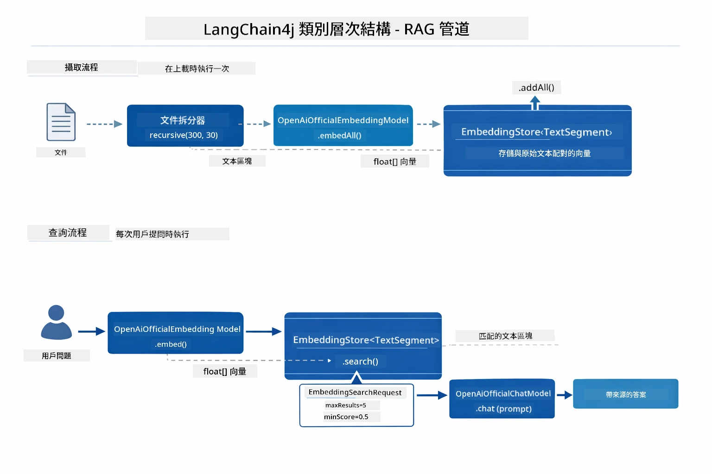

*此圖示 RAG 管線的兩個流程——攝取和查詢，以及它們如何透過共用的 EmbeddingStore 介面連結。*

當嵌入存好後，意義接近的內容自然會在向量空間聚集。下方視覺化展示相關主題文件成為鄰近點，這就是語義搜尋得以實現的原因：


*此視覺化展示相關文件在三維向量空間中聚集，主題如技術文檔、商業規則、常見問題分成不同群集。*

用戶查詢時，系統遵循四步驟：文件嵌入做一次，查詢每次嵌入，比較查詢向量與所有存量向量餘弦相似度，返回前 K 筆得分最高分塊。下圖展現步驟及 LangChain4j 類別：

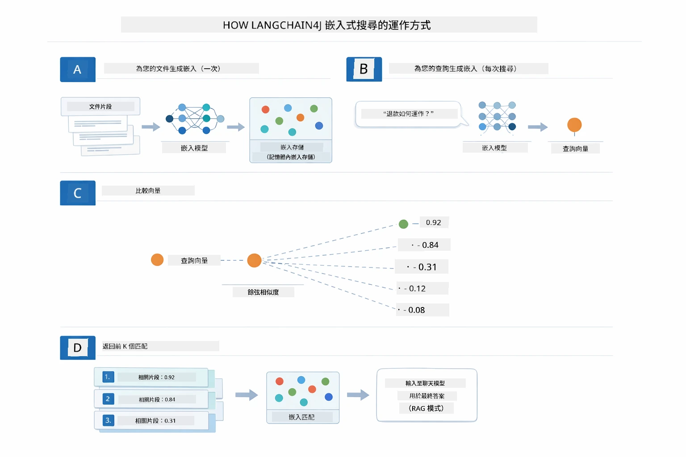

*此圖展示四步嵌入搜尋流程：文件嵌入、查詢嵌入、使用餘弦相似度比較向量、返回前 K 結果。*

### 語義搜尋

[RagService.java](../../../03-rag/src/main/java/com/example/langchain4j/rag/service/RagService.java)

當你提問時，你的問題也會被嵌入。系統將你的問題嵌入與所有文件分塊的嵌入比較。它找到最語義相似的分塊——並非只是關鍵字匹配，而是字面意義相符。

```java
Embedding queryEmbedding = embeddingModel.embed(question).content();

EmbeddingSearchRequest searchRequest = EmbeddingSearchRequest.builder()
    .queryEmbedding(queryEmbedding)
    .maxResults(5)
    .minScore(0.5)
    .build();

EmbeddingSearchResult<TextSegment> searchResult = embeddingStore.search(searchRequest);
List<EmbeddingMatch<TextSegment>> matches = searchResult.matches();

for (EmbeddingMatch<TextSegment> match : matches) {
    String relevantText = match.embedded().text();
    double score = match.score();
}
```

下圖比較語義搜尋與傳統的關鍵字搜尋。關鍵字搜尋「車輛」無法找到「汽車與卡車」的分塊，但語義搜尋理解兩者是同義，將其列為高分匹配：

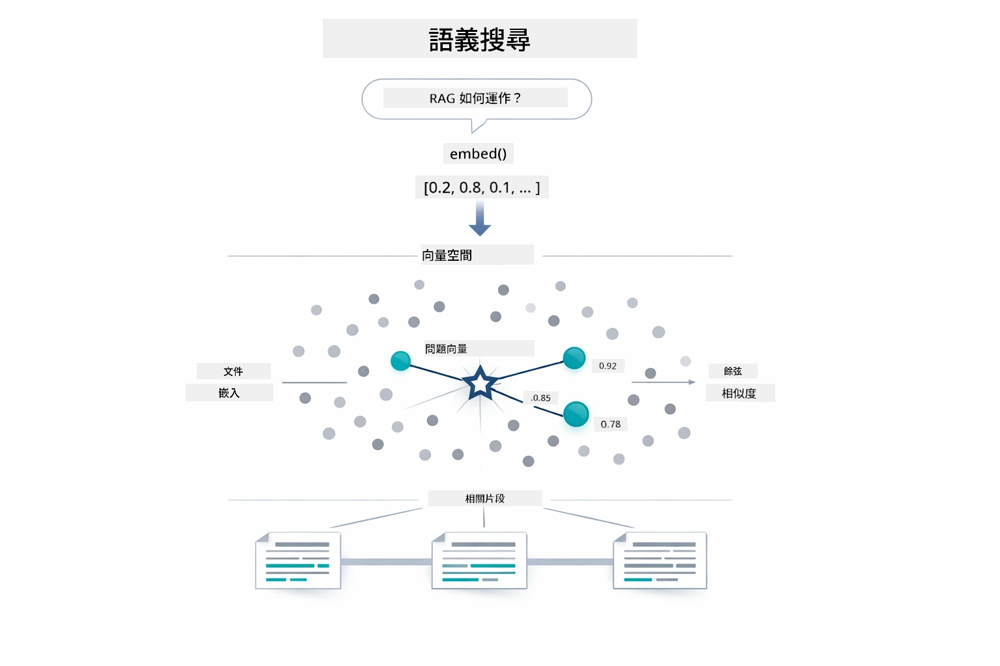

*此圖比較基於關鍵字搜尋和語義搜尋，展示語義搜尋即使關鍵字不同也能檢索相關內容。*

底層相似度用餘弦相似度衡量——本質上是看「兩箭頭是否指向相同方向？」兩個分塊可用完全不同詞彙，但若意義相同，向量方向一致，得分接近 1.0：

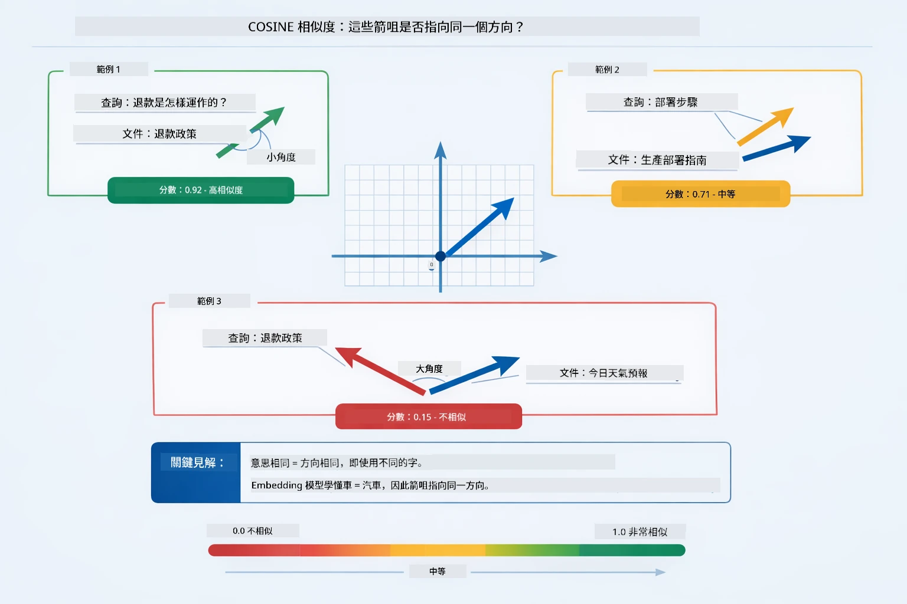
*此圖說明餘弦相似度是嵌入向量間的角度—越一致的向量得分越接近 1.0，表示語義相似度越高。*

> **🤖 試試看使用 [GitHub Copilot](https://github.com/features/copilot) Chat：** 開啟 [`RagService.java`](../../../03-rag/src/main/java/com/example/langchain4j/rag/service/RagService.java) 並問：
> - 「相似度搜尋如何與嵌入向量協同運作？得分由什麼決定？」
> - 「我應該使用什麼相似度門檻？它如何影響結果？」
> - 「遇到找不到相關文件時，該怎麼處理？」

### 答案產生

[RagService.java](../../../03-rag/src/main/java/com/example/langchain4j/rag/service/RagService.java)

最相關的文本塊會組裝成一個結構化提示，內含明確指示、檢索上下文和使用者問題。模型閱讀這些特定文本塊，根據資訊回答—它只能使用呈現在眼前的資訊，以防止幻覺生成。

```java
String context = matches.stream()
    .map(match -> match.embedded().text())
    .collect(Collectors.joining("\n\n"));

String prompt = String.format("""
    Answer the question based on the following context.
    If the answer cannot be found in the context, say so.

    Context:
    %s

    Question: %s

    Answer:""", context, request.question());

String answer = chatModel.chat(prompt);
```

下圖展示此組裝流程—從搜尋步驟中取分數最高的文本塊注入提示模板，`OpenAiOfficialChatModel` 產生有根據的答案：

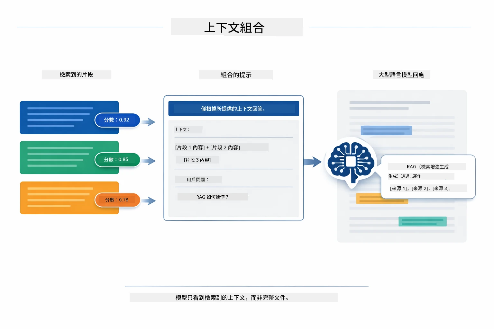

*此圖展示如何將最高分文本塊組成結構化提示，使模型能從您的資料生成有根據的答案。*

## 運行應用程式

**驗證部署：**

確認 `.env` 檔案存在根目錄且包含 Azure 認證（模組 01 建立時的設定）：

**Bash：**
```bash
cat ../.env  # 應該顯示 AZURE_OPENAI_ENDPOINT、API_KEY、DEPLOYMENT
```

**PowerShell：**
```powershell
Get-Content ..\.env  # 應該顯示 AZURE_OPENAI_ENDPOINT、API_KEY、DEPLOYMENT
```

**啟動應用程式：**

> **注意：** 若您已於模組 01 透過 `./start-all.sh` 啟動所有應用，則此模組已於 8081 埠執行。您可跳過以下啟動指令，直接瀏覽 http://localhost:8081。

**選項 1：使用 Spring Boot 儀表板（推薦 VS Code 使用者）**

開發容器已包含 Spring Boot 儀表板擴充，提供視覺介面管理所有 Spring Boot 應用。您可在 VS Code 左側活動欄找到（尋找 Spring Boot 圖示）。

透過 Spring Boot 儀表板，您可以：
- 查看工作區中所有可用的 Spring Boot 應用
- 一鍵啟動/停止應用程式
- 實時觀看應用日誌
- 監控應用狀態

點擊「rag」旁播放按鈕以啟動此模組，或一次啟動所有模組。


*此截圖展示 VS Code 中 Spring Boot 儀表板，可視化啟動、停止及監控應用程式。*

**選項 2：使用 shell 腳本**

啟動所有網頁應用（模組 01-04）：

**Bash：**
```bash
cd ..  # 從根目錄開始
./start-all.sh
```

**PowerShell：**
```powershell
cd ..  # 從根目錄
.\start-all.ps1
```

或只啟動本模組：

**Bash：**
```bash
cd 03-rag
./start.sh
```

**PowerShell：**
```powershell
cd 03-rag
.\start.ps1
```

兩者腳本均自動載入根目錄 `.env` 檔案中的環境變數，且若 JAR 尚不存在會自動編譯。

> **注意：** 若您偏好手動編譯所有模組再啟動：
>
> **Bash：**
> ```bash
> cd ..  # Go to root directory
> mvn clean package -DskipTests
> ```
>
> **PowerShell：**
> ```powershell
> cd ..  # Go to root directory
> mvn clean package -DskipTests
> ```

在瀏覽器開啟 http://localhost:8081 。

**停止應用：**

**Bash：**
```bash
./stop.sh  # 只限本模組
# 或者
cd .. && ./stop-all.sh  # 所有模組
```

**PowerShell：**
```powershell
.\stop.ps1  # 僅此模組
# 或者
cd ..; .\stop-all.ps1  # 所有模組
```

## 使用應用程式

此應用提供文件上傳和提問的網頁介面。

<a href="images/rag-homepage.png"></a>

*此截圖展示 RAG 應用介面，您可上傳文件並提問。*

### 上傳文件

從上傳文件開始—TXT 檔最適合測試。本目錄中提供一個 `sample-document.txt`，包含 LangChain4j 功能、RAG 實作和最佳實踐等資訊，非常適合測試系統。

系統會處理您的文件，拆分成文本塊，並為每個塊建立嵌入向量。此過程於上傳時自動完成。

### 提問

現在對文件內容提出具體問題。嘗試詢問明確記載於文件的事實。系統會搜尋相關文本塊，將其包含於提示中，並生成答案。

### 檢查來源引用

留意每個答案均包含來源引用和相似度分數。這些分數（0~1）反映文本塊與問題的相關程度。分數越高代表匹配度越好。這讓您可以與原始資料核對答案。

<a href="images/rag-query-results.png"></a>

*此截圖展示查詢結果，包括生成的答案、來源引用及每個擷取文本塊的相關性分數。*

### 試驗不同問題

嘗試不同類型問題：
- 具體事實：「主要主題是什麼？」
- 比較：「X 和 Y 有何差異？」
- 摘要：「請總結關於 Z 的重點」

觀察依問題與文件內容匹配度，相關性分數如何變化。

## 重要概念

### 拆分策略

文件拆分為 300 代幣的文本塊，重疊 30 代幣。此比例確保每個文本塊擁有充足上下文同時足夠小，能在提示中容納多個塊。

### 相似度分數

每個擷取的文本塊都帶有介於 0 到 1 的相似度分數，顯示與使用者提問的匹配程度。下圖視覺化分數範圍及系統如何根據門檻過濾結果：

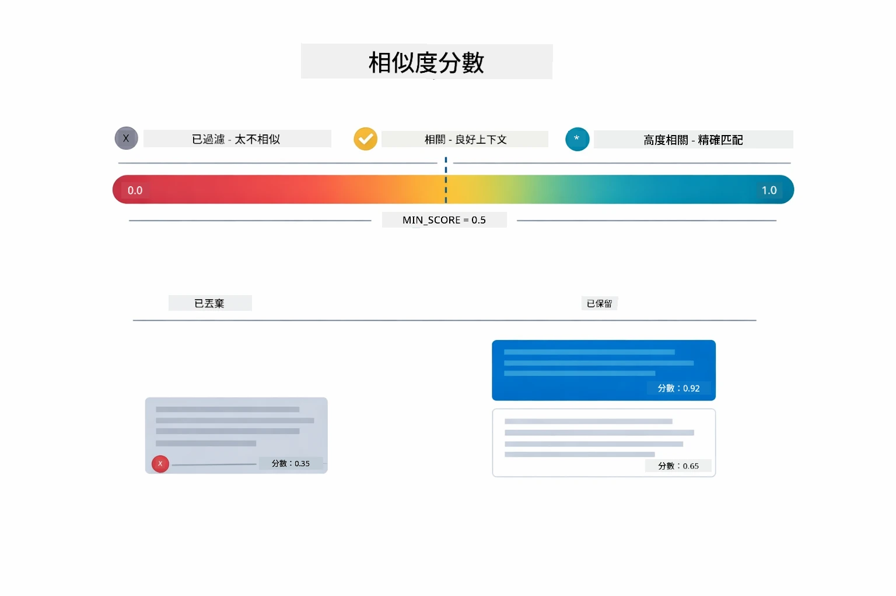

*此圖展示分數從 0 到 1 的範圍，並設定 0.5 最低門檻來過濾不相關文本塊。*

分數範圍：
- 0.7-1.0：高度相關，精確匹配
- 0.5-0.7：相關，具足夠上下文
- 低於 0.5：被過濾，差異過大

系統只擷取超過最低門檻的文本塊以確保品質。

嵌入向量在語義聚類清晰時效果佳，但存在盲點。下圖展示常見失敗模式—文本塊太大產生模糊向量、文本塊過小缺乏上下文、模糊詞彙指向多個聚類，以及精確匹配查詢（如 ID、部件號碼）無法用嵌入向量處理：

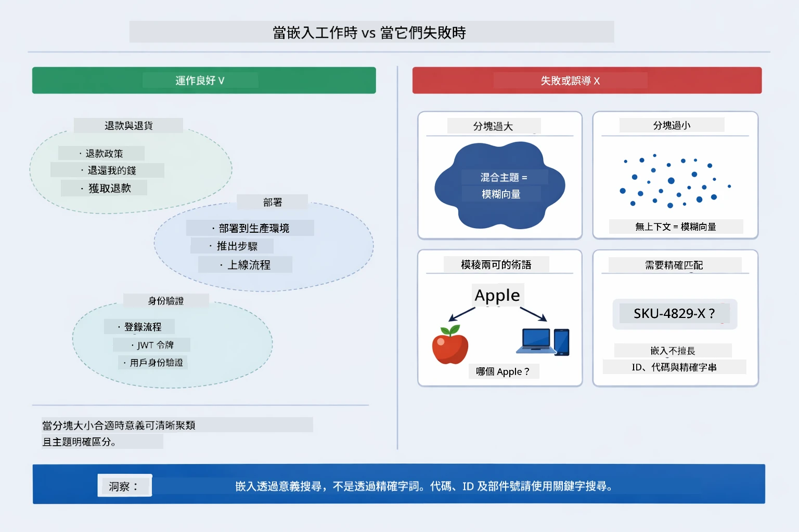

*此圖展示常見嵌入失敗模式：文本塊過大、過小、模糊詞指向多聚類，以及精確匹配查詢如 ID 等。*

### 記憶體儲存

此模組為簡化起見採用記憶體儲存。重啟應用程式會遺失上傳的文件。正式系統會使用持久向量資料庫，如 Qdrant 或 Azure AI Search。

### 上下文視窗管理

每個模型有最大上下文視窗限制。無法包含大型文件的所有文本塊。系統取回最相關的前 N 個文本塊（預設 5 個），在限制內提供足夠上下文以生成精確答案。

## RAG 的適用時機

RAG 並非總是最佳方案。下圖決策指引幫助判斷何時 RAG 有價值，何時可使用簡易方式（如直接將內容納入提示或依賴模型內建知識）即可：

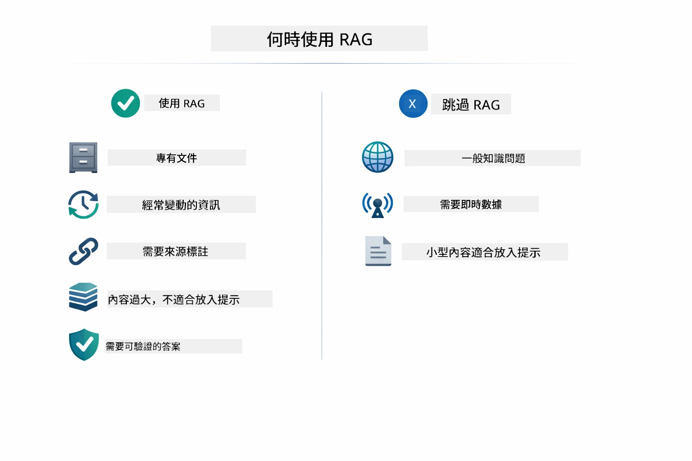

*此圖為決策指引，説明何時 RAG 加值，何時簡易方案足夠。*

**使用 RAG 時機：**
- 回答專有文件相關問題
- 資訊頻繁變動（政策、價格、規格）
- 需精確來源歸屬保證準確性
- 內容過大無法放入單一提示
- 需要可驗證、有根據的回應

**不使用 RAG 時機：**
- 問題需模型已有的常識
- 需即時資料（RAG 只針對已上傳文件）
- 內容足夠小可直接放入提示

## 下一步

**下一模組：** [04-tools - AI Agents with Tools](../04-tools/README.md)

---

**導航：** [← 上一節：Module 02 - 提示工程](../02-prompt-engineering/README.md) | [回到主頁](../README.md) | [下一節：Module 04 - 工具 →](../04-tools/README.md)

---

<!-- CO-OP TRANSLATOR DISCLAIMER START -->
**免責聲明**：  
本文件使用人工智能翻譯服務 [Co-op Translator](https://github.com/Azure/co-op-translator) 進行翻譯。雖然我們致力於確保翻譯的準確性，但請注意，自動翻譯可能包含錯誤或不準確之處。原始語言版本的文件應被視為權威來源。對於重要資訊，建議採用專業人工翻譯。因使用此翻譯而引起的任何誤解或誤釋，本公司概不負責。
<!-- CO-OP TRANSLATOR DISCLAIMER END -->