# Module 04: AI Agents with Tools

## 目錄

- [視頻演示](../../../04-tools)
- [你將學到什麼](../../../04-tools)
- [前置條件](../../../04-tools)
- [了解帶有工具的 AI 智能代理](../../../04-tools)
- [工具調用運作方式](../../../04-tools)
  - [工具定義](../../../04-tools)
  - [決策制定](../../../04-tools)
  - [執行](../../../04-tools)
  - [回應生成](../../../04-tools)
  - [架構：Spring Boot 自動注入](../../../04-tools)
- [工具串聯](../../../04-tools)
- [運行應用程式](../../../04-tools)
- [使用應用程式](../../../04-tools)
  - [嘗試簡單工具使用](../../../04-tools)
  - [測試工具串聯](../../../04-tools)
  - [查看對話流程](../../../04-tools)
  - [嘗試不同請求](../../../04-tools)
- [關鍵概念](../../../04-tools)
  - [ReAct 模式（推理與行動）](../../../04-tools)
  - [工具描述很重要](../../../04-tools)
  - [會話管理](../../../04-tools)
  - [錯誤處理](../../../04-tools)
- [可用工具](../../../04-tools)
- [何時使用基於工具的代理](../../../04-tools)
- [工具與 RAG 的比較](../../../04-tools)
- [後續步驟](../../../04-tools)

## 視頻演示

觀看本直播課程，了解如何開始使用本模組：

<a href="https://www.youtube.com/watch?v=O_J30kZc0rw"></a>

## 你將學到什麼

到目前為止，你已學會如何與 AI 進行對話，如何有效結構提示，以及如何將回應根據你的文件做出基礎。但仍有一個根本限制：語言模型只能生成文本。它無法查詢天氣、執行計算、查詢數據庫或與外部系統互動。

工具改變了這一點。通過給模型訪問可調用的函數，你將它從純文字生成器轉變為能採取行動的代理。模型決定什麼時候需要工具、使用哪個工具以及傳遞哪些參數。你的程式碼執行函數並返回結果。模型再將結果融合到回應中。

## 前置條件

- 完成 [模組 01 - 介紹](../01-introduction/README.md)（Azure OpenAI 資源已部署）
- 建議完成前置模組（本模組在工具與 RAG 比較中參考了 [模組 03 的 RAG 概念](../03-rag/README.md)）
- 根目錄中有 `.env` 文件包含 Azure 認證（由模組 01 的 `azd up` 創建）

> **注意：** 如果尚未完成模組 01，請先按照那裡的部署說明操作。

## 了解帶有工具的 AI 智能代理

> **📝 注意：** 本模組中「agents」指的是具備工具調用能力的 AI 助手。這與我們將在 [模組 05: MCP](../05-mcp/README.md) 中介紹的 **Agentic AI** 模式（具備自主規劃、記憶和多步推理的自主代理）不同。

沒有工具時，語言模型只能基於訓練數據生成文本。問它當前天氣，它只能猜測。給它工具，它可以調用天氣 API、執行計算或查詢資料庫，然後將這些真實結果融合入回答。

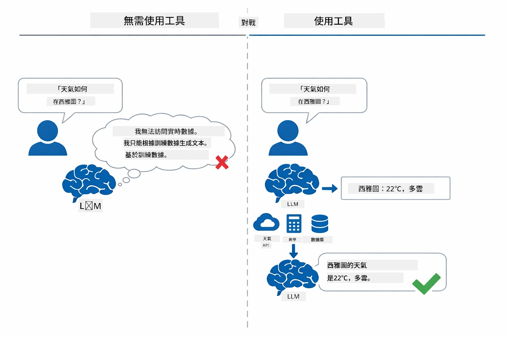

*沒有工具時模型只能猜測 — 有了工具它可以調用 API、執行計算並回傳實時數據。*

帶工具的 AI 代理遵循 **推理與行動（ReAct）** 模式。模型不只是回應——它會思考自己需要什麼，透過調用工具行動，觀察結果，然後決定是否繼續行動或給出最終答案：

1. **推理** — 代理分析使用者問題並判斷需要什麼資訊
2. **行動** — 代理選擇合適工具，生成正確參數並呼叫它
3. **觀察** — 代理接收工具輸出並評估結果
4. **重複或回應** — 如果需要更多資料，迴圈返回；否則組合出自然語言回應

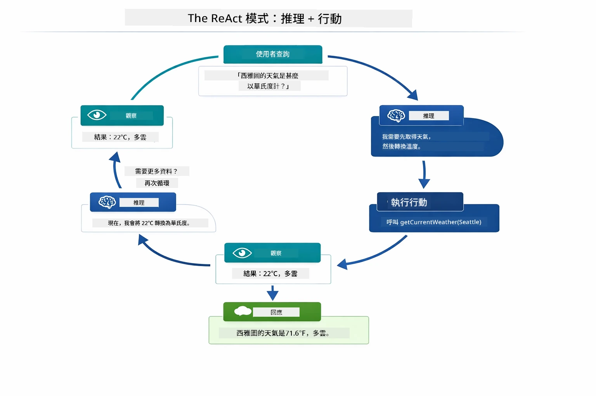

*ReAct 循環——代理推理要做什麼，透過調用工具行動，觀察結果，迴圈直到給出最佳回應。*

這個過程是自動進行的。你定義工具和它們的描述，模型則自動決定何時以及如何使用它們。

## 工具調用運作方式

### 工具定義

[WeatherTool.java](../../../04-tools/src/main/java/com/example/langchain4j/agents/tools/WeatherTool.java) | [TemperatureTool.java](../../../04-tools/src/main/java/com/example/langchain4j/agents/tools/TemperatureTool.java)

你定義具備清晰說明和參數規定的函數。模型在系統提示中看到這些描述，理解每個工具的功能。

```java
@Component
public class WeatherTool {
    
    @Tool("Get the current weather for a location")
    public String getCurrentWeather(@P("Location name") String location) {
        // 你的天氣查詢邏輯
        return "Weather in " + location + ": 22°C, cloudy";
    }
}

@AiService
public interface Assistant {
    String chat(@MemoryId String sessionId, @UserMessage String message);
}

// 助手由 Spring Boot 自動連接，包含：
// - ChatModel bean
// - 所有來自 @Component 類別的 @Tool 方法
// - 用於會話管理的 ChatMemoryProvider
```

下圖解析每個註解，展示如何協助 AI 理解何時調用工具及傳遞哪些參數：

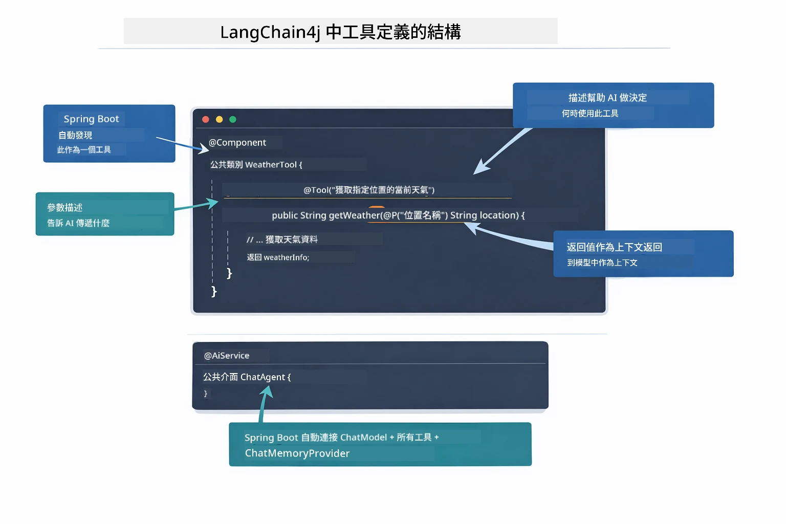

*工具定義剖析 — @Tool 告訴 AI 何時使用，@P 說明每個參數，@AiService 在啟動時串接所有元素。*

> **🤖 嘗試使用 [GitHub Copilot](https://github.com/features/copilot) Chat：** 打開 [`WeatherTool.java`](../../../04-tools/src/main/java/com/example/langchain4j/agents/tools/WeatherTool.java) 並詢問：
> - 「如何集成像 OpenWeatherMap 這樣的真實天氣 API，而非模擬數據？」
> - 「什麼樣的工具描述能幫助 AI 正確使用該工具？」
> - 「如何在工具實現中處理 API 錯誤和速率限制？」

### 決策制定

當使用者詢問「西雅圖的天氣如何？」時，模型不會隨便選擇工具。它將使用者意圖與所有工具描述比對，評分相關性，然後選出最佳匹配。接著產生結構化函數調用，帶上正確參數 — 這例子中是將 `location` 設為 `"Seattle"`。

若無匹配工具，模型會退回用自身知識回答。若多個工具匹配，模型會選擇最具體的那個。

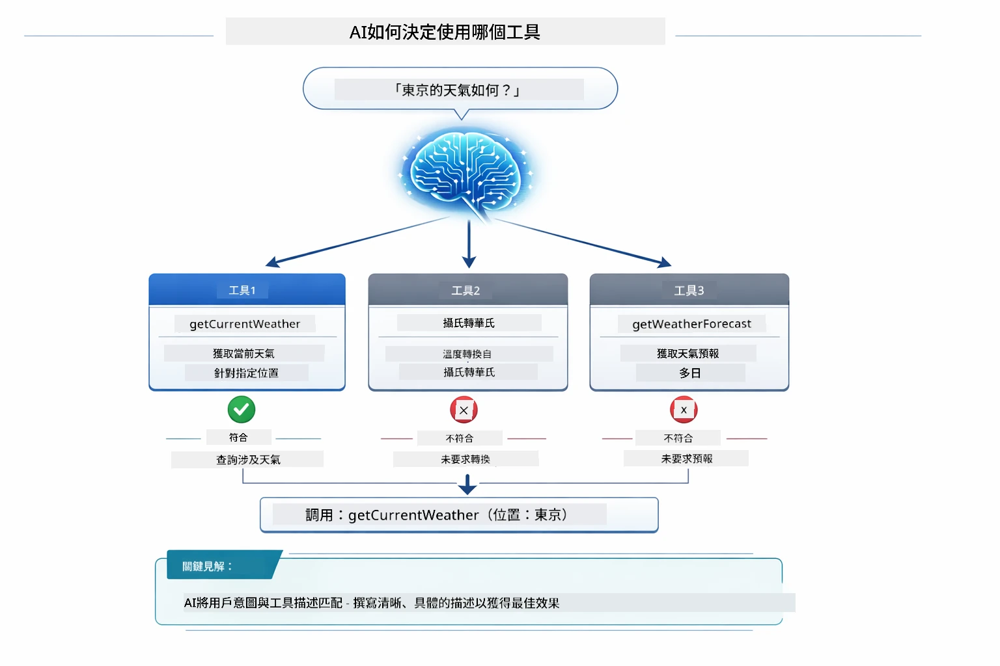

*模型評估每個可用工具和使用者意圖的匹配程度，選出最佳工具—因此編寫清晰、具體的工具描述至關重要。*

### 執行

[AgentService.java](../../../04-tools/src/main/java/com/example/langchain4j/agents/service/AgentService.java)

Spring Boot 自動為所有註冊工具注入宣告式的 `@AiService` 介面，LangChain4j 自動執行工具調用。背後完整的工具調用流程涵蓋六個階段——從使用者的自然語言問題到最終的自然語言回答：

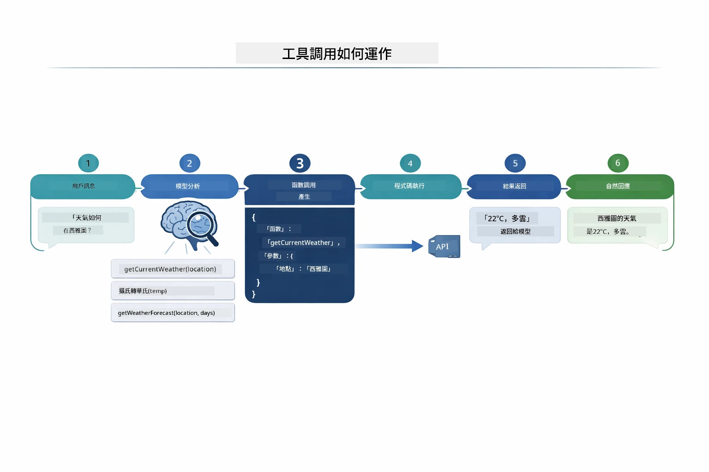

*端到端流程——使用者提問，模型挑選工具，LangChain4j 執行該工具，模型將結果編織成自然的回覆。*

如果你執行過模組 00 的 [ToolIntegrationDemo](../../../00-quick-start/src/main/java/com/example/langchain4j/quickstart/ToolIntegrationDemo.java)，已見過這個模式—— `Calculator` 工具的調用即是如此。下面的序列圖展示當時背後發生了什麼：

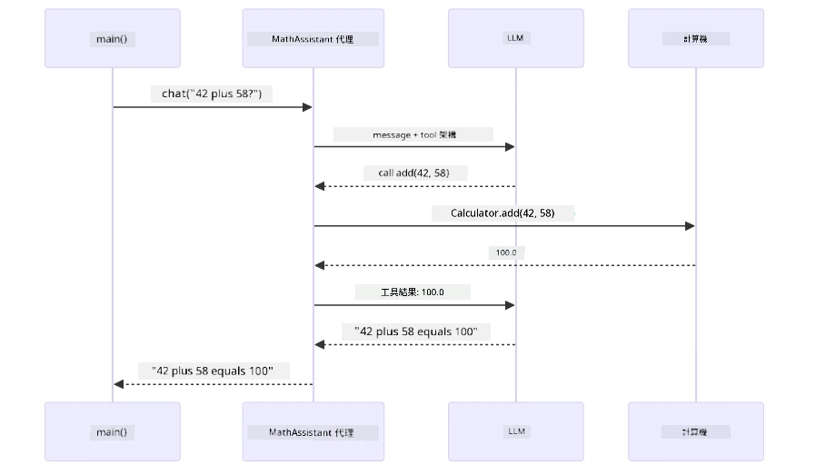

*快速入門演示中的工具調用循環——`AiServices` 將訊息和工具結構傳給 LLM，LLM 回傳函數調用像是 `add(42, 58)`，LangChain4j 本地執行 `Calculator` 方法，然後傳回結果產生最終回答。*

> **🤖 嘗試使用 [GitHub Copilot](https://github.com/features/copilot) Chat：** 打開 [`AgentService.java`](../../../04-tools/src/main/java/com/example/langchain4j/agents/service/AgentService.java) 並詢問：
> - 「ReAct 模式如何運作，為何對 AI 代理有效？」
> - 「代理如何決定使用哪個工具以及順序？」
> - 「工具執行失敗會怎樣？如何穩健處理錯誤？」

### 回應生成

模型接收天氣資料，並將其格式化成自然語言回應給使用者。

### 架構：Spring Boot 自動注入

本模組使用 LangChain4j 的 Spring Boot 集成，使用宣告式的 `@AiService` 介面。啟動時，Spring Boot 會發現所有帶 `@Tool` 的 `@Component`、你的 `ChatModel` Bean，以及 `ChatMemoryProvider`，然後將它們通通注入至單一的 `Assistant` 介面，毫無冗餘代碼。

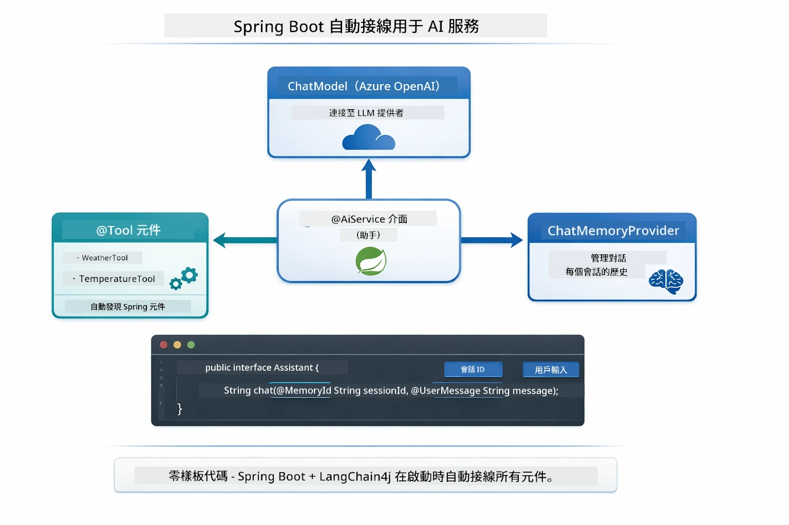

*@AiService 介面整合了 ChatModel、工具組件和記憶提供者 — Spring Boot 自動處理所有注入。*

以下是完整請求生命週期的序列圖——從 HTTP 請求透過控制器、服務、自動注入代理，一直到工具執行和回傳：

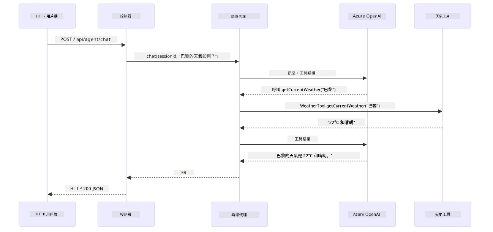

*完整 Spring Boot 請求生命週期——HTTP 請求從控制器和服務流向自動注入的 Assistant 代理，由其自動協調 LLM 和工具調用。*

此方法的主要優點：

- **Spring Boot 自動注入** — ChatModel 與工具自動注入
- **@MemoryId 模式** — 自動會話記憶管理
- **單例實例** — Assistant 創建一次重複使用，提高效能
- **類型安全執行** — Java 方法直接呼叫並轉換類型
- **多輪調度** — 自動處理工具串聯
- **零冗餘代碼** — 無需手動調用 `AiServices.builder()` 或管理記憶 HashMap

手動 `AiServices.builder()` 的替代方案需要更多代碼且無法享受 Spring Boot 集成的便利。

## 工具串聯

**工具串聯** — 工具型代理真正強大的地方在於需要多個工具回答同一問題。問「西雅圖的天氣是多少華氏度？」時，代理會自動串接兩個工具：先調用 `getCurrentWeather` 取得攝氏溫度，然後將該結果傳給 `celsiusToFahrenheit` 進行換算——全部在單次對話回合內完成。

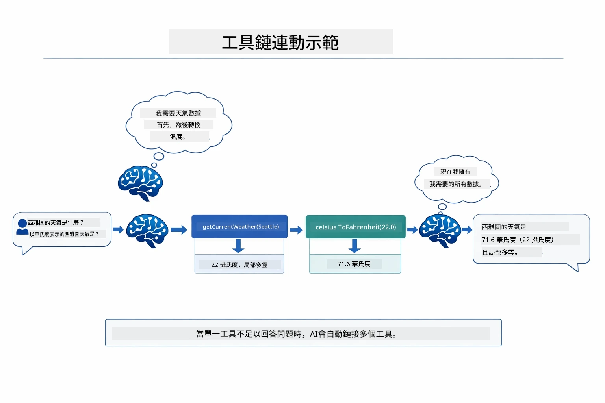

*工具串聯實例——代理先調用 getCurrentWeather，再將攝氏溫度作為輸入傳給 celsiusToFahrenheit，最後給出綜合回答。*

**優雅失敗** — 詢問不存在於模擬數據中的城市天氣，工具返回錯誤訊息，AI 會解釋無法提供幫助而非崩潰。工具錯誤安全失效。下圖對比了兩種做法——妥善錯誤處理時，代理捕捉例外並提供合理回應，未處理時則導致整個應用崩潰：

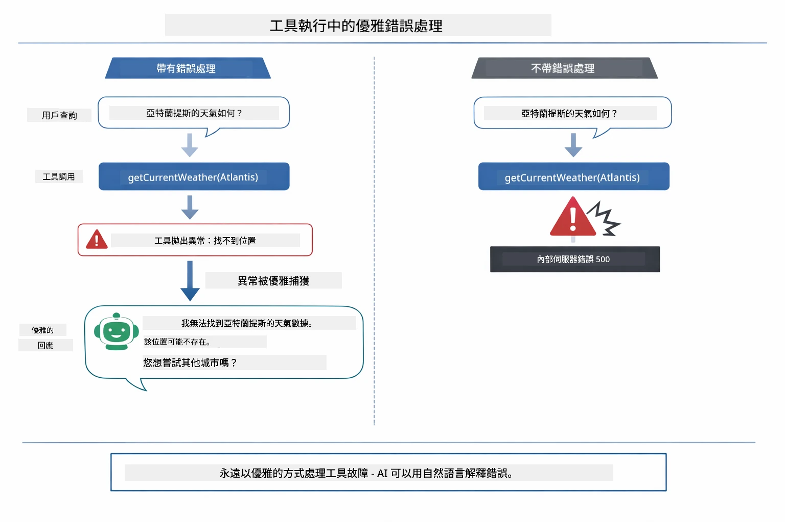

*工具發生錯誤時，代理捕捉並回覆有用的說明，而非使應用崩潰。*

此流程於單次對話回合完成。代理自動協調多工具調用。

## 運行應用程式

**驗證部署：**

確保根目錄有 `.env` 文件並包含 Azure 認證（在模組 01 期間已建立）。切換本模組目錄 (`04-tools/`) 執行：

**Bash：**
```bash
cat ../.env  # 應該顯示 AZURE_OPENAI_ENDPOINT、API_KEY、DEPLOYMENT
```

**PowerShell：**
```powershell
Get-Content ..\.env  # 應該顯示 AZURE_OPENAI_ENDPOINT、API_KEY、DEPLOYMENT
```

**啟動應用程式：**

> **注意：** 如果你已使用根目錄的 `./start-all.sh` 啟動所有應用（模組 01 中說明），本模組已在 8084 端口運行。可跳過以下啟動指令，直接訪問 http://localhost:8084。

**方案 1：使用 Spring Boot 儀表板（推薦 VS Code 使用者）**

開發容器包含 Spring Boot 儀表板擴充，提供可視化介面管理所有 Spring Boot 應用。此工具位於 VS Code 左側活動欄（尋找 Spring Boot 圖示）。

在 Spring Boot 儀表板，你可以：
- 看到工作區中所有可用的 Spring Boot 應用
- 一鍵啟動/停止應用
- 實時查看應用日誌
- 監控應用狀態
只需點擊「tools」旁邊的播放按鈕即可啟動此模組，或一次啟動所有模組。

以下是 VS Code 中的 Spring Boot Dashboard 介面：


*VS Code 中的 Spring Boot Dashboard — 從一處啟動、停止及監控所有模組*

**選項 2：使用 shell 腳本**

啟動所有網頁應用程式（模組 01-04）：

**Bash:**
```bash
cd ..  # 從根目錄
./start-all.sh
```

**PowerShell:**
```powershell
cd ..  # 從根目錄
.\start-all.ps1
```

或只啟動此模組：

**Bash:**
```bash
cd 04-tools
./start.sh
```

**PowerShell:**
```powershell
cd 04-tools
.\start.ps1
```

兩個腳本會自動從根目錄的 `.env` 文件載入環境變數，並在 JAR 不存在時自動建立。

> **注意：** 如果您偏好在啟動前手動建置所有模組：
>
> **Bash:**
> ```bash
> cd ..  # Go to root directory
> mvn clean package -DskipTests
> ```
>
> **PowerShell:**
> ```powershell
> cd ..  # Go to root directory
> mvn clean package -DskipTests
> ```

在瀏覽器中開啟 http://localhost:8084 。

**停止指令：**

**Bash:**
```bash
./stop.sh  # 僅此模組
# 或
cd .. && ./stop-all.sh  # 所有模組
```

**PowerShell:**
```powershell
.\stop.ps1  # 僅此模組
# 或
cd ..; .\stop-all.ps1  # 所有模組
```

## 使用應用程式

此應用程式提供網頁介面，可讓您與擁有天氣和溫度轉換工具的 AI 代理互動。以下是介面截圖 — 包含快速入門範例和聊天面板以發送請求：

<a href="images/tools-homepage.png"></a>

*AI 代理工具介面 — 快速範例與聊天介面，用於與工具互動*

### 嘗試簡單的工具使用

從簡單請求開始：「將華氏 100 度轉換成攝氏度」。代理會識別需要使用溫度轉換工具，呼叫正確的參數並回傳結果。注意這感覺多麼自然 — 您並未指定使用哪個工具或如何呼叫。

### 測試工具串接

現在試試較複雜的請求：「西雅圖的天氣如何，並將其轉換成華氏度？」觀看代理如何分步處理：它先取得天氣（回傳攝氏度），判斷需要轉換成華氏度，呼叫轉換工具，並將兩者結果合併回覆。

### 查看對話流程

聊天介面會保留對話歷史，允許您進行多回合互動。您可以看到所有先前的查詢和回應，方便追蹤對話進度，並理解代理如何在多次交換中建立語境。

<a href="images/tools-conversation-demo.png"></a>

*多回合對話，顯示簡單轉換、天氣查詢和工具串接*

### 嘗試不同請求

嘗試各種組合：
- 天氣查詢：「東京天氣如何？」
- 溫度轉換：「25°C 是多少開爾文？」
- 結合查詢：「查詢巴黎的天氣，告訴我是否高於 20°C」

注意代理如何解讀自然語言並映射到適當工具呼叫。

## 主要概念

### ReAct 模式（推理與行動）

代理在推理（決定要做什麼）和行動（使用工具）之間交替。此模式賦予自主解決問題的能力，而不僅是回應指示。

### 工具描述的重要性

工具描述的品質直接影響代理使用工具的效果。清楚、具體的描述幫助模型理解何時及如何呼叫每個工具。

### 會話管理

`@MemoryId` 註解啟用自動的基於會話的記憶管理。每個會話 ID 都獲得由 `ChatMemoryProvider` 管理的專屬 `ChatMemory` 實例，讓多位使用者同時與代理互動時不會混淆對話歷史。下圖顯示多用戶如何根據其會話 ID 路由至隔離的記憶存儲：

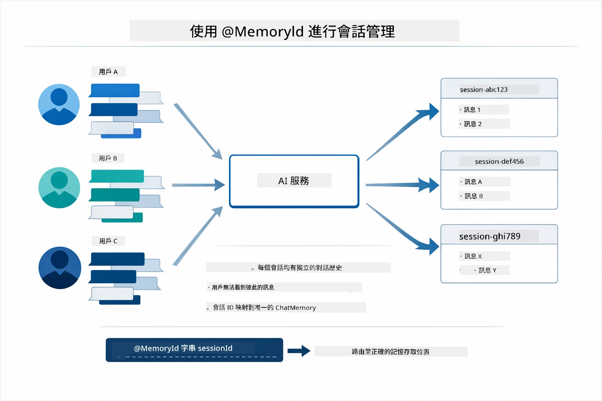

*每個會話 ID 映射至一個獨立的對話歷史 — 使用者永遠看不到彼此訊息。*

### 錯誤處理

工具可能失敗 — API 超時、參數無效、外部服務中斷。生產環境的代理需要錯誤處理機制，以便模型能解釋問題或嘗試替代方案，而非導致應用程式崩潰。當工具拋出異常時，LangChain4j 會捕捉並將錯誤訊息傳回模型，模型再用自然語言說明問題。

## 可用工具

下圖展示可建構的廣泛工具生態系。此模組示範天氣和溫度工具，但相同的 `@Tool` 模式可套用於任何 Java 方法 — 從資料庫查詢到支付處理皆適用。

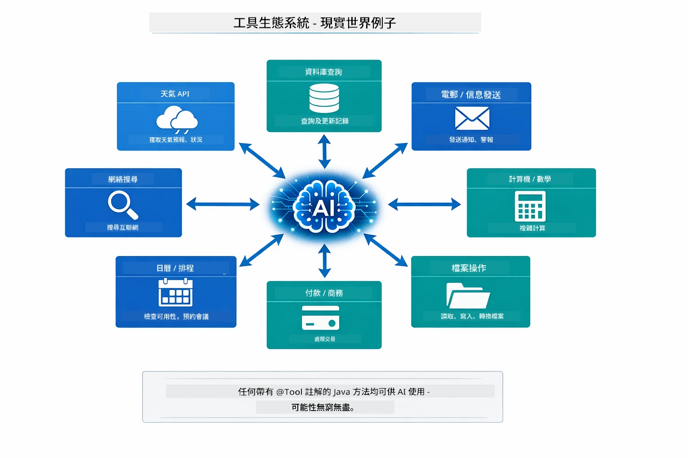

*任何使用 @Tool 註解的 Java 方法都可對 AI 開放 — 此模式涵蓋資料庫、API、電子郵件、檔案操作等。*

## 何時使用工具型代理

並非每個請求都需要工具。判斷依據在於 AI 是否需與外部系統互動，或可僅從自身知識庫回答。下圖總結何時工具有價值、何時無須使用：

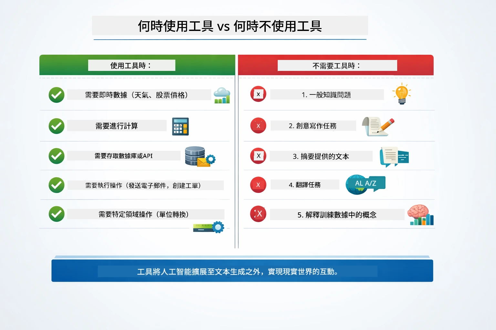

*快速決策指引 — 工具適用於即時資料、計算和操作；一般知識和創意任務不需使用。*

## 工具與 RAG 比較

模組 03 和 04 都擴展了 AI 的能力，但方式根本不同。RAG 透過檢索文件提供模型**知識**。工具則讓模型能透過函式呼叫執行**動作**。下圖並列比較這兩種方法 — 從工作流程運作到彼此取捨：

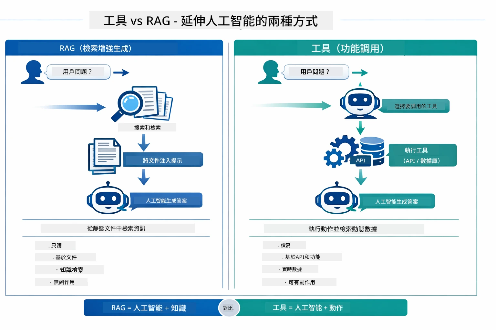

*RAG 從靜態文件檢索資訊 — 工具執行動作並取得動態即時資料。許多生產系統結合兩者使用。*

實務上，許多生產系統結合兩種方法：RAG 以文件為基礎解答，工具則用於取得即時數據或執行操作。

## 下一步

**下一模組：** [05-mcp - 模型上下文協議 (MCP)](../05-mcp/README.md)

---

**導覽：** [← 上一頁：模組 03 - RAG](../03-rag/README.md) | [回主頁](../README.md) | [下一頁：模組 05 - MCP →](../05-mcp/README.md)

---

<!-- CO-OP TRANSLATOR DISCLAIMER START -->
**免責聲明**：  
本文件由 AI 翻譯服務 [Co-op Translator](https://github.com/Azure/co-op-translator) 所翻譯。雖然我們致力於準確性，但請注意自動翻譯可能包含錯誤或不準確之處。原始文件的原文版本應被視為權威來源。對於重要資訊，建議聘請專業人工翻譯。本公司對因使用此翻譯所引起的任何誤解或錯誤詮釋概不負責。
<!-- CO-OP TRANSLATOR DISCLAIMER END -->