# Module 05: 模型上下文協議 (MCP)

## 目錄

- [影片講解](../../../05-mcp)
- [你將學到什麼](../../../05-mcp)
- [什麼是 MCP？](../../../05-mcp)
- [MCP 如何運作](../../../05-mcp)
- [Agentic 模組](../../../05-mcp)
- [執行範例](../../../05-mcp)
  - [先決條件](../../../05-mcp)
- [快速開始](../../../05-mcp)
  - [檔案操作（Stdio）](../../../05-mcp)
  - [監督代理](../../../05-mcp)
    - [執行示範](../../../05-mcp)
    - [監督代理如何運作](../../../05-mcp)
    - [FileAgent 如何在執行時發現 MCP 工具](../../../05-mcp)
    - [回應策略](../../../05-mcp)
    - [理解輸出](../../../05-mcp)
    - [Agentic 模組功能說明](../../../05-mcp)
- [關鍵概念](../../../05-mcp)
- [恭喜！](../../../05-mcp)
  - [接下來呢？](../../../05-mcp)

## 影片講解

觀看此直播課程，說明如何開始使用本模組：

<a href="https://www.youtube.com/watch?v=O_J30kZc0rw"></a>

## 你將學到什麼

你已建立了對話式 AI、精通提示、讓回應根植於文件中，並創建了帶有工具的代理。但這些工具都是為你的特定應用量身訂製的。如果你能讓 AI 存取一個任何人都能創建和分享的標準化工具生態系統，會怎樣？在本模組中，你將學會如何使用模型上下文協議（MCP）和 LangChain4j 的 agentic 模組來達成此目的。我們首先展示一個簡單的 MCP 檔案閱讀器，然後展示如何輕鬆整合進高級 agentic 工作流程，採用監督代理模式。

## 什麼是 MCP？

模型上下文協議（MCP）正是提供這樣的功能——為 AI 應用發現和使用外部工具提供一種標準方式。不用為每個資料來源或服務編寫自訂整合，你只需連接到以一致格式公開能力的 MCP 伺服器。你的 AI 代理就能自動發現並使用這些工具。

下圖展示了差異——沒有 MCP 時，每個整合都需要自訂的點對點連接；有了 MCP，一個協議即可將你的應用連接到任意工具：


*MCP 之前：複雜的點對點整合。MCP 之後：一個協議，無限可能。*

MCP 解決了 AI 開發的一個根本問題：每個整合都是自訂的。要存取 GitHub？寫自訂代碼。要讀取檔案？寫自訂代碼。要查詢資料庫？寫自訂代碼。而且這些整合都無法與其他 AI 應用互用。

MCP 使其標準化。一個 MCP 伺服器會以清晰說明與結構公開工具。任何 MCP 用戶端都可以連接、發現可用工具並使用。寫一次，處處用。

下圖說明此架構——單一 MCP 用戶端（你的 AI 應用）連接多個 MCP 伺服器，每個都透過標準協議公開自有工具集：


*模型上下文協議架構——標準化工具發現與執行*

## MCP 如何運作

在底層，MCP 使用分層架構。你的 Java 應用 (MCP 用戶端) 發現可用工具，通過傳輸層（Stdio 或 HTTP）發送 JSON-RPC 請求，MCP 伺服器執行操作並返回結果。下圖細分此協議的每一層：

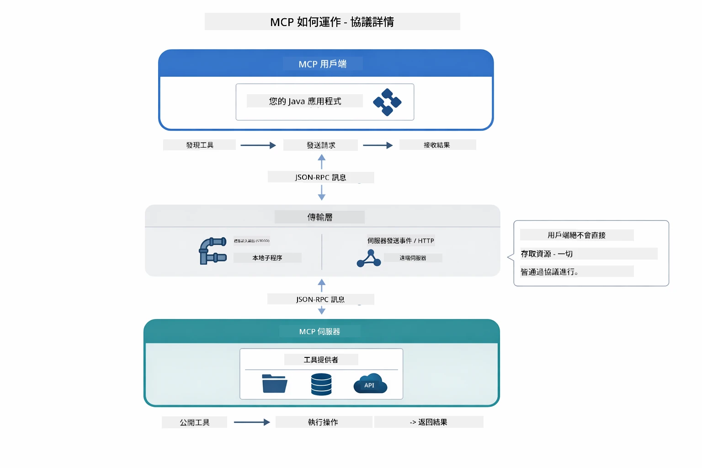

*MCP 底層如何運作——用戶端發現工具，交換 JSON-RPC 訊息，通過傳輸層執行操作。*

**伺服器-用戶端架構**

MCP 採用用戶端-伺服器模式。伺服器提供工具——讀檔、查詢資料庫、呼叫 API。用戶端（你的 AI 應用）連接伺服器並使用其工具。

要與 LangChain4j 使用 MCP，請加入以下 Maven 依賴：

```xml
<dependency>
    <groupId>dev.langchain4j</groupId>
    <artifactId>langchain4j-mcp</artifactId>
    <version>${langchain4j.version}</version>
</dependency>
```

**工具發現**

當你的用戶端連線 MCP 伺服器時，會詢問「你有哪些工具？」伺服器回傳可用工具清單，每個工具帶有描述與參數結構。你的 AI 代理會根據用戶請求決定使用哪些工具。以下圖示此握手——用戶端送出 `tools/list` 請求，伺服器回傳可用工具及描述和參數結構：

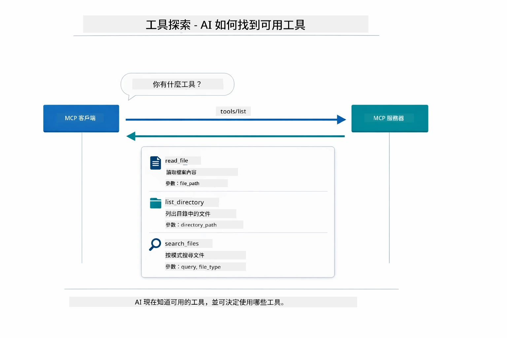

*AI 启動时发现可用工具——現在知道有哪些能力可用，並可以決定使用哪個。*

**傳輸機制**

MCP 支援不同傳輸機制。兩個選項是 Stdio（本地子程序通訊）及可串流 HTTP（遠端伺服器）。本模組示範 Stdio 傳輸：


*MCP 傳輸機制：HTTP 用於遠端伺服器，Stdio 用於本地程序*

**Stdio** - [StdioTransportDemo.java](../../../05-mcp/src/main/java/com/example/langchain4j/mcp/StdioTransportDemo.java)

用於本地程序。你的應用啟動伺服器作為子程序，通過標準輸入/輸出通訊。適用於檔案系統訪問或命令行工具。

```java
McpTransport stdioTransport = new StdioMcpTransport.Builder()
    .command(List.of(
        npmCmd, "exec",
        "@modelcontextprotocol/server-filesystem@2025.12.18",
        resourcesDir
    ))
    .logEvents(false)
    .build();
```

`@modelcontextprotocol/server-filesystem` 伺服器公開以下工具，皆受限於你指定的目錄沙箱中：

| 工具 | 描述 |
|------|------|
| `read_file` | 讀取單一檔案內容 |
| `read_multiple_files` | 一次讀取多個檔案 |
| `write_file` | 建立或覆蓋檔案 |
| `edit_file` | 針對性搜尋替換編輯 |
| `list_directory` | 列出路徑下的檔案及目錄 |
| `search_files` | 遞迴搜尋符合模式的檔案 |
| `get_file_info` | 取得檔案元資料（大小、時間戳、權限） |
| `create_directory` | 建立目錄（包含父目錄） |
| `move_file` | 移動或重新命名檔案或目錄 |

下圖展示 Stdio 傳輸在執行中的運作流程——你的 Java 應用啟動 MCP 伺服器作為子程序，通過 stdin/stdout 管道通訊，完全不涉及網路或 HTTP：

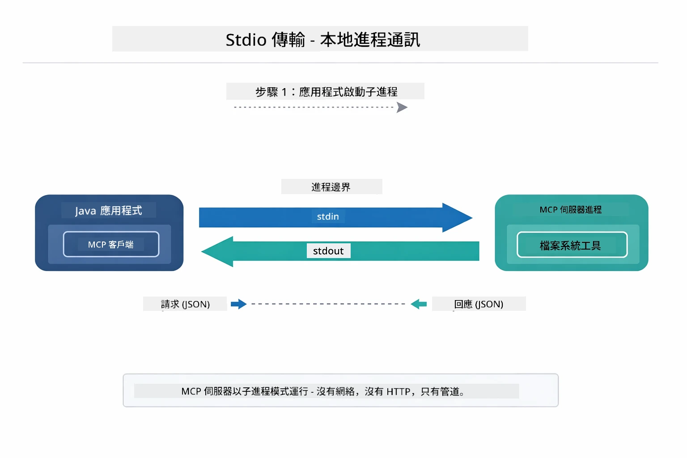

*Stdio 傳輸實例——你的應用啟動 MCP 伺服器作為子程序，並通過 stdin/stdout 管道通訊。*

> **🤖 用 [GitHub Copilot](https://github.com/features/copilot) Chat 試試看：** 開啟 [`StdioTransportDemo.java`](../../../05-mcp/src/main/java/com/example/langchain4j/mcp/StdioTransportDemo.java) 並問：
> - 「Stdio 傳輸如何運作？什麼時候應用 Stdio 而非 HTTP？」
> - 「LangChain4j 如何管理已啟動 MCP 伺服器進程的生命週期？」
> - 「讓 AI 存取檔案系統的安全風險是什麼？」

## Agentic 模組

雖然 MCP 提供標準化工具，LangChain4j 的 **agentic 模組** 則提供宣告式方式構建能協調這些工具的代理。`@Agent` 註解與 `AgenticServices` 讓你通過介面定義代理行為，而非命令式代碼。

本模組探索的是 **監督代理** 模式——一種先進的 agentic AI 方式，監督代理會動態決定根據用戶請求調用哪些子代理。我們將結合兩者，讓其中一個子代理具備基於 MCP 的檔案存取能力。

要使用 agentic 模組，加入此 Maven 依賴：

```xml
<dependency>
    <groupId>dev.langchain4j</groupId>
    <artifactId>langchain4j-agentic</artifactId>
    <version>${langchain4j.mcp.version}</version>
</dependency>
```
> **注意：** `langchain4j-agentic` 模組使用獨立版本屬性 (`langchain4j.mcp.version`)，因為其發布節奏與核心 LangChain4j 函式庫不同。

> **⚠️ 實驗性質：** `langchain4j-agentic` 模組為 **實驗性**，可能變動。穩定建構 AI 助手的方式仍是使用 `langchain4j-core` 並搭配自訂工具（模組 04）。

## 執行範例

### 先決條件

- 已完成 [模組 04 - 工具](../04-tools/README.md) （本模組建立於自訂工具概念並與 MCP 工具比較）
- 根目錄有 `.env` 檔案，內含 Azure 認證（由模組 01 的 `azd up` 建立）
- Java 21+、Maven 3.9+
- Node.js 16+ 和 npm（用於 MCP 伺服器）

> **注意：** 如果尚未設定環境變數，參閱 [模組 01 - 介紹](../01-introduction/README.md) 的部署指引（`azd up` 會自動建立 `.env` 檔案），或將 `.env.example` 複製為根目錄的 `.env`，並填寫你的值。

## 快速開始

**使用 VS Code：** 在檔案總管中右鍵任一示範檔案，選擇 **"Run Java"**，或用偵錯與執行面板的啟動設定（確保先配置 `.env` 內的 Azure 認證）。

**使用 Maven：** 也可在命令列使用下列示例執行。

### 檔案操作（Stdio）

示範基於本地子程序的工具。

**✅ 無需先決條件** — MCP 伺服器會自動啟動。

**使用啟動腳本（推薦）：**

啟動腳本會自動從根目錄 `.env` 載入環境變數：

**Bash:**
```bash
cd 05-mcp
chmod +x start-stdio.sh
./start-stdio.sh
```

**PowerShell:**
```powershell
cd 05-mcp
.\start-stdio.ps1
```

**使用 VS Code：** 右鍵 `StdioTransportDemo.java` 選擇 **"Run Java"**（確保 `.env` 配置妥當）。

應用會自動啟動檔案系統 MCP 伺服器並讀取本地檔案。注意子程序管理已為你處理。

**預期輸出：**
```
Assistant response: The file provides an overview of LangChain4j, an open-source Java library
for integrating Large Language Models (LLMs) into Java applications...
```

### 監督代理

**監督代理模式** 是一種 **靈活** 的 agentic AI 形式。監督者使用大型語言模型自動決定要調用哪些代理。下一個示範結合 MCP 驅動檔案存取與 LLM 代理，構建監督的「讀檔→生成報告」工作流程。

示範中，`FileAgent` 使用 MCP 檔案系統工具讀取檔案，`ReportAgent` 生成結構化報告，有執行摘要（一句話）、3 大要點及建議。監督者自動協調此流程：

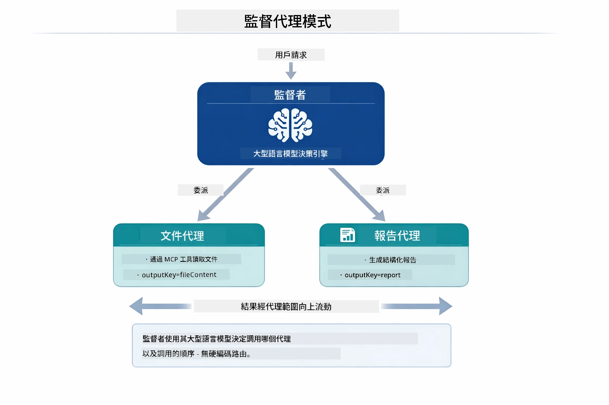

*監督者利用其 LLM 決定調用哪些代理以及呼叫順序——無需硬編碼路由。*

以下是我們檔案到報告流程的具體工作流程：

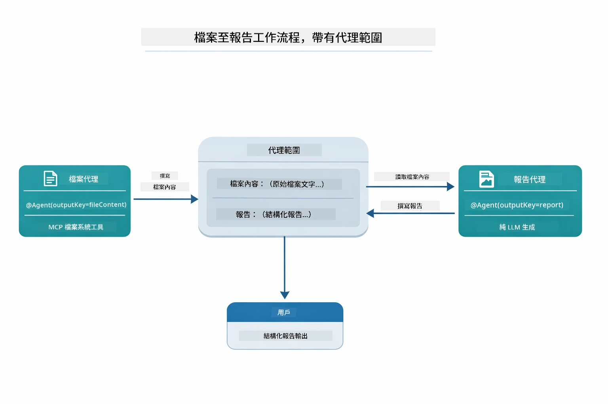

*FileAgent 透過 MCP 工具讀取檔案，隨後 ReportAgent 將原始內容轉換成結構化報告。*

以下時序圖追蹤完整監督協調過程——從啟動 MCP 伺服器、透過監督者自主選擇代理、在 stdio 上呼叫工具，到最終報告產生：

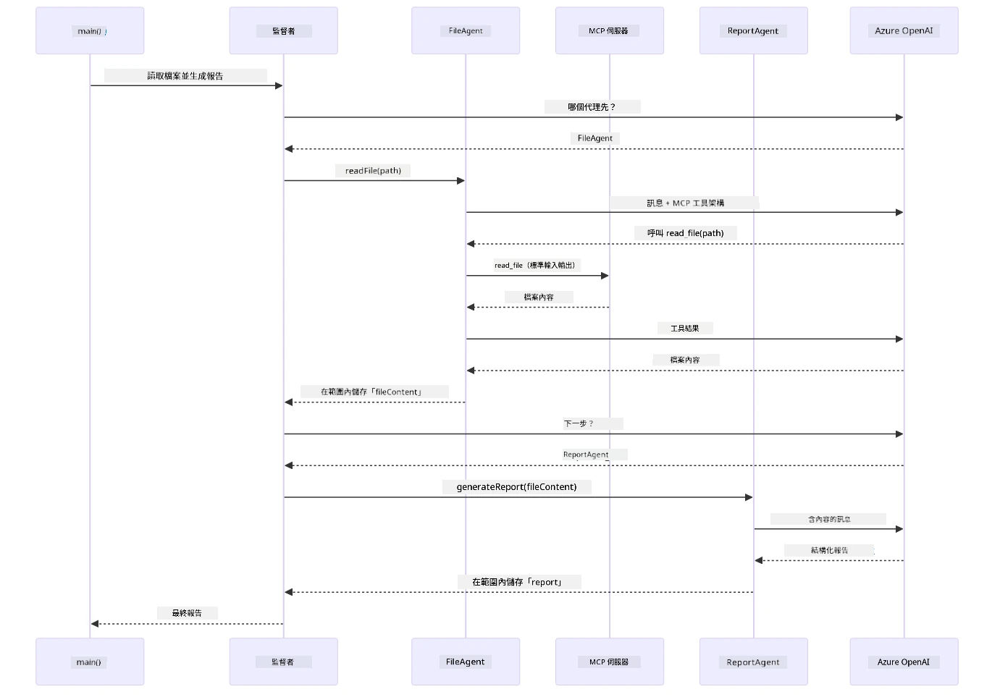

*監督者自主呼叫 FileAgent（透過 stdio 呼叫 MCP 伺服器讀檔），然後呼叫 ReportAgent 生成結構化報告——每個代理將輸出存入共用的 Agentic 範圍。*

每個代理將結果存入 **Agentic 範圍**（共用記憶體），允許後續代理取用先前結果。這演示了 MCP 工具如何無縫整合到 agentic 工作流程——監督者無需知道 *如何* 讀檔，只需知道 `FileAgent` 能做到。

#### 執行示範

啟動腳本會自動從根目錄 `.env` 載入環境變數：

**Bash:**
```bash
cd 05-mcp
chmod +x start-supervisor.sh
./start-supervisor.sh
```

**PowerShell:**
```powershell
cd 05-mcp
.\start-supervisor.ps1
```

**使用 VS Code：** 右鍵 `SupervisorAgentDemo.java` 選擇 **"Run Java"**（確保 `.env` 配置妥當）。

#### 監督代理如何運作

在建立代理前，你需要先將 MCP 傳輸連接到用戶端，並包裝成 `ToolProvider`。這樣 MCP 伺服器的工具才能提供給你的代理使用：

```java
// 從傳輸層建立一個 MCP 用戶端
McpClient mcpClient = new DefaultMcpClient.Builder()
        .transport(stdioTransport)
        .build();

// 將用戶端包裝成 ToolProvider — 這將 MCP 工具橋接到 LangChain4j
ToolProvider mcpToolProvider = McpToolProvider.builder()
        .mcpClients(List.of(mcpClient))
        .build();
```

現在你可以將 `mcpToolProvider` 注入任何需要 MCP 工具的代理：

```java
// 第一步：FileAgent 使用 MCP 工具讀取文件
FileAgent fileAgent = AgenticServices.agentBuilder(FileAgent.class)
        .chatModel(model)
        .toolProvider(mcpToolProvider)  // 擁有用於文件操作的 MCP 工具
        .build();

// 第二步：ReportAgent 生成結構化報告
ReportAgent reportAgent = AgenticServices.agentBuilder(ReportAgent.class)
        .chatModel(model)
        .build();

// 監督者協調文件到報告的工作流程
SupervisorAgent supervisor = AgenticServices.supervisorBuilder()
        .chatModel(model)
        .subAgents(fileAgent, reportAgent)
        .responseStrategy(SupervisorResponseStrategy.LAST)  // 返回最終報告
        .build();

// 監督者根據請求決定調用哪些代理
String response = supervisor.invoke("Read the file at /path/file.txt and generate a report");
```

#### FileAgent 如何在執行時發現 MCP 工具

你或許會問：**`FileAgent` 怎麼知道如何使用 npm 檔案系統工具？** 答案是它不知道——**LLM** 在執行時透過工具結構（schemas）自行找出方法。
`FileAgent` 介面只是**提示詞定義**。它並沒有對 `read_file`、`list_directory` 或任何其他 MCP 工具的硬性知識。整個過程如下：

1. **伺服器啟動：** `StdioMcpTransport` 啟動 `@modelcontextprotocol/server-filesystem` npm 套件作為子程序
2. **工具發現：** `McpClient` 發送 `tools/list` JSON-RPC 請求到伺服器，伺服器回應工具名稱、描述和參數結構（例如 `read_file` — *「讀取檔案的完整內容」* — `{ path: string }`）
3. **結構注入：** `McpToolProvider` 將這些發現的結構包裝並提供給 LangChain4j
4. **LLM 判斷：** 當呼叫 `FileAgent.readFile(path)` 時，LangChain4j 將系統訊息、使用者訊息以及**工具結構列表**傳送給 LLM。LLM 閱讀工具描述並生成工具調用（例如 `read_file(path="/some/file.txt")`）
5. **執行：** LangChain4j 攔截工具調用，通過 MCP 用戶端路由回 Node.js 子程序，取得結果並回傳給 LLM

這與上面所述的同一個[工具發現](../../../05-mcp)機制相同，但專門應用於代理流程。`@SystemMessage` 和 `@UserMessage` 標註引導 LLM 的行為，而注入的 `ToolProvider` 則提供**功能** — LLM 在執行時橋接兩者。

> **🤖 嘗試使用 [GitHub Copilot](https://github.com/features/copilot) 聊天功能：** 打開 [`FileAgent.java`](../../../05-mcp/src/main/java/com/example/langchain4j/mcp/agents/FileAgent.java) 並詢問：
> - 「這個代理怎麼知道要調用哪個 MCP 工具？」
> - 「如果我從代理建構器移除 ToolProvider，會發生什麼事？」
> - 「工具結構是怎麼傳遞給 LLM 的？」

#### 回應策略

當你配置 `SupervisorAgent` 時，需要指定子代理完成任務後，應如何形成最終對使用者的回答。下圖顯示了三種可用策略 — LAST 直接返回最後代理的輸出，SUMMARY 通過 LLM 綜合所有輸出生成總結，而 SCORED 則選擇對原始請求評分較高的輸出：

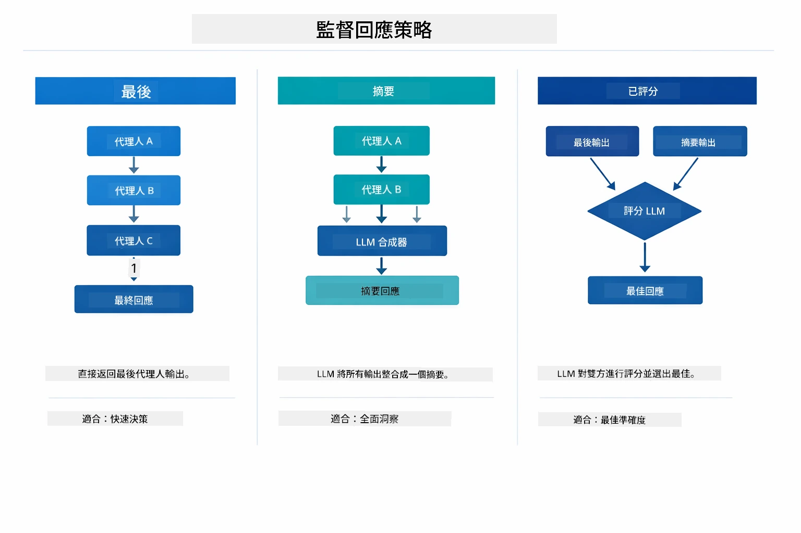

*監督者形成最終響應的三種策略 — 根據你想要最後代理輸出、綜合摘要，還是評分最高的選項來選擇。*

可用的策略有：

| 策略 | 描述 |
|----------|-------------|
| **LAST** | 監督者返回最後子代理或工具的輸出。當工作流中的最終代理明確設計來產生完整最終答案（例如研究流程中的「摘要代理」）時非常有用。 |
| **SUMMARY** | 監督者使用其內部語言模型（LLM）對整個互動和所有子代理輸出綜合總結，然後返回該摘要作為最終回答。這為使用者提供了清晰整合的答案。 |
| **SCORED** | 系統使用內部 LLM 分別對 LAST 輸出和 SUMMARY 進行評分，針對原始使用者請求，返回分數較高的輸出。 |

完整實現請參見 [SupervisorAgentDemo.java](../../../05-mcp/src/main/java/com/example/langchain4j/mcp/SupervisorAgentDemo.java)。

> **🤖 嘗試使用 [GitHub Copilot](https://github.com/features/copilot) 聊天功能：** 打開 [`SupervisorAgentDemo.java`](../../../05-mcp/src/main/java/com/example/langchain4j/mcp/SupervisorAgentDemo.java) 並詢問：
> - 「監督者如何決定要調用哪些代理？」
> - 「Supervisor 跟 Sequential 工作流模式有什麼差別？」
> - 「怎麼自訂 Supervisor 的規劃行為？」

#### 輸出說明

運行範例時，你會看到監督者如何協調多個代理的結構化流程。以下為各部分說明：

```
======================================================================
  FILE → REPORT WORKFLOW DEMO
======================================================================

This demo shows a clear 2-step workflow: read a file, then generate a report.
The Supervisor orchestrates the agents automatically based on the request.
```
  
**標題**介紹工作流概念：從讀檔到報告生成的專注管線。

```
--- WORKFLOW ---------------------------------------------------------
  ┌─────────────┐      ┌──────────────┐
  │  FileAgent  │ ───▶ │ ReportAgent  │
  │ (MCP tools) │      │  (pure LLM)  │
  └─────────────┘      └──────────────┘
   outputKey:           outputKey:
   'fileContent'        'report'

--- AVAILABLE AGENTS -------------------------------------------------
  [FILE]   FileAgent   - Reads files via MCP → stores in 'fileContent'
  [REPORT] ReportAgent - Generates structured report → stores in 'report'
```
  
**工作流程圖**展示代理間的數據流。每個代理有明確角色：  
- **FileAgent** 使用 MCP 工具讀取檔案，將原始內容存入 `fileContent`  
- **ReportAgent** 使用該內容並生成結構化報告存入 `report`

```
--- USER REQUEST -----------------------------------------------------
  "Read the file at .../file.txt and generate a report on its contents"
```
  
**使用者請求**展示任務。監督者解析後決定依序調用 FileAgent → ReportAgent。

```
--- SUPERVISOR ORCHESTRATION -----------------------------------------
  The Supervisor decides which agents to invoke and passes data between them...

  +-- STEP 1: Supervisor chose -> FileAgent (reading file via MCP)
  |
  |   Input: .../file.txt
  |
  |   Result: LangChain4j is an open-source, provider-agnostic Java framework for building LLM...
  +-- [OK] FileAgent (reading file via MCP) completed

  +-- STEP 2: Supervisor chose -> ReportAgent (generating structured report)
  |
  |   Input: LangChain4j is an open-source, provider-agnostic Java framew...
  |
  |   Result: Executive Summary...
  +-- [OK] ReportAgent (generating structured report) completed
```
  
**監督者編排執行流程**示範 2 步驟流程：  
1. **FileAgent** 通過 MCP 讀取檔案並保存內容  
2. **ReportAgent** 接收內容並產生結構化報告

監督者基於使用者請求作出**自主**決策。

```
--- FINAL RESPONSE ---------------------------------------------------
Executive Summary
...

Key Points
...

Recommendations
...

--- AGENTIC SCOPE (Data Flow) ----------------------------------------
  Each agent stores its output for downstream agents to consume:
  * fileContent: LangChain4j is an open-source, provider-agnostic Java framework...
  * report: Executive Summary...
```
  
#### Agentic 模塊功能說明

此範例展示了 agentic 模塊的多項進階功能，讓我們細看 Agentic 範圍和 Agent 監聽器。

**Agentic 範圍**顯示代理們利用 `@Agent(outputKey="...")` 儲存結果的共享記憶體。這允許：  
- 後續代理訪問前代理輸出  
- 監督者綜合最終回應  
- 你檢視各代理產出

下圖展示 Agentic 範圍在檔案至報告流程中如何作為共享記憶體運作 — FileAgent 將輸出寫入 `fileContent`，ReportAgent 讀取並寫入 `report`：

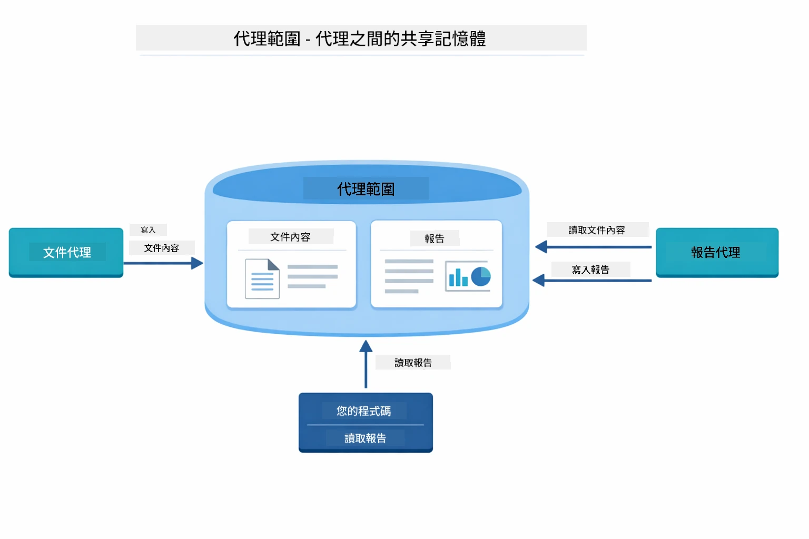

*Agentic 範圍作為共享記憶體 — FileAgent 寫入 `fileContent`，ReportAgent 讀取並寫入 `report`，你的程式碼讀取最終結果。*

```java
ResultWithAgenticScope<String> result = supervisor.invokeWithAgenticScope(request);
AgenticScope scope = result.agenticScope();
String fileContent = scope.readState("fileContent");  // 來自 FileAgent 的原始檔案數據
String report = scope.readState("report");            // 來自 ReportAgent 的結構化報告
```
  
**Agent 監聽器**讓你監控和除錯代理執行流程。範例中的逐步輸出來自掛載在每次代理調用的 AgentListener：  
- **beforeAgentInvocation** - 在監督者選擇代理時呼叫，可看見被選擇的代理及原因  
- **afterAgentInvocation** - 代理完成時呼叫，展示結果  
- **inheritedBySubagents** - 設為 true 時，監聽器監控整個代理層級內所有代理

以下圖展示完整代理監聽器生命週期，包括 `onError` 如何處理執行錯誤：

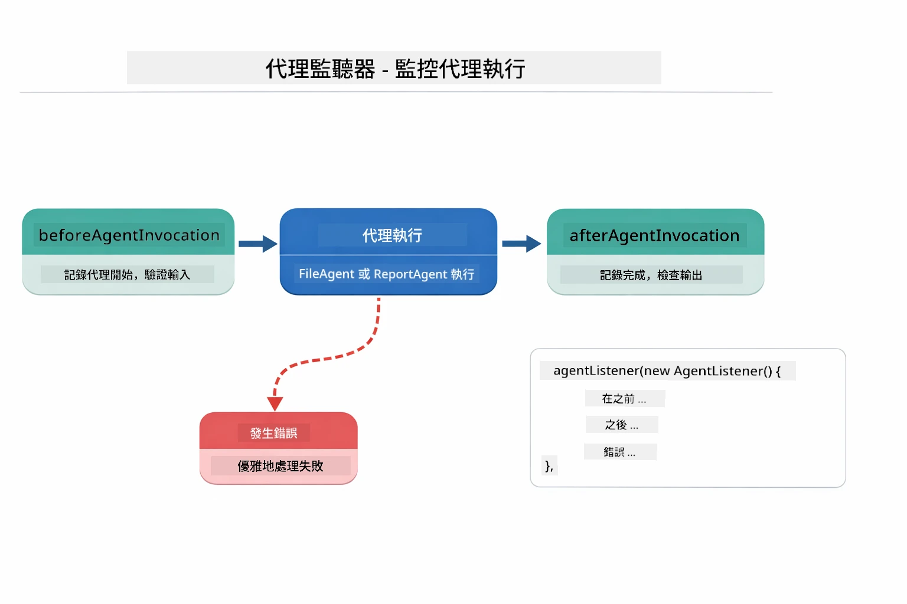

*代理監聽器掛載於執行生命週期 — 監控代理開始、完成或錯誤時間點。*

```java
AgentListener monitor = new AgentListener() {
    private int step = 0;
    
    @Override
    public void beforeAgentInvocation(AgentRequest request) {
        step++;
        System.out.println("  +-- STEP " + step + ": " + request.agentName());
    }
    
    @Override
    public void afterAgentInvocation(AgentResponse response) {
        System.out.println("  +-- [OK] " + response.agentName() + " completed");
    }
    
    @Override
    public boolean inheritedBySubagents() {
        return true; // 傳播到所有子代理
    }
};
```
  
除了 Supervisor 模式外，`langchain4j-agentic` 模塊提供數個強大工作流模式。下圖展示五種模式 — 從簡單線性管線到人機互動審核工作流：

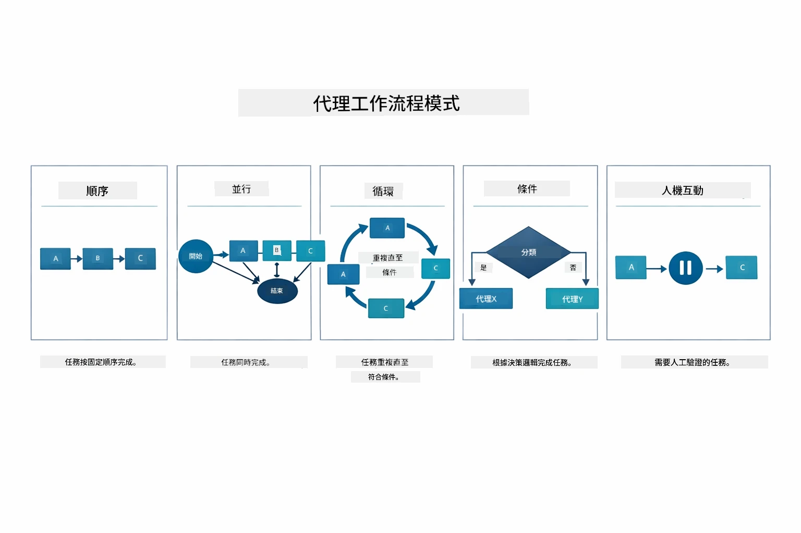

*管控代理的五種工作流模式 — 從簡單線性管線到人機互動審核工作流。*

| 模式 | 描述 | 適用案例 |
|---------|-------------|----------|
| **Sequential** | 按順序執行代理，輸出流向下一個 | 管線：研究 → 分析 → 報告 |
| **Parallel** | 同時執行多個代理 | 獨立任務：天氣 + 新聞 + 股票 |
| **Loop** | 迭代直到符合條件 | 品質評分：修正直到分數 ≥ 0.8 |
| **Conditional** | 根據條件路由 | 分類 → 指向專家代理 |
| **Human-in-the-Loop** | 增加人工檢核點 | 審核工作流、內容審查 |

## 重要概念

現在你已經體驗 MCP 和 agentic 模塊，讓我們總結何時使用各方案。

MCP 最大優勢在於不斷擴展的生態系統。下圖展示一個通用協議如何串連你的 AI 應用與各式 MCP 伺服器 — 從檔案系統與資料庫存取，到 GitHub、電子郵件、網頁爬取等多方服務：

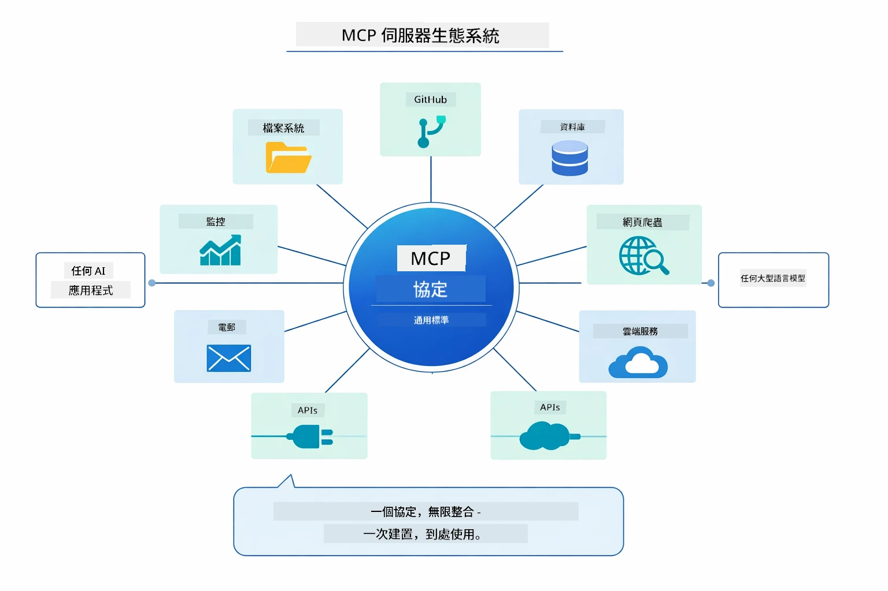

*MCP 創建通用協議生態系 — 任何 MCP 相容伺服器可搭配任何 MCP 相容用戶端，實現跨應用工具共享。*

**MCP** 適合想要使用既有工具生態、建立多應用共用的工具、與第三方服務整合標準協議，或能在不改程式碼下替換工具實作時使用。

**Agentic 模塊** 最適合需要使用 `@Agent` 標註的宣告式代理定義、需要工作流編排（順序、迴圈、並行）、偏好介面式代理設計多於命令式程式碼，或多代理共享輸出（透過 `outputKey`）的場景。

**監督代理模式** 在工作流事先無法預測、希望由 LLM 決定時發揮優勢；多專門代理需要動態編排、建置會話系統路由不同能力，或需要最靈活、適應性高代理行為時也非常合適。

以下比較圖幫助你選擇自訂 Module 04 的 `@Tool` 方法或本模塊 MCP 工具的取捨 — 自訂工具提供嚴密耦合與完整型別安全，適合應用邏輯；MCP 工具則是標準化且可重用整合：

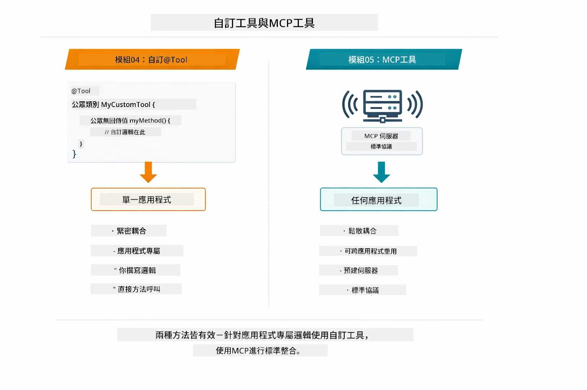

*何時使用自訂 @Tool 方法或 MCP 工具 — 自訂工具針對應用特定邏輯提供全型別安全；MCP 工具適合標準整合，跨應用通用。*

## 恭喜！

你已完成 LangChain4j 新手課程全部五個模塊！這是你完成的完整學習旅程 — 從基礎聊天到 MCP 推動的 agentic 系統：

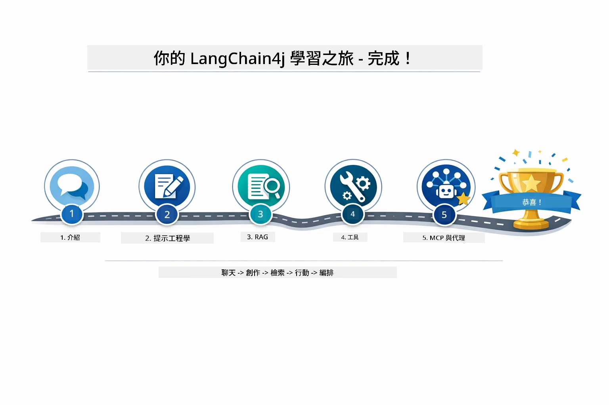

*你的學習之旅涵蓋五個模塊 — 從基礎聊天到 MCP 推動的 agentic 系統。*

你已完成 LangChain4j 新手課程。你學會了：

- 如何建立具備記憶功能的會話式 AI（模塊 01）  
- 不同任務的提示詞工程模式（模塊 02）  
- 以 RAG 將回應基於你的文件（模塊 03）  
- 以自訂工具建立基本 AI 代理（助理）（模塊 04）  
- 使用 LangChain4j MCP 和 Agentic 模塊整合標準化工具（模塊 05）

### 下一步？

完成模塊後，可以參考 [Testing Guide](../docs/TESTING.md)，了解 LangChain4j 的測試概念實作。

**官方資源：**  
- [LangChain4j 文件](https://docs.langchain4j.dev/) — 全面指南與 API 參考  
- [LangChain4j GitHub](https://github.com/langchain4j/langchain4j) — 原始碼與範例  
- [LangChain4j 教學](https://docs.langchain4j.dev/tutorials/) — 各種用例的分步教學  

感謝你完成本課程！

---

**導航：** [← 上一章：Module 04 - Tools](../04-tools/README.md) | [回主頁](../README.md)

---

<!-- CO-OP TRANSLATOR DISCLAIMER START -->
**免責聲明**：  
本文件乃使用 AI 翻譯服務 [Co-op Translator](https://github.com/Azure/co-op-translator) 進行翻譯。雖然我們力求準確，但請注意，自動翻譯可能包含錯誤或不準確之處。原始文件的原文版本應被視為權威來源。對於重要資訊，建議採用專業人工翻譯。本公司對因使用本翻譯而產生的任何誤解或誤譯概不負責。
<!-- CO-OP TRANSLATOR DISCLAIMER END -->