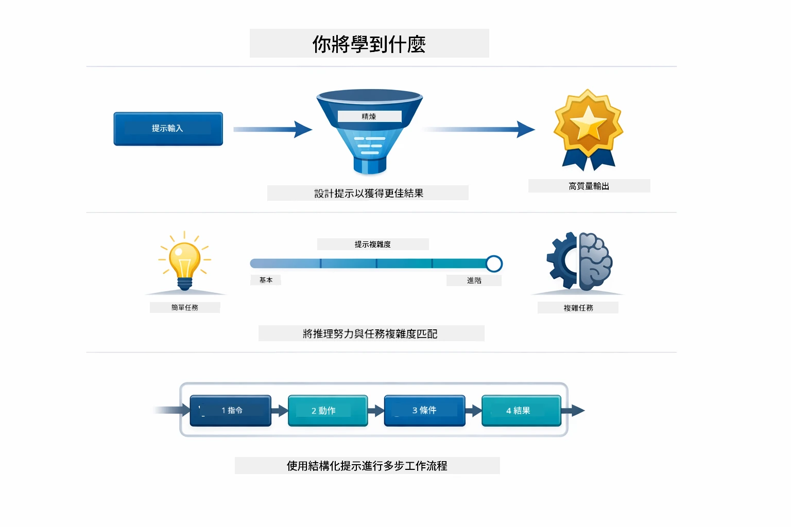
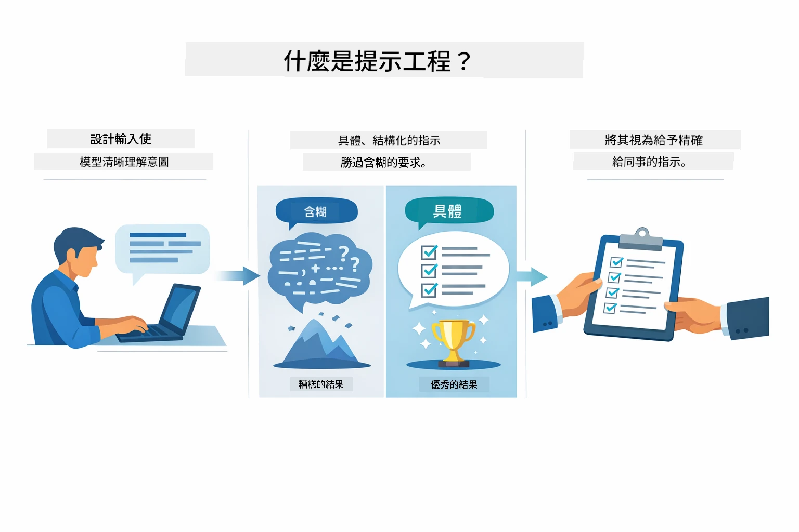
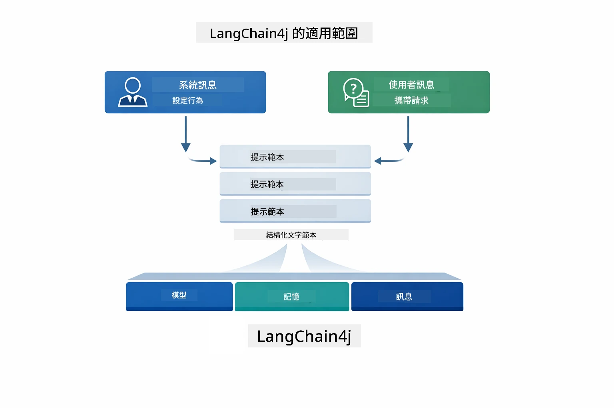
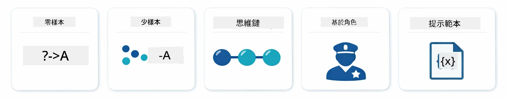
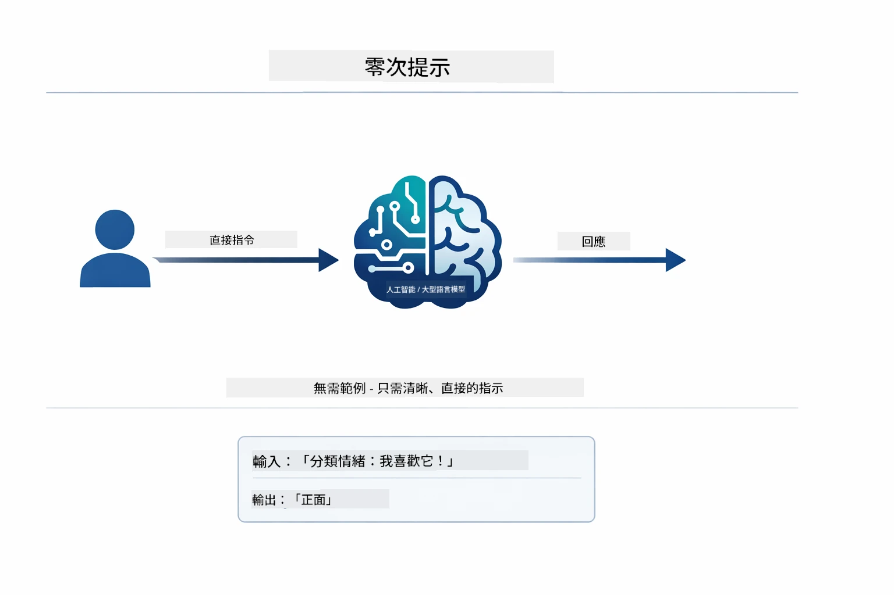
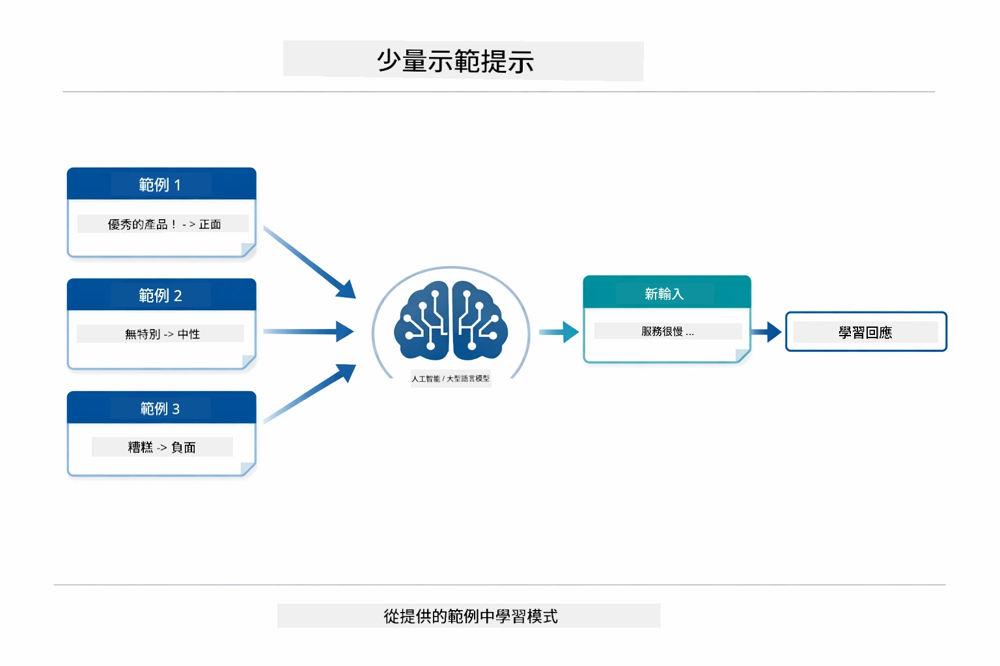
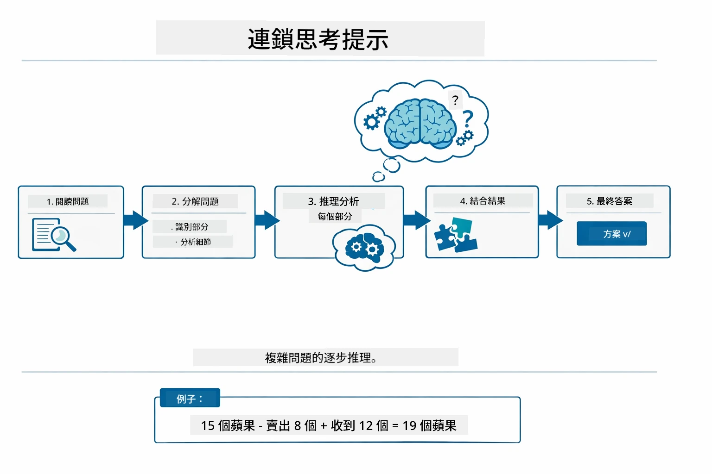
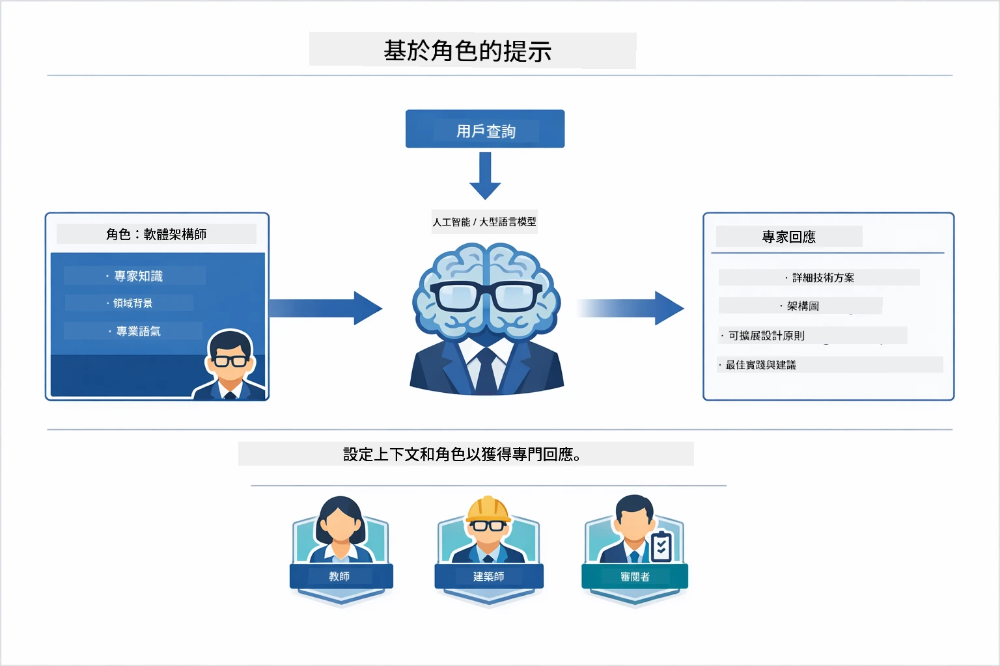
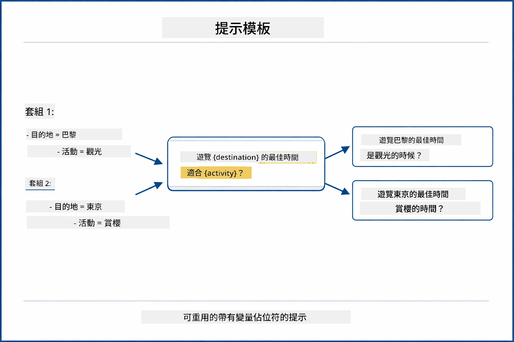
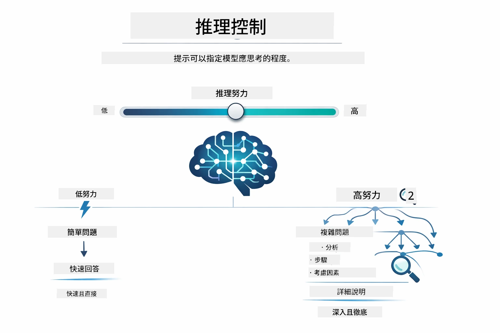

# Module 02: 使用 GPT-5.2 的提示工程學

## 目錄

- [你將學到什麼](../../../02-prompt-engineering)
- [先決條件](../../../02-prompt-engineering)
- [理解提示工程學](../../../02-prompt-engineering)
- [提示工程學基礎](../../../02-prompt-engineering)
  - [零樣本提示](../../../02-prompt-engineering)
  - [少樣本提示](../../../02-prompt-engineering)
  - [思維鏈](../../../02-prompt-engineering)
  - [角色基礎提示](../../../02-prompt-engineering)
  - [提示範本](../../../02-prompt-engineering)
- [進階模式](../../../02-prompt-engineering)
- [使用現有 Azure 資源](../../../02-prompt-engineering)
- [應用截圖](../../../02-prompt-engineering)
- [探索模式](../../../02-prompt-engineering)
  - [低意願 vs 高意願](../../../02-prompt-engineering)
  - [任務執行（工具前言）](../../../02-prompt-engineering)
  - [自我反思代碼](../../../02-prompt-engineering)
  - [結構化分析](../../../02-prompt-engineering)
  - [多輪對話](../../../02-prompt-engineering)
  - [逐步推理](../../../02-prompt-engineering)
  - [受限輸出](../../../02-prompt-engineering)
- [你真正學到的是什麼](../../../02-prompt-engineering)
- [下一步](../../../02-prompt-engineering)

## 你將學到什麼



在上一個模組中，你已經了解記憶如何支持會話式 AI，並使用 GitHub Models 進行基本互動。現在我們聚焦於你如何提問——也就是提示本身——使用 Azure OpenAI 的 GPT-5.2。你如何結構化提示會極大影響你得到的回答質量。我們先回顧基本的提示技巧，然後進入八種利用 GPT-5.2 完整能力的進階模式。

我們選用 GPT-5.2，是因為它引入了推理控制——你可以告訴模型在回答前要思考多少。這讓不同的提示策略更加明顯，幫助你了解何時使用各種方法。我們還能從 Azure 對 GPT-5.2 較寬鬆的速率限制中受益，相較於 GitHub Models。

## 先決條件

- 完成 Module 01（已部署 Azure OpenAI 資源）
- 根目錄含 `.env` 檔案，內含 Azure 認證（由 Module 01 用 `azd up` 建立）

> **注意:** 如尚未完成 Module 01，請先依該模組部署指示操作。

## 理解提示工程學



提示工程學是設計輸入文字，使你能持續獲得所需結果的技術。不僅僅是提問，而是結構化請求，令模型精準理解你想要什麼，以及如何給出回覆。

想像你是給同事下指令。「修正該錯誤」過於模糊；「在 UserService.java 第 45 行加上 null 檢查，修正 null pointer 異常」則具體。語言模型也是如此——具體性與結構化很重要。



LangChain4j 提供了基礎設施——模型連接、記憶和訊息類型，而提示模式則是你透過這些基礎設施發送的精心構造文本。關鍵元件是 `SystemMessage`（設定 AI 行為與角色）和 `UserMessage`（承載你的實際請求）。

## 提示工程學基礎



在深入本模組的進階模式前，我們先回顧五種基礎提示技巧。這些是每個提示工程師都應該知道的建構基石。如果你已經完成[快速開始模組](../00-quick-start/README.md#2-prompt-patterns)，你會見過這些技巧的實際應用——以下是它們的概念框架。

### 零樣本提示

最簡單的方式：直接給模型指令，無需示例。模型完全依靠訓練來理解並執行任務。適用於行為明確的直接請求。



*無示例的直接指令，模型僅憑指令推斷任務*

```java
String prompt = "Classify this sentiment: 'I absolutely loved the movie!'";
String response = model.chat(prompt);
// 回應︰「正面」
```

**適用時機:** 簡單分類、直接提問、翻譯，或任務模型可無需額外指導完成。

### 少樣本提示

提供示例示範你希望模型遵循的模式。模型學習示例的輸入輸出格式，並將其應用於新輸入，大幅提升格式與行為一致性。



*從示例學習，模型識別模式並應用於新輸入*

```java
String prompt = """
    Classify the sentiment as positive, negative, or neutral.
    
    Examples:
    Text: "This product exceeded my expectations!" → Positive
    Text: "It's okay, nothing special." → Neutral
    Text: "Waste of money, very disappointed." → Negative
    
    Now classify this:
    Text: "Best purchase I've made all year!"
    """;
String response = model.chat(prompt);
```

**適用時機:** 自定義分類、一致格式、特定領域任務，或零樣本結果不穩時。

### 思維鏈

要求模型逐步展示推理過程。模型不直接跳到答案，而是分解問題，逐步清楚推理，有助數學、邏輯和多步推理題的準確度。



*逐步推理，把複雜問題拆成明確邏輯步驟*

```java
String prompt = """
    Problem: A store has 15 apples. They sell 8 apples and then 
    receive a shipment of 12 more apples. How many apples do they have now?
    
    Let's solve this step-by-step:
    """;
String response = model.chat(prompt);
// 模型顯示：15 - 8 = 7，然後 7 + 12 = 19 個蘋果
```

**適用時機:** 數學問題、邏輯謎題、調試，或任何展示推理過程能提升準確度與信賴的任務。

### 角色基礎提示

在提問前設置 AI 的角色或身份。這提供上下文，影響回答的語氣、深度和重點。比如「軟體架構師」與「初級開發者」或「安全稽核員」給出的建議不同。



*設置上下文和角色，同一問題依照角色獲得不同回答*

```java
String prompt = """
    You are an experienced software architect reviewing code.
    Provide a brief code review for this function:
    
    def calculate_total(items):
        total = 0
        for item in items:
            total = total + item['price']
        return total
    """;
String response = model.chat(prompt);
```

**適用時機:** 代碼審查、教學、特定領域分析，或需要依專業層級或視角定制回答時。

### 提示範本

創建可重用的提示，內含變量佔位符。無需每次寫新提示，只要定義一次範本並填入不同數值。LangChain4j 的 `PromptTemplate` 類使用 `{{variable}}` 語法輕鬆實現。



*可重用的提示模板，含變量佔位符，一個範本多種用途*

```java
PromptTemplate template = PromptTemplate.from(
    "What's the best time to visit {{destination}} for {{activity}}?"
);

Prompt prompt = template.apply(Map.of(
    "destination", "Paris",
    "activity", "sightseeing"
));

String response = model.chat(prompt.text());
```

**適用時機:** 重複查詢不同輸入、批次處理，構建可重用 AI 工作流程，或任何提示結構相同、資料變更的場景。

---

這五個基礎技巧提供大多數提示任務的堅實工具組。本模組接下來將建立在它們上，介紹八種利用 GPT-5.2 推理控制、自我評估與結構化輸出能力的**進階模式**。

## 進階模式

在掌握基礎後，我們進入本模組獨特的八種進階模式。不是所有問題都需同一策略。有些問題需快速回答，有些需深入思考。有些需顯示推理過程，有些直接要結果。以下每種模式針對不同場景優化，GPT-5.2 的推理控制讓區別更明顯。


*八種提示工程模式及其使用情境概覽*



*GPT-5.2 推理控制允許你指定模型思考多少——從快速直接回答到深入探索*


*低意願（快速直接） vs 高意願（周延探索）推理方法*

**低意願（快速聚焦）** – 適用於想要快速、直接答案的簡單問題。模型進行最少推理 —— 最多兩步。用於計算、查詢或簡單問題。

```java
String prompt = """
    <reasoning_effort>low</reasoning_effort>
    <instruction>maximum 2 reasoning steps</instruction>
    
    What is 15% of 200?
    """;

String response = chatModel.chat(prompt);
```

> 💡 **用 GitHub Copilot 探索:** 開啟 [`Gpt5PromptService.java`](../../../02-prompt-engineering/src/main/java/com/example/langchain4j/prompts/service/Gpt5PromptService.java) 並提問：
> - 「低意願和高意願提示模式有什麼差異？」
> - 「提示中的 XML 標籤如何幫助結構化 AI 回答？」
> - 「何時應用自我反思模式，何時用直接指令？」

**高意願（深入完整）** – 用於複雜問題，需全面分析。模型深入探索並展示詳盡推理。用於系統設計、架構決策或複雜研究。

```java
String prompt = """
    <reasoning_effort>high</reasoning_effort>
    <instruction>explore thoroughly, show detailed reasoning</instruction>
    
    Design a caching strategy for a high-traffic REST API.
    """;

String response = chatModel.chat(prompt);
```

**任務執行（逐步進展）** – 用於多步驟工作流程。模型提供事先計畫，工作過程中逐步說明，最後給出摘要。用於遷移、實作或任何多步流程。

```java
String prompt = """
    <task>Create a REST endpoint for user registration</task>
    <preamble>Provide an upfront plan</preamble>
    <narration>Narrate each step as you work</narration>
    <summary>Summarize what was accomplished</summary>
    """;

String response = chatModel.chat(prompt);
```

思維鏈提示明確要求模型展示推理過程，提升複雜任務準確度。逐步拆解幫助人類和 AI 理解邏輯。

> **🤖 用 [GitHub Copilot](https://github.com/features/copilot) Chat 試試:** 問這種模式：
> - 「如何調整任務執行模式應對長時間運行的操作？」
> - 「生產環境中結構化工具前言的最佳實踐是什麼？」
> - 「如何在 UI 中捕捉並顯示中間進度更新？」


*計畫 → 執行 → 總結的多步任務工作流程*

**自我反思代碼** – 用於生成生產等級程式碼。模型產生程式碼，根據品質標準檢查並逐步優化。適用於新功能或服務開發。

```java
String prompt = """
    <task>Create an email validation service</task>
    <quality_criteria>
    - Correct logic and error handling
    - Best practices (clean code, proper naming)
    - Performance optimization
    - Security considerations
    </quality_criteria>
    <instruction>Generate code, evaluate against criteria, improve iteratively</instruction>
    """;

String response = chatModel.chat(prompt);
```


*迭代改進循環——產生、評估、發現問題、改進、重複*

**結構化分析** – 用於一致性評估。模型使用固定框架審查程式碼（正確性、實踐、效能、安全）。適合代碼審查或品質評估。

```java
String prompt = """
    <code>
    public List getUsers() {
        return database.query("SELECT * FROM users");
    }
    </code>
    
    <framework>
    Evaluate using these categories:
    1. Correctness - Logic and functionality
    2. Best Practices - Code quality
    3. Performance - Efficiency concerns
    4. Security - Vulnerabilities
    </framework>
    """;

String response = chatModel.chat(prompt);
```

> **🤖 用 [GitHub Copilot](https://github.com/features/copilot) Chat 試試:** 詢問結構化分析：
> - 「如何為不同類型的代碼審查自訂分析框架？」
> - 「以程式化方式解析與利用結構化輸出最佳做法？」
> - 「如何確保不同審查環節保持嚴重程度一致？」


*四類別框架，配合嚴重程度的一致代碼審查*

**多輪對話** – 適用於需上下文的對話。模型記憶先前訊息並基於它們發展，適合互動輔助或複雜問答。

```java
ChatMemory memory = MessageWindowChatMemory.withMaxMessages(10);

memory.add(UserMessage.from("What is Spring Boot?"));
AiMessage aiMessage1 = chatModel.chat(memory.messages()).aiMessage();
memory.add(aiMessage1);

memory.add(UserMessage.from("Show me an example"));
AiMessage aiMessage2 = chatModel.chat(memory.messages()).aiMessage();
memory.add(aiMessage2);
```


*多輪對話中，上下文如何累積直到達到 Token 限制*

**逐步推理** – 用於需邏輯清晰展現的問題。模型清楚展示每步推理。用於數學題、邏輯謎題，或需理解推理過程時。

```java
String prompt = """
    <instruction>Show your reasoning step-by-step</instruction>
    
    If a train travels 120 km in 2 hours, then stops for 30 minutes,
    then travels another 90 km in 1.5 hours, what is the average speed
    for the entire journey including the stop?
    """;

String response = chatModel.chat(prompt);
```


*將問題拆解為明確邏輯步驟*

**受限輸出** – 用於需要特定格式規範的回答。模型嚴格遵守格式及長度規則。適用於摘要或需精確輸出結構時。

```java
String prompt = """
    <constraints>
    - Exactly 100 words
    - Bullet point format
    - Technical terms only
    </constraints>
    
    Summarize the key concepts of machine learning.
    """;

String response = chatModel.chat(prompt);
```


*強制特定格式、長度和結構要求*

## 使用現有 Azure 資源

**確認部署：**

確保根目錄有含 Azure 認證的 `.env` 檔案（在 Module 01 部署時建立）：
```bash
cat ../.env  # 應該顯示 AZURE_OPENAI_ENDPOINT、API_KEY、DEPLOYMENT
```

**啟動應用程式：**

> **注意:** 若你已在 Module 01 用 `./start-all.sh` 啟動所有應用，本模組已在 8083 埠運行，可跳過以下啟動指令，直接瀏覽 http://localhost:8083。

**方案一：使用 Spring Boot Dashboard（推薦 VS Code 用戶）**

開發容器已安裝 Spring Boot Dashboard 擴充，提供可視化介面管理所有 Spring Boot 應用。它位於 VS Code 左側活動欄（尋找 Spring Boot 圖示）。
從 Spring Boot 儀表板，您可以：
- 查看工作區中所有可用的 Spring Boot 應用程式
- 一鍵啟動/停止應用程式
- 實時查看應用程式日誌
- 監控應用程式狀態

只需點擊「prompt-engineering」旁邊的播放按鈕以啟動此模組，或一次啟動所有模組。


**方案 2：使用 shell 腳本**

啟動所有網頁應用程式（模組 01-04）：

**Bash:**
```bash
cd ..  # 從根目錄
./start-all.sh
```

**PowerShell:**
```powershell
cd ..  # 從根目錄
.\start-all.ps1
```

或只啟動此模組：

**Bash:**
```bash
cd 02-prompt-engineering
./start.sh
```

**PowerShell:**
```powershell
cd 02-prompt-engineering
.\start.ps1
```

這兩個腳本會自動從根目錄的 `.env` 檔案載入環境變數，且如果 JAR 檔不存在，會進行建置。

> **注意：** 如果您希望在啟動前手動建置所有模組：
>
> **Bash:**
> ```bash
> cd ..  # Go to root directory
> mvn clean package -DskipTests
> ```
>
> **PowerShell:**
> ```powershell
> cd ..  # Go to root directory
> mvn clean package -DskipTests
> ```

在瀏覽器中打開 http://localhost:8083 。

**停止：**

**Bash:**
```bash
./stop.sh  # 嗰個模組先
# 或者
cd .. && ./stop-all.sh  # 全部模組
```

**PowerShell:**
```powershell
.\stop.ps1  # 僅此模組
# 或者
cd ..; .\stop-all.ps1  # 所有模組
```

## 應用程式截圖


*主儀表板顯示所有 8 種 prompt 工程範式及其特徵和使用案例*

## 探索範式

網頁介面讓您試驗不同的提示策略。每個範式解決不同問題 — 試試看，找到每種方法的最佳時機。

### 低 vs 高 熱切度

用低熱切度問一個簡單問題，例如「200 的 15% 是多少？」您會立即得到直接答案。現在用高熱切度問複雜問題，例如「設計一個高流量 API 的緩存策略」。您會看到模型放慢腳步並提供詳細推理。相同模型、相同問題結構 — 但提示告訴它要花多少心思。


*快速計算，極少推理*


*完整的緩存策略（2.8MB）*

### 任務執行（工具前置詞）

多步驟流程受益於事先規劃和過程旁白。模型會概述將做什麼，敘述每步驟，然後總結結果。


*逐步旁白創建 REST 端點（3.9MB）*

### 自我反思代碼

試試「建立一個電子郵件驗證服務」。模型不只是生成代碼就停，還會根據品質標準評估，找出弱點並改進。您會看到它不斷迭代，直到代碼達到生產標準。


*完整的電子郵件驗證服務（5.2MB）*

### 結構化分析

程式碼審查需要一致的評估架構。模型用固定類別（正確性、實務、效能、安全性）搭配嚴重程度來分析代碼。


*基於架構的程式碼審查*

### 多輪對話

問「什麼是 Spring Boot？」然後緊接著問「給我一個範例」。模型記得您第一個問題，會給出專門的 Spring Boot 範例。若無記憶，第二個問題會太模糊。


*跨問題保持上下文*

### 分步推理

選一個數學問題，分別用分步推理和低熱切度試試看。低熱切度直接給答案 — 快速但不透明。分步推理則展示每次計算和決策過程。


*帶有明確步驟的數學問題*

### 限制輸出

需要特定格式或字數時，這個範式嚴格執行規範。試著產生一個正好 100 字的摘要，並使用項目符號格式。


*有格式控制的機器學習摘要*

## 您真正學到的是

**推理努力改變一切**

GPT-5.2 讓您能透過提示控制計算努力程度。低努力意味著快速回應和極少探索；高努力代表模型花時間深入思考。您學到如何根據任務複雜度調節努力 — 不要浪費時間在簡單問題，但複雜決策也不該倉促。

**結構引導行為**

注意提示中的 XML 標籤？它們非裝飾品。模型更可靠地遵循結構化指令勝過自由文本。當您需要多步流程或複雜邏輯，結構有助模型判斷當下狀態與下一步。


*結構良好提示的組成，具有清晰分段與 XML 風格組織*

**透過自我評估提升品質**

自我反思範式透過明確品質標準運作。不是盼望模型「做對」，而是明確告訴它「對」意味著什麼：正確邏輯、錯誤處理、效能、安全性。模型可以自評輸出並優化。讓代碼生成從抽獎變成流程。

**上下文是有限的**

多輪對話透過每次請求包含訊息歷史達成。但有上限 — 每個模型有最大 token 數。對話越多，需策略保持相關上下文而不觸頂。本模組示範記憶如何運作；之後您將學習何時摘要、何時忘記、何時檢索。

## 下一步

**下一模組：** [03-rag - RAG (擷取增強生成)](../03-rag/README.md)

---

**導覽：** [← 上一節：模組 01 - 介紹](../01-introduction/README.md) | [返回主頁](../README.md) | [下一節：模組 03 - RAG →](../03-rag/README.md)

---

<!-- CO-OP TRANSLATOR DISCLAIMER START -->
**免責聲明**：  
本文件係使用 AI 翻譯服務 [Co-op Translator](https://github.com/Azure/co-op-translator) 翻譯。雖然我們致力於確保準確性，但請注意，自動翻譯可能包含錯誤或不準確之處。原始文件以其本語言版本為最具權威性之資料來源。對於重要資訊，建議採用專業人工翻譯。本公司不對因使用本翻譯所引起之任何誤解或誤譯負責。
<!-- CO-OP TRANSLATOR DISCLAIMER END -->