# Module 03: RAG（檢索增強生成）

## 目錄

- [影片導讀](../../../03-rag)
- [你將學到的內容](../../../03-rag)
- [先決條件](../../../03-rag)
- [理解 RAG](../../../03-rag)
  - [本教程使用哪種 RAG 方法？](../../../03-rag)
- [運作原理](../../../03-rag)
  - [文件處理](../../../03-rag)
  - [建立嵌入](../../../03-rag)
  - [語義搜尋](../../../03-rag)
  - [答案生成](../../../03-rag)
- [運行應用程式](../../../03-rag)
- [使用應用程式](../../../03-rag)
  - [上傳文件](../../../03-rag)
  - [提問](../../../03-rag)
  - [檢查來源參考](../../../03-rag)
  - [實驗問題](../../../03-rag)
- [關鍵概念](../../../03-rag)
  - [分塊策略](../../../03-rag)
  - [相似度分數](../../../03-rag)
  - [記憶體儲存](../../../03-rag)
  - [上下文視窗管理](../../../03-rag)
- [何時 RAG 很重要](../../../03-rag)
- [下一步](../../../03-rag)

## 影片導讀

觀看這場直播說明如何開始使用本模組：

<a href="https://www.youtube.com/watch?v=_olq75ZH_eY"></a>

## 你將學到的內容

在前面的模組中，你學會了如何與 AI 對話及有效組織提示詞，但有個根本限制：語言模型僅知道訓練期間學到的知識。它無法回答關於你的公司政策、專案文件或任何未被訓練過的資訊。

RAG（檢索增強生成）解決了這個問題。與其嘗試教模型你的資料（既昂貴又不實際），你給它能力去搜尋你的文件。當有人提問時，系統找出相關資訊並納入提示中。模型再根據檢索到的上下文作答。

你可以把 RAG 想像成給模型一個參考圖書館。當你提問時，系統：

1. **使用者查詢** – 你提出問題
2. **嵌入** – 將你的問題轉成向量
3. **向量搜尋** – 找出相似文件塊
4. **上下文組合** – 將相關塊加入提示
5. **回應** – LLM 根據上下文產生答案

這讓模型的回應有根據你的實際資料，而非僅依賴訓練知識或自己杜撰答案。

## 先決條件

- 完成 [Module 00 - Quick Start](../00-quick-start/README.md)（後續本模組參考的 Easy RAG 範例）
- 完成 [Module 01 - Introduction](../01-introduction/README.md)（部署 Azure OpenAI 資源，包括 `text-embedding-3-small` 嵌入模型）
- 專案根目錄有 `.env` 檔案並含 Azure 憑證（由 Module 01 的 `azd up` 指令建立）

> **注意：** 若尚未完成 Module 01，請先依那邊的部署說明進行。`azd up` 指令會部署本模組使用的 GPT 聊天模型與嵌入模型。

## 理解 RAG

下圖展示核心概念：不僅依賴模型訓練資料，RAG 是先給模型一個你的文件參考庫，讓它在每次生成答案前先查閱。

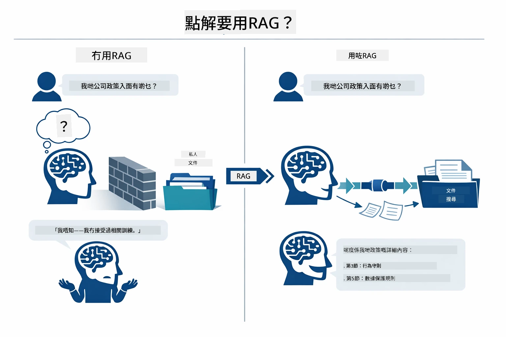

*此圖示出標準 LLM（僅根據訓練資料猜測）與 RAG 增強 LLM（先查閱你的文件）的差異。*

以下展示整個流程如何串接：使用者的問題經過四個階段 —— 嵌入、向量搜尋、上下文組合、答案生成 —— 每個階段都建立在前一個基礎上：


*此圖展示完整 RAG 流程 — 使用者查詢依序通過嵌入、向量搜尋、上下文組合與答案生成階段。*

接下來模組將詳細說明每個階段，並附上可執行與修改的程式碼。

### 本教程使用哪種 RAG 方法？

LangChain4j 提供三種實作 RAG 的方式，各有不同抽象層次。下圖比較這三者：

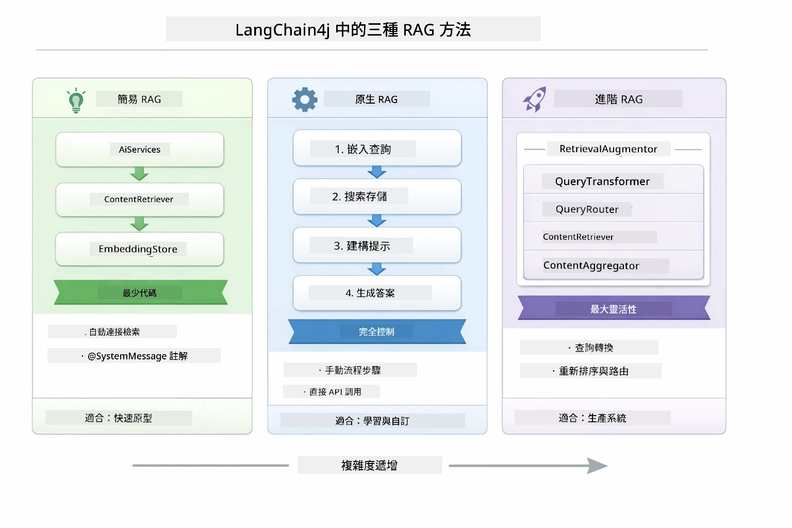

*此圖比較 LangChain4j 的 Easy、Native、Advanced 三種 RAG 方法，說明其主要組件與使用時機。*

| 方法 | 功能描述 | 取捨 |
|---|---|---|
| **Easy RAG** | 透過 `AiServices` 和 `ContentRetriever` 自動連接所有流程。你只需註解接口、掛載檢索器，LangChain4j 幕後處理嵌入、搜尋及提示組裝。 | 程式碼最少，但看不到每步驟細節。 |
| **Native RAG** | 你明確呼叫嵌入模型、搜尋資料庫、建立提示並生成答案 —— 每一步都清楚呈現。 | 程式碼較多，但每階段均可見且可修改。 |
| **Advanced RAG** | 利用 `RetrievalAugmentor` 框架，擁有可插拔查詢轉換器、路由器、重排器與內容注入器，適合生產級流程。 | 靈活性最高，但也複雜度最高。 |

**本教程採用 Native 方法。** RAG 流程中每一步 —— 問題嵌入、向量庫搜尋、上下文組合、答案生成 —— 均在 [`RagService.java`](../../../03-rag/src/main/java/com/example/langchain4j/rag/service/RagService.java) 明確寫出。這是刻意設計：作為學習資源，讓你看到並理解每個階段比單純縮短程式碼重要。一旦熟悉流程再考慮用 Easy RAG 快速原型或 Advanced RAG 建立生產系統。

> **💡 已看過 Easy RAG 範例？** [Quick Start 模組](../00-quick-start/README.md) 有 Document Q&A 範例 ([`SimpleReaderDemo.java`](../../../00-quick-start/src/main/java/com/example/langchain4j/quickstart/SimpleReaderDemo.java)) 使用 Easy RAG —— LangChain4j 幕後自動處理嵌入、搜尋和提示組裝。本模組進一步拆解流程，讓你看見並控制每階段。

下圖展示 Quick Start 範例中 Easy RAG 流程。請注意 `AiServices` 與 `EmbeddingStoreContentRetriever` 隱藏了整個複雜度 —— 你只需載入文件、掛載檢索器，便可得到答案。本模組的 Native 方法則拆解這些幕後步驟：

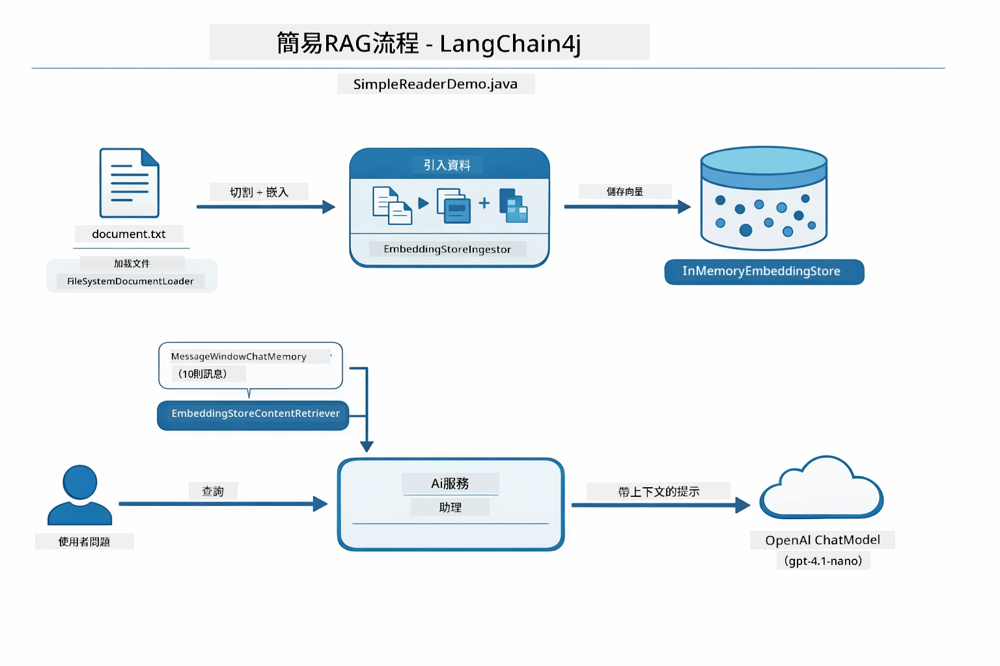

*此圖展示 `SimpleReaderDemo.java` 的 Easy RAG 流程。和本模組使用的 Native 方法對比：Easy RAG 把嵌入、檢索、提示組裝隱藏在 `AiServices` 與 `ContentRetriever` 之後 — 你載入文件、掛載檢索器後直接取得答案；Native 則拆解流程，讓你自己呼叫每一步（嵌入、檢索、組合上下文、生成），提供完整可見性及控制權。*

## 運作原理

本模組的 RAG 流程分成四個階段，每次使用者提問時依序執行。首先，將上傳的文件**解析並切分**成便於處理的小塊。接著將這些小塊轉成**向量嵌入**並儲存，方便數學比較。當查詢來臨時，系統執行**語義搜尋**找出最相關的小塊，最後將它們作為上下文傳入 LLM，進行**答案生成**。以下章節搭配實際程式碼與圖解介紹各階段。先看第一步。

### 文件處理

[DocumentService.java](../../../03-rag/src/main/java/com/example/langchain4j/rag/service/DocumentService.java)

當你上傳文件，系統將其解析（PDF 或純文字格式），附加檔案名稱等元資料，然後切成小塊 — 即適合模型上下文視窗的小段。這些小塊會有些重疊，避免邊界處遺失重要上下文。

```java
// 解析上載的檔案並將其包裝在 LangChain4j 文件中
Document document = Document.from(content, metadata);

// 分割成300標記的區塊，重疊30標記
DocumentSplitter splitter = DocumentSplitters
    .recursive(300, 30);

List<TextSegment> segments = splitter.split(document);
```

下圖視覺化說明此過程。可見每個分塊與相鄰分塊間共享部分標記符 —— 30 標記的重疊確保不遺漏重要上下文：

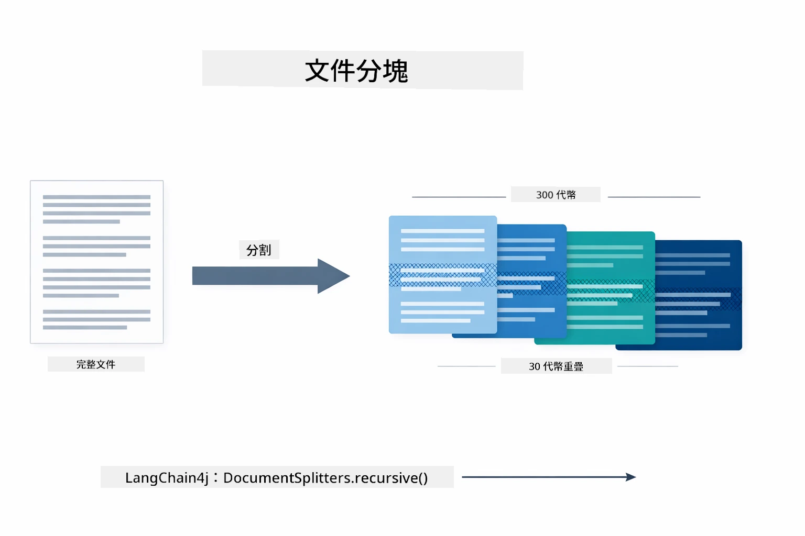

*此圖展示文件被切成 300 標記大小、30 標記重疊的小塊，保留分塊邊界的上下文。*

> **🤖 用 [GitHub Copilot](https://github.com/features/copilot) 聊天試試看：** 開啟 [`DocumentService.java`](../../../03-rag/src/main/java/com/example/langchain4j/rag/service/DocumentService.java) 並問：
> - 「LangChain4j 如何將文件切成小塊，為何重疊很重要？」
> - 「不同文件類型的最佳分塊大小是多少，為什麼？」
> - 「如何處理多語言或帶特殊格式的文件？」

### 建立嵌入

[LangChainRagConfig.java](../../../03-rag/src/main/java/com/example/langchain4j/rag/config/LangChainRagConfig.java)

每個分塊會被轉成稱為嵌入的數值表示 —— 本質上是意義到數字的轉換器。嵌入模型不同於聊天模型，它不「智能」，無法執行指令、推理或回答問題。但它能把文字映射到數學空間，使相近意義的詞彙相近 —— 例如「car」接近「automobile」；「refund policy」接近「return my money」。你可把聊天模型想像成可以對話的人，嵌入模型則是一個超優秀的資料編目系統。

下圖呈現這概念 —— 文字進去，數值向量出來，相似意義彼此靠近：

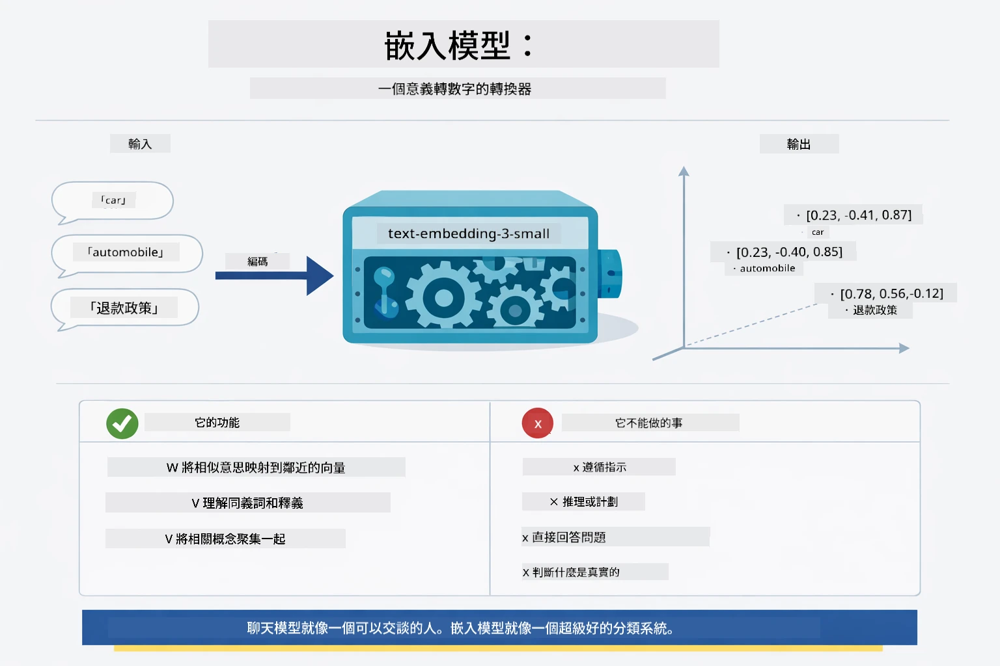

*此圖展示嵌入模型如何將文字轉為數字向量，將意義相近的詞（如「car」與「automobile」）聚集在向量空間中。*

```java
@Bean
public EmbeddingModel embeddingModel() {
    return OpenAiOfficialEmbeddingModel.builder()
        .baseUrl(azureOpenAiEndpoint)
        .apiKey(azureOpenAiKey)
        .modelName(azureEmbeddingDeploymentName)
        .build();
}

EmbeddingStore<TextSegment> embeddingStore = 
    new InMemoryEmbeddingStore<>();
```

下圖類別圖展示 RAG 流程中的兩條分支及 LangChain4j 的對應類別。**導入流程**（上傳時執行一次）負責文件切分、分塊嵌入及通過 `.addAll()` 存至向量庫。**查詢流程**（每次提問時執行）會將問題嵌入、用 `.search()` 搜尋庫，再將匹配的上下文傳給聊天模型。兩者藉由共用的 `EmbeddingStore<TextSegment>` 介面對接：

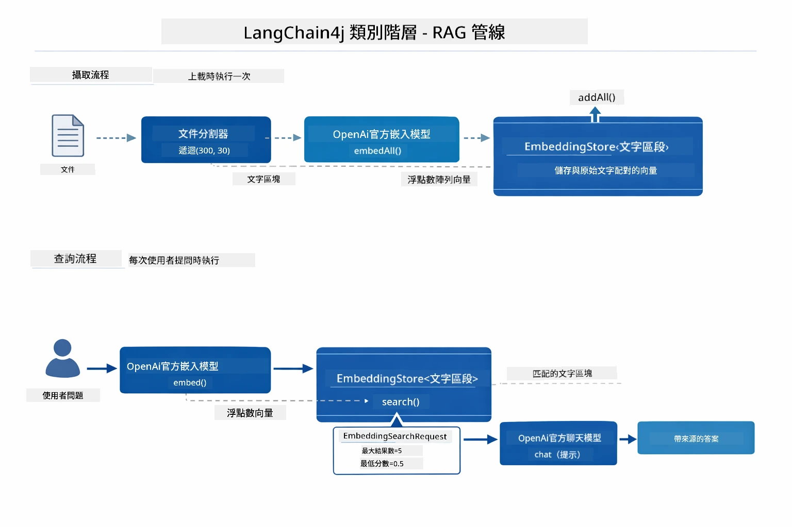

*此圖展示 RAG 流程中的兩個分支：導入與查詢，並說明它們如何經由共用 EmbeddingStore 互連。*

嵌入一旦存入，相關內容自然在向量空間聚集。下圖顯示關於相似主題的文件會成為鄰近的點，正是語義搜尋的基礎：


*此圖視覺化展示技術文件、商業規則、FAQ 等主題如何在三維向量空間聚集成不同群組。*

當使用者搜尋時，系統執行四步驟：文件嵌入一次（導入）、每次搜尋問題嵌入，利用餘弦相似度比較問題向量與所有存儲向量，返回分數最高的前 K 個分塊。下圖說明每步與相應的 LangChain4j 類別：

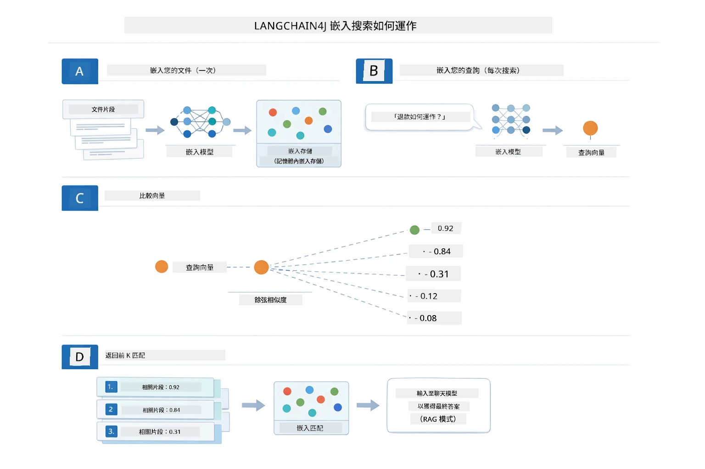

*此圖展示四步嵌入搜尋流程：文件嵌入、查詢嵌入、透過餘弦相似度比較向量，及返回前 K 結果。*

### 語義搜尋

[RagService.java](../../../03-rag/src/main/java/com/example/langchain4j/rag/service/RagService.java)

當你提問，你的問題同樣會被轉成嵌入向量。系統將問題向量與所有文件分塊向量比較，找出意義最相近的分塊 —— 不只是關鍵字匹配，而是全方位語義相似。

```java
Embedding queryEmbedding = embeddingModel.embed(question).content();

EmbeddingSearchRequest searchRequest = EmbeddingSearchRequest.builder()
    .queryEmbedding(queryEmbedding)
    .maxResults(5)
    .minScore(0.5)
    .build();

EmbeddingSearchResult<TextSegment> searchResult = embeddingStore.search(searchRequest);
List<EmbeddingMatch<TextSegment>> matches = searchResult.matches();

for (EmbeddingMatch<TextSegment> match : matches) {
    String relevantText = match.embedded().text();
    double score = match.score();
}
```

下圖比較語義搜尋與傳統關鍵字搜尋。關鍵字搜尋若搜尋「vehicle」會錯過描述「cars and trucks」的分塊，但語義搜尋理解兩者意義相同，且將其列為高分匹配：

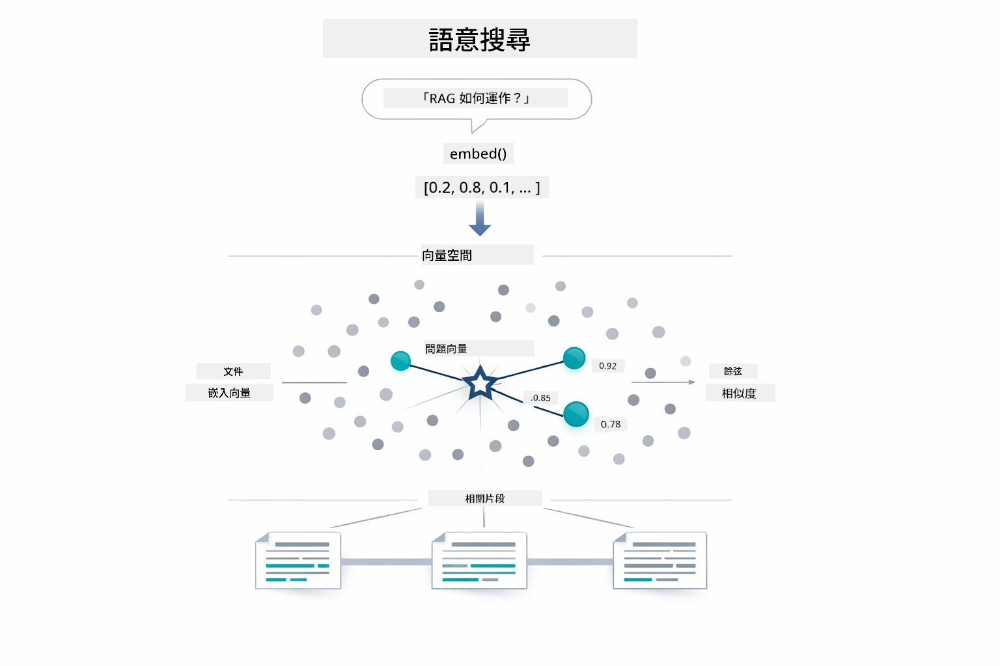

*此圖比較基於關鍵字與語義的搜尋方式，展示語義搜尋可檢索到概念相關內容，即使具體關鍵字不同。*
底層中，相似度是透過餘弦相似度來測量 — 本質上是在問「這兩個箭頭是否指向相同方向？」兩段文字可以使用完全不同的詞彙，但如果它們的意思相同，向量就會指向同一方向，且分數接近 1.0：

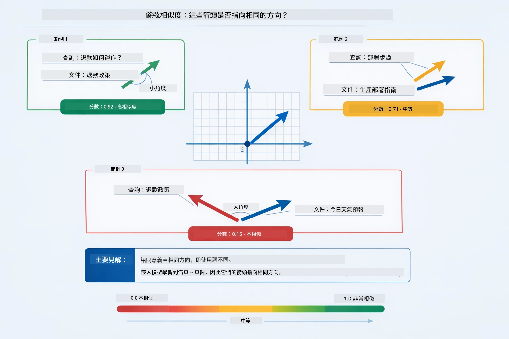

*此圖展示餘弦相似度作為嵌入向量間的角度 — 向量越一致，分數越接近 1.0，表示語義相似度越高。*

> **🤖 嘗試使用 [GitHub Copilot](https://github.com/features/copilot) Chat：** 開啟 [`RagService.java`](../../../03-rag/src/main/java/com/example/langchain4j/rag/service/RagService.java) 並詢問：
> - 「嵌入向量的相似度搜尋如何運作？分數由什麼決定？」
> - 「我應該使用什麼相似度門檻？這如何影響結果？」
> - 「如果找不到相關文件，我該如何處理？」

### 答案生成

[RagService.java](../../../03-rag/src/main/java/com/example/langchain4j/rag/service/RagService.java)

最相關的片段會被組裝成結構化提示，包含明確指示、檢索到的上下文以及使用者問題。模型閱讀這些特定片段並根據此資訊回答 — 它只能使用眼前的資料，避免出現虛構內容。

```java
String context = matches.stream()
    .map(match -> match.embedded().text())
    .collect(Collectors.joining("\n\n"));

String prompt = String.format("""
    Answer the question based on the following context.
    If the answer cannot be found in the context, say so.

    Context:
    %s

    Question: %s

    Answer:""", context, request.question());

String answer = chatModel.chat(prompt);
```

下圖展示此組裝過程 — 來自搜尋步驟得分最高的片段被注入提示模板，`OpenAiOfficialChatModel` 生成一個有根據的答案：

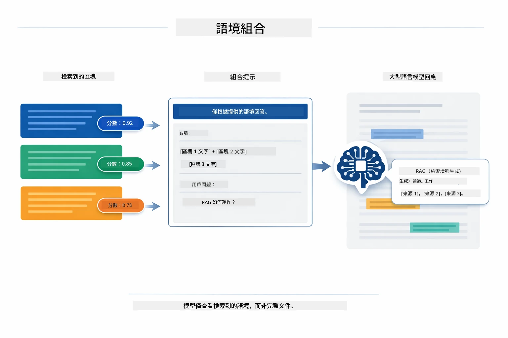

*此圖展示如何將得分最高的片段組裝成結構化提示，使模型能從您的資料中生成有根據的答案。*

## 執行應用程式

**驗證部署：**

確保在根目錄存在 `.env` 檔案且包含 Azure 憑證（於模組 01 過程中建立）。從模組目錄 (`03-rag/`) 執行：

**Bash:**
```bash
cat ../.env  # 應顯示 AZURE_OPENAI_ENDPOINT、API_KEY、DEPLOYMENT
```

**PowerShell:**
```powershell
Get-Content ..\.env  # 應該顯示 AZURE_OPENAI_ENDPOINT、API_KEY、DEPLOYMENT
```

**啟動應用程式：**

> **注意：** 若您已從根目錄使用 `./start-all.sh` 啟動所有應用程式（如模組 01 所述），本模組已於 8081 埠運行。您可跳過以下啟動指令，直接前往 http://localhost:8081。

**選項 1：使用 Spring Boot 儀表板（推薦 VS Code 使用者）**

開發容器包含 Spring Boot 儀表板擴充套件，提供視覺界面管理所有 Spring Boot 應用程式。您可在 VS Code 左側活動列找到（尋找 Spring Boot 圖示）。

從 Spring Boot 儀表板，您可以：
- 查看工作區內所有可用的 Spring Boot 應用程式
- 一鍵啟動/停止應用程式
- 即時查看應用程式日誌
- 監控應用程式狀態

只要按一下「rag」旁的播放按鈕即可啟動此模組，或一次啟動所有模組。


*此截圖顯示 VS Code 中的 Spring Boot 儀表板，您可視覺化地啟動、停止及監控應用程式。*

**選項 2：使用 shell 腳本**

啟動所有網頁應用程式（模組 01-04）：

**Bash:**
```bash
cd ..  # 從根目錄
./start-all.sh
```

**PowerShell:**
```powershell
cd ..  # 從根目錄
.\start-all.ps1
```

或僅啟動此模組：

**Bash:**
```bash
cd 03-rag
./start.sh
```

**PowerShell:**
```powershell
cd 03-rag
.\start.ps1
```

兩個腳本會自動從根目錄的 `.env` 檔載入環境變數，若 JAR 檔不存在會自動建置。

> **注意：** 若您偏好先手動建置所有模組再啟動：
>
> **Bash:**
> ```bash
> cd ..  # Go to root directory
> mvn clean package -DskipTests
> ```

> **PowerShell:**
> ```powershell
> cd ..  # Go to root directory
> mvn clean package -DskipTests
> ```

在瀏覽器開啟 http://localhost:8081 。

**停止應用程式：**

**Bash:**
```bash
./stop.sh  # 僅此模組
# 或者
cd .. && ./stop-all.sh  # 所有模組
```

**PowerShell:**
```powershell
.\stop.ps1  # 僅限此模組
# 或者
cd ..; .\stop-all.ps1  # 所有模組
```

## 使用應用程式

應用程式提供文件上傳與提問的網頁介面。

<a href="images/rag-homepage.png"></a>

*此截圖展示 RAG 應用介面，您可在此處上傳文件並提問。*

### 上傳文件

先上傳一份文件 — 測試用以 TXT 檔為佳。本目錄內有一個 `sample-document.txt`，包含 LangChain4j 功能、RAG 實作及最佳實務資訊，適合用來測試系統。

系統會處理您上傳的文件，將其分割成多個片段，並為每個片段建立嵌入向量。這個過程在上傳時自動完成。

### 提問

現在可針對文件內容提問具體問題。嘗試問一些文件中明確陳述的事實。系統會搜尋相關片段，將它們納入提示，並產生回答。

### 檢查來源引用

留意每個回答都包含來源引用及相似度分數。這些分數（介於 0 到 1）表示每個片段與您的問題的相關程度。分數越高，匹配越好。這能讓您核對答案是否符合來源內容。

<a href="images/rag-query-results.png"></a>

*此截圖展示查詢結果，包括生成的答案、來源引用與擷取片段之相關分數。*

### 嘗試不同問題

嘗試不同類型的問題：
- 具體事實：「主要主題是什麼？」
- 比較：「X 和 Y 有何不同？」
- 摘要：「請總結關於 Z 的要點」

觀察相關分數隨著問題與文件內容匹配度的變化。

## 主要概念

### 分段策略

文件被切成 300 個標記的段落，並重疊 30 個標記。這種設定能確保每段有足夠上下文意義，同時段落仍足夠小，能包含多段於一個提示中。

### 相似度分數

每擷取的片段都有一個 0 到 1 之間的相似度分數，表示與使用者問題的匹配程度。下圖視覺化分數範圍及系統如何利用它們過濾結果：

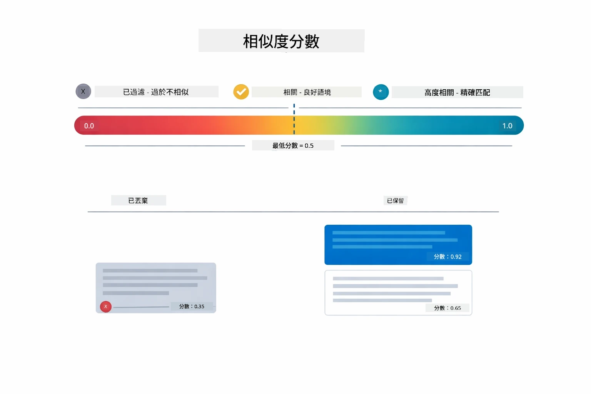

*此圖展示分數範圍從 0 到 1，系統設有 0.5 最低門檻過濾不相關的片段。*

分數範圍如下：
- 0.7-1.0：高度相關，精確匹配
- 0.5-0.7：相關，具良好上下文
- 低於 0.5：已過濾，不相關

系統僅擷取高於最低門檻的片段以確保品質。

嵌入向量在意義清晰群聚時表現良好，但存在盲點。下圖展示常見的失敗模式 — 片段太大導致向量模糊、片段太小缺乏上下文、不明確詞彙指向多群聚，以及精確匹配查找（ID、零件號）完全無法透過嵌入實現：

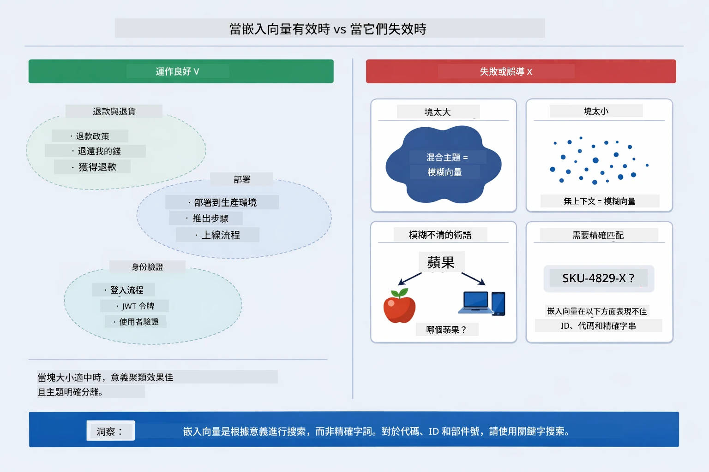

*此圖展示常見的嵌入失敗模式：片段過大、片段過小、多義詞指向多群聚，以及像 ID 這類精確匹配查找。*

### 記憶體儲存

為簡化，本模組使用記憶體儲存。重啟應用程式時，上傳的文件資料會遺失。生產環境系統會使用持久化向量資料庫，如 Qdrant 或 Azure AI Search。

### 上下文視窗管理

每款模型有最大上下文視窗限制。您無法將大型文件的所有片段全部納入。系統會擷取相關性最高的前 N 個片段（預設 5 個），在限制內提供足夠上下文以保持回答正確。

## RAG 何時適用

RAG 並非總是最佳選擇。下圖決策指南幫助您判斷何時使用 RAG 有效，何時簡單方法 — 如直接將內容放入提示或依賴模型固有知識 — 已足夠：

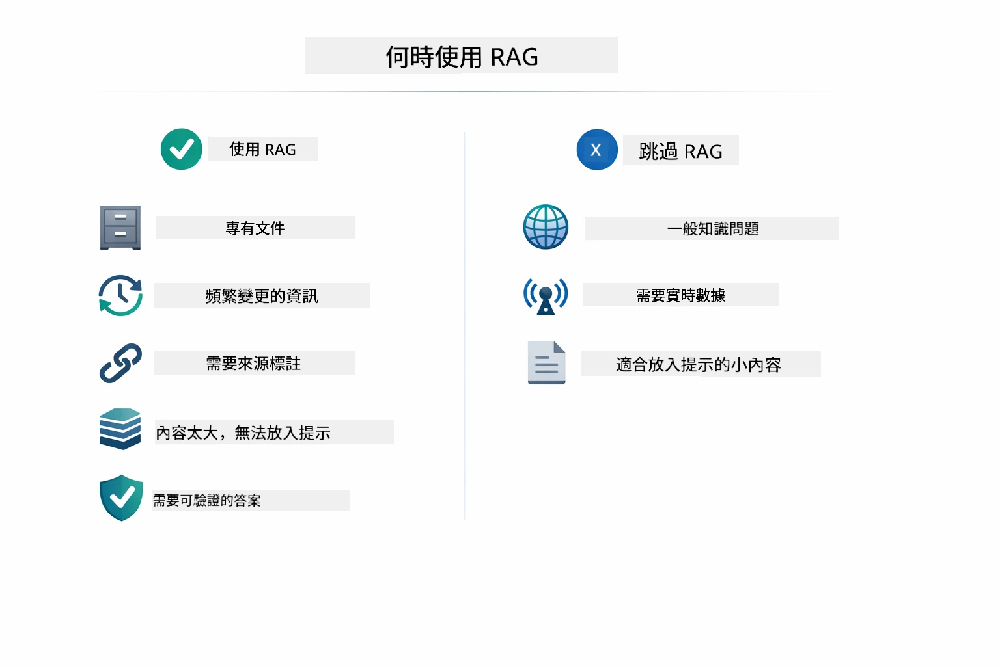

*此圖展示決策指南，協助判斷何時 RAG 添增價值，何時簡單方法足夠。*

## 下一步

**下一模組：** [04-tools - 使用工具的 AI 代理](../04-tools/README.md)

---

**導覽：** [← 上一頁：模組 02 - 提示工程](../02-prompt-engineering/README.md) | [返回主頁](../README.md) | [下一頁：模組 04 - 工具 →](../04-tools/README.md)

---

<!-- CO-OP TRANSLATOR DISCLAIMER START -->
**免責聲明**：
本文件是使用 AI 翻譯服務 [Co-op Translator](https://github.com/Azure/co-op-translator) 所翻譯。雖然我們力求準確，但請注意，自動翻譯可能包含錯誤或不準確之處。原始文件的母語版本應被視為權威來源。對於重要資訊，建議採用專業人工翻譯。我們不對因使用本翻譯而引起的任何誤解或誤釋承擔責任。
<!-- CO-OP TRANSLATOR DISCLAIMER END -->