# Module 04: AI Agents with Tools

## Table of Contents

- [What You'll Learn](../../../04-tools)
- [Prerequisites](../../../04-tools)
- [Understanding AI Agents with Tools](../../../04-tools)
- [How Tool Calling Works](../../../04-tools)
  - [Tool Definitions](../../../04-tools)
  - [Decision Making](../../../04-tools)
  - [Execution](../../../04-tools)
  - [Response Generation](../../../04-tools)
  - [Architecture: Spring Boot Auto-Wiring](../../../04-tools)
- [Tool Chaining](../../../04-tools)
- [Run the Application](../../../04-tools)
- [Using the Application](../../../04-tools)
  - [Try Simple Tool Usage](../../../04-tools)
  - [Test Tool Chaining](../../../04-tools)
  - [See Conversation Flow](../../../04-tools)
  - [Experiment with Different Requests](../../../04-tools)
- [Key Concepts](../../../04-tools)
  - [ReAct Pattern (Reasoning and Acting)](../../../04-tools)
  - [Tool Descriptions Matter](../../../04-tools)
  - [Session Management](../../../04-tools)
  - [Error Handling](../../../04-tools)
- [Available Tools](../../../04-tools)
- [When to Use Tool-Based Agents](../../../04-tools)
- [Tools vs RAG](../../../04-tools)
- [Next Steps](../../../04-tools)

## What You'll Learn

到目前為止，你已經學會如何與 AI 進行對話、有效地結構提示語，並將回應依據文件作基礎。但仍有一個根本限制：語言模型只能產生文字。它們無法查天氣、執行計算、查詢資料庫或與外部系統互動。

工具改變了這一點。當模型可存取並呼叫功能時，你便將它從文字生成器轉變成可採取行動的代理。模型判斷何時需要工具、使用哪個工具，以及傳遞哪些參數。你的程式執行該功能並回傳結果，模型再將結果整合到回答中。

## Prerequisites

- 已完成 [Module 01 - Introduction](../01-introduction/README.md)（Azure OpenAI 資源已部署）
- 建議完成前幾個模組（本模組於工具與 RAG 的比較中參考了 [Module 03 的 RAG 概念](../03-rag/README.md)）
- 根目錄中有 `.env` 檔案，內含 Azure 憑證（由 Module 01 中的 `azd up` 建立）

> **註：** 如果你尚未完成 Module 01，請先依照該模組中的部署指示操作。

## Understanding AI Agents with Tools

> **📝 註：** 本模組中提及的「代理」係指具備工具呼叫能力的 AI 助手，這不同於我們將於 [Module 05: MCP](../05-mcp/README.md) 中介紹的 **Agentic AI** 範式（具備規劃、記憶與多步推理的自主代理）。

沒有工具時，語言模型只能從訓練資料生成文字。問它當前天氣，它只能猜測。給它工具，它可呼叫天氣 API、執行計算或查詢資料庫，並將真實結果融合到回答中。

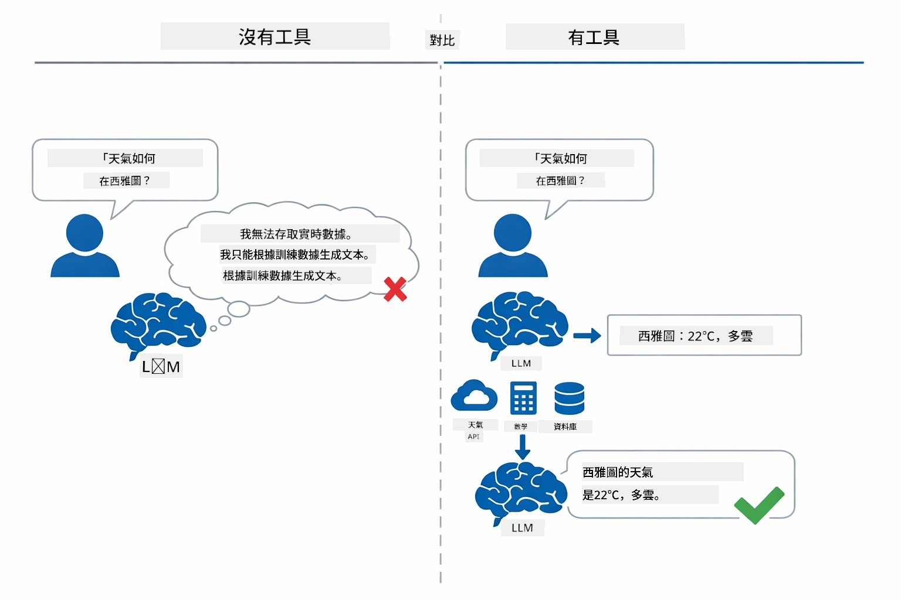

*無工具時模型只能猜測 — 有工具時可以呼叫 API、執行計算並返回即時數據。*

具工具的 AI 代理遵循一種 **推理與行動（ReAct）** 模式。模型不僅回應，還會思考所需內容、透過呼叫工具執行行動、觀察結果，然後決定是否繼續行動或給出最終答案：

1. **推理** — 代理分析用戶問題，判斷所需資訊
2. **行動** — 代理挑選合適工具，生成參數並呼叫
3. **觀察** — 代理接收工具輸出並評估結果
4. **重複或回答** — 若需更多資料則迴圈，否則生成自然語言回答

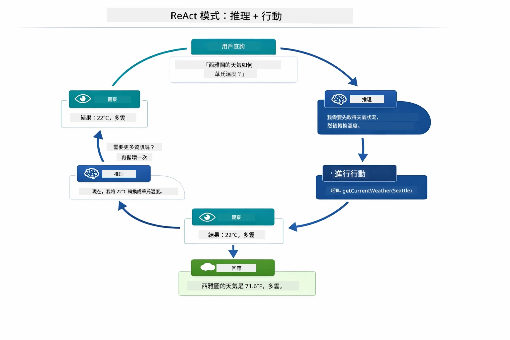

*ReAct 循環 — 代理思考下一步動作，呼叫工具執行，觀察結果，並反覆直到能給出最終答案。*

這一過程是自動的。你定義工具及其說明，模型會決定何時及如何使用它們。

## How Tool Calling Works

### Tool Definitions

[WeatherTool.java](../../../04-tools/src/main/java/com/example/langchain4j/agents/tools/WeatherTool.java) | [TemperatureTool.java](../../../04-tools/src/main/java/com/example/langchain4j/agents/tools/TemperatureTool.java)

你以清晰說明和參數規格定義函式。模型在系統提示語中看到這些說明，了解每個工具的功能。

```java
@Component
public class WeatherTool {
    
    @Tool("Get the current weather for a location")
    public String getCurrentWeather(@P("Location name") String location) {
        // 你的天氣查詢邏輯
        return "Weather in " + location + ": 22°C, cloudy";
    }
}

@AiService
public interface Assistant {
    String chat(@MemoryId String sessionId, @UserMessage String message);
}

// 助手會由 Spring Boot 自動連接：
// - ChatModel Bean
// - 來自 @Component 類別的所有 @Tool 方法
// - 用於會話管理的 ChatMemoryProvider
```

下圖解析每個註釋及其如何幫助 AI 理解何時呼叫工具及該傳哪些參數：

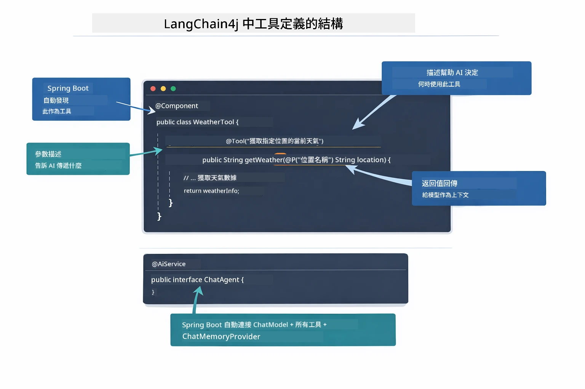

*工具定義結構 — @Tool 告訴 AI 何時使用，@P 說明每個參數，@AiService 在啟動時將所有組件串接。*

> **🤖 嘗試用 [GitHub Copilot](https://github.com/features/copilot) Chat：** 打開 [`WeatherTool.java`](../../../04-tools/src/main/java/com/example/langchain4j/agents/tools/WeatherTool.java) 並詢問：
> - 「我如何整合像 OpenWeatherMap 這樣的真實天氣 API 取代假資料？」
> - 「什麼樣的工具說明能幫助 AI 正確使用它？」
> - 「如何在工具實作中處理 API 錯誤與頻率限制？」

### Decision Making

當用戶問「西雅圖今天天氣如何？」時，模型不會隨機挑工具。它會將用戶意圖與所有工具說明比對，計分後挑選最佳匹配，然後生成結構化函式呼叫及正確參數（例如設定 `location` 為 `"Seattle"`）。

若無工具符合用戶需求，模型將退回用自身知識解答。若多個符合，則選擇最具體者。

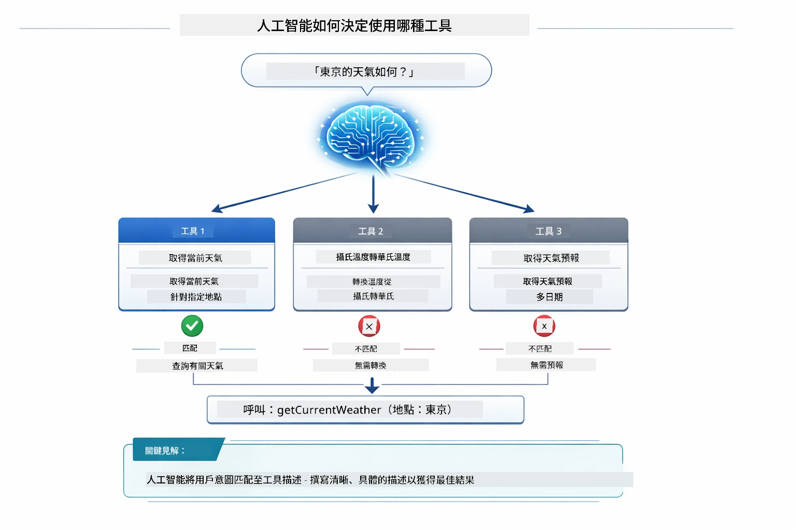

*模型評估所有可用工具與用戶意圖的匹配度並選出最佳 — 這就是為何撰寫清楚且具體的工具說明很重要。*

### Execution

[AgentService.java](../../../04-tools/src/main/java/com/example/langchain4j/agents/service/AgentService.java)

Spring Boot 會自動將所有註冊工具與宣告的 `@AiService` 介面串接，LangChain4j 擔任工具呼叫執行者。背後完整的工具呼叫流程涵蓋六個階段，從用戶的自然語言問題到最終自然語言回答：

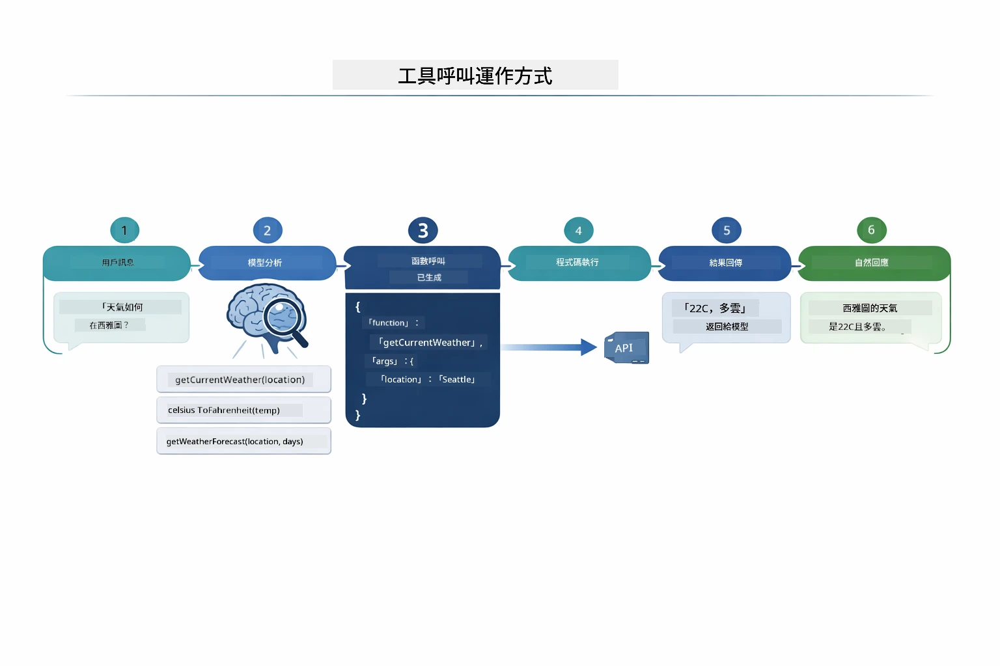

*端對端流程 — 用戶提問，模型選工具，LangChain4j 執行，模型將結果編織成自然回答。*

> **🤖 嘗試用 [GitHub Copilot](https://github.com/features/copilot) Chat：** 打開 [`AgentService.java`](../../../04-tools/src/main/java/com/example/langchain4j/agents/service/AgentService.java) 並詢問：
> - 「ReAct 模式如何運作？為何對 AI 代理有效？」
> - 「代理如何決定用什麼工具和順序？」
> - 「若工具執行失敗，應如何穩健處理錯誤？」

### Response Generation

模型接收天氣資料並將其格式化為自然語言回應。

### Architecture: Spring Boot Auto-Wiring

本模組使用 LangChain4j 的 Spring Boot 整合，搭配宣告式 `@AiService` 介面。啟動時，Spring Boot 掃描所有包含 `@Tool` 方法的 `@Component` 類別、你的 `ChatModel` bean 與 `ChatMemoryProvider`，再將它們串接成單一 `Assistant` 介面，無須額外樣板程式碼。

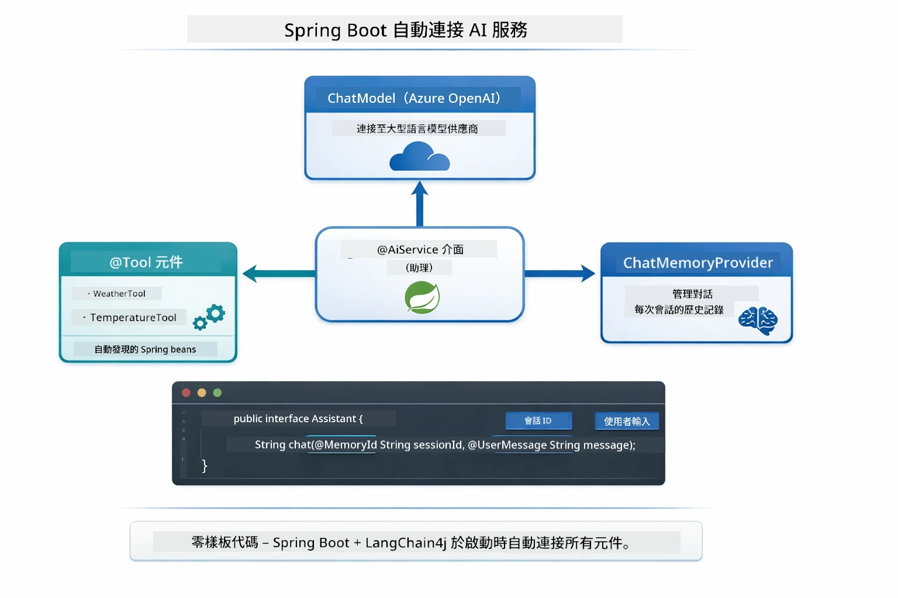

*@AiService 介面將 ChatModel、工具元件與記憶體供應器串接 — Spring Boot 自動處理所有組件注入。*

此方法主要優勢：

- **Spring Boot 自動注入** — ChatModel 與工具自動注入
- **@MemoryId 模式** — 自動會話記憶管理
- **單例實例** — Assistant 實例僅建立一次以提高效能
- **類型安全執行** — Java 方法直接呼叫並自動類型轉換
- **多輪協調** — 自動處理工具連鎖
- **零樣板程式碼** — 無需手動呼叫 `AiServices.builder()` 或管理記憶體 HashMap

其他方法（手動使用 `AiServices.builder()`）需要更多程式碼且無 Spring Boot 整合優勢。

## Tool Chaining

**工具連鎖** — 工具代理的真正威力展現在一個問題需用到多個工具時。問「西雅圖現在華氏溫度多少？」代理會自動串接兩個工具：先呼叫 `getCurrentWeather` 取得攝氏溫度，再將結果傳給 `celsiusToFahrenheit` 轉換成華氏溫度 — 全在同一次對話輪次中完成。

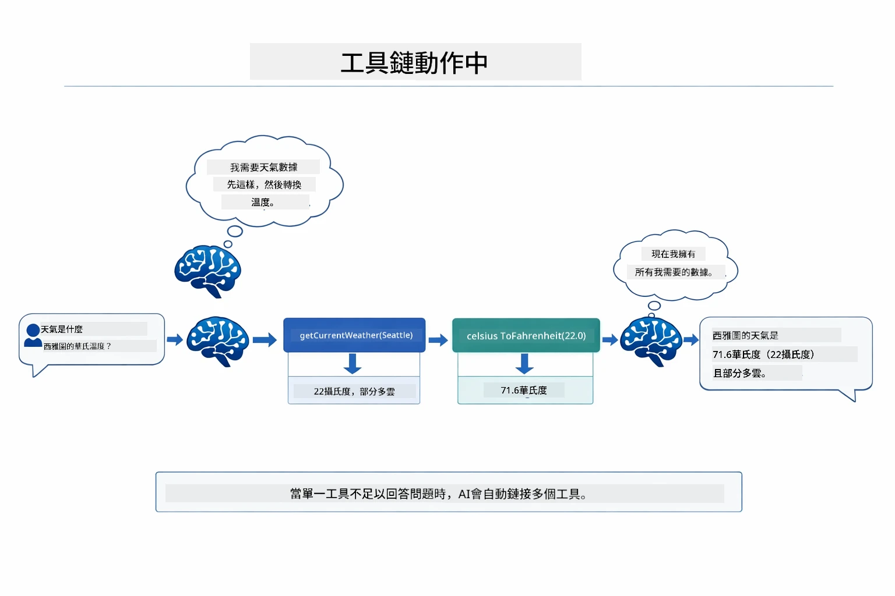

*工具連鎖實例 — 代理先呼叫 getCurrentWeather，再將攝氏結果傳至 celsiusToFahrenheit，最後給出組合回答。*

**優雅失敗** — 若詢問不在假資料中城市的天氣，工具會回傳錯誤訊息，AI 解釋無法幫忙而非崩潰。工具失敗時能安全處理。下圖對比兩種作法：妥善錯誤處理下，代理捕捉例外並進行有用回應；否則會造成整個應用崩潰：

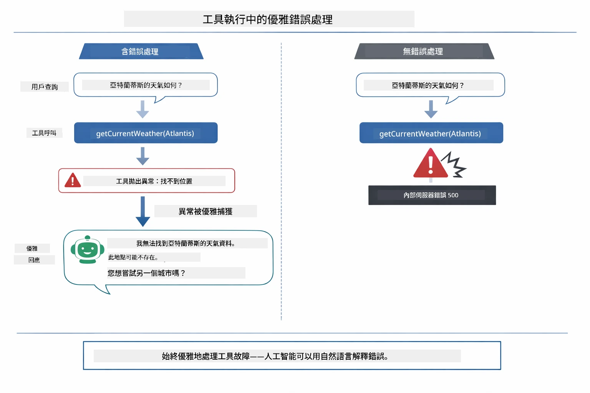

*工具失敗時，代理捕捉錯誤並用說明回應，而非崩潰。*

這在一輪對話中完成，代理自主協調多項工具呼叫。

## Run the Application

**確認部署：**

確保根目錄有 `.env` 檔案，內含 Azure 憑證（已於 Module 01 期間建立）。於本模組資料夾 (`04-tools/`) 執行：

**Bash:**
```bash
cat ../.env  # 應該顯示 AZURE_OPENAI_ENDPOINT、API_KEY、DEPLOYMENT
```

**PowerShell:**
```powershell
Get-Content ..\.env  # 應該顯示 AZURE_OPENAI_ENDPOINT、API_KEY、DEPLOYMENT
```

**啟動應用程式：**

> **註：** 若你已在根目錄用 `./start-all.sh` 啟動所有應用（Module 01 說明中提及），本模組已在 8084 埠執行，可跳過下列啟動指令，直接訪問 http://localhost:8084。

**選項 1: 使用 Spring Boot Dashboard（推薦 VS Code 用戶）**

開發容器包含 Spring Boot Dashboard 擴充，提供視覺化介面管理所有 Spring Boot 應用。可在 VS Code 左側活動列找到（Spring Boot 圖示）。

透過 Spring Boot Dashboard，你可以：
- 查看工作區內所有可用 Spring Boot 應用
- 單擊即可啟動／停止應用
- 即時觀察應用日誌
- 監控應用狀態

只需點擊「tools」旁的播放鈕啟動本模組，或同時啟動所有模組。

以下為 VS Code 中 Spring Boot Dashboard 介面：


*VS Code 中的 Spring Boot Dashboard — 從一處啟動、停止並監控所有模組*

**選項 2: 使用 shell 腳本**

啟動所有 Web 應用（模組 01-04）：

**Bash:**
```bash
cd ..  # 從根目錄
./start-all.sh
```

**PowerShell:**
```powershell
cd ..  # 從根目錄
.\start-all.ps1
```

或只啟動本模組：

**Bash:**
```bash
cd 04-tools
./start.sh
```

**PowerShell:**
```powershell
cd 04-tools
.\start.ps1
```

兩者腳本會自動從根目錄 `.env` 載入環境變數，且若尚無 JAR 檔會自動編譯。

> **註：** 若想預先手動編譯所有模組：
>
> **Bash:**
> ```bash
> cd ..  # Go to root directory
> mvn clean package -DskipTests
> ```
>
> **PowerShell:**
> ```powershell
> cd ..  # Go to root directory
> mvn clean package -DskipTests
> ```

在瀏覽器開啟 http://localhost:8084。

**停止應用：**

**Bash:**
```bash
./stop.sh  # 只有這個模組
# 或
cd .. && ./stop-all.sh  # 所有模組
```

**PowerShell:**
```powershell
.\stop.ps1  # 僅此模組
# 或者
cd ..; .\stop-all.ps1  # 所有模組
```

## Using the Application

該應用提供一個網頁介面，可與具備天氣與溫度轉換工具的 AI 代理互動。介面包含快速啟動範例與發送請求的聊天面板：
<a href="images/tools-homepage.png"></a>

*AI 代理工具介面 - 用於與工具互動的快速範例及聊天介面*

### 嘗試簡易工具使用

從一個簡單的請求開始：「將 100 華氏度轉換成攝氏度」。代理會識別出需要使用溫度轉換工具，並帶著正確的參數呼叫它，然後回傳結果。注意這過程多麼自然——你無需指定使用哪個工具或如何呼叫。

### 測試工具鏈結

現在試試更複雜的問題：「西雅圖的天氣如何，並將其轉換為華氏度？」觀看代理分步執行的過程。它先查詢天氣（結果是攝氏度），接著識別出需要轉換成華氏度，呼叫轉換工具，然後將兩個結果合併成一個回應。

### 看對話流程

聊天介面會保留對話歷史，讓你能進行多輪交互。你可以看到所有之前的查詢和回覆，輕鬆追蹤對話內容並了解代理如何在多次交流中建構上下文。

<a href="images/tools-conversation-demo.png"></a>

*多輪對話展示簡單轉換、天氣查詢及工具鏈結*

### 嘗試不同的請求

試試以下組合：
- 天氣查詢：「東京的天氣如何？」
- 溫度轉換：「25°C 等於多少開爾文？」
- 綜合查詢：「查詢巴黎天氣並告訴我是否高於 20°C」

留意代理如何解讀自然語言並映射到適當的工具呼叫。

## 核心概念

### ReAct 模式（推理與執行）

代理在推理（決定要做什麼）與執行（使用工具）之間交替。這個模式讓代理能自主解決問題，而非僅僅回應指令。

### 工具描述的重要性

工具描述的品質直接影響代理使用效果。清晰、具體的描述有助模型理解何時及如何呼叫每個工具。

### 會話管理

`@MemoryId` 註解支援自動的基於會話的記憶管理。每個會話 ID 都會分配一個由 `ChatMemoryProvider` bean 管理的 `ChatMemory` 實例，使多個使用者可以同時與代理互動而不會混淆彼此的對話。下圖展示根據不同會話 ID 為多用戶路由至隔離的記憶庫：

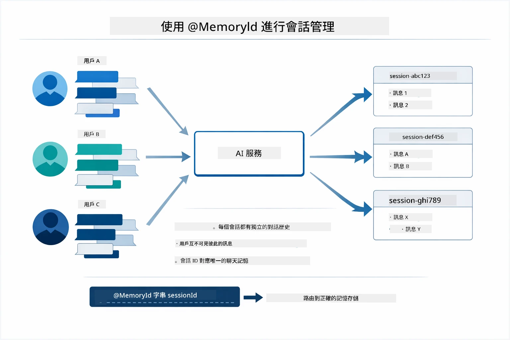

*每個會話 ID 對應獨立的對話歷史，使用者永遠看不到彼此的訊息。*

### 錯誤處理

工具可能會失敗——API 超時、參數可能無效、外部服務異常。生產環境中的代理需要錯誤處理功能，讓模型能夠說明問題或嘗試替代方案，而非讓整個應用崩潰。當工具拋出異常時，LangChain4j 會捕捉並將錯誤訊息反饋給模型，模型隨後可以以自然語言說明問題。

## 可用工具

下圖展示你能建置的廣泛工具生態系。此模組演示天氣和溫度工具，但相同的 `@Tool` 模式適用於任何 Java 方法——從資料庫查詢到支付處理皆可。

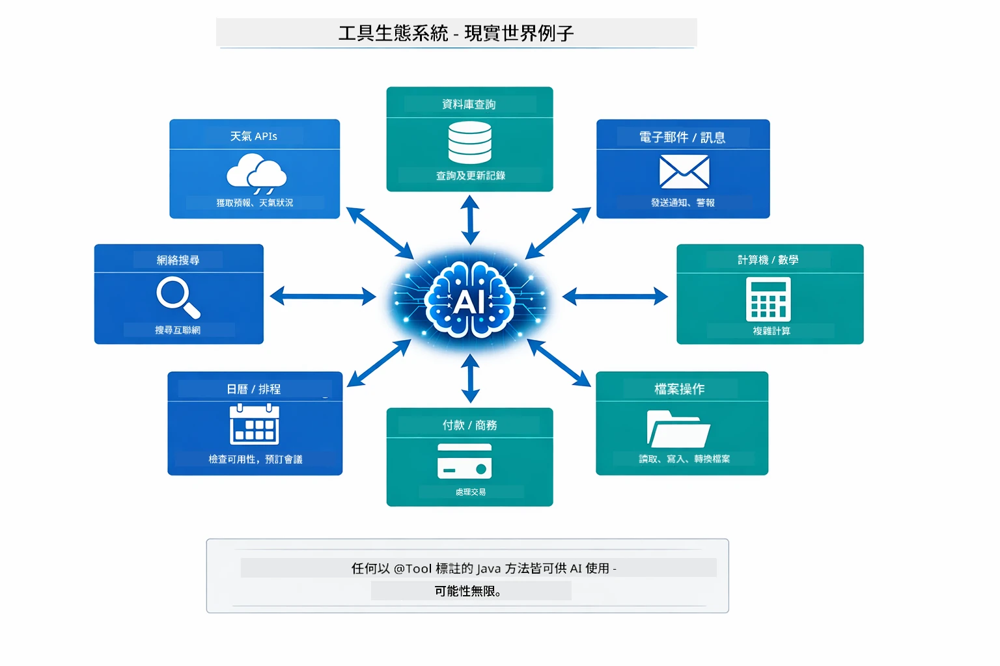

*任何標註有 @Tool 的 Java 方法都能提供給 AI 使用——此模式可延伸至資料庫、API、電子郵件、檔案操作等。*

## 何時使用基於工具的代理

並非所有請求都需要工具。決策依據在於 AI 是需與外部系統互動，還是能從自身知識回答問題。下圖總結何時工具帶來價值，何時則不需使用：

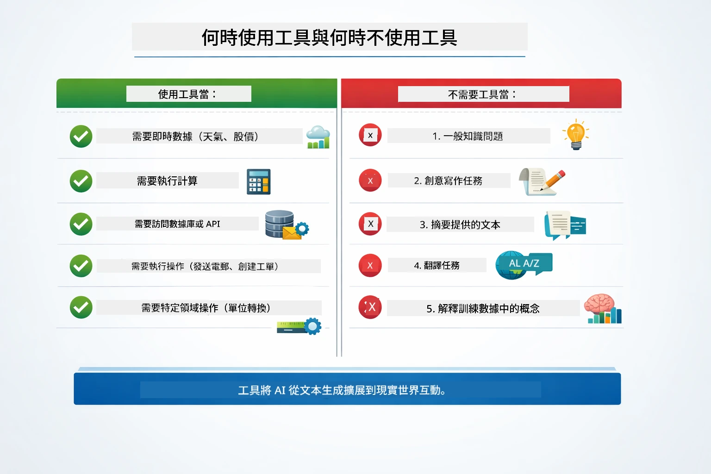

*快速決策指南——工具用於即時資料、計算與操作；一般知識和創意任務則不必。*

## 工具 vs RAG

模組 03 和 04 都擴展了 AI 的能力，但方式根本不同。RAG 透過檢索文件讓模型存取**知識**。工具則讓模型能呼叫函式執行**動作**。下圖並列比較這兩種方法——從各自工作流程到取捨：

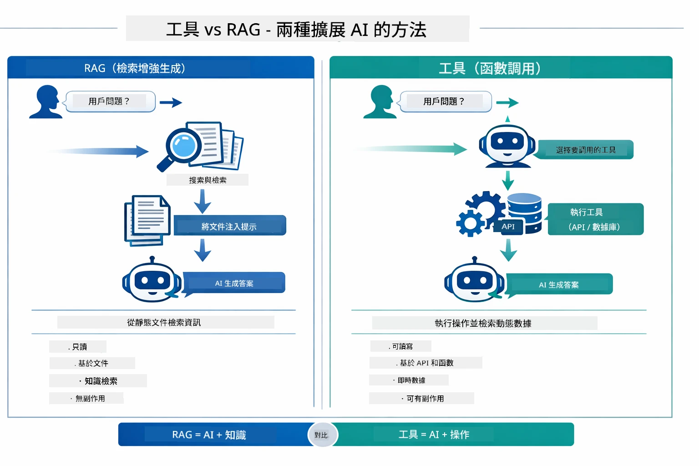

*RAG 從靜態文件檢索訊息——工具執行動作並擷取動態即時資料。許多生產系統結合兩者使用。*

實務上，許多生產系統結合兩者：RAG 用來根據文件內容提供依據的答案，工具則用來取得即時資料或執行操作。

## 下一步

**下一模組：** [05-mcp - 模型上下文協議 (MCP)](../05-mcp/README.md)

---

**導航：** [← 前一模組: 模組 03 - RAG](../03-rag/README.md) | [返回主頁](../README.md) | [下一模組: 模組 05 - MCP →](../05-mcp/README.md)

---

<!-- CO-OP TRANSLATOR DISCLAIMER START -->
**免責聲明**：  
本文件係使用人工智能翻譯服務 [Co-op Translator](https://github.com/Azure/co-op-translator) 翻譯完成。雖然我們力求準確，但請注意自動翻譯結果可能包含錯誤或不準確之處。原文件之本地語言版本應視為權威文本。如涉及重要資訊，建議使用專業人工翻譯。我們不對因使用本翻譯而引起之任何誤解或誤釋負責。
<!-- CO-OP TRANSLATOR DISCLAIMER END -->