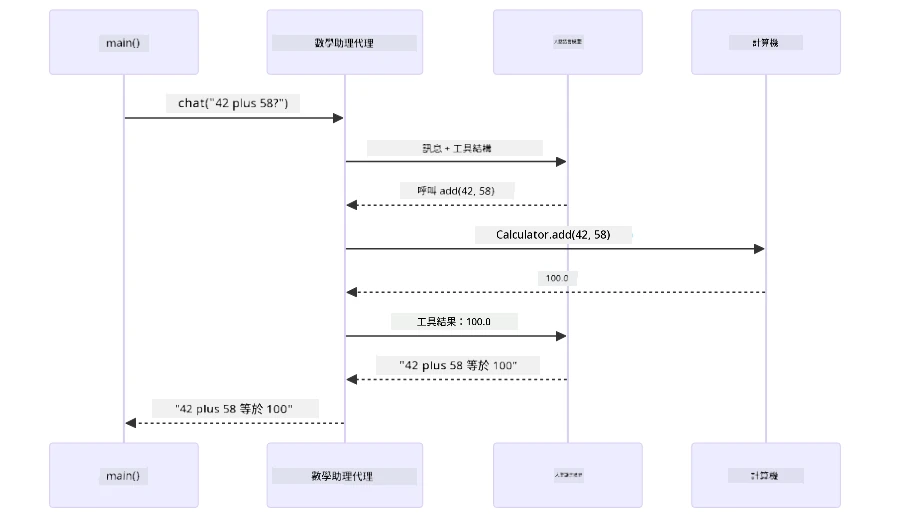
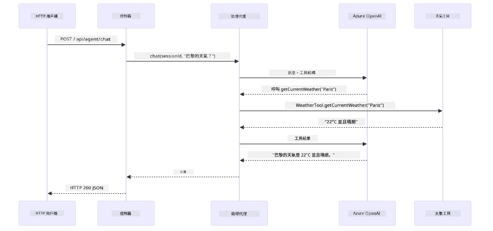

# Module 04: 使用工具的 AI 代理

## 目錄

- [影片導覽](../../../04-tools)
- [你將會學到的內容](../../../04-tools)
- [前置條件](../../../04-tools)
- [了解使用工具的 AI 代理](../../../04-tools)
- [工具呼叫原理](../../../04-tools)
  - [工具定義](../../../04-tools)
  - [決策過程](../../../04-tools)
  - [執行](../../../04-tools)
  - [回應生成](../../../04-tools)
  - [架構：Spring Boot 自動接線](../../../04-tools)
- [工具串接](../../../04-tools)
- [執行應用程序](../../../04-tools)
- [使用應用程序](../../../04-tools)
  - [嘗試簡單工具使用](../../../04-tools)
  - [測試工具串接](../../../04-tools)
  - [觀察對話流程](../../../04-tools)
  - [實驗不同請求](../../../04-tools)
- [關鍵概念](../../../04-tools)
  - [ReAct 模式（推理與行動）](../../../04-tools)
  - [工具描述很重要](../../../04-tools)
  - [會話管理](../../../04-tools)
  - [錯誤處理](../../../04-tools)
- [可用工具](../../../04-tools)
- [何時使用基於工具的代理](../../../04-tools)
- [工具與 RAG 比較](../../../04-tools)
- [下一步](../../../04-tools)

## 影片導覽

觀看本次直播課程，說明如何開始本模組：

<a href="https://www.youtube.com/watch?v=O_J30kZc0rw"></a>

## 你將會學到的內容

到目前為止，你已經學會如何與 AI 對話、有效組織提示詞，以及如何根據文件產生回應。但有一個根本限制：語言模型只能產生文字，它無法查詢天氣、執行計算、查詢資料庫，或與外部系統互動。

工具改變了這一點。透過提供模型可調用的函數，你將它從純文字產生器轉化為可以採取行動的代理。模型決定何時需要工具，使用哪個工具，以及傳入什麼參數。你的程式碼執行函數並回傳結果。模型在回應中納入該結果。

## 前置條件

- 完成 [Module 01 - 簡介](../01-introduction/README.md)（部署 Azure OpenAI 資源）
- 建議完成前置模組（本模組在「工具 vs RAG」比較中引用了 [Module 03 的 RAG 概念](../03-rag/README.md)）
- 根目錄下有 `.env` 檔案，包含 Azure 認證（由 Module 01 中的 `azd up` 建立）

> **注意：** 如果尚未完成 Module 01，請先依照該模組的部署說明進行。

## 了解使用工具的 AI 代理

> **📝 注意：** 本模組中「代理（agents）」一詞指的是增強了工具呼叫功能的 AI 助理。這與我們會在 [Module 05: MCP](../05-mcp/README.md) 探討的 **Agentic AI** 模式（具備自主規劃、記憶和多步推理的自主代理）不同。

沒有工具時，語言模型只能根據訓練數據來產生文字。問它當前天氣怎樣，它只能猜測。賦予工具後，它可以呼叫天氣 API、執行計算或查詢資料庫，然後將這些真實結果編織進回應裡。


*無工具時模型只能猜測——有工具時它可以呼叫 API、執行計算並回傳即時資料。*

帶工具的 AI 代理遵循 **推理與行動（Reasoning and Acting，ReAct）** 模式。模型不僅回應，它會思考自己需要什麼、透過呼叫工具來行動、觀察結果，然後判斷是否繼續行動或給出最終答案：

1. **推理** — 分析用戶問題，決定需要什麼資訊
2. **行動** — 選擇合適工具，產生正確參數並呼叫它
3. **觀察** — 接收工具輸出並評估結果
4. **重複或回應** — 若需要更多資料就迴圈，否則組成自然語言答案


*ReAct 循環——代理推理要做什麼，透過呼叫工具來行動，觀察結果並迴圈，直到給出最終答案。*

這一切會自動發生。你定義工具及其描述，模型則處理何時及如何使用這些工具的決策。

## 工具呼叫原理

### 工具定義

[WeatherTool.java](../../../04-tools/src/main/java/com/example/langchain4j/agents/tools/WeatherTool.java) | [TemperatureTool.java](../../../04-tools/src/main/java/com/example/langchain4j/agents/tools/TemperatureTool.java)

你定義函數，並提供清晰描述與參數規格。模型在系統提示中看到這些描述，理解每個工具的功能。

```java
@Component
public class WeatherTool {
    
    @Tool("Get the current weather for a location")
    public String getCurrentWeather(@P("Location name") String location) {
        // 你的天氣查詢邏輯
        return "Weather in " + location + ": 22°C, cloudy";
    }
}

@AiService
public interface Assistant {
    String chat(@MemoryId String sessionId, @UserMessage String message);
}

// 助手由 Spring Boot 自動配置，含：
// - ChatModel bean
// - 所有來自 @Component 類別的 @Tool 方法
// - 用於會話管理的 ChatMemoryProvider
```

下圖解析每個註解，展示如何幫助 AI 了解何時呼叫工具以及傳入哪些參數：


*工具定義結構——@Tool 告訴 AI 何時使用它，@P 描述每個參數，@AiService 在啟動時串接所有元件。*

> **🤖 使用 [GitHub Copilot](https://github.com/features/copilot) Chat 嘗試：** 打開 [`WeatherTool.java`](../../../04-tools/src/main/java/com/example/langchain4j/agents/tools/WeatherTool.java) 並詢問：
> - 「如何整合像 OpenWeatherMap 這樣的真實天氣 API，而非使用模擬數據？」
> - 「什麼樣的工具描述能幫助 AI 正確使用該工具？」
> - 「在工具實作中如何處理 API 錯誤與速率限制？」

### 決策過程

當用戶問「Seattle 的天氣如何？」模型不會隨機選擇工具。它會對照每個工具描述評分，判斷與用戶意圖的相關性，選出最佳工具。然後產生結構化函數調用，這例中會設定 `location` 為 `"Seattle"`。

若無工具匹配用戶需求，模型則會用自身知識回應。若多個工具符合，會挑選最具體的一個。


*模型評估所有可用工具與用戶意圖的匹配度，選出最適合的工具——這就是為什麼撰寫清楚又具體的工具描述很重要。*

### 執行

[AgentService.java](../../../04-tools/src/main/java/com/example/langchain4j/agents/service/AgentService.java)

Spring Boot 自動將所有註冊的工具與宣告的 `@AiService` 介面接線，LangChain4j 自動執行工具調用。幕後流程涵蓋六個階段，從用戶自然語言問題到產生自然語言回答：


*完整端到端流程——用戶提出問題，模型挑選工具，LangChain4j 執行工具，模型整合結果生成自然回應。*

如果你執行過 Module 00 的 [ToolIntegrationDemo](../../../00-quick-start/src/main/java/com/example/langchain4j/quickstart/ToolIntegrationDemo.java)，已看過這種模式——`Calculator` 工具就是以相同方式呼叫。下圖序列圖精確展示示範中幕後發生的事情：



*Quick Start 示範的工具呼叫迴圈——`AiServices` 傳送訊息與工具結構給 LLM，LLM 回覆結構化函數調用如 `add(42, 58)`，LangChain4j 在本地執行 `Calculator` 方法，結果送回模型作最終回應。*

> **🤖 使用 [GitHub Copilot](https://github.com/features/copilot) Chat 嘗試：** 打開 [`AgentService.java`](../../../04-tools/src/main/java/com/example/langchain4j/agents/service/AgentService.java) 並詢問：
> - 「ReAct 模式如何運作？為什麼它對 AI 代理有效？」
> - 「代理如何決定要使用哪個工具及其順序？」
> - 「若工具執行失敗，該如何穩健錯誤處理？」

### 回應生成

模型接收天氣資料，將其格式化為對用戶的自然語言回應。

### 架構：Spring Boot 自動接線

本模組使用 LangChain4j 與 Spring Boot 整合的宣告式 `@AiService` 介面。啟動時 Spring Boot 掃描包含 `@Tool` 方法的每個 `@Component`、你的 `ChatModel` Bean，與 `ChatMemoryProvider`，然後將它們全數接線到單一 `Assistant` 介面，無需樣板程式碼。


*@AiService 介面串聯了 ChatModel、工具元件與記憶體提供者——Spring Boot 自動處理所有接線。*

下方為整個請求生命週期序列圖——從 HTTP 請求流經控制器、服務以及自動接線代理，直到工具執行並返回：



*完整 Spring Boot 請求生命週期——HTTP 請求透過控制器與服務流到自動接線的 Assistant 代理，該代理自動調度 LLM 與工具呼叫。*

此法關鍵優點：

- **Spring Boot 自動接線** — ChatModel 與工具自動注入
- **@MemoryId 模式** — 自動的基於會話的記憶管理
- **單一實例** — Assistant 創建一次，多次重用提升效能
- **類型安全執行** — 直接呼叫 Java 方法並自動型別轉換
- **多回合協調** — 自動處理工具串接
- **無樣板程式碼** — 無需手動 `AiServices.builder()` 調用或記憶體 HashMap

手動 `AiServices.builder()` 的方式需寫更多代碼，且無法獲得 Spring Boot 整合的優勢。

## 工具串接

**工具串接** — 基於工具的代理真正威力在於單一問題需要多個工具。問「Seattle 的天氣用華氏怎麼說？」時，代理會自動串接兩個工具：先呼叫 `getCurrentWeather` 取得攝氏溫度，再將該結果傳給 `celsiusToFahrenheit` 轉換，完成單回合回答。


*工具串接實例——代理先呼叫 getCurrentWeather，再將攝氏結果傳給 celsiusToFahrenheit，最後給出合併答覆。*

**優雅失敗** — 詢問不在模擬資料中的城市天氣，工具回傳錯誤訊息，AI 解釋無法協助而非當機。工具會安全失敗。下圖對比兩種情況——有適當錯誤處理時，代理捕捉例外並給出有幫助的答案，反之則整個應用崩潰：


*工具失敗時，代理捕捉錯誤並以有用解釋回應，用戶端不會當機。*

這發生在單次對話回合中，代理自主協調多次工具調用。

## 執行應用程序

**確認部署狀態：**

確定根目錄下有 `.env` 檔案，且含 Azure 認證（在 Module 01 部署時建立）。於本模組資料夾（`04-tools/`）執行：

**Bash:**
```bash
cat ../.env  # 應該顯示 AZURE_OPENAI_ENDPOINT、API_KEY、DEPLOYMENT
```

**PowerShell:**
```powershell
Get-Content ..\.env  # 應該顯示 AZURE_OPENAI_ENDPOINT、API_KEY、DEPLOYMENT
```

**啟動應用程序：**

> **注意：** 若你已使用根目錄的 `./start-all.sh`（如 Module 01 所述）啟動所有應用，本模組已在 8084 埠口運行，可跳過下列啟動指令，直接前往 http://localhost:8084 。

**方案一：使用 Spring Boot 控制台（建議 VS Code 使用者）**

開發容器已包含 Spring Boot 控制台擴充功能，提供圖形化介面管理所有 Spring Boot 應用。可在 VS Code 左側活動列找到 Spring Boot 圖示。

在 Spring Boot 控制台，你可以：
- 查看工作區中的所有 Spring Boot 應用
- 一鍵啟動/停止應用
- 實時觀看應用日誌
- 監控應用狀態
只需按一下「tools」旁邊的播放按鈕即可啟動此模組，或者同時啟動所有模組。

以下是在 VS Code 中 Spring Boot Dashboard 的外觀：


*VS Code 中的 Spring Boot Dashboard — 從一處啟動、停止並監控所有模組*

**選項二：使用 shell 腳本**

啟動所有 Web 應用程式（模組 01-04）：

**Bash:**
```bash
cd ..  # 從根目錄
./start-all.sh
```

**PowerShell:**
```powershell
cd ..  # 從根目錄
.\start-all.ps1
```

或者只啟動此模組：

**Bash:**
```bash
cd 04-tools
./start.sh
```

**PowerShell:**
```powershell
cd 04-tools
.\start.ps1
```

這兩個腳本會自動從根目錄的 `.env` 檔案載入環境變數，並會在 JAR 不存在時進行建置。

> **注意：** 如果你希望在啟動前手動建置所有模組：
>
> **Bash:**
> ```bash
> cd ..  # Go to root directory
> mvn clean package -DskipTests
> ```
>
> **PowerShell:**
> ```powershell
> cd ..  # Go to root directory
> mvn clean package -DskipTests
> ```

在瀏覽器中開啟 http://localhost:8084 。

**要停止：**

**Bash:**
```bash
./stop.sh  # 僅此模組
# 或
cd .. && ./stop-all.sh  # 所有模組
```

**PowerShell:**
```powershell
.\stop.ps1  # 僅此模組
# 或者
cd ..; .\stop-all.ps1  # 所有模組
```

## 使用應用程式

此應用程式提供一個網頁介面，可與擁有天氣和溫度轉換工具的 AI 代理互動。以下是介面外觀 — 包含快速啟動範例和用於發送請求的聊天面板：

<a href="images/tools-homepage.png"></a>

*AI 代理工具介面 - 互動快速範例與聊天介面*

### 嘗試簡單工具使用

從簡單請求開始：「將 100 華氏度轉換為攝氏度」。代理會辨識需要使用溫度轉換工具，帶入正確參數呼叫，並返回結果。注意這感覺多麼自然 — 你沒有指定使用哪個工具或如何呼叫。

### 測試工具鏈結

現在試試更複雜的：「西雅圖的天氣如何，並轉換成華氏度？」觀察代理如何分步處理。它先取得天氣（回傳攝氏度），辨識需轉換成華氏度，呼叫轉換工具，並將兩者結果結合成一個回應。

### 查看對話流程

聊天介面會保留對話歷史，使你能進行多輪互動。你可以看到所有先前的查詢和回應，方便追蹤對話並理解代理如何在多次交流中建立上下文。

<a href="images/tools-conversation-demo.png"></a>

*多輪對話示範簡單轉換、天氣查詢與工具鏈結*

### 嘗試不同請求

試試多種組合：
- 天氣查詢：「東京的天氣如何？」
- 溫度轉換：「25°C 等於多少開爾文？」
- 綜合查詢：「查詢巴黎的天氣，告訴我是否超過 20°C」

注意代理如何解讀自然語言並映射到合適的工具呼叫。

## 主要概念

### ReAct 模式（推理與執行）

代理交替進行推理（決定該做什麼）和執行（使用工具）。此模式讓代理自主解決問題，而非僅是回應指令。

### 工具描述重要性

你的工具描述品質會直接影響代理的使用效果。清晰、具體的描述有助模型理解何時及如何呼叫每個工具。

### 會話管理

`@MemoryId` 註解實現自動的會話記憶管理。每個會話 ID 對應一個 `ChatMemory` 實例，由 `ChatMemoryProvider` bean 管理，因此多個使用者可同時與代理互動，且不會互相干擾。下圖示範多個使用者如何根據會話 ID 被導向獨立的記憶體存取：


*每個會話 ID 映射到獨立的對話歷史 — 使用者看不到彼此訊息。*

### 錯誤處理

工具可能失敗 — API 超時、參數無效、外部服務故障。生產環境的代理需具備錯誤處理，讓模型說明問題或嘗試備用方案，而不會直接崩潰。當工具觸發異常，LangChain4j 會捕捉並回饋錯誤訊息給模型，模型便能自然語言解釋問題。

## 可用工具

下圖顯示你可以建立的工具生態系。此模組展示天氣及溫度工具，但相同的 `@Tool` 模式適用於任何 Java 方法 — 從資料庫查詢到支付處理。


*任何加註 @Tool 的 Java 方法都能被 AI 使用 — 該模式延伸至資料庫、API、郵件、檔案操作等。*

## 何時使用基於工具的代理

非所有請求都需用工具。決策關鍵在於 AI 是否需與外部系統互動，或僅用自身知識回答。以下指南總結何時使用工具具價值，何時不必要：


*快速判斷指南 — 工具用於即時資料、計算及動作；一般知識與創作任務則無需。*

## 工具 vs RAG

模組 03 與 04 都擴展 AI 能力，但方式根本不同。RAG 透過檢索文件提供模型**知識**，工具則讓模型能透過函式呼叫採取**行動**。下圖比較這兩種方法 — 從工作流運行到各自取捨：


*RAG 從靜態文件檢索資訊 — 工具執行動作並抓取即時動態資料。許多生產系統結合兩者。*

實務上，許多系統同時採用兩種方法：RAG 為文件提供基礎答案，工具用於擷取現場資料或執行操作。

## 下一步

**下一模組：** [05-mcp - 模型上下文協定 (MCP)](../05-mcp/README.md)

---

**導覽：** [← 上一個：模組 03 - RAG](../03-rag/README.md) | [返回主頁](../README.md) | [下一個：模組 05 - MCP →](../05-mcp/README.md)

---

<!-- CO-OP TRANSLATOR DISCLAIMER START -->
**免責聲明**：  
本文件係使用 AI 翻譯服務 [Co-op Translator](https://github.com/Azure/co-op-translator) 所翻譯。雖然我哋致力保持準確性，但請留意自動翻譯可能存在錯誤或不準確之處。原文文件以其本地語言版本應為具權威性之資料來源。對於重要資訊，建議採用專業人工翻譯。我哋對因使用本翻譯而引起嘅任何誤解或誤釋概不負責。
<!-- CO-OP TRANSLATOR DISCLAIMER END -->