# Module 05: 模型上下文協定（MCP）

## 目錄

- [影片導覽](../../../05-mcp)
- [你將學到什麼](../../../05-mcp)
- [什麼是 MCP？](../../../05-mcp)
- [MCP 如何運作](../../../05-mcp)
- [Agentic 模組](../../../05-mcp)
- [執行範例程式](../../../05-mcp)
  - [先決條件](../../../05-mcp)
- [快速入門](../../../05-mcp)
  - [檔案操作（Stdio）](../../../05-mcp)
  - [監督代理人](../../../05-mcp)
    - [執行示範](../../../05-mcp)
    - [監督代理如何運作](../../../05-mcp)
    - [FileAgent 如何在執行時發現 MCP 工具](../../../05-mcp)
    - [回應策略](../../../05-mcp)
    - [理解輸出結果](../../../05-mcp)
    - [Agentic 模組功能說明](../../../05-mcp)
- [關鍵概念](../../../05-mcp)
- [恭喜！](../../../05-mcp)
  - [下一步是？](../../../05-mcp)

## 影片導覽

觀看此直播說明如何開始使用本模組：

<a href="https://www.youtube.com/watch?v=O_J30kZc0rw"></a>

## 你將學到什麼

你已建立會話式 AI，熟悉提示語，根據文件產生有根據的回應，並創建帶有工具的代理人。但以前那些工具都是為你的特定應用量身訂做。如果你可以讓 AI 使用一個標準化的工具生態系統，而任何人都能創建和共享這些工具，那該多好？本模組將教你如何利用模型上下文協定（MCP）和 LangChain4j 的 agentic 模組來達成此目標。我們將先展示一個簡單的 MCP 檔案閱讀器，然後展示如何輕鬆整合進高階的 agentic 工作流程，使用監督代理人模式。

## 什麼是 MCP？

模型上下文協定（MCP）正是提供這種標準化方法——讓 AI 應用能夠發現並使用外部工具。你不需要為每個資料來源或服務寫自訂整合，而是連接至公開功能的一致格式的 MCP 伺服器。你的 AI 代理人便能自動發現並使用這些工具。

下圖顯示 MCP 的差異——沒有 MCP，每個整合都需要客製點對點配置；有了 MCP，一個協定即可連接你的應用程式到任何工具：


*MCP 之前：複雜的點對點整合。MCP 之後：一個協定，無限可能。*

MCP 解決了 AI 開發中的根本問題：每個整合都是自訂的。想要存取 GitHub？自訂程式碼。想讀取檔案？自訂程式碼。想查詢資料庫？自訂程式碼。而且這些整合無法與其他 AI 應用共用。

MCP 使其標準化。一個 MCP 伺服器以清楚描述和結構說明暴露工具。任何 MCP 用戶端都能連接，發現可用工具並加以使用。編寫一次，到處使用。

下圖說明此架構——一個 MCP 用戶端（你的 AI 應用）連接多個 MCP 伺服器，每個伺服器透過標準協定公開其工具：


*模型上下文協定架構 - 標準化的工具發現與執行*

## MCP 如何運作

在底層，MCP 採用分層架構。你的 Java 應用程式（MCP 用戶端）發現可用工具，透過傳輸層（Stdio 或 HTTP）傳送 JSON-RPC 請求，由 MCP 伺服器執行操作並回傳結果。下圖拆解此協定的各層：

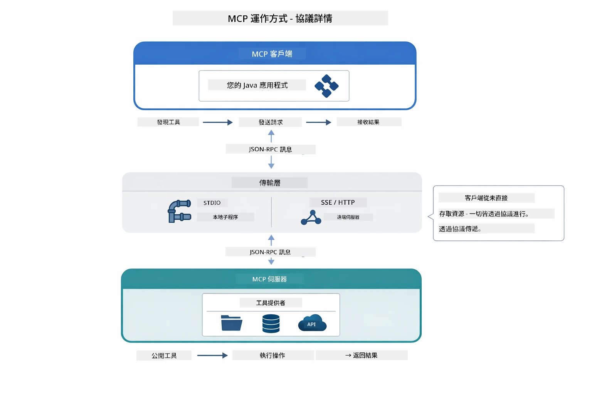

*MCP 底層原理——用戶端發現工具，交換 JSON-RPC 訊息，透過傳輸層執行操作。*

**伺服器-客戶端架構**

MCP 採用客戶端-伺服器模型。伺服器提供工具——讀取檔案、查詢資料庫、呼叫 API。用戶端（你的 AI 應用）連接伺服器並使用其工具。

要在 LangChain4j 中使用 MCP，新增此 Maven 相依套件：

```xml
<dependency>
    <groupId>dev.langchain4j</groupId>
    <artifactId>langchain4j-mcp</artifactId>
    <version>${langchain4j.version}</version>
</dependency>
```

**工具發現**

當用戶端連線到 MCP 伺服器時，會詢問「你有哪些工具？」伺服器會回傳包含說明及參數結構的可用工具清單。你的 AI 代理人就能根據用戶請求決定要使用哪些工具。下圖示範此握手過程——用戶端送出 `tools/list` 請求，伺服器回傳可用工具及其描述和參數結構：

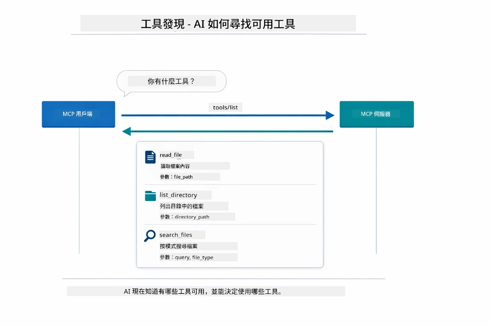

*AI 在啟動時發現可用工具——現在它知道有什麼功能並可決定使用哪些。*

**傳輸機制**

MCP 支援不同傳輸機制。兩種選項為 Stdio（用於本地子程序通信）和可串流 HTTP（用於遠端伺服器）。本模組示範 Stdio 傳輸：


*MCP 傳輸機制：遠端伺服器用 HTTP，本地程序用 Stdio*

**Stdio** - [StdioTransportDemo.java](../../../05-mcp/src/main/java/com/example/langchain4j/mcp/StdioTransportDemo.java)

用於本地程序。你的應用程式以子程序啟動一個伺服器，並透過標準輸入/輸出與之通信。適合檔案系統存取或命令列工具。

```java
McpTransport stdioTransport = new StdioMcpTransport.Builder()
    .command(List.of(
        npmCmd, "exec",
        "@modelcontextprotocol/server-filesystem@2025.12.18",
        resourcesDir
    ))
    .logEvents(false)
    .build();
```

`@modelcontextprotocol/server-filesystem` 伺服器暴露以下工具，且全部限定於你指定的目錄 sandbox 裡：

| 工具 | 描述 |
|------|-------------|
| `read_file` | 讀取單一檔案內容 |
| `read_multiple_files` | 一次讀取多個檔案 |
| `write_file` | 建立或覆寫檔案 |
| `edit_file` | 進行定向的查找與取代編輯 |
| `list_directory` | 列出路徑下的檔案與目錄 |
| `search_files` | 遞迴搜尋符合模式的檔案 |
| `get_file_info` | 取得檔案元資料（大小、時間戳、權限） |
| `create_directory` | 建立目錄（包含父目錄） |
| `move_file` | 移動或重新命名檔案或目錄 |

下圖顯示 Stdio 傳輸在執行時的運作方式——你的 Java 應用程式會以子程序啟動 MCP 伺服器，並透過 stdin/stdout 管道通信，不涉及網路或 HTTP：

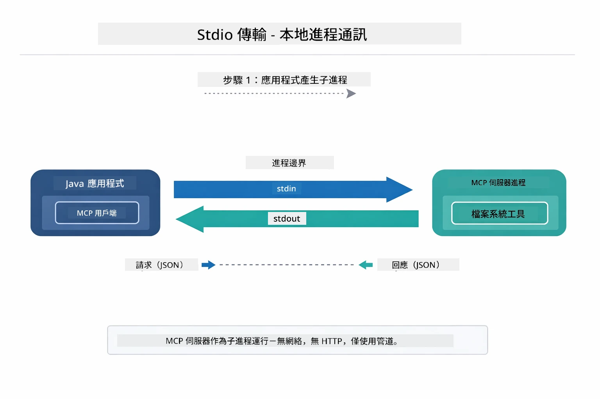

*Stdio 傳輸實作——應用啟動 MCP 伺服器子程序，並透過 stdin/stdout 管道通訊。*

> **🤖 使用 [GitHub Copilot](https://github.com/features/copilot) 聊天嘗試：** 開啟 [`StdioTransportDemo.java`](../../../05-mcp/src/main/java/com/example/langchain4j/mcp/StdioTransportDemo.java) 並詢問：
> - "Stdio 傳輸如何運作，何時該使用它而非 HTTP？"
> - "LangChain4j 如何管理啟動 MCP 伺服器進程的生命週期？"
> - "讓 AI 存取檔案系統的安全性考量為何？"

## Agentic 模組

儘管 MCP 提供了標準化工具，LangChain4j 的 **agentic 模組** 則提供了一種聲明式的方式來建構能協調這些工具的代理人。`@Agent` 註解與 `AgenticServices` 讓你透過介面定義代理行為，而非命令式程式碼。

在本模組中，你將探索 **監督代理人** 模式——一種進階的 agentic AI 方法，監督代理人根據用戶請求動態決定要調用哪些子代理人。我們會結合兩個概念，讓其中一個子代理具備 MCP 驅動的檔案存取能力。

要使用 agentic 模組，新增此 Maven 相依：

```xml
<dependency>
    <groupId>dev.langchain4j</groupId>
    <artifactId>langchain4j-agentic</artifactId>
    <version>${langchain4j.mcp.version}</version>
</dependency>
```
> **注意：** `langchain4j-agentic` 模組使用獨立版本屬性（`langchain4j.mcp.version`），因為它的釋出時間與 LangChain4j 核心庫不同。

> **⚠️ 實驗性功能：** `langchain4j-agentic` 模組為 **實驗性**，可能會有更動。建立 AI 助手的穩定方式仍是使用含自訂工具的 `langchain4j-core`（模組 04）。

## 執行範例程式

### 先決條件

- 已完成 [模組 04 - 工具](../04-tools/README.md)（本模組建立在自訂工具概念上，並與 MCP 工具做比較）
- 根目錄有包含 Azure 認證的 `.env` 檔（由模組 01 中的 `azd up` 所建立）
- Java 21+、Maven 3.9+
- Node.js 16+ 與 npm（用於 MCP 伺服器）

> **注意：** 如果尚未設定環境變數，請參考 [模組 01 - 介紹](../01-introduction/README.md) 中的部署指令說明（`azd up` 會自動建立 `.env`），或將 `.env.example` 複製成根目錄的 `.env` 並填寫你的內容。

## 快速入門

**使用 VS Code：** 只要在檔案總管中右鍵點選任一示範檔案，選擇 **「執行 Java」**，或使用執行與除錯面板中的啟動設定（確保先設定 `.env` 檔含 Azure 認證）。

**使用 Maven：** 也可以在命令列執行以下示範指令。

### 檔案操作（Stdio）

示範本地子程序為基礎的工具。

**✅ 無需額外先決條件** — MCP 伺服器會自動啟動。

**使用啟動腳本（推薦）：**

啟動腳本會自動從根目錄 `.env` 檔載入環境變數：

**Bash：**
```bash
cd 05-mcp
chmod +x start-stdio.sh
./start-stdio.sh
```

**PowerShell：**
```powershell
cd 05-mcp
.\start-stdio.ps1
```

**使用 VS Code：** 在 `StdioTransportDemo.java` 上點右鍵，選擇 **「執行 Java」**（請確認 `.env` 檔已配置）。

應用程式會自動啟動檔案系統 MCP 伺服器並讀取本機檔案。注意子程序管理均由系統處理。

**預期輸出：**
```
Assistant response: The file provides an overview of LangChain4j, an open-source Java library
for integrating Large Language Models (LLMs) into Java applications...
```

### 監督代理人

**監督代理人模式** 是 agentic AI 中的 **彈性** 形式。監督者使用大型語言模型（LLM）自主決定根據用戶請求調用哪些代理人。在下一個範例中，我們結合 MCP 驅動的檔案存取與 LLM 代理，建立一個監控的檔案讀取 → 報告產出工作流程。

示範中，`FileAgent` 使用 MCP 檔案系統工具讀取檔案，而 `ReportAgent` 生成結構化報告，包括一段執行摘要（1 句話）、3 個重點與建議。監督者自動協調此流程：

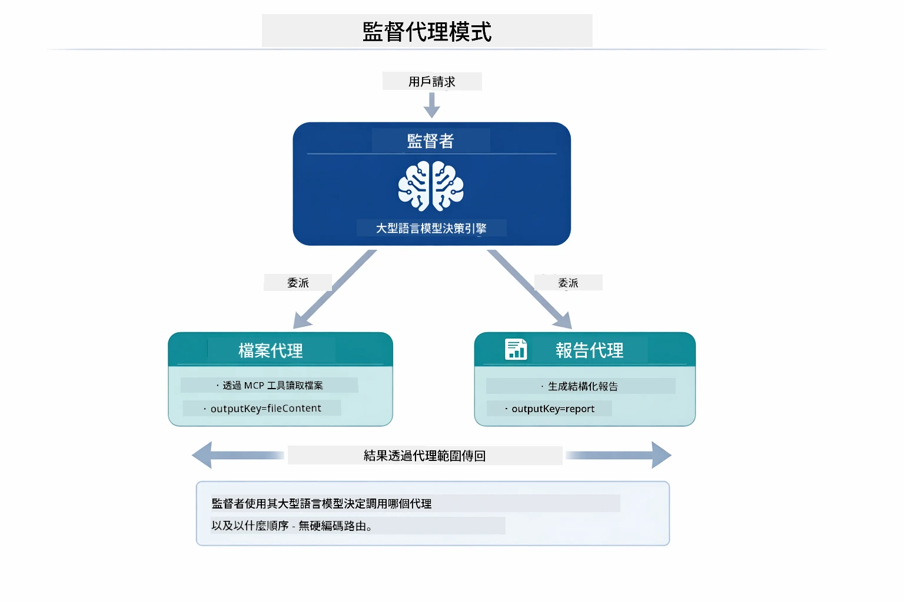

*監督者利用 LLM 決定應調用哪些代理人及順序——無需硬編碼路由邏輯。*

具體的檔案報告工作流程如下圖：

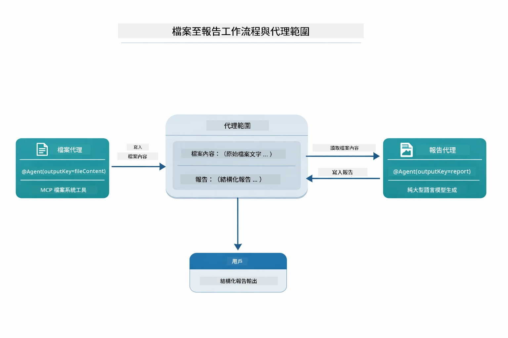

*FileAgent 透過 MCP 工具讀取檔案，然後 ReportAgent 將原始內容轉換為結構化報告。*

以下序列圖描繪完整的監督者協調過程——從啟動 MCP 伺服器、監督者自主選擇代理人，到透過 stdio 呼叫工具及最終報告產生：

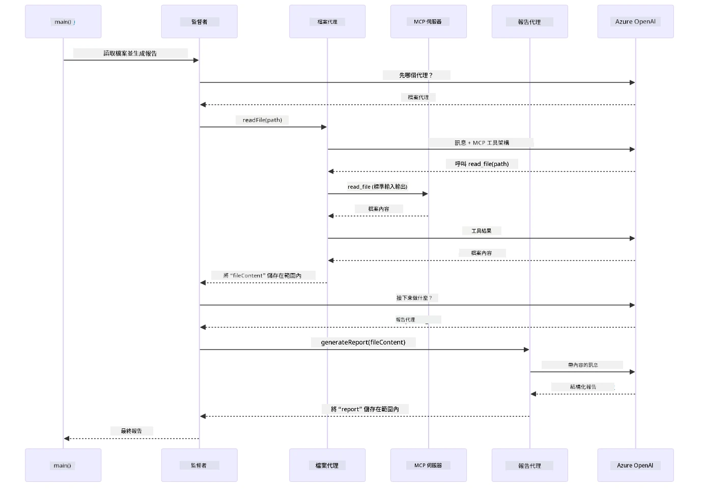

*監督者自主調用 FileAgent（透過 stdio 呼叫 MCP 伺服器讀檔），接著調用 ReportAgent 產生結構化報告——每個代理人將輸出存至共用的 Agentic 範圍。*

每個代理人將輸出存放在 **Agentic 範圍**（共用記憶體），讓後續代理人可存取先前結果。這展示 MCP 工具如何無縫整合至 agentic 工作流程——監督者不需知道 *如何* 讀檔，只需知道 `FileAgent` 有此能力。

#### 執行示範

啟動腳本會自動從根目錄 `.env` 載入環境變數：

**Bash：**
```bash
cd 05-mcp
chmod +x start-supervisor.sh
./start-supervisor.sh
```

**PowerShell：**
```powershell
cd 05-mcp
.\start-supervisor.ps1
```

**使用 VS Code：** 在 `SupervisorAgentDemo.java` 上點右鍵，選擇 **「執行 Java」**（請確認 `.env` 檔已配置）。

#### 監督代理如何運作

在建立代理人前，你需要將 MCP 傳輸層連接至用戶端，並將其包裝為 `ToolProvider`。這是 MCP 伺服器工具成為可用資源的方式：

```java
// 從傳輸創建一個 MCP 客戶端
McpClient mcpClient = new DefaultMcpClient.Builder()
        .transport(stdioTransport)
        .build();

// 將客戶端包裝為 ToolProvider — 這將 MCP 工具橋接到 LangChain4j
ToolProvider mcpToolProvider = McpToolProvider.builder()
        .mcpClients(List.of(mcpClient))
        .build();
```

接著你就可以將 `mcpToolProvider` 注入任何需要 MCP 工具的代理人：

```java
// 第一步：FileAgent 使用 MCP 工具讀取文件
FileAgent fileAgent = AgenticServices.agentBuilder(FileAgent.class)
        .chatModel(model)
        .toolProvider(mcpToolProvider)  // 擁有用於文件操作的 MCP 工具
        .build();

// 第二步：ReportAgent 生成結構化報告
ReportAgent reportAgent = AgenticServices.agentBuilder(ReportAgent.class)
        .chatModel(model)
        .build();

// 主管負責協調文件 → 報告的工作流程
SupervisorAgent supervisor = AgenticServices.supervisorBuilder()
        .chatModel(model)
        .subAgents(fileAgent, reportAgent)
        .responseStrategy(SupervisorResponseStrategy.LAST)  // 返回最終報告
        .build();

// 主管根據請求決定調用哪個代理人
String response = supervisor.invoke("Read the file at /path/file.txt and generate a report");
```

#### FileAgent 如何在執行時發現 MCP 工具

你可能會好奇：**`FileAgent` 如何知道怎麼使用 npm 檔案系統工具？**答案是它不知道——是 **LLM** 透過工具結構說明在執行時推理出來的。
`FileAgent` 介面只是 一個 **prompt 定義**。它沒有硬編碼 `read_file`、`list_directory` 或任何其他 MCP 工具的知識。以下是整個流程的說明：

1. **伺服器啟動：** `StdioMcpTransport` 啟動 `@modelcontextprotocol/server-filesystem` npm 套件作為子程序
2. **工具發現：** `McpClient` 發送 `tools/list` JSON-RPC 請求到伺服器，伺服器回覆工具名稱、描述和參數架構（例如 `read_file` — *"讀取檔案的完整內容"* — `{ path: string }`）
3. **架構注入：** `McpToolProvider` 包裝這些發現的架構並讓它們可供 LangChain4j 使用
4. **LLM 決策：** 當呼叫 `FileAgent.readFile(path)` 時，LangChain4j 會將系統訊息、使用者訊息、**以及工具架構列表** 發送給 LLM。LLM 閱讀工具描述並產生工具呼叫（例如 `read_file(path="/some/file.txt")`）
5. **執行：** LangChain4j 攔截工具呼叫，經由 MCP 用戶端路由回 Node.js 子程序，取得結果並回傳給 LLM

這就是上述描述的相同 [工具發現](../../../05-mcp) 機制，不過是專門應用在 agent 工作流程。`@SystemMessage` 和 `@UserMessage` 註解引導 LLM 的行為，而注入的 `ToolProvider` 則賦予它 **能力** — LLM 在執行時將兩者橋接起來。

> **🤖 可試用 [GitHub Copilot](https://github.com/features/copilot) Chat：** 開啟 [`FileAgent.java`](../../../05-mcp/src/main/java/com/example/langchain4j/mcp/agents/FileAgent.java) 並問：
> - "這個 agent 怎麼知道要呼叫哪個 MCP 工具？"
> - "如果我從 agent 建構器移除 ToolProvider 會發生什麼事？"
> - "工具架構如何傳給 LLM？"

#### 回應策略

當您配置 `SupervisorAgent` 時，需指定在子 agent 完成任務後，它應如何形成對用戶的最終回答。下圖展示了三種可用策略 — LAST 直接回傳最後一個 agent 的輸出，SUMMARY 使用 LLM 綜合所有輸出，SCORED 則選擇對原始請求評分較高的結果：

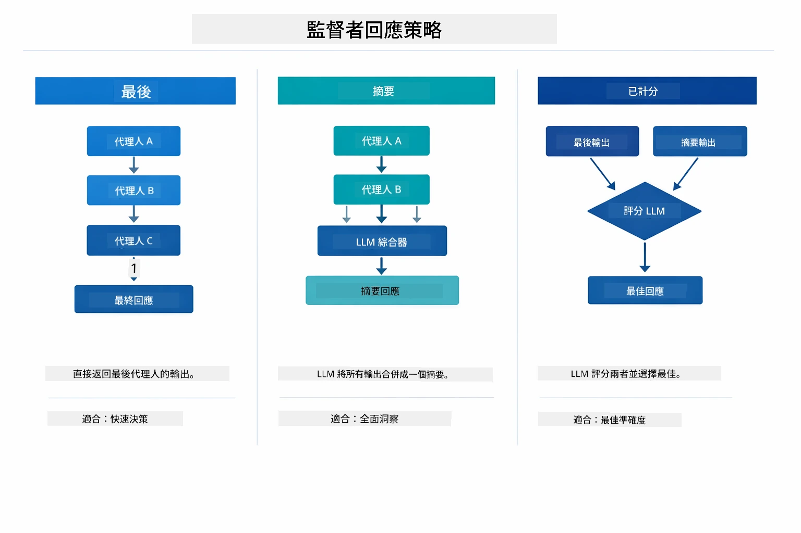

*三種 Supervisor 形成最終回應的策略 — 可依是否想要最後 agent 輸出、綜合摘要，或最佳得分結果選擇。*

可用策略說明：

| 策略 | 描述 |
|----------|-------------|
| **LAST** | 監督者返回最後一個子 agent 或工具的輸出。適合在工作流程末端專門設計產生完整最終答案的 agent（例如研究流程中的「摘要 Agent」）。 |
| **SUMMARY** | 監督者使用自己的內部大型語言模型 (LLM) 綜合整個互動和所有子 agent 的輸出，然後回傳該摘要作為最終回答。提供乾淨且整合的答案。 |
| **SCORED** | 系統使用內部 LLM 對 LAST 回應和整體 SUMMARY 根據用戶原始請求進行評分，返回得分較高的結果。 |

完整實作見 [SupervisorAgentDemo.java](../../../05-mcp/src/main/java/com/example/langchain4j/mcp/SupervisorAgentDemo.java)。

> **🤖 可試用 [GitHub Copilot](https://github.com/features/copilot) Chat：** 打開 [`SupervisorAgentDemo.java`](../../../05-mcp/src/main/java/com/example/langchain4j/mcp/SupervisorAgentDemo.java) 並問：
> - "Supervisor 怎麼決定要呼叫哪些 agents？"
> - "Supervisor 和 Sequential 工作流程模式有什麼不同？"
> - "我怎麼自訂 Supervisor 的規劃行為？"

#### 理解輸出

執行示範時，您會看到 Supervisor 如何協調多個 agents 的結構化流程。以下是各部分的意義：

```
======================================================================
  FILE → REPORT WORKFLOW DEMO
======================================================================

This demo shows a clear 2-step workflow: read a file, then generate a report.
The Supervisor orchestrates the agents automatically based on the request.
```
  
**標題**介紹了工作流程概念：由讀檔到報告生成的專注流程。

```
--- WORKFLOW ---------------------------------------------------------
  ┌─────────────┐      ┌──────────────┐
  │  FileAgent  │ ───▶ │ ReportAgent  │
  │ (MCP tools) │      │  (pure LLM)  │
  └─────────────┘      └──────────────┘
   outputKey:           outputKey:
   'fileContent'        'report'

--- AVAILABLE AGENTS -------------------------------------------------
  [FILE]   FileAgent   - Reads files via MCP → stores in 'fileContent'
  [REPORT] ReportAgent - Generates structured report → stores in 'report'
```
  
**工作流程圖**展示 agents 之間的資料流動。每個 agent 有特定任務：
- **FileAgent** 利用 MCP 工具讀取檔案並將原始內容儲存在 `fileContent`
- **ReportAgent** 使用該內容並產生結構化報告於 `report`

```
--- USER REQUEST -----------------------------------------------------
  "Read the file at .../file.txt and generate a report on its contents"
```
  
**用戶請求**顯示任務內容。Supervisor 解析後決定依序呼叫 FileAgent → ReportAgent。

```
--- SUPERVISOR ORCHESTRATION -----------------------------------------
  The Supervisor decides which agents to invoke and passes data between them...

  +-- STEP 1: Supervisor chose -> FileAgent (reading file via MCP)
  |
  |   Input: .../file.txt
  |
  |   Result: LangChain4j is an open-source, provider-agnostic Java framework for building LLM...
  +-- [OK] FileAgent (reading file via MCP) completed

  +-- STEP 2: Supervisor chose -> ReportAgent (generating structured report)
  |
  |   Input: LangChain4j is an open-source, provider-agnostic Java framew...
  |
  |   Result: Executive Summary...
  +-- [OK] ReportAgent (generating structured report) completed
```
  
**Supervisor 協調**顯示兩步驟流程：
1. **FileAgent** 透過 MCP 讀檔並儲存內容
2. **ReportAgent** 接收內容並生成結構化報告

Supervisor 根據使用者請求 **自動化** 做出這些決定。

```
--- FINAL RESPONSE ---------------------------------------------------
Executive Summary
...

Key Points
...

Recommendations
...

--- AGENTIC SCOPE (Data Flow) ----------------------------------------
  Each agent stores its output for downstream agents to consume:
  * fileContent: LangChain4j is an open-source, provider-agnostic Java framework...
  * report: Executive Summary...
```
  
#### Agentic 模組功能說明

範例展示了 agentic 模組的進階功能。我們來仔細看看 Agentic Scope 和 Agent 監聽器。

**Agentic Scope** 展示共享記憶體機制，agents 用 `@Agent(outputKey="...")` 儲存結果。這讓：
- 後續 agents 取得先前 agents 的輸出
- Supervisor 綜合形成最終回應
- 您檢視每個 agent 的輸出

下圖展示 Agentic Scope 如何在讀檔到報告流程中作為共享記憶體 — FileAgent 以 `fileContent` 為鍵寫出，ReportAgent 讀取該鍵並寫入 `report`：

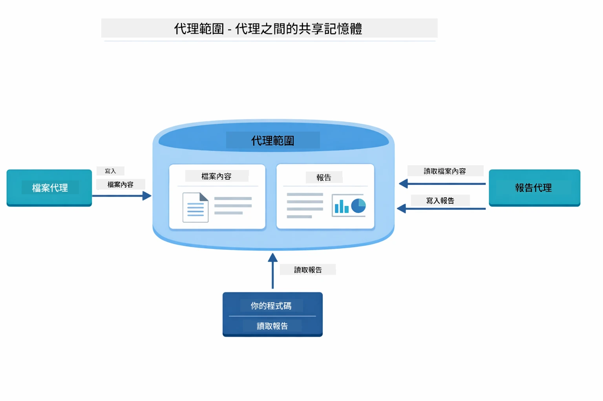

*Agentic Scope 作為共享記憶體 — FileAgent 寫 `fileContent`，ReportAgent 讀取並寫 `report`，您的程式讀取最終結果。*

```java
ResultWithAgenticScope<String> result = supervisor.invokeWithAgenticScope(request);
AgenticScope scope = result.agenticScope();
String fileContent = scope.readState("fileContent");  // 來自 FileAgent 的原始檔案資料
String report = scope.readState("report");            // 來自 ReportAgent 的結構化報告
```
  
**Agent 監聽器** 讓您監控及偵錯 agent 執行。示範中的逐步輸出來自監聽器，監控每個 agent 呼叫：
- **beforeAgentInvocation** - 在 Supervisor 選擇 agent 時呼叫，可見選擇哪個 agent 及原因
- **afterAgentInvocation** - agent 完成後呼叫，顯示結果
- **inheritedBySubagents** - 設為 true 則監聽整個代理層級的所有 agents

下圖展示完整 Agent 監聽器生命週期，包括 `onError` 如何處理執行錯誤：

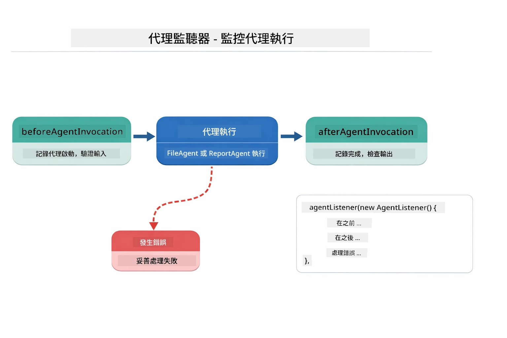

*Agent 監聽器掛接執行生命週期 — 監控 agents 啟動、完成或錯誤時刻。*

```java
AgentListener monitor = new AgentListener() {
    private int step = 0;
    
    @Override
    public void beforeAgentInvocation(AgentRequest request) {
        step++;
        System.out.println("  +-- STEP " + step + ": " + request.agentName());
    }
    
    @Override
    public void afterAgentInvocation(AgentResponse response) {
        System.out.println("  +-- [OK] " + response.agentName() + " completed");
    }
    
    @Override
    public boolean inheritedBySubagents() {
        return true; // 傳播到所有子代理
    }
};
```
  
除了 Supervisor 模式，`langchain4j-agentic` 模組還包含多種強大工作流程模式。下圖展示了五種模式 — 從簡單順序管線到人機監督批准工作流程：

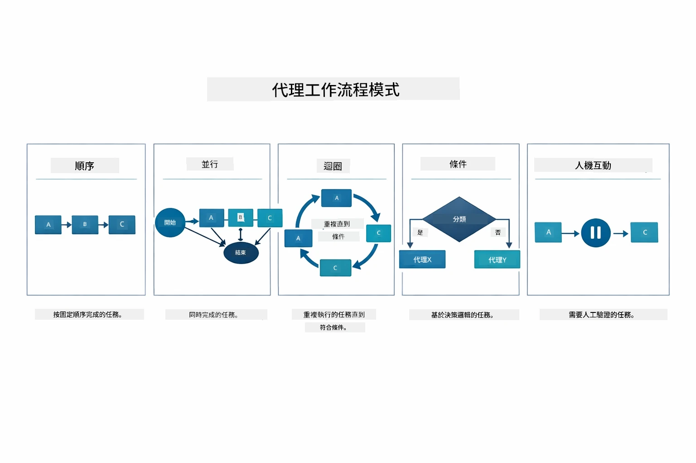

*五種協調 agents 的工作流程模式 — 從簡單順序管線到人機監督批准工作流程。*

| 模式 | 描述 | 使用案例 |
|---------|-------------|----------|
| **Sequential** | 按序執行 agents，輸出接續下一個 | 管線：研究 → 分析 → 報告 |
| **Parallel** | 同時並行執行 agents | 獨立任務：天氣 + 新聞 + 股票 |
| **Loop** | 反覆執行直到條件達成 | 品質評分：精煉直到分數 ≥ 0.8 |
| **Conditional** | 根據條件導向路由 | 分類 → 導向專家 agent |
| **Human-in-the-Loop** | 增加人工檢核點 | 批准工作流程、內容審核 |

## 關鍵概念

現在您已探索 MCP 及 agentic 模組運行方式，讓我們總結何時使用每種方法。

MCP 最大優勢之一是其日益擴展的生態系統。下圖展示單一通用協議如何連接您的 AI 應用與各種 MCP 伺服器 — 從檔案系統、資料庫存取到 GitHub、電子郵件、網頁爬蟲等：

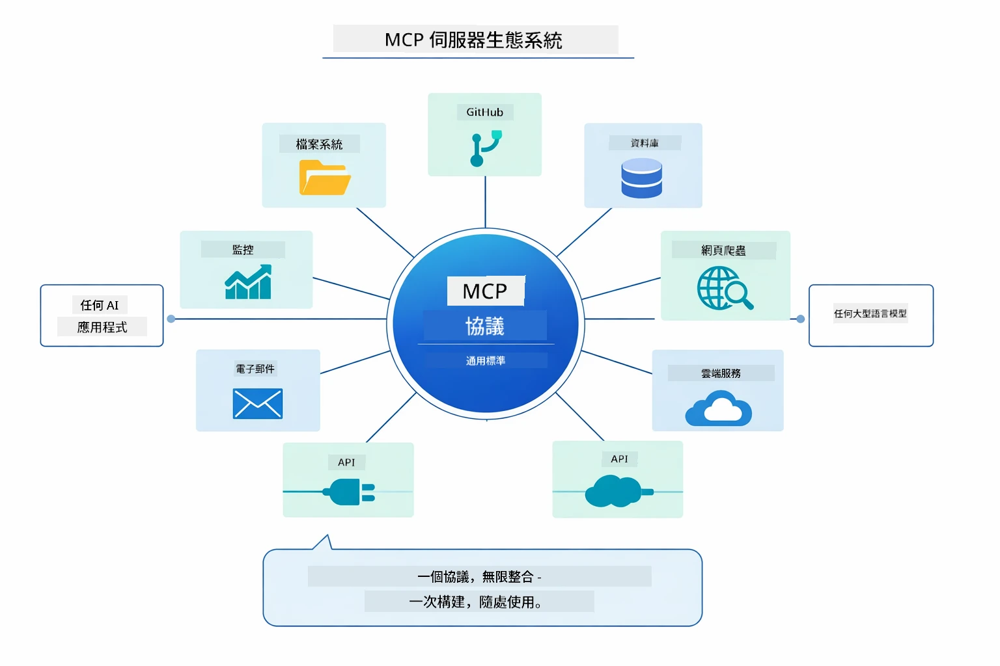

*MCP 建立通用協議生態系統 — 任何 MCP 兼容伺服器皆能與 MCP 兼容用戶端配合，促進應用間工具共享。*

**MCP** 適合您想利用現有工具生態系統、打造多應用共享工具、整合標準協議的第三方服務，或想在不改變程式碼的情況下替換工具實作時使用。

**Agentic 模組** 適合您想用宣告式 `@Agent` 註解定義代理、需要工作流程協調（順序、迴圈、平行）、偏好介面型 agent 設計而非命令式程式碼，或多 agent 分享輸出 (outputKey) 配合運作。

**Supervisor Agent 模式** 適合工作流程不可預期且想讓 LLM 決策、多個專精 agent 需動態協調、構建對話系統路由不同能力，或需要最靈活適應行為之情境。

為幫助您在 Module 04 的自訂 `@Tool` 方法與本模組 MCP 工具間抉擇，以下對比了主要取捨 — 自訂工具給您緊密耦合與完整型別安全以符合應用邏輯，MCP 工具則提供標準化、可重複使用整合：

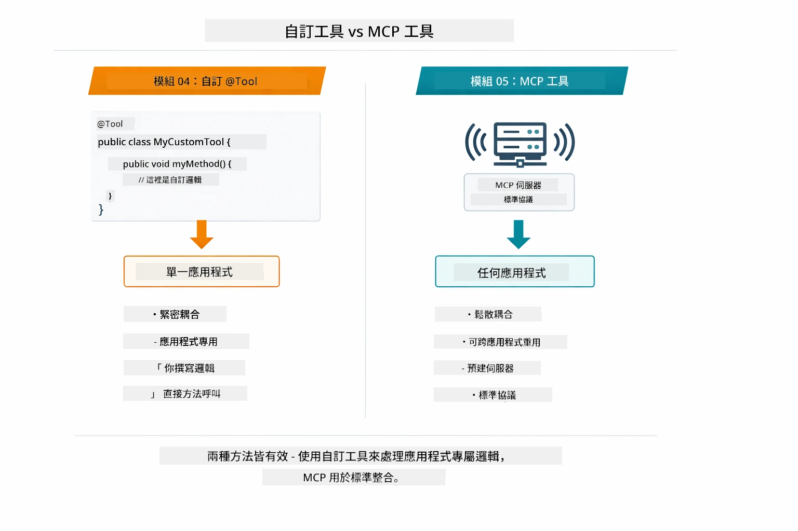

*何時用自訂 @Tool 方法 vs MCP 工具 — 自訂工具提供完整型別安全的應用專屬邏輯，MCP 工具則是跨應用的標準化整合。*

## 恭喜！

您已完成 LangChain4j 初學者課程全五單元！以下是您完整的學習旅程 — 從基礎聊天到 MCP 強化的 agentic 系統：

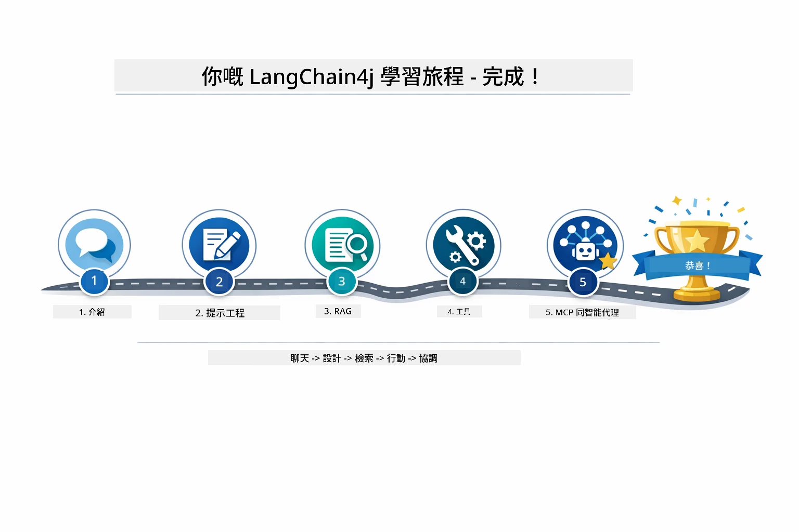

*您從基礎聊天到 MCP 強化 agentic 系統的完整學習歷程。*

您已學會：

- 如何打造具記憶功能的對話 AI（Module 01）
- 不同任務之提示工程範式（Module 02）
- 用 RAG 技術基於文件產生根據回應（Module 03）
- 使用自訂工具建立基本 AI agents（助手）（Module 04）
- 以 LangChain4j MCP 與 Agentic 模組整合標準化工具（Module 05）

### 接下來做什麼？

完成課程後，探索 [Testing Guide](../docs/TESTING.md) 以觀察 LangChain4j 測試概念實作。

**官方資源：**  
- [LangChain4j 文件](https://docs.langchain4j.dev/) - 詳盡指南與 API 參考  
- [LangChain4j GitHub](https://github.com/langchain4j/langchain4j) - 原始碼與範例  
- [LangChain4j 教學](https://docs.langchain4j.dev/tutorials/) - 各種使用案例逐步教學  

感謝您完成本課程！

---

**導覽：** [← 上一章：Module 04 - Tools](../04-tools/README.md) | [回到首頁](../README.md)

---

<!-- CO-OP TRANSLATOR DISCLAIMER START -->
**免責聲明**：
本文件係使用人工智能翻譯服務 [Co-op Translator](https://github.com/Azure/co-op-translator) 翻譯所得。雖然我們致力確保翻譯之準確性，但請注意，自動翻譯可能包含錯誤或不準確之處。文件之原文版本應被視為具權威性的來源。對於重要資訊，建議尋求專業人工翻譯。我們不對因使用本翻譯而引致之任何誤解或曲解承擔責任。
<!-- CO-OP TRANSLATOR DISCLAIMER END -->