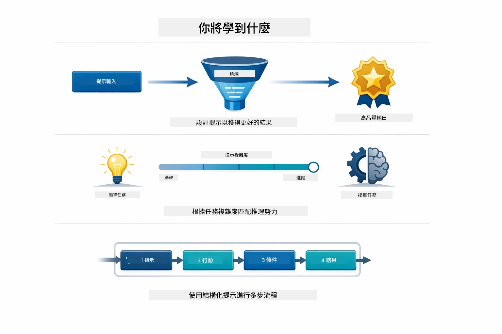
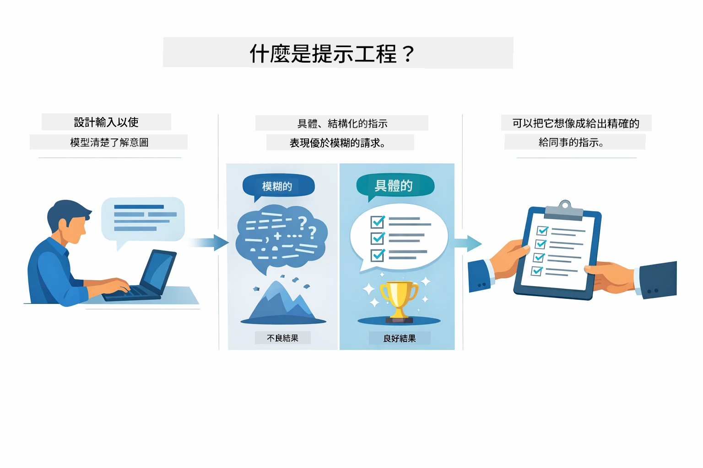
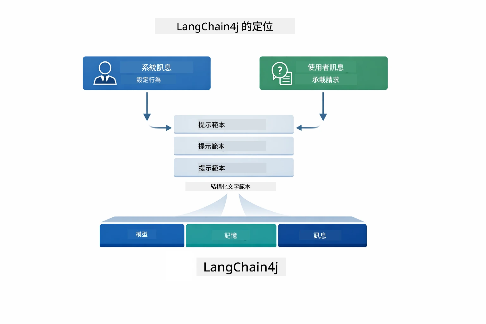
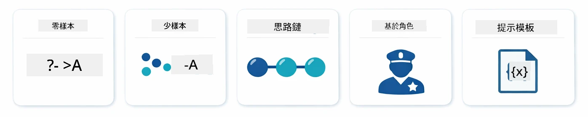
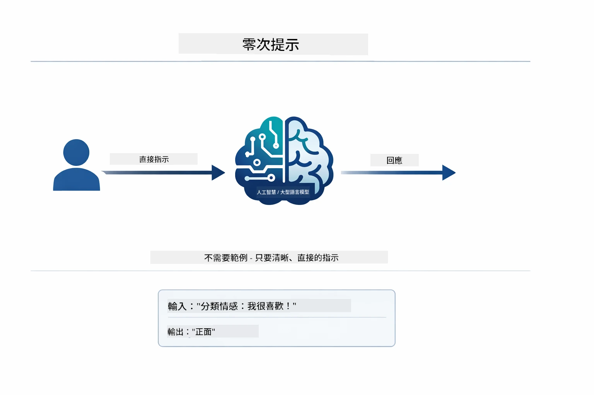
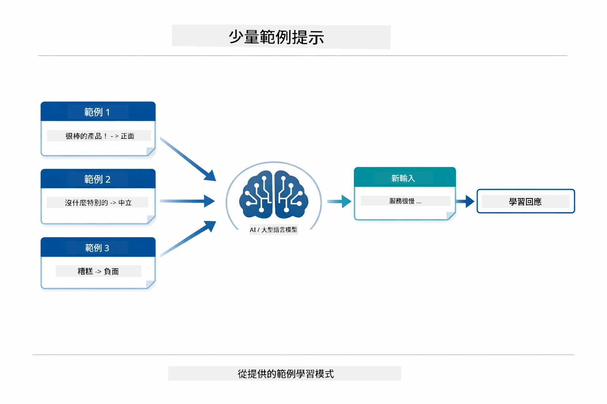
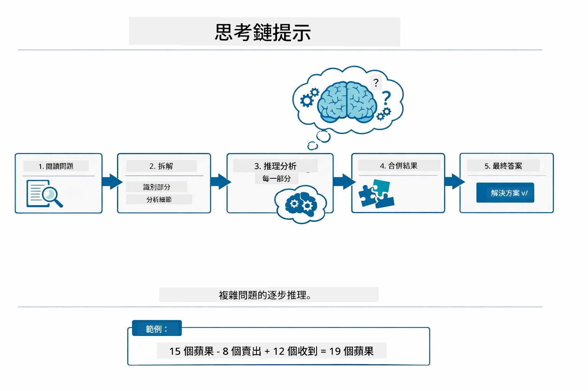
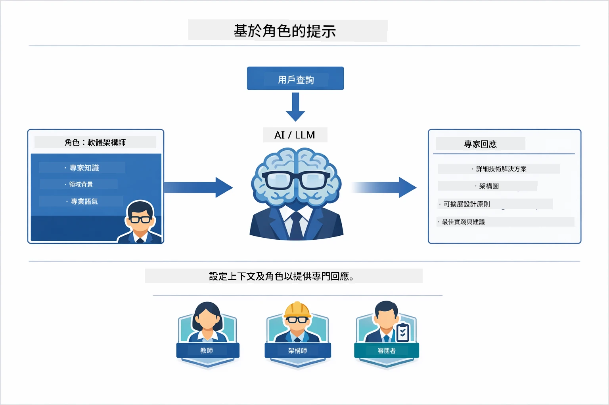
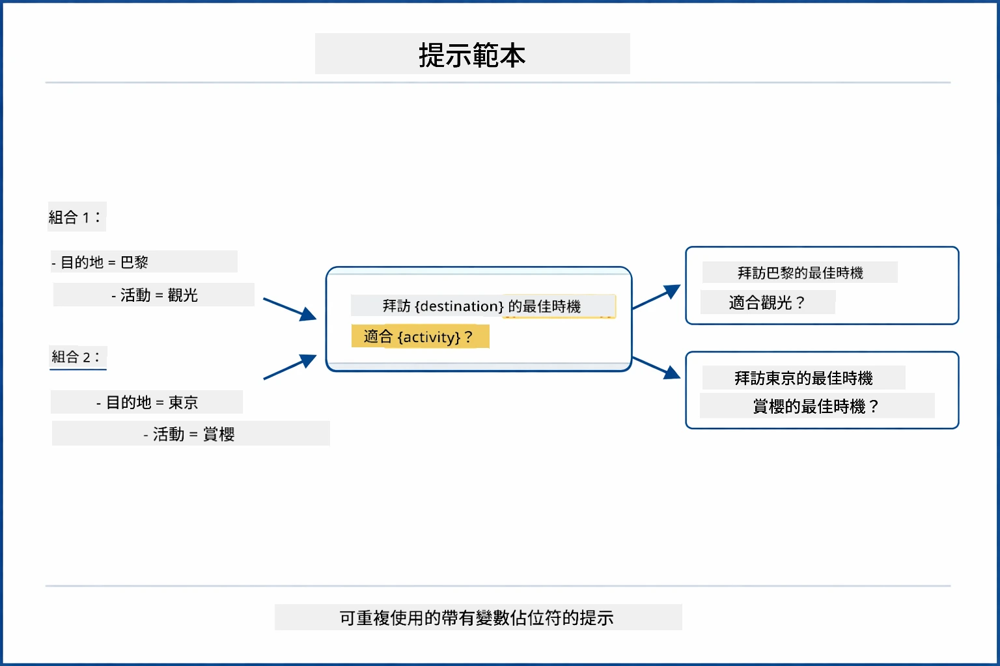
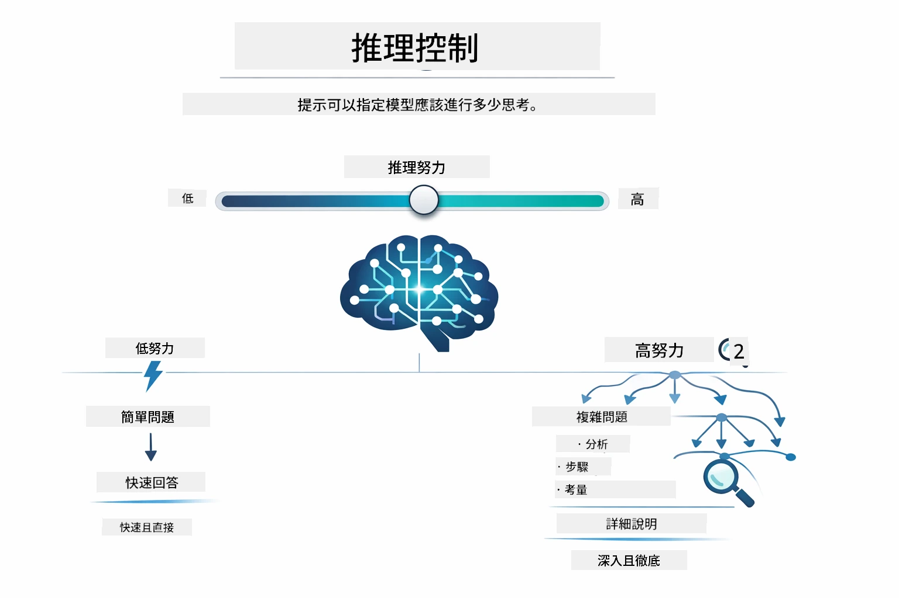

# Module 02: 使用 GPT-5.2 進行提示工程

## 目錄

- [你將學到什麼](../../../02-prompt-engineering)
- [先決條件](../../../02-prompt-engineering)
- [理解提示工程](../../../02-prompt-engineering)
- [提示工程基礎](../../../02-prompt-engineering)
  - [零範例提示](../../../02-prompt-engineering)
  - [少量範例提示](../../../02-prompt-engineering)
  - [思維鏈](../../../02-prompt-engineering)
  - [基於角色的提示](../../../02-prompt-engineering)
  - [提示模板](../../../02-prompt-engineering)
- [進階模式](../../../02-prompt-engineering)
- [使用現有 Azure 資源](../../../02-prompt-engineering)
- [應用程式截圖](../../../02-prompt-engineering)
- [探索模式](../../../02-prompt-engineering)
  - [低與高積極性](../../../02-prompt-engineering)
  - [任務執行（工具前言）](../../../02-prompt-engineering)
  - [自我反思程式碼](../../../02-prompt-engineering)
  - [結構化分析](../../../02-prompt-engineering)
  - [多輪對話](../../../02-prompt-engineering)
  - [逐步推理](../../../02-prompt-engineering)
  - [受限輸出](../../../02-prompt-engineering)
- [你真正學到的是什麼](../../../02-prompt-engineering)
- [下一步](../../../02-prompt-engineering)

## 你將學到什麼



在上一個模組中，你了解了記憶如何促進會話式 AI，並使用 GitHub Models 進行基本互動。現在我們將聚焦在如何提問 — 提示本身 — 使用 Azure OpenAI 的 GPT-5.2。你結構提示的方式對回覆品質有極大影響。我們將從基本提示技巧回顧開始，然後進入利用 GPT-5.2 強大功能的八個進階模式。

我們使用 GPT-5.2，因為它引入了推理控制——你可以告訴模型在回答前要思考多少。這讓不同的提示策略更明顯，幫助你了解何時使用各種方法。相比於 GitHub Models，我們也能受益於 Azure 對 GPT-5.2 較少的速率限制。

## 先決條件

- 完成模組 01（已部署 Azure OpenAI 資源）
- 根目錄下存在 `.env` 檔案，內含 Azure 憑證（由模組 01 中的 `azd up` 自動建立）

> **注意：** 若尚未完成模組 01，請先依照那裡的部署說明操作。

## 理解提示工程



提示工程是設計輸入文本，使你穩定地獲得所需結果。不只是提問——而是結構化請求，讓模型確切理解你想要什麼以及如何提供。

把它想像成給同事下指令。「修正錯誤」很模糊。「修正 UserService.java 第 45 行的空指標異常，透過加入空值檢查」則明確具體。語言模型也是一樣——具體並且有結構很重要。



LangChain4j 提供基礎設施——模型連接、記憶以及訊息類型——而提示模式就是通過該基礎設施傳送的精心結構文本。關鍵元件為 `SystemMessage`（設定 AI 行為與角色）和 `UserMessage`（傳達你的實際請求）。

## 提示工程基礎



在深入本模組的進階模式前，我們先回顧五種基礎提示技巧。這些是每位提示工程師都該了解的基石。如果你已經學過[快速入門模組](../00-quick-start/README.md#2-prompt-patterns)，應該見識過這些技巧的實作——以下是背後的概念架構。

### 零範例提示

最簡單的方式：直接給模型指令，無提供範例。模型完全依據訓練理解並執行任務。適用於預期行為明確的直接請求。



*直接指令，無範例——模型從指令自身推斷任務*

```java
String prompt = "Classify this sentiment: 'I absolutely loved the movie!'";
String response = model.chat(prompt);
// 回應: "正面"
```

**適用情境：** 簡單分類、直接問答、翻譯，或任何不需額外指導且模型能處理的任務。

### 少量範例提示

提供範例展示你希望模型遵循的模式。模型從範例中學習期望的輸入輸出格式，並套用於新輸入。這大幅提升格式或行為要求不明顯任務的一致性。



*從範例學習——模型辨識模式並套用至新輸入*

```java
String prompt = """
    Classify the sentiment as positive, negative, or neutral.
    
    Examples:
    Text: "This product exceeded my expectations!" → Positive
    Text: "It's okay, nothing special." → Neutral
    Text: "Waste of money, very disappointed." → Negative
    
    Now classify this:
    Text: "Best purchase I've made all year!"
    """;
String response = model.chat(prompt);
```

**適用情境：** 客製分類、一致格式化、領域專用任務，或零範例結果不穩定時。

### 思維鏈

讓模型逐步展示推理過程。不是直接跳到答案，而是拆解問題，一步步具體推導。對數學、邏輯與多步推理任務提升精準度。



*逐步推理——將複雜問題拆解為明確邏輯步驟*

```java
String prompt = """
    Problem: A store has 15 apples. They sell 8 apples and then 
    receive a shipment of 12 more apples. How many apples do they have now?
    
    Let's solve this step-by-step:
    """;
String response = model.chat(prompt);
// 模型顯示：15 - 8 = 7，然後 7 + 12 = 19 顆蘋果
```

**適用情境：** 數學問題、邏輯謎題、除錯，或任何透過展示推理過程能提升精確度與信任度的任務。

### 基於角色的提示

在提問前設定 AI 的角色或身份。藉此調整回應的語氣、深度與重點。「軟體架構師」會給出與「初級開發者」或「安全審核員」不同的建議。



*設定上下文與角色——相同問題，依角色分配獲得不同回答*

```java
String prompt = """
    You are an experienced software architect reviewing code.
    Provide a brief code review for this function:
    
    def calculate_total(items):
        total = 0
        for item in items:
            total = total + item['price']
        return total
    """;
String response = model.chat(prompt);
```

**適用情境：** 程式碼審查、輔導教學、領域分析，或需要依專業等級與視角定制回答時。

### 提示模板

建立含變數佔位符的可重複使用提示。不是每次都重寫提示，而是定義一次模板，填入不同數值。LangChain4j 的 `PromptTemplate` 類透過 `{{variable}}` 語法讓這件事更簡單。



*含變數佔位符的可重用提示——一個模板多種用法*

```java
PromptTemplate template = PromptTemplate.from(
    "What's the best time to visit {{destination}} for {{activity}}?"
);

Prompt prompt = template.apply(Map.of(
    "destination", "Paris",
    "activity", "sightseeing"
));

String response = model.chat(prompt.text());
```

**適用情境：** 多次查詢不同輸入、批次處理、建立可重用 AI 工作流程，或任何提示結構不變但資料會變的場合。

---

這五個基礎提供多數提示任務良好工具集。本模組接下來將在此基礎上，介紹**八種進階模式**，利用 GPT-5.2 的推理控制、自我評估及結構化輸出能力。

## 進階模式

基礎講解完畢，我們進入本模組獨特的八個進階模式。並非所有問題都適用同一策略。有些問題需要快速回覆，有些需要深入思考。有些需可見推理，有些只要結果即可。以下每種模式針對不同場景最佳化，而 GPT-5.2 推理控制讓差異更加明顯。


*八種提示工程模式概覽及其用途*



*GPT-5.2 推理控制，指定模型應思考多少—從快速直接回答到深入探究*


*低積極性（快速、直接）與高積極性（細緻、探索性）推理方式對照*

**低積極性（快速且聚焦）** — 適用於需要快速直接答案的簡單問題。模型推理步驟最少，最多兩步。適合計算、查詢或簡易問答。

```java
String prompt = """
    <reasoning_effort>low</reasoning_effort>
    <instruction>maximum 2 reasoning steps</instruction>
    
    What is 15% of 200?
    """;

String response = chatModel.chat(prompt);
```

> 💡 **使用 GitHub Copilot 探索：** 開啟 [`Gpt5PromptService.java`](../../../02-prompt-engineering/src/main/java/com/example/langchain4j/prompts/service/Gpt5PromptService.java) 並詢問：
> - 「低積極性與高積極性提示模式有何差異？」
> - 「提示中的 XML 標籤如何幫助結構 AI 回答？」
> - 「何時該使用自我反思模式，何時使用直接指令？」

**高積極性（深度且全面）** — 適用於需要全面分析的複雜問題。模型會詳細探究並展示推理過程。適合系統設計、架構決策或複雜研究。

```java
String prompt = """
    <reasoning_effort>high</reasoning_effort>
    <instruction>explore thoroughly, show detailed reasoning</instruction>
    
    Design a caching strategy for a high-traffic REST API.
    """;

String response = chatModel.chat(prompt);
```

**任務執行（逐步進行）** — 適用於多步工作流程。模型先計畫，執行過程中描述每步，最後彙總。適用於遷移、實作等多步驟流程。

```java
String prompt = """
    <task>Create a REST endpoint for user registration</task>
    <preamble>Provide an upfront plan</preamble>
    <narration>Narrate each step as you work</narration>
    <summary>Summarize what was accomplished</summary>
    """;

String response = chatModel.chat(prompt);
```

思維鏈提示明確要求模型展示推理過程，提升複雜任務的精準度。逐步拆解有助於人與 AI 理解邏輯。

> **🤖 用 [GitHub Copilot](https://github.com/features/copilot) Chat 嘗試：** 詢問該模式：
> - 「如何調整任務執行模式以支援長時間運行？」
> - 「生產環境中如何結構工具前言是最佳實踐？」
> - 「如何在 UI 中擷取並顯示中途進度更新？」


*計畫 → 執行 → 總結，多步任務工作流程*

**自我反思程式碼** — 用於生成生產品質程式碼。模型先生成程式碼，再依品質標準檢查並進行迭代改進。適合開發新功能或服務時使用。

```java
String prompt = """
    <task>Create an email validation service</task>
    <quality_criteria>
    - Correct logic and error handling
    - Best practices (clean code, proper naming)
    - Performance optimization
    - Security considerations
    </quality_criteria>
    <instruction>Generate code, evaluate against criteria, improve iteratively</instruction>
    """;

String response = chatModel.chat(prompt);
```


*迭代改進循環—生成、評估、識別問題、改進、重複*

**結構化分析** — 用於一致性評估。模型使用固定框架審查程式碼（正確性、實踐、效能、安全性）。適合程式碼審查或品質評估。

```java
String prompt = """
    <code>
    public List getUsers() {
        return database.query("SELECT * FROM users");
    }
    </code>
    
    <framework>
    Evaluate using these categories:
    1. Correctness - Logic and functionality
    2. Best Practices - Code quality
    3. Performance - Efficiency concerns
    4. Security - Vulnerabilities
    </framework>
    """;

String response = chatModel.chat(prompt);
```

> **🤖 用 [GitHub Copilot](https://github.com/features/copilot) Chat 嘗試結構化分析：**
> - 「如何為不同程式碼審查類型自訂分析框架？」
> - 「如何以程式方式解析並處理結構化輸出？」
> - 「如何確保不同審查會話間嚴重程度一致？」


*四類別框架，包含嚴重性等級，確保程式碼審查一致性*

**多輪對話** — 對話需保有上下文。模型記住先前訊息，並在此基礎持續互動。適用於互動式支援或複雜問答。

```java
ChatMemory memory = MessageWindowChatMemory.withMaxMessages(10);

memory.add(UserMessage.from("What is Spring Boot?"));
AiMessage aiMessage1 = chatModel.chat(memory.messages()).aiMessage();
memory.add(aiMessage1);

memory.add(UserMessage.from("Show me an example"));
AiMessage aiMessage2 = chatModel.chat(memory.messages()).aiMessage();
memory.add(aiMessage2);
```


*對話上下文隨多輪累積，直到達到令牌限制*

**逐步推理** — 適用需可見邏輯的問題。模型為每一步展示明確推理。適合數學問題、邏輯謎題，或需要理解思考過程時使用。

```java
String prompt = """
    <instruction>Show your reasoning step-by-step</instruction>
    
    If a train travels 120 km in 2 hours, then stops for 30 minutes,
    then travels another 90 km in 1.5 hours, what is the average speed
    for the entire journey including the stop?
    """;

String response = chatModel.chat(prompt);
```


*將問題拆解為明確邏輯步驟*

**受限輸出** — 回答需遵守特定格式要求。模型嚴格遵從格式與長度規則。適用於摘要或需精確輸出結構的場合。

```java
String prompt = """
    <constraints>
    - Exactly 100 words
    - Bullet point format
    - Technical terms only
    </constraints>
    
    Summarize the key concepts of machine learning.
    """;

String response = chatModel.chat(prompt);
```


*嚴格執行指定格式、長度與結構要求*

## 使用現有 Azure 資源

**驗證部署狀態：**

確認根目錄存在 `.env` 檔案，且包含 Azure 憑證（於模組 01 部署期間建立）：
```bash
cat ../.env  # 應該顯示 AZURE_OPENAI_ENDPOINT、API_KEY、DEPLOYMENT
```

**啟動應用程式：**

> **注意：** 若你已使用模組 01 中的 `./start-all.sh` 啟動所有應用程式，本模組已在埠號 8083 上運行。你可以跳過以下啟動指令，直接前往 http://localhost:8083 。

**方案一：使用 Spring Boot Dashboard（建議 VS Code 用戶）**

開發容器已整合 Spring Boot Dashboard 擴充功能，提供視覺介面管理所有 Spring Boot 應用程式。可在 VS Code 左側的活動列找到（尋找 Spring Boot 圖示）。
從 Spring Boot 儀表板，您可以：
- 查看工作區中所有可用的 Spring Boot 應用程式
- 一鍵啟動/停止應用程式
- 即時查看應用程式日誌
- 監控應用程式狀態

只需點擊「prompt-engineering」旁的播放按鈕即可啟動此模組，或一次啟動所有模組。


**選項 2：使用 shell 腳本**

啟動所有網頁應用程式（模組 01-04）：

**Bash:**
```bash
cd ..  # 從根目錄開始
./start-all.sh
```

**PowerShell:**
```powershell
cd ..  # 從根目錄
.\start-all.ps1
```

或者只啟動此模組：

**Bash:**
```bash
cd 02-prompt-engineering
./start.sh
```

**PowerShell:**
```powershell
cd 02-prompt-engineering
.\start.ps1
```

這兩個腳本會自動從根目錄的 `.env` 檔載入環境變數，如 JAR 檔不存在則會建置。

> **注意：** 如果您希望在啟動前手動建置所有模組：
>
> **Bash:**
> ```bash
> cd ..  # Go to root directory
> mvn clean package -DskipTests
> ```
>
> **PowerShell:**
> ```powershell
> cd ..  # Go to root directory
> mvn clean package -DskipTests
> ```

在瀏覽器開啟 http://localhost:8083 。

**停止方式：**

**Bash:**
```bash
./stop.sh  # 僅此模組
# 或
cd .. && ./stop-all.sh  # 所有模組
```

**PowerShell:**
```powershell
.\stop.ps1  # 僅此模組
# 或
cd ..; .\stop-all.ps1  # 所有模組
```

## 應用程式截圖


*主儀表板，顯示全部 8 種提示工程範例及其特性和使用案例*

## 探索範例

網頁介面讓您嘗試不同的提示策略。每種範例解決不同問題——試試看，了解每種方法在何時最適用。

### 低 vs 高 積極度

用低積極度的方式問個簡單問題：「200 的 15% 是多少？」會立刻得到直接答案。現在用高積極度問複雜問題：「為高流量 API 設計一個快取策略」。觀察模型變慢，並提供詳細推理。同一模型、相同問題結構——提示決定它要做多少思考。


*快速計算，推理最小化*


*詳細快取策略 (2.8MB)*

### 任務執行（工具前言）

多步驟流程受益於事先計畫與進度說明。模型會先列出要做什麼，邊做邊說明，再總結結果。


*逐步說明建立 REST 端點 (3.9MB)*

### 自我反思程式碼

試試「建立一個電子郵件驗證服務」。模型不只是生成程式碼然後停下，而是生成、依照品質標準評估、找出弱點並改進。您會看到它持續迭代直到程式碼符合生產標準。


*完整電子郵件驗證服務 (5.2MB)*

### 結構化分析

程式碼審查需要一致的評估框架。模型使用固定分類（正確性、慣例、效能、安全）進行分析，並按照嚴重程度分類。


*基於框架的程式碼審查*

### 多輪對話

問「什麼是 Spring Boot？」接著馬上追問「給我一個範例」。模型記得您第一個問題並給出專門的 Spring Boot 範例。若沒有記憶，第二個問題會太模糊。


*跨問題保持上下文*

### 逐步推理

選個數學題，分別用「逐步推理」和「低積極度」嘗試。低積極度直接給答案——快速但無法掌握過程。逐步推理會示範所有計算與決策。


*明確步驟的數學題*

### 限制輸出

當您需要特定格式或字數時，該範例嚴格控制。試著產生一份正好 100 字且用點列格式的摘要。


*受控格式的機器學習摘要*

## 您真正學到的是什麼

**推理努力決定一切**

GPT-5.2 讓您透過提示控制計算努力。低努力意味著快速回應、最小探索。高努力代表模型花時間深度思考。您正在學習根據任務複雜度匹配努力——簡單問題別浪費時間，複雜決策也別太急。

**結構引導行為**

注意提示中的 XML 標籤嗎？它們非裝飾用。模型比自由文字更可靠地遵循結構化指令。需要多步驟或複雜邏輯時，結構有助模型追蹤現在做什麼、接下來要做什麼。


*明確分區且 XML 風格組織的良好提示結構*

**透過自我評估確保品質**

自我反思範例會明確品質標準。不是指望模型「做對」，而是指出「對」是什麼：正確邏輯、錯誤處理、效能、資安。模型可自行評估並改進輸出。這讓程式碼生成從賭博變成流程。

**上下文有限**

多輪會話靠每次請求帶進訊息記錄。但有上限——每個模型最大代幣數。隨著對話增加，您需策略保持相關上下文又不超限。這模組教您記憶運作；之後學會何時摘要、何時遺忘、何時取回。

## 下一步

**下一模組：** [03-rag - RAG (增強檢索生成)](../03-rag/README.md)

---

**導覽：** [← 上一個：模組 01 - 介紹](../01-introduction/README.md) | [返回主頁](../README.md) | [下一個：模組 03 - RAG →](../03-rag/README.md)

---

<!-- CO-OP TRANSLATOR DISCLAIMER START -->
**免責聲明**：  
本文件係使用 AI 翻譯服務 [Co-op Translator](https://github.com/Azure/co-op-translator) 進行翻譯。雖然我們致力於確保翻譯的準確性，但請注意自動翻譯可能存在錯誤或不準確之處。文件之原文版本應視為權威資料來源。對於重要資訊，建議使用專業人類翻譯。我們不對因使用本翻譯而產生的任何誤解或誤釋承擔責任。
<!-- CO-OP TRANSLATOR DISCLAIMER END -->