# Module 03: RAG (檢索增強生成)

## 目錄

- [影片導覽](../../../03-rag)
- [您將學習到的內容](../../../03-rag)
- [先決條件](../../../03-rag)
- [了解 RAG](../../../03-rag)
  - [本教學使用哪種 RAG 方法？](../../../03-rag)
- [運作方式](../../../03-rag)
  - [文件處理](../../../03-rag)
  - [建立嵌入向量](../../../03-rag)
  - [語意搜尋](../../../03-rag)
  - [答案生成](../../../03-rag)
- [執行應用程式](../../../03-rag)
- [使用應用程式](../../../03-rag)
  - [上傳文件](../../../03-rag)
  - [提問](../../../03-rag)
  - [查看來源參考](../../../03-rag)
  - [實驗問題](../../../03-rag)
- [關鍵概念](../../../03-rag)
  - [分塊策略](../../../03-rag)
  - [相似度分數](../../../03-rag)
  - [記憶體儲存](../../../03-rag)
  - [上下文視窗管理](../../../03-rag)
- [何時使用 RAG](../../../03-rag)
- [後續步驟](../../../03-rag)

## 影片導覽

觀看此現場說明會，介紹如何開始使用本模組：[RAG with LangChain4j - Live Session](https://www.youtube.com/watch?v=_olq75ZH_eY)

## 您將學習到的內容

在先前的模組中，您已學會如何與 AI 進行對話並有效架構您的提示。但有一個根本限制：語言模型只知道它訓練時學到的知識。它無法回答有關貴公司政策、專案文件或任何未接受訓練的資訊的問題。

RAG（檢索增強生成）解決了這個問題。它不是嘗試教模型您的資訊（這既昂貴又不切實際），而是賦予它搜尋您文件的能力。當有人提出問題時，系統會找到相關資訊並放入提示中。模型便基於檢索到的上下文給出答案。

把 RAG 想成是給模型提供一本參考圖書館。當您提出問題時，系統：

1. **使用者查詢** — 您提出問題
2. **嵌入向量** — 將問題轉換為向量
3. **向量搜尋** — 找到相似的文件區塊
4. **上下文組合** — 將相關區塊加入提示
5. **回應** — LLM 根據上下文生成答案

這讓模型的回答紮根於您的實際資料，而非仰賴訓練知識或憑空捏造答案。

## 先決條件

- 已完成 [Module 00 - 快速開始](../00-quick-start/README.md)（用於上述簡易 RAG 範例）
- 已完成 [Module 01 - 介紹](../01-introduction/README.md)（Azure OpenAI 資源部署完成，包括 `text-embedding-3-small` 嵌入模型）
- 根目錄中有 `.env` 檔案，包含 Azure 認證（由 Module 01 中的 `azd up` 命令建立）

> **注意：** 如果尚未完成 Module 01，請先依照其中的部署指示進行。`azd up` 命令會部署 GPT 聊天模型及本模組使用的嵌入模型。

## 了解 RAG

下圖說明核心概念：RAG 不是只依賴模型的訓練數據，而是賦予它一個可查閱的文件參考庫，在生成答案前先參考文件。

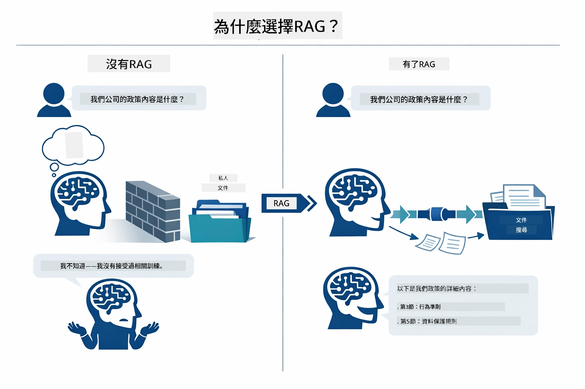

*此圖展示了標準 LLM（僅從訓練數據猜測）與 RAG 增強 LLM（先查閱文件）的差異。*

以下顯示整體流程如何串連。使用者問題通過四個階段—嵌入、向量搜尋、上下文組合和答案生成—每階段建構於前一階段基礎：


*此圖展示端到端 RAG 流程，使用者查詢經過嵌入、向量搜尋、上下文組合及答案生成。*

本模組餘下部分將詳細說明各階段，並附上可執行與修改的程式碼。

### 本教學使用哪種 RAG 方法？

LangChain4j 提供三種實作 RAG 方法，抽象層級各不相同。下圖並排比較三者：

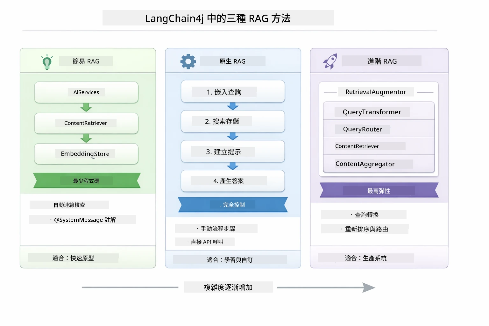

*此圖比較 LangChain4j 的 Easy、Native 與 Advanced 三種 RAG 方法，顯示其關鍵元件及適用時機。*

| 方法 | 功能說明 | 權衡取捨 |
|---|---|---|
| **Easy RAG** | 透過 `AiServices` 和 `ContentRetriever` 自動連接所有流程。您只需註解介面並附加檢索器，LangChain4j 背後會處理嵌入、搜尋和提示組合。 | 程式碼極簡，但無法查看每步操作細節。 |
| **Native RAG** | 您自己呼叫嵌入模型、搜尋資料庫、組合提示並產生答案—每個步驟皆明確執行。 | 程式碼較多，但每階段皆可見且可修改。 |
| **Advanced RAG** | 使用 `RetrievalAugmentor` 架構，結合插件化查詢轉換器、路由器、重排序器和內容注入器，適合生產級管線。 | 極具彈性，但複雜度大幅提升。 |

**本教學採用 Native 方法。** RAG 流程中每一步—查詢嵌入、向量搜尋、上下文組合及答案生成—均明確寫在 [`RagService.java`](../../../03-rag/src/main/java/com/example/langchain4j/rag/service/RagService.java) 中。這是有意為之，因為作為學習資源，比起程式碼極簡，更重要的是您能看見並了解每個階段。熟悉後，可以切換到 Easy RAG 以快速原型開發，或 Advanced RAG 構建生產系統。

> **💡 已看過 Easy RAG 範例？** [快速開始模組](../00-quick-start/README.md) 中的文件問答範例（[`SimpleReaderDemo.java`](../../../00-quick-start/src/main/java/com/example/langchain4j/quickstart/SimpleReaderDemo.java)）使用的是 Easy RAG 方法 — LangChain4j 自動處理嵌入、搜尋與提示組合。本模組則下一步地拆解該流程，讓您能看到每階段並自行控制。

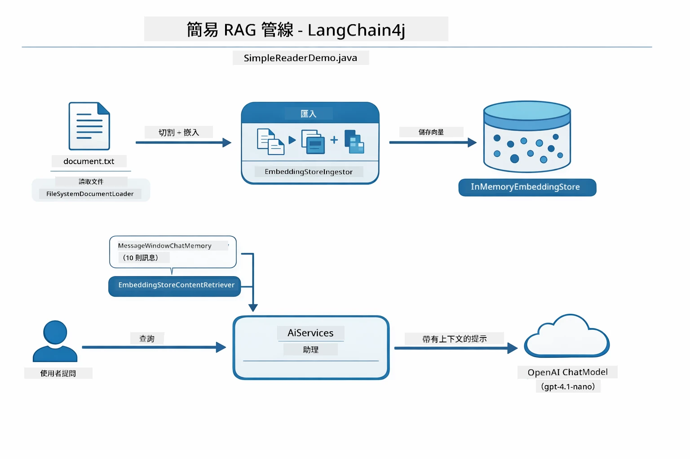

*此圖顯示 `SimpleReaderDemo.java` 中的 Easy RAG 管線。與本模組的 Native 方法相比：Easy RAG 把嵌入、檢索與提示組合隱藏在 `AiServices` 和 `ContentRetriever` 內部 — 您只需載入文件、加上檢索器，便可取得答案。Native 方法則拆開管線，讓您自行呼叫各步驟（嵌入、搜尋、組合上下文、生成），提供完整可視化與控制。*

## 運作方式

本模組的 RAG 管線分成四個連續階段，每次使用者提問時執行。首先，上傳的文件會被**解析及分塊**為容易處理的部分。接著，這些區塊會轉成**向量嵌入**並儲存，方便數學比較。當收到查詢時，系統進行**語意搜尋**以找出最相關的區塊，最後將它們作為上下文傳給 LLM，以完成**答案生成**。以下章節會用實際程式與圖示逐步說明。先來看第一步。

### 文件處理

[DocumentService.java](../../../03-rag/src/main/java/com/example/langchain4j/rag/service/DocumentService.java)

上傳文件後，系統會解析它（PDF 或純文字）、附加檔案名稱等元資料，然後切分成區塊 — 較小片段，能順利放入模型的上下文視窗。這些區塊彼此間略有重疊，避免在分界處遺失上下文。

```java
// 解析上傳的檔案並包裝成 LangChain4j 文件
Document document = Document.from(content, metadata);

// 分割成 300 代幣的區塊，並且有 30 代幣的重疊
DocumentSplitter splitter = DocumentSplitters
    .recursive(300, 30);

List<TextSegment> segments = splitter.split(document);
```

下圖視覺化說明運作方式。請注意每個區塊與左右相鄰部分有部分符號重疊—30 字符的重疊確保不會漏掉重要上下文：

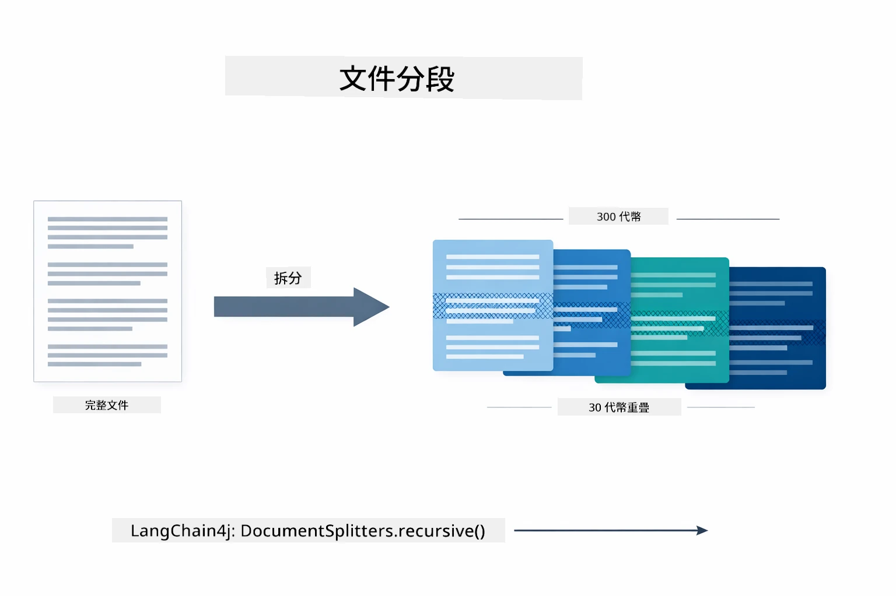

*此圖展示文件被切割為 300 字符區塊，且有 30 字符重疊，保持區塊邊界處上下文。*

> **🤖 嘗試使用 [GitHub Copilot](https://github.com/features/copilot) 聊天:** 開啟 [`DocumentService.java`](../../../03-rag/src/main/java/com/example/langchain4j/rag/service/DocumentService.java) 並試問：
> - 「LangChain4j 是如何將文件分成區塊？為什麼要有重疊？」
> - 「不同類型文件的最佳區塊大小是多少？為什麼？」
> - 「如何處理多語言或特殊格式的文件？」

### 建立嵌入向量

[LangChainRagConfig.java](../../../03-rag/src/main/java/com/example/langchain4j/rag/config/LangChainRagConfig.java)

每個區塊會轉成一種數字表示法，稱為嵌入向量——本質上是將意義轉為數字的轉換器。嵌入模型不像聊天模型那樣「智能」；它無法遵循指示、推理或回答問題。它的功能是將文本映射到數學空間中，相似含義的文字會彼此接近—「car」接近「automobile」，「refund policy」接近「return my money」。您可把聊天模型想成一個可對話的人，而嵌入模型是超強的歸檔系統。

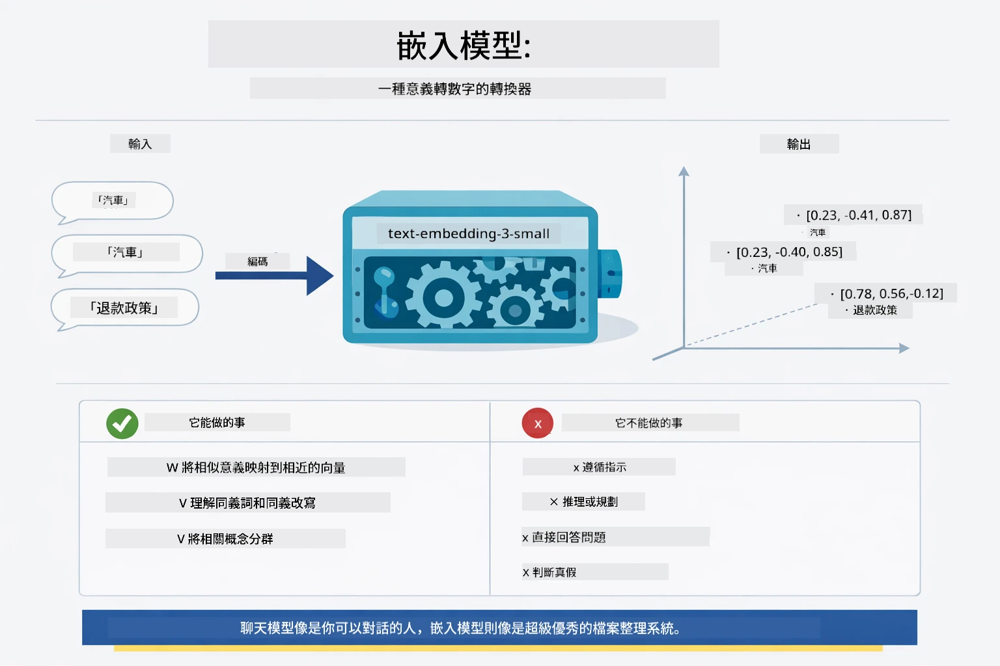

*此圖展示嵌入模型如何將文本轉成數字向量，將相似含義如「car」與「automobile」放在向量空間中靠近的位置。*

```java
@Bean
public EmbeddingModel embeddingModel() {
    return OpenAiOfficialEmbeddingModel.builder()
        .baseUrl(azureOpenAiEndpoint)
        .apiKey(azureOpenAiKey)
        .modelName(azureEmbeddingDeploymentName)
        .build();
}

EmbeddingStore<TextSegment> embeddingStore = 
    new InMemoryEmbeddingStore<>();
```

下方類別圖展示 RAG 管線中兩條獨立的流程，以及 LangChain4j 的相關類別。**攝取流程**（上傳時執行一次）切分文件、嵌入區塊並透過 `.addAll()` 儲存。**查詢流程**（每次提問執行）嵌入問題、透過 `.search()` 搜尋資料庫，並將匹配的上下文傳給聊天模型。兩者共用 `EmbeddingStore<TextSegment>` 介面：

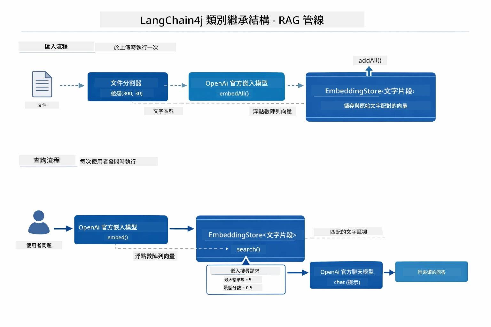

*此圖展示 RAG 管線中攝取與查詢兩條流程，並透過共用的 EmbeddingStore 介面串接。*

一旦嵌入向量存好，相關內容自然會聚集到向量空間中相近位置。下方視覺化圖展示關聯主題的文件會形成群聚，這就是語意搜尋能作動的原因：


*此視覺化展示技術文件、商業規則與常見問題等主題如何在三維向量空間中形成清楚群聚。*

當使用者搜尋時，系統會執行四步驟：文件先嵌入一次、每次搜尋將查詢嵌入、用餘弦相似度比較查詢向量與所有儲存向量，並回傳前 K 個最高分區塊。下圖逐步說明流程及相對應的 LangChain4j 類別：

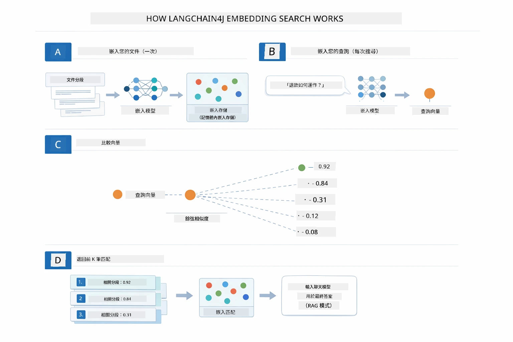

*此圖展示四步嵌入搜尋流程：先嵌入文件，嵌入查詢，使用餘弦相似度比對向量，回傳最高前 K 答案。*

### 語意搜尋

[RagService.java](../../../03-rag/src/main/java/com/example/langchain4j/rag/service/RagService.java)

當您提問時，問題本身也會被轉成嵌入向量。系統會比對您的問題向量與所有文件區塊的向量，找到語意最相近的區塊—不僅是關鍵字匹配，而是真的語意相似。

```java
Embedding queryEmbedding = embeddingModel.embed(question).content();

EmbeddingSearchRequest searchRequest = EmbeddingSearchRequest.builder()
    .queryEmbedding(queryEmbedding)
    .maxResults(5)
    .minScore(0.5)
    .build();

EmbeddingSearchResult<TextSegment> searchResult = embeddingStore.search(searchRequest);
List<EmbeddingMatch<TextSegment>> matches = searchResult.matches();

for (EmbeddingMatch<TextSegment> match : matches) {
    String relevantText = match.embedded().text();
    double score = match.score();
}
```

下圖比較語意搜尋與傳統關鍵字搜尋。一個關鍵字「vehicle」的搜尋會漏掉關於「cars and trucks」的區塊，但語意搜尋理解兩者意思相近，將其視為高分匹配結果：

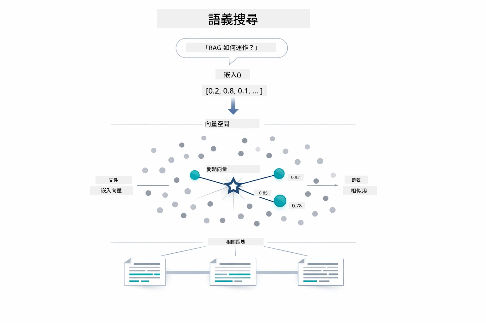

*此圖比較基於關鍵字的搜尋與語意搜尋，顯示語意搜尋如何取回概念相關且關鍵字不同的內容。*

底層的相似度計算使用餘弦相似度—簡言之即是在問「這兩個箭頭是否指向同方向？」兩個區塊即使用完全不同字詞，只要意思相同，向量會指向相同方向，分數接近 1.0：

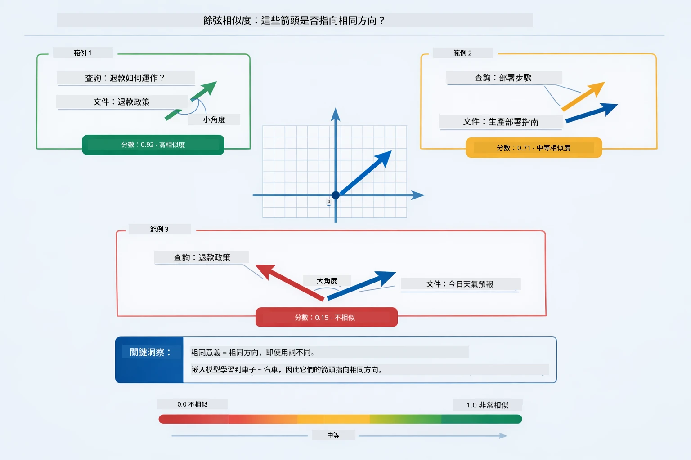

*此圖說明餘弦相似度是嵌入向量間的角度，向量越一致，分數越接近 1.0，表示語意越相近。*
> **🤖 試試看 [GitHub Copilot](https://github.com/features/copilot) Chat：** 開啟 [`RagService.java`](../../../03-rag/src/main/java/com/example/langchain4j/rag/service/RagService.java) 並詢問：
> - “相似度搜尋是如何透過向量嵌入運作的？分數是怎麼決定的？”
> - “我應該使用什麼相似度閾值？這會如何影響結果？”
> - “若找不到相關文件，我該如何處理？”

### 答案生成

[RagService.java](../../../03-rag/src/main/java/com/example/langchain4j/rag/service/RagService.java)

最相關的文本片段會被組裝成一個結構化提示，其中包含明確指示、檢索到的上下文以及使用者的問題。模型會閱讀這些特定的片段，並根據這些資訊回答——它只能使用眼前的內容，避免幻覺。

```java
String context = matches.stream()
    .map(match -> match.embedded().text())
    .collect(Collectors.joining("\n\n"));

String prompt = String.format("""
    Answer the question based on the following context.
    If the answer cannot be found in the context, say so.

    Context:
    %s

    Question: %s

    Answer:""", context, request.question());

String answer = chatModel.chat(prompt);
```

下圖展示了這個組裝過程——來自搜尋步驟的高分片段被注入提示範本，`OpenAiOfficialChatModel` 則生成有依據的答案：

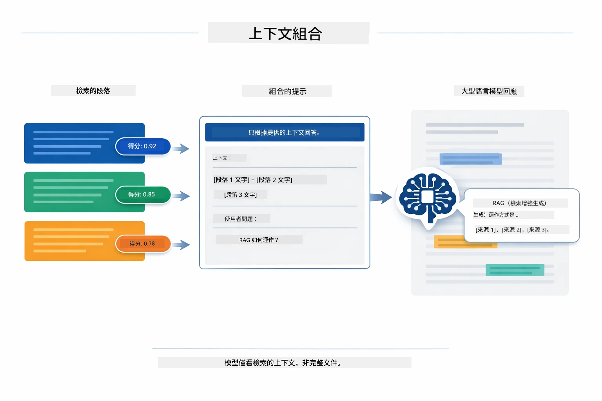

*此圖展示高分片段如何被組裝入結構化提示，讓模型能根據您的資料生成有依據的答案。*

## 執行應用程式

**驗證部署：**

確保根目錄有 `.env` 檔案，並包含 Azure 憑證（在模組 01 期間建立）：

**Bash:**
```bash
cat ../.env  # 應顯示 AZURE_OPENAI_ENDPOINT、API_KEY、DEPLOYMENT
```

**PowerShell:**
```powershell
Get-Content ..\.env  # 應該顯示 AZURE_OPENAI_ENDPOINT、API_KEY、DEPLOYMENT
```

**啟動應用程式：**

> **注意：** 如果您已經在模組 01 使用 `./start-all.sh` 啟動了所有應用程式，本模組已在 8081 埠運行。您可以跳過以下啟動指令，直接前往 http://localhost:8081。

**方案 1：使用 Spring Boot Dashboard（推薦給 VS Code 使用者）**

開發容器已包含 Spring Boot Dashboard 擴充功能，提供視覺化介面管理所有 Spring Boot 應用。您可以在 VS Code 左側的活動欄中找到它（尋找 Spring Boot 圖示）。

透過 Spring Boot Dashboard，您可以：
- 查看工作區內所有可用的 Spring Boot 應用
- 一鍵啟動/停止應用
- 即時查看應用日誌
- 監控應用狀態

點擊 “rag” 旁的播放按鈕即可啟動本模組，或一次啟動所有模組。


*此截圖展示 VS Code 中的 Spring Boot Dashboard，您可以在此視覺化啟動、停止及監控應用。*

**方案 2：使用 shell 腳本**

啟動所有網頁應用（模組 01-04）：

**Bash:**
```bash
cd ..  # 從根目錄開始
./start-all.sh
```

**PowerShell:**
```powershell
cd ..  # 從根目錄開始
.\start-all.ps1
```

或只啟動本模組：

**Bash:**
```bash
cd 03-rag
./start.sh
```

**PowerShell:**
```powershell
cd 03-rag
.\start.ps1
```

這些腳本會自動從根目錄 `.env` 載入環境變數，且若 JAR 檔不存在會自動編譯。

> **注意：** 若您偏好先手動編譯所有模組，再啟動：
>
> **Bash:**
> ```bash
> cd ..  # Go to root directory
> mvn clean package -DskipTests
> ```
>
> **PowerShell:**
> ```powershell
> cd ..  # Go to root directory
> mvn clean package -DskipTests
> ```

在瀏覽器打開 http://localhost:8081 。

**停止應用程式：**

**Bash:**
```bash
./stop.sh  # 僅此模組
# 或
cd .. && ./stop-all.sh  # 全部模組
```

**PowerShell:**
```powershell
.\stop.ps1  # 僅限此模組
# 或者
cd ..; .\stop-all.ps1  # 所有模組
```

## 使用應用程式

此應用程式提供文件上傳與提問的網頁介面。

<a href="images/rag-homepage.png"></a>

*此截圖顯示 RAG 應用程式介面，您可以上傳文件並提出問題。*

### 上傳文件

先上傳一個文件——TXT 檔最適合用來測試。本目錄提供了 `sample-document.txt`，內容包含 LangChain4j 功能、RAG 實作及最佳實踐，適合測試系統功能。

系統會自動處理您上傳的文件，將文件拆成多個片段，並為每個片段建立向量嵌入。

### 提問

現在針對文件內容提具體問題，試著問一些文件中明確指出的事實。系統會搜尋相關片段，將它們納入提示，並產生答案。

### 檢查來源參考

每個答案都會附上來源參考和相似度分數。這些分數介於 0 到 1 之間，顯示各片段與提問的相關程度。分數越高，匹配越好。您可以用它們來驗證答案對應的原始資料。

<a href="images/rag-query-results.png"></a>

*此截圖展示提問結果，包括生成答案、來源參考，以及每個檢索片段的相關分數。*

### 試驗不同問法

試試不同類型的問題：
- 具體事實：「主要主題是什麼？」
- 比較：「X 和 Y 有什麼差異？」
- 摘要：「簡述關於 Z 的重點」

觀察相關分數如何隨著問題與文件內容的匹配度變化。

## 主要概念

### 片段策略

文件會被拆成 300 字元的片段，並重疊 30 字元。此平衡確保片段足夠有上下文意義，同時片段大小適中，可容納多個片段於同一提示中。

### 相似度分數

每個檢索到的片段都會有一個 0 到 1 之間的相似度分數，表示與使用者問題的匹配度。下圖直觀顯示分數範圍與系統如何用它們來過濾結果：

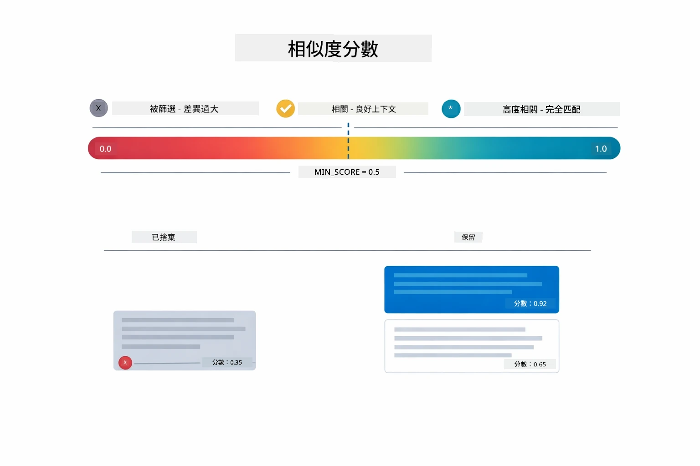

*此圖顯示分數範圍從 0 到 1，最低門檻設定為 0.5，用以過濾不相關的片段。*

分數範圍：
- 0.7-1.0：高度相關，完全匹配
- 0.5-0.7：相關，良好上下文
- 低於 0.5：被過濾，差異過大

系統僅檢索超過最低門檻的片段以確保品質。

向量嵌入在語意分群清晰時表現良好，但仍有盲點。下圖展示常見失敗模式——片段過大導致向量模糊、片段過小缺乏上下文、模糊詞彙指向多個群集，以及像 ID、零件號等的完全匹配查詢根本無法用嵌入處理：

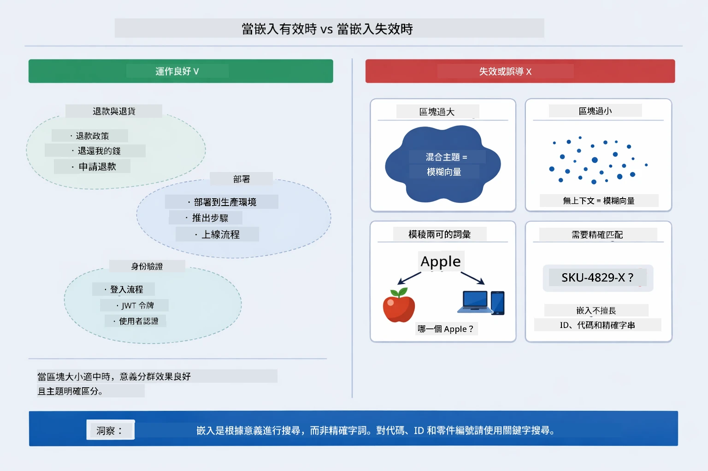

*此圖展示常見的向量嵌入失敗模式：片段過大、片段過小、模糊詞指向多個群集，以及像 ID 等完全匹配查詢。*

### 內存儲存

此模組為簡便起見使用內存儲存。重啟應用程式時，上傳的文件會遺失。生產環境會使用持久性向量資料庫，如 Qdrant 或 Azure AI Search。

### 上下文窗口管理

每種模型都有最大上下文視窗限制。無法包含過多文件片段。系統會檢索最相關的前 N 個片段（預設 5 個），以保持限制內，同時提供足夠上下文產生準確回答。

## RAG 使用時機

RAG 並非總是最佳方案。下圖決策指引協助您判斷何時使用 RAG 可增值，何時簡單方法（直接含內容於提示或依賴模型內建知識）已足夠：

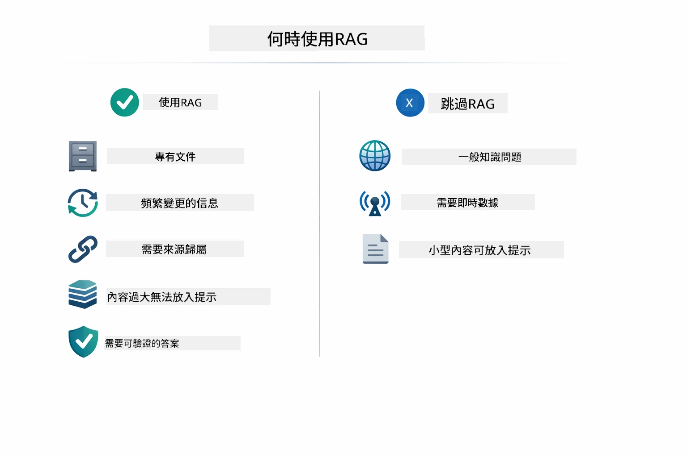

*此圖展示何時 RAG 增值，何時簡單方法足夠的決策指引。*

**適合使用 RAG 時機：**
- 回答專有文件的問題
- 資訊經常變動（政策、價格、規範）
- 需要精確且可追蹤來源的準確回答
- 內容過多無法放入單一提示
- 需要可驗證、有依據的回覆

**不適合使用 RAG 時機：**
- 問題需一般模型已具備的常識
- 需要即時資料（RAG 僅能用於已上傳文件）
- 內容量小，足以直接放提示中

## 下一步

**下一模組：** [04-tools - AI Agents with Tools](../04-tools/README.md)

---

**導覽：** [← 上一篇：模組 02 - 提示工程](../02-prompt-engineering/README.md) | [回主頁](../README.md) | [下一篇：模組 04 - 工具 →](../04-tools/README.md)

---

<!-- CO-OP TRANSLATOR DISCLAIMER START -->
**免責聲明**：  
本文件係使用 AI 翻譯服務 [Co-op Translator](https://github.com/Azure/co-op-translator) 所轉譯。雖然我們努力確保翻譯的準確性，但請注意，自動翻譯可能包含錯誤或不準確之處。原始文件的母語版本應視為權威來源。對於重要資訊，建議採用專業人工翻譯。我們不對因使用本翻譯內容而產生的任何誤解或錯誤詮釋負責。
<!-- CO-OP TRANSLATOR DISCLAIMER END -->