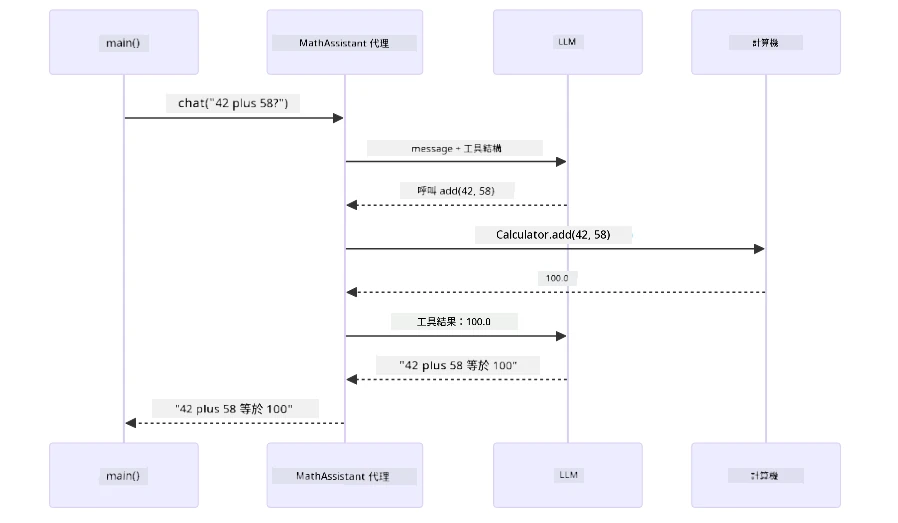
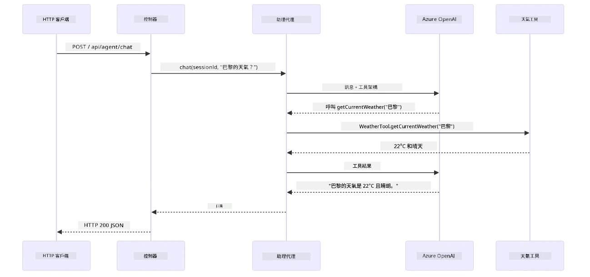

# 模組 04：具備工具的 AI 代理

## 目錄

- [你將學習什麼](../../../04-tools)
- [先決條件](../../../04-tools)
- [理解具備工具的 AI 代理](../../../04-tools)
- [工具呼叫原理](../../../04-tools)
  - [工具定義](../../../04-tools)
  - [決策制定](../../../04-tools)
  - [執行](../../../04-tools)
  - [回應生成](../../../04-tools)
  - [架構：Spring Boot 自動連線](../../../04-tools)
- [工具鏈結](../../../04-tools)
- [執行應用程式](../../../04-tools)
- [使用應用程式](../../../04-tools)
  - [嘗試簡單的工具使用](../../../04-tools)
  - [測試工具鏈結](../../../04-tools)
  - [查看對話流程](../../../04-tools)
  - [實驗不同請求](../../../04-tools)
- [關鍵概念](../../../04-tools)
  - [ReAct 模式（推理與行動）](../../../04-tools)
  - [工具描述很重要](../../../04-tools)
  - [會話管理](../../../04-tools)
  - [錯誤處理](../../../04-tools)
- [可用工具](../../../04-tools)
- [何時使用基於工具的代理](../../../04-tools)
- [工具與 RAG 的比較](../../../04-tools)
- [後續步驟](../../../04-tools)

## 你將學習什麼

到目前為止，你已經學會如何與 AI 對話、有效結構化提示語，並在文件中落實回應的根據。但仍有一個基本限制：語言模型只能生成文字。它們無法查詢天氣、執行計算、查詢資料庫，或與外部系統互動。

工具改變了這一點。透過讓模型能呼叫函式，將其從文字生成器轉變成能執行動作的代理人。模型決定何時需要工具、使用哪個工具以及傳遞什麼參數。你的程式碼執行該函式並回傳結果。模型將該結果整合進回應中。

## 先決條件

- 已完成 [模組 01 - 介紹](../01-introduction/README.md)（Azure OpenAI 資源已部署）
- 建議完成之前的模組（本模組在工具與 RAG 比較中參考了[第 03 模組的 RAG 概念](../03-rag/README.md)）
- 根目錄下有包含 Azure 認證的 `.env` 檔案（由模組 01 中的 `azd up` 建立）

> **注意：** 如果尚未完成模組 01，請先遵照那裡的部署說明進行操作。

## 理解具備工具的 AI 代理

> **📝 注意：** 本模組中所稱的「代理人」指的是加強了工具呼叫能力的 AI 助手。這與我們將在 [模組 05：MCP](../05-mcp/README.md) 中討論的 **Agentic AI** 模式（具備規劃、記憶和多步推理的自主代理）不同。

沒有工具時，語言模型只能基於訓練資料生成文字。問它「現在的天氣如何？」，它只能猜測。給它工具，便能呼叫天氣 API、執行計算或查詢資料庫，然後將這些真實結果編織進回應內。


*沒有工具時模型只能猜測 — 有了工具，它能呼叫 API、執行計算並回傳即時資料。*

具備工具的 AI 代理採用 **推理與行動 (ReAct)** 模式。模型不只是回應，而是思考什麼是它所需、透過呼叫工具行動、觀察結果，然後決定是否繼續行動或給出最終答案：

1. **推理** — 代理分析使用者問題並判斷需要哪些資訊
2. **行動** — 代理選擇適合的工具、生成正確參數並呼叫該工具
3. **觀察** — 代理接收工具輸出並評估結果
4. **重複或回應** — 若需要更多資料，代理重複回圈；否則組成自然語言答案


*ReAct 週期 — 代理思考該做什麼，透過呼叫工具行動，觀察結果並重複回圈，直到能給出最終答案。*

此過程完全自動。你只需定義工具及其描述，模型將負責決定何時及如何使用。

## 工具呼叫原理

### 工具定義

[WeatherTool.java](../../../04-tools/src/main/java/com/example/langchain4j/agents/tools/WeatherTool.java) | [TemperatureTool.java](../../../04-tools/src/main/java/com/example/langchain4j/agents/tools/TemperatureTool.java)

你定義具有清晰描述和參數規範的函式。模型在系統提示中會看到這些描述，了解每個工具的功能。

```java
@Component
public class WeatherTool {
    
    @Tool("Get the current weather for a location")
    public String getCurrentWeather(@P("Location name") String location) {
        // 你的天氣查詢邏輯
        return "Weather in " + location + ": 22°C, cloudy";
    }
}

@AiService
public interface Assistant {
    String chat(@MemoryId String sessionId, @UserMessage String message);
}

// 助手由 Spring Boot 自動連接：
// - ChatModel bean
// - 所有來自 @Component 類別的 @Tool 方法
// - 用於會話管理的 ChatMemoryProvider
```

下圖解析了所有註解，顯示每個部分如何協助 AI 了解何時呼叫工具及傳入什麼參數：


*工具定義解剖 — @Tool 告訴 AI 何時使用，@P 描述各參數，@AiService 在啟動時將所有元件串接。*

> **🤖 使用 [GitHub Copilot](https://github.com/features/copilot) Chat 試試：** 開啟 [`WeatherTool.java`](../../../04-tools/src/main/java/com/example/langchain4j/agents/tools/WeatherTool.java)，並問：
> - 「如果要整合像 OpenWeatherMap 這樣的真實天氣 API，要怎麼做？」
> - 「什麼樣的工具描述能幫助 AI 正確使用？」
> - 「在工具實作中如何處理 API 錯誤和速率限制？」

### 決策制定

使用者問「西雅圖天氣如何？」，模型不會隨機挑選工具，而是將使用者意圖與所有可用工具描述比對，評分其相關性並挑出最佳選項。接著生成具有正確參數的結構化函式呼叫 — 這裡的 `location` 會設定為 `"Seattle"`。

若沒有工具符合請求，模型會退回基於自身知識給答；若多個工具匹配，會挑出最具體的那一個。


*模型根據使用者意圖評估所有可用工具並挑選最佳匹配 — 因此撰寫清晰且具體的工具描述很重要。*

### 執行

[AgentService.java](../../../04-tools/src/main/java/com/example/langchain4j/agents/service/AgentService.java)

Spring Boot 自動連線帶有 `@AiService` 註解的所有工具，LangChain4j 自動執行工具呼叫。幕後，一整個工具呼叫從使用者的自然語言問題到最後回應經歷六個階段：


*用戶提問，模型選擇工具，LangChain4j 執行工具，模型將結果編織成自然回應的端對端流程。*

如果你曾運行模組 00 的 [ToolIntegrationDemo](../../../00-quick-start/src/main/java/com/example/langchain4j/quickstart/ToolIntegrationDemo.java)，就已見過這種模式 — `Calculator` 工具也是如此呼叫。下方序列圖展示了該示範幕後的細節：



*快速入門示範中的工具呼叫迴圈 — `AiServices` 將訊息和工具模式傳給 LLM，LLM 回應諸如 `add(42, 58)` 的函式呼叫，LangChain4j 在本地執行 `Calculator` 方法，並回傳結果給最終答案。*

> **🤖 使用 [GitHub Copilot](https://github.com/features/copilot) Chat 試試：** 開啟 [`AgentService.java`](../../../04-tools/src/main/java/com/example/langchain4j/agents/service/AgentService.java) 並問：
> - 「ReAct 模式如何運作？為什麼它對 AI 代理有效？」
> - 「代理如何決定要使用哪些工具及順序？」
> - 「若工具執行失敗，應如何強健地處理錯誤？」

### 回應生成

模型接收天氣資料並將其格式化成自然語言回應給使用者。

### 架構：Spring Boot 自動連線

本模組使用 LangChain4j 的 Spring Boot 整合，採用宣告式的 `@AiService` 介面。啟動時，Spring Boot 會發現所有包含 `@Tool` 方法的 `@Component`、你的 `ChatModel` bean 以及 `ChatMemoryProvider`，然後將它們全部串接成單一的 `Assistant` 介面，無需任何樣板程式碼。


*`@AiService` 介面將 ChatModel、工具元件和記憶提供者連結起來 — Spring Boot 自動處理所有連線。*

以下是完整請求生命週期的序列圖 — 從 HTTP 請求經由控制器、服務和自動連線代理，到工具執行再回傳：



*完整的 Spring Boot 請求生命週期 — HTTP 請求流經控制器與服務至自動連線的 Assistant 代理，由它自動協調 LLM 和工具呼叫。*

此方法的主要優點：

- **Spring Boot 自動連線** — ChatModel 及工具自動注入
- **@MemoryId 模式** — 自動會話記憶管理
- **單一實例** — Assistant 創建一次、重複使用提升效能
- **型別安全執行** — Java 方法可直接呼叫且自動類型轉換
- **多輪協調** — 自動處理工具鏈結
- **零樣板程式碼** — 不需手動呼叫 `AiServices.builder()` 或記憶 HashMap

另外一種方法（手動 `AiServices.builder()`）代碼更多，且無享有 Spring Boot 整合帶來的優勢。

## 工具鏈結

**工具鏈結** — 基於工具的代理的強大之處在於單一問題可能需要多個工具。問「西雅圖的天氣是幾度華氏？」時，代理自動串鏈兩個工具：先呼叫 `getCurrentWeather` 取得攝氏溫度，再將該數值傳給 `celsiusToFahrenheit` 轉換 — 全程只發生在單次對話回合中。


*工具鏈結實例 — 代理先呼叫 getCurrentWeather，再將攝氏結果傳給 celsiusToFahrenheit，並給出綜合回覆。*

**優雅失敗** — 若查詢不在範例資料內的城市，工具回傳錯誤訊息，AI 說明無法提供協助而非崩潰。工具失敗可安全處理。下圖對照兩種做法：適當錯誤處理可讓代理捕捉例外並友善回應，否則整個應用崩潰：


*工具失敗時，代理捕捉錯誤並以有用解釋回應，而非崩潰。*

這都在同一次對話回合內完成。代理能自主協調多次工具呼叫。

## 執行應用程式

**驗證部署：**

確保根目錄有包含 Azure 認證的 `.env` 檔案（模組 01 中建立）。在本模組資料夾（`04-tools/`）執行：

**Bash:**
```bash
cat ../.env  # 應該顯示 AZURE_OPENAI_ENDPOINT、API_KEY、DEPLOYMENT
```

**PowerShell:**
```powershell
Get-Content ..\.env  # 應顯示 AZURE_OPENAI_ENDPOINT、API_KEY、DEPLOYMENT
```

**啟動應用程式：**

> **注意：** 如果你已在根目錄使用 `./start-all.sh` 啟動所有應用程式（如模組 01 所述），則本模組已在 8084 端口運行。可跳過下述啟動指令，直接造訪 http://localhost:8084。

**選項一：使用 Spring Boot 儀表板（推薦 VS Code 使用者）**

開發容器內建 Spring Boot 儀表板擴充，可視覺化管理所有 Spring Boot 應用程式。可在 VS Code 左側活動列找到（尋找 Spring Boot 圖示）。

透過 Spring Boot 儀表板，你可以：
- 查看工作區所有 Spring Boot 應用程式
- 一鍵啟動/停止應用程式
- 實時查看應用日誌
- 監控應用狀態

只需點擊「tools」旁的播放按鈕啟動本模組，或一次啟動所有模組。

Spring Boot 儀表板在 VS Code 中長這樣：


*VS Code 中的 Spring Boot 儀表板 — 從一處啟動、停止及監控所有模組*

**選項二：使用 shell 腳本**

啟動所有網頁應用程式（模組 01-04）：

**Bash:**
```bash
cd ..  # 從根目錄
./start-all.sh
```

**PowerShell:**
```powershell
cd ..  # 從根目錄
.\start-all.ps1
```

或者只啟動此模組：

**Bash:**
```bash
cd 04-tools
./start.sh
```

**PowerShell:**
```powershell
cd 04-tools
.\start.ps1
```

兩個腳本會自動從根目錄的 `.env` 檔案載入環境變數，並在 JAR 檔不存在時自行編譯。

> **注意：** 如果你偏好在啟動前手動編譯所有模組：
>
> **Bash:**
> ```bash
> cd ..  # Go to root directory
> mvn clean package -DskipTests
> ```
>
> **PowerShell:**
> ```powershell
> cd ..  # Go to root directory
> mvn clean package -DskipTests
> ```

在瀏覽器中開啟 http://localhost:8084 。

**停止服務：**

**Bash:**
```bash
./stop.sh  # 只有這個模組
# 或者
cd .. && ./stop-all.sh  # 所有模組
```

**PowerShell:**
```powershell
.\stop.ps1  # 僅此模組
# 或者
cd ..; .\stop-all.ps1  # 所有模組
```

## 使用應用程式

此應用程式提供一個網頁介面，讓你可以與擁有天氣與溫度轉換工具的 AI 代理互動。以下是介面的樣貌 — 含有快速開始範例與發送請求的聊天面板：

<a href="images/tools-homepage.png"></a>

*AI 代理工具介面 — 快速範例與工具互動的聊天介面*

### 嘗試簡單工具使用

從一個簡單請求開始：「將華氏 100 度轉換成攝氏」。代理會辨識出它需要溫度轉換工具，並用正確參數呼叫，然後回傳結果。你會發現過程非常自然 — 你不必指定使用哪個工具或如何呼叫它。

### 測試工具鏈結

現在試試較複雜的要求：「西雅圖的天氣如何，並轉換成華氏溫度？」看代理如何分步處理。它先取得天氣（回傳攝氏），再辨識需要轉換成華氏，呼叫轉換工具，並將兩者結果整合成一個回答。

### 查看對話流程

聊天介面會保留對話記錄，允許多回合交談。你可以看到所有先前的查詢與回應，方便追蹤對話並理解代理如何在多次互動中建立上下文。

<a href="images/tools-conversation-demo.png"></a>

*多回合對話展示簡單轉換、天氣查詢與工具鏈結*

### 試試不同的請求組合

嘗試各種組合：
- 天氣查詢：「東京的天氣如何？」
- 溫度轉換：「25°C 是幾開爾文？」
- 綜合查詢：「查看巴黎天氣並告訴我是否超過 20°C」

你會注意到代理如何解讀自然語言並對應適當的工具呼叫。

## 主要概念

### ReAct 模式（推理與行動）

代理在推理（決定該做什麼）與行動（使用工具）之間交替。此模式讓代理能自主解決問題，而非僅僅執行指令。

### 工具描述很重要

工具描述的品質直接影響代理的使用效果。清晰且具體的描述能幫助模型理解何時及如何呼叫各工具。

### 會話管理

`@MemoryId` 註解啟用自動的會話記憶管理。每個會話 ID 會有自己的 `ChatMemory` 實例，由 `ChatMemoryProvider` bean 管理，因此多名用戶能同時與代理互動，且彼此對話不會混淆。下圖示意多名用戶如何基於會話 ID 路由至隔離的記憶儲存：


*每個會話 ID 映射至獨立對話歷史 — 用戶間永遠看不到彼此訊息。*

### 錯誤處理

工具可能會失敗 — API 超時、參數錯誤、外部服務中斷。生產環境中的代理需要錯誤處理，讓模型可以說明問題或嘗試替代方案，而非讓整個應用崩潰。當工具擲出例外時，LangChain4j 會捕捉並將錯誤訊息回饋給模型，模型就能用自然語言解釋問題。

## 可用工具

下圖展示你可以建構的廣泛工具生態系。本模組演示了天氣和溫度工具，但同樣的 `@Tool` 模式適用於任何 Java 方法 — 從資料庫查詢到付款處理都行。


*任何註解為 @Tool 的 Java 方法都可供 AI 使用 — 此模式涵蓋資料庫、API、電子郵件、檔案操作等。*

## 何時使用工具型代理

並非所有請求都需要工具。決策關鍵在於 AI 是否需要與外部系統交互，或者可否僅用自身知識回答。下圖簡述何時工具有助益，何時不需要：


*簡易決策指南 — 工具用於即時資料、計算與行動；一般知識與創意任務則無需。*

## 工具與 RAG 比較

模組 03 與 04 都擴展了 AI 的能力，但本質截然不同。RAG 透過檢索文件讓模型獲得**知識**。工具則讓模型能透過呼叫函數執行**行動**。下圖並列比較這兩種方法 — 從工作流程到權衡利弊：


*RAG 從靜態文件獲取資訊 — 工具執行動作與抓取動態即時資料。許多生產系統會兩者結合使用。*

實務上，許多生產系統會結合兩者方法：RAG 用於提供依據於文件的答案，工具則用於獲取最新資料或執行操作。

## 下一步

**下一模組：** [05-mcp - 模型上下文協定 (MCP)](../05-mcp/README.md)

---

**導航：** [← 上一頁：模組 03 - RAG](../03-rag/README.md) | [回主頁](../README.md) | [下一頁：模組 05 - MCP →](../05-mcp/README.md)

---

<!-- CO-OP TRANSLATOR DISCLAIMER START -->
**免責聲明**：  
本文件係使用 AI 翻譯服務 [Co-op Translator](https://github.com/Azure/co-op-translator) 進行翻譯。儘管我們力求準確，但請注意，自動翻譯可能包含錯誤或不準確之處。原始語言版本文件應視為權威來源。對於重要資訊，建議採用專業人工翻譯。我們不對因使用本翻譯而產生的任何誤解或錯誤詮釋負責。
<!-- CO-OP TRANSLATOR DISCLAIMER END -->