# 模組 04：具備工具的 AI 代理

## 目錄

- [你將學到什麼](../../../04-tools)
- [先決條件](../../../04-tools)
- [理解具備工具的 AI 代理](../../../04-tools)
- [工具呼叫運作方式](../../../04-tools)
  - [工具定義](../../../04-tools)
  - [決策](../../../04-tools)
  - [執行](../../../04-tools)
  - [回應生成](../../../04-tools)
  - [架構：Spring Boot 自動接線](../../../04-tools)
- [工具鏈結](../../../04-tools)
- [執行應用程式](../../../04-tools)
- [使用應用程式](../../../04-tools)
  - [嘗試簡單工具使用](../../../04-tools)
  - [測試工具鏈結](../../../04-tools)
  - [查看對話流程](../../../04-tools)
  - [嘗試不同請求](../../../04-tools)
- [關鍵概念](../../../04-tools)
  - [ReAct 模式（推理與行動）](../../../04-tools)
  - [工具描述的重要性](../../../04-tools)
  - [會話管理](../../../04-tools)
  - [錯誤處理](../../../04-tools)
- [可使用的工具](../../../04-tools)
- [何時使用工具型代理](../../../04-tools)
- [工具與 RAG 的比較](../../../04-tools)
- [下一步](../../../04-tools)

## 你將學到什麼

到目前為止，你已經學會如何與 AI 對話、有效結構提示、以及將回應根據文件來訂正。但仍有一個根本限制：語言模型只能生成文字。它無法查詢天氣、執行計算、查詢資料庫或與外部系統互動。

工具改變了這一點。透過提供模型可以呼叫的函數，你將模型從單純的文字生成器轉變成可以採取行動的代理。模型決定什麼時候需要工具、使用哪個工具，以及傳遞什麼參數。你的程式碼執行函數並回傳結果。模型將該結果融入回應中。

## 先決條件

- 完成模組 01（已部署 Azure OpenAI 資源）
- 根目錄有包含 Azure 認證的 `.env` 檔案（由模組 01 的 `azd up` 建立）

> **注意：** 如果尚未完成模組 01，請先依照那裡的部署指示操作。

## 理解具備工具的 AI 代理

> **📝 注意：** 本模組中所指的「代理」為具備工具呼叫功能的 AI 助手。這與我們會在 [模組 05：MCP](../05-mcp/README.md) 中介紹的 **Agentic AI** 模式（具自主規劃、記憶、多步推理的自動代理）不同。

沒有工具時，語言模型只能從其訓練資料產生文字。問它現在的天氣，它只能猜測。給它工具後，它可以呼叫天氣 API、執行計算或查詢資料庫，然後將這些真實結果編織到回答裡。

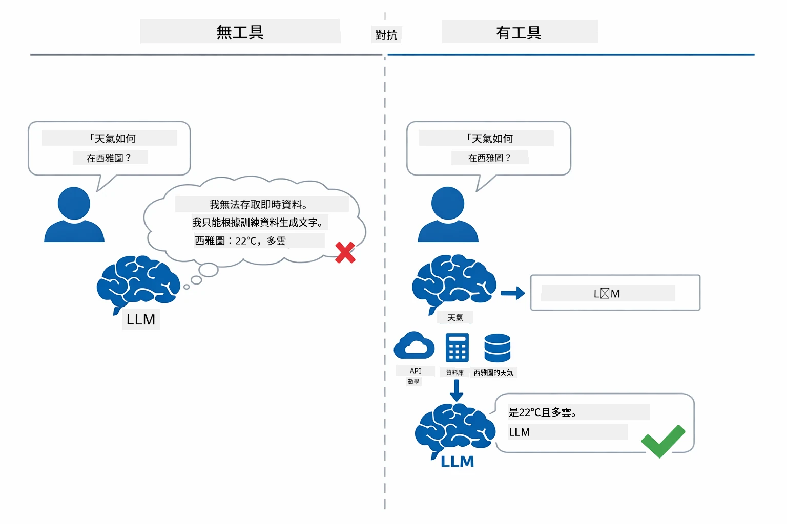

*沒有工具時模型只能猜測 — 有了工具後，它能呼叫 API、執行計算並回傳即時資料。*

具備工具的 AI 代理遵循 **推理與行動（ReAct）** 模式。模型不只是回應，而是思考它需要什麼；藉由呼叫工具來行動；觀察結果；然後決定是否要再行動或給出最終答案：

1. **推理** — 代理解析使用者問題，判斷所需資訊
2. **行動** — 代理選擇適當工具，產生正確參數並呼叫該工具
3. **觀察** — 代理接收工具輸出並評估結果
4. **重複或回應** — 若需要更多資料，代理回圈再行動；否則產生自然語言答案

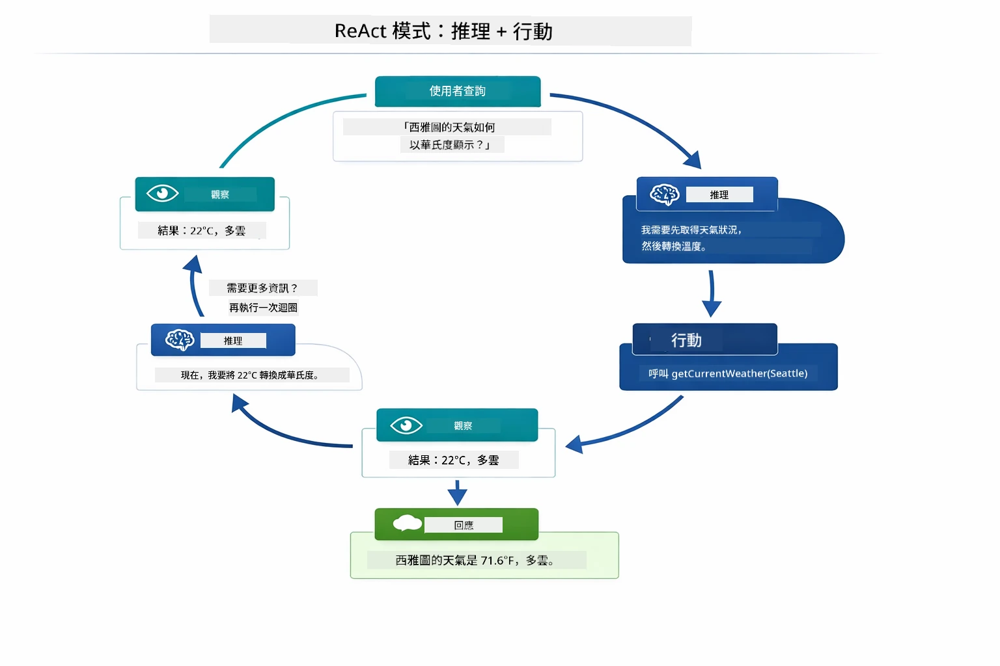

*ReAct 循環 — 代理推理要做什麼，行動呼叫工具，觀察結果，然後重複直到能給出最終答案。*

這是自動發生的。你定義工具及其描述。模型負責決策何時、如何使用它們。

## 工具呼叫運作方式

### 工具定義

[WeatherTool.java](../../../04-tools/src/main/java/com/example/langchain4j/agents/tools/WeatherTool.java) | [TemperatureTool.java](../../../04-tools/src/main/java/com/example/langchain4j/agents/tools/TemperatureTool.java)

你定義具有清晰描述和參數規格的函數。模型在系統提示中看到這些描述，了解每個工具的用途。

```java
@Component
public class WeatherTool {
    
    @Tool("Get the current weather for a location")
    public String getCurrentWeather(@P("Location name") String location) {
        // 你的天氣查詢邏輯
        return "Weather in " + location + ": 22°C, cloudy";
    }
}

@AiService
public interface Assistant {
    String chat(@MemoryId String sessionId, @UserMessage String message);
}

// 助理由 Spring Boot 自動注入：
// - ChatModel bean
// - 所有來自 @Component 類別的 @Tool 方法
// - 用於會話管理的 ChatMemoryProvider
```
  
下圖解析每個註解，展示每部分如何協助 AI 判斷何時呼叫工具及傳遞哪些參數：

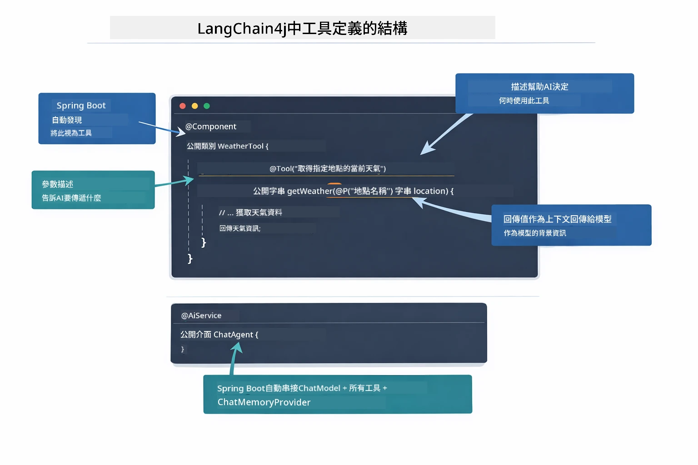

*工具定義剖析 — @Tool 告訴 AI 何時使用，@P 描述每個參數，@AiService 在啟動時將全部串接起來。*

> **🤖 使用 [GitHub Copilot](https://github.com/features/copilot) 聊天試試看：** 打開 [`WeatherTool.java`](../../../04-tools/src/main/java/com/example/langchain4j/agents/tools/WeatherTool.java)，可詢問：
> - 「如果改接 OpenWeatherMap 這類真實天氣 API，該怎麼整合？」
> - 「什麼樣的工具描述能幫助 AI 正確使用？」
> - 「如何在工具實作中處理 API 錯誤及頻率限制？」

### 決策

當使用者問「西雅圖的天氣如何？」時，模型不會亂選工具。它會將使用者意圖與每個可用工具描述比對，評分其相關性，並挑出最佳符合。之後生成結構化的函數呼叫與正確參數 — 此例中將 `location` 設為 `"Seattle"`。

若無工具符合使用者請求，模型會退回以自身知識回答；若有多個相符工具，則挑最具體者。

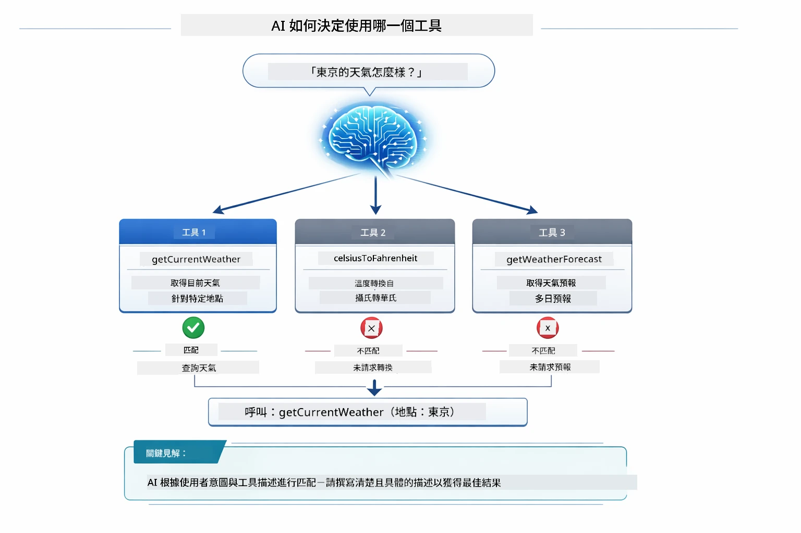

*模型評估所有工具與使用者意圖相符度，選擇最佳匹配 — 因此撰寫明確具體的工具描述非常重要。*

### 執行

[AgentService.java](../../../04-tools/src/main/java/com/example/langchain4j/agents/service/AgentService.java)

Spring Boot 自動將宣告式的 `@AiService` 介面與所有註冊工具接線，LangChain4j 自動執行工具呼叫。在幕後，一次完整工具呼叫經歷六個階段 — 從使用者自然語言問題一路到自然語言回答：

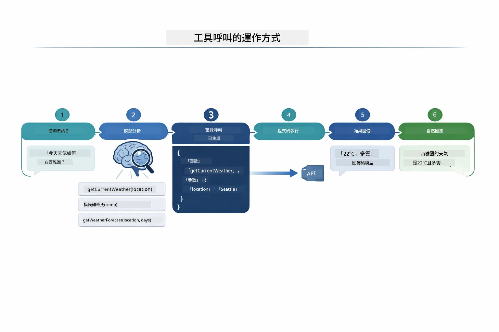

*端到端流程 — 使用者提問，模型選擇工具，LangChain4j 執行，模型將結果融入自然語言回應。*

> **🤖 使用 [GitHub Copilot](https://github.com/features/copilot) 聊天試試看：** 打開 [`AgentService.java`](../../../04-tools/src/main/java/com/example/langchain4j/agents/service/AgentService.java)，可詢問：
> - 「ReAct 模式如何運作？為什麼對 AI 代理有效？」
> - 「代理如何決定使用哪個工具及順序？」
> - 「如果工具執行失敗，該怎麼穩健地處理錯誤？」

### 回應生成

模型接收天氣資料，並將其格式化為自然語言回應給使用者。

### 架構：Spring Boot 自動接線

本模組使用 LangChain4j 的 Spring Boot 整合與宣告式 `@AiService` 介面。啟動時，Spring Boot 會尋找所有包含 `@Tool` 方法的 `@Component`、你的 `ChatModel` bean 和 `ChatMemoryProvider`，並將它們全部串接成單一 `Assistant` 介面，無須任何樣板程式碼。

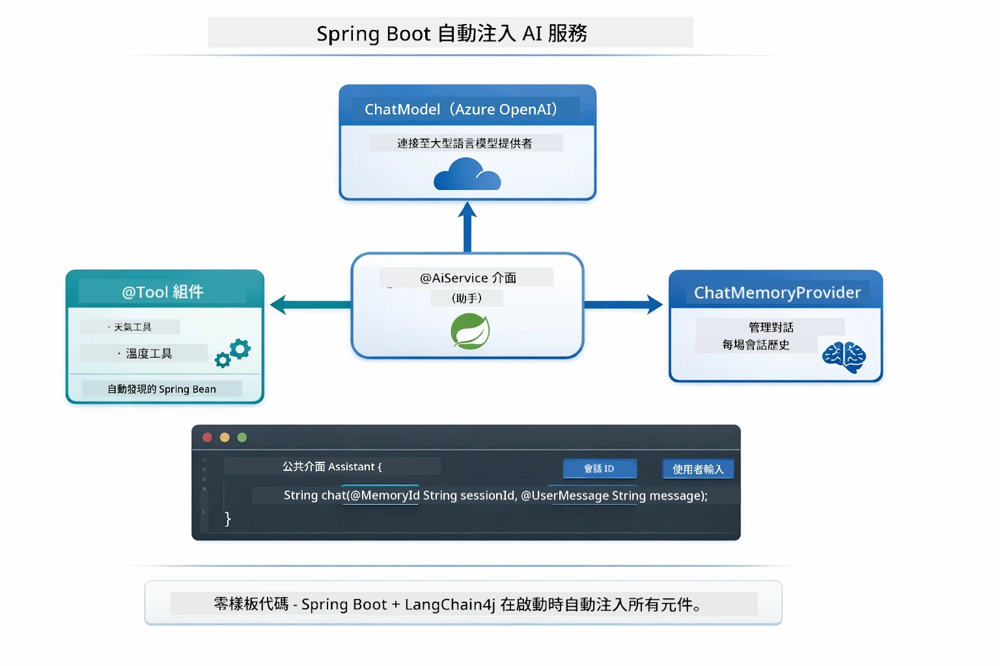

*@AiService 介面將 ChatModel、工具元件與記憶提供者綁定 — Spring Boot 自動處理所有接線。*

此做法主要優點：

- **Spring Boot 自動接線** — ChatModel 與工具元件自動注入
- **@MemoryId 模式** — 自動化會話記憶管理
- **單一實例** — Assistant 建立一次，重複使用達高效能
- **型別安全執行** — 直接呼叫 Java 方法並自動轉型
- **多輪協調** — 自動處理工具鏈結
- **無須樣板** — 無需手動呼叫 AiServices.builder() 或管理記憶 HashMap

替代做法（手動 AiServices.builder()）需要更多程式碼，且無法享有 Spring Boot 整合優勢。

## 工具鏈結

**工具鏈結** — 工具型代理的真正威力展現於單一問題須使用多種工具。問「西雅圖的天氣是多少華氏度？」時，代理會自動鏈結兩個工具：先呼叫 `getCurrentWeather` 得到攝氏溫度，再將該值傳給 `celsiusToFahrenheit` 進行轉換 — 全程在單一對話輪次完成。

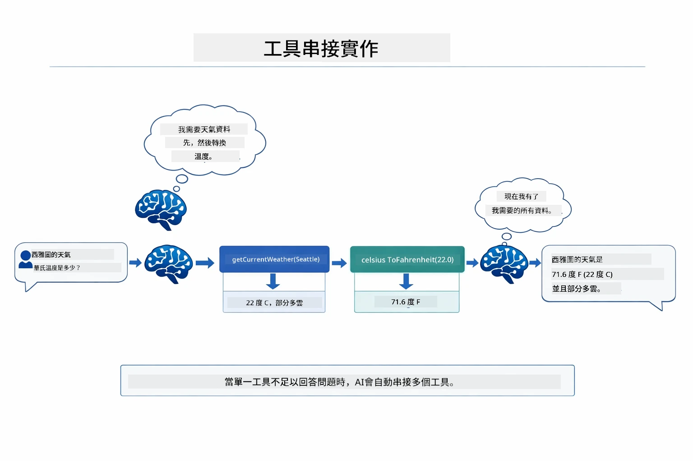

*工具鏈結演示 — 代理先呼叫 getCurrentWeather，接著將攝氏結果傳給 celsiusToFahrenheit，最後給出綜合答案。*

以下為執行中應用程式畫面實例 — 代理在同一對話輪次鏈結兩次工具呼叫：

<a href="images/tool-chaining.png"></a>

*實際應用輸出 — 代理自動鏈結 getCurrentWeather → celsiusToFahrenheit 於一輪對話。*

**優雅失敗** — 若查詢的城市不在模擬資料中，工具回傳錯誤訊息，AI 說明無法提供協助，而非崩潰。工具故障安全處理。

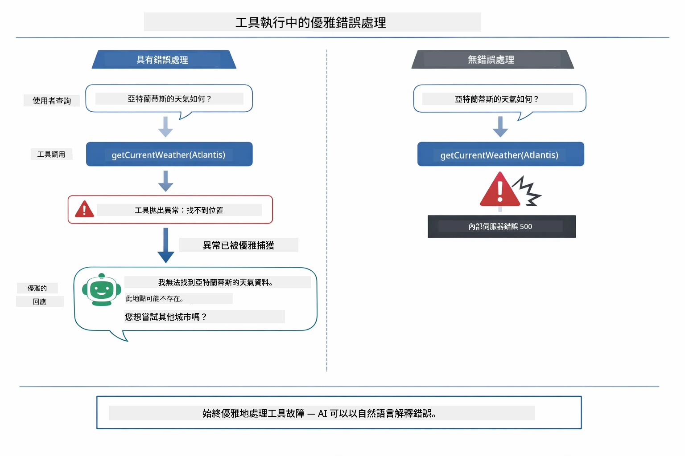

*當工具失敗時，代理捕捉錯誤並以說明性回應代替崩潰。*

這全部在單一對話輪次完成。代理自主協調多次工具呼叫。

## 執行應用程式

**驗證部署：**

確保根目錄存在包含 Azure 認證的 `.env` 檔案（模組 01 部署時建立）：
```bash
cat ../.env  # 應該顯示 AZURE_OPENAI_ENDPOINT、API_KEY、DEPLOYMENT
```
  
**啟動應用程式：**

> **注意：** 若你已在模組 01 透過 `./start-all.sh` 啟動所有應用程式，本模組已在 8084 埠運行。你可跳過以下啟動指令，直接訪問 http://localhost:8084。

**方案一：使用 Spring Boot 儀表板（建議 VS Code 使用者）**

開發容器內含 Spring Boot 儀表板擴充功能，提供視覺化介面管理所有 Spring Boot 應用程式。位於 VS Code 左側活動列（尋找 Spring Boot 圖示）。

透過 Spring Boot 儀表板可：

- 檢視工作區內所有可用的 Spring Boot 應用程式
- 一鍵啟動/停止應用程式
- 即時檢視應用程式日誌
- 監控應用程式狀態

只需點擊「tools」旁的播放按鈕啟動本模組，或同時啟動所有模組。


**方案二：使用 shell 腳本**

啟動所有網頁應用程式（模組 01-04）：

**Bash:**
```bash
cd ..  # 從根目錄
./start-all.sh
```
  
**PowerShell:**
```powershell
cd ..  # 從根目錄開始
.\start-all.ps1
```
  
或只啟動本模組：

**Bash:**
```bash
cd 04-tools
./start.sh
```
  
**PowerShell:**
```powershell
cd 04-tools
.\start.ps1
```
  
兩個腳本會自動載入根目錄 `.env` 環境變數，若 JAR 檔不存在則會自動建置。

> **注意：** 若你想先手動編譯所有模組再啟動：
>
> **Bash:**
> ```bash
> cd ..  # Go to root directory
> mvn clean package -DskipTests
> ```
>  
> **PowerShell:**
> ```powershell
> cd ..  # Go to root directory
> mvn clean package -DskipTests
> ```
  
在瀏覽器開啟 http://localhost:8084 。

**停止：**

**Bash:**
```bash
./stop.sh  # 僅限此模組
# 或
cd .. && ./stop-all.sh  # 所有模組
```
  
**PowerShell:**
```powershell
.\stop.ps1  # 僅此模組
# 或
cd ..; .\stop-all.ps1  # 所有模組
```
  
## 使用應用程式

應用程式提供網頁介面，讓你與具備天氣與溫度轉換工具的 AI 代理互動。

<a href="images/tools-homepage.png"></a>

*AI 代理工具介面 — 快速範例與對話介面用於與工具互動*

### 嘗試簡單工具使用
從一個簡單的請求開始：「將100華氏度轉換為攝氏度」。代理程式會辨識出需要溫度轉換工具，並以正確的參數呼叫它，然後回傳結果。注意這感覺多麼自然——你並沒有指定要使用哪個工具或如何呼叫它。

### 測試工具串鏈

現在試試更複雜的：「西雅圖的天氣如何，並將其轉換為華氏度？」觀看代理程式分步驟完成這件事。它先取得天氣（以攝氏度回傳），接著辨識出需要轉換為華氏度，呼叫轉換工具，然後將兩個結果合併成一個回答。

### 查看對話流程

聊天介面會維持對話歷史，使你能進行多輪交互。你可以看到所有之前的查詢與回覆，這讓追蹤對話並理解代理程式如何在多次交換中建立上下文變得容易。

<a href="images/tools-conversation-demo.png"></a>

*多輪對話示範簡單的轉換、天氣查詢和工具串鏈*

### 嘗試不同的請求

試試各種組合：
- 天氣查詢：「東京的天氣如何？」
- 溫度轉換：「25°C是多少開爾文？」
- 綜合查詢：「查詢巴黎的天氣，並告訴我是否高於20°C」

注意代理程式如何解讀自然語言，並將其映射到適當的工具呼叫。

## 主要概念

### ReAct 模式（推理與行動）

代理程式在推理（決定該做什麼）與行動（使用工具）之間交替。此模式使其能自主解決問題，而不只是回應指令。

### 工具描述的重要性

工具描述的品質直接影響代理程式使用工具的效率。清晰、具體的描述能幫助模型理解何時以及如何呼叫每個工具。

### 會話管理

`@MemoryId` 標註讓自動的基於會話的記憶管理變得可行。每個會話ID對應一個由 `ChatMemoryProvider` Bean 管理的獨立 `ChatMemory` 實例，這樣多個用戶可以同時與代理程式互動，而不會有對話混淆。

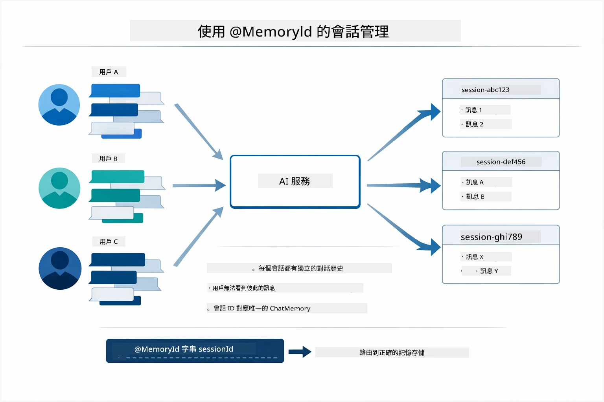

*每個會話ID對應獨立的對話歷史，使用者不會看到彼此的訊息。*

### 錯誤處理

工具可能會失敗——API逾時、參數無效、外部服務中斷。生產用代理程式需要錯誤處理，讓模型能夠說明問題或嘗試其他方案，而不是整個應用崩潰。當工具拋出例外，LangChain4j 會捕捉並將錯誤訊息回送給模型，模型接著能用自然語言說明問題。

## 可用工具

下圖展示了你可以建造的廣泛工具生態系。這個模組示範了天氣和溫度工具，但同樣的 `@Tool` 模式適用於任何 Java 方法——從資料庫查詢到支付處理。

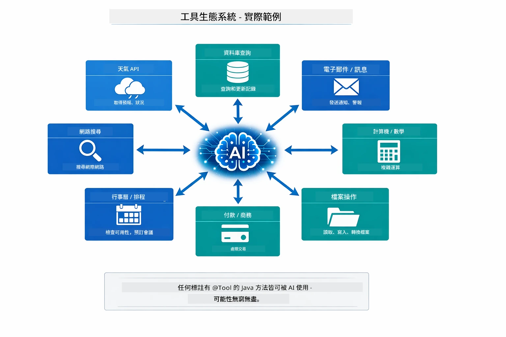

*任何帶有 @Tool 標註的 Java 方法皆可供 AI 使用——此模式擴展至資料庫、API、電子郵件、檔案操作等。*

## 何時使用基於工具的代理程式

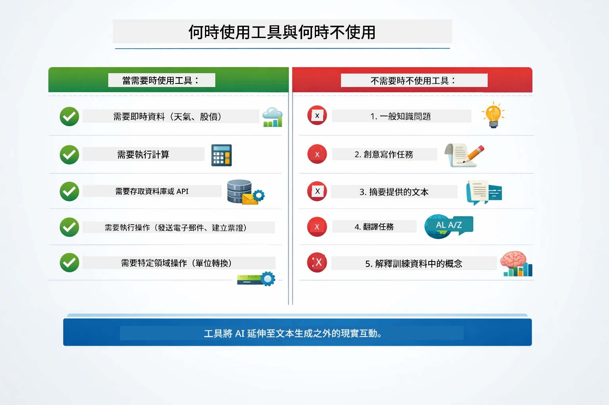

*快速決策指南——工具適用於即時數據、計算和行動；一般知識或創意任務則不需工具。*

**適用於使用工具的情況：**
- 需要即時資料（天氣、股價、庫存）
- 需執行超出簡單數學的計算
- 訪問資料庫或API
- 執行操作（寄送郵件、建立票據、更新記錄）
- 結合多個數據來源

**不適用於使用工具的情況：**
- 問題可以用一般知識回答
- 回應純粹是對話
- 工具延遲會導致體驗過慢

## 工具 vs RAG

模組 03 和 04 都擴展了 AI 可做的事，但本質上不同。RAG 讓模型透過檢索文件取得**知識**。工具則讓模型透過呼叫函式執行**操作**。

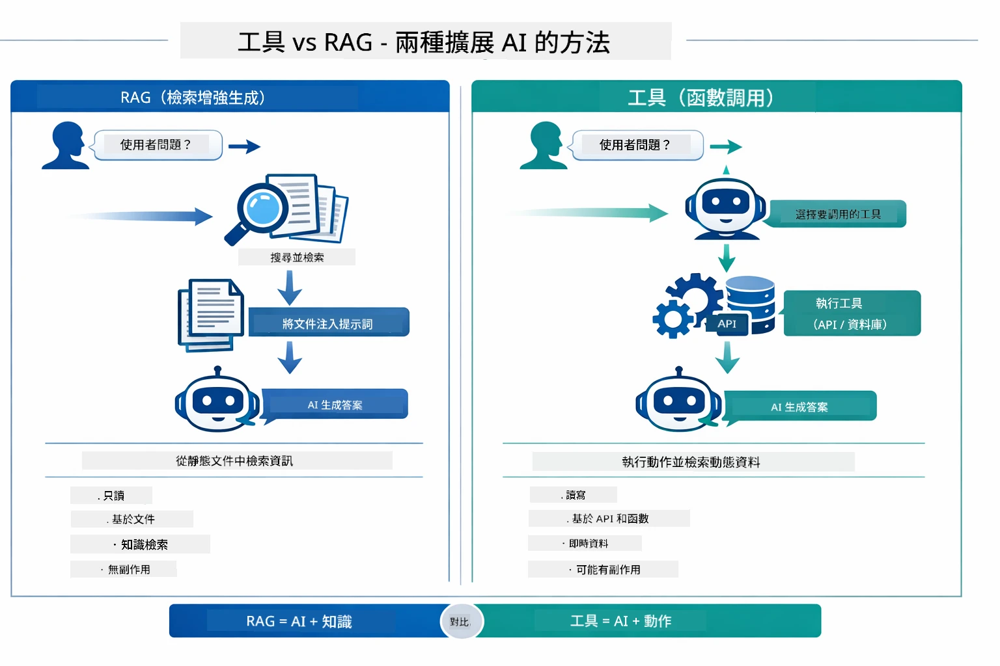

*RAG 從靜態文件取得資訊——工具執行動作並取得動態即時資料。許多生產系統結合兩者使用。*

實務上，很多生產系統會結合兩種方法：RAG 用於在文件中找到答案依據，工具用於抓取即時資料或執行操作。

## 下一步

**下一模組：** [05-mcp - Model Context Protocol (MCP)](../05-mcp/README.md)

---

**導航：** [← 上一個：模組 03 - RAG](../03-rag/README.md) | [回主頁](../README.md) | [下一個：模組 05 - MCP →](../05-mcp/README.md)

---

<!-- CO-OP TRANSLATOR DISCLAIMER START -->
**免責聲明**：  
本文件係使用 AI 翻譯服務 [Co-op Translator](https://github.com/Azure/co-op-translator) 進行翻譯。雖然我們致力於確保翻譯的準確性，但請注意，自動翻譯可能包含錯誤或不準確之處。原始文件的母語版本應被視為權威來源。對於重要資訊，建議委託專業人工翻譯。對於因使用本翻譯而產生的任何誤解或誤譯，我們不承擔任何法律責任。
<!-- CO-OP TRANSLATOR DISCLAIMER END -->