# Module 05: 模型上下文協議 (MCP)

## 目錄

- [你將學到什麼](../../../05-mcp)
- [什麼是 MCP？](../../../05-mcp)
- [MCP 如何運作](../../../05-mcp)
- [智能代理模組](../../../05-mcp)
- [執行範例](../../../05-mcp)
  - [先決條件](../../../05-mcp)
- [快速開始](../../../05-mcp)
  - [檔案操作 (Stdio)](../../../05-mcp)
  - [監督代理](../../../05-mcp)
    - [執行示範](../../../05-mcp)
    - [監督者如何運作](../../../05-mcp)
    - [FileAgent 如何於執行時發現 MCP 工具](../../../05-mcp)
    - [回應策略](../../../05-mcp)
    - [理解輸出](../../../05-mcp)
    - [智能代理模組功能說明](../../../05-mcp)
- [關鍵概念](../../../05-mcp)
- [恭喜！](../../../05-mcp)
  - [接下來呢？](../../../05-mcp)

## 你將學到什麼

你已經建立了對話式 AI，掌握了提示語，讓回應基於文件，並為你的代理創造了工具。但所有這些工具都是為你的特定應用程式自訂打造。如果你能讓你的 AI 訪問一個任何人都可以創建並分享的標準化工具生態系統呢？在本模組中，你將學會如何使用模型上下文協議 (MCP) 和 LangChain4j 的智能代理模組來做到這一點。我們先展示一個簡單的 MCP 檔案讀取器，然後展示它如何輕鬆整合到使用監督代理模式的進階智能代理工作流程中。

## 什麼是 MCP？

模型上下文協議 (MCP) 就是提供這樣的方案——為 AI 應用程序發現和使用外部工具提供標準化方法。你不需要為每個資料來源或服務撰寫自訂整合，只需連接到以一致格式公開其功能的 MCP 伺服器。你的 AI 代理即可自動發現並使用這些工具。

下圖展示了差異——沒有 MCP，所有整合都需要一對一的特製傳輸；有了 MCP，一個協議即可連接你的應用與任何工具：


*MCP 之前：複雜的一對一整合。MCP 之後：單一協議，無限可能。*

MCP 解決了 AI 開發的根本問題：每次整合都是客製化。想存取 GitHub？客製程式碼。讀取檔案？客製程式碼。查詢資料庫？客製程式碼。而且這些整合通常無法互通。

MCP 標準化了這一切。MCP 伺服器公開帶有清晰描述和參數結構的工具。任何 MCP 用戶端都可連接、發現可用工具並使用。一次建置，處處可用。

下圖說明此架構——單一 MCP 用戶端（你的 AI 應用）連接多個 MCP 伺服器，這些伺服器各自透過標準協議公開自己的工具集：


*模型上下文協議架構 - 標準化工具發現與執行*

## MCP 如何運作

在底層，MCP 使用分層架構。你的 Java 應用（MCP 用戶端）發現可用工具，透過傳輸層（Stdio 或 HTTP）發送 JSON-RPC 請求，MCP 伺服器執行操作並返回結果。下圖拆解協議中的每層：

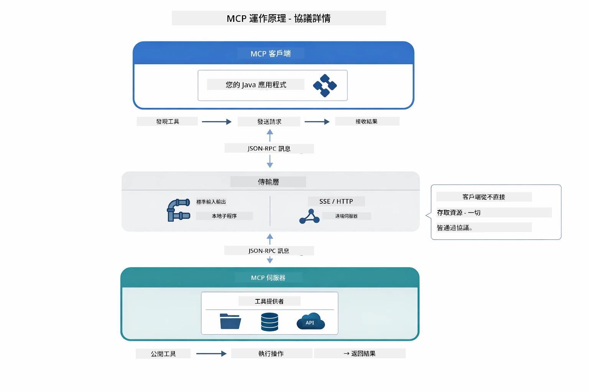

*MCP 底層作業方式——用戶端發現工具、交換 JSON-RPC 訊息、經由傳輸層執行操作。*

**伺服器-用戶端架構**

MCP 採用用戶端-伺服器模型。伺服器提供工具——讀檔、查詢資料庫、呼叫 API。用戶端（你的 AI 應用）連接伺服器並使用工具。

要在 LangChain4j 中使用 MCP，添加此 Maven 依賴：

```xml
<dependency>
    <groupId>dev.langchain4j</groupId>
    <artifactId>langchain4j-mcp</artifactId>
    <version>${langchain4j.version}</version>
</dependency>
```

**工具發現**

當你的用戶端連接 MCP 伺服器時，它會詢問「你有什麼工具？」伺服器會回傳可用工具清單，每個工具附帶描述和參數結構。你的 AI 代理可根據用戶請求決定要使用哪些工具。下圖展示此訊息交換——用戶端送出 `tools/list` 請求，伺服器回傳其可用工具、描述與參數結構：

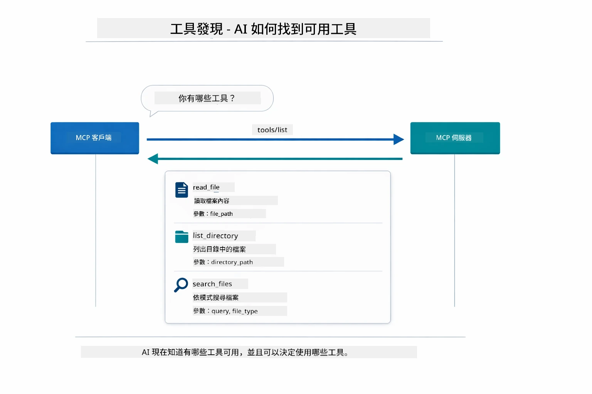

*AI 在啟動時發現可用工具——現在知道有哪些功能可用，可決定使用哪些。*

**傳輸機制**

MCP 支援不同傳輸機制。兩個選項是 Stdio（針對本地子程序通訊）和可串流 HTTP（遠端伺服器）。本模組示範 Stdio 傳輸：


*MCP 傳輸機制：HTTP 用於遠端伺服器，Stdio 用於本地程序*

**Stdio** - [StdioTransportDemo.java](../../../05-mcp/src/main/java/com/example/langchain4j/mcp/StdioTransportDemo.java)

用於本地程序。你的應用啟動伺服器作為子程序，透過標準輸入/輸出通訊。適合檔案系統存取或命令列工具。

```java
McpTransport stdioTransport = new StdioMcpTransport.Builder()
    .command(List.of(
        npmCmd, "exec",
        "@modelcontextprotocol/server-filesystem@2025.12.18",
        resourcesDir
    ))
    .logEvents(false)
    .build();
```

`@modelcontextprotocol/server-filesystem` 伺服器公開以下工具，全部限定於你指定的目錄範圍：

| 工具 | 說明 |
|------|-------------|
| `read_file` | 讀取單一檔案內容 |
| `read_multiple_files` | 一次讀取多個檔案 |
| `write_file` | 建立或覆寫檔案 |
| `edit_file` | 針對性搜尋並取代編輯 |
| `list_directory` | 列出指定路徑的檔案與目錄 |
| `search_files` | 遞迴搜尋符合模式的檔案 |
| `get_file_info` | 取得檔案元資料（大小、時間戳、權限） |
| `create_directory` | 建立目錄（含父目錄） |
| `move_file` | 移動或重新命名檔案或目錄 |

下圖示意 Stdio 傳輸執行時運作—你的 Java 應用啟動 MCP 伺服器為子程序，兩者透過 stdin/stdout 管道通訊，不涉及網路或 HTTP：

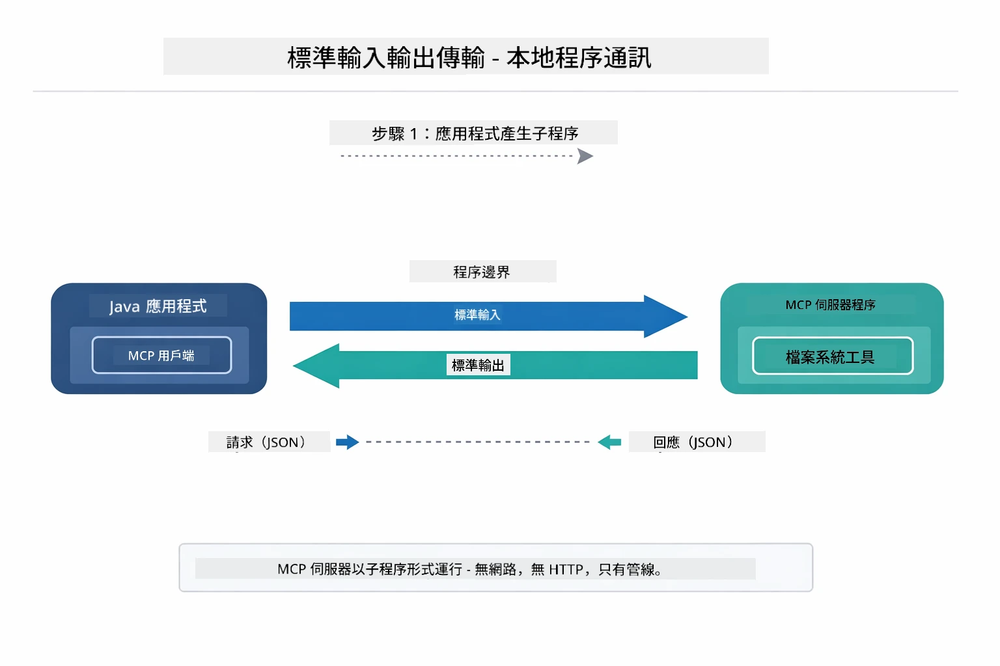

*Stdio 傳輸實例——你的應用啟動 MCP 伺服器為子程序，並透過 stdin/stdout 管道通訊。*

> **🤖 嘗試使用 [GitHub Copilot](https://github.com/features/copilot) Chat：** 開啟 [`StdioTransportDemo.java`](../../../05-mcp/src/main/java/com/example/langchain4j/mcp/StdioTransportDemo.java) 並詢問：
> - 「Stdio 傳輸如何運作？何時應該用它而非 HTTP？」
> - 「LangChain4j 如何管理被啟動 MCP 伺服器流程的生命週期？」
> - 「讓 AI 訪問檔案系統有什麼安全性考量？」

## 智能代理模組

雖然 MCP 提供標準化工具，但 LangChain4j 的 **智能代理模組** 提供以宣告式方式建構能協調這些工具的代理。`@Agent` 標註和 `AgenticServices` 讓你透過介面定義代理行為，而非命令式程式碼。

在本模組中，你將探索 **監督代理** 模式——一種進階智能代理 AI 方法，一個「監督者」代理根據用戶請求動態決定呼叫哪些子代理。我們將這兩個概念結合，賦予其中一個子代理基於 MCP 的檔案存取能力。

使用智能代理模組，添加此 Maven 依賴：

```xml
<dependency>
    <groupId>dev.langchain4j</groupId>
    <artifactId>langchain4j-agentic</artifactId>
    <version>${langchain4j.mcp.version}</version>
</dependency>
```
> **注意：** `langchain4j-agentic` 模組使用獨立版本屬性（`langchain4j.mcp.version`），因為其發佈節奏與核心 LangChain4j 庫不同。

> **⚠️ 實驗性質：** `langchain4j-agentic` 模組是**實驗性**功能，可能會變動。穩定構建 AI 助理的方式仍是使用 `langchain4j-core` 搭配客製工具（第 04 模組）。

## 執行範例

### 先決條件

- 完成 [Module 04 - Tools](../04-tools/README.md)（本模組建立於自訂工具概念，並與 MCP 工具做比較）
- 根目錄有含 Azure 憑證的 `.env` 檔（由第 01 模組中 `azd up` 產生）
- Java 21+、Maven 3.9+
- Node.js 16+ 與 npm（用於 MCP 伺服器）

> **注意：** 如果尚未設定環境變數，請參考 [Module 01 - Introduction](../01-introduction/README.md) 的部署指引（`azd up` 會自動創建 `.env` 檔），或將 `.env.example` 複製為根目錄下的 `.env` 並填入你的值。

## 快速開始

**使用 VS Code：** 在檔案總管中右鍵任何示範檔案，選擇 **「Run Java」**，或使用「執行與除錯」面板的啟動組態（先確認 `.env` 已正確配置 Azure 憑證）。

**使用 Maven：** 也可以用以下指令在命令列執行示範。

### 檔案操作 (Stdio)

示範本地子程序基礎的工具。

**✅ 無需其他先決條件** —— MCP 伺服器會自動啟動。

**使用啟動腳本（推薦）：**

啟動腳本會自動從根目錄的 `.env` 檔載入環境變數：

**Bash：**
```bash
cd 05-mcp
chmod +x start-stdio.sh
./start-stdio.sh
```

**PowerShell：**
```powershell
cd 05-mcp
.\start-stdio.ps1
```

**使用 VS Code：** 右鍵 `StdioTransportDemo.java`，選擇 **「Run Java」**（確認你的 `.env` 已配置）。

應用會自動啟動檔案系統 MCP 伺服器並讀取本地檔案。可看到子程序管理已為你處理。

**預期輸出：**
```
Assistant response: The file provides an overview of LangChain4j, an open-source Java library
for integrating Large Language Models (LLMs) into Java applications...
```

### 監督代理

**監督代理模式**是一種**彈性**的智能代理 AI。監督者使用大型語言模型 (LLM) 自主決定根據用戶請求呼叫哪些代理。在下一個範例中，我們結合 MCP 支援的檔案存取與 LLM 代理，建立一個監督的檔案讀取 → 報告工作流程。

範例中，`FileAgent` 使用 MCP 檔案系統工具讀檔，`ReportAgent` 產生帶有執行摘要（一句話）、3 個重點與建議的結構化報告。監督者自動協調此流程：

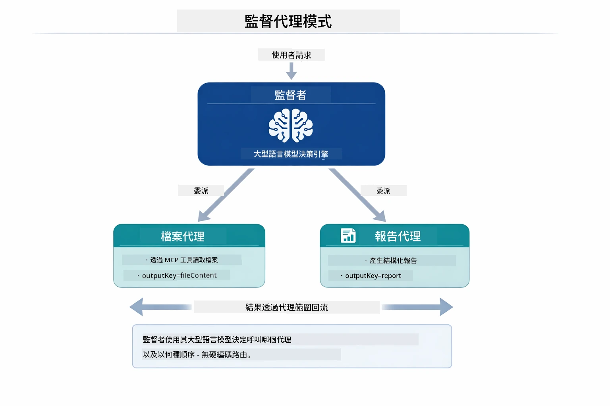

*監督者用它的 LLM 決定呼叫哪些代理以及執行順序——不需硬編路由。*

具體的檔案到報告流程長這樣：

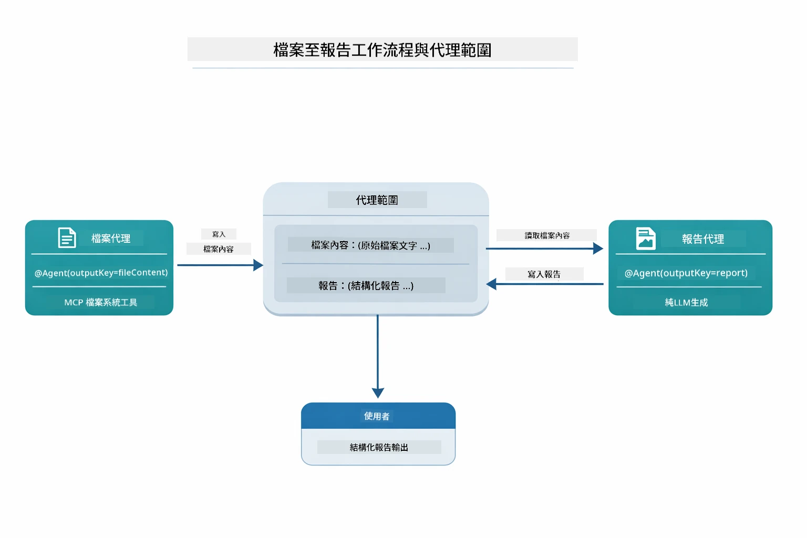

*FileAgent 透過 MCP 工具讀取檔案，接著 ReportAgent 把原始內容轉換成結構化報告。*

下圖是整個監督代理序列圖——從啟動 MCP 伺服器、監督者自主選擇代理、到透過 stdio 呼叫工具與最終報告：

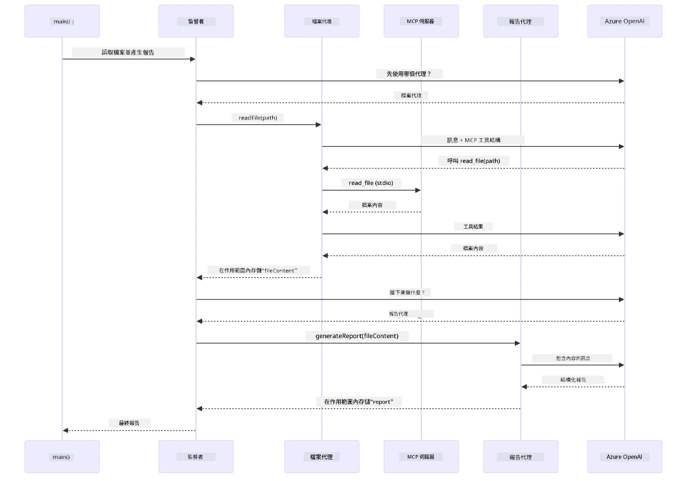

*監督者自主呼叫 FileAgent（透過 stdio 向 MCP 伺服器讀取檔案），再呼叫 ReportAgent 產生結構化報告——各代理將輸出存在共享的智能代理範圍。*

每個代理將輸出存入 **智能代理範圍**（共享記憶），方便後續代理存取先前的結果。這示範了 MCP 工具如何無縫融入智能代理工作流程——監督者不需要知道**怎麼**讀檔，只需要知道 `FileAgent` 能做到。

#### 執行示範

啟動腳本會自動從根目錄的 `.env` 檔載入環境變數：

**Bash：**
```bash
cd 05-mcp
chmod +x start-supervisor.sh
./start-supervisor.sh
```

**PowerShell：**
```powershell
cd 05-mcp
.\start-supervisor.ps1
```

**使用 VS Code：** 右鍵 `SupervisorAgentDemo.java`，選擇 **「Run Java」**（確認 `.env` 已配置）。

#### 監督者如何運作

在建立代理之前，你需連接 MCP 傳輸至用戶端並包裝為 `ToolProvider`。這樣 MCP 伺服器的工具才能供你的代理使用：

```java
// 從傳輸層建立一個 MCP 客戶端
McpClient mcpClient = new DefaultMcpClient.Builder()
        .transport(stdioTransport)
        .build();

// 將客戶端包裝為 ToolProvider — 這將 MCP 工具橋接到 LangChain4j
ToolProvider mcpToolProvider = McpToolProvider.builder()
        .mcpClients(List.of(mcpClient))
        .build();
```

現在你可以將 `mcpToolProvider` 注入任何需要 MCP 工具的代理：

```java
// 第一步驟：FileAgent 使用 MCP 工具讀取檔案
FileAgent fileAgent = AgenticServices.agentBuilder(FileAgent.class)
        .chatModel(model)
        .toolProvider(mcpToolProvider)  // 具有用於檔案操作的 MCP 工具
        .build();

// 第二步驟：ReportAgent 產生結構化報告
ReportAgent reportAgent = AgenticServices.agentBuilder(ReportAgent.class)
        .chatModel(model)
        .build();

// 主管負責協調檔案 → 報告的工作流程
SupervisorAgent supervisor = AgenticServices.supervisorBuilder()
        .chatModel(model)
        .subAgents(fileAgent, reportAgent)
        .responseStrategy(SupervisorResponseStrategy.LAST)  // 返回最終報告
        .build();

// 主管根據請求決定要調用哪些代理程式
String response = supervisor.invoke("Read the file at /path/file.txt and generate a report");
```

#### FileAgent 如何於執行時發現 MCP 工具

你可能會問：**`FileAgent` 怎麼知道怎麼使用 npm 的檔案系統工具？**答案是它並不知道——**LLM** 透過工具結構於執行時推斷使用方法。

`FileAgent` 介面只是**提示語定義**。它不含對 `read_file`、`list_directory` 或其他 MCP 工具的硬編碼知識。完整流程是這樣的：
1. **伺服器啟動：** `StdioMcpTransport` 啟動 `@modelcontextprotocol/server-filesystem` npm 套件作為子程序  
2. **工具發現：** `McpClient` 發送 `tools/list` JSON-RPC 請求給伺服器，伺服器回傳工具名稱、描述及參數結構（例如 `read_file` — *"讀取檔案完整內容"* — `{ path: string }`）  
3. **結構注入：** `McpToolProvider` 包裝這些發現的結構並提供給 LangChain4j  
4. **LLM 判斷：** 當呼叫 `FileAgent.readFile(path)` 時，LangChain4j 將系統訊息、使用者訊息**和工具結構清單**傳給 LLM。LLM 讀取工具描述並產生工具呼叫（例如 `read_file(path="/some/file.txt")`）  
5. **執行：** LangChain4j 攔截工具呼叫，透過 MCP 客戶端路由回 Node.js 子程序，取得結果後回饋給 LLM  

這與上文所述的[工具發現](../../../05-mcp)機制相同，但特別應用於代理工作流程。`@SystemMessage` 和 `@UserMessage` 標註引導 LLM 的行為，而注入的 `ToolProvider` 則提供了**能力** —— LLM 在執行時將兩者連接起來。

> **🤖 使用 [GitHub Copilot](https://github.com/features/copilot) Chat 試試看：** 開啟 [`FileAgent.java`](../../../05-mcp/src/main/java/com/example/langchain4j/mcp/agents/FileAgent.java) 並詢問：  
> - "這個代理如何知道要呼叫哪個 MCP 工具？"  
> - "如果我從代理建構器中移除 ToolProvider 會發生什麼？"  
> - "工具結構如何傳給 LLM？"  

#### 回應策略  

配置 `SupervisorAgent` 時，您可指定子代理完成任務後如何形成對使用者的最終回答。下圖展示三種可用策略 — LAST 直接回傳最後一個代理的輸出，SUMMARY 透過 LLM 綜合所有輸出生成摘要，SCORED 則選擇對原始請求評分較高的輸出：

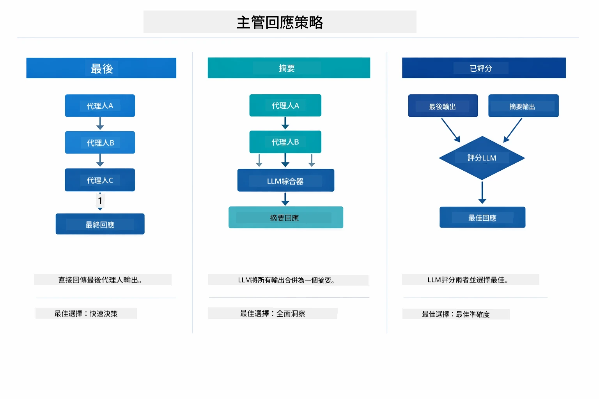

*主管代理形成最終回應的三種策略 — 可根據想要最後一個代理輸出、綜合摘要或評分最高的結果來選擇。*

可用策略說明：

| 策略      | 描述                                                         |
|-----------|------------------------------------------------------------|
| **LAST**  | 主管直接回傳最後被呼叫之子代理或工具的輸出。適用於工作流程中最後的代理專門產生完整、最終答案（例如研究流程中的「摘要代理」）。 |
| **SUMMARY** | 主管使用其內建的語言模型(LLM)綜合所有互動及子代理輸出，生成摘要並回傳，提供使用者一個乾淨的整合答案。     |
| **SCORED** | 系統利用內建 LLM 對 LAST 回應與 SUMMARY 摘要依原始請求進行評分，回傳得分較高的輸出。               |

完整實作請參見 [SupervisorAgentDemo.java](../../../05-mcp/src/main/java/com/example/langchain4j/mcp/SupervisorAgentDemo.java)。

> **🤖 使用 [GitHub Copilot](https://github.com/features/copilot) Chat 試試看：** 開啟 [`SupervisorAgentDemo.java`](../../../05-mcp/src/main/java/com/example/langchain4j/mcp/SupervisorAgentDemo.java) 並詢問：  
> - "Supervisor 如何決定呼叫哪些代理？"  
> - "Supervisor 與 Sequential 工作流程模式有何差異？"  
> - "我如何自訂 Supervisor 的規劃行為？"  

#### 理解輸出  

執行示範時，您會看到 Supervisor 如何協調多個代理的結構化流程。本節說明各部分的含義：

```
======================================================================
  FILE → REPORT WORKFLOW DEMO
======================================================================

This demo shows a clear 2-step workflow: read a file, then generate a report.
The Supervisor orchestrates the agents automatically based on the request.
```
  
**標題**介紹工作流程概念：一個從讀檔到報告生成的聚焦流水線。

```
--- WORKFLOW ---------------------------------------------------------
  ┌─────────────┐      ┌──────────────┐
  │  FileAgent  │ ───▶ │ ReportAgent  │
  │ (MCP tools) │      │  (pure LLM)  │
  └─────────────┘      └──────────────┘
   outputKey:           outputKey:
   'fileContent'        'report'

--- AVAILABLE AGENTS -------------------------------------------------
  [FILE]   FileAgent   - Reads files via MCP → stores in 'fileContent'
  [REPORT] ReportAgent - Generates structured report → stores in 'report'
```
  
**工作流程圖**展示代理間的資料流。每個代理擁有特定角色：  
- **FileAgent** 使用 MCP 工具讀檔並將原始內容存至 `fileContent`  
- **ReportAgent** 消耗該內容並產生結構化報告存於 `report`  

```
--- USER REQUEST -----------------------------------------------------
  "Read the file at .../file.txt and generate a report on its contents"
```
  
**使用者請求**展示任務內容。Supervisor 解析後決定呼叫 FileAgent → ReportAgent。

```
--- SUPERVISOR ORCHESTRATION -----------------------------------------
  The Supervisor decides which agents to invoke and passes data between them...

  +-- STEP 1: Supervisor chose -> FileAgent (reading file via MCP)
  |
  |   Input: .../file.txt
  |
  |   Result: LangChain4j is an open-source, provider-agnostic Java framework for building LLM...
  +-- [OK] FileAgent (reading file via MCP) completed

  +-- STEP 2: Supervisor chose -> ReportAgent (generating structured report)
  |
  |   Input: LangChain4j is an open-source, provider-agnostic Java framew...
  |
  |   Result: Executive Summary...
  +-- [OK] ReportAgent (generating structured report) completed
```
  
**Supervisor 協調**展示兩步流程運作：  
1. **FileAgent** 透過 MCP 讀取檔案並存內容  
2. **ReportAgent** 接收內容並生成結構化報告  

Supervisor 根據使用者請求**自主**做出這些決策。

```
--- FINAL RESPONSE ---------------------------------------------------
Executive Summary
...

Key Points
...

Recommendations
...

--- AGENTIC SCOPE (Data Flow) ----------------------------------------
  Each agent stores its output for downstream agents to consume:
  * fileContent: LangChain4j is an open-source, provider-agnostic Java framework...
  * report: Executive Summary...
```
  
#### 代理模組功能說明  

範例展示代理模組多項進階功能，先看看代理域與代理監聽器：

**代理域 (Agentic Scope)** 顯示代理使用 `@Agent(outputKey="...")` 存放結果的共用記憶體，允許：  
- 後續代理訪問先前代理的輸出  
- Supervisor 綜合形成最終回應  
- 您檢視各代理輸出內容  

下圖示範代理域如何作為檔案至報告工作流程的共用記憶體 — FileAgent 寫出 `fileContent`，ReportAgent 讀取並寫入 `report`：

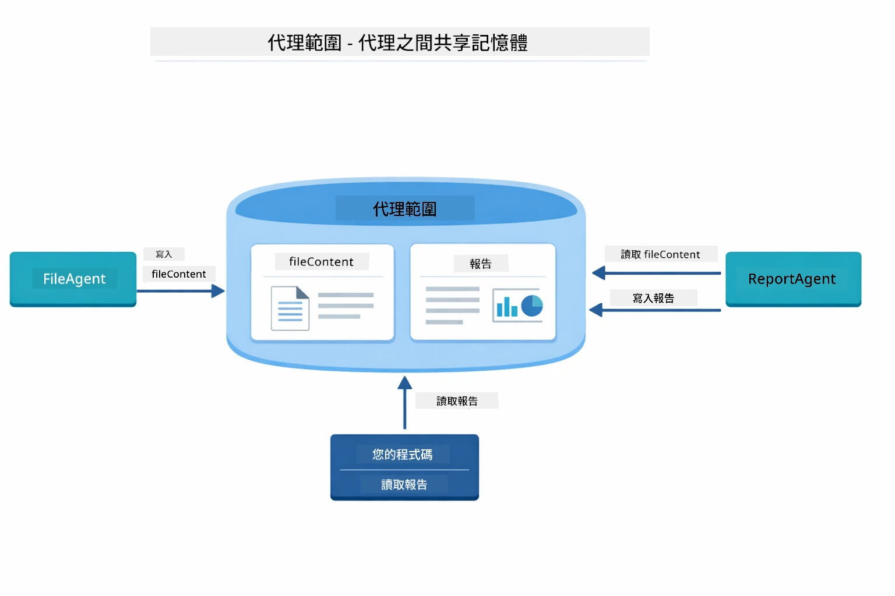

*代理域充當共用記憶體 — FileAgent 寫入 `fileContent`，ReportAgent 讀取該內容並寫入 `report`，您的程式碼讀取最終結果。*

```java
ResultWithAgenticScope<String> result = supervisor.invokeWithAgenticScope(request);
AgenticScope scope = result.agenticScope();
String fileContent = scope.readState("fileContent");  // 來自 FileAgent 的原始檔案數據
String report = scope.readState("report");            // 來自 ReportAgent 的結構化報告
```
  
**代理監聽器 (Agent Listeners)** 支援監控與除錯代理執行。示範中逐步輸出來自掛載於每次代理呼叫的 AgentListener：  
- **beforeAgentInvocation** - 當 Supervisor 選擇代理時調用，可查看選擇了哪個代理與原因  
- **afterAgentInvocation** - 代理完成時調用，顯示結果  
- **inheritedBySubagents** - 若為 true，監控階層中所有代理  

下圖展示完整代理監聽器生命週期，包含 `onError` 如何處理代理執行失敗：

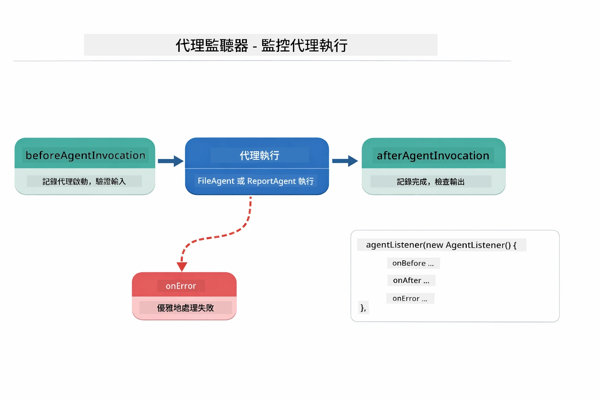

*代理監聽器掛載於執行生命週期 — 監控代理開始、完成或出錯時刻。*

```java
AgentListener monitor = new AgentListener() {
    private int step = 0;
    
    @Override
    public void beforeAgentInvocation(AgentRequest request) {
        step++;
        System.out.println("  +-- STEP " + step + ": " + request.agentName());
    }
    
    @Override
    public void afterAgentInvocation(AgentResponse response) {
        System.out.println("  +-- [OK] " + response.agentName() + " completed");
    }
    
    @Override
    public boolean inheritedBySubagents() {
        return true; // 傳播到所有子代理
    }
};
```
  
除了 Supervisor 模式外，`langchain4j-agentic` 模組提供多種強大工作流程模式，下圖列示五種 — 從簡單的序列流水線到人工介入的核准流程：

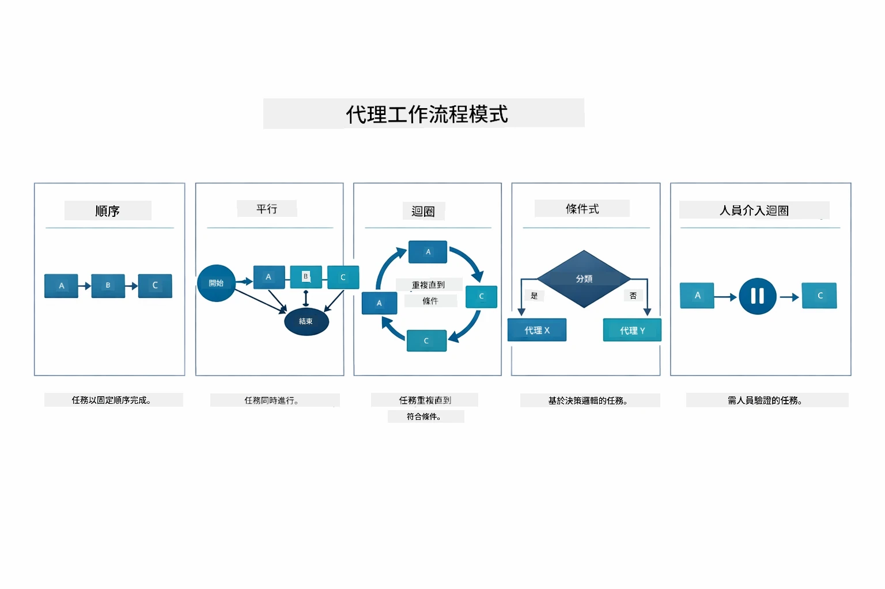

*五種代理工作流程模式 — 從簡單序列流水線到人工核准環節流程。*

| 模式           | 描述                      | 使用場景                       |
|----------------|-------------------------|------------------------------|
| **Sequential** | 按順序執行代理，輸出流向下一個 | 流水線：研究 → 分析 → 報告        |
| **Parallel**   | 同時執行多個代理             | 獨立任務：天氣 + 新聞 + 股票         |
| **Loop**       | 迭代直到滿足條件             | 品質評分：反覆優化直至分數 ≥ 0.8    |
| **Conditional**| 基於條件路由               | 分類 → 路由至專家代理             |
| **Human-in-the-Loop** | 加入人工檢查點             | 核准流程、內容審核               |

## 核心概念  

既然已探索 MCP 及代理模組運作，讓我們總結何時採用哪種方式。

MCP 最大優勢之一是其日益壯大的生態系統。下圖展示單一通用協定如何連接您的 AI 應用與多種 MCP 伺服器 — 從檔案系統及資料庫存取到 GitHub、電子郵件、網頁抓取等：

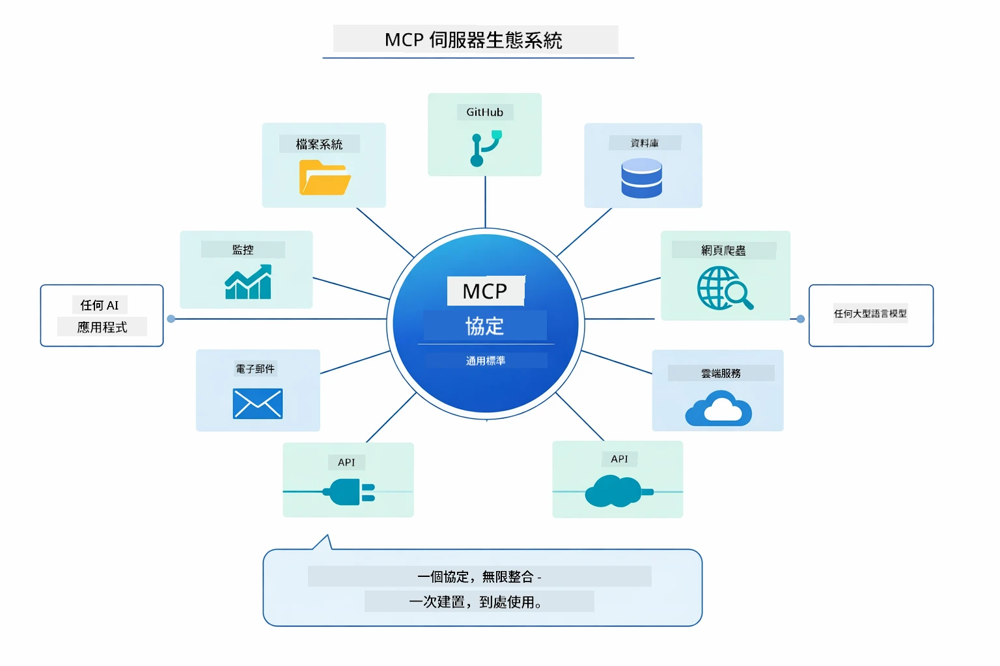

*MCP 建立通用協定生態系 — 任意 MCP 相容伺服器都能與任何 MCP 相容客戶端搭配，促進跨應用工具共享。*

**MCP** 適合您想要利用現有工具生態、打造多應用共享工具、以標準協定整合第三方服務，或在不更換程式碼下替換工具實作。

**代理模組** 最適合您需使用 `@Agent` 標註聲明式定義代理、需要工作流程協調（序列、迴圈、並行）、傾向介面化代理設計而非指令式程式碼，或組合多個透過 `outputKey` 共享輸出的代理。

**主管代理模式** 適合工作流程事先難以預測且希望 LLM 決策、擁有多個專精代理需動態協調、打造導向不同能力的對話系統，或想要最靈活、適應性最高的代理行為。

為了幫助您在本模組的 MCP 工具和模組四的自訂 `@Tool` 方法之間做選擇，以下比較突顯主要權衡 — 自訂工具提供嚴密耦合與完整類型安全的應用專用邏輯，而 MCP 工具則提供標準化、可重用的整合：

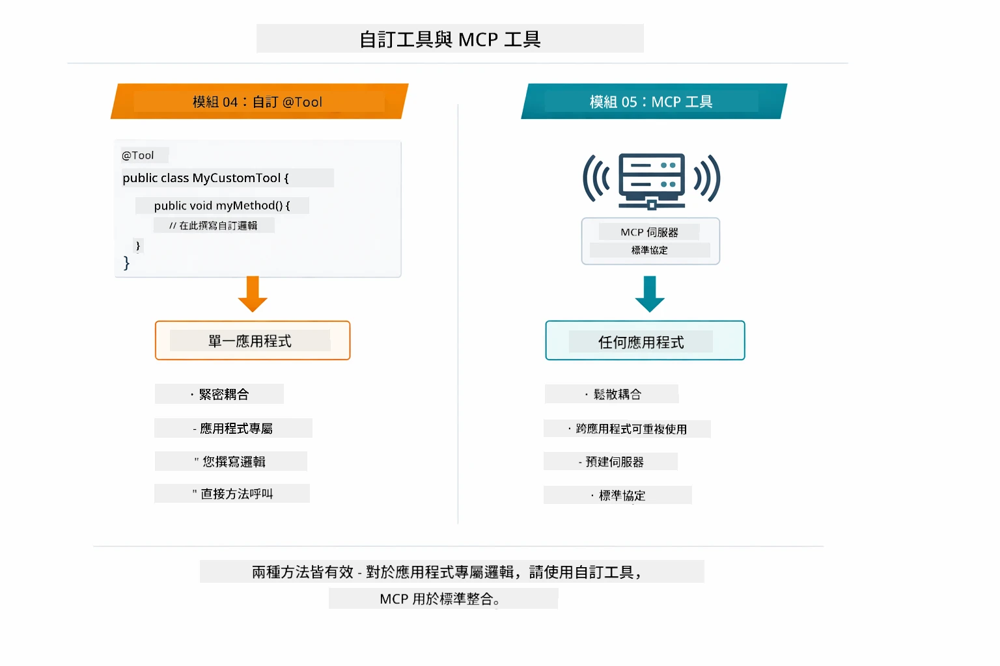

*自訂 @Tool 方法與 MCP 工具使用時機比較 — 自訂工具適用於應用專用邏輯及完整類型安全，MCP 工具則適合各應用共用的標準化整合。*

## 恭喜！  

您已完成 LangChain4j 初學者課程所有五個模組！以下是您完整的學習旅程——從基礎聊天一路到 MCP 驅動的代理系統：

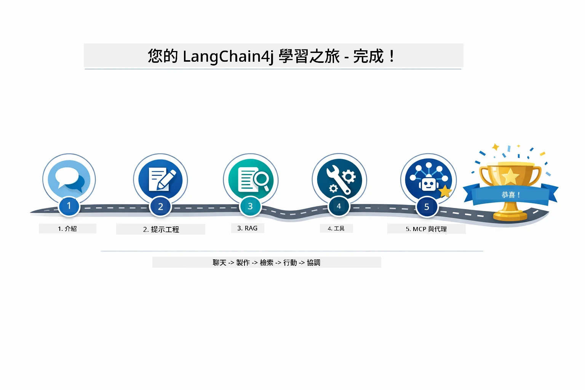

*您從基礎聊天到 MCP 驅動代理系統的全階段學習旅程。*

您已完成 LangChain4j 初學者課程，學會了：

- 如何建構有記憶功能的對話式 AI（模組 01）  
- 適用於不同任務的提示工程模式（模組 02）  
- 使用 RAG 將回應根植於您的文件（模組 03）  
- 使用自訂工具建立基礎 AI 代理（模組 04）  
- 將標準化工具與 LangChain4j MCP 和代理模組整合（模組 05）  

### 接下來？  

完成模組後，請探索[測試指南](../docs/TESTING.md) 來體驗 LangChain4j 測試概念。

**官方資源：**  
- [LangChain4j 文件](https://docs.langchain4j.dev/) - 全面指南及 API 參考  
- [LangChain4j GitHub](https://github.com/langchain4j/langchain4j) - 原始碼與範例  
- [LangChain4j 教學](https://docs.langchain4j.dev/tutorials/) - 各種用例的逐步教學  

感謝您完成本課程！

---

**導覽：** [← 上一篇：模組 04 - 工具](../04-tools/README.md) | [返回主頁](../README.md)

---

<!-- CO-OP TRANSLATOR DISCLAIMER START -->
**免責聲明**：  
本文件使用 AI 翻譯服務 [Co-op Translator](https://github.com/Azure/co-op-translator) 進行翻譯。雖我們致力於提供準確的翻譯，但請注意，自動翻譯可能包含錯誤或不準確之處。原始文件的母語版本應視為權威來源。對於重要資訊，建議採用專業人工翻譯。對於因使用本翻譯而產生的任何誤解或誤譯，我們不承擔任何責任。
<!-- CO-OP TRANSLATOR DISCLAIMER END -->